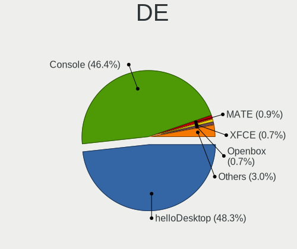
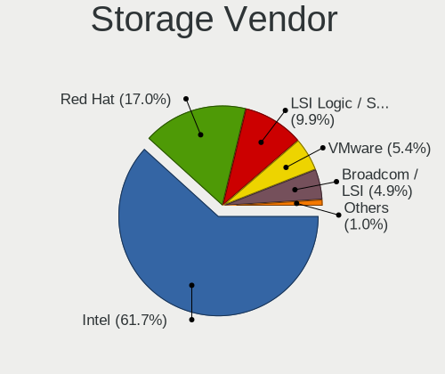
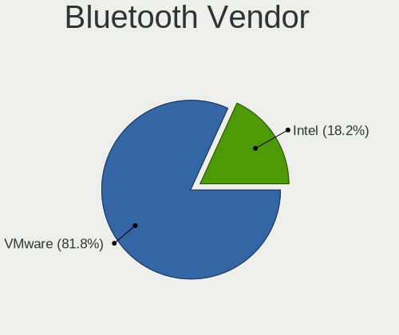

BSD - Tested Virtual Hardware & Statistics
------------------------------------------

A project to collect tested virtual hardware configurations for BSD.

Anyone can contribute to this report by the [hw-probe](https://github.com/linuxhw/hw-probe/blob/master/INSTALL.BSD.md) tool:

    hw-probe -all -upload

Please contribute! Especially if your hardware is rare.

OS-specific reports: [FreeBSD](/Dist/FreeBSD), [helloSystem](/Dist/helloSystem), [OpenBSD](/Dist/OpenBSD), [OPNsense](/Dist/OPNsense).

This report is for virtual hardware. Report for real hardware: [TestCoverage](https://github.com/bsdhw/TestCoverage)

Contents
--------

* [ Test Cases ](#test-cases)

* [ System ](#system)
  - [ OS                       ](#os)
  - [ OS Family                ](#os-family)
  - [ Arch                     ](#arch)
  - [ DE                       ](#de)
  - [ Display Server           ](#display-server)
  - [ Display Manager          ](#display-manager)
  - [ OS Lang                  ](#os-lang)
  - [ Boot Mode                ](#boot-mode)
  - [ Filesystem               ](#filesystem)
  - [ Part. scheme             ](#part-scheme)

* [ Board ](#board)
  - [ Vendor                   ](#vendor)
  - [ Model                    ](#model)
  - [ Model Family             ](#model-family)
  - [ MFG Year                 ](#mfg-year)
  - [ Form Factor              ](#form-factor)
  - [ Coreboot                 ](#coreboot)
  - [ RAM Size                 ](#ram-size)
  - [ RAM Used                 ](#ram-used)
  - [ Total Drives             ](#total-drives)
  - [ Has CD-ROM               ](#has-cd-rom)
  - [ Has Ethernet             ](#has-ethernet)
  - [ Has WiFi                 ](#has-wifi)
  - [ Has Bluetooth            ](#has-bluetooth)

* [ Location ](#location)
  - [ Country                  ](#country)
  - [ City                     ](#city)

* [ Drives ](#drives)
  - [ Drive Vendor             ](#drive-vendor)
  - [ Drive Model              ](#drive-model)
  - [ HDD Vendor               ](#hdd-vendor)
  - [ SSD Vendor               ](#ssd-vendor)
  - [ Drive Kind               ](#drive-kind)
  - [ Drive Connector          ](#drive-connector)
  - [ Drive Size               ](#drive-size)
  - [ Space Total              ](#space-total)
  - [ Space Used               ](#space-used)
  - [ Malfunc. Drives          ](#malfunc-drives)
  - [ Malfunc. Drive Vendor    ](#malfunc-drive-vendor)
  - [ Malfunc. HDD Vendor      ](#malfunc-hdd-vendor)
  - [ Malfunc. Drive Kind      ](#malfunc-drive-kind)
  - [ Failed Drives            ](#failed-drives)
  - [ Failed Drive Vendor      ](#failed-drive-vendor)
  - [ Drive Status             ](#drive-status)

* [ Storage controller ](#storage-controller)
  - [ Storage Vendor           ](#storage-vendor)
  - [ Storage Model            ](#storage-model)
  - [ Storage Kind             ](#storage-kind)

* [ Processor ](#processor)
  - [ CPU Vendor               ](#cpu-vendor)
  - [ CPU Model                ](#cpu-model)
  - [ CPU Model Family         ](#cpu-model-family)
  - [ CPU Cores                ](#cpu-cores)
  - [ CPU Sockets              ](#cpu-sockets)
  - [ CPU Threads              ](#cpu-threads)
  - [ CPU Microarch            ](#cpu-microarch)

* [ Graphics ](#graphics)
  - [ GPU Vendor               ](#gpu-vendor)
  - [ GPU Model                ](#gpu-model)
  - [ GPU Combo                ](#gpu-combo)
  - [ GPU Driver               ](#gpu-driver)
  - [ GPU Memory               ](#gpu-memory)

* [ Monitor ](#monitor)
  - [ Monitor Vendor           ](#monitor-vendor)
  - [ Monitor Model            ](#monitor-model)
  - [ Monitor Resolution       ](#monitor-resolution)
  - [ Monitor Diagonal         ](#monitor-diagonal)
  - [ Monitor Width            ](#monitor-width)
  - [ Aspect Ratio             ](#aspect-ratio)
  - [ Monitor Area             ](#monitor-area)
  - [ Pixel Density            ](#pixel-density)
  - [ Multiple Monitors        ](#multiple-monitors)

* [ Network ](#network)
  - [ Net Controller Vendor    ](#net-controller-vendor)
  - [ Net Controller Model     ](#net-controller-model)
  - [ Wireless Vendor          ](#wireless-vendor)
  - [ Wireless Model           ](#wireless-model)
  - [ Ethernet Vendor          ](#ethernet-vendor)
  - [ Ethernet Model           ](#ethernet-model)
  - [ Net Controller Kind      ](#net-controller-kind)
  - [ Used Controller          ](#used-controller)
  - [ NICs                     ](#nics)
  - [ IPv6                     ](#ipv6)

* [ Bluetooth ](#bluetooth)
  - [ Bluetooth Vendor         ](#bluetooth-vendor)
  - [ Bluetooth Model          ](#bluetooth-model)

* [ Sound ](#sound)
  - [ Sound Vendor             ](#sound-vendor)
  - [ Sound Model              ](#sound-model)

* [ Memory ](#memory)
  - [ Memory Vendor            ](#memory-vendor)
  - [ Memory Model             ](#memory-model)
  - [ Memory Kind              ](#memory-kind)
  - [ Memory Form Factor       ](#memory-form-factor)
  - [ Memory Size              ](#memory-size)
  - [ Memory Speed             ](#memory-speed)

* [ Printers & scanners ](#printers--scanners)
  - [ Printer Vendor           ](#printer-vendor)
  - [ Printer Model            ](#printer-model)
  - [ Scanner Vendor           ](#scanner-vendor)
  - [ Scanner Model            ](#scanner-model)

* [ Camera ](#camera)
  - [ Camera Vendor            ](#camera-vendor)
  - [ Camera Model             ](#camera-model)

* [ Security ](#security)
  - [ Fingerprint Vendor       ](#fingerprint-vendor)
  - [ Fingerprint Model        ](#fingerprint-model)
  - [ Chipcard Vendor          ](#chipcard-vendor)
  - [ Chipcard Model           ](#chipcard-model)

* [ Unsupported ](#unsupported)
  - [ Unsupported Devices      ](#unsupported-devices)
  - [ Unsupported Device Types ](#unsupported-device-types)

Test Cases
----------

Total: 1564

| Vendor        | Model                       | Form-Factor     | Probe                                                     | Date         |
|---------------|-----------------------------|-----------------|-----------------------------------------------------------|--------------|
| VMware        | Virtual Platform            | Virtual machine | [af4cb4ad07](https://bsd-hardware.info/?probe=af4cb4ad07) | Apr 16, 2022 |
| VMware        | VMware7,1                   | Virtual machine | [d40effaa2a](https://bsd-hardware.info/?probe=d40effaa2a) | Apr 16, 2022 |
| QEMU          | Standard PC (i440FX + PI... | Virtual machine | [310b2b6347](https://bsd-hardware.info/?probe=310b2b6347) | Apr 16, 2022 |
| QEMU          | Standard PC (Q35 + ICH9,... | Virtual machine | [41be770451](https://bsd-hardware.info/?probe=41be770451) | Apr 16, 2022 |
| VMware        | Virtual Platform            | Virtual machine | [0b11e0ec70](https://bsd-hardware.info/?probe=0b11e0ec70) | Apr 16, 2022 |
| VMware        | VMware7,1                   | Virtual machine | [e86b13fdb6](https://bsd-hardware.info/?probe=e86b13fdb6) | Apr 15, 2022 |
| QEMU          | Standard PC (i440FX + PI... | Virtual machine | [f85cca5b62](https://bsd-hardware.info/?probe=f85cca5b62) | Apr 15, 2022 |
| QEMU          | Standard PC (i440FX + PI... | Virtual machine | [95977d9439](https://bsd-hardware.info/?probe=95977d9439) | Apr 15, 2022 |
| Microsoft     | Virtual Machine Hyper-V ... | Virtual machine | [de7b86ff88](https://bsd-hardware.info/?probe=de7b86ff88) | Apr 15, 2022 |
| Oracle        | VirtualBox                  | Virtual machine | [05f7c4c735](https://bsd-hardware.info/?probe=05f7c4c735) | Apr 14, 2022 |
| QEMU          | Standard PC (Q35 + ICH9,... | Virtual machine | [5a1cd5c8d3](https://bsd-hardware.info/?probe=5a1cd5c8d3) | Apr 14, 2022 |
| VMware        | Virtual Platform            | Virtual machine | [ab6afd7628](https://bsd-hardware.info/?probe=ab6afd7628) | Apr 14, 2022 |
| Microsoft     | Virtual Machine Hyper-V ... | Virtual machine | [df1da3efc4](https://bsd-hardware.info/?probe=df1da3efc4) | Apr 14, 2022 |
| QEMU          | Standard PC (i440FX + PI... | Virtual machine | [ad4683dc6e](https://bsd-hardware.info/?probe=ad4683dc6e) | Apr 14, 2022 |
| VMware        | Virtual Platform            | Virtual machine | [3faa9c69c8](https://bsd-hardware.info/?probe=3faa9c69c8) | Apr 13, 2022 |
| Oracle        | VirtualBox                  | Virtual machine | [df7d0950f2](https://bsd-hardware.info/?probe=df7d0950f2) | Apr 13, 2022 |
| Oracle        | VirtualBox                  | Virtual machine | [ccb1855cbf](https://bsd-hardware.info/?probe=ccb1855cbf) | Apr 12, 2022 |
| VMware        | Virtual Platform            | Virtual machine | [1c89aaa0bd](https://bsd-hardware.info/?probe=1c89aaa0bd) | Apr 12, 2022 |
| Microsoft     | Virtual Machine             | Virtual machine | [41bfb06ff1](https://bsd-hardware.info/?probe=41bfb06ff1) | Apr 12, 2022 |
| FreeBSD       | BHYVE                       | Virtual machine | [854644c267](https://bsd-hardware.info/?probe=854644c267) | Apr 11, 2022 |
| QEMU          | Standard PC (i440FX + PI... | Virtual machine | [7a90e0c775](https://bsd-hardware.info/?probe=7a90e0c775) | Apr 10, 2022 |
| QEMU          | Standard PC (i440FX + PI... | Virtual machine | [6b7fb60614](https://bsd-hardware.info/?probe=6b7fb60614) | Apr 10, 2022 |
| QEMU          | Standard PC (i440FX + PI... | Virtual machine | [3df4bfa581](https://bsd-hardware.info/?probe=3df4bfa581) | Apr 10, 2022 |
| Oracle        | VirtualBox                  | Virtual machine | [d49d6f4927](https://bsd-hardware.info/?probe=d49d6f4927) | Apr 10, 2022 |
| Oracle        | VirtualBox                  | Virtual machine | [49db3c0de4](https://bsd-hardware.info/?probe=49db3c0de4) | Apr 10, 2022 |
| VMware        | Virtual Platform            | Virtual machine | [367262c999](https://bsd-hardware.info/?probe=367262c999) | Apr 09, 2022 |
| Oracle        | VirtualBox                  | Virtual machine | [67729f7fb1](https://bsd-hardware.info/?probe=67729f7fb1) | Apr 09, 2022 |
| Oracle        | VirtualBox                  | Virtual machine | [118429c57f](https://bsd-hardware.info/?probe=118429c57f) | Apr 09, 2022 |
| VMware        | Virtual Platform            | Virtual machine | [3b8620b5a1](https://bsd-hardware.info/?probe=3b8620b5a1) | Apr 08, 2022 |
| VMware        | Virtual Platform            | Virtual machine | [788428160a](https://bsd-hardware.info/?probe=788428160a) | Apr 08, 2022 |
| QEMU          | Standard PC (Q35 + ICH9,... | Virtual machine | [f3dcb52139](https://bsd-hardware.info/?probe=f3dcb52139) | Apr 08, 2022 |
| netcup        | KVM Server                  | Virtual machine | [872a423998](https://bsd-hardware.info/?probe=872a423998) | Apr 07, 2022 |
| QEMU          | Standard PC (Q35 + ICH9,... | Virtual machine | [618df3c9bc](https://bsd-hardware.info/?probe=618df3c9bc) | Apr 07, 2022 |
| VMware        | VMware7,1                   | Virtual machine | [271149bf57](https://bsd-hardware.info/?probe=271149bf57) | Apr 07, 2022 |
| Xen           | HVM domU                    | Virtual machine | [0d7e9bb811](https://bsd-hardware.info/?probe=0d7e9bb811) | Apr 07, 2022 |
| Xen           | HVM domU                    | Virtual machine | [5a65bca2da](https://bsd-hardware.info/?probe=5a65bca2da) | Apr 07, 2022 |
| VMware        | Virtual Platform            | Virtual machine | [ebd2432d93](https://bsd-hardware.info/?probe=ebd2432d93) | Apr 07, 2022 |
| QEMU          | Standard PC (i440FX + PI... | Virtual machine | [60277bdb1a](https://bsd-hardware.info/?probe=60277bdb1a) | Apr 07, 2022 |
| QEMU          | Standard PC (i440FX + PI... | Virtual machine | [d2ab08de39](https://bsd-hardware.info/?probe=d2ab08de39) | Apr 06, 2022 |
| VMware        | VMware7,1                   | Virtual machine | [1021d17783](https://bsd-hardware.info/?probe=1021d17783) | Apr 06, 2022 |
| QEMU          | Standard PC (Q35 + ICH9,... | Virtual machine | [3126923f2b](https://bsd-hardware.info/?probe=3126923f2b) | Apr 06, 2022 |
| Oracle        | VirtualBox                  | Virtual machine | [d412e3e881](https://bsd-hardware.info/?probe=d412e3e881) | Apr 06, 2022 |
| QEMU          | Standard PC (i440FX + PI... | Virtual machine | [c6510d7e09](https://bsd-hardware.info/?probe=c6510d7e09) | Apr 06, 2022 |
| QEMU          | Standard PC (Q35 + ICH9,... | Virtual machine | [5647e3d08b](https://bsd-hardware.info/?probe=5647e3d08b) | Apr 05, 2022 |
| Oracle        | VirtualBox                  | Virtual machine | [85f80326bf](https://bsd-hardware.info/?probe=85f80326bf) | Apr 05, 2022 |
| VMware        | Virtual Platform            | Virtual machine | [eb78e78ecc](https://bsd-hardware.info/?probe=eb78e78ecc) | Apr 05, 2022 |
| illumos       | BHYVE                       | Virtual machine | [6ec61b0d00](https://bsd-hardware.info/?probe=6ec61b0d00) | Apr 05, 2022 |
| QEMU          | Standard PC (i440FX + PI... | Virtual machine | [d6903c0734](https://bsd-hardware.info/?probe=d6903c0734) | Apr 05, 2022 |
| QEMU          | Standard PC (i440FX + PI... | Virtual machine | [26ac3d0c43](https://bsd-hardware.info/?probe=26ac3d0c43) | Apr 05, 2022 |
| VMware        | Virtual Platform            | Virtual machine | [e027277319](https://bsd-hardware.info/?probe=e027277319) | Apr 04, 2022 |
| QEMU          | Standard PC (i440FX + PI... | Virtual machine | [c289a6a163](https://bsd-hardware.info/?probe=c289a6a163) | Apr 04, 2022 |
| Oracle        | VirtualBox                  | Virtual machine | [ee370f5146](https://bsd-hardware.info/?probe=ee370f5146) | Apr 04, 2022 |
| QEMU          | Standard PC (i440FX + PI... | Virtual machine | [a53a2079b5](https://bsd-hardware.info/?probe=a53a2079b5) | Apr 03, 2022 |
| QEMU          | Standard PC (i440FX + PI... | Virtual machine | [339562a942](https://bsd-hardware.info/?probe=339562a942) | Apr 03, 2022 |
| Oracle        | VirtualBox                  | Virtual machine | [ad49fb1a53](https://bsd-hardware.info/?probe=ad49fb1a53) | Apr 03, 2022 |
| QEMU          | Standard PC (i440FX + PI... | Virtual machine | [214f771fca](https://bsd-hardware.info/?probe=214f771fca) | Apr 02, 2022 |
| Oracle        | VirtualBox                  | Virtual machine | [93efa3ff47](https://bsd-hardware.info/?probe=93efa3ff47) | Apr 01, 2022 |
| Xen           | HVM domU                    | Virtual machine | [3241123171](https://bsd-hardware.info/?probe=3241123171) | Apr 01, 2022 |
| VMware        | Virtual Platform            | Virtual machine | [2493f92689](https://bsd-hardware.info/?probe=2493f92689) | Mar 31, 2022 |
| QEMU          | Standard PC (Q35 + ICH9,... | Virtual machine | [a5c325a7f7](https://bsd-hardware.info/?probe=a5c325a7f7) | Mar 30, 2022 |
| VMware        | Virtual Platform            | Virtual machine | [6826ea9501](https://bsd-hardware.info/?probe=6826ea9501) | Mar 30, 2022 |
| Oracle        | VirtualBox                  | Virtual machine | [3c49e50a01](https://bsd-hardware.info/?probe=3c49e50a01) | Mar 30, 2022 |
| QEMU          | Standard PC (i440FX + PI... | Virtual machine | [07f947a837](https://bsd-hardware.info/?probe=07f947a837) | Mar 30, 2022 |
| Oracle        | VirtualBox                  | Virtual machine | [dfdf9b75b3](https://bsd-hardware.info/?probe=dfdf9b75b3) | Mar 29, 2022 |
| QEMU          | Standard PC (Q35 + ICH9,... | Virtual machine | [6b9fb8dc9d](https://bsd-hardware.info/?probe=6b9fb8dc9d) | Mar 29, 2022 |
| Oracle        | VirtualBox                  | Virtual machine | [9edc2f45c2](https://bsd-hardware.info/?probe=9edc2f45c2) | Mar 29, 2022 |
| QEMU          | Standard PC (i440FX + PI... | Virtual machine | [481e8247af](https://bsd-hardware.info/?probe=481e8247af) | Mar 28, 2022 |
| QEMU          | Standard PC (Q35 + ICH9,... | Virtual machine | [b91a7f2c00](https://bsd-hardware.info/?probe=b91a7f2c00) | Mar 28, 2022 |
| VMware        | VMware7,1                   | Virtual machine | [428b879e2e](https://bsd-hardware.info/?probe=428b879e2e) | Mar 27, 2022 |
| VMware        | Virtual Platform            | Virtual machine | [f63196f9a5](https://bsd-hardware.info/?probe=f63196f9a5) | Mar 27, 2022 |
| VMware        | Virtual Platform            | Virtual machine | [6ece515031](https://bsd-hardware.info/?probe=6ece515031) | Mar 27, 2022 |
| QEMU          | Standard PC (i440FX + PI... | Virtual machine | [fb604904c1](https://bsd-hardware.info/?probe=fb604904c1) | Mar 27, 2022 |
| VMware        | Virtual Platform            | Virtual machine | [27be83ab6e](https://bsd-hardware.info/?probe=27be83ab6e) | Mar 26, 2022 |
| QEMU          | Standard PC (i440FX + PI... | Virtual machine | [6c9f6c0a0c](https://bsd-hardware.info/?probe=6c9f6c0a0c) | Mar 26, 2022 |
| Oracle        | VirtualBox                  | Virtual machine | [d2f2d386fc](https://bsd-hardware.info/?probe=d2f2d386fc) | Mar 23, 2022 |
| Oracle        | VirtualBox                  | Virtual machine | [3b3ca0a339](https://bsd-hardware.info/?probe=3b3ca0a339) | Mar 22, 2022 |
| QEMU          | Standard PC (i440FX + PI... | Virtual machine | [1a01f5b8ae](https://bsd-hardware.info/?probe=1a01f5b8ae) | Mar 22, 2022 |
| QEMU          | Standard PC (i440FX + PI... | Virtual machine | [f8b5850fde](https://bsd-hardware.info/?probe=f8b5850fde) | Mar 22, 2022 |
| VMware        | Virtual Platform            | Virtual machine | [fd972a2d84](https://bsd-hardware.info/?probe=fd972a2d84) | Mar 22, 2022 |
| QEMU          | Standard PC (Q35 + ICH9,... | Virtual machine | [3951a0c5b3](https://bsd-hardware.info/?probe=3951a0c5b3) | Mar 21, 2022 |
| QEMU          | Standard PC (Q35 + ICH9,... | Virtual machine | [0e1de894a2](https://bsd-hardware.info/?probe=0e1de894a2) | Mar 21, 2022 |
| Microsoft     | Virtual Machine             | Virtual machine | [d890f432ff](https://bsd-hardware.info/?probe=d890f432ff) | Mar 21, 2022 |
| QEMU          | Standard PC (i440FX + PI... | Virtual machine | [1cce114d95](https://bsd-hardware.info/?probe=1cce114d95) | Mar 21, 2022 |
| QEMU          | Standard PC (i440FX + PI... | Virtual machine | [6102e9d412](https://bsd-hardware.info/?probe=6102e9d412) | Mar 21, 2022 |
| QEMU          | Standard PC (Q35 + ICH9,... | Virtual machine | [5a2a09a96b](https://bsd-hardware.info/?probe=5a2a09a96b) | Mar 20, 2022 |
| QEMU          | Standard PC (i440FX + PI... | Virtual machine | [e889c353cc](https://bsd-hardware.info/?probe=e889c353cc) | Mar 20, 2022 |
| QEMU          | Standard PC (Q35 + ICH9,... | Virtual machine | [5caff18074](https://bsd-hardware.info/?probe=5caff18074) | Mar 20, 2022 |
| Oracle        | VirtualBox                  | Virtual machine | [4d1479f81e](https://bsd-hardware.info/?probe=4d1479f81e) | Mar 19, 2022 |
| Oracle        | VirtualBox                  | Virtual machine | [3882cd466c](https://bsd-hardware.info/?probe=3882cd466c) | Mar 19, 2022 |
| Microsoft     | Virtual Machine             | Virtual machine | [39e69aec6a](https://bsd-hardware.info/?probe=39e69aec6a) | Mar 19, 2022 |
| Oracle        | VirtualBox                  | Virtual machine | [cff9030538](https://bsd-hardware.info/?probe=cff9030538) | Mar 19, 2022 |
| Oracle        | VirtualBox                  | Virtual machine | [4d9622e0d8](https://bsd-hardware.info/?probe=4d9622e0d8) | Mar 19, 2022 |
| QEMU          | Standard PC (i440FX + PI... | Virtual machine | [6549f90a0c](https://bsd-hardware.info/?probe=6549f90a0c) | Mar 19, 2022 |
| VMware        | Virtual Platform            | Virtual machine | [4e48649550](https://bsd-hardware.info/?probe=4e48649550) | Mar 19, 2022 |
| Oracle        | VirtualBox                  | Virtual machine | [6fc5993f63](https://bsd-hardware.info/?probe=6fc5993f63) | Mar 18, 2022 |
| Oracle        | VirtualBox                  | Virtual machine | [cdce90695b](https://bsd-hardware.info/?probe=cdce90695b) | Mar 18, 2022 |
| Microsoft     | Virtual Machine             | Virtual machine | [9abad6bdc6](https://bsd-hardware.info/?probe=9abad6bdc6) | Mar 18, 2022 |
| Oracle        | VirtualBox                  | Virtual machine | [6bf2f5e1df](https://bsd-hardware.info/?probe=6bf2f5e1df) | Mar 18, 2022 |
| VMware        | Virtual Platform            | Virtual machine | [823be25bbd](https://bsd-hardware.info/?probe=823be25bbd) | Mar 17, 2022 |
| VMware        | Virtual Platform            | Virtual machine | [b726632e57](https://bsd-hardware.info/?probe=b726632e57) | Mar 16, 2022 |
| QEMU          | Standard PC (i440FX + PI... | Virtual machine | [23c4c2b8f3](https://bsd-hardware.info/?probe=23c4c2b8f3) | Mar 16, 2022 |
| Oracle        | VirtualBox                  | Virtual machine | [134c9de158](https://bsd-hardware.info/?probe=134c9de158) | Mar 15, 2022 |
| VMware        | Virtual Platform            | Virtual machine | [9a87e4468f](https://bsd-hardware.info/?probe=9a87e4468f) | Mar 15, 2022 |
| QEMU          | Standard PC (i440FX + PI... | Virtual machine | [e66e0e2e58](https://bsd-hardware.info/?probe=e66e0e2e58) | Mar 15, 2022 |
| QEMU          | Standard PC (i440FX + PI... | Virtual machine | [084d219031](https://bsd-hardware.info/?probe=084d219031) | Mar 15, 2022 |
| Parallels ... | Parallels Virtual Platfo... | Virtual machine | [96667f713a](https://bsd-hardware.info/?probe=96667f713a) | Mar 15, 2022 |
| Oracle        | VirtualBox                  | Virtual machine | [989d85149c](https://bsd-hardware.info/?probe=989d85149c) | Mar 14, 2022 |
| Microsoft     | Virtual Machine             | Virtual machine | [94fd829068](https://bsd-hardware.info/?probe=94fd829068) | Mar 14, 2022 |
| VMware        | Virtual Platform            | Virtual machine | [7d3e869b21](https://bsd-hardware.info/?probe=7d3e869b21) | Mar 14, 2022 |
| Oracle        | VirtualBox                  | Virtual machine | [4444b5cf07](https://bsd-hardware.info/?probe=4444b5cf07) | Mar 14, 2022 |
| Oracle        | VirtualBox                  | Virtual machine | [d320328261](https://bsd-hardware.info/?probe=d320328261) | Mar 13, 2022 |
| VMware        | Virtual Platform            | Virtual machine | [b597dc5d23](https://bsd-hardware.info/?probe=b597dc5d23) | Mar 12, 2022 |
| QEMU          | Standard PC pc-i440fx-4.... | Virtual machine | [f064e9e102](https://bsd-hardware.info/?probe=f064e9e102) | Mar 11, 2022 |
| QEMU          | Standard PC (Q35 + ICH9,... | Virtual machine | [2cff4a152c](https://bsd-hardware.info/?probe=2cff4a152c) | Mar 11, 2022 |
| QEMU          | Standard PC (Q35 + ICH9,... | Virtual machine | [c2e04b9448](https://bsd-hardware.info/?probe=c2e04b9448) | Mar 11, 2022 |
| QEMU          | Standard PC (Q35 + ICH9,... | Virtual machine | [6cf3d1a191](https://bsd-hardware.info/?probe=6cf3d1a191) | Mar 11, 2022 |
| Oracle        | VirtualBox                  | Virtual machine | [314de8f62d](https://bsd-hardware.info/?probe=314de8f62d) | Mar 10, 2022 |
| QEMU          | Standard PC (i440FX + PI... | Virtual machine | [9197c71fa8](https://bsd-hardware.info/?probe=9197c71fa8) | Mar 10, 2022 |
| Oracle        | VirtualBox                  | Virtual machine | [d149fc9860](https://bsd-hardware.info/?probe=d149fc9860) | Mar 10, 2022 |
| Oracle        | VirtualBox                  | Virtual machine | [deb91b3593](https://bsd-hardware.info/?probe=deb91b3593) | Mar 10, 2022 |
| VMware        | Virtual Platform            | Virtual machine | [c1fdcfe885](https://bsd-hardware.info/?probe=c1fdcfe885) | Mar 09, 2022 |
| VMware        | VMware7,1                   | Virtual machine | [c3c8b6a1c3](https://bsd-hardware.info/?probe=c3c8b6a1c3) | Mar 08, 2022 |
| VMware        | VMware7,1                   | Virtual machine | [713031779a](https://bsd-hardware.info/?probe=713031779a) | Mar 08, 2022 |
| VMware        | Virtual Platform            | Virtual machine | [f72269d3f8](https://bsd-hardware.info/?probe=f72269d3f8) | Mar 07, 2022 |
| Oracle        | VirtualBox                  | Virtual machine | [4e000dba96](https://bsd-hardware.info/?probe=4e000dba96) | Mar 07, 2022 |
| Microsoft     | Virtual Machine             | Virtual machine | [a20f128c47](https://bsd-hardware.info/?probe=a20f128c47) | Mar 07, 2022 |
| VMware        | Virtual Platform            | Virtual machine | [301108c2aa](https://bsd-hardware.info/?probe=301108c2aa) | Mar 06, 2022 |
| VMware        | VMware7,1                   | Virtual machine | [074a65ad80](https://bsd-hardware.info/?probe=074a65ad80) | Mar 06, 2022 |
| QEMU          | Standard PC (i440FX + PI... | Virtual machine | [e21a46e8a1](https://bsd-hardware.info/?probe=e21a46e8a1) | Mar 06, 2022 |
| QEMU          | Standard PC (i440FX + PI... | Virtual machine | [2ee94c5af5](https://bsd-hardware.info/?probe=2ee94c5af5) | Mar 06, 2022 |
| VMware        | Virtual Platform            | Virtual machine | [59f4e751bf](https://bsd-hardware.info/?probe=59f4e751bf) | Mar 06, 2022 |
| QEMU          | Standard PC (i440FX + PI... | Virtual machine | [6b44b82aa9](https://bsd-hardware.info/?probe=6b44b82aa9) | Mar 06, 2022 |
| QEMU          | Standard PC (i440FX + PI... | Virtual machine | [d29cab453b](https://bsd-hardware.info/?probe=d29cab453b) | Mar 05, 2022 |
| QEMU          | Standard PC (i440FX + PI... | Virtual machine | [655bb74d18](https://bsd-hardware.info/?probe=655bb74d18) | Mar 04, 2022 |
| QEMU          | Standard PC (i440FX + PI... | Virtual machine | [e299650a49](https://bsd-hardware.info/?probe=e299650a49) | Mar 04, 2022 |
| Oracle        | VirtualBox                  | Virtual machine | [d610b42195](https://bsd-hardware.info/?probe=d610b42195) | Mar 03, 2022 |
| VMware        | Virtual Platform            | Virtual machine | [e0a722203e](https://bsd-hardware.info/?probe=e0a722203e) | Mar 03, 2022 |
| VMware        | Virtual Platform            | Virtual machine | [2ba4fd4d87](https://bsd-hardware.info/?probe=2ba4fd4d87) | Mar 03, 2022 |
| Oracle        | VirtualBox                  | Virtual machine | [e5db85f426](https://bsd-hardware.info/?probe=e5db85f426) | Mar 02, 2022 |
| Oracle        | VirtualBox                  | Virtual machine | [3e6f077bf3](https://bsd-hardware.info/?probe=3e6f077bf3) | Mar 01, 2022 |
| QEMU          | Standard PC (Q35 + ICH9,... | Virtual machine | [c093cad68f](https://bsd-hardware.info/?probe=c093cad68f) | Feb 27, 2022 |
| QEMU          | Standard PC (i440FX + PI... | Virtual machine | [5aa3bf8b98](https://bsd-hardware.info/?probe=5aa3bf8b98) | Feb 26, 2022 |
| Oracle        | VirtualBox                  | Virtual machine | [9418f0f9a8](https://bsd-hardware.info/?probe=9418f0f9a8) | Feb 26, 2022 |
| Oracle        | VirtualBox                  | Virtual machine | [de76a48a2c](https://bsd-hardware.info/?probe=de76a48a2c) | Feb 25, 2022 |
| VMware        | VMware7,1                   | Virtual machine | [e9a676ea02](https://bsd-hardware.info/?probe=e9a676ea02) | Feb 24, 2022 |
| VMware        | Virtual Platform            | Virtual machine | [d4915d1b7b](https://bsd-hardware.info/?probe=d4915d1b7b) | Feb 24, 2022 |
| Oracle        | VirtualBox                  | Virtual machine | [32a9909746](https://bsd-hardware.info/?probe=32a9909746) | Feb 24, 2022 |
| Oracle        | VirtualBox                  | Virtual machine | [053dc80315](https://bsd-hardware.info/?probe=053dc80315) | Feb 24, 2022 |
| QEMU          | Standard PC (i440FX + PI... | Virtual machine | [3baf5d1636](https://bsd-hardware.info/?probe=3baf5d1636) | Feb 23, 2022 |
| VMware        | Virtual Platform            | Virtual machine | [85f1bf7cd2](https://bsd-hardware.info/?probe=85f1bf7cd2) | Feb 23, 2022 |
| Oracle        | VirtualBox                  | Virtual machine | [9a40673104](https://bsd-hardware.info/?probe=9a40673104) | Feb 23, 2022 |
| VMware        | Virtual Platform            | Virtual machine | [13b3a17303](https://bsd-hardware.info/?probe=13b3a17303) | Feb 22, 2022 |
| QEMU          | Standard PC (i440FX + PI... | Virtual machine | [c7264d750b](https://bsd-hardware.info/?probe=c7264d750b) | Feb 22, 2022 |
| QEMU          | Standard PC (i440FX + PI... | Virtual machine | [91e91941fe](https://bsd-hardware.info/?probe=91e91941fe) | Feb 22, 2022 |
| Oracle        | VirtualBox                  | Virtual machine | [d597f3c634](https://bsd-hardware.info/?probe=d597f3c634) | Feb 21, 2022 |
| VMware        | Virtual Platform            | Virtual machine | [98b64b07b2](https://bsd-hardware.info/?probe=98b64b07b2) | Feb 21, 2022 |
| QEMU          | Standard PC (Q35 + ICH9,... | Virtual machine | [25301d436c](https://bsd-hardware.info/?probe=25301d436c) | Feb 21, 2022 |
| QEMU          | Standard PC (i440FX + PI... | Virtual machine | [f69d599f7f](https://bsd-hardware.info/?probe=f69d599f7f) | Feb 21, 2022 |
| VMware        | VMware7,1                   | Virtual machine | [1013fc879a](https://bsd-hardware.info/?probe=1013fc879a) | Feb 21, 2022 |
| QEMU          | Standard PC (i440FX + PI... | Virtual machine | [79e5761dde](https://bsd-hardware.info/?probe=79e5761dde) | Feb 20, 2022 |
| Oracle        | VirtualBox                  | Virtual machine | [bef4624555](https://bsd-hardware.info/?probe=bef4624555) | Feb 20, 2022 |
| VMware        | VMware7,1                   | Virtual machine | [13232256cf](https://bsd-hardware.info/?probe=13232256cf) | Feb 20, 2022 |
| VMware        | Virtual Platform            | Virtual machine | [992b446910](https://bsd-hardware.info/?probe=992b446910) | Feb 19, 2022 |
| QEMU          | Standard PC (i440FX + PI... | Virtual machine | [6ed56a55c6](https://bsd-hardware.info/?probe=6ed56a55c6) | Feb 19, 2022 |
| Oracle        | VirtualBox                  | Virtual machine | [8a355877e0](https://bsd-hardware.info/?probe=8a355877e0) | Feb 19, 2022 |
| VMware        | Virtual Platform            | Virtual machine | [1fbfd7d21d](https://bsd-hardware.info/?probe=1fbfd7d21d) | Feb 19, 2022 |
| QEMU          | Standard PC (i440FX + PI... | Virtual machine | [7457d4dc34](https://bsd-hardware.info/?probe=7457d4dc34) | Feb 18, 2022 |
| VMware        | Virtual Platform            | Virtual machine | [c05e2f90b7](https://bsd-hardware.info/?probe=c05e2f90b7) | Feb 16, 2022 |
| Oracle        | VirtualBox                  | Virtual machine | [946e6e8df8](https://bsd-hardware.info/?probe=946e6e8df8) | Feb 16, 2022 |
| VMware        | Virtual Platform            | Virtual machine | [f36c738b25](https://bsd-hardware.info/?probe=f36c738b25) | Feb 15, 2022 |
| VMware        | Virtual Platform            | Virtual machine | [41f294ee86](https://bsd-hardware.info/?probe=41f294ee86) | Feb 14, 2022 |
| Oracle        | VirtualBox                  | Virtual machine | [44694de708](https://bsd-hardware.info/?probe=44694de708) | Feb 14, 2022 |
| Oracle        | VirtualBox                  | Virtual machine | [f83eafe6f8](https://bsd-hardware.info/?probe=f83eafe6f8) | Feb 14, 2022 |
| VMware        | Virtual Platform            | Virtual machine | [5929c83f68](https://bsd-hardware.info/?probe=5929c83f68) | Feb 14, 2022 |
| VMware        | Virtual Platform            | Virtual machine | [732f9081cc](https://bsd-hardware.info/?probe=732f9081cc) | Feb 13, 2022 |
| Oracle        | VirtualBox                  | Virtual machine | [2b746d2b14](https://bsd-hardware.info/?probe=2b746d2b14) | Feb 12, 2022 |
| QEMU          | Standard PC (i440FX + PI... | Virtual machine | [3728572633](https://bsd-hardware.info/?probe=3728572633) | Feb 12, 2022 |
| QEMU          | Standard PC (i440FX + PI... | Virtual machine | [59e73c16b3](https://bsd-hardware.info/?probe=59e73c16b3) | Feb 11, 2022 |
| QEMU          | Standard PC (i440FX + PI... | Virtual machine | [49ff25d187](https://bsd-hardware.info/?probe=49ff25d187) | Feb 10, 2022 |
| VMware        | Virtual Platform            | Virtual machine | [07326d4763](https://bsd-hardware.info/?probe=07326d4763) | Feb 09, 2022 |
| VMware        | Virtual Platform            | Virtual machine | [ac6f582c4e](https://bsd-hardware.info/?probe=ac6f582c4e) | Feb 09, 2022 |
| Oracle        | VirtualBox                  | Virtual machine | [4d3c9a6511](https://bsd-hardware.info/?probe=4d3c9a6511) | Feb 09, 2022 |
| VMware        | Virtual Platform            | Virtual machine | [189f80edc8](https://bsd-hardware.info/?probe=189f80edc8) | Feb 09, 2022 |
| VMware        | Virtual Platform            | Virtual machine | [930a4f3e51](https://bsd-hardware.info/?probe=930a4f3e51) | Feb 09, 2022 |
| QEMU          | Standard PC (i440FX + PI... | Virtual machine | [fbe3e4a8eb](https://bsd-hardware.info/?probe=fbe3e4a8eb) | Feb 08, 2022 |
| Parallels ... | Parallels Virtual Platfo... | Virtual machine | [30b80d797d](https://bsd-hardware.info/?probe=30b80d797d) | Feb 07, 2022 |
| QEMU          | Standard PC (i440FX + PI... | Virtual machine | [a6e0338e22](https://bsd-hardware.info/?probe=a6e0338e22) | Feb 07, 2022 |
| QEMU          | Standard PC (i440FX + PI... | Virtual machine | [bc1010f45a](https://bsd-hardware.info/?probe=bc1010f45a) | Feb 07, 2022 |
| Oracle        | VirtualBox                  | Virtual machine | [865703ad58](https://bsd-hardware.info/?probe=865703ad58) | Feb 06, 2022 |
| QEMU          | Standard PC (i440FX + PI... | Virtual machine | [e6429395b8](https://bsd-hardware.info/?probe=e6429395b8) | Feb 06, 2022 |
| Unknown       | BHYVE                       | Virtual machine | [48690ecaea](https://bsd-hardware.info/?probe=48690ecaea) | Feb 06, 2022 |
| QEMU          | Standard PC (i440FX + PI... | Virtual machine | [04703922e1](https://bsd-hardware.info/?probe=04703922e1) | Feb 06, 2022 |
| VMware        | Virtual Platform            | Virtual machine | [bddddbed64](https://bsd-hardware.info/?probe=bddddbed64) | Feb 06, 2022 |
| QEMU          | Standard PC (Q35 + ICH9,... | Virtual machine | [1eccc62f5b](https://bsd-hardware.info/?probe=1eccc62f5b) | Feb 06, 2022 |
| Oracle        | VirtualBox                  | Virtual machine | [c5a5f0cddb](https://bsd-hardware.info/?probe=c5a5f0cddb) | Feb 05, 2022 |
| QEMU          | Standard PC (i440FX + PI... | Virtual machine | [ac008f2a8b](https://bsd-hardware.info/?probe=ac008f2a8b) | Feb 05, 2022 |
| Oracle        | VirtualBox                  | Virtual machine | [e460729008](https://bsd-hardware.info/?probe=e460729008) | Feb 04, 2022 |
| VMware        | VMware7,1                   | Virtual machine | [37b9a4892e](https://bsd-hardware.info/?probe=37b9a4892e) | Feb 04, 2022 |
| Oracle        | VirtualBox                  | Virtual machine | [c060908535](https://bsd-hardware.info/?probe=c060908535) | Feb 04, 2022 |
| VMware        | Virtual Platform            | Virtual machine | [ae949691df](https://bsd-hardware.info/?probe=ae949691df) | Feb 04, 2022 |
| VMware        | Virtual Platform            | Virtual machine | [f34333a47b](https://bsd-hardware.info/?probe=f34333a47b) | Feb 03, 2022 |
| QEMU          | Standard PC (i440FX + PI... | Virtual machine | [f15d1c7448](https://bsd-hardware.info/?probe=f15d1c7448) | Feb 03, 2022 |
| VMware        | Virtual Platform            | Virtual machine | [aefa0555be](https://bsd-hardware.info/?probe=aefa0555be) | Feb 03, 2022 |
| Oracle        | VirtualBox                  | Virtual machine | [6b59c67982](https://bsd-hardware.info/?probe=6b59c67982) | Feb 03, 2022 |
| QEMU          | Standard PC (i440FX + PI... | Virtual machine | [1137101df3](https://bsd-hardware.info/?probe=1137101df3) | Feb 02, 2022 |
| Oracle        | VirtualBox                  | Virtual machine | [70c6468200](https://bsd-hardware.info/?probe=70c6468200) | Feb 02, 2022 |
| VMware        | Virtual Platform            | Virtual machine | [78a96390d0](https://bsd-hardware.info/?probe=78a96390d0) | Feb 02, 2022 |
| QEMU          | Standard PC (i440FX + PI... | Virtual machine | [65d106688f](https://bsd-hardware.info/?probe=65d106688f) | Feb 02, 2022 |
| Oracle        | VirtualBox                  | Virtual machine | [09426e4998](https://bsd-hardware.info/?probe=09426e4998) | Feb 01, 2022 |
| QEMU          | Standard PC (Q35 + ICH9,... | Virtual machine | [086114a6df](https://bsd-hardware.info/?probe=086114a6df) | Feb 01, 2022 |
| Parallels ... | Parallels Virtual Platfo... | Virtual machine | [c148107992](https://bsd-hardware.info/?probe=c148107992) | Jan 31, 2022 |
| VMware        | Virtual Platform            | Virtual machine | [53c7985582](https://bsd-hardware.info/?probe=53c7985582) | Jan 31, 2022 |
| QEMU          | Standard PC (i440FX + PI... | Virtual machine | [134e196656](https://bsd-hardware.info/?probe=134e196656) | Jan 31, 2022 |
| QEMU          | Standard PC (Q35 + ICH9,... | Virtual machine | [79c8ada356](https://bsd-hardware.info/?probe=79c8ada356) | Jan 31, 2022 |
| Oracle        | VirtualBox                  | Virtual machine | [c6dbc4de55](https://bsd-hardware.info/?probe=c6dbc4de55) | Jan 31, 2022 |
| Oracle        | VirtualBox                  | Virtual machine | [001692b492](https://bsd-hardware.info/?probe=001692b492) | Jan 31, 2022 |
| Oracle        | VirtualBox                  | Virtual machine | [1ec85b0d86](https://bsd-hardware.info/?probe=1ec85b0d86) | Jan 30, 2022 |
| Oracle        | VirtualBox                  | Virtual machine | [e5c459a11b](https://bsd-hardware.info/?probe=e5c459a11b) | Jan 30, 2022 |
| VMware        | Virtual Platform            | Virtual machine | [4fa3f3593d](https://bsd-hardware.info/?probe=4fa3f3593d) | Jan 30, 2022 |
| VMware        | Virtual Platform            | Virtual machine | [ad6d3295ca](https://bsd-hardware.info/?probe=ad6d3295ca) | Jan 30, 2022 |
| Oracle        | VirtualBox                  | Virtual machine | [210be2bf7b](https://bsd-hardware.info/?probe=210be2bf7b) | Jan 30, 2022 |
| QEMU          | Standard PC (Q35 + ICH9,... | Virtual machine | [9c16576a87](https://bsd-hardware.info/?probe=9c16576a87) | Jan 30, 2022 |
| QEMU          | Standard PC (i440FX + PI... | Virtual machine | [9f0aae105f](https://bsd-hardware.info/?probe=9f0aae105f) | Jan 30, 2022 |
| Xen           | HVM domU                    | Virtual machine | [559e8c4f8b](https://bsd-hardware.info/?probe=559e8c4f8b) | Jan 30, 2022 |
| QEMU          | Standard PC (Q35 + ICH9,... | Virtual machine | [7162be2029](https://bsd-hardware.info/?probe=7162be2029) | Jan 30, 2022 |
| VMware        | Virtual Platform            | Virtual machine | [d48f03bd21](https://bsd-hardware.info/?probe=d48f03bd21) | Jan 30, 2022 |
| Oracle        | VirtualBox                  | Virtual machine | [1395b9056f](https://bsd-hardware.info/?probe=1395b9056f) | Jan 30, 2022 |
| QEMU          | Standard PC (i440FX + PI... | Virtual machine | [b1f7833cf0](https://bsd-hardware.info/?probe=b1f7833cf0) | Jan 29, 2022 |
| Microsoft     | Virtual Machine             | Virtual machine | [28db614986](https://bsd-hardware.info/?probe=28db614986) | Jan 29, 2022 |
| VMware        | Virtual Platform            | Virtual machine | [183f11233c](https://bsd-hardware.info/?probe=183f11233c) | Jan 29, 2022 |
| VMware        | VMware7,1                   | Virtual machine | [9ff935ffc8](https://bsd-hardware.info/?probe=9ff935ffc8) | Jan 28, 2022 |
| VMware        | Virtual Platform            | Virtual machine | [dba1d0737b](https://bsd-hardware.info/?probe=dba1d0737b) | Jan 28, 2022 |
| Oracle        | VirtualBox                  | Virtual machine | [6194c1f322](https://bsd-hardware.info/?probe=6194c1f322) | Jan 27, 2022 |
| VMware        | Virtual Platform            | Virtual machine | [0d328a0ea2](https://bsd-hardware.info/?probe=0d328a0ea2) | Jan 27, 2022 |
| VMware        | Virtual Platform            | Virtual machine | [a65a1e72a3](https://bsd-hardware.info/?probe=a65a1e72a3) | Jan 27, 2022 |
| QEMU          | Standard PC pc-i440fx-4.... | Virtual machine | [e741d497b9](https://bsd-hardware.info/?probe=e741d497b9) | Jan 27, 2022 |
| QEMU          | Standard PC (i440FX + PI... | Virtual machine | [796b81dceb](https://bsd-hardware.info/?probe=796b81dceb) | Jan 26, 2022 |
| QEMU          | Standard PC (i440FX + PI... | Virtual machine | [5141229406](https://bsd-hardware.info/?probe=5141229406) | Jan 26, 2022 |
| Oracle        | VirtualBox                  | Virtual machine | [d86c1f1109](https://bsd-hardware.info/?probe=d86c1f1109) | Jan 26, 2022 |
| QEMU          | Standard PC (i440FX + PI... | Virtual machine | [4e0bab02be](https://bsd-hardware.info/?probe=4e0bab02be) | Jan 26, 2022 |
| Oracle        | VirtualBox                  | Virtual machine | [dfc64b718d](https://bsd-hardware.info/?probe=dfc64b718d) | Jan 26, 2022 |
| Oracle        | VirtualBox                  | Virtual machine | [5df3d55346](https://bsd-hardware.info/?probe=5df3d55346) | Jan 26, 2022 |
| QEMU          | Standard PC (i440FX + PI... | Virtual machine | [b21e50c75e](https://bsd-hardware.info/?probe=b21e50c75e) | Jan 25, 2022 |
| QEMU          | Standard PC (Q35 + ICH9,... | Virtual machine | [0a66335d16](https://bsd-hardware.info/?probe=0a66335d16) | Jan 25, 2022 |
| Oracle        | VirtualBox                  | Virtual machine | [53ff9ae9f3](https://bsd-hardware.info/?probe=53ff9ae9f3) | Jan 25, 2022 |
| Oracle        | VirtualBox                  | Virtual machine | [c7eb3445d8](https://bsd-hardware.info/?probe=c7eb3445d8) | Jan 25, 2022 |
| Oracle        | VirtualBox                  | Virtual machine | [9a7efec577](https://bsd-hardware.info/?probe=9a7efec577) | Jan 25, 2022 |
| QEMU          | Standard PC (i440FX + PI... | Virtual machine | [f177f42094](https://bsd-hardware.info/?probe=f177f42094) | Jan 25, 2022 |
| VMware        | Virtual Platform            | Virtual machine | [d7ae0d7127](https://bsd-hardware.info/?probe=d7ae0d7127) | Jan 25, 2022 |
| Oracle        | VirtualBox                  | Virtual machine | [d15431d854](https://bsd-hardware.info/?probe=d15431d854) | Jan 25, 2022 |
| Oracle        | VirtualBox                  | Virtual machine | [8b9e7efa66](https://bsd-hardware.info/?probe=8b9e7efa66) | Jan 24, 2022 |
| VMware        | Virtual Platform            | Virtual machine | [d38928bc99](https://bsd-hardware.info/?probe=d38928bc99) | Jan 24, 2022 |
| Red Hat       | KVM                         | Virtual machine | [4b36e2c92b](https://bsd-hardware.info/?probe=4b36e2c92b) | Jan 24, 2022 |
| Oracle        | VirtualBox                  | Virtual machine | [344544a1d5](https://bsd-hardware.info/?probe=344544a1d5) | Jan 24, 2022 |
| QEMU          | Standard PC (i440FX + PI... | Virtual machine | [636e3eddd0](https://bsd-hardware.info/?probe=636e3eddd0) | Jan 24, 2022 |
| VMware        | Virtual Platform            | Virtual machine | [39d25089cd](https://bsd-hardware.info/?probe=39d25089cd) | Jan 24, 2022 |
| Oracle        | VirtualBox                  | Virtual machine | [b1159dc9d1](https://bsd-hardware.info/?probe=b1159dc9d1) | Jan 24, 2022 |
| VMware        | Virtual Platform            | Virtual machine | [ac6dde0626](https://bsd-hardware.info/?probe=ac6dde0626) | Jan 23, 2022 |
| QEMU          | Standard PC (i440FX + PI... | Virtual machine | [28a2ce316a](https://bsd-hardware.info/?probe=28a2ce316a) | Jan 23, 2022 |
| QEMU          | Standard PC (i440FX + PI... | Virtual machine | [d0059d49c2](https://bsd-hardware.info/?probe=d0059d49c2) | Jan 23, 2022 |
| VMware        | Virtual Platform            | Virtual machine | [817a380f73](https://bsd-hardware.info/?probe=817a380f73) | Jan 23, 2022 |
| VMware        | VMware7,1                   | Virtual machine | [32f12a40bb](https://bsd-hardware.info/?probe=32f12a40bb) | Jan 23, 2022 |
| QEMU          | Standard PC (i440FX + PI... | Virtual machine | [0312070780](https://bsd-hardware.info/?probe=0312070780) | Jan 22, 2022 |
| VMware        | Virtual Platform            | Virtual machine | [6bbe33984d](https://bsd-hardware.info/?probe=6bbe33984d) | Jan 22, 2022 |
| VMware        | VMware7,1                   | Virtual machine | [ac4b6d6572](https://bsd-hardware.info/?probe=ac4b6d6572) | Jan 21, 2022 |
| QEMU          | Standard PC (Q35 + ICH9,... | Virtual machine | [8de84fafda](https://bsd-hardware.info/?probe=8de84fafda) | Jan 20, 2022 |
| Oracle        | VirtualBox                  | Virtual machine | [8681d7bd72](https://bsd-hardware.info/?probe=8681d7bd72) | Jan 20, 2022 |
| Oracle        | VirtualBox                  | Virtual machine | [eaeb625397](https://bsd-hardware.info/?probe=eaeb625397) | Jan 20, 2022 |
| VMware        | Virtual Platform            | Virtual machine | [4051bdc706](https://bsd-hardware.info/?probe=4051bdc706) | Jan 19, 2022 |
| Oracle        | VirtualBox                  | Virtual machine | [b98bbcf154](https://bsd-hardware.info/?probe=b98bbcf154) | Jan 19, 2022 |
| VMware        | Virtual Platform            | Virtual machine | [f167b6d8c7](https://bsd-hardware.info/?probe=f167b6d8c7) | Jan 19, 2022 |
| Oracle        | VirtualBox                  | Virtual machine | [7cc33fc57d](https://bsd-hardware.info/?probe=7cc33fc57d) | Jan 19, 2022 |
| QEMU          | Standard PC (i440FX + PI... | Virtual machine | [19d090b70a](https://bsd-hardware.info/?probe=19d090b70a) | Jan 18, 2022 |
| QEMU          | Standard PC (i440FX + PI... | Virtual machine | [f24f8914d5](https://bsd-hardware.info/?probe=f24f8914d5) | Jan 18, 2022 |
| QEMU          | Standard PC pc-i440fx-4.... | Virtual machine | [430c620f43](https://bsd-hardware.info/?probe=430c620f43) | Jan 18, 2022 |
| QEMU          | Standard PC (i440FX + PI... | Virtual machine | [d16d662a4b](https://bsd-hardware.info/?probe=d16d662a4b) | Jan 17, 2022 |
| VMware        | VMware7,1                   | Virtual machine | [83a5f5f813](https://bsd-hardware.info/?probe=83a5f5f813) | Jan 17, 2022 |
| Oracle        | VirtualBox                  | Virtual machine | [63cfb5f8f9](https://bsd-hardware.info/?probe=63cfb5f8f9) | Jan 16, 2022 |
| QEMU          | Standard PC (i440FX + PI... | Virtual machine | [e7ca308d85](https://bsd-hardware.info/?probe=e7ca308d85) | Jan 16, 2022 |
| QEMU          | Standard PC (i440FX + PI... | Virtual machine | [0d6660486f](https://bsd-hardware.info/?probe=0d6660486f) | Jan 16, 2022 |
| Oracle        | VirtualBox                  | Virtual machine | [e71397b7ea](https://bsd-hardware.info/?probe=e71397b7ea) | Jan 16, 2022 |
| VMware        | Virtual Platform            | Virtual machine | [9ef355c206](https://bsd-hardware.info/?probe=9ef355c206) | Jan 16, 2022 |
| VMware        | Virtual Platform            | Virtual machine | [beaee415ab](https://bsd-hardware.info/?probe=beaee415ab) | Jan 16, 2022 |
| Microsoft     | Virtual Machine Hyper-V ... | Virtual machine | [1f4a095592](https://bsd-hardware.info/?probe=1f4a095592) | Jan 15, 2022 |
| Microsoft     | Virtual Machine             | Virtual machine | [640c5c2992](https://bsd-hardware.info/?probe=640c5c2992) | Jan 15, 2022 |
| QEMU          | Standard PC (i440FX + PI... | Virtual machine | [7ee20f5917](https://bsd-hardware.info/?probe=7ee20f5917) | Jan 15, 2022 |
| VMware        | Virtual Platform            | Virtual machine | [2337eb5c9d](https://bsd-hardware.info/?probe=2337eb5c9d) | Jan 13, 2022 |
| VMware        | Virtual Platform            | Virtual machine | [82e1dce929](https://bsd-hardware.info/?probe=82e1dce929) | Jan 13, 2022 |
| Oracle        | VirtualBox                  | Virtual machine | [042c892c05](https://bsd-hardware.info/?probe=042c892c05) | Jan 13, 2022 |
| QEMU          | Standard PC (i440FX + PI... | Virtual machine | [c8a9c0927d](https://bsd-hardware.info/?probe=c8a9c0927d) | Jan 13, 2022 |
| VMware        | VMware7,1                   | Virtual machine | [46eabcfbe2](https://bsd-hardware.info/?probe=46eabcfbe2) | Jan 13, 2022 |
| QEMU          | Standard PC (i440FX + PI... | Virtual machine | [a522ad4da1](https://bsd-hardware.info/?probe=a522ad4da1) | Jan 13, 2022 |
| QEMU          | Standard PC (i440FX + PI... | Virtual machine | [909a7a57ce](https://bsd-hardware.info/?probe=909a7a57ce) | Jan 13, 2022 |
| Oracle        | VirtualBox                  | Virtual machine | [1e9f559644](https://bsd-hardware.info/?probe=1e9f559644) | Jan 12, 2022 |
| QEMU          | Standard PC (i440FX + PI... | Virtual machine | [4fa925752a](https://bsd-hardware.info/?probe=4fa925752a) | Jan 12, 2022 |
| QEMU          | Standard PC (i440FX + PI... | Virtual machine | [631fc0caa2](https://bsd-hardware.info/?probe=631fc0caa2) | Jan 11, 2022 |
| QEMU          | Standard PC (i440FX + PI... | Virtual machine | [edf3de1e7c](https://bsd-hardware.info/?probe=edf3de1e7c) | Jan 11, 2022 |
| QEMU          | Standard PC (i440FX + PI... | Virtual machine | [f0008c540f](https://bsd-hardware.info/?probe=f0008c540f) | Jan 11, 2022 |
| VMware        | Virtual Platform            | Virtual machine | [a201d00e21](https://bsd-hardware.info/?probe=a201d00e21) | Jan 11, 2022 |
| Oracle        | VirtualBox                  | Virtual machine | [09a71c3051](https://bsd-hardware.info/?probe=09a71c3051) | Jan 09, 2022 |
| QEMU          | Standard PC (Q35 + ICH9,... | Virtual machine | [2398313755](https://bsd-hardware.info/?probe=2398313755) | Jan 08, 2022 |
| Microsoft     | Virtual Machine             | Virtual machine | [321823d380](https://bsd-hardware.info/?probe=321823d380) | Jan 08, 2022 |
| QEMU          | Standard PC (i440FX + PI... | Virtual machine | [107012ab67](https://bsd-hardware.info/?probe=107012ab67) | Jan 08, 2022 |
| VMware        | Virtual Platform            | Virtual machine | [e85e8fdf21](https://bsd-hardware.info/?probe=e85e8fdf21) | Jan 08, 2022 |
| VMware        | Virtual Platform            | Virtual machine | [f863b5982a](https://bsd-hardware.info/?probe=f863b5982a) | Jan 07, 2022 |
| VMware        | Virtual Platform            | Virtual machine | [cc6d6e0a8c](https://bsd-hardware.info/?probe=cc6d6e0a8c) | Jan 07, 2022 |
| VMware        | Virtual Platform            | Virtual machine | [30bff7dbd3](https://bsd-hardware.info/?probe=30bff7dbd3) | Jan 07, 2022 |
| VMware        | Virtual Platform            | Virtual machine | [355ad22c6f](https://bsd-hardware.info/?probe=355ad22c6f) | Jan 07, 2022 |
| VMware        | Virtual Platform            | Virtual machine | [c2b34094f9](https://bsd-hardware.info/?probe=c2b34094f9) | Jan 06, 2022 |
| QEMU          | Standard PC (Q35 + ICH9,... | Virtual machine | [71f3abac16](https://bsd-hardware.info/?probe=71f3abac16) | Jan 06, 2022 |
| QEMU          | Standard PC (Q35 + ICH9,... | Virtual machine | [ebae01fbbc](https://bsd-hardware.info/?probe=ebae01fbbc) | Jan 06, 2022 |
| QEMU          | Standard PC (i440FX + PI... | Virtual machine | [a2be0c49d8](https://bsd-hardware.info/?probe=a2be0c49d8) | Jan 06, 2022 |
| Oracle        | VirtualBox                  | Virtual machine | [432d35c1cd](https://bsd-hardware.info/?probe=432d35c1cd) | Jan 05, 2022 |
| VMware        | VMware7,1                   | Virtual machine | [1554df4833](https://bsd-hardware.info/?probe=1554df4833) | Jan 04, 2022 |
| Oracle        | VirtualBox                  | Virtual machine | [bf18b8ae0d](https://bsd-hardware.info/?probe=bf18b8ae0d) | Jan 04, 2022 |
| Oracle        | VirtualBox                  | Virtual machine | [ffd5adbd25](https://bsd-hardware.info/?probe=ffd5adbd25) | Jan 03, 2022 |
| Oracle        | VirtualBox                  | Virtual machine | [c8f8fbcf18](https://bsd-hardware.info/?probe=c8f8fbcf18) | Jan 03, 2022 |
| VMware        | Virtual Platform            | Virtual machine | [288ce05850](https://bsd-hardware.info/?probe=288ce05850) | Jan 03, 2022 |
| Xen           | HVM domU                    | Virtual machine | [9861cbfed9](https://bsd-hardware.info/?probe=9861cbfed9) | Jan 02, 2022 |
| Oracle        | VirtualBox                  | Virtual machine | [d9143e993c](https://bsd-hardware.info/?probe=d9143e993c) | Jan 02, 2022 |
| QEMU          | Standard PC (i440FX + PI... | Virtual machine | [396fccec08](https://bsd-hardware.info/?probe=396fccec08) | Jan 02, 2022 |
| QEMU          | Standard PC (i440FX + PI... | Virtual machine | [79954853d8](https://bsd-hardware.info/?probe=79954853d8) | Jan 02, 2022 |
| Oracle        | VirtualBox                  | Virtual machine | [b151a96924](https://bsd-hardware.info/?probe=b151a96924) | Jan 01, 2022 |
| VMware        | Virtual Platform            | Virtual machine | [c3e17967d0](https://bsd-hardware.info/?probe=c3e17967d0) | Jan 01, 2022 |
| QEMU          | Standard PC (i440FX + PI... | Virtual machine | [13c0f244c1](https://bsd-hardware.info/?probe=13c0f244c1) | Jan 01, 2022 |
| QEMU          | Standard PC (i440FX + PI... | Virtual machine | [7f7ca924c6](https://bsd-hardware.info/?probe=7f7ca924c6) | Jan 01, 2022 |
| Oracle        | VirtualBox                  | Virtual machine | [bb723f12f4](https://bsd-hardware.info/?probe=bb723f12f4) | Jan 01, 2022 |
| QEMU          | Standard PC (i440FX + PI... | Virtual machine | [bbfb9de72f](https://bsd-hardware.info/?probe=bbfb9de72f) | Dec 31, 2021 |
| VMware        | Virtual Platform            | Virtual machine | [9ba03c38f7](https://bsd-hardware.info/?probe=9ba03c38f7) | Dec 31, 2021 |
| VMware        | Virtual Platform            | Virtual machine | [0463b15fc2](https://bsd-hardware.info/?probe=0463b15fc2) | Dec 31, 2021 |
| VMware        | Virtual Platform            | Virtual machine | [b8bb39351a](https://bsd-hardware.info/?probe=b8bb39351a) | Dec 31, 2021 |
| Microsoft     | Virtual Machine Hyper-V ... | Virtual machine | [43e125cb06](https://bsd-hardware.info/?probe=43e125cb06) | Dec 30, 2021 |
| VMware        | Virtual Platform            | Virtual machine | [6131dadae1](https://bsd-hardware.info/?probe=6131dadae1) | Dec 30, 2021 |
| QEMU          | Standard PC (Q35 + ICH9,... | Virtual machine | [b27043ad46](https://bsd-hardware.info/?probe=b27043ad46) | Dec 29, 2021 |
| QEMU          | Standard PC (i440FX + PI... | Virtual machine | [a751e03b5b](https://bsd-hardware.info/?probe=a751e03b5b) | Dec 29, 2021 |
| Oracle        | VirtualBox                  | Virtual machine | [76990b8119](https://bsd-hardware.info/?probe=76990b8119) | Dec 28, 2021 |
| Oracle        | VirtualBox                  | Virtual machine | [3ede3148e8](https://bsd-hardware.info/?probe=3ede3148e8) | Dec 28, 2021 |
| VMware        | VMware7,1                   | Virtual machine | [ec4b2325ef](https://bsd-hardware.info/?probe=ec4b2325ef) | Dec 28, 2021 |
| VMware        | Virtual Platform            | Virtual machine | [e2ff69ef9c](https://bsd-hardware.info/?probe=e2ff69ef9c) | Dec 28, 2021 |
| Oracle        | VirtualBox                  | Virtual machine | [0386845faf](https://bsd-hardware.info/?probe=0386845faf) | Dec 28, 2021 |
| Oracle        | VirtualBox                  | Virtual machine | [b4f015ec5f](https://bsd-hardware.info/?probe=b4f015ec5f) | Dec 27, 2021 |
| Oracle        | VirtualBox                  | Virtual machine | [2c6e5755ab](https://bsd-hardware.info/?probe=2c6e5755ab) | Dec 27, 2021 |
| VMware        | Virtual Platform            | Virtual machine | [3ce81129a3](https://bsd-hardware.info/?probe=3ce81129a3) | Dec 27, 2021 |
| VMware        | Virtual Platform            | Virtual machine | [2c2c7ba5ac](https://bsd-hardware.info/?probe=2c2c7ba5ac) | Dec 27, 2021 |
| QEMU          | Standard PC (i440FX + PI... | Virtual machine | [f406b632d9](https://bsd-hardware.info/?probe=f406b632d9) | Dec 27, 2021 |
| VMware        | Virtual Platform            | Virtual machine | [77e12c588e](https://bsd-hardware.info/?probe=77e12c588e) | Dec 26, 2021 |
| Oracle        | VirtualBox                  | Virtual machine | [f2b7652b9c](https://bsd-hardware.info/?probe=f2b7652b9c) | Dec 26, 2021 |
| QEMU          | Standard PC (Q35 + ICH9,... | Virtual machine | [640b294862](https://bsd-hardware.info/?probe=640b294862) | Dec 26, 2021 |
| QEMU          | Standard PC (Q35 + ICH9,... | Virtual machine | [6881870948](https://bsd-hardware.info/?probe=6881870948) | Dec 26, 2021 |
| QEMU          | Standard PC (i440FX + PI... | Virtual machine | [c86d1807e4](https://bsd-hardware.info/?probe=c86d1807e4) | Dec 26, 2021 |
| Oracle        | VirtualBox                  | Virtual machine | [435a568ac4](https://bsd-hardware.info/?probe=435a568ac4) | Dec 26, 2021 |
| Oracle        | VirtualBox                  | Virtual machine | [f66e7d36c9](https://bsd-hardware.info/?probe=f66e7d36c9) | Dec 25, 2021 |
| VMware        | Virtual Platform            | Virtual machine | [19add72b93](https://bsd-hardware.info/?probe=19add72b93) | Dec 24, 2021 |
| QEMU          | Standard PC (i440FX + PI... | Virtual machine | [6101a423cf](https://bsd-hardware.info/?probe=6101a423cf) | Dec 24, 2021 |
| Oracle        | VirtualBox                  | Virtual machine | [e3ea3e2e4a](https://bsd-hardware.info/?probe=e3ea3e2e4a) | Dec 24, 2021 |
| Oracle        | VirtualBox                  | Virtual machine | [542ab8316d](https://bsd-hardware.info/?probe=542ab8316d) | Dec 24, 2021 |
| Oracle        | VirtualBox                  | Virtual machine | [1137f84b1e](https://bsd-hardware.info/?probe=1137f84b1e) | Dec 23, 2021 |
| Oracle        | VirtualBox                  | Virtual machine | [e395af9bfe](https://bsd-hardware.info/?probe=e395af9bfe) | Dec 23, 2021 |
| Oracle        | VirtualBox                  | Virtual machine | [4b979c92b3](https://bsd-hardware.info/?probe=4b979c92b3) | Dec 23, 2021 |
| QEMU          | Standard PC (i440FX + PI... | Virtual machine | [c31128ff2a](https://bsd-hardware.info/?probe=c31128ff2a) | Dec 23, 2021 |
| QEMU          | Standard PC (i440FX + PI... | Virtual machine | [2f0569156c](https://bsd-hardware.info/?probe=2f0569156c) | Dec 22, 2021 |
| VMware        | VMware7,1                   | Virtual machine | [1012bcd76d](https://bsd-hardware.info/?probe=1012bcd76d) | Dec 22, 2021 |
| QEMU          | Standard PC (i440FX + PI... | Virtual machine | [879bc046ed](https://bsd-hardware.info/?probe=879bc046ed) | Dec 22, 2021 |
| Oracle        | VirtualBox                  | Virtual machine | [2a8113c558](https://bsd-hardware.info/?probe=2a8113c558) | Dec 22, 2021 |
| VMware        | Virtual Platform            | Virtual machine | [76317e9224](https://bsd-hardware.info/?probe=76317e9224) | Dec 22, 2021 |
| Oracle        | VirtualBox                  | Virtual machine | [564bdd11a9](https://bsd-hardware.info/?probe=564bdd11a9) | Dec 22, 2021 |
| Oracle        | VirtualBox                  | Virtual machine | [7f8fbd0b7a](https://bsd-hardware.info/?probe=7f8fbd0b7a) | Dec 22, 2021 |
| Microsoft     | Virtual Machine             | Virtual machine | [91ccb08165](https://bsd-hardware.info/?probe=91ccb08165) | Dec 22, 2021 |
| Microsoft     | Virtual Machine             | Virtual machine | [f94b855e20](https://bsd-hardware.info/?probe=f94b855e20) | Dec 22, 2021 |
| VMware        | VMware7,1                   | Virtual machine | [c9666280ed](https://bsd-hardware.info/?probe=c9666280ed) | Dec 21, 2021 |
| Oracle        | VirtualBox                  | Virtual machine | [243cd0f577](https://bsd-hardware.info/?probe=243cd0f577) | Dec 21, 2021 |
| QEMU          | Standard PC (i440FX + PI... | Virtual machine | [b3e3b85cda](https://bsd-hardware.info/?probe=b3e3b85cda) | Dec 21, 2021 |
| VMware        | VMware7,1                   | Virtual machine | [27b0c74db1](https://bsd-hardware.info/?probe=27b0c74db1) | Dec 21, 2021 |
| VMware        | VMware7,1                   | Virtual machine | [e6a215845f](https://bsd-hardware.info/?probe=e6a215845f) | Dec 21, 2021 |
| QEMU          | Standard PC (i440FX + PI... | Virtual machine | [8b9e3bb782](https://bsd-hardware.info/?probe=8b9e3bb782) | Dec 21, 2021 |
| QEMU          | Standard PC (i440FX + PI... | Virtual machine | [41f264dc09](https://bsd-hardware.info/?probe=41f264dc09) | Dec 21, 2021 |
| Oracle        | VirtualBox                  | Virtual machine | [8cc4e9cc62](https://bsd-hardware.info/?probe=8cc4e9cc62) | Dec 21, 2021 |
| QEMU          | Standard PC (Q35 + ICH9,... | Virtual machine | [90a3f019bc](https://bsd-hardware.info/?probe=90a3f019bc) | Dec 20, 2021 |
| Oracle        | VirtualBox                  | Virtual machine | [45dec4d7a7](https://bsd-hardware.info/?probe=45dec4d7a7) | Dec 20, 2021 |
| Red Hat       | RHEL-AV RHEL-8.2.0 PC       | Virtual machine | [b284e44dfb](https://bsd-hardware.info/?probe=b284e44dfb) | Dec 20, 2021 |
| Oracle        | VirtualBox                  | Virtual machine | [b77a68d5dd](https://bsd-hardware.info/?probe=b77a68d5dd) | Dec 20, 2021 |
| Oracle        | VirtualBox                  | Virtual machine | [03e3f91da4](https://bsd-hardware.info/?probe=03e3f91da4) | Dec 20, 2021 |
| QEMU          | Standard PC (i440FX + PI... | Virtual machine | [c15c30dc7f](https://bsd-hardware.info/?probe=c15c30dc7f) | Dec 20, 2021 |
| Microsoft     | Virtual Machine             | Virtual machine | [b9d78c6b9d](https://bsd-hardware.info/?probe=b9d78c6b9d) | Dec 20, 2021 |
| VMware        | Virtual Platform            | Virtual machine | [ff7b7ed2c4](https://bsd-hardware.info/?probe=ff7b7ed2c4) | Dec 20, 2021 |
| Red Hat       | KVM                         | Virtual machine | [56e6a61d44](https://bsd-hardware.info/?probe=56e6a61d44) | Dec 19, 2021 |
| VMware        | Virtual Platform            | Virtual machine | [7b7f582b54](https://bsd-hardware.info/?probe=7b7f582b54) | Dec 19, 2021 |
| VMware        | Virtual Platform            | Virtual machine | [16d1926453](https://bsd-hardware.info/?probe=16d1926453) | Dec 18, 2021 |
| VMware        | Virtual Platform            | Virtual machine | [0799271a11](https://bsd-hardware.info/?probe=0799271a11) | Dec 18, 2021 |
| VMware        | Virtual Platform            | Virtual machine | [feb6d48adc](https://bsd-hardware.info/?probe=feb6d48adc) | Dec 18, 2021 |
| QEMU          | Standard PC (i440FX + PI... | Virtual machine | [8be6fdcafe](https://bsd-hardware.info/?probe=8be6fdcafe) | Dec 17, 2021 |
| Oracle        | VirtualBox                  | Virtual machine | [557fd5ae9c](https://bsd-hardware.info/?probe=557fd5ae9c) | Dec 17, 2021 |
| VMware        | Virtual Platform            | Virtual machine | [259bc32957](https://bsd-hardware.info/?probe=259bc32957) | Dec 17, 2021 |
| Oracle        | VirtualBox                  | Virtual machine | [caea1228d7](https://bsd-hardware.info/?probe=caea1228d7) | Dec 16, 2021 |
| VMware        | Virtual Platform            | Virtual machine | [69c3a707c3](https://bsd-hardware.info/?probe=69c3a707c3) | Dec 15, 2021 |
| QEMU          | Standard PC (Q35 + ICH9,... | Virtual machine | [005d03ee38](https://bsd-hardware.info/?probe=005d03ee38) | Dec 15, 2021 |
| VMware        | Virtual Platform            | Virtual machine | [f8e12fbba5](https://bsd-hardware.info/?probe=f8e12fbba5) | Dec 14, 2021 |
| QEMU          | Standard PC (i440FX + PI... | Virtual machine | [32c2ed2044](https://bsd-hardware.info/?probe=32c2ed2044) | Dec 13, 2021 |
| QEMU          | Standard PC (i440FX + PI... | Virtual machine | [4f5622c8b2](https://bsd-hardware.info/?probe=4f5622c8b2) | Dec 12, 2021 |
| Oracle        | VirtualBox                  | Virtual machine | [e22afa2c5d](https://bsd-hardware.info/?probe=e22afa2c5d) | Dec 12, 2021 |
| QEMU          | Standard PC (i440FX + PI... | Virtual machine | [89f91175c4](https://bsd-hardware.info/?probe=89f91175c4) | Dec 12, 2021 |
| QEMU          | Standard PC (i440FX + PI... | Virtual machine | [aec685b412](https://bsd-hardware.info/?probe=aec685b412) | Dec 12, 2021 |
| QEMU          | Standard PC (i440FX + PI... | Virtual machine | [6c018e536c](https://bsd-hardware.info/?probe=6c018e536c) | Dec 11, 2021 |
| Oracle        | VirtualBox                  | Virtual machine | [88414ed0d6](https://bsd-hardware.info/?probe=88414ed0d6) | Dec 11, 2021 |
| QEMU          | Standard PC (i440FX + PI... | Virtual machine | [d5dff67413](https://bsd-hardware.info/?probe=d5dff67413) | Dec 11, 2021 |
| Oracle        | VirtualBox                  | Virtual machine | [71c916ece8](https://bsd-hardware.info/?probe=71c916ece8) | Dec 10, 2021 |
| Microsoft     | Virtual Machine             | Virtual machine | [2262ddc776](https://bsd-hardware.info/?probe=2262ddc776) | Dec 09, 2021 |
| QEMU          | Standard PC (i440FX + PI... | Virtual machine | [87da6404d9](https://bsd-hardware.info/?probe=87da6404d9) | Dec 09, 2021 |
| VMware        | Virtual Platform            | Virtual machine | [c9602a85a3](https://bsd-hardware.info/?probe=c9602a85a3) | Dec 06, 2021 |
| QEMU          | Standard PC (i440FX + PI... | Virtual machine | [5c0fc2815e](https://bsd-hardware.info/?probe=5c0fc2815e) | Dec 06, 2021 |
| QEMU          | Standard PC (i440FX + PI... | Virtual machine | [68e16f38e9](https://bsd-hardware.info/?probe=68e16f38e9) | Dec 05, 2021 |
| VMware        | Virtual Platform            | Virtual machine | [016991b8b9](https://bsd-hardware.info/?probe=016991b8b9) | Dec 05, 2021 |
| QEMU          | Standard PC (i440FX + PI... | Virtual machine | [02690698aa](https://bsd-hardware.info/?probe=02690698aa) | Dec 05, 2021 |
| QEMU          | Standard PC (i440FX + PI... | Virtual machine | [4cdde83fd4](https://bsd-hardware.info/?probe=4cdde83fd4) | Dec 04, 2021 |
| QEMU          | Standard PC (i440FX + PI... | Virtual machine | [40c4c5a723](https://bsd-hardware.info/?probe=40c4c5a723) | Dec 04, 2021 |
| QEMU          | Standard PC (i440FX + PI... | Virtual machine | [24e2c4b862](https://bsd-hardware.info/?probe=24e2c4b862) | Dec 04, 2021 |
| QEMU          | Standard PC (Q35 + ICH9,... | Virtual machine | [26ecac9357](https://bsd-hardware.info/?probe=26ecac9357) | Dec 03, 2021 |
| Microsoft     | Virtual Machine Hyper-V ... | Virtual machine | [7945389010](https://bsd-hardware.info/?probe=7945389010) | Dec 03, 2021 |
| VMware        | Virtual Platform            | Virtual machine | [55db9c787a](https://bsd-hardware.info/?probe=55db9c787a) | Dec 02, 2021 |
| VMware        | VMware7,1                   | Virtual machine | [fd26f4599a](https://bsd-hardware.info/?probe=fd26f4599a) | Dec 01, 2021 |
| QEMU          | Standard PC (i440FX + PI... | Virtual machine | [d844464fde](https://bsd-hardware.info/?probe=d844464fde) | Nov 30, 2021 |
| VMware        | VMware7,1                   | Virtual machine | [bde349742b](https://bsd-hardware.info/?probe=bde349742b) | Nov 30, 2021 |
| QEMU          | Standard PC (i440FX + PI... | Virtual machine | [be2acf3f6d](https://bsd-hardware.info/?probe=be2acf3f6d) | Nov 30, 2021 |
| QEMU          | Standard PC (Q35 + ICH9,... | Virtual machine | [88fc7df0e9](https://bsd-hardware.info/?probe=88fc7df0e9) | Nov 29, 2021 |
| QEMU          | Standard PC (i440FX + PI... | Virtual machine | [3b982076bd](https://bsd-hardware.info/?probe=3b982076bd) | Nov 28, 2021 |
| Oracle        | VirtualBox                  | Virtual machine | [dd361e7eba](https://bsd-hardware.info/?probe=dd361e7eba) | Nov 28, 2021 |
| VMware        | Virtual Platform            | Virtual machine | [2924e02cae](https://bsd-hardware.info/?probe=2924e02cae) | Nov 28, 2021 |
| QEMU          | Standard PC (i440FX + PI... | Virtual machine | [928f6e4260](https://bsd-hardware.info/?probe=928f6e4260) | Nov 28, 2021 |
| Oracle        | VirtualBox                  | Virtual machine | [4beaa67711](https://bsd-hardware.info/?probe=4beaa67711) | Nov 28, 2021 |
| QEMU          | Standard PC (i440FX + PI... | Virtual machine | [17559301a5](https://bsd-hardware.info/?probe=17559301a5) | Nov 27, 2021 |
| Oracle        | VirtualBox                  | Virtual machine | [007bcaae1e](https://bsd-hardware.info/?probe=007bcaae1e) | Nov 27, 2021 |
| QEMU          | Standard PC (i440FX + PI... | Virtual machine | [f8bf343d0e](https://bsd-hardware.info/?probe=f8bf343d0e) | Nov 27, 2021 |
| VMware        | Virtual Platform            | Virtual machine | [60fcded5c1](https://bsd-hardware.info/?probe=60fcded5c1) | Nov 26, 2021 |
| QEMU          | Standard PC (i440FX + PI... | Virtual machine | [69ab58d0d7](https://bsd-hardware.info/?probe=69ab58d0d7) | Nov 26, 2021 |
| Oracle        | VirtualBox                  | Virtual machine | [c81a58682e](https://bsd-hardware.info/?probe=c81a58682e) | Nov 24, 2021 |
| QEMU          | Standard PC (i440FX + PI... | Virtual machine | [ebf8a509e4](https://bsd-hardware.info/?probe=ebf8a509e4) | Nov 22, 2021 |
| Xen           | HVM domU                    | Virtual machine | [a446e79dd7](https://bsd-hardware.info/?probe=a446e79dd7) | Nov 21, 2021 |
| Hetzner       | vServer                     | Virtual machine | [c917d5c318](https://bsd-hardware.info/?probe=c917d5c318) | Nov 21, 2021 |
| VMware        | Virtual Platform            | Virtual machine | [8925c4add5](https://bsd-hardware.info/?probe=8925c4add5) | Nov 21, 2021 |
| QEMU          | Standard PC (i440FX + PI... | Virtual machine | [ccc2805ed7](https://bsd-hardware.info/?probe=ccc2805ed7) | Nov 21, 2021 |
| Oracle        | VirtualBox                  | Virtual machine | [3c42205f9c](https://bsd-hardware.info/?probe=3c42205f9c) | Nov 21, 2021 |
| Microsoft     | Virtual Machine Hyper-V ... | Virtual machine | [3889663ced](https://bsd-hardware.info/?probe=3889663ced) | Nov 21, 2021 |
| VMware        | Virtual Platform            | Virtual machine | [de14ad3298](https://bsd-hardware.info/?probe=de14ad3298) | Nov 20, 2021 |
| Parallels ... | Parallels Virtual Platfo... | Virtual machine | [f5ad60de1b](https://bsd-hardware.info/?probe=f5ad60de1b) | Nov 17, 2021 |
| Oracle        | VirtualBox                  | Virtual machine | [3a69fbe94f](https://bsd-hardware.info/?probe=3a69fbe94f) | Nov 16, 2021 |
| VMware        | Virtual Platform            | Virtual machine | [35551eacd4](https://bsd-hardware.info/?probe=35551eacd4) | Nov 16, 2021 |
| QEMU          | Standard PC (Q35 + ICH9,... | Virtual machine | [fdb26aa575](https://bsd-hardware.info/?probe=fdb26aa575) | Nov 16, 2021 |
| Hetzner       | vServer                     | Virtual machine | [9f83bb85f2](https://bsd-hardware.info/?probe=9f83bb85f2) | Nov 15, 2021 |
| Oracle        | VirtualBox                  | Virtual machine | [0713d3695b](https://bsd-hardware.info/?probe=0713d3695b) | Nov 15, 2021 |
| Microsoft     | Virtual Machine             | Virtual machine | [e0c45117b0](https://bsd-hardware.info/?probe=e0c45117b0) | Nov 14, 2021 |
| QEMU          | Standard PC (i440FX + PI... | Virtual machine | [ca5d7187eb](https://bsd-hardware.info/?probe=ca5d7187eb) | Nov 13, 2021 |
| QEMU          | Standard PC (i440FX + PI... | Virtual machine | [e108ef1470](https://bsd-hardware.info/?probe=e108ef1470) | Nov 12, 2021 |
| Microsoft     | Virtual Machine             | Virtual machine | [79338882d9](https://bsd-hardware.info/?probe=79338882d9) | Nov 12, 2021 |
| QEMU          | Standard PC (Q35 + ICH9,... | Virtual machine | [024786d709](https://bsd-hardware.info/?probe=024786d709) | Nov 11, 2021 |
| VMware        | Virtual Platform            | Virtual machine | [131c3f9d83](https://bsd-hardware.info/?probe=131c3f9d83) | Nov 10, 2021 |
| VMware        | Virtual Platform            | Virtual machine | [e4cc38365c](https://bsd-hardware.info/?probe=e4cc38365c) | Nov 10, 2021 |
| VMware        | Virtual Platform            | Virtual machine | [9bf5fa5256](https://bsd-hardware.info/?probe=9bf5fa5256) | Nov 09, 2021 |
| VMware        | Virtual Platform            | Virtual machine | [357d372596](https://bsd-hardware.info/?probe=357d372596) | Nov 09, 2021 |
| QEMU          | Standard PC (i440FX + PI... | Virtual machine | [c635eb4e20](https://bsd-hardware.info/?probe=c635eb4e20) | Nov 08, 2021 |
| Oracle        | VirtualBox                  | Virtual machine | [91cd1bcf63](https://bsd-hardware.info/?probe=91cd1bcf63) | Nov 08, 2021 |
| Oracle        | VirtualBox                  | Virtual machine | [910605a95b](https://bsd-hardware.info/?probe=910605a95b) | Nov 07, 2021 |
| QEMU          | Standard PC (i440FX + PI... | Virtual machine | [7c4e9dc70d](https://bsd-hardware.info/?probe=7c4e9dc70d) | Nov 06, 2021 |
| QEMU          | Standard PC (i440FX + PI... | Virtual machine | [fe6a27a72e](https://bsd-hardware.info/?probe=fe6a27a72e) | Nov 06, 2021 |
| Parallels ... | Parallels Virtual Platfo... | Virtual machine | [d4200bb585](https://bsd-hardware.info/?probe=d4200bb585) | Nov 06, 2021 |
| Oracle        | VirtualBox                  | Virtual machine | [225607febc](https://bsd-hardware.info/?probe=225607febc) | Nov 05, 2021 |
| Parallels ... | Parallels Virtual Platfo... | Virtual machine | [591e7d63f4](https://bsd-hardware.info/?probe=591e7d63f4) | Nov 03, 2021 |
| Oracle        | VirtualBox                  | Virtual machine | [034e375a3a](https://bsd-hardware.info/?probe=034e375a3a) | Nov 03, 2021 |
| Microsoft     | Virtual Machine             | Virtual machine | [6a2884e81f](https://bsd-hardware.info/?probe=6a2884e81f) | Nov 02, 2021 |
| Microsoft     | Virtual Machine             | Virtual machine | [2e82e5eb38](https://bsd-hardware.info/?probe=2e82e5eb38) | Nov 02, 2021 |
| QEMU          | Standard PC (i440FX + PI... | Virtual machine | [9f4057766a](https://bsd-hardware.info/?probe=9f4057766a) | Nov 02, 2021 |
| QEMU          | Standard PC (i440FX + PI... | Virtual machine | [f463a518bb](https://bsd-hardware.info/?probe=f463a518bb) | Nov 02, 2021 |
| QEMU          | Standard PC (Q35 + ICH9,... | Virtual machine | [d84e477d4e](https://bsd-hardware.info/?probe=d84e477d4e) | Nov 01, 2021 |
| Oracle        | VirtualBox                  | Virtual machine | [f18af377cd](https://bsd-hardware.info/?probe=f18af377cd) | Nov 01, 2021 |
| VMware        | Virtual Platform            | Virtual machine | [d466c1e3c6](https://bsd-hardware.info/?probe=d466c1e3c6) | Oct 31, 2021 |
| Oracle        | VirtualBox                  | Virtual machine | [651e3036a4](https://bsd-hardware.info/?probe=651e3036a4) | Oct 31, 2021 |
| QEMU          | Standard PC (i440FX + PI... | Virtual machine | [56d3ff4f19](https://bsd-hardware.info/?probe=56d3ff4f19) | Oct 31, 2021 |
| QEMU          | Standard PC (i440FX + PI... | Virtual machine | [ba5a2a48a5](https://bsd-hardware.info/?probe=ba5a2a48a5) | Oct 31, 2021 |
| Oracle        | VirtualBox                  | Virtual machine | [c5f56ea6a3](https://bsd-hardware.info/?probe=c5f56ea6a3) | Oct 31, 2021 |
| QEMU          | Standard PC (i440FX + PI... | Virtual machine | [fdb3d88e0c](https://bsd-hardware.info/?probe=fdb3d88e0c) | Oct 30, 2021 |
| QEMU          | Standard PC (i440FX + PI... | Virtual machine | [7cf083d241](https://bsd-hardware.info/?probe=7cf083d241) | Oct 29, 2021 |
| Unknown       | BHYVE                       | Virtual machine | [082833994e](https://bsd-hardware.info/?probe=082833994e) | Oct 29, 2021 |
| VMware        | Virtual Platform            | Virtual machine | [72929cdd13](https://bsd-hardware.info/?probe=72929cdd13) | Oct 29, 2021 |
| VMware        | Virtual Platform            | Virtual machine | [5bfbbe79b3](https://bsd-hardware.info/?probe=5bfbbe79b3) | Oct 29, 2021 |
| Oracle        | VirtualBox                  | Virtual machine | [b0e0986930](https://bsd-hardware.info/?probe=b0e0986930) | Oct 27, 2021 |
| Red Hat       | KVM                         | Virtual machine | [b8d7fa1816](https://bsd-hardware.info/?probe=b8d7fa1816) | Oct 26, 2021 |
| QEMU          | Standard PC (i440FX + PI... | Virtual machine | [c7affd7644](https://bsd-hardware.info/?probe=c7affd7644) | Oct 26, 2021 |
| Oracle        | VirtualBox                  | Virtual machine | [25e6790eb9](https://bsd-hardware.info/?probe=25e6790eb9) | Oct 26, 2021 |
| QEMU          | Standard PC (i440FX + PI... | Virtual machine | [86bf406561](https://bsd-hardware.info/?probe=86bf406561) | Oct 26, 2021 |
| Oracle        | VirtualBox                  | Virtual machine | [4440b86f82](https://bsd-hardware.info/?probe=4440b86f82) | Oct 24, 2021 |
| Red Hat       | KVM                         | Virtual machine | [e7a9b681ab](https://bsd-hardware.info/?probe=e7a9b681ab) | Oct 24, 2021 |
| Oracle        | VirtualBox                  | Virtual machine | [6bf3296656](https://bsd-hardware.info/?probe=6bf3296656) | Oct 24, 2021 |
| VMware        | Virtual Platform            | Virtual machine | [fe71c4e93e](https://bsd-hardware.info/?probe=fe71c4e93e) | Oct 24, 2021 |
| QEMU          | Standard PC (Q35 + ICH9,... | Virtual machine | [a38c525553](https://bsd-hardware.info/?probe=a38c525553) | Oct 23, 2021 |
| QEMU          | Standard PC (i440FX + PI... | Virtual machine | [30aba48cd9](https://bsd-hardware.info/?probe=30aba48cd9) | Oct 23, 2021 |
| QEMU          | Standard PC (i440FX + PI... | Virtual machine | [c6110bc59d](https://bsd-hardware.info/?probe=c6110bc59d) | Oct 23, 2021 |
| VMware        | Virtual Platform            | Virtual machine | [72f79dd5d8](https://bsd-hardware.info/?probe=72f79dd5d8) | Oct 22, 2021 |
| Oracle        | VirtualBox                  | Virtual machine | [9d5a6b7dbd](https://bsd-hardware.info/?probe=9d5a6b7dbd) | Oct 21, 2021 |
| QEMU          | Standard PC (i440FX + PI... | Virtual machine | [45adc62b9b](https://bsd-hardware.info/?probe=45adc62b9b) | Oct 20, 2021 |
| Oracle        | VirtualBox                  | Virtual machine | [b463e74c18](https://bsd-hardware.info/?probe=b463e74c18) | Oct 20, 2021 |
| QEMU          | Standard PC (i440FX + PI... | Virtual machine | [d9dffe0c04](https://bsd-hardware.info/?probe=d9dffe0c04) | Oct 19, 2021 |
| QEMU          | Standard PC (i440FX + PI... | Virtual machine | [9dd01af1e3](https://bsd-hardware.info/?probe=9dd01af1e3) | Oct 19, 2021 |
| Microsoft     | Virtual Machine             | Virtual machine | [573ac339ef](https://bsd-hardware.info/?probe=573ac339ef) | Oct 19, 2021 |
| Microsoft     | Virtual Machine             | Virtual machine | [d8999deb35](https://bsd-hardware.info/?probe=d8999deb35) | Oct 19, 2021 |
| Oracle        | VirtualBox                  | Virtual machine | [d1094c3cdb](https://bsd-hardware.info/?probe=d1094c3cdb) | Oct 18, 2021 |
| QEMU          | Standard PC (i440FX + PI... | Virtual machine | [c56f574d1d](https://bsd-hardware.info/?probe=c56f574d1d) | Oct 18, 2021 |
| Microsoft     | Virtual Machine             | Virtual machine | [31b895cd77](https://bsd-hardware.info/?probe=31b895cd77) | Oct 18, 2021 |
| Red Hat       | KVM                         | Virtual machine | [3e5ffd6a7e](https://bsd-hardware.info/?probe=3e5ffd6a7e) | Oct 17, 2021 |
| Oracle        | VirtualBox                  | Virtual machine | [c233ecb213](https://bsd-hardware.info/?probe=c233ecb213) | Oct 17, 2021 |
| QEMU          | Standard PC (i440FX + PI... | Virtual machine | [792bda36ba](https://bsd-hardware.info/?probe=792bda36ba) | Oct 17, 2021 |
| Microsoft     | Virtual Machine Hyper-V ... | Virtual machine | [2534f7fbda](https://bsd-hardware.info/?probe=2534f7fbda) | Oct 17, 2021 |
| Oracle        | VirtualBox                  | Virtual machine | [f1af395296](https://bsd-hardware.info/?probe=f1af395296) | Oct 17, 2021 |
| QEMU          | Standard PC (Q35 + ICH9,... | Virtual machine | [e94ada3336](https://bsd-hardware.info/?probe=e94ada3336) | Oct 15, 2021 |
| QEMU          | Standard PC (Q35 + ICH9,... | Virtual machine | [3a231dc3d7](https://bsd-hardware.info/?probe=3a231dc3d7) | Oct 15, 2021 |
| Oracle        | VirtualBox                  | Virtual machine | [cac2178a22](https://bsd-hardware.info/?probe=cac2178a22) | Oct 14, 2021 |
| VMware        | Virtual Platform            | Virtual machine | [a473272fa3](https://bsd-hardware.info/?probe=a473272fa3) | Oct 14, 2021 |
| Oracle        | VirtualBox                  | Virtual machine | [cfa54afe5f](https://bsd-hardware.info/?probe=cfa54afe5f) | Oct 13, 2021 |
| QEMU          | Standard PC (i440FX + PI... | Virtual machine | [6cee38c51b](https://bsd-hardware.info/?probe=6cee38c51b) | Oct 13, 2021 |
| QEMU          | Standard PC (i440FX + PI... | Virtual machine | [3d3d7e52d2](https://bsd-hardware.info/?probe=3d3d7e52d2) | Oct 13, 2021 |
| Oracle        | VirtualBox                  | Virtual machine | [e584ca09c3](https://bsd-hardware.info/?probe=e584ca09c3) | Oct 13, 2021 |
| QEMU          | Standard PC (i440FX + PI... | Virtual machine | [9d4350aa6c](https://bsd-hardware.info/?probe=9d4350aa6c) | Oct 11, 2021 |
| Oracle        | VirtualBox                  | Virtual machine | [6ca1935923](https://bsd-hardware.info/?probe=6ca1935923) | Oct 11, 2021 |
| Oracle        | VirtualBox                  | Virtual machine | [c749669dfa](https://bsd-hardware.info/?probe=c749669dfa) | Oct 10, 2021 |
| VMware        | Virtual Platform            | Virtual machine | [f129df53cd](https://bsd-hardware.info/?probe=f129df53cd) | Oct 10, 2021 |
| QEMU          | Standard PC (i440FX + PI... | Virtual machine | [e515e94a08](https://bsd-hardware.info/?probe=e515e94a08) | Oct 10, 2021 |
| QEMU          | KVM Virtual Machine         | Virtual machine | [e9403b5e21](https://bsd-hardware.info/?probe=e9403b5e21) | Oct 10, 2021 |
| QEMU          | Standard PC (i440FX + PI... | Virtual machine | [9d42ce0c42](https://bsd-hardware.info/?probe=9d42ce0c42) | Oct 10, 2021 |
| QEMU          | Standard PC (i440FX + PI... | Virtual machine | [bd23109423](https://bsd-hardware.info/?probe=bd23109423) | Oct 09, 2021 |
| QEMU          | Standard PC (i440FX + PI... | Virtual machine | [c3332ef07d](https://bsd-hardware.info/?probe=c3332ef07d) | Oct 08, 2021 |
| Oracle        | VirtualBox                  | Virtual machine | [6074f9fb96](https://bsd-hardware.info/?probe=6074f9fb96) | Oct 07, 2021 |
| Microsoft     | Virtual Machine             | Virtual machine | [41578316b9](https://bsd-hardware.info/?probe=41578316b9) | Oct 06, 2021 |
| Oracle        | VirtualBox                  | Virtual machine | [7dbe9c5f22](https://bsd-hardware.info/?probe=7dbe9c5f22) | Oct 06, 2021 |
| QEMU          | Standard PC (i440FX + PI... | Virtual machine | [284e13483c](https://bsd-hardware.info/?probe=284e13483c) | Oct 05, 2021 |
| QEMU          | Standard PC (i440FX + PI... | Virtual machine | [47cb884e4a](https://bsd-hardware.info/?probe=47cb884e4a) | Oct 05, 2021 |
| QEMU          | Standard PC (i440FX + PI... | Virtual machine | [02f1ec0088](https://bsd-hardware.info/?probe=02f1ec0088) | Oct 05, 2021 |
| QEMU          | Standard PC (i440FX + PI... | Virtual machine | [474bdce029](https://bsd-hardware.info/?probe=474bdce029) | Oct 05, 2021 |
| Oracle        | VirtualBox                  | Virtual machine | [1ba99d1cc2](https://bsd-hardware.info/?probe=1ba99d1cc2) | Oct 05, 2021 |
| Oracle        | VirtualBox                  | Virtual machine | [f794cbd979](https://bsd-hardware.info/?probe=f794cbd979) | Oct 04, 2021 |
| Oracle        | VirtualBox                  | Virtual machine | [f20852a93b](https://bsd-hardware.info/?probe=f20852a93b) | Oct 04, 2021 |
| QEMU          | Standard PC (i440FX + PI... | Virtual machine | [6b1a46d8cf](https://bsd-hardware.info/?probe=6b1a46d8cf) | Oct 04, 2021 |
| QEMU          | Standard PC (i440FX + PI... | Virtual machine | [7b149ecca7](https://bsd-hardware.info/?probe=7b149ecca7) | Oct 04, 2021 |
| Oracle        | VirtualBox                  | Virtual machine | [534258251d](https://bsd-hardware.info/?probe=534258251d) | Oct 03, 2021 |
| Oracle        | VirtualBox                  | Virtual machine | [604d76f3af](https://bsd-hardware.info/?probe=604d76f3af) | Oct 03, 2021 |
| QEMU          | Standard PC (i440FX + PI... | Virtual machine | [c99e9e61fa](https://bsd-hardware.info/?probe=c99e9e61fa) | Oct 03, 2021 |
| Oracle        | VirtualBox                  | Virtual machine | [a7644a75e3](https://bsd-hardware.info/?probe=a7644a75e3) | Oct 03, 2021 |
| QEMU          | Standard PC (Q35 + ICH9,... | Virtual machine | [93c7453f4d](https://bsd-hardware.info/?probe=93c7453f4d) | Oct 03, 2021 |
| QEMU          | Standard PC (i440FX + PI... | Virtual machine | [6d1e65d47d](https://bsd-hardware.info/?probe=6d1e65d47d) | Oct 03, 2021 |
| VMware        | Virtual Platform            | Virtual machine | [02a5ad6616](https://bsd-hardware.info/?probe=02a5ad6616) | Oct 02, 2021 |
| VMware        | Virtual Platform            | Virtual machine | [0fc3a9ab6a](https://bsd-hardware.info/?probe=0fc3a9ab6a) | Oct 02, 2021 |
| QEMU          | Standard PC (i440FX + PI... | Virtual machine | [8122275d11](https://bsd-hardware.info/?probe=8122275d11) | Oct 02, 2021 |
| QEMU          | Standard PC (i440FX + PI... | Virtual machine | [b78f1e5f25](https://bsd-hardware.info/?probe=b78f1e5f25) | Oct 01, 2021 |
| QEMU          | Standard PC (Q35 + ICH9,... | Virtual machine | [232d714ec4](https://bsd-hardware.info/?probe=232d714ec4) | Oct 01, 2021 |
| Microsoft     | Virtual Machine             | Virtual machine | [4755c270a5](https://bsd-hardware.info/?probe=4755c270a5) | Oct 01, 2021 |
| VMware        | Virtual Platform            | Virtual machine | [5baf23387c](https://bsd-hardware.info/?probe=5baf23387c) | Sep 30, 2021 |
| QEMU          | Standard PC (i440FX + PI... | Virtual machine | [633906d8a5](https://bsd-hardware.info/?probe=633906d8a5) | Sep 30, 2021 |
| VMware        | Virtual Platform            | Virtual machine | [359c5d8fa0](https://bsd-hardware.info/?probe=359c5d8fa0) | Sep 30, 2021 |
| QEMU          | Standard PC (Q35 + ICH9,... | Virtual machine | [4eeff66278](https://bsd-hardware.info/?probe=4eeff66278) | Sep 30, 2021 |
| QEMU          | Standard PC (i440FX + PI... | Virtual machine | [ccd2953f4d](https://bsd-hardware.info/?probe=ccd2953f4d) | Sep 30, 2021 |
| Oracle        | VirtualBox                  | Virtual machine | [41a9acfbe9](https://bsd-hardware.info/?probe=41a9acfbe9) | Sep 30, 2021 |
| QEMU          | Standard PC (i440FX + PI... | Virtual machine | [d4121eb6d0](https://bsd-hardware.info/?probe=d4121eb6d0) | Sep 29, 2021 |
| VMware        | Virtual Platform            | Virtual machine | [fb57c8f63a](https://bsd-hardware.info/?probe=fb57c8f63a) | Sep 29, 2021 |
| VMware        | Virtual Platform            | Virtual machine | [d644467002](https://bsd-hardware.info/?probe=d644467002) | Sep 29, 2021 |
| QEMU          | Standard PC (Q35 + ICH9,... | Virtual machine | [ce377bbe79](https://bsd-hardware.info/?probe=ce377bbe79) | Sep 29, 2021 |
| VMware        | Virtual Platform            | Virtual machine | [92f904c84b](https://bsd-hardware.info/?probe=92f904c84b) | Sep 29, 2021 |
| Oracle        | VirtualBox                  | Virtual machine | [7266ff0a2c](https://bsd-hardware.info/?probe=7266ff0a2c) | Sep 29, 2021 |
| QEMU          | Standard PC (i440FX + PI... | Virtual machine | [2e76e1960c](https://bsd-hardware.info/?probe=2e76e1960c) | Sep 28, 2021 |
| QEMU          | Standard PC (i440FX + PI... | Virtual machine | [89ac54adfd](https://bsd-hardware.info/?probe=89ac54adfd) | Sep 28, 2021 |
| QEMU          | Standard PC (i440FX + PI... | Virtual machine | [45e79f5db6](https://bsd-hardware.info/?probe=45e79f5db6) | Sep 28, 2021 |
| QEMU          | Standard PC (Q35 + ICH9,... | Virtual machine | [63917cba23](https://bsd-hardware.info/?probe=63917cba23) | Sep 27, 2021 |
| VMware        | Virtual Platform            | Virtual machine | [7b2b4a859a](https://bsd-hardware.info/?probe=7b2b4a859a) | Sep 27, 2021 |
| Oracle        | VirtualBox                  | Virtual machine | [f799bc4e5a](https://bsd-hardware.info/?probe=f799bc4e5a) | Sep 27, 2021 |
| Microsoft     | Virtual Machine             | Virtual machine | [053b27eb29](https://bsd-hardware.info/?probe=053b27eb29) | Sep 27, 2021 |
| bhyve         | BHYVE                       | Virtual machine | [da0c45eed6](https://bsd-hardware.info/?probe=da0c45eed6) | Sep 26, 2021 |
| Oracle        | VirtualBox                  | Virtual machine | [b3c540ac37](https://bsd-hardware.info/?probe=b3c540ac37) | Sep 26, 2021 |
| VMware        | Virtual Platform            | Virtual machine | [0188bd5a10](https://bsd-hardware.info/?probe=0188bd5a10) | Sep 26, 2021 |
| QEMU          | Standard PC (Q35 + ICH9,... | Virtual machine | [52c7f48efb](https://bsd-hardware.info/?probe=52c7f48efb) | Sep 26, 2021 |
| Oracle        | VirtualBox                  | Virtual machine | [0d422ccb4b](https://bsd-hardware.info/?probe=0d422ccb4b) | Sep 26, 2021 |
| QEMU          | Standard PC (i440FX + PI... | Virtual machine | [2a139e0808](https://bsd-hardware.info/?probe=2a139e0808) | Sep 26, 2021 |
| Red Hat       | KVM                         | Virtual machine | [0ba325c9fd](https://bsd-hardware.info/?probe=0ba325c9fd) | Sep 25, 2021 |
| VMware        | Virtual Platform            | Virtual machine | [f8ded34037](https://bsd-hardware.info/?probe=f8ded34037) | Sep 24, 2021 |
| VMware        | Virtual Platform            | Virtual machine | [ec71f10b87](https://bsd-hardware.info/?probe=ec71f10b87) | Sep 24, 2021 |
| Microsoft     | Virtual Machine             | Virtual machine | [1aad4b853e](https://bsd-hardware.info/?probe=1aad4b853e) | Sep 23, 2021 |
| Oracle        | VirtualBox                  | Virtual machine | [da430e67e6](https://bsd-hardware.info/?probe=da430e67e6) | Sep 23, 2021 |
| Oracle        | VirtualBox                  | Virtual machine | [c67041c671](https://bsd-hardware.info/?probe=c67041c671) | Sep 23, 2021 |
| QEMU          | Standard PC (i440FX + PI... | Virtual machine | [3c63557f06](https://bsd-hardware.info/?probe=3c63557f06) | Sep 22, 2021 |
| QEMU          | Standard PC (Q35 + ICH9,... | Virtual machine | [b009ea5332](https://bsd-hardware.info/?probe=b009ea5332) | Sep 21, 2021 |
| Oracle        | VirtualBox                  | Virtual machine | [4fa65eb5b7](https://bsd-hardware.info/?probe=4fa65eb5b7) | Sep 20, 2021 |
| Parallels ... | Parallels Virtual Platfo... | Virtual machine | [18f79507a0](https://bsd-hardware.info/?probe=18f79507a0) | Sep 20, 2021 |
| Oracle        | VirtualBox                  | Virtual machine | [2855ca6b99](https://bsd-hardware.info/?probe=2855ca6b99) | Sep 17, 2021 |
| Oracle        | VirtualBox                  | Virtual machine | [1d777e9fdc](https://bsd-hardware.info/?probe=1d777e9fdc) | Sep 17, 2021 |
| VMware        | VMware7,1                   | Virtual machine | [f16b159750](https://bsd-hardware.info/?probe=f16b159750) | Sep 17, 2021 |
| Oracle        | VirtualBox                  | Virtual machine | [de46d33ac2](https://bsd-hardware.info/?probe=de46d33ac2) | Sep 16, 2021 |
| QEMU          | Standard PC (i440FX + PI... | Virtual machine | [38d44271c2](https://bsd-hardware.info/?probe=38d44271c2) | Sep 16, 2021 |
| Oracle        | VirtualBox                  | Virtual machine | [36aade44ca](https://bsd-hardware.info/?probe=36aade44ca) | Sep 16, 2021 |
| QEMU          | Standard PC (i440FX + PI... | Virtual machine | [cbed3ae75f](https://bsd-hardware.info/?probe=cbed3ae75f) | Sep 16, 2021 |
| Oracle        | VirtualBox                  | Virtual machine | [aa91d1b9d4](https://bsd-hardware.info/?probe=aa91d1b9d4) | Sep 14, 2021 |
| QEMU          | Standard PC (i440FX + PI... | Virtual machine | [956fe8e5f9](https://bsd-hardware.info/?probe=956fe8e5f9) | Sep 13, 2021 |
| QEMU          | Standard PC (i440FX + PI... | Virtual machine | [46009fd6a4](https://bsd-hardware.info/?probe=46009fd6a4) | Sep 12, 2021 |
| VMware        | Virtual Platform            | Virtual machine | [6c0f9fd11a](https://bsd-hardware.info/?probe=6c0f9fd11a) | Sep 12, 2021 |
| Oracle        | VirtualBox                  | Virtual machine | [b9dd35c90d](https://bsd-hardware.info/?probe=b9dd35c90d) | Sep 11, 2021 |
| Oracle        | VirtualBox                  | Virtual machine | [3884638db2](https://bsd-hardware.info/?probe=3884638db2) | Sep 11, 2021 |
| VMware        | Virtual Platform            | Virtual machine | [cb6decd0b8](https://bsd-hardware.info/?probe=cb6decd0b8) | Sep 10, 2021 |
| QEMU          | Standard PC (Q35 + ICH9,... | Virtual machine | [57478837fd](https://bsd-hardware.info/?probe=57478837fd) | Sep 10, 2021 |
| Oracle        | VirtualBox                  | Virtual machine | [e64173b590](https://bsd-hardware.info/?probe=e64173b590) | Sep 09, 2021 |
| VMware        | Virtual Platform            | Virtual machine | [29b100f163](https://bsd-hardware.info/?probe=29b100f163) | Sep 08, 2021 |
| Red Hat       | KVM                         | Virtual machine | [857eae17f5](https://bsd-hardware.info/?probe=857eae17f5) | Sep 08, 2021 |
| VMware        | Virtual Platform            | Virtual machine | [0eab91664c](https://bsd-hardware.info/?probe=0eab91664c) | Sep 06, 2021 |
| Oracle        | VirtualBox                  | Virtual machine | [e623b28d5b](https://bsd-hardware.info/?probe=e623b28d5b) | Sep 05, 2021 |
| Oracle        | VirtualBox                  | Virtual machine | [4390d15c7e](https://bsd-hardware.info/?probe=4390d15c7e) | Sep 05, 2021 |
| Oracle        | VirtualBox                  | Virtual machine | [592d16bf22](https://bsd-hardware.info/?probe=592d16bf22) | Sep 05, 2021 |
| QEMU          | Standard PC (i440FX + PI... | Virtual machine | [c6dd3a98cb](https://bsd-hardware.info/?probe=c6dd3a98cb) | Sep 04, 2021 |
| QEMU          | Standard PC (i440FX + PI... | Virtual machine | [22adfe980c](https://bsd-hardware.info/?probe=22adfe980c) | Sep 04, 2021 |
| Microsoft     | Virtual Machine             | Virtual machine | [e763b9b494](https://bsd-hardware.info/?probe=e763b9b494) | Sep 02, 2021 |
| QEMU          | Standard PC (i440FX + PI... | Virtual machine | [8ff1fae985](https://bsd-hardware.info/?probe=8ff1fae985) | Sep 02, 2021 |
| QEMU          | Standard PC (Q35 + ICH9,... | Virtual machine | [71186874bf](https://bsd-hardware.info/?probe=71186874bf) | Sep 01, 2021 |
| VMware        | Virtual Platform            | Virtual machine | [f9ab945370](https://bsd-hardware.info/?probe=f9ab945370) | Sep 01, 2021 |
| VMware        | Virtual Platform            | Virtual machine | [48617bf5cc](https://bsd-hardware.info/?probe=48617bf5cc) | Sep 01, 2021 |
| VMware        | Virtual Platform            | Virtual machine | [0c7cafb74b](https://bsd-hardware.info/?probe=0c7cafb74b) | Aug 30, 2021 |
| VMware        | Virtual Platform            | Virtual machine | [a94091fd05](https://bsd-hardware.info/?probe=a94091fd05) | Aug 30, 2021 |
| VMware        | Virtual Platform            | Virtual machine | [5d1e74c0f3](https://bsd-hardware.info/?probe=5d1e74c0f3) | Aug 30, 2021 |
| Microsoft     | Virtual Machine Hyper-V ... | Virtual machine | [f425a2caa2](https://bsd-hardware.info/?probe=f425a2caa2) | Aug 29, 2021 |
| innotek       | VirtualBox                  | Virtual machine | [f08787e165](https://bsd-hardware.info/?probe=f08787e165) | Aug 29, 2021 |
| VMware        | Virtual Platform            | Virtual machine | [9c72f89748](https://bsd-hardware.info/?probe=9c72f89748) | Aug 28, 2021 |
| VMware        | VMware7,1                   | Virtual machine | [f614f7f729](https://bsd-hardware.info/?probe=f614f7f729) | Aug 28, 2021 |
| VMware        | Virtual Platform            | Virtual machine | [d7d6260219](https://bsd-hardware.info/?probe=d7d6260219) | Aug 28, 2021 |
| QEMU          | Standard PC (i440FX + PI... | Virtual machine | [28bdebccd5](https://bsd-hardware.info/?probe=28bdebccd5) | Aug 27, 2021 |
| QEMU          | Standard PC (i440FX + PI... | Virtual machine | [c57e6649e3](https://bsd-hardware.info/?probe=c57e6649e3) | Aug 26, 2021 |
| QEMU          | Standard PC (i440FX + PI... | Virtual machine | [7f94442de1](https://bsd-hardware.info/?probe=7f94442de1) | Aug 26, 2021 |
| innotek       | VirtualBox                  | Virtual machine | [b09b99f1de](https://bsd-hardware.info/?probe=b09b99f1de) | Aug 26, 2021 |
| Oracle        | VirtualBox                  | Virtual machine | [40b33f2198](https://bsd-hardware.info/?probe=40b33f2198) | Aug 26, 2021 |
| Oracle        | VirtualBox                  | Virtual machine | [2c68c4ae7c](https://bsd-hardware.info/?probe=2c68c4ae7c) | Aug 25, 2021 |
| VMware        | VMware7,1                   | Virtual machine | [abe9293a2c](https://bsd-hardware.info/?probe=abe9293a2c) | Aug 24, 2021 |
| VMware        | Virtual Platform            | Virtual machine | [7869084d4b](https://bsd-hardware.info/?probe=7869084d4b) | Aug 24, 2021 |
| VMware        | VMware7,1                   | Virtual machine | [63f17a0037](https://bsd-hardware.info/?probe=63f17a0037) | Aug 24, 2021 |
| Oracle        | VirtualBox                  | Virtual machine | [040f301340](https://bsd-hardware.info/?probe=040f301340) | Aug 22, 2021 |
| VMware        | Virtual Platform            | Virtual machine | [7bbff90fd4](https://bsd-hardware.info/?probe=7bbff90fd4) | Aug 21, 2021 |
| Oracle        | VirtualBox                  | Virtual machine | [dba59eb320](https://bsd-hardware.info/?probe=dba59eb320) | Aug 21, 2021 |
| Parallels ... | Parallels Virtual Platfo... | Virtual machine | [fd7fe8941e](https://bsd-hardware.info/?probe=fd7fe8941e) | Aug 20, 2021 |
| VMware        | Virtual Platform            | Virtual machine | [83a81f4dd6](https://bsd-hardware.info/?probe=83a81f4dd6) | Aug 20, 2021 |
| VMware        | Virtual Platform            | Virtual machine | [21b52f439c](https://bsd-hardware.info/?probe=21b52f439c) | Aug 20, 2021 |
| Oracle        | VirtualBox                  | Virtual machine | [9dc83a5fff](https://bsd-hardware.info/?probe=9dc83a5fff) | Aug 20, 2021 |
| VMware        | VMware7,1                   | Virtual machine | [0cbc2531d4](https://bsd-hardware.info/?probe=0cbc2531d4) | Aug 18, 2021 |
| QEMU          | Standard PC (i440FX + PI... | Virtual machine | [791f28b709](https://bsd-hardware.info/?probe=791f28b709) | Aug 18, 2021 |
| QEMU          | Standard PC (i440FX + PI... | Virtual machine | [e6964796e9](https://bsd-hardware.info/?probe=e6964796e9) | Aug 17, 2021 |
| Oracle        | VirtualBox                  | Virtual machine | [6c7c0ad3d1](https://bsd-hardware.info/?probe=6c7c0ad3d1) | Aug 17, 2021 |
| QEMU          | Standard PC (i440FX + PI... | Virtual machine | [6b7e44deb5](https://bsd-hardware.info/?probe=6b7e44deb5) | Aug 16, 2021 |
| Microsoft     | Virtual Machine             | Virtual machine | [b286144dbc](https://bsd-hardware.info/?probe=b286144dbc) | Aug 16, 2021 |
| VMware        | Virtual Platform            | Virtual machine | [443f4366dd](https://bsd-hardware.info/?probe=443f4366dd) | Aug 15, 2021 |
| QEMU          | Standard PC (Q35 + ICH9,... | Virtual machine | [fa92d3bd3a](https://bsd-hardware.info/?probe=fa92d3bd3a) | Aug 15, 2021 |
| VMware        | Virtual Platform            | Virtual machine | [1c01cc4299](https://bsd-hardware.info/?probe=1c01cc4299) | Aug 14, 2021 |
| VMware        | Virtual Platform            | Virtual machine | [e4713a32ea](https://bsd-hardware.info/?probe=e4713a32ea) | Aug 14, 2021 |
| Microsoft     | Virtual Machine             | Virtual machine | [251d6f0078](https://bsd-hardware.info/?probe=251d6f0078) | Aug 14, 2021 |
| QEMU          | Standard PC (i440FX + PI... | Virtual machine | [e3f6199714](https://bsd-hardware.info/?probe=e3f6199714) | Aug 13, 2021 |
| Oracle        | VirtualBox                  | Virtual machine | [bfcbd7c08e](https://bsd-hardware.info/?probe=bfcbd7c08e) | Aug 12, 2021 |
| QEMU          | Standard PC (i440FX + PI... | Virtual machine | [4bdf806189](https://bsd-hardware.info/?probe=4bdf806189) | Aug 12, 2021 |
| VMware        | Virtual Platform            | Virtual machine | [8c7604cd85](https://bsd-hardware.info/?probe=8c7604cd85) | Aug 12, 2021 |
| Oracle        | VirtualBox                  | Virtual machine | [be7f8cef27](https://bsd-hardware.info/?probe=be7f8cef27) | Aug 11, 2021 |
| QEMU          | Standard PC (i440FX + PI... | Virtual machine | [c78f42b78d](https://bsd-hardware.info/?probe=c78f42b78d) | Aug 11, 2021 |
| QEMU          | Standard PC (i440FX + PI... | Virtual machine | [165f577ed3](https://bsd-hardware.info/?probe=165f577ed3) | Aug 10, 2021 |
| FreeBSD       | BHYVE                       | Virtual machine | [15861ba344](https://bsd-hardware.info/?probe=15861ba344) | Aug 10, 2021 |
| VMware        | VMware7,1                   | Virtual machine | [ebe36dfee1](https://bsd-hardware.info/?probe=ebe36dfee1) | Aug 09, 2021 |
| QEMU          | Standard PC (Q35 + ICH9,... | Virtual machine | [72301ff9cf](https://bsd-hardware.info/?probe=72301ff9cf) | Aug 08, 2021 |
| Oracle        | VirtualBox                  | Virtual machine | [1620a790dd](https://bsd-hardware.info/?probe=1620a790dd) | Aug 08, 2021 |
| Microsoft     | Virtual Machine Hyper-V ... | Virtual machine | [00e68a45ca](https://bsd-hardware.info/?probe=00e68a45ca) | Aug 08, 2021 |
| Oracle        | VirtualBox                  | Virtual machine | [f3f40ad586](https://bsd-hardware.info/?probe=f3f40ad586) | Aug 08, 2021 |
| FreeBSD       | BHYVE                       | Virtual machine | [ed95395708](https://bsd-hardware.info/?probe=ed95395708) | Aug 08, 2021 |
| Oracle        | VirtualBox                  | Virtual machine | [26b5e0299f](https://bsd-hardware.info/?probe=26b5e0299f) | Aug 07, 2021 |
| Oracle        | VirtualBox                  | Virtual machine | [b1d1b6e454](https://bsd-hardware.info/?probe=b1d1b6e454) | Aug 07, 2021 |
| VMware        | Virtual Platform            | Virtual machine | [2cf9f997d2](https://bsd-hardware.info/?probe=2cf9f997d2) | Aug 07, 2021 |
| Oracle        | VirtualBox                  | Virtual machine | [ba1ad9ac28](https://bsd-hardware.info/?probe=ba1ad9ac28) | Aug 07, 2021 |
| QEMU          | Standard PC (i440FX + PI... | Virtual machine | [79c4c5e2b9](https://bsd-hardware.info/?probe=79c4c5e2b9) | Aug 06, 2021 |
| Oracle        | VirtualBox                  | Virtual machine | [f2950ba405](https://bsd-hardware.info/?probe=f2950ba405) | Aug 06, 2021 |
| Oracle        | VirtualBox                  | Virtual machine | [aca76357c6](https://bsd-hardware.info/?probe=aca76357c6) | Aug 06, 2021 |
| QEMU          | Standard PC (i440FX + PI... | Virtual machine | [628133afe0](https://bsd-hardware.info/?probe=628133afe0) | Aug 06, 2021 |
| VMware        | Virtual Platform            | Virtual machine | [bb639bca63](https://bsd-hardware.info/?probe=bb639bca63) | Aug 05, 2021 |
| Oracle        | VirtualBox                  | Virtual machine | [7f58d68e35](https://bsd-hardware.info/?probe=7f58d68e35) | Aug 05, 2021 |
| Unknown       | BHYVE                       | Virtual machine | [1b6ad23b88](https://bsd-hardware.info/?probe=1b6ad23b88) | Aug 05, 2021 |
| QEMU          | Standard PC (i440FX + PI... | Virtual machine | [75c3ed618d](https://bsd-hardware.info/?probe=75c3ed618d) | Aug 04, 2021 |
| Oracle        | VirtualBox                  | Virtual machine | [4b5b0ba2fc](https://bsd-hardware.info/?probe=4b5b0ba2fc) | Aug 04, 2021 |
| QEMU          | Standard PC (i440FX + PI... | Virtual machine | [d3eeb4effa](https://bsd-hardware.info/?probe=d3eeb4effa) | Aug 04, 2021 |
| QEMU          | Standard PC (i440FX + PI... | Virtual machine | [9b28dceaed](https://bsd-hardware.info/?probe=9b28dceaed) | Aug 04, 2021 |
| Unknown       | BHYVE                       | Virtual machine | [dfd72d58c1](https://bsd-hardware.info/?probe=dfd72d58c1) | Aug 03, 2021 |
| FreeBSD       | BHYVE                       | Virtual machine | [93205f7f5e](https://bsd-hardware.info/?probe=93205f7f5e) | Aug 03, 2021 |
| VMware        | Virtual Platform            | Virtual machine | [0baf3fe03d](https://bsd-hardware.info/?probe=0baf3fe03d) | Aug 03, 2021 |
| QEMU          | Standard PC (i440FX + PI... | Virtual machine | [6bc5f81184](https://bsd-hardware.info/?probe=6bc5f81184) | Aug 02, 2021 |
| QEMU          | Standard PC (i440FX + PI... | Virtual machine | [50bd5f25d6](https://bsd-hardware.info/?probe=50bd5f25d6) | Aug 02, 2021 |
| VMware        | Virtual Platform            | Virtual machine | [fd115c92cf](https://bsd-hardware.info/?probe=fd115c92cf) | Aug 02, 2021 |
| VMware        | VMware7,1                   | Virtual machine | [8e8b98f66c](https://bsd-hardware.info/?probe=8e8b98f66c) | Aug 02, 2021 |
| QEMU          | Standard PC (i440FX + PI... | Virtual machine | [aff489687e](https://bsd-hardware.info/?probe=aff489687e) | Aug 01, 2021 |
| Oracle        | VirtualBox                  | Virtual machine | [ca422878de](https://bsd-hardware.info/?probe=ca422878de) | Jul 31, 2021 |
| Oracle        | VirtualBox                  | Virtual machine | [28761170a1](https://bsd-hardware.info/?probe=28761170a1) | Jul 31, 2021 |
| Oracle        | VirtualBox                  | Virtual machine | [57d66df21e](https://bsd-hardware.info/?probe=57d66df21e) | Jul 31, 2021 |
| Red Hat       | KVM                         | Virtual machine | [172fb01b89](https://bsd-hardware.info/?probe=172fb01b89) | Jul 31, 2021 |
| Microsoft     | Virtual Machine             | Virtual machine | [ef65b6ee1c](https://bsd-hardware.info/?probe=ef65b6ee1c) | Jul 29, 2021 |
| Microsoft     | Virtual Machine             | Virtual machine | [84bf1b2ee7](https://bsd-hardware.info/?probe=84bf1b2ee7) | Jul 29, 2021 |
| QEMU          | Standard PC (i440FX + PI... | Virtual machine | [3ae4c54cdf](https://bsd-hardware.info/?probe=3ae4c54cdf) | Jul 29, 2021 |
| Oracle        | VirtualBox                  | Virtual machine | [4ee4da82d4](https://bsd-hardware.info/?probe=4ee4da82d4) | Jul 28, 2021 |
| QEMU          | Standard PC (i440FX + PI... | Virtual machine | [e3044c3ab5](https://bsd-hardware.info/?probe=e3044c3ab5) | Jul 27, 2021 |
| Microsoft     | Virtual Machine             | Virtual machine | [cb2a3d9ed2](https://bsd-hardware.info/?probe=cb2a3d9ed2) | Jul 27, 2021 |
| Microsoft     | Virtual Machine             | Virtual machine | [21650c3db8](https://bsd-hardware.info/?probe=21650c3db8) | Jul 27, 2021 |
| QEMU          | Standard PC (i440FX + PI... | Virtual machine | [8da2f427c6](https://bsd-hardware.info/?probe=8da2f427c6) | Jul 27, 2021 |
| QEMU          | Standard PC (i440FX + PI... | Virtual machine | [5ba8d23b17](https://bsd-hardware.info/?probe=5ba8d23b17) | Jul 26, 2021 |
| QEMU          | Standard PC (i440FX + PI... | Virtual machine | [7ee0a7d922](https://bsd-hardware.info/?probe=7ee0a7d922) | Jul 26, 2021 |
| Oracle        | VirtualBox                  | Virtual machine | [02d4d294f2](https://bsd-hardware.info/?probe=02d4d294f2) | Jul 25, 2021 |
| Oracle        | VirtualBox                  | Virtual machine | [986f23585c](https://bsd-hardware.info/?probe=986f23585c) | Jul 25, 2021 |
| QEMU          | Standard PC (i440FX + PI... | Virtual machine | [8181cae8e3](https://bsd-hardware.info/?probe=8181cae8e3) | Jul 24, 2021 |
| QEMU          | Standard PC (i440FX + PI... | Virtual machine | [eaa2346d57](https://bsd-hardware.info/?probe=eaa2346d57) | Jul 24, 2021 |
| Oracle        | VirtualBox                  | Virtual machine | [b6d4763849](https://bsd-hardware.info/?probe=b6d4763849) | Jul 24, 2021 |
| Oracle        | VirtualBox                  | Virtual machine | [79ae6fc6ae](https://bsd-hardware.info/?probe=79ae6fc6ae) | Jul 24, 2021 |
| QEMU          | Standard PC (i440FX + PI... | Virtual machine | [e855e715b7](https://bsd-hardware.info/?probe=e855e715b7) | Jul 23, 2021 |
| QEMU          | Standard PC (i440FX + PI... | Virtual machine | [8c85c8d7ac](https://bsd-hardware.info/?probe=8c85c8d7ac) | Jul 23, 2021 |
| VMware        | Virtual Platform            | Virtual machine | [4dd46d0e35](https://bsd-hardware.info/?probe=4dd46d0e35) | Jul 23, 2021 |
| QEMU          | Standard PC (i440FX + PI... | Virtual machine | [1f559e664b](https://bsd-hardware.info/?probe=1f559e664b) | Jul 22, 2021 |
| FreeBSD       | BHYVE                       | Virtual machine | [f9c3df582c](https://bsd-hardware.info/?probe=f9c3df582c) | Jul 22, 2021 |
| VMware        | Virtual Platform            | Virtual machine | [a86e9164d5](https://bsd-hardware.info/?probe=a86e9164d5) | Jul 21, 2021 |
| QEMU          | Standard PC (Q35 + ICH9,... | Virtual machine | [a7c39450f4](https://bsd-hardware.info/?probe=a7c39450f4) | Jul 20, 2021 |
| Oracle        | VirtualBox                  | Virtual machine | [517740e641](https://bsd-hardware.info/?probe=517740e641) | Jul 20, 2021 |
| Oracle        | VirtualBox                  | Virtual machine | [769a79f010](https://bsd-hardware.info/?probe=769a79f010) | Jul 17, 2021 |
| QEMU          | Standard PC (i440FX + PI... | Virtual machine | [13eb6bd99e](https://bsd-hardware.info/?probe=13eb6bd99e) | Jul 16, 2021 |
| Oracle        | VirtualBox                  | Virtual machine | [cdb5dfa1a6](https://bsd-hardware.info/?probe=cdb5dfa1a6) | Jul 16, 2021 |
| QEMU          | Standard PC (i440FX + PI... | Virtual machine | [a9ee27deb3](https://bsd-hardware.info/?probe=a9ee27deb3) | Jul 16, 2021 |
| QEMU          | Standard PC (i440FX + PI... | Virtual machine | [bb27b457d4](https://bsd-hardware.info/?probe=bb27b457d4) | Jul 16, 2021 |
| VMware        | Virtual Platform            | Virtual machine | [7aa0319590](https://bsd-hardware.info/?probe=7aa0319590) | Jul 15, 2021 |
| VMware        | Virtual Platform            | Virtual machine | [a2cb2ac99b](https://bsd-hardware.info/?probe=a2cb2ac99b) | Jul 15, 2021 |
| Oracle        | VirtualBox                  | Virtual machine | [7967c5cdc2](https://bsd-hardware.info/?probe=7967c5cdc2) | Jul 15, 2021 |
| QEMU          | Standard PC (i440FX + PI... | Virtual machine | [4c46226379](https://bsd-hardware.info/?probe=4c46226379) | Jul 15, 2021 |
| QEMU          | Standard PC (i440FX + PI... | Virtual machine | [875f39be1e](https://bsd-hardware.info/?probe=875f39be1e) | Jul 14, 2021 |
| VMware        | Virtual Platform            | Virtual machine | [8c4ed2f50b](https://bsd-hardware.info/?probe=8c4ed2f50b) | Jul 13, 2021 |
| Oracle        | VirtualBox                  | Virtual machine | [3b2fb782ff](https://bsd-hardware.info/?probe=3b2fb782ff) | Jul 13, 2021 |
| VMware        | Virtual Platform            | Virtual machine | [082b6fb538](https://bsd-hardware.info/?probe=082b6fb538) | Jul 13, 2021 |
| QEMU          | Standard PC (i440FX + PI... | Virtual machine | [f77dbf1d22](https://bsd-hardware.info/?probe=f77dbf1d22) | Jul 13, 2021 |
| VMware        | Virtual Platform            | Virtual machine | [21aad07a26](https://bsd-hardware.info/?probe=21aad07a26) | Jul 12, 2021 |
| Oracle        | VirtualBox                  | Virtual machine | [49fd8e7d46](https://bsd-hardware.info/?probe=49fd8e7d46) | Jul 12, 2021 |
| Oracle        | VirtualBox                  | Virtual machine | [a6c4625f4a](https://bsd-hardware.info/?probe=a6c4625f4a) | Jul 12, 2021 |
| QEMU          | Standard PC (i440FX + PI... | Virtual machine | [5823900ced](https://bsd-hardware.info/?probe=5823900ced) | Jul 12, 2021 |
| Oracle        | VirtualBox                  | Virtual machine | [c927934188](https://bsd-hardware.info/?probe=c927934188) | Jul 11, 2021 |
| VMware        | Virtual Platform            | Virtual machine | [5ca1b58729](https://bsd-hardware.info/?probe=5ca1b58729) | Jul 11, 2021 |
| VMware        | Virtual Platform            | Virtual machine | [c0535f28e5](https://bsd-hardware.info/?probe=c0535f28e5) | Jul 11, 2021 |
| VMware        | VMware7,1                   | Virtual machine | [b7d4f7c874](https://bsd-hardware.info/?probe=b7d4f7c874) | Jul 11, 2021 |
| VMware        | Virtual Platform            | Virtual machine | [69c8381c8c](https://bsd-hardware.info/?probe=69c8381c8c) | Jul 11, 2021 |
| QEMU          | Standard PC (Q35 + ICH9,... | Virtual machine | [2408998d69](https://bsd-hardware.info/?probe=2408998d69) | Jul 11, 2021 |
| Oracle        | VirtualBox                  | Virtual machine | [cfb7d99586](https://bsd-hardware.info/?probe=cfb7d99586) | Jul 10, 2021 |
| VMware        | Virtual Platform            | Virtual machine | [150aa42060](https://bsd-hardware.info/?probe=150aa42060) | Jul 10, 2021 |
| QEMU          | Standard PC (i440FX + PI... | Virtual machine | [a7a0c2332c](https://bsd-hardware.info/?probe=a7a0c2332c) | Jul 09, 2021 |
| Oracle        | VirtualBox                  | Virtual machine | [a10dbdcc5f](https://bsd-hardware.info/?probe=a10dbdcc5f) | Jul 09, 2021 |
| Microsoft     | Virtual Machine             | Virtual machine | [95ddba481a](https://bsd-hardware.info/?probe=95ddba481a) | Jul 09, 2021 |
| Oracle        | VirtualBox                  | Virtual machine | [9780cf0688](https://bsd-hardware.info/?probe=9780cf0688) | Jul 09, 2021 |
| VMware        | Virtual Platform            | Virtual machine | [df446067ad](https://bsd-hardware.info/?probe=df446067ad) | Jul 09, 2021 |
| Oracle        | VirtualBox                  | Virtual machine | [bee05960d0](https://bsd-hardware.info/?probe=bee05960d0) | Jul 07, 2021 |
| VMware        | Virtual Platform            | Virtual machine | [82e43ea88a](https://bsd-hardware.info/?probe=82e43ea88a) | Jul 06, 2021 |
| QEMU          | Standard PC (i440FX + PI... | Virtual machine | [6f788082c1](https://bsd-hardware.info/?probe=6f788082c1) | Jul 05, 2021 |
| QEMU          | Standard PC (i440FX + PI... | Virtual machine | [d9c79fa8ae](https://bsd-hardware.info/?probe=d9c79fa8ae) | Jul 05, 2021 |
| QEMU          | Standard PC (i440FX + PI... | Virtual machine | [6417ea0729](https://bsd-hardware.info/?probe=6417ea0729) | Jul 04, 2021 |
| QEMU          | Standard PC (i440FX + PI... | Virtual machine | [3c736eb0d0](https://bsd-hardware.info/?probe=3c736eb0d0) | Jul 04, 2021 |
| Red Hat       | KVM                         | Virtual machine | [9d2ef2cb46](https://bsd-hardware.info/?probe=9d2ef2cb46) | Jul 04, 2021 |
| Microsoft     | Virtual Machine Hyper-V ... | Virtual machine | [91f6b502df](https://bsd-hardware.info/?probe=91f6b502df) | Jul 03, 2021 |
| Oracle        | VirtualBox                  | Virtual machine | [125dd8b250](https://bsd-hardware.info/?probe=125dd8b250) | Jul 03, 2021 |
| QEMU          | Standard PC (i440FX + PI... | Virtual machine | [ee6d1f269d](https://bsd-hardware.info/?probe=ee6d1f269d) | Jul 02, 2021 |
| QEMU          | Standard PC (i440FX + PI... | Virtual machine | [e2abb788c3](https://bsd-hardware.info/?probe=e2abb788c3) | Jul 02, 2021 |
| Oracle        | VirtualBox                  | Virtual machine | [d891b0a93e](https://bsd-hardware.info/?probe=d891b0a93e) | Jul 01, 2021 |
| VMware        | VMware7,1                   | Virtual machine | [ca63a7fdeb](https://bsd-hardware.info/?probe=ca63a7fdeb) | Jul 01, 2021 |
| QEMU          | Standard PC (i440FX + PI... | Virtual machine | [9c4e04c630](https://bsd-hardware.info/?probe=9c4e04c630) | Jul 01, 2021 |
| QEMU          | Standard PC (i440FX + PI... | Virtual machine | [fac3dd6a05](https://bsd-hardware.info/?probe=fac3dd6a05) | Jul 01, 2021 |
| VMware        | Virtual Platform            | Virtual machine | [26a816bb4d](https://bsd-hardware.info/?probe=26a816bb4d) | Jun 29, 2021 |
| VMware        | Virtual Platform            | Virtual machine | [0810dcdf4e](https://bsd-hardware.info/?probe=0810dcdf4e) | Jun 29, 2021 |
| QEMU          | Standard PC (Q35 + ICH9,... | Virtual machine | [eb441caf5e](https://bsd-hardware.info/?probe=eb441caf5e) | Jun 29, 2021 |
| Oracle        | VirtualBox                  | Virtual machine | [bc4b58bb2e](https://bsd-hardware.info/?probe=bc4b58bb2e) | Jun 29, 2021 |
| Oracle        | VirtualBox                  | Virtual machine | [20bc24a358](https://bsd-hardware.info/?probe=20bc24a358) | Jun 29, 2021 |
| Oracle        | VirtualBox                  | Virtual machine | [7ca7ccd226](https://bsd-hardware.info/?probe=7ca7ccd226) | Jun 29, 2021 |
| QEMU          | Standard PC (i440FX + PI... | Virtual machine | [a2e451880d](https://bsd-hardware.info/?probe=a2e451880d) | Jun 29, 2021 |
| QEMU          | Standard PC (Q35 + ICH9,... | Virtual machine | [3aef39f817](https://bsd-hardware.info/?probe=3aef39f817) | Jun 29, 2021 |
| Microsoft     | Virtual Machine Hyper-V ... | Virtual machine | [6b2b9f6dc9](https://bsd-hardware.info/?probe=6b2b9f6dc9) | Jun 29, 2021 |
| Microsoft     | Virtual Machine             | Virtual machine | [6ac4e3528a](https://bsd-hardware.info/?probe=6ac4e3528a) | Jun 29, 2021 |
| Oracle        | VirtualBox                  | Virtual machine | [1491ed879a](https://bsd-hardware.info/?probe=1491ed879a) | Jun 29, 2021 |
| VMware        | Virtual Platform            | Virtual machine | [615feaffb1](https://bsd-hardware.info/?probe=615feaffb1) | Jun 28, 2021 |
| VMware        | Virtual Platform            | Virtual machine | [98eb8c5dc1](https://bsd-hardware.info/?probe=98eb8c5dc1) | Jun 28, 2021 |
| QEMU          | Standard PC (i440FX + PI... | Virtual machine | [aafdf9d428](https://bsd-hardware.info/?probe=aafdf9d428) | Jun 27, 2021 |
| VMware        | Virtual Platform            | Virtual machine | [89ecce29b2](https://bsd-hardware.info/?probe=89ecce29b2) | Jun 27, 2021 |
| Oracle        | VirtualBox                  | Virtual machine | [241728f35e](https://bsd-hardware.info/?probe=241728f35e) | Jun 27, 2021 |
| QEMU          | Standard PC (Q35 + ICH9,... | Virtual machine | [2f77ae4f2d](https://bsd-hardware.info/?probe=2f77ae4f2d) | Jun 25, 2021 |
| Oracle        | VirtualBox                  | Virtual machine | [8c08af963d](https://bsd-hardware.info/?probe=8c08af963d) | Jun 25, 2021 |
| Oracle        | VirtualBox                  | Virtual machine | [23e5f12708](https://bsd-hardware.info/?probe=23e5f12708) | Jun 25, 2021 |
| Oracle        | VirtualBox                  | Virtual machine | [42cba218b4](https://bsd-hardware.info/?probe=42cba218b4) | Jun 25, 2021 |
| Oracle        | VirtualBox                  | Virtual machine | [44150b5444](https://bsd-hardware.info/?probe=44150b5444) | Jun 25, 2021 |
| QEMU          | Standard PC (i440FX + PI... | Virtual machine | [415d7d4164](https://bsd-hardware.info/?probe=415d7d4164) | Jun 24, 2021 |
| QEMU          | Standard PC (i440FX + PI... | Virtual machine | [ab3ed00978](https://bsd-hardware.info/?probe=ab3ed00978) | Jun 22, 2021 |
| Oracle        | VirtualBox                  | Virtual machine | [68fd90675c](https://bsd-hardware.info/?probe=68fd90675c) | Jun 22, 2021 |
| QEMU          | Standard PC (i440FX + PI... | Virtual machine | [c7937fa788](https://bsd-hardware.info/?probe=c7937fa788) | Jun 22, 2021 |
| Oracle        | VirtualBox                  | Virtual machine | [22f63a0438](https://bsd-hardware.info/?probe=22f63a0438) | Jun 22, 2021 |
| QEMU          | Standard PC (i440FX + PI... | Virtual machine | [cf21b90b0a](https://bsd-hardware.info/?probe=cf21b90b0a) | Jun 22, 2021 |
| QEMU          | Standard PC (i440FX + PI... | Virtual machine | [99ce397781](https://bsd-hardware.info/?probe=99ce397781) | Jun 22, 2021 |
| QEMU          | Standard PC (i440FX + PI... | Virtual machine | [6c587425d6](https://bsd-hardware.info/?probe=6c587425d6) | Jun 21, 2021 |
| QEMU          | Standard PC (i440FX + PI... | Virtual machine | [0903b9405f](https://bsd-hardware.info/?probe=0903b9405f) | Jun 21, 2021 |
| QEMU          | Standard PC (i440FX + PI... | Virtual machine | [ad9959cf6e](https://bsd-hardware.info/?probe=ad9959cf6e) | Jun 21, 2021 |
| Parallels ... | Parallels Virtual Platfo... | Virtual machine | [0d28ebea91](https://bsd-hardware.info/?probe=0d28ebea91) | Jun 21, 2021 |
| QEMU          | Standard PC (i440FX + PI... | Virtual machine | [c554232323](https://bsd-hardware.info/?probe=c554232323) | Jun 20, 2021 |
| Microsoft     | Virtual Machine             | Virtual machine | [d459dff240](https://bsd-hardware.info/?probe=d459dff240) | Jun 20, 2021 |
| Oracle        | VirtualBox                  | Virtual machine | [a06136d6e0](https://bsd-hardware.info/?probe=a06136d6e0) | Jun 20, 2021 |
| QEMU          | Standard PC (i440FX + PI... | Virtual machine | [8ffb0a2cc4](https://bsd-hardware.info/?probe=8ffb0a2cc4) | Jun 20, 2021 |
| QEMU          | Standard PC (i440FX + PI... | Virtual machine | [64291c6fa3](https://bsd-hardware.info/?probe=64291c6fa3) | Jun 20, 2021 |
| QEMU          | Standard PC (i440FX + PI... | Virtual machine | [72d9073762](https://bsd-hardware.info/?probe=72d9073762) | Jun 20, 2021 |
| QEMU          | Standard PC (Q35 + ICH9,... | Virtual machine | [b766fc1569](https://bsd-hardware.info/?probe=b766fc1569) | Jun 20, 2021 |
| Oracle        | VirtualBox                  | Virtual machine | [aafb560696](https://bsd-hardware.info/?probe=aafb560696) | Jun 20, 2021 |
| QEMU          | Standard PC (i440FX + PI... | Virtual machine | [991c44067e](https://bsd-hardware.info/?probe=991c44067e) | Jun 20, 2021 |
| VMware        | Virtual Platform            | Virtual machine | [2b10218ceb](https://bsd-hardware.info/?probe=2b10218ceb) | Jun 20, 2021 |
| VMware        | Virtual Platform            | Virtual machine | [d2ed207375](https://bsd-hardware.info/?probe=d2ed207375) | Jun 20, 2021 |
| QEMU          | Standard PC (i440FX + PI... | Virtual machine | [2925c2b93a](https://bsd-hardware.info/?probe=2925c2b93a) | Jun 19, 2021 |
| Oracle        | VirtualBox                  | Virtual machine | [8fbb73a195](https://bsd-hardware.info/?probe=8fbb73a195) | Jun 19, 2021 |
| QEMU          | Standard PC (i440FX + PI... | Virtual machine | [cfa80dd1a6](https://bsd-hardware.info/?probe=cfa80dd1a6) | Jun 19, 2021 |
| VMware        | VMware7,1                   | Virtual machine | [2765274346](https://bsd-hardware.info/?probe=2765274346) | Jun 19, 2021 |
| Oracle        | VirtualBox                  | Virtual machine | [89de2a9a68](https://bsd-hardware.info/?probe=89de2a9a68) | Jun 19, 2021 |
| QEMU          | Standard PC (i440FX + PI... | Virtual machine | [0e297b2627](https://bsd-hardware.info/?probe=0e297b2627) | Jun 18, 2021 |
| Microsoft     | Virtual Machine             | Virtual machine | [7ba9d0222f](https://bsd-hardware.info/?probe=7ba9d0222f) | Jun 18, 2021 |
| QEMU          | Standard PC (Q35 + ICH9,... | Virtual machine | [004d29a6e3](https://bsd-hardware.info/?probe=004d29a6e3) | Jun 18, 2021 |
| Oracle        | VirtualBox                  | Virtual machine | [24764f049c](https://bsd-hardware.info/?probe=24764f049c) | Jun 18, 2021 |
| QEMU          | Standard PC (i440FX + PI... | Virtual machine | [6497178bd0](https://bsd-hardware.info/?probe=6497178bd0) | Jun 18, 2021 |
| QEMU          | Standard PC (i440FX + PI... | Virtual machine | [d05bd2fdcb](https://bsd-hardware.info/?probe=d05bd2fdcb) | Jun 18, 2021 |
| QEMU          | Standard PC (i440FX + PI... | Virtual machine | [e1ecd73a6f](https://bsd-hardware.info/?probe=e1ecd73a6f) | Jun 18, 2021 |
| QEMU          | Standard PC (i440FX + PI... | Virtual machine | [38e198913c](https://bsd-hardware.info/?probe=38e198913c) | Jun 18, 2021 |
| Oracle        | VirtualBox                  | Virtual machine | [2398a9dba5](https://bsd-hardware.info/?probe=2398a9dba5) | Jun 18, 2021 |
| QEMU          | Standard PC (i440FX + PI... | Virtual machine | [f98caa8a67](https://bsd-hardware.info/?probe=f98caa8a67) | Jun 18, 2021 |
| QEMU          | Standard PC (i440FX + PI... | Virtual machine | [d7845c7b73](https://bsd-hardware.info/?probe=d7845c7b73) | Jun 17, 2021 |
| Xen           | HVM domU                    | Virtual machine | [166f7e4a42](https://bsd-hardware.info/?probe=166f7e4a42) | Jun 17, 2021 |
| QEMU          | Standard PC (i440FX + PI... | Virtual machine | [f165fc6f11](https://bsd-hardware.info/?probe=f165fc6f11) | Jun 17, 2021 |
| Oracle        | VirtualBox                  | Virtual machine | [c0b067e2fa](https://bsd-hardware.info/?probe=c0b067e2fa) | Jun 17, 2021 |
| QEMU          | Standard PC (i440FX + PI... | Virtual machine | [44d1a72478](https://bsd-hardware.info/?probe=44d1a72478) | Jun 17, 2021 |
| Oracle        | VirtualBox                  | Virtual machine | [5ccc86682c](https://bsd-hardware.info/?probe=5ccc86682c) | Jun 17, 2021 |
| QEMU          | Standard PC (i440FX + PI... | Virtual machine | [7c2c5810fe](https://bsd-hardware.info/?probe=7c2c5810fe) | Jun 17, 2021 |
| Microsoft     | Virtual Machine Hyper-V ... | Virtual machine | [713e1a3d57](https://bsd-hardware.info/?probe=713e1a3d57) | Jun 17, 2021 |
| VMware        | Virtual Platform            | Virtual machine | [4b541c2e64](https://bsd-hardware.info/?probe=4b541c2e64) | Jun 17, 2021 |
| Parallels ... | Parallels Virtual Platfo... | Virtual machine | [57be2907ec](https://bsd-hardware.info/?probe=57be2907ec) | Jun 17, 2021 |
| innotek       | VirtualBox                  | Virtual machine | [c45cd4c548](https://bsd-hardware.info/?probe=c45cd4c548) | Jun 16, 2021 |
| QEMU          | Standard PC (i440FX + PI... | Virtual machine | [36e20fb1c0](https://bsd-hardware.info/?probe=36e20fb1c0) | Jun 16, 2021 |
| QEMU          | Standard PC (i440FX + PI... | Virtual machine | [b58dc092c0](https://bsd-hardware.info/?probe=b58dc092c0) | Jun 16, 2021 |
| Oracle        | VirtualBox                  | Virtual machine | [b1d5b41117](https://bsd-hardware.info/?probe=b1d5b41117) | Jun 16, 2021 |
| Oracle        | VirtualBox                  | Virtual machine | [ef27071eb0](https://bsd-hardware.info/?probe=ef27071eb0) | Jun 15, 2021 |
| Microsoft     | Virtual Machine Hyper-V ... | Virtual machine | [39ae2450b7](https://bsd-hardware.info/?probe=39ae2450b7) | Jun 15, 2021 |
| Microsoft     | Virtual Machine             | Virtual machine | [b31e437723](https://bsd-hardware.info/?probe=b31e437723) | Jun 15, 2021 |
| Oracle        | VirtualBox                  | Virtual machine | [a50de3fccd](https://bsd-hardware.info/?probe=a50de3fccd) | Jun 15, 2021 |
| QEMU          | Standard PC (i440FX + PI... | Virtual machine | [f18b931d2d](https://bsd-hardware.info/?probe=f18b931d2d) | Jun 15, 2021 |
| VMware        | Virtual Platform            | Virtual machine | [2da54fd96e](https://bsd-hardware.info/?probe=2da54fd96e) | Jun 14, 2021 |
| Oracle        | VirtualBox                  | Virtual machine | [a85bc3cbf7](https://bsd-hardware.info/?probe=a85bc3cbf7) | Jun 14, 2021 |
| QEMU          | Standard PC (i440FX + PI... | Virtual machine | [70a13d29ff](https://bsd-hardware.info/?probe=70a13d29ff) | Jun 14, 2021 |
| QEMU          | Standard PC (i440FX + PI... | Virtual machine | [5f90790b41](https://bsd-hardware.info/?probe=5f90790b41) | Jun 14, 2021 |
| QEMU          | Standard PC (i440FX + PI... | Virtual machine | [231f131957](https://bsd-hardware.info/?probe=231f131957) | Jun 13, 2021 |
| Oracle        | VirtualBox                  | Virtual machine | [e2ad8a65f4](https://bsd-hardware.info/?probe=e2ad8a65f4) | Jun 13, 2021 |
| Microsoft     | Virtual Machine             | Virtual machine | [30672577c1](https://bsd-hardware.info/?probe=30672577c1) | Jun 13, 2021 |
| QEMU          | Standard PC (i440FX + PI... | Virtual machine | [a1424dafb0](https://bsd-hardware.info/?probe=a1424dafb0) | Jun 13, 2021 |
| Oracle        | VirtualBox                  | Virtual machine | [8393392254](https://bsd-hardware.info/?probe=8393392254) | Jun 12, 2021 |
| QEMU          | Standard PC (i440FX + PI... | Virtual machine | [4688b5aef2](https://bsd-hardware.info/?probe=4688b5aef2) | Jun 12, 2021 |
| QEMU          | Standard PC (i440FX + PI... | Virtual machine | [2856831e31](https://bsd-hardware.info/?probe=2856831e31) | Jun 12, 2021 |
| VMware        | Virtual Platform            | Virtual machine | [ff3b08450c](https://bsd-hardware.info/?probe=ff3b08450c) | Jun 12, 2021 |
| QEMU          | Standard PC (i440FX + PI... | Virtual machine | [77d72774d3](https://bsd-hardware.info/?probe=77d72774d3) | Jun 10, 2021 |
| QEMU          | Standard PC (i440FX + PI... | Virtual machine | [c32abbfb2f](https://bsd-hardware.info/?probe=c32abbfb2f) | Jun 10, 2021 |
| QEMU          | Standard PC (i440FX + PI... | Virtual machine | [e091b0c8d0](https://bsd-hardware.info/?probe=e091b0c8d0) | Jun 10, 2021 |
| VMware        | Virtual Platform            | Virtual machine | [e5acc1e6ba](https://bsd-hardware.info/?probe=e5acc1e6ba) | Jun 09, 2021 |
| Amazon EC2    | t3.micro                    | Virtual machine | [ab139467d3](https://bsd-hardware.info/?probe=ab139467d3) | Jun 09, 2021 |
| Microsoft     | Virtual Machine Hyper-V ... | Virtual machine | [8de2b3a7a3](https://bsd-hardware.info/?probe=8de2b3a7a3) | Jun 09, 2021 |
| Oracle        | VirtualBox                  | Virtual machine | [b6e08ffe51](https://bsd-hardware.info/?probe=b6e08ffe51) | Jun 08, 2021 |
| VMware        | Virtual Platform            | Virtual machine | [253085c995](https://bsd-hardware.info/?probe=253085c995) | Jun 08, 2021 |
| Oracle        | VirtualBox                  | Virtual machine | [a9804bf8da](https://bsd-hardware.info/?probe=a9804bf8da) | Jun 07, 2021 |
| QEMU          | Standard PC (i440FX + PI... | Virtual machine | [af77300750](https://bsd-hardware.info/?probe=af77300750) | Jun 07, 2021 |
| VMware        | Virtual Platform            | Virtual machine | [ff7e738f79](https://bsd-hardware.info/?probe=ff7e738f79) | Jun 06, 2021 |
| Oracle        | VirtualBox                  | Virtual machine | [9f004c9a71](https://bsd-hardware.info/?probe=9f004c9a71) | Jun 06, 2021 |
| VMware        | Virtual Platform            | Virtual machine | [70f0e9f7ae](https://bsd-hardware.info/?probe=70f0e9f7ae) | Jun 06, 2021 |
| QEMU          | Standard PC (i440FX + PI... | Virtual machine | [f8f8376897](https://bsd-hardware.info/?probe=f8f8376897) | Jun 04, 2021 |
| VMware        | Virtual Platform            | Virtual machine | [b9c20125fb](https://bsd-hardware.info/?probe=b9c20125fb) | Jun 03, 2021 |
| Oracle        | VirtualBox                  | Virtual machine | [ac30a8b16a](https://bsd-hardware.info/?probe=ac30a8b16a) | May 31, 2021 |
| QEMU          | Standard PC (i440FX + PI... | Virtual machine | [c7f6f9ea96](https://bsd-hardware.info/?probe=c7f6f9ea96) | May 31, 2021 |
| VMware        | Virtual Platform            | Virtual machine | [4e72d1bc8e](https://bsd-hardware.info/?probe=4e72d1bc8e) | May 30, 2021 |
| QEMU          | Standard PC (i440FX + PI... | Virtual machine | [0f47e82ed6](https://bsd-hardware.info/?probe=0f47e82ed6) | May 29, 2021 |
| Microsoft     | Virtual Machine             | Virtual machine | [af2daf1eaf](https://bsd-hardware.info/?probe=af2daf1eaf) | May 28, 2021 |
| QEMU          | Standard PC (Q35 + ICH9,... | Virtual machine | [eb085d7ddd](https://bsd-hardware.info/?probe=eb085d7ddd) | May 28, 2021 |
| QEMU          | Standard PC (i440FX + PI... | Virtual machine | [b2d0f745c2](https://bsd-hardware.info/?probe=b2d0f745c2) | May 27, 2021 |
| QEMU          | Standard PC (i440FX + PI... | Virtual machine | [1c1d895591](https://bsd-hardware.info/?probe=1c1d895591) | May 26, 2021 |
| VMware        | Virtual Platform            | Virtual machine | [c798ba4c8d](https://bsd-hardware.info/?probe=c798ba4c8d) | May 26, 2021 |
| QEMU          | Standard PC (i440FX + PI... | Virtual machine | [394ad5d8b6](https://bsd-hardware.info/?probe=394ad5d8b6) | May 25, 2021 |
| VMware        | Virtual Platform            | Virtual machine | [fcbabf6a67](https://bsd-hardware.info/?probe=fcbabf6a67) | May 21, 2021 |
| Unknown       | BHYVE                       | Virtual machine | [5427266e35](https://bsd-hardware.info/?probe=5427266e35) | May 21, 2021 |
| QEMU          | Standard PC (i440FX + PI... | Virtual machine | [889db404dd](https://bsd-hardware.info/?probe=889db404dd) | May 18, 2021 |
| VMware        | Virtual Platform            | Virtual machine | [9babae31c1](https://bsd-hardware.info/?probe=9babae31c1) | May 18, 2021 |
| Microsoft     | Virtual Machine             | Virtual machine | [6ddb26f9af](https://bsd-hardware.info/?probe=6ddb26f9af) | May 17, 2021 |
| Microsoft     | Virtual Machine             | Virtual machine | [fbe11be1ff](https://bsd-hardware.info/?probe=fbe11be1ff) | May 16, 2021 |
| QEMU          | Standard PC (Q35 + ICH9,... | Virtual machine | [4181663949](https://bsd-hardware.info/?probe=4181663949) | May 15, 2021 |
| Oracle        | VirtualBox                  | Virtual machine | [769f9aabc3](https://bsd-hardware.info/?probe=769f9aabc3) | May 15, 2021 |
| VMware        | Virtual Platform            | Virtual machine | [a04755bf0b](https://bsd-hardware.info/?probe=a04755bf0b) | May 14, 2021 |
| QEMU          | Standard PC (Q35 + ICH9,... | Virtual machine | [f1cfa07f6f](https://bsd-hardware.info/?probe=f1cfa07f6f) | May 14, 2021 |
| Microsoft     | Virtual Machine Hyper-V ... | Virtual machine | [aa036a01f1](https://bsd-hardware.info/?probe=aa036a01f1) | May 13, 2021 |
| QEMU          | Standard PC (i440FX + PI... | Virtual machine | [7ae6e56f3f](https://bsd-hardware.info/?probe=7ae6e56f3f) | May 13, 2021 |
| QEMU          | Standard PC (i440FX + PI... | Virtual machine | [51865a61a2](https://bsd-hardware.info/?probe=51865a61a2) | May 12, 2021 |
| Microsoft     | Virtual Machine             | Virtual machine | [cc4f119418](https://bsd-hardware.info/?probe=cc4f119418) | May 11, 2021 |
| Xen           | HVM domU                    | Virtual machine | [74d61f0e2c](https://bsd-hardware.info/?probe=74d61f0e2c) | May 10, 2021 |
| QEMU          | Standard PC (i440FX + PI... | Virtual machine | [f4e6e5c97f](https://bsd-hardware.info/?probe=f4e6e5c97f) | May 10, 2021 |
| VMware        | Virtual Platform            | Virtual machine | [49652706f8](https://bsd-hardware.info/?probe=49652706f8) | May 09, 2021 |
| VMware        | Virtual Platform            | Virtual machine | [0a74267bc9](https://bsd-hardware.info/?probe=0a74267bc9) | May 09, 2021 |
| Unknown       | BHYVE                       | Virtual machine | [5824f877d7](https://bsd-hardware.info/?probe=5824f877d7) | May 08, 2021 |
| Oracle        | VirtualBox                  | Virtual machine | [dc59f9f0d4](https://bsd-hardware.info/?probe=dc59f9f0d4) | May 07, 2021 |
| Microsoft     | Virtual Machine             | Virtual machine | [1443843f86](https://bsd-hardware.info/?probe=1443843f86) | May 05, 2021 |
| VMware        | Virtual Platform            | Virtual machine | [103001b535](https://bsd-hardware.info/?probe=103001b535) | May 05, 2021 |
| QEMU          | Standard PC (i440FX + PI... | Virtual machine | [0b9e504c75](https://bsd-hardware.info/?probe=0b9e504c75) | May 04, 2021 |
| VMware        | VMware7,1                   | Virtual machine | [249e71c315](https://bsd-hardware.info/?probe=249e71c315) | May 03, 2021 |
| QEMU          | Standard PC (i440FX + PI... | Virtual machine | [fa38db3822](https://bsd-hardware.info/?probe=fa38db3822) | May 01, 2021 |
| Oracle        | VirtualBox                  | Virtual machine | [4bfec050c1](https://bsd-hardware.info/?probe=4bfec050c1) | May 01, 2021 |
| VMware        | Virtual Platform            | Virtual machine | [3dfc54cf84](https://bsd-hardware.info/?probe=3dfc54cf84) | May 01, 2021 |
| VMware        | Virtual Platform            | Virtual machine | [2fc0d3ad18](https://bsd-hardware.info/?probe=2fc0d3ad18) | Apr 30, 2021 |
| VMware        | Virtual Platform            | Virtual machine | [d5c537789f](https://bsd-hardware.info/?probe=d5c537789f) | Apr 30, 2021 |
| VMware        | Virtual Platform            | Virtual machine | [b9e704a974](https://bsd-hardware.info/?probe=b9e704a974) | Apr 30, 2021 |
| Xen           | HVM domU                    | Virtual machine | [4767de9423](https://bsd-hardware.info/?probe=4767de9423) | Apr 30, 2021 |
| VMware        | Virtual Platform            | Virtual machine | [fc24a08bf3](https://bsd-hardware.info/?probe=fc24a08bf3) | Apr 30, 2021 |
| QEMU          | Standard PC (i440FX + PI... | Virtual machine | [70c3ea6295](https://bsd-hardware.info/?probe=70c3ea6295) | Apr 28, 2021 |
| VMware        | Virtual Platform            | Virtual machine | [555052edea](https://bsd-hardware.info/?probe=555052edea) | Apr 26, 2021 |
| Oracle        | VirtualBox                  | Virtual machine | [8e7c4a7e8a](https://bsd-hardware.info/?probe=8e7c4a7e8a) | Apr 25, 2021 |
| Oracle        | VirtualBox                  | Virtual machine | [48dc335c16](https://bsd-hardware.info/?probe=48dc335c16) | Apr 25, 2021 |
| VMware        | Virtual Platform            | Virtual machine | [2cb337c931](https://bsd-hardware.info/?probe=2cb337c931) | Apr 24, 2021 |
| QEMU          | Standard PC (i440FX + PI... | Virtual machine | [40badd13f8](https://bsd-hardware.info/?probe=40badd13f8) | Apr 24, 2021 |
| QEMU          | Standard PC (i440FX + PI... | Virtual machine | [44c4f803e6](https://bsd-hardware.info/?probe=44c4f803e6) | Apr 24, 2021 |
| VMware        | VMware7,1                   | Virtual machine | [9bff47b788](https://bsd-hardware.info/?probe=9bff47b788) | Apr 24, 2021 |
| VMware        | Virtual Platform            | Virtual machine | [b8b61f99e6](https://bsd-hardware.info/?probe=b8b61f99e6) | Apr 22, 2021 |
| VMware        | Virtual Platform            | Virtual machine | [1cf2434411](https://bsd-hardware.info/?probe=1cf2434411) | Apr 22, 2021 |
| VMware        | Virtual Platform            | Virtual machine | [c939997d83](https://bsd-hardware.info/?probe=c939997d83) | Apr 22, 2021 |
| QEMU          | Standard PC (i440FX + PI... | Virtual machine | [4872f7c935](https://bsd-hardware.info/?probe=4872f7c935) | Apr 22, 2021 |
| QEMU          | Standard PC (i440FX + PI... | Virtual machine | [2b062911ba](https://bsd-hardware.info/?probe=2b062911ba) | Apr 21, 2021 |
| VMware        | Virtual Platform            | Virtual machine | [5cb098c872](https://bsd-hardware.info/?probe=5cb098c872) | Apr 21, 2021 |
| QEMU          | Standard PC (Q35 + ICH9,... | Virtual machine | [123b0c4c3f](https://bsd-hardware.info/?probe=123b0c4c3f) | Apr 21, 2021 |
| Oracle        | VirtualBox                  | Virtual machine | [dc2b5bf8d0](https://bsd-hardware.info/?probe=dc2b5bf8d0) | Apr 20, 2021 |
| QEMU          | Standard PC (i440FX + PI... | Virtual machine | [0174290940](https://bsd-hardware.info/?probe=0174290940) | Apr 20, 2021 |
| QEMU          | Standard PC (i440FX + PI... | Virtual machine | [c086019132](https://bsd-hardware.info/?probe=c086019132) | Apr 19, 2021 |
| Oracle        | VirtualBox                  | Virtual machine | [7d9931f843](https://bsd-hardware.info/?probe=7d9931f843) | Apr 19, 2021 |
| VMware        | Virtual Platform            | Virtual machine | [b35dc1f9a4](https://bsd-hardware.info/?probe=b35dc1f9a4) | Apr 19, 2021 |
| VMware        | Virtual Platform            | Virtual machine | [1cc5e4ce62](https://bsd-hardware.info/?probe=1cc5e4ce62) | Apr 17, 2021 |
| Oracle        | VirtualBox                  | Virtual machine | [ccba79b426](https://bsd-hardware.info/?probe=ccba79b426) | Apr 17, 2021 |
| Microsoft     | Virtual Machine             | Virtual machine | [aa5152b015](https://bsd-hardware.info/?probe=aa5152b015) | Apr 16, 2021 |
| QEMU          | Standard PC (i440FX + PI... | Virtual machine | [b4b6bd5588](https://bsd-hardware.info/?probe=b4b6bd5588) | Apr 15, 2021 |
| Vultr         | HFC                         | Virtual machine | [e89aea612f](https://bsd-hardware.info/?probe=e89aea612f) | Apr 15, 2021 |
| Xen           | HVM domU                    | Virtual machine | [fa0106448c](https://bsd-hardware.info/?probe=fa0106448c) | Apr 14, 2021 |
| QEMU          | Standard PC (i440FX + PI... | Virtual machine | [0095daf2df](https://bsd-hardware.info/?probe=0095daf2df) | Apr 14, 2021 |
| Oracle        | VirtualBox                  | Virtual machine | [aac8e6ef2c](https://bsd-hardware.info/?probe=aac8e6ef2c) | Apr 13, 2021 |
| QEMU          | Standard PC (i440FX + PI... | Virtual machine | [d84f69a14e](https://bsd-hardware.info/?probe=d84f69a14e) | Apr 12, 2021 |
| VMware        | Virtual Platform            | Virtual machine | [2eae276065](https://bsd-hardware.info/?probe=2eae276065) | Apr 11, 2021 |
| QEMU          | Standard PC (i440FX + PI... | Virtual machine | [dc16c46199](https://bsd-hardware.info/?probe=dc16c46199) | Apr 11, 2021 |
| Oracle        | VirtualBox                  | Virtual machine | [565a9ce83b](https://bsd-hardware.info/?probe=565a9ce83b) | Apr 10, 2021 |
| QEMU          | Standard PC (i440FX + PI... | Virtual machine | [aacfe8b361](https://bsd-hardware.info/?probe=aacfe8b361) | Apr 10, 2021 |
| Vultr         | HFC                         | Virtual machine | [be7d30136f](https://bsd-hardware.info/?probe=be7d30136f) | Apr 10, 2021 |
| Vultr         | HFC                         | Virtual machine | [7df2542fb4](https://bsd-hardware.info/?probe=7df2542fb4) | Apr 10, 2021 |
| QEMU          | Standard PC (i440FX + PI... | Virtual machine | [37b43f2d4b](https://bsd-hardware.info/?probe=37b43f2d4b) | Apr 10, 2021 |
| Hetzner       | vServer                     | Virtual machine | [baa4318093](https://bsd-hardware.info/?probe=baa4318093) | Apr 09, 2021 |
| Oracle        | VirtualBox                  | Virtual machine | [74d15a1488](https://bsd-hardware.info/?probe=74d15a1488) | Apr 08, 2021 |
| VMware        | VMware7,1                   | Virtual machine | [7ca900e841](https://bsd-hardware.info/?probe=7ca900e841) | Apr 08, 2021 |
| QEMU          | Standard PC (i440FX + PI... | Virtual machine | [57a07abf3f](https://bsd-hardware.info/?probe=57a07abf3f) | Apr 08, 2021 |
| QEMU          | Standard PC (i440FX + PI... | Virtual machine | [454bb099f3](https://bsd-hardware.info/?probe=454bb099f3) | Apr 06, 2021 |
| VMware        | Virtual Platform            | Virtual machine | [7e7b0cd7ab](https://bsd-hardware.info/?probe=7e7b0cd7ab) | Apr 05, 2021 |
| Unknown       | BHYVE                       | Virtual machine | [95e22f6b17](https://bsd-hardware.info/?probe=95e22f6b17) | Apr 05, 2021 |
| Microsoft     | Virtual Machine Hyper-V ... | Virtual machine | [caf5f40de7](https://bsd-hardware.info/?probe=caf5f40de7) | Apr 05, 2021 |
| Microsoft     | Virtual Machine Hyper-V ... | Virtual machine | [d9b3ebbd62](https://bsd-hardware.info/?probe=d9b3ebbd62) | Apr 05, 2021 |
| VMware        | Virtual Platform            | Virtual machine | [afae4586eb](https://bsd-hardware.info/?probe=afae4586eb) | Apr 05, 2021 |
| Unknown       | BHYVE                       | Virtual machine | [cecc271189](https://bsd-hardware.info/?probe=cecc271189) | Apr 04, 2021 |
| Unknown       | BHYVE                       | Virtual machine | [0ce4391cbe](https://bsd-hardware.info/?probe=0ce4391cbe) | Apr 04, 2021 |
| Microsoft     | Virtual Machine Hyper-V ... | Virtual machine | [9022c9c724](https://bsd-hardware.info/?probe=9022c9c724) | Apr 04, 2021 |
| VMware        | Virtual Platform            | Virtual machine | [5e1a74d95e](https://bsd-hardware.info/?probe=5e1a74d95e) | Apr 04, 2021 |
| Oracle        | VirtualBox                  | Virtual machine | [19bcab1e17](https://bsd-hardware.info/?probe=19bcab1e17) | Apr 03, 2021 |
| QEMU          | Standard PC (Q35 + ICH9,... | Virtual machine | [6dd9f5fdf5](https://bsd-hardware.info/?probe=6dd9f5fdf5) | Apr 03, 2021 |
| VMware        | Virtual Platform            | Virtual machine | [a7af751db3](https://bsd-hardware.info/?probe=a7af751db3) | Apr 02, 2021 |
| Oracle        | VirtualBox                  | Virtual machine | [086e298cfc](https://bsd-hardware.info/?probe=086e298cfc) | Apr 02, 2021 |
| Oracle        | VirtualBox                  | Virtual machine | [593c4c3cf3](https://bsd-hardware.info/?probe=593c4c3cf3) | Mar 31, 2021 |
| VMware        | Virtual Platform            | Virtual machine | [a38a451f27](https://bsd-hardware.info/?probe=a38a451f27) | Mar 30, 2021 |
| QEMU          | Standard PC (i440FX + PI... | Virtual machine | [00b867f96e](https://bsd-hardware.info/?probe=00b867f96e) | Mar 30, 2021 |
| QEMU          | Standard PC (i440FX + PI... | Virtual machine | [28a0c2c7d6](https://bsd-hardware.info/?probe=28a0c2c7d6) | Mar 29, 2021 |
| VMware        | Virtual Platform            | Virtual machine | [b0d834643a](https://bsd-hardware.info/?probe=b0d834643a) | Mar 28, 2021 |
| QEMU          | Standard PC (i440FX + PI... | Virtual machine | [2b81199dec](https://bsd-hardware.info/?probe=2b81199dec) | Mar 27, 2021 |
| QEMU          | Standard PC (i440FX + PI... | Virtual machine | [b7ef1bc694](https://bsd-hardware.info/?probe=b7ef1bc694) | Mar 27, 2021 |
| Xen           | HVM domU                    | Virtual machine | [e06d888642](https://bsd-hardware.info/?probe=e06d888642) | Mar 27, 2021 |
| QEMU          | Standard PC (i440FX + PI... | Virtual machine | [5c5570278d](https://bsd-hardware.info/?probe=5c5570278d) | Mar 27, 2021 |
| VMware        | Virtual Platform            | Virtual machine | [523a4b43db](https://bsd-hardware.info/?probe=523a4b43db) | Mar 27, 2021 |
| QEMU          | Standard PC (i440FX + PI... | Virtual machine | [4f70cb3268](https://bsd-hardware.info/?probe=4f70cb3268) | Mar 27, 2021 |
| VMware        | Virtual Platform            | Virtual machine | [b34a92e41a](https://bsd-hardware.info/?probe=b34a92e41a) | Mar 26, 2021 |
| Oracle        | VirtualBox                  | Virtual machine | [1346e50d7f](https://bsd-hardware.info/?probe=1346e50d7f) | Mar 26, 2021 |
| VMware        | VMware7,1                   | Virtual machine | [3c04d29992](https://bsd-hardware.info/?probe=3c04d29992) | Mar 25, 2021 |
| Oracle        | VirtualBox                  | Virtual machine | [835a2cfcbd](https://bsd-hardware.info/?probe=835a2cfcbd) | Mar 25, 2021 |
| Hetzner       | vServer                     | Virtual machine | [fd371036cc](https://bsd-hardware.info/?probe=fd371036cc) | Mar 25, 2021 |
| QEMU          | Standard PC (Q35 + ICH9,... | Virtual machine | [20669d3b5d](https://bsd-hardware.info/?probe=20669d3b5d) | Mar 25, 2021 |
| Joyent        | SmartDC HVM                 | Virtual machine | [a146ae30c1](https://bsd-hardware.info/?probe=a146ae30c1) | Mar 24, 2021 |
| Oracle        | VirtualBox                  | Virtual machine | [e406fe040c](https://bsd-hardware.info/?probe=e406fe040c) | Mar 24, 2021 |
| Oracle        | VirtualBox                  | Virtual machine | [154eab2746](https://bsd-hardware.info/?probe=154eab2746) | Mar 24, 2021 |
| Oracle        | VirtualBox                  | Virtual machine | [60ae2b167e](https://bsd-hardware.info/?probe=60ae2b167e) | Mar 24, 2021 |
| VMware        | Virtual Platform            | Virtual machine | [d500b5f00d](https://bsd-hardware.info/?probe=d500b5f00d) | Mar 24, 2021 |
| Microsoft     | Virtual Machine             | Virtual machine | [6f8385cefb](https://bsd-hardware.info/?probe=6f8385cefb) | Mar 24, 2021 |
| Oracle        | VirtualBox                  | Virtual machine | [8ed58974ac](https://bsd-hardware.info/?probe=8ed58974ac) | Mar 23, 2021 |
| QEMU          | Standard PC (i440FX + PI... | Virtual machine | [0c75ffa4c9](https://bsd-hardware.info/?probe=0c75ffa4c9) | Mar 23, 2021 |
| Oracle        | VirtualBox                  | Virtual machine | [52ca604720](https://bsd-hardware.info/?probe=52ca604720) | Mar 22, 2021 |
| VMware        | Virtual Platform            | Virtual machine | [7074b90739](https://bsd-hardware.info/?probe=7074b90739) | Mar 22, 2021 |
| QEMU          | Standard PC (i440FX + PI... | Virtual machine | [9286899720](https://bsd-hardware.info/?probe=9286899720) | Mar 22, 2021 |
| Oracle        | VirtualBox                  | Virtual machine | [630dd049e5](https://bsd-hardware.info/?probe=630dd049e5) | Mar 22, 2021 |
| Oracle        | VirtualBox                  | Virtual machine | [2c9c62fec2](https://bsd-hardware.info/?probe=2c9c62fec2) | Mar 21, 2021 |
| Apache Sof... | CloudStack KVM Hyperviso... | Virtual machine | [ecd4784a7b](https://bsd-hardware.info/?probe=ecd4784a7b) | Mar 21, 2021 |
| Parallels ... | Parallels Virtual Platfo... | Virtual machine | [073f7fcfd8](https://bsd-hardware.info/?probe=073f7fcfd8) | Mar 21, 2021 |
| QEMU          | Standard PC (i440FX + PI... | Virtual machine | [2a46ac9898](https://bsd-hardware.info/?probe=2a46ac9898) | Mar 20, 2021 |
| Xen           | HVM domU                    | Virtual machine | [30b81e7a98](https://bsd-hardware.info/?probe=30b81e7a98) | Mar 20, 2021 |
| Oracle        | VirtualBox                  | Virtual machine | [0ccf738711](https://bsd-hardware.info/?probe=0ccf738711) | Mar 20, 2021 |
| Oracle        | VirtualBox                  | Virtual machine | [135fdc6d46](https://bsd-hardware.info/?probe=135fdc6d46) | Mar 20, 2021 |
| VMware        | Virtual Platform            | Virtual machine | [ab17277f88](https://bsd-hardware.info/?probe=ab17277f88) | Mar 20, 2021 |
| VMware        | Virtual Platform            | Virtual machine | [5fc3e9852b](https://bsd-hardware.info/?probe=5fc3e9852b) | Mar 18, 2021 |
| QEMU          | Standard PC (i440FX + PI... | Virtual machine | [bae3cc2291](https://bsd-hardware.info/?probe=bae3cc2291) | Mar 18, 2021 |
| QEMU          | Standard PC (i440FX + PI... | Virtual machine | [2c257a2ab7](https://bsd-hardware.info/?probe=2c257a2ab7) | Mar 18, 2021 |
| VMware        | Virtual Platform            | Virtual machine | [9c3d9a7b2f](https://bsd-hardware.info/?probe=9c3d9a7b2f) | Mar 18, 2021 |
| VMware        | Virtual Platform            | Virtual machine | [9d5094b351](https://bsd-hardware.info/?probe=9d5094b351) | Mar 17, 2021 |
| Apache Sof... | CloudStack KVM Hyperviso... | Virtual machine | [51b5ad15bf](https://bsd-hardware.info/?probe=51b5ad15bf) | Mar 16, 2021 |
| Oracle        | VirtualBox                  | Virtual machine | [d4d5c9d961](https://bsd-hardware.info/?probe=d4d5c9d961) | Mar 16, 2021 |
| Oracle        | VirtualBox                  | Virtual machine | [4554358195](https://bsd-hardware.info/?probe=4554358195) | Mar 15, 2021 |
| Oracle        | VirtualBox                  | Virtual machine | [501fa898fa](https://bsd-hardware.info/?probe=501fa898fa) | Mar 14, 2021 |
| Oracle        | VirtualBox                  | Virtual machine | [c554bd3a9b](https://bsd-hardware.info/?probe=c554bd3a9b) | Mar 14, 2021 |
| VMware        | Virtual Platform            | Virtual machine | [bdbac70193](https://bsd-hardware.info/?probe=bdbac70193) | Mar 13, 2021 |
| Oracle        | VirtualBox                  | Virtual machine | [1126eeda91](https://bsd-hardware.info/?probe=1126eeda91) | Mar 13, 2021 |
| Oracle        | VirtualBox                  | Virtual machine | [3208f04d8e](https://bsd-hardware.info/?probe=3208f04d8e) | Mar 13, 2021 |
| QEMU          | Standard PC (i440FX + PI... | Virtual machine | [3ea94ed5fc](https://bsd-hardware.info/?probe=3ea94ed5fc) | Mar 13, 2021 |
| QEMU          | Standard PC (i440FX + PI... | Virtual machine | [356db69184](https://bsd-hardware.info/?probe=356db69184) | Mar 13, 2021 |
| QEMU          | Standard PC (i440FX + PI... | Virtual machine | [851996aa50](https://bsd-hardware.info/?probe=851996aa50) | Mar 13, 2021 |
| Oracle        | VirtualBox                  | Virtual machine | [ca051268f2](https://bsd-hardware.info/?probe=ca051268f2) | Mar 12, 2021 |
| Oracle        | VirtualBox                  | Virtual machine | [8d90108855](https://bsd-hardware.info/?probe=8d90108855) | Mar 12, 2021 |
| Oracle        | VirtualBox                  | Virtual machine | [8f21653e33](https://bsd-hardware.info/?probe=8f21653e33) | Mar 12, 2021 |
| VMware        | Virtual Platform            | Virtual machine | [60e3dd059b](https://bsd-hardware.info/?probe=60e3dd059b) | Mar 12, 2021 |
| VMware        | Virtual Platform            | Virtual machine | [a7a50f04c7](https://bsd-hardware.info/?probe=a7a50f04c7) | Mar 12, 2021 |
| QEMU          | Standard PC (i440FX + PI... | Virtual machine | [08c14d917c](https://bsd-hardware.info/?probe=08c14d917c) | Mar 12, 2021 |
| Oracle        | VirtualBox                  | Virtual machine | [6c2e8b6c4a](https://bsd-hardware.info/?probe=6c2e8b6c4a) | Mar 12, 2021 |
| VMware        | Virtual Platform            | Virtual machine | [4df690b773](https://bsd-hardware.info/?probe=4df690b773) | Mar 12, 2021 |
| QEMU          | Standard PC (i440FX + PI... | Virtual machine | [e318861b8e](https://bsd-hardware.info/?probe=e318861b8e) | Mar 11, 2021 |
| VMware        | Virtual Platform            | Virtual machine | [9df00fa092](https://bsd-hardware.info/?probe=9df00fa092) | Mar 11, 2021 |
| VMware        | Virtual Platform            | Virtual machine | [3ae2d1615d](https://bsd-hardware.info/?probe=3ae2d1615d) | Mar 11, 2021 |
| QEMU          | Standard PC (i440FX + PI... | Virtual machine | [f47b1cb831](https://bsd-hardware.info/?probe=f47b1cb831) | Mar 11, 2021 |
| VMware        | Virtual Platform            | Virtual machine | [f5058ae49f](https://bsd-hardware.info/?probe=f5058ae49f) | Mar 11, 2021 |
| Oracle        | VirtualBox                  | Virtual machine | [9df27ec150](https://bsd-hardware.info/?probe=9df27ec150) | Mar 11, 2021 |
| Oracle        | VirtualBox                  | Virtual machine | [53ab8c4294](https://bsd-hardware.info/?probe=53ab8c4294) | Mar 11, 2021 |
| Oracle        | VirtualBox                  | Virtual machine | [225110f3f6](https://bsd-hardware.info/?probe=225110f3f6) | Mar 10, 2021 |
| Oracle        | VirtualBox                  | Virtual machine | [babf297aa6](https://bsd-hardware.info/?probe=babf297aa6) | Mar 10, 2021 |
| Google        | Compute Engine              | Virtual machine | [c00aab60f8](https://bsd-hardware.info/?probe=c00aab60f8) | Mar 10, 2021 |
| QEMU          | Standard PC (i440FX + PI... | Virtual machine | [155a9a1023](https://bsd-hardware.info/?probe=155a9a1023) | Mar 10, 2021 |
| Oracle        | VirtualBox                  | Virtual machine | [535eba4fb7](https://bsd-hardware.info/?probe=535eba4fb7) | Mar 10, 2021 |
| Parallels ... | Parallels Virtual Platfo... | Virtual machine | [e6490de780](https://bsd-hardware.info/?probe=e6490de780) | Mar 10, 2021 |
| Oracle        | VirtualBox                  | Virtual machine | [63a71fe3b8](https://bsd-hardware.info/?probe=63a71fe3b8) | Mar 10, 2021 |
| Microsoft     | Virtual Machine             | Virtual machine | [ef2fb7db35](https://bsd-hardware.info/?probe=ef2fb7db35) | Mar 10, 2021 |
| VMware        | Virtual Platform            | Virtual machine | [7c6d574853](https://bsd-hardware.info/?probe=7c6d574853) | Mar 10, 2021 |
| Oracle        | VirtualBox                  | Virtual machine | [c4e482256c](https://bsd-hardware.info/?probe=c4e482256c) | Mar 09, 2021 |
| VMware        | Virtual Platform            | Virtual machine | [3f4f00871d](https://bsd-hardware.info/?probe=3f4f00871d) | Mar 09, 2021 |
| VMware        | Virtual Platform            | Virtual machine | [20ce71d809](https://bsd-hardware.info/?probe=20ce71d809) | Mar 08, 2021 |
| Oracle        | VirtualBox                  | Virtual machine | [9af7cd6e91](https://bsd-hardware.info/?probe=9af7cd6e91) | Mar 08, 2021 |
| QEMU          | Standard PC (i440FX + PI... | Virtual machine | [7cf70960ad](https://bsd-hardware.info/?probe=7cf70960ad) | Mar 08, 2021 |
| VMware        | Virtual Platform            | Virtual machine | [f566403ed6](https://bsd-hardware.info/?probe=f566403ed6) | Mar 08, 2021 |
| Oracle        | VirtualBox                  | Virtual machine | [fd392ac5d9](https://bsd-hardware.info/?probe=fd392ac5d9) | Mar 07, 2021 |
| VMware        | Virtual Platform            | Virtual machine | [d4dc8b6420](https://bsd-hardware.info/?probe=d4dc8b6420) | Mar 07, 2021 |
| QEMU          | Standard PC (Q35 + ICH9,... | Virtual machine | [ce22c2ff80](https://bsd-hardware.info/?probe=ce22c2ff80) | Mar 07, 2021 |
| QEMU          | Standard PC (i440FX + PI... | Virtual machine | [a18c338080](https://bsd-hardware.info/?probe=a18c338080) | Mar 06, 2021 |
| VMware        | Virtual Platform            | Virtual machine | [b338070ff3](https://bsd-hardware.info/?probe=b338070ff3) | Mar 05, 2021 |
| QEMU          | Standard PC (i440FX + PI... | Virtual machine | [0a859423e3](https://bsd-hardware.info/?probe=0a859423e3) | Mar 05, 2021 |
| QEMU          | Standard PC (i440FX + PI... | Virtual machine | [3ee76545b0](https://bsd-hardware.info/?probe=3ee76545b0) | Mar 05, 2021 |
| QEMU          | Standard PC (i440FX + PI... | Virtual machine | [74cc314e97](https://bsd-hardware.info/?probe=74cc314e97) | Mar 05, 2021 |
| VMware        | Virtual Platform            | Virtual machine | [b3b02e39d9](https://bsd-hardware.info/?probe=b3b02e39d9) | Mar 05, 2021 |
| Oracle        | VirtualBox                  | Virtual machine | [809854cf70](https://bsd-hardware.info/?probe=809854cf70) | Mar 05, 2021 |
| Oracle        | VirtualBox                  | Virtual machine | [aa9c4b4a97](https://bsd-hardware.info/?probe=aa9c4b4a97) | Mar 04, 2021 |
| QEMU          | Standard PC (i440FX + PI... | Virtual machine | [4bccdddadf](https://bsd-hardware.info/?probe=4bccdddadf) | Mar 04, 2021 |
| QEMU          | Standard PC (Q35 + ICH9,... | Virtual machine | [efc2bab248](https://bsd-hardware.info/?probe=efc2bab248) | Mar 04, 2021 |
| Oracle        | VirtualBox                  | Virtual machine | [175fc3e08b](https://bsd-hardware.info/?probe=175fc3e08b) | Mar 04, 2021 |
| Oracle        | VirtualBox                  | Virtual machine | [41f47128da](https://bsd-hardware.info/?probe=41f47128da) | Mar 04, 2021 |
| VMware        | Virtual Platform            | Virtual machine | [2ff52d2649](https://bsd-hardware.info/?probe=2ff52d2649) | Mar 04, 2021 |
| Oracle        | VirtualBox                  | Virtual machine | [1e239ff95b](https://bsd-hardware.info/?probe=1e239ff95b) | Mar 04, 2021 |
| VMware        | Virtual Platform            | Virtual machine | [126d50cbd0](https://bsd-hardware.info/?probe=126d50cbd0) | Mar 03, 2021 |
| Oracle        | VirtualBox                  | Virtual machine | [235192e314](https://bsd-hardware.info/?probe=235192e314) | Mar 03, 2021 |
| QEMU          | Standard PC (Q35 + ICH9,... | Virtual machine | [1fc7b8492c](https://bsd-hardware.info/?probe=1fc7b8492c) | Mar 03, 2021 |
| Oracle        | VirtualBox                  | Virtual machine | [176d08a45a](https://bsd-hardware.info/?probe=176d08a45a) | Mar 02, 2021 |
| QEMU          | Standard PC (Q35 + ICH9,... | Virtual machine | [f8ddddc3d1](https://bsd-hardware.info/?probe=f8ddddc3d1) | Mar 02, 2021 |
| Oracle        | VirtualBox                  | Virtual machine | [6a20eca3a6](https://bsd-hardware.info/?probe=6a20eca3a6) | Mar 02, 2021 |
| VMware        | Virtual Platform            | Virtual machine | [b34c989f58](https://bsd-hardware.info/?probe=b34c989f58) | Mar 02, 2021 |
| QEMU          | Standard PC (i440FX + PI... | Virtual machine | [7e4e4784fc](https://bsd-hardware.info/?probe=7e4e4784fc) | Mar 01, 2021 |
| QEMU          | Standard PC (i440FX + PI... | Virtual machine | [9a8b487bd0](https://bsd-hardware.info/?probe=9a8b487bd0) | Mar 01, 2021 |
| QEMU          | Standard PC (i440FX + PI... | Virtual machine | [07e1675ed6](https://bsd-hardware.info/?probe=07e1675ed6) | Mar 01, 2021 |
| VMware        | Virtual Platform            | Virtual machine | [bad6c370aa](https://bsd-hardware.info/?probe=bad6c370aa) | Mar 01, 2021 |
| Oracle        | VirtualBox                  | Virtual machine | [2a2826a5d3](https://bsd-hardware.info/?probe=2a2826a5d3) | Feb 28, 2021 |
| QEMU          | Standard PC (Q35 + ICH9,... | Virtual machine | [626fd5ecad](https://bsd-hardware.info/?probe=626fd5ecad) | Feb 28, 2021 |
| QEMU          | Standard PC (i440FX + PI... | Virtual machine | [3fa24d77e2](https://bsd-hardware.info/?probe=3fa24d77e2) | Feb 28, 2021 |
| VMware        | Virtual Platform            | Virtual machine | [8c71879467](https://bsd-hardware.info/?probe=8c71879467) | Feb 27, 2021 |
| QEMU          | Standard PC (i440FX + PI... | Virtual machine | [0071afb872](https://bsd-hardware.info/?probe=0071afb872) | Feb 27, 2021 |
| QEMU          | Standard PC (i440FX + PI... | Virtual machine | [2693b70caf](https://bsd-hardware.info/?probe=2693b70caf) | Feb 27, 2021 |
| Oracle        | VirtualBox                  | Virtual machine | [78da389c24](https://bsd-hardware.info/?probe=78da389c24) | Feb 26, 2021 |
| Microsoft     | Virtual Machine             | Virtual machine | [a9d275db11](https://bsd-hardware.info/?probe=a9d275db11) | Feb 26, 2021 |
| Oracle        | VirtualBox                  | Virtual machine | [481eb41d5e](https://bsd-hardware.info/?probe=481eb41d5e) | Feb 25, 2021 |
| VMware        | Virtual Platform            | Virtual machine | [1362c9ce1c](https://bsd-hardware.info/?probe=1362c9ce1c) | Feb 25, 2021 |
| Oracle        | VirtualBox                  | Virtual machine | [c22ec37146](https://bsd-hardware.info/?probe=c22ec37146) | Feb 25, 2021 |
| Oracle        | VirtualBox                  | Virtual machine | [bb4d8f9091](https://bsd-hardware.info/?probe=bb4d8f9091) | Feb 25, 2021 |
| VMware        | Virtual Platform            | Virtual machine | [2ae282aa52](https://bsd-hardware.info/?probe=2ae282aa52) | Feb 25, 2021 |
| VMware        | Virtual Platform            | Virtual machine | [2231a2ef0c](https://bsd-hardware.info/?probe=2231a2ef0c) | Feb 25, 2021 |
| QEMU          | Standard PC (i440FX + PI... | Virtual machine | [ed129539c6](https://bsd-hardware.info/?probe=ed129539c6) | Feb 25, 2021 |
| Oracle        | VirtualBox                  | Virtual machine | [ddf6765bef](https://bsd-hardware.info/?probe=ddf6765bef) | Feb 25, 2021 |
| VMware        | VMware7,1                   | Virtual machine | [1d7e6e46b7](https://bsd-hardware.info/?probe=1d7e6e46b7) | Feb 25, 2021 |
| Oracle        | VirtualBox                  | Virtual machine | [88971b5c6b](https://bsd-hardware.info/?probe=88971b5c6b) | Feb 25, 2021 |
| VMware        | Virtual Platform            | Virtual machine | [9a55c8e699](https://bsd-hardware.info/?probe=9a55c8e699) | Feb 25, 2021 |
| Oracle        | VirtualBox                  | Virtual machine | [87bba26a40](https://bsd-hardware.info/?probe=87bba26a40) | Feb 25, 2021 |
| Oracle        | VirtualBox                  | Virtual machine | [5379ce5489](https://bsd-hardware.info/?probe=5379ce5489) | Feb 24, 2021 |
| QEMU          | Standard PC (i440FX + PI... | Virtual machine | [7e27e7a008](https://bsd-hardware.info/?probe=7e27e7a008) | Feb 24, 2021 |
| Oracle        | VirtualBox                  | Virtual machine | [902e491428](https://bsd-hardware.info/?probe=902e491428) | Feb 24, 2021 |
| VMware        | Virtual Platform            | Virtual machine | [bb7b123c6c](https://bsd-hardware.info/?probe=bb7b123c6c) | Feb 24, 2021 |
| Oracle        | VirtualBox                  | Virtual machine | [61d9827c69](https://bsd-hardware.info/?probe=61d9827c69) | Feb 24, 2021 |
| VMware        | Virtual Platform            | Virtual machine | [3d66f5a8e6](https://bsd-hardware.info/?probe=3d66f5a8e6) | Feb 23, 2021 |
| Microsoft     | Virtual Machine             | Virtual machine | [c13a94b9ea](https://bsd-hardware.info/?probe=c13a94b9ea) | Feb 23, 2021 |
| QEMU          | Standard PC (i440FX + PI... | Virtual machine | [fb75532922](https://bsd-hardware.info/?probe=fb75532922) | Feb 22, 2021 |
| QEMU          | Standard PC (i440FX + PI... | Virtual machine | [a218d167a0](https://bsd-hardware.info/?probe=a218d167a0) | Feb 22, 2021 |
| QEMU          | Standard PC (i440FX + PI... | Virtual machine | [ca4d9821db](https://bsd-hardware.info/?probe=ca4d9821db) | Feb 22, 2021 |
| VMware        | Virtual Platform            | Virtual machine | [c452bf8970](https://bsd-hardware.info/?probe=c452bf8970) | Feb 21, 2021 |
| VMware        | Virtual Platform            | Virtual machine | [bd681e0dfe](https://bsd-hardware.info/?probe=bd681e0dfe) | Feb 21, 2021 |
| Oracle        | VirtualBox                  | Virtual machine | [66e4fb24dc](https://bsd-hardware.info/?probe=66e4fb24dc) | Feb 21, 2021 |
| VMware        | Virtual Platform            | Virtual machine | [ebdf4b240b](https://bsd-hardware.info/?probe=ebdf4b240b) | Feb 21, 2021 |
| Amazon EC2    | t3a.large                   | Virtual machine | [2379f7dec5](https://bsd-hardware.info/?probe=2379f7dec5) | Feb 21, 2021 |
| VMware        | Virtual Platform            | Virtual machine | [df2cd489fe](https://bsd-hardware.info/?probe=df2cd489fe) | Feb 21, 2021 |
| VMware        | Virtual Platform            | Virtual machine | [00dec640b9](https://bsd-hardware.info/?probe=00dec640b9) | Feb 21, 2021 |
| Oracle        | VirtualBox                  | Virtual machine | [657a472266](https://bsd-hardware.info/?probe=657a472266) | Feb 21, 2021 |
| Parallels ... | Parallels Virtual Platfo... | Virtual machine | [808d1db284](https://bsd-hardware.info/?probe=808d1db284) | Feb 21, 2021 |
| VMware        | Virtual Platform            | Virtual machine | [e3749f169e](https://bsd-hardware.info/?probe=e3749f169e) | Feb 21, 2021 |
| Oracle        | VirtualBox                  | Virtual machine | [3f37e424d7](https://bsd-hardware.info/?probe=3f37e424d7) | Feb 21, 2021 |
| Oracle        | VirtualBox                  | Virtual machine | [fd564b2b70](https://bsd-hardware.info/?probe=fd564b2b70) | Feb 21, 2021 |
| Oracle        | VirtualBox                  | Virtual machine | [e90b23d5f0](https://bsd-hardware.info/?probe=e90b23d5f0) | Feb 21, 2021 |
| Oracle        | VirtualBox                  | Virtual machine | [59af4951f6](https://bsd-hardware.info/?probe=59af4951f6) | Feb 20, 2021 |
| Oracle        | VirtualBox                  | Virtual machine | [3eee82b0d5](https://bsd-hardware.info/?probe=3eee82b0d5) | Feb 20, 2021 |
| Oracle        | VirtualBox                  | Virtual machine | [8dfc8070a5](https://bsd-hardware.info/?probe=8dfc8070a5) | Feb 20, 2021 |
| Unknown       | BHYVE                       | Virtual machine | [d267d5648c](https://bsd-hardware.info/?probe=d267d5648c) | Feb 20, 2021 |
| QEMU          | Standard PC (i440FX + PI... | Virtual machine | [1ef550cb0e](https://bsd-hardware.info/?probe=1ef550cb0e) | Feb 20, 2021 |
| VMware        | Virtual Platform            | Virtual machine | [0dc9f7e63f](https://bsd-hardware.info/?probe=0dc9f7e63f) | Feb 20, 2021 |
| Oracle        | VirtualBox                  | Virtual machine | [1ebf35090b](https://bsd-hardware.info/?probe=1ebf35090b) | Feb 20, 2021 |
| Oracle        | VirtualBox                  | Virtual machine | [dc5c22e2ef](https://bsd-hardware.info/?probe=dc5c22e2ef) | Feb 20, 2021 |
| VMware        | Virtual Platform            | Virtual machine | [e417fa1e1d](https://bsd-hardware.info/?probe=e417fa1e1d) | Feb 20, 2021 |
| QEMU          | Standard PC (i440FX + PI... | Virtual machine | [72616ae032](https://bsd-hardware.info/?probe=72616ae032) | Feb 20, 2021 |
| Oracle        | VirtualBox                  | Virtual machine | [1ec316915b](https://bsd-hardware.info/?probe=1ec316915b) | Feb 20, 2021 |
| Oracle        | VirtualBox                  | Virtual machine | [980dd8ead8](https://bsd-hardware.info/?probe=980dd8ead8) | Feb 20, 2021 |
| VMware        | VMware7,1                   | Virtual machine | [288063a15a](https://bsd-hardware.info/?probe=288063a15a) | Feb 20, 2021 |
| Oracle        | VirtualBox                  | Virtual machine | [66dabb5798](https://bsd-hardware.info/?probe=66dabb5798) | Feb 19, 2021 |
| VMware        | Virtual Platform            | Virtual machine | [fe2c69bb79](https://bsd-hardware.info/?probe=fe2c69bb79) | Feb 19, 2021 |
| VMware        | Virtual Platform            | Virtual machine | [bbb68d5f1f](https://bsd-hardware.info/?probe=bbb68d5f1f) | Feb 19, 2021 |
| Oracle        | VirtualBox                  | Virtual machine | [ce236f5080](https://bsd-hardware.info/?probe=ce236f5080) | Feb 19, 2021 |
| VMware        | Virtual Platform            | Virtual machine | [ec90df2b6b](https://bsd-hardware.info/?probe=ec90df2b6b) | Feb 19, 2021 |
| QEMU          | Standard PC (i440FX + PI... | Virtual machine | [8ef298a674](https://bsd-hardware.info/?probe=8ef298a674) | Feb 19, 2021 |
| Oracle        | VirtualBox                  | Virtual machine | [3565294b73](https://bsd-hardware.info/?probe=3565294b73) | Feb 19, 2021 |
| Microsoft     | Virtual Machine Hyper-V ... | Virtual machine | [27a64c23ad](https://bsd-hardware.info/?probe=27a64c23ad) | Feb 19, 2021 |
| VMware        | VMware7,1                   | Virtual machine | [2d5301f00e](https://bsd-hardware.info/?probe=2d5301f00e) | Feb 19, 2021 |
| VMware        | Virtual Platform            | Virtual machine | [af6b4355fe](https://bsd-hardware.info/?probe=af6b4355fe) | Feb 18, 2021 |
| Oracle        | VirtualBox                  | Virtual machine | [ad8e95f3c0](https://bsd-hardware.info/?probe=ad8e95f3c0) | Feb 18, 2021 |
| VMware        | Virtual Platform            | Virtual machine | [a39223c021](https://bsd-hardware.info/?probe=a39223c021) | Feb 18, 2021 |
| VMware        | Virtual Platform            | Virtual machine | [cadbe21319](https://bsd-hardware.info/?probe=cadbe21319) | Feb 18, 2021 |
| QEMU          | Standard PC (i440FX + PI... | Virtual machine | [19f164fed0](https://bsd-hardware.info/?probe=19f164fed0) | Feb 18, 2021 |
| Oracle        | VirtualBox                  | Virtual machine | [88545e169d](https://bsd-hardware.info/?probe=88545e169d) | Feb 18, 2021 |
| VMware        | Virtual Platform            | Virtual machine | [9e9ed4032a](https://bsd-hardware.info/?probe=9e9ed4032a) | Feb 18, 2021 |
| QEMU          | Standard PC (i440FX + PI... | Virtual machine | [510acc0849](https://bsd-hardware.info/?probe=510acc0849) | Feb 18, 2021 |
| Oracle        | VirtualBox                  | Virtual machine | [9c25241f92](https://bsd-hardware.info/?probe=9c25241f92) | Feb 18, 2021 |
| Oracle        | VirtualBox                  | Virtual machine | [02e32d29f8](https://bsd-hardware.info/?probe=02e32d29f8) | Feb 18, 2021 |
| Google        | Compute Engine              | Virtual machine | [4fba11e1b8](https://bsd-hardware.info/?probe=4fba11e1b8) | Feb 18, 2021 |
| Oracle        | VirtualBox                  | Virtual machine | [bf8bc9b70e](https://bsd-hardware.info/?probe=bf8bc9b70e) | Feb 18, 2021 |
| Oracle        | VirtualBox                  | Virtual machine | [855f0cd70d](https://bsd-hardware.info/?probe=855f0cd70d) | Feb 18, 2021 |
| VMware        | Virtual Platform            | Virtual machine | [c4183da76c](https://bsd-hardware.info/?probe=c4183da76c) | Feb 18, 2021 |
| QEMU          | Standard PC (i440FX + PI... | Virtual machine | [0986aa6b55](https://bsd-hardware.info/?probe=0986aa6b55) | Feb 18, 2021 |
| Oracle        | VirtualBox                  | Virtual machine | [ac304ba831](https://bsd-hardware.info/?probe=ac304ba831) | Feb 17, 2021 |
| Xen           | HVM domU                    | Virtual machine | [a575cd8841](https://bsd-hardware.info/?probe=a575cd8841) | Feb 17, 2021 |
| VMware        | Virtual Platform            | Virtual machine | [532cec00eb](https://bsd-hardware.info/?probe=532cec00eb) | Feb 17, 2021 |
| Oracle        | VirtualBox                  | Virtual machine | [f04bae444a](https://bsd-hardware.info/?probe=f04bae444a) | Feb 17, 2021 |
| Oracle        | VirtualBox                  | Virtual machine | [2007d13ef1](https://bsd-hardware.info/?probe=2007d13ef1) | Feb 17, 2021 |
| Oracle        | VirtualBox                  | Virtual machine | [11c6b16eab](https://bsd-hardware.info/?probe=11c6b16eab) | Feb 17, 2021 |
| VMware        | Virtual Platform            | Virtual machine | [b31fb0d63d](https://bsd-hardware.info/?probe=b31fb0d63d) | Feb 17, 2021 |
| Oracle        | VirtualBox                  | Virtual machine | [fda2167081](https://bsd-hardware.info/?probe=fda2167081) | Feb 17, 2021 |
| QEMU          | Standard PC (i440FX + PI... | Virtual machine | [9bdf92d30e](https://bsd-hardware.info/?probe=9bdf92d30e) | Feb 17, 2021 |
| VMware        | Virtual Platform            | Virtual machine | [68ab32da6c](https://bsd-hardware.info/?probe=68ab32da6c) | Feb 17, 2021 |
| Oracle        | VirtualBox                  | Virtual machine | [ffcab2bd22](https://bsd-hardware.info/?probe=ffcab2bd22) | Feb 17, 2021 |
| VMware        | Virtual Platform            | Virtual machine | [5f040c4462](https://bsd-hardware.info/?probe=5f040c4462) | Feb 17, 2021 |
| VMware        | Virtual Platform            | Virtual machine | [01e524e4e7](https://bsd-hardware.info/?probe=01e524e4e7) | Feb 17, 2021 |
| Microsoft     | Virtual Machine             | Virtual machine | [344dc1b08b](https://bsd-hardware.info/?probe=344dc1b08b) | Feb 17, 2021 |
| QEMU          | Standard PC (i440FX + PI... | Virtual machine | [bfd1572527](https://bsd-hardware.info/?probe=bfd1572527) | Feb 17, 2021 |
| Oracle        | VirtualBox                  | Virtual machine | [a40655216e](https://bsd-hardware.info/?probe=a40655216e) | Feb 17, 2021 |
| VMware        | Virtual Platform            | Virtual machine | [3a65662127](https://bsd-hardware.info/?probe=3a65662127) | Feb 17, 2021 |
| QEMU          | Standard PC (i440FX + PI... | Virtual machine | [a19f674856](https://bsd-hardware.info/?probe=a19f674856) | Feb 17, 2021 |
| Oracle        | VirtualBox                  | Virtual machine | [92ef64a921](https://bsd-hardware.info/?probe=92ef64a921) | Feb 17, 2021 |
| Oracle        | VirtualBox                  | Virtual machine | [b2d5d59ac8](https://bsd-hardware.info/?probe=b2d5d59ac8) | Feb 16, 2021 |
| Oracle        | VirtualBox                  | Virtual machine | [d426b47064](https://bsd-hardware.info/?probe=d426b47064) | Feb 16, 2021 |
| VMware        | Virtual Platform            | Virtual machine | [b8eebccccc](https://bsd-hardware.info/?probe=b8eebccccc) | Feb 16, 2021 |
| Oracle        | VirtualBox                  | Virtual machine | [f0872233bf](https://bsd-hardware.info/?probe=f0872233bf) | Feb 16, 2021 |
| VMware        | Virtual Platform            | Virtual machine | [1c9cc438ab](https://bsd-hardware.info/?probe=1c9cc438ab) | Feb 16, 2021 |
| Oracle        | VirtualBox                  | Virtual machine | [5a5a30db39](https://bsd-hardware.info/?probe=5a5a30db39) | Feb 16, 2021 |
| Oracle        | VirtualBox                  | Virtual machine | [3858475b81](https://bsd-hardware.info/?probe=3858475b81) | Feb 16, 2021 |
| Oracle        | VirtualBox                  | Virtual machine | [4257c55337](https://bsd-hardware.info/?probe=4257c55337) | Feb 16, 2021 |
| Oracle        | VirtualBox                  | Virtual machine | [dbd6bcf356](https://bsd-hardware.info/?probe=dbd6bcf356) | Feb 16, 2021 |
| Oracle        | VirtualBox                  | Virtual machine | [f005e53b59](https://bsd-hardware.info/?probe=f005e53b59) | Feb 16, 2021 |
| Oracle        | VirtualBox                  | Virtual machine | [81df0d9302](https://bsd-hardware.info/?probe=81df0d9302) | Feb 16, 2021 |
| VMware        | Virtual Platform            | Virtual machine | [d22a5c646f](https://bsd-hardware.info/?probe=d22a5c646f) | Feb 16, 2021 |
| VMware        | Virtual Platform            | Virtual machine | [aea4dc7a3b](https://bsd-hardware.info/?probe=aea4dc7a3b) | Feb 16, 2021 |
| VMware        | VMware7,1                   | Virtual machine | [b6c07c9619](https://bsd-hardware.info/?probe=b6c07c9619) | Feb 16, 2021 |
| Oracle        | VirtualBox                  | Virtual machine | [2d1a7218d0](https://bsd-hardware.info/?probe=2d1a7218d0) | Feb 16, 2021 |
| QEMU          | Standard PC (Q35 + ICH9,... | Virtual machine | [6b13bea86b](https://bsd-hardware.info/?probe=6b13bea86b) | Feb 16, 2021 |
| Oracle        | VirtualBox                  | Virtual machine | [ff799c6ab2](https://bsd-hardware.info/?probe=ff799c6ab2) | Feb 16, 2021 |
| QEMU          | Standard PC (i440FX + PI... | Virtual machine | [f8b0fb4206](https://bsd-hardware.info/?probe=f8b0fb4206) | Feb 16, 2021 |
| Oracle        | VirtualBox                  | Virtual machine | [bd2fe8c283](https://bsd-hardware.info/?probe=bd2fe8c283) | Feb 16, 2021 |
| Oracle        | VirtualBox                  | Virtual machine | [352319a3ae](https://bsd-hardware.info/?probe=352319a3ae) | Feb 16, 2021 |
| Oracle        | VirtualBox                  | Virtual machine | [4c572f6556](https://bsd-hardware.info/?probe=4c572f6556) | Feb 16, 2021 |
| Oracle        | VirtualBox                  | Virtual machine | [ad2ee680cb](https://bsd-hardware.info/?probe=ad2ee680cb) | Feb 16, 2021 |
| Oracle        | VirtualBox                  | Virtual machine | [996a0ad74d](https://bsd-hardware.info/?probe=996a0ad74d) | Feb 16, 2021 |
| Oracle        | VirtualBox                  | Virtual machine | [8acedff5ba](https://bsd-hardware.info/?probe=8acedff5ba) | Feb 15, 2021 |
| Oracle        | VirtualBox                  | Virtual machine | [9dfe9555f4](https://bsd-hardware.info/?probe=9dfe9555f4) | Feb 15, 2021 |
| Oracle        | VirtualBox                  | Virtual machine | [f68de6b2ec](https://bsd-hardware.info/?probe=f68de6b2ec) | Feb 15, 2021 |
| VMware        | Virtual Platform            | Virtual machine | [cce59c2b5d](https://bsd-hardware.info/?probe=cce59c2b5d) | Feb 15, 2021 |
| VMware        | Virtual Platform            | Virtual machine | [50de4966d4](https://bsd-hardware.info/?probe=50de4966d4) | Feb 15, 2021 |
| Oracle        | VirtualBox                  | Virtual machine | [1c71b59af9](https://bsd-hardware.info/?probe=1c71b59af9) | Feb 15, 2021 |
| QEMU          | Standard PC (i440FX + PI... | Virtual machine | [e4f2609188](https://bsd-hardware.info/?probe=e4f2609188) | Feb 15, 2021 |
| Oracle        | VirtualBox                  | Virtual machine | [81816a49b6](https://bsd-hardware.info/?probe=81816a49b6) | Feb 15, 2021 |
| VMware        | Virtual Platform            | Virtual machine | [a43def3bf0](https://bsd-hardware.info/?probe=a43def3bf0) | Feb 15, 2021 |
| Oracle        | VirtualBox                  | Virtual machine | [5554f33fcc](https://bsd-hardware.info/?probe=5554f33fcc) | Feb 15, 2021 |
| Oracle        | VirtualBox                  | Virtual machine | [d40021813f](https://bsd-hardware.info/?probe=d40021813f) | Feb 15, 2021 |
| Oracle        | VirtualBox                  | Virtual machine | [bfbb130ca2](https://bsd-hardware.info/?probe=bfbb130ca2) | Feb 15, 2021 |
| Oracle        | VirtualBox                  | Virtual machine | [6c964caff8](https://bsd-hardware.info/?probe=6c964caff8) | Feb 15, 2021 |
| QEMU          | Standard PC (i440FX + PI... | Virtual machine | [2e278422f2](https://bsd-hardware.info/?probe=2e278422f2) | Feb 15, 2021 |
| Oracle        | VirtualBox                  | Virtual machine | [1dd20fcb84](https://bsd-hardware.info/?probe=1dd20fcb84) | Feb 15, 2021 |
| QEMU          | Standard PC (i440FX + PI... | Virtual machine | [f21bd34e9c](https://bsd-hardware.info/?probe=f21bd34e9c) | Feb 15, 2021 |
| Microsoft     | Virtual Machine             | Virtual machine | [a6a99c6739](https://bsd-hardware.info/?probe=a6a99c6739) | Feb 15, 2021 |
| Oracle        | VirtualBox                  | Virtual machine | [3575c4e20d](https://bsd-hardware.info/?probe=3575c4e20d) | Feb 15, 2021 |
| QEMU          | Standard PC (i440FX + PI... | Virtual machine | [b48fdb8b73](https://bsd-hardware.info/?probe=b48fdb8b73) | Feb 15, 2021 |
| QEMU          | Standard PC (i440FX + PI... | Virtual machine | [915aec3962](https://bsd-hardware.info/?probe=915aec3962) | Feb 15, 2021 |
| VMware        | VMware7,1                   | Virtual machine | [0954160457](https://bsd-hardware.info/?probe=0954160457) | Feb 15, 2021 |
| Oracle        | VirtualBox                  | Virtual machine | [f31618263e](https://bsd-hardware.info/?probe=f31618263e) | Feb 15, 2021 |
| Oracle        | VirtualBox                  | Virtual machine | [09ca2b9cc8](https://bsd-hardware.info/?probe=09ca2b9cc8) | Feb 15, 2021 |
| Oracle        | VirtualBox                  | Virtual machine | [a46e454d76](https://bsd-hardware.info/?probe=a46e454d76) | Feb 15, 2021 |
| Microsoft     | Virtual Machine             | Virtual machine | [6c59ba1740](https://bsd-hardware.info/?probe=6c59ba1740) | Feb 15, 2021 |
| VMware        | Virtual Platform            | Virtual machine | [6df4e5042e](https://bsd-hardware.info/?probe=6df4e5042e) | Feb 14, 2021 |
| VMware        | Virtual Platform            | Virtual machine | [54e5cd956f](https://bsd-hardware.info/?probe=54e5cd956f) | Feb 14, 2021 |
| VMware        | Virtual Platform            | Virtual machine | [7a98368f0c](https://bsd-hardware.info/?probe=7a98368f0c) | Feb 14, 2021 |
| QEMU          | Standard PC (i440FX + PI... | Virtual machine | [8624edb6ee](https://bsd-hardware.info/?probe=8624edb6ee) | Feb 14, 2021 |
| Oracle        | VirtualBox                  | Virtual machine | [10ac507ace](https://bsd-hardware.info/?probe=10ac507ace) | Feb 14, 2021 |
| VMware        | Virtual Platform            | Virtual machine | [598229afc7](https://bsd-hardware.info/?probe=598229afc7) | Feb 14, 2021 |
| Oracle        | VirtualBox                  | Virtual machine | [1d8a3b9bf7](https://bsd-hardware.info/?probe=1d8a3b9bf7) | Feb 14, 2021 |
| VMware        | Virtual Platform            | Virtual machine | [e20b56c699](https://bsd-hardware.info/?probe=e20b56c699) | Feb 14, 2021 |
| Oracle        | VirtualBox                  | Virtual machine | [dec468154b](https://bsd-hardware.info/?probe=dec468154b) | Feb 14, 2021 |
| VMware        | Virtual Platform            | Virtual machine | [502f15fe16](https://bsd-hardware.info/?probe=502f15fe16) | Feb 14, 2021 |
| VMware        | Virtual Platform            | Virtual machine | [147152da2a](https://bsd-hardware.info/?probe=147152da2a) | Feb 14, 2021 |
| QEMU          | Standard PC (i440FX + PI... | Virtual machine | [31ee7998fd](https://bsd-hardware.info/?probe=31ee7998fd) | Feb 14, 2021 |
| Oracle        | VirtualBox                  | Virtual machine | [135541792a](https://bsd-hardware.info/?probe=135541792a) | Feb 14, 2021 |
| Oracle        | VirtualBox                  | Virtual machine | [778ac43233](https://bsd-hardware.info/?probe=778ac43233) | Feb 14, 2021 |
| Oracle        | VirtualBox                  | Virtual machine | [9317addd0a](https://bsd-hardware.info/?probe=9317addd0a) | Feb 14, 2021 |
| Oracle        | VirtualBox                  | Virtual machine | [0181bd9017](https://bsd-hardware.info/?probe=0181bd9017) | Feb 14, 2021 |
| QEMU          | Standard PC (i440FX + PI... | Virtual machine | [8c72555ccd](https://bsd-hardware.info/?probe=8c72555ccd) | Feb 14, 2021 |
| Oracle        | VirtualBox                  | Virtual machine | [828c7e1c98](https://bsd-hardware.info/?probe=828c7e1c98) | Feb 14, 2021 |
| QEMU          | Standard PC (i440FX + PI... | Virtual machine | [8d3bfc1736](https://bsd-hardware.info/?probe=8d3bfc1736) | Feb 14, 2021 |
| Oracle        | VirtualBox                  | Virtual machine | [93a47fd9e2](https://bsd-hardware.info/?probe=93a47fd9e2) | Feb 14, 2021 |
| VMware        | Virtual Platform            | Virtual machine | [7ebd3a20fb](https://bsd-hardware.info/?probe=7ebd3a20fb) | Feb 14, 2021 |
| Oracle        | VirtualBox                  | Virtual machine | [4fc15ad373](https://bsd-hardware.info/?probe=4fc15ad373) | Feb 14, 2021 |
| Oracle        | VirtualBox                  | Virtual machine | [32dacd5159](https://bsd-hardware.info/?probe=32dacd5159) | Feb 14, 2021 |
| QEMU          | Standard PC (i440FX + PI... | Virtual machine | [211d292809](https://bsd-hardware.info/?probe=211d292809) | Feb 13, 2021 |
| Oracle        | VirtualBox                  | Virtual machine | [5843a67336](https://bsd-hardware.info/?probe=5843a67336) | Feb 13, 2021 |
| VMware        | VMware7,1                   | Virtual machine | [5171003c7e](https://bsd-hardware.info/?probe=5171003c7e) | Feb 13, 2021 |
| Microsoft     | Virtual Machine Hyper-V ... | Virtual machine | [36de883762](https://bsd-hardware.info/?probe=36de883762) | Feb 13, 2021 |
| VMware        | Virtual Platform            | Virtual machine | [92020d4e26](https://bsd-hardware.info/?probe=92020d4e26) | Feb 13, 2021 |
| Oracle        | VirtualBox                  | Virtual machine | [7b6370ac59](https://bsd-hardware.info/?probe=7b6370ac59) | Feb 13, 2021 |
| VMware        | Virtual Platform            | Virtual machine | [44b14bccb4](https://bsd-hardware.info/?probe=44b14bccb4) | Feb 13, 2021 |
| VMware        | Virtual Platform            | Virtual machine | [5ddb2233c6](https://bsd-hardware.info/?probe=5ddb2233c6) | Feb 13, 2021 |
| Oracle        | VirtualBox                  | Virtual machine | [c20ca1ae3a](https://bsd-hardware.info/?probe=c20ca1ae3a) | Feb 13, 2021 |
| QEMU          | Standard PC (i440FX + PI... | Virtual machine | [ef366bf08d](https://bsd-hardware.info/?probe=ef366bf08d) | Feb 13, 2021 |
| Oracle        | VirtualBox                  | Virtual machine | [5880e7e849](https://bsd-hardware.info/?probe=5880e7e849) | Feb 13, 2021 |
| QEMU          | Standard PC (i440FX + PI... | Virtual machine | [e6e6db089b](https://bsd-hardware.info/?probe=e6e6db089b) | Feb 13, 2021 |
| QEMU          | Standard PC (i440FX + PI... | Virtual machine | [4708477a6f](https://bsd-hardware.info/?probe=4708477a6f) | Feb 13, 2021 |
| Oracle        | VirtualBox                  | Virtual machine | [6fab0a56ec](https://bsd-hardware.info/?probe=6fab0a56ec) | Feb 13, 2021 |
| VMware        | Virtual Platform            | Virtual machine | [cb9bde664a](https://bsd-hardware.info/?probe=cb9bde664a) | Feb 13, 2021 |
| QEMU          | Standard PC (i440FX + PI... | Virtual machine | [666169c995](https://bsd-hardware.info/?probe=666169c995) | Feb 13, 2021 |
| Oracle        | VirtualBox                  | Virtual machine | [e95fe12928](https://bsd-hardware.info/?probe=e95fe12928) | Feb 13, 2021 |
| VMware        | Virtual Platform            | Virtual machine | [51c37a2c7f](https://bsd-hardware.info/?probe=51c37a2c7f) | Feb 12, 2021 |
| VMware        | VMware7,1                   | Virtual machine | [1e81100d09](https://bsd-hardware.info/?probe=1e81100d09) | Feb 12, 2021 |
| VMware        | Virtual Platform            | Virtual machine | [63fe513694](https://bsd-hardware.info/?probe=63fe513694) | Feb 12, 2021 |
| Oracle        | VirtualBox                  | Virtual machine | [3dd4d702b3](https://bsd-hardware.info/?probe=3dd4d702b3) | Feb 12, 2021 |
| Oracle        | VirtualBox                  | Virtual machine | [aec31e306f](https://bsd-hardware.info/?probe=aec31e306f) | Feb 12, 2021 |
| Oracle        | VirtualBox                  | Virtual machine | [8e07b4f374](https://bsd-hardware.info/?probe=8e07b4f374) | Feb 12, 2021 |
| Oracle        | VirtualBox                  | Virtual machine | [a303bff69f](https://bsd-hardware.info/?probe=a303bff69f) | Feb 12, 2021 |
| Oracle        | VirtualBox                  | Virtual machine | [be7aac9b82](https://bsd-hardware.info/?probe=be7aac9b82) | Feb 12, 2021 |
| Oracle        | VirtualBox                  | Virtual machine | [1a06cdaa92](https://bsd-hardware.info/?probe=1a06cdaa92) | Feb 12, 2021 |
| Oracle        | VirtualBox                  | Virtual machine | [e45561d7ea](https://bsd-hardware.info/?probe=e45561d7ea) | Feb 12, 2021 |
| Oracle        | VirtualBox                  | Virtual machine | [470bc0b26d](https://bsd-hardware.info/?probe=470bc0b26d) | Feb 12, 2021 |
| Oracle        | VirtualBox                  | Virtual machine | [2597bd2dde](https://bsd-hardware.info/?probe=2597bd2dde) | Feb 12, 2021 |
| Oracle        | VirtualBox                  | Virtual machine | [7221256e49](https://bsd-hardware.info/?probe=7221256e49) | Feb 12, 2021 |
| Oracle        | VirtualBox                  | Virtual machine | [1db17cb036](https://bsd-hardware.info/?probe=1db17cb036) | Feb 12, 2021 |
| Oracle        | VirtualBox                  | Virtual machine | [9e1ed7c252](https://bsd-hardware.info/?probe=9e1ed7c252) | Feb 12, 2021 |
| Oracle        | VirtualBox                  | Virtual machine | [aaec090614](https://bsd-hardware.info/?probe=aaec090614) | Feb 12, 2021 |
| VMware        | Virtual Platform            | Virtual machine | [cc67b4f113](https://bsd-hardware.info/?probe=cc67b4f113) | Feb 12, 2021 |
| QEMU          | Standard PC (i440FX + PI... | Virtual machine | [247b174e53](https://bsd-hardware.info/?probe=247b174e53) | Feb 12, 2021 |
| Oracle        | VirtualBox                  | Virtual machine | [88d02676b0](https://bsd-hardware.info/?probe=88d02676b0) | Feb 12, 2021 |
| Oracle        | VirtualBox                  | Virtual machine | [c5eb7f003b](https://bsd-hardware.info/?probe=c5eb7f003b) | Feb 12, 2021 |
| Oracle        | VirtualBox                  | Virtual machine | [197c82ee58](https://bsd-hardware.info/?probe=197c82ee58) | Feb 12, 2021 |
| Oracle        | VirtualBox                  | Virtual machine | [2648aaa4aa](https://bsd-hardware.info/?probe=2648aaa4aa) | Feb 12, 2021 |
| Oracle        | VirtualBox                  | Virtual machine | [19448236d8](https://bsd-hardware.info/?probe=19448236d8) | Feb 12, 2021 |
| Oracle        | VirtualBox                  | Virtual machine | [c907f4da47](https://bsd-hardware.info/?probe=c907f4da47) | Feb 11, 2021 |
| QEMU          | Standard PC (i440FX + PI... | Virtual machine | [db88267bfd](https://bsd-hardware.info/?probe=db88267bfd) | Feb 11, 2021 |
| VMware        | Virtual Platform            | Virtual machine | [68923d5100](https://bsd-hardware.info/?probe=68923d5100) | Feb 11, 2021 |
| Oracle        | VirtualBox                  | Virtual machine | [08db67526c](https://bsd-hardware.info/?probe=08db67526c) | Feb 11, 2021 |
| QEMU          | Standard PC (i440FX + PI... | Virtual machine | [9ba62e9cc1](https://bsd-hardware.info/?probe=9ba62e9cc1) | Feb 11, 2021 |
| Oracle        | VirtualBox                  | Virtual machine | [7e11ca4a9b](https://bsd-hardware.info/?probe=7e11ca4a9b) | Feb 11, 2021 |
| Oracle        | VirtualBox                  | Virtual machine | [05d500c753](https://bsd-hardware.info/?probe=05d500c753) | Feb 11, 2021 |
| Oracle        | VirtualBox                  | Virtual machine | [5c8381a647](https://bsd-hardware.info/?probe=5c8381a647) | Feb 11, 2021 |
| Oracle        | VirtualBox                  | Virtual machine | [a6ac08392c](https://bsd-hardware.info/?probe=a6ac08392c) | Feb 11, 2021 |
| Oracle        | VirtualBox                  | Virtual machine | [ec21942d60](https://bsd-hardware.info/?probe=ec21942d60) | Feb 11, 2021 |
| Oracle        | VirtualBox                  | Virtual machine | [d0365a0356](https://bsd-hardware.info/?probe=d0365a0356) | Feb 11, 2021 |
| Oracle        | VirtualBox                  | Virtual machine | [42401a6409](https://bsd-hardware.info/?probe=42401a6409) | Feb 11, 2021 |
| Oracle        | VirtualBox                  | Virtual machine | [6a48bf4d26](https://bsd-hardware.info/?probe=6a48bf4d26) | Feb 11, 2021 |
| Oracle        | VirtualBox                  | Virtual machine | [361490c89f](https://bsd-hardware.info/?probe=361490c89f) | Feb 11, 2021 |
| Oracle        | VirtualBox                  | Virtual machine | [c5c645a968](https://bsd-hardware.info/?probe=c5c645a968) | Feb 11, 2021 |
| VMware        | Virtual Platform            | Virtual machine | [4816f7c0be](https://bsd-hardware.info/?probe=4816f7c0be) | Feb 11, 2021 |
| VMware        | Virtual Platform            | Virtual machine | [95a16b437a](https://bsd-hardware.info/?probe=95a16b437a) | Feb 11, 2021 |
| QEMU          | Standard PC (i440FX + PI... | Virtual machine | [791c79469e](https://bsd-hardware.info/?probe=791c79469e) | Feb 11, 2021 |
| Oracle        | VirtualBox                  | Virtual machine | [d19f9d754a](https://bsd-hardware.info/?probe=d19f9d754a) | Feb 11, 2021 |
| QEMU          | Standard PC (i440FX + PI... | Virtual machine | [38839b3af8](https://bsd-hardware.info/?probe=38839b3af8) | Feb 11, 2021 |
| VMware        | Virtual Platform            | Virtual machine | [fc17a80c69](https://bsd-hardware.info/?probe=fc17a80c69) | Feb 11, 2021 |
| Oracle        | VirtualBox                  | Virtual machine | [1cd811e1ac](https://bsd-hardware.info/?probe=1cd811e1ac) | Feb 11, 2021 |
| Oracle        | VirtualBox                  | Virtual machine | [ac8b96e4ec](https://bsd-hardware.info/?probe=ac8b96e4ec) | Feb 11, 2021 |
| Oracle        | VirtualBox                  | Virtual machine | [604690eba6](https://bsd-hardware.info/?probe=604690eba6) | Feb 11, 2021 |
| QEMU          | Standard PC (i440FX + PI... | Virtual machine | [2cbd5b065e](https://bsd-hardware.info/?probe=2cbd5b065e) | Feb 11, 2021 |
| Oracle        | VirtualBox                  | Virtual machine | [100c814a63](https://bsd-hardware.info/?probe=100c814a63) | Feb 11, 2021 |
| VMware        | Virtual Platform            | Virtual machine | [65f5871607](https://bsd-hardware.info/?probe=65f5871607) | Feb 11, 2021 |
| VMware        | Virtual Platform            | Virtual machine | [676ec13a04](https://bsd-hardware.info/?probe=676ec13a04) | Feb 11, 2021 |
| Oracle        | VirtualBox                  | Virtual machine | [66d565c8a8](https://bsd-hardware.info/?probe=66d565c8a8) | Feb 11, 2021 |
| QEMU          | Standard PC (i440FX + PI... | Virtual machine | [7a3150eba4](https://bsd-hardware.info/?probe=7a3150eba4) | Feb 11, 2021 |
| Oracle        | VirtualBox                  | Virtual machine | [cf0ad3d9c4](https://bsd-hardware.info/?probe=cf0ad3d9c4) | Feb 11, 2021 |
| QEMU          | Standard PC (i440FX + PI... | Virtual machine | [bd24d275ec](https://bsd-hardware.info/?probe=bd24d275ec) | Feb 11, 2021 |
| Oracle        | VirtualBox                  | Virtual machine | [567cfb4703](https://bsd-hardware.info/?probe=567cfb4703) | Feb 10, 2021 |
| QEMU          | Standard PC (i440FX + PI... | Virtual machine | [ed0d37541b](https://bsd-hardware.info/?probe=ed0d37541b) | Feb 10, 2021 |
| VMware        | Virtual Platform            | Virtual machine | [8acbd07e45](https://bsd-hardware.info/?probe=8acbd07e45) | Feb 10, 2021 |
| Oracle        | VirtualBox                  | Virtual machine | [c2675fbb48](https://bsd-hardware.info/?probe=c2675fbb48) | Feb 10, 2021 |
| QEMU          | Standard PC (i440FX + PI... | Virtual machine | [8deba83527](https://bsd-hardware.info/?probe=8deba83527) | Feb 10, 2021 |
| VMware        | Virtual Platform            | Virtual machine | [b7da983b16](https://bsd-hardware.info/?probe=b7da983b16) | Feb 10, 2021 |
| Oracle        | VirtualBox                  | Virtual machine | [f9294aca8a](https://bsd-hardware.info/?probe=f9294aca8a) | Feb 10, 2021 |
| QEMU          | Standard PC (i440FX + PI... | Virtual machine | [1ad5d7d362](https://bsd-hardware.info/?probe=1ad5d7d362) | Feb 10, 2021 |
| VMware        | VMware7,1                   | Virtual machine | [e39450511b](https://bsd-hardware.info/?probe=e39450511b) | Feb 10, 2021 |
| Oracle        | VirtualBox                  | Virtual machine | [b0aae46f0f](https://bsd-hardware.info/?probe=b0aae46f0f) | Feb 10, 2021 |
| VMware        | Virtual Platform            | Virtual machine | [5a89754692](https://bsd-hardware.info/?probe=5a89754692) | Feb 10, 2021 |
| VMware        | Virtual Platform            | Virtual machine | [865b628aaf](https://bsd-hardware.info/?probe=865b628aaf) | Feb 10, 2021 |
| Oracle        | VirtualBox                  | Virtual machine | [4bb585cb2f](https://bsd-hardware.info/?probe=4bb585cb2f) | Feb 10, 2021 |
| Oracle        | VirtualBox                  | Virtual machine | [fa46574f91](https://bsd-hardware.info/?probe=fa46574f91) | Feb 10, 2021 |
| Oracle        | VirtualBox                  | Virtual machine | [0fb9c7104e](https://bsd-hardware.info/?probe=0fb9c7104e) | Feb 10, 2021 |
| Oracle        | VirtualBox                  | Virtual machine | [ee84c9a5ba](https://bsd-hardware.info/?probe=ee84c9a5ba) | Feb 10, 2021 |
| Microsoft     | Virtual Machine Hyper-V ... | Virtual machine | [ebbce86299](https://bsd-hardware.info/?probe=ebbce86299) | Feb 10, 2021 |
| VMware        | Virtual Platform            | Virtual machine | [80329e638e](https://bsd-hardware.info/?probe=80329e638e) | Feb 10, 2021 |
| Oracle        | VirtualBox                  | Virtual machine | [2807554d07](https://bsd-hardware.info/?probe=2807554d07) | Feb 10, 2021 |
| VMware        | VMware7,1                   | Virtual machine | [0dddf48829](https://bsd-hardware.info/?probe=0dddf48829) | Feb 10, 2021 |
| QEMU          | Standard PC (i440FX + PI... | Virtual machine | [892897daa7](https://bsd-hardware.info/?probe=892897daa7) | Feb 10, 2021 |
| QEMU          | Standard PC (i440FX + PI... | Virtual machine | [e2b7bafa09](https://bsd-hardware.info/?probe=e2b7bafa09) | Feb 10, 2021 |
| Oracle        | VirtualBox                  | Virtual machine | [766865cb1d](https://bsd-hardware.info/?probe=766865cb1d) | Feb 10, 2021 |
| Microsoft     | Virtual Machine             | Virtual machine | [7ebba6b1da](https://bsd-hardware.info/?probe=7ebba6b1da) | Feb 10, 2021 |
| Oracle        | VirtualBox                  | Virtual machine | [6016e91056](https://bsd-hardware.info/?probe=6016e91056) | Feb 10, 2021 |
| Oracle        | VirtualBox                  | Virtual machine | [8d55e146c8](https://bsd-hardware.info/?probe=8d55e146c8) | Feb 10, 2021 |
| Oracle        | VirtualBox                  | Virtual machine | [b27832df04](https://bsd-hardware.info/?probe=b27832df04) | Feb 10, 2021 |
| Oracle        | VirtualBox                  | Virtual machine | [413ebafe96](https://bsd-hardware.info/?probe=413ebafe96) | Feb 10, 2021 |
| QEMU          | Standard PC (i440FX + PI... | Virtual machine | [5fcbf9d9c6](https://bsd-hardware.info/?probe=5fcbf9d9c6) | Feb 10, 2021 |
| VMware        | VMware7,1                   | Virtual machine | [134f1f787e](https://bsd-hardware.info/?probe=134f1f787e) | Feb 10, 2021 |
| Oracle        | VirtualBox                  | Virtual machine | [70184a9d8f](https://bsd-hardware.info/?probe=70184a9d8f) | Feb 10, 2021 |
| Oracle        | VirtualBox                  | Virtual machine | [74c5da1e60](https://bsd-hardware.info/?probe=74c5da1e60) | Feb 10, 2021 |
| Oracle        | VirtualBox                  | Virtual machine | [1e608b18b3](https://bsd-hardware.info/?probe=1e608b18b3) | Feb 10, 2021 |
| Oracle        | VirtualBox                  | Virtual machine | [ae3e6cd8bd](https://bsd-hardware.info/?probe=ae3e6cd8bd) | Feb 09, 2021 |
| QEMU          | Standard PC (i440FX + PI... | Virtual machine | [82a3568ed0](https://bsd-hardware.info/?probe=82a3568ed0) | Feb 09, 2021 |
| QEMU          | Standard PC (i440FX + PI... | Virtual machine | [525403d161](https://bsd-hardware.info/?probe=525403d161) | Feb 09, 2021 |
| VMware        | VMware7,1                   | Virtual machine | [984f622ca5](https://bsd-hardware.info/?probe=984f622ca5) | Feb 08, 2021 |
| QEMU          | Standard PC (i440FX + PI... | Virtual machine | [7d0b2a8827](https://bsd-hardware.info/?probe=7d0b2a8827) | Feb 08, 2021 |
| VMware        | Virtual Platform            | Virtual machine | [84660f6166](https://bsd-hardware.info/?probe=84660f6166) | Feb 08, 2021 |
| QEMU          | Standard PC (Q35 + ICH9,... | Virtual machine | [ce3dc4b913](https://bsd-hardware.info/?probe=ce3dc4b913) | Feb 08, 2021 |
| QEMU          | Standard PC (i440FX + PI... | Virtual machine | [81e36955db](https://bsd-hardware.info/?probe=81e36955db) | Feb 08, 2021 |
| Oracle        | VirtualBox                  | Virtual machine | [393bf21c2b](https://bsd-hardware.info/?probe=393bf21c2b) | Feb 07, 2021 |
| Microsoft     | Virtual Machine Hyper-V ... | Virtual machine | [604790e74f](https://bsd-hardware.info/?probe=604790e74f) | Feb 07, 2021 |
| QEMU          | Standard PC (i440FX + PI... | Virtual machine | [e6f408463e](https://bsd-hardware.info/?probe=e6f408463e) | Feb 07, 2021 |
| QEMU          | Standard PC (i440FX + PI... | Virtual machine | [b4e0ac9ec4](https://bsd-hardware.info/?probe=b4e0ac9ec4) | Feb 07, 2021 |
| QEMU          | Standard PC (i440FX + PI... | Virtual machine | [cb66e9b1d3](https://bsd-hardware.info/?probe=cb66e9b1d3) | Feb 06, 2021 |
| VMware        | Virtual Platform            | Virtual machine | [9d63c58813](https://bsd-hardware.info/?probe=9d63c58813) | Feb 06, 2021 |
| VMware        | VMware7,1                   | Virtual machine | [edd7637ba5](https://bsd-hardware.info/?probe=edd7637ba5) | Feb 05, 2021 |
| VMware        | Virtual Platform            | Virtual machine | [d79691350e](https://bsd-hardware.info/?probe=d79691350e) | Feb 05, 2021 |
| VMware        | Virtual Platform            | Virtual machine | [b0f9b066e6](https://bsd-hardware.info/?probe=b0f9b066e6) | Feb 05, 2021 |
| QEMU          | Standard PC (i440FX + PI... | Virtual machine | [2a8f47fcf8](https://bsd-hardware.info/?probe=2a8f47fcf8) | Feb 05, 2021 |
| VMware        | VMware7,1                   | Virtual machine | [9cff781d58](https://bsd-hardware.info/?probe=9cff781d58) | Feb 05, 2021 |
| QEMU          | Standard PC (i440FX + PI... | Virtual machine | [da23543129](https://bsd-hardware.info/?probe=da23543129) | Feb 05, 2021 |
| VMware        | VMware7,1                   | Virtual machine | [081af4f5ac](https://bsd-hardware.info/?probe=081af4f5ac) | Feb 05, 2021 |
| VMware        | Virtual Platform            | Virtual machine | [a79f2b622c](https://bsd-hardware.info/?probe=a79f2b622c) | Feb 04, 2021 |
| Oracle        | VirtualBox                  | Virtual machine | [d94d175caa](https://bsd-hardware.info/?probe=d94d175caa) | Feb 04, 2021 |
| QEMU          | Standard PC (i440FX + PI... | Virtual machine | [d32cad25c9](https://bsd-hardware.info/?probe=d32cad25c9) | Feb 04, 2021 |
| QEMU          | Standard PC (i440FX + PI... | Virtual machine | [561a4f126e](https://bsd-hardware.info/?probe=561a4f126e) | Feb 03, 2021 |
| QEMU          | Standard PC (i440FX + PI... | Virtual machine | [a43c1632a3](https://bsd-hardware.info/?probe=a43c1632a3) | Feb 03, 2021 |
| Microsoft     | Virtual Machine Hyper-V ... | Virtual machine | [50f1c943c5](https://bsd-hardware.info/?probe=50f1c943c5) | Feb 03, 2021 |
| Xen           | HVM domU                    | Virtual machine | [3fa50acb92](https://bsd-hardware.info/?probe=3fa50acb92) | Feb 03, 2021 |
| Microsoft     | Virtual Machine Hyper-V ... | Virtual machine | [10cc2b42e9](https://bsd-hardware.info/?probe=10cc2b42e9) | Feb 02, 2021 |
| Microsoft     | Virtual Machine Hyper-V ... | Virtual machine | [dcc020816a](https://bsd-hardware.info/?probe=dcc020816a) | Feb 02, 2021 |
| VMware        | Virtual Platform            | Virtual machine | [8d26770232](https://bsd-hardware.info/?probe=8d26770232) | Feb 01, 2021 |
| Oracle        | VirtualBox                  | Virtual machine | [c9a53e6d73](https://bsd-hardware.info/?probe=c9a53e6d73) | Jan 31, 2021 |
| QEMU          | Standard PC (i440FX + PI... | Virtual machine | [df6ad58a2c](https://bsd-hardware.info/?probe=df6ad58a2c) | Jan 31, 2021 |
| QEMU          | Standard PC (Q35 + ICH9,... | Virtual machine | [002aaaff86](https://bsd-hardware.info/?probe=002aaaff86) | Jan 31, 2021 |
| QEMU          | Standard PC (i440FX + PI... | Virtual machine | [206dc9680e](https://bsd-hardware.info/?probe=206dc9680e) | Jan 30, 2021 |
| QEMU          | Standard PC (i440FX + PI... | Virtual machine | [3f6e14091a](https://bsd-hardware.info/?probe=3f6e14091a) | Jan 30, 2021 |
| Microsoft     | Virtual Machine Hyper-V ... | Virtual machine | [3766555dc0](https://bsd-hardware.info/?probe=3766555dc0) | Jan 30, 2021 |
| QEMU          | Standard PC (i440FX + PI... | Virtual machine | [c62b299b83](https://bsd-hardware.info/?probe=c62b299b83) | Jan 30, 2021 |
| Microsoft     | Virtual Machine             | Virtual machine | [9ef0e9b5ec](https://bsd-hardware.info/?probe=9ef0e9b5ec) | Jan 29, 2021 |
| QEMU          | Standard PC (i440FX + PI... | Virtual machine | [afd02ba5c8](https://bsd-hardware.info/?probe=afd02ba5c8) | Jan 29, 2021 |
| QEMU          | Standard PC (i440FX + PI... | Virtual machine | [0e0e1a8755](https://bsd-hardware.info/?probe=0e0e1a8755) | Jan 29, 2021 |
| QEMU          | Standard PC (i440FX + PI... | Virtual machine | [245dc823e9](https://bsd-hardware.info/?probe=245dc823e9) | Jan 29, 2021 |
| Microsoft     | Virtual Machine             | Virtual machine | [809821c77d](https://bsd-hardware.info/?probe=809821c77d) | Jan 28, 2021 |
| Oracle        | VirtualBox                  | Virtual machine | [610d648f62](https://bsd-hardware.info/?probe=610d648f62) | Jan 27, 2021 |
| VMware        | Virtual Platform            | Virtual machine | [5897e8b8b7](https://bsd-hardware.info/?probe=5897e8b8b7) | Jan 27, 2021 |
| VMware        | Virtual Platform            | Virtual machine | [6f29d4a9e0](https://bsd-hardware.info/?probe=6f29d4a9e0) | Jan 27, 2021 |
| Oracle        | VirtualBox                  | Virtual machine | [bc1ebc04cd](https://bsd-hardware.info/?probe=bc1ebc04cd) | Jan 27, 2021 |
| Oracle        | VirtualBox                  | Virtual machine | [fe224f2ff2](https://bsd-hardware.info/?probe=fe224f2ff2) | Jan 26, 2021 |
| QEMU          | Standard PC (Q35 + ICH9,... | Virtual machine | [41ec1fb5e4](https://bsd-hardware.info/?probe=41ec1fb5e4) | Jan 26, 2021 |
| Hetzner       | vServer                     | Virtual machine | [420db04ab3](https://bsd-hardware.info/?probe=420db04ab3) | Jan 26, 2021 |
| VMware        | Virtual Platform            | Virtual machine | [82a1ea78e7](https://bsd-hardware.info/?probe=82a1ea78e7) | Jan 26, 2021 |
| VMware        | VMware7,1                   | Virtual machine | [4fe0f1aa15](https://bsd-hardware.info/?probe=4fe0f1aa15) | Jan 25, 2021 |
| QEMU          | Standard PC (i440FX + PI... | Virtual machine | [74321103a7](https://bsd-hardware.info/?probe=74321103a7) | Jan 25, 2021 |
| Microsoft     | Virtual Machine             | Virtual machine | [ac6261deb8](https://bsd-hardware.info/?probe=ac6261deb8) | Jan 25, 2021 |
| QEMU          | Standard PC (i440FX + PI... | Virtual machine | [ae999f325e](https://bsd-hardware.info/?probe=ae999f325e) | Jan 25, 2021 |
| VMware        | Virtual Platform            | Virtual machine | [ec8ad63615](https://bsd-hardware.info/?probe=ec8ad63615) | Jan 24, 2021 |
| QEMU          | Standard PC (i440FX + PI... | Virtual machine | [1896ea556c](https://bsd-hardware.info/?probe=1896ea556c) | Jan 24, 2021 |
| Oracle        | VirtualBox                  | Virtual machine | [43d2693b67](https://bsd-hardware.info/?probe=43d2693b67) | Jan 24, 2021 |
| VMware        | Virtual Platform            | Virtual machine | [c484a78473](https://bsd-hardware.info/?probe=c484a78473) | Jan 24, 2021 |
| QEMU          | Standard PC (i440FX + PI... | Virtual machine | [6f4bfc8f3b](https://bsd-hardware.info/?probe=6f4bfc8f3b) | Jan 24, 2021 |
| QEMU          | Standard PC (i440FX + PI... | Virtual machine | [3e877b67f4](https://bsd-hardware.info/?probe=3e877b67f4) | Jan 24, 2021 |
| VMware        | Virtual Platform            | Virtual machine | [d748d3e6e3](https://bsd-hardware.info/?probe=d748d3e6e3) | Jan 24, 2021 |
| QEMU          | Standard PC (i440FX + PI... | Virtual machine | [1afc4b15b9](https://bsd-hardware.info/?probe=1afc4b15b9) | Jan 24, 2021 |
| QEMU          | Standard PC (i440FX + PI... | Virtual machine | [56820ed0f0](https://bsd-hardware.info/?probe=56820ed0f0) | Jan 24, 2021 |
| VMware        | Virtual Platform            | Virtual machine | [bc5f35fb6a](https://bsd-hardware.info/?probe=bc5f35fb6a) | Jan 24, 2021 |
| VMware        | Virtual Platform            | Virtual machine | [ad1ac94907](https://bsd-hardware.info/?probe=ad1ac94907) | Jan 23, 2021 |
| QEMU          | Standard PC (Q35 + ICH9,... | Virtual machine | [23e6f2ef76](https://bsd-hardware.info/?probe=23e6f2ef76) | Jan 23, 2021 |
| VMware        | Virtual Platform            | Virtual machine | [1ba26a6b99](https://bsd-hardware.info/?probe=1ba26a6b99) | Jan 23, 2021 |
| QEMU          | Standard PC (Q35 + ICH9,... | Virtual machine | [22f7d1eedf](https://bsd-hardware.info/?probe=22f7d1eedf) | Jan 23, 2021 |
| VMware        | VMware7,1                   | Virtual machine | [f93bf45093](https://bsd-hardware.info/?probe=f93bf45093) | Jan 23, 2021 |
| Microsoft     | Virtual Machine Hyper-V ... | Virtual machine | [e0f81b1c75](https://bsd-hardware.info/?probe=e0f81b1c75) | Jan 23, 2021 |
| QEMU          | Standard PC (i440FX + PI... | Virtual machine | [c863ea6579](https://bsd-hardware.info/?probe=c863ea6579) | Jan 22, 2021 |
| QEMU          | Standard PC (i440FX + PI... | Virtual machine | [73befdb9de](https://bsd-hardware.info/?probe=73befdb9de) | Jan 22, 2021 |
| QEMU          | Standard PC (i440FX + PI... | Virtual machine | [4d167d22fa](https://bsd-hardware.info/?probe=4d167d22fa) | Jan 22, 2021 |
| VMware        | Virtual Platform            | Virtual machine | [ed2d9c8b5c](https://bsd-hardware.info/?probe=ed2d9c8b5c) | Jan 22, 2021 |
| VMware        | Virtual Platform            | Virtual machine | [6b2468d9c6](https://bsd-hardware.info/?probe=6b2468d9c6) | Jan 21, 2021 |
| VMware        | Virtual Platform            | Virtual machine | [8a54882daf](https://bsd-hardware.info/?probe=8a54882daf) | Jan 21, 2021 |
| Microsoft     | Virtual Machine Hyper-V ... | Virtual machine | [9a01f507f8](https://bsd-hardware.info/?probe=9a01f507f8) | Jan 21, 2021 |
| VMware        | Virtual Platform            | Virtual machine | [5894847de9](https://bsd-hardware.info/?probe=5894847de9) | Jan 21, 2021 |
| QEMU          | Standard PC (Q35 + ICH9,... | Virtual machine | [6a8cecf296](https://bsd-hardware.info/?probe=6a8cecf296) | Jan 21, 2021 |
| QEMU          | Standard PC (i440FX + PI... | Virtual machine | [4ef5d4dfd3](https://bsd-hardware.info/?probe=4ef5d4dfd3) | Jan 21, 2021 |
| Microsoft     | Virtual Machine Hyper-V ... | Virtual machine | [0a7e981993](https://bsd-hardware.info/?probe=0a7e981993) | Jan 21, 2021 |
| QEMU          | Standard PC (i440FX + PI... | Virtual machine | [eaa11e041f](https://bsd-hardware.info/?probe=eaa11e041f) | Jan 21, 2021 |
| QEMU          | Standard PC (i440FX + PI... | Virtual machine | [47f8e70967](https://bsd-hardware.info/?probe=47f8e70967) | Jan 21, 2021 |
| VMware        | Virtual Platform            | Virtual machine | [292e94132f](https://bsd-hardware.info/?probe=292e94132f) | Jan 21, 2021 |
| Red Hat       | KVM                         | Virtual machine | [28e3760674](https://bsd-hardware.info/?probe=28e3760674) | Jan 21, 2021 |
| QEMU          | Standard PC (i440FX + PI... | Virtual machine | [8818df761c](https://bsd-hardware.info/?probe=8818df761c) | Jan 21, 2021 |
| VMware        | Virtual Platform            | Virtual machine | [14319d4bcd](https://bsd-hardware.info/?probe=14319d4bcd) | Jan 20, 2021 |
| VMware        | Virtual Platform            | Virtual machine | [18698adb74](https://bsd-hardware.info/?probe=18698adb74) | Jan 20, 2021 |
| QEMU          | Standard PC (i440FX + PI... | Virtual machine | [ad002bd11b](https://bsd-hardware.info/?probe=ad002bd11b) | Jan 20, 2021 |
| QEMU          | Standard PC (i440FX + PI... | Virtual machine | [26a75f9e6a](https://bsd-hardware.info/?probe=26a75f9e6a) | Jan 20, 2021 |
| Oracle        | VirtualBox                  | Virtual machine | [c39542bccb](https://bsd-hardware.info/?probe=c39542bccb) | Jan 20, 2021 |
| QEMU          | Standard PC (i440FX + PI... | Virtual machine | [adb415d3e9](https://bsd-hardware.info/?probe=adb415d3e9) | Jan 20, 2021 |
| VMware        | Virtual Platform            | Virtual machine | [76d8dd49a9](https://bsd-hardware.info/?probe=76d8dd49a9) | Jan 20, 2021 |
| VMware        | VMware7,1                   | Virtual machine | [fc4bfd2297](https://bsd-hardware.info/?probe=fc4bfd2297) | Jan 20, 2021 |
| Oracle        | VirtualBox                  | Virtual machine | [53f8c574d7](https://bsd-hardware.info/?probe=53f8c574d7) | Jan 19, 2021 |
| Vultr         | HFC                         | Virtual machine | [bb383eab1c](https://bsd-hardware.info/?probe=bb383eab1c) | Jan 19, 2021 |
| QEMU          | Standard PC (i440FX + PI... | Virtual machine | [6a96c1e60c](https://bsd-hardware.info/?probe=6a96c1e60c) | Jan 15, 2021 |
| Oracle        | VirtualBox                  | Virtual machine | [5c135a2b81](https://bsd-hardware.info/?probe=5c135a2b81) | Jan 13, 2021 |
| Red Hat       | KVM                         | Virtual machine | [b0af7aab0e](https://bsd-hardware.info/?probe=b0af7aab0e) | Jan 12, 2021 |
| Oracle        | VirtualBox                  | Virtual machine | [19c1b4a2a1](https://bsd-hardware.info/?probe=19c1b4a2a1) | Jan 10, 2021 |
| Microsoft     | Virtual Machine Hyper-V ... | Virtual machine | [fb0ab197f1](https://bsd-hardware.info/?probe=fb0ab197f1) | Jan 08, 2021 |
| VMware        | Virtual Platform            | Virtual machine | [28405f904b](https://bsd-hardware.info/?probe=28405f904b) | Jan 07, 2021 |
| VMware        | Virtual Platform            | Virtual machine | [645847da5b](https://bsd-hardware.info/?probe=645847da5b) | Jan 07, 2021 |
| Oracle        | VirtualBox                  | Virtual machine | [d8fe30788b](https://bsd-hardware.info/?probe=d8fe30788b) | Jan 05, 2021 |
| VMware        | Virtual Platform            | Virtual machine | [9c09bb98dc](https://bsd-hardware.info/?probe=9c09bb98dc) | Jan 05, 2021 |
| Scaleway      | Standard PC (i440FX + PI... | Virtual machine | [4dd9417222](https://bsd-hardware.info/?probe=4dd9417222) | Jan 05, 2021 |
| VMware        | Virtual Platform            | Virtual machine | [4d5cc1bf93](https://bsd-hardware.info/?probe=4d5cc1bf93) | Jan 05, 2021 |
| VMware        | Virtual Platform            | Virtual machine | [22c177021a](https://bsd-hardware.info/?probe=22c177021a) | Jan 05, 2021 |
| QEMU          | Standard PC (i440FX + PI... | Virtual machine | [52546bddad](https://bsd-hardware.info/?probe=52546bddad) | Jan 03, 2021 |
| Oracle        | VirtualBox                  | Virtual machine | [db06d0f55c](https://bsd-hardware.info/?probe=db06d0f55c) | Jan 03, 2021 |
| Oracle        | VirtualBox                  | Virtual machine | [cc415b7969](https://bsd-hardware.info/?probe=cc415b7969) | Jan 03, 2021 |
| VMware        | Virtual Platform            | Virtual machine | [25a68c3094](https://bsd-hardware.info/?probe=25a68c3094) | Dec 31, 2020 |
| VMware        | Virtual Platform            | Virtual machine | [c051285e03](https://bsd-hardware.info/?probe=c051285e03) | Dec 25, 2020 |
| netcup        | KVM Server                  | Virtual machine | [5a7b5b20b8](https://bsd-hardware.info/?probe=5a7b5b20b8) | Dec 17, 2020 |
| Microsoft     | Virtual Machine             | Virtual machine | [ace4ca5a5d](https://bsd-hardware.info/?probe=ace4ca5a5d) | Dec 16, 2020 |
| Oracle        | VirtualBox                  | Virtual machine | [3ebd125fa4](https://bsd-hardware.info/?probe=3ebd125fa4) | Dec 16, 2020 |
| VMware        | Virtual Platform            | Virtual machine | [6fd5974ddd](https://bsd-hardware.info/?probe=6fd5974ddd) | Dec 16, 2020 |
| VMware        | Virtual Platform            | Virtual machine | [1f01edd538](https://bsd-hardware.info/?probe=1f01edd538) | Dec 16, 2020 |
| Vultr         | HFC                         | Virtual machine | [40bf5efea1](https://bsd-hardware.info/?probe=40bf5efea1) | Dec 16, 2020 |
| VMware        | Virtual Platform            | Virtual machine | [eada241718](https://bsd-hardware.info/?probe=eada241718) | Dec 15, 2020 |
| VMware        | Virtual Platform            | Virtual machine | [1431f70d16](https://bsd-hardware.info/?probe=1431f70d16) | Dec 15, 2020 |
| Unknown       | BHYVE                       | Virtual machine | [8957e50900](https://bsd-hardware.info/?probe=8957e50900) | Dec 15, 2020 |
| Oracle        | VirtualBox                  | Virtual machine | [741ef27f81](https://bsd-hardware.info/?probe=741ef27f81) | Dec 08, 2020 |
| Oracle        | VirtualBox                  | Virtual machine | [8145974a5c](https://bsd-hardware.info/?probe=8145974a5c) | Dec 02, 2020 |
| innotek       | VirtualBox                  | Virtual machine | [156451666f](https://bsd-hardware.info/?probe=156451666f) | Nov 27, 2020 |
| QEMU          | Standard PC (i440FX + PI... | Virtual machine | [3740a0037c](https://bsd-hardware.info/?probe=3740a0037c) | Nov 25, 2020 |
| QEMU          | Standard PC (i440FX + PI... | Virtual machine | [0f64b80425](https://bsd-hardware.info/?probe=0f64b80425) | Nov 22, 2020 |
| QEMU          | Standard PC (i440FX + PI... | Virtual machine | [5b8aa6904d](https://bsd-hardware.info/?probe=5b8aa6904d) | Nov 12, 2020 |
| Red Hat       | KVM                         | Virtual machine | [ee56935e1f](https://bsd-hardware.info/?probe=ee56935e1f) | Nov 11, 2020 |
| Oracle        | VirtualBox                  | Virtual machine | [736970f9e1](https://bsd-hardware.info/?probe=736970f9e1) | Nov 02, 2020 |
| innotek       | VirtualBox                  | Virtual machine | [bc1051162d](https://bsd-hardware.info/?probe=bc1051162d) | Nov 02, 2020 |
| VMware        | Virtual Platform            | Virtual machine | [8d7be12415](https://bsd-hardware.info/?probe=8d7be12415) | Oct 31, 2020 |
| Hetzner       | vServer                     | Virtual machine | [7b8e7f0002](https://bsd-hardware.info/?probe=7b8e7f0002) | Oct 31, 2020 |
| QEMU          | Standard PC (i440FX + PI... | Virtual machine | [52e164a84c](https://bsd-hardware.info/?probe=52e164a84c) | Oct 30, 2020 |
| QEMU          | Standard PC (i440FX + PI... | Virtual machine | [867a5dde8e](https://bsd-hardware.info/?probe=867a5dde8e) | Oct 30, 2020 |
| DigitalOce... | Droplet                     | Virtual machine | [1ce60fe562](https://bsd-hardware.info/?probe=1ce60fe562) | Oct 30, 2020 |
| QEMU          | Standard PC (i440FX + PI... | Virtual machine | [535bfff4c1](https://bsd-hardware.info/?probe=535bfff4c1) | Oct 30, 2020 |
| DigitalOce... | Droplet                     | Virtual machine | [a81839439a](https://bsd-hardware.info/?probe=a81839439a) | Oct 30, 2020 |
| QEMU          | Standard PC (i440FX + PI... | Virtual machine | [11fc9a801a](https://bsd-hardware.info/?probe=11fc9a801a) | Oct 29, 2020 |
| Oracle        | VirtualBox                  | Virtual machine | [003f2221b7](https://bsd-hardware.info/?probe=003f2221b7) | Oct 29, 2020 |
| VMware        | Virtual Platform            | Virtual machine | [ce048584de](https://bsd-hardware.info/?probe=ce048584de) | Oct 29, 2020 |
| VMware        | Virtual Platform            | Virtual machine | [bd2eca9f3b](https://bsd-hardware.info/?probe=bd2eca9f3b) | Oct 29, 2020 |
| QEMU          | Standard PC (i440FX + PI... | Virtual machine | [da1f30ca20](https://bsd-hardware.info/?probe=da1f30ca20) | Oct 29, 2020 |
| QEMU          | Standard PC (Q35 + ICH9,... | Virtual machine | [3b6009298d](https://bsd-hardware.info/?probe=3b6009298d) | Oct 29, 2020 |
| QEMU          | Standard PC (i440FX + PI... | Virtual machine | [429b6f615f](https://bsd-hardware.info/?probe=429b6f615f) | Oct 29, 2020 |
| Xen           | HVM domU                    | Virtual machine | [0a2b5e754c](https://bsd-hardware.info/?probe=0a2b5e754c) | Oct 28, 2020 |
| VMware        | Virtual Platform            | Virtual machine | [c64ca12789](https://bsd-hardware.info/?probe=c64ca12789) | Oct 28, 2020 |
| innotek       | VirtualBox                  | Virtual machine | [15fcceb43a](https://bsd-hardware.info/?probe=15fcceb43a) | Oct 27, 2020 |
| VMware        | Virtual Platform            | Virtual machine | [96c622543b](https://bsd-hardware.info/?probe=96c622543b) | Oct 26, 2020 |
| Unknown       | BHYVE                       | Virtual machine | [61ac3a940c](https://bsd-hardware.info/?probe=61ac3a940c) | Oct 25, 2020 |
| Oracle        | VirtualBox                  | Virtual machine | [40e3b3c6fd](https://bsd-hardware.info/?probe=40e3b3c6fd) | Oct 25, 2020 |
| Vultr         | HFC                         | Virtual machine | [ed8797bbc5](https://bsd-hardware.info/?probe=ed8797bbc5) | Oct 22, 2020 |
| Oracle        | VirtualBox                  | Virtual machine | [8ca038f114](https://bsd-hardware.info/?probe=8ca038f114) | Oct 21, 2020 |
| Oracle        | VirtualBox                  | Virtual machine | [05e034a145](https://bsd-hardware.info/?probe=05e034a145) | Oct 21, 2020 |
| innotek       | VirtualBox                  | Virtual machine | [c85a8b3c28](https://bsd-hardware.info/?probe=c85a8b3c28) | Oct 20, 2020 |
| QEMU          | Standard PC (i440FX + PI... | Virtual machine | [5bd4446a6b](https://bsd-hardware.info/?probe=5bd4446a6b) | Oct 20, 2020 |
| Microsoft     | Virtual Machine             | Virtual machine | [f36b054a30](https://bsd-hardware.info/?probe=f36b054a30) | Oct 20, 2020 |
| innotek       | VirtualBox                  | Virtual machine | [7cfaabffe8](https://bsd-hardware.info/?probe=7cfaabffe8) | Oct 20, 2020 |
| QEMU          | Standard PC (i440FX + PI... | Virtual machine | [f7c1545d99](https://bsd-hardware.info/?probe=f7c1545d99) | Oct 19, 2020 |
| QEMU          | Standard PC (i440FX + PI... | Virtual machine | [5154e63322](https://bsd-hardware.info/?probe=5154e63322) | Oct 19, 2020 |
| innotek       | VirtualBox                  | Virtual machine | [e933b32e98](https://bsd-hardware.info/?probe=e933b32e98) | Oct 19, 2020 |
| QEMU          | Standard PC (i440FX + PI... | Virtual machine | [a0b891bf44](https://bsd-hardware.info/?probe=a0b891bf44) | Oct 19, 2020 |
| Microsoft     | Virtual Machine             | Virtual machine | [6fac072dc8](https://bsd-hardware.info/?probe=6fac072dc8) | Oct 19, 2020 |
| innotek       | VirtualBox                  | Virtual machine | [9974892c51](https://bsd-hardware.info/?probe=9974892c51) | Oct 19, 2020 |
| QEMU          | Standard PC (i440FX + PI... | Virtual machine | [970605f2a2](https://bsd-hardware.info/?probe=970605f2a2) | Oct 19, 2020 |
| OpenBSD       | VMM                         | Virtual machine | [55af71a7a6](https://bsd-hardware.info/?probe=55af71a7a6) | Oct 19, 2020 |
| innotek       | VirtualBox                  | Virtual machine | [b2f189c848](https://bsd-hardware.info/?probe=b2f189c848) | Oct 19, 2020 |
| Oracle        | VirtualBox                  | Virtual machine | [569e590b94](https://bsd-hardware.info/?probe=569e590b94) | Oct 17, 2020 |
| Microsoft     | Virtual Machine             | Virtual machine | [7cefcdc554](https://bsd-hardware.info/?probe=7cefcdc554) | Oct 06, 2020 |
| Hetzner       | vServer                     | Virtual machine | [e615437963](https://bsd-hardware.info/?probe=e615437963) | Sep 21, 2020 |
| Oracle        | VirtualBox                  | Virtual machine | [e6147021f5](https://bsd-hardware.info/?probe=e6147021f5) | Aug 28, 2020 |
| netcup        | KVM Server                  | Virtual machine | [38c5bea6eb](https://bsd-hardware.info/?probe=38c5bea6eb) | Aug 27, 2020 |
| Xen           | HVM domU                    | Virtual machine | [c3b70660a5](https://bsd-hardware.info/?probe=c3b70660a5) | Aug 21, 2020 |
| QEMU          | Standard PC (i440FX + PI... | Virtual machine | [7ba9ec75c1](https://bsd-hardware.info/?probe=7ba9ec75c1) | Aug 20, 2020 |
| VMware        | Virtual Platform            | Virtual machine | [af4d244ade](https://bsd-hardware.info/?probe=af4d244ade) | Aug 20, 2020 |
| Hetzner       | vServer                     | Virtual machine | [a2fa7c0acc](https://bsd-hardware.info/?probe=a2fa7c0acc) | Aug 20, 2020 |
| Hetzner       | vServer                     | Virtual machine | [9decf91fe6](https://bsd-hardware.info/?probe=9decf91fe6) | Aug 20, 2020 |
| Xen           | HVM domU                    | Virtual machine | [b54873be3b](https://bsd-hardware.info/?probe=b54873be3b) | Aug 20, 2020 |
| Oracle        | VirtualBox                  | Virtual machine | [99c7bc7e66](https://bsd-hardware.info/?probe=99c7bc7e66) | Aug 07, 2020 |
| Oracle        | VirtualBox                  | Virtual machine | [05412e4809](https://bsd-hardware.info/?probe=05412e4809) | Aug 06, 2020 |
| OpenBSD       | VMM                         | Virtual machine | [c8767289fe](https://bsd-hardware.info/?probe=c8767289fe) | Aug 05, 2020 |
| Oracle        | VirtualBox                  | Virtual machine | [f77e18ec88](https://bsd-hardware.info/?probe=f77e18ec88) | Aug 05, 2020 |
| Oracle        | VirtualBox                  | Virtual machine | [a4a715818f](https://bsd-hardware.info/?probe=a4a715818f) | Aug 04, 2020 |
| Oracle        | VirtualBox                  | Virtual machine | [e8f21485c3](https://bsd-hardware.info/?probe=e8f21485c3) | Aug 04, 2020 |
| OpenBSD       | VMM                         | Virtual machine | [43d2279d63](https://bsd-hardware.info/?probe=43d2279d63) | Aug 03, 2020 |
| Oracle        | VirtualBox                  | Virtual machine | [3e85afd960](https://bsd-hardware.info/?probe=3e85afd960) | Aug 01, 2020 |
| VMware        | Virtual Platform            | Virtual machine | [268ad6f2c8](https://bsd-hardware.info/?probe=268ad6f2c8) | Jul 31, 2020 |
| VMware        | Virtual Platform            | Virtual machine | [d10ebdffbb](https://bsd-hardware.info/?probe=d10ebdffbb) | Jul 30, 2020 |
| Oracle        | VirtualBox                  | Virtual machine | [e57f31dc93](https://bsd-hardware.info/?probe=e57f31dc93) | Jul 21, 2020 |
| Oracle        | VirtualBox                  | Virtual machine | [61b1cfb95f](https://bsd-hardware.info/?probe=61b1cfb95f) | Jul 21, 2020 |
| Unknown       | BHYVE                       | Virtual machine | [6ffafabd93](https://bsd-hardware.info/?probe=6ffafabd93) | Jul 19, 2020 |
| Unknown       | BHYVE                       | Virtual machine | [4b4a95925e](https://bsd-hardware.info/?probe=4b4a95925e) | Jul 11, 2020 |
| Oracle        | VirtualBox                  | Virtual machine | [350c005f00](https://bsd-hardware.info/?probe=350c005f00) | Jul 08, 2020 |
| Oracle        | VirtualBox                  | Virtual machine | [81312753a6](https://bsd-hardware.info/?probe=81312753a6) | Jul 04, 2020 |
| QEMU          | Standard PC (i440FX + PI... | Virtual machine | [4153eda931](https://bsd-hardware.info/?probe=4153eda931) | Jun 22, 2020 |
| Microsoft     | Virtual Machine             | Virtual machine | [1d15714983](https://bsd-hardware.info/?probe=1d15714983) | May 29, 2020 |
| VMware        | Virtual Platform            | Virtual machine | [ba08105568](https://bsd-hardware.info/?probe=ba08105568) | May 28, 2020 |
| VMware        | Virtual Platform            | Virtual machine | [7e3a421240](https://bsd-hardware.info/?probe=7e3a421240) | May 28, 2020 |
| Oracle        | VirtualBox                  | Virtual machine | [73442ba502](https://bsd-hardware.info/?probe=73442ba502) | May 26, 2020 |
| Microsoft     | Virtual Machine             | Virtual machine | [ee58cc741d](https://bsd-hardware.info/?probe=ee58cc741d) | May 26, 2020 |
| VMware        | Virtual Platform            | Virtual machine | [6acf0b8795](https://bsd-hardware.info/?probe=6acf0b8795) | May 25, 2020 |
| VMware        | Virtual Platform            | Virtual machine | [d46bb24581](https://bsd-hardware.info/?probe=d46bb24581) | May 25, 2020 |
| ACCURATENO... | VPS                         | Virtual machine | [5e82c1313e](https://bsd-hardware.info/?probe=5e82c1313e) | May 24, 2020 |
| Oracle        | VirtualBox                  | Virtual machine | [f767df8922](https://bsd-hardware.info/?probe=f767df8922) | May 07, 2020 |
| Oracle        | VirtualBox                  | Virtual machine | [77e29ab988](https://bsd-hardware.info/?probe=77e29ab988) | May 06, 2020 |
| Oracle        | VirtualBox                  | Virtual machine | [fab9d5cc85](https://bsd-hardware.info/?probe=fab9d5cc85) | May 05, 2020 |
| Oracle        | VirtualBox                  | Virtual machine | [7806e5378e](https://bsd-hardware.info/?probe=7806e5378e) | May 05, 2020 |
| Oracle        | VirtualBox                  | Virtual machine | [9270f6a67c](https://bsd-hardware.info/?probe=9270f6a67c) | May 02, 2020 |
| innotek       | VirtualBox                  | Virtual machine | [214a23c3e9](https://bsd-hardware.info/?probe=214a23c3e9) | May 02, 2020 |
| Oracle        | VirtualBox                  | Virtual machine | [ba50c3aaac](https://bsd-hardware.info/?probe=ba50c3aaac) | Apr 30, 2020 |
| Oracle        | VirtualBox                  | Virtual machine | [a27b13ef34](https://bsd-hardware.info/?probe=a27b13ef34) | Apr 30, 2020 |
| Oracle        | VirtualBox                  | Virtual machine | [8cda330720](https://bsd-hardware.info/?probe=8cda330720) | Apr 30, 2020 |
| Oracle        | VirtualBox                  | Virtual machine | [9e3e742cad](https://bsd-hardware.info/?probe=9e3e742cad) | Apr 30, 2020 |
| Oracle        | VirtualBox                  | Virtual machine | [895fe0f742](https://bsd-hardware.info/?probe=895fe0f742) | Apr 30, 2020 |
| innotek       | VirtualBox                  | Virtual machine | [4914a90fa4](https://bsd-hardware.info/?probe=4914a90fa4) | Apr 29, 2020 |

...

System
------

OS
--

Installed operating systems

| Name                | Computers | Percent |
|---------------------|-----------|---------|
| helloSystem 0.5.0   | 209       | 14.33%  |
| helloSystem 0.4.0   | 201       | 13.79%  |
| helloSystem 0.7.0   | 182       | 12.48%  |
| helloSystem 0.6.0   | 65        | 4.46%   |
| OPNsense 21.1       | 49        | 3.36%   |
| OPNsense 21.7.7     | 44        | 3.02%   |
| OPNsense 21.7.3     | 44        | 3.02%   |
| OPNsense 20.7.8     | 37        | 2.54%   |
| OPNsense 22.1       | 31        | 2.13%   |
| OPNsense 21.7.1     | 30        | 2.06%   |
| OPNsense 21.1.3     | 28        | 1.92%   |
| OpenBSD 6.8         | 27        | 1.85%   |
| OPNsense 22.1.4     | 26        | 1.78%   |
| OPNsense 21.1.5     | 26        | 1.78%   |
| OPNsense 21.1.7     | 25        | 1.71%   |
| OPNsense 21.1.1     | 24        | 1.65%   |
| OPNsense 21.7.6     | 21        | 1.44%   |
| OPNsense 21.7       | 20        | 1.37%   |
| OPNsense 21.1.4     | 19        | 1.3%    |
| helloSystem 0.8.0   | 18        | 1.23%   |
| OPNsense 21.1.8     | 17        | 1.17%   |
| OPNsense 21.1.6     | 17        | 1.17%   |
| OPNsense 21.1.2     | 17        | 1.17%   |
| helloSystem 0.3.0   | 17        | 1.17%   |
| OPNsense 21.7.4     | 16        | 1.1%    |
| FreeBSD 13.0        | 16        | 1.1%    |
| OPNsense 22.1.2     | 15        | 1.03%   |
| FreeBSD 12.2        | 13        | 0.89%   |
| FreeBSD 12.1        | 13        | 0.89%   |
| OPNsense 21.7.2     | 11        | 0.75%   |
| OPNsense 22.1.3     | 10        | 0.69%   |
| OPNsense 21.7.5     | 10        | 0.69%   |
| FreeBSD 12.2-p2     | 10        | 0.69%   |
| OPNsense 22.1.5     | 9         | 0.62%   |
| OPNsense 22.1.1     | 9         | 0.62%   |
| OPNsense 22.1.6     | 7         | 0.48%   |
| FreeBSD 12.1-p8     | 6         | 0.41%   |
| FreeBSD 12.1-p10    | 6         | 0.41%   |
| OPNsense 21.1.9     | 5         | 0.34%   |
| OpenBSD 6.9         | 5         | 0.34%   |
| OPNsense 20.7.7     | 4         | 0.27%   |
| FreeBSD 13.0-p4     | 4         | 0.27%   |
| FreeBSD 13.0-p3     | 4         | 0.27%   |
| FreeBSD 12.1-p7     | 4         | 0.27%   |
| FreeBSD 12.1-p5     | 4         | 0.27%   |
| OPNsense 21.7.8     | 3         | 0.21%   |
| OpenBSD 7.0         | 3         | 0.21%   |
| OpenBSD 6.7         | 3         | 0.21%   |
| GhostBSD 20.04.02   | 3         | 0.21%   |
| FreeBSD 13.0-STABLE | 3         | 0.21%   |
| FreeBSD 13.0-p7     | 3         | 0.21%   |
| FreeBSD 13.0-p5     | 3         | 0.21%   |
| TrueNAS 12.2-p11    | 2         | 0.14%   |
| OPNsense 22.7       | 2         | 0.14%   |
| OPNsense 20.7       | 2         | 0.14%   |
| FreeBSD 12.2-p3     | 2         | 0.14%   |
| FreeBSD 12.1-p4     | 2         | 0.14%   |
| DragonFly 5.8       | 2         | 0.14%   |
| TrueNAS 12.2-p6     | 1         | 0.07%   |
| pfSense 2.6.0       | 1         | 0.07%   |

OS Family
---------

OS without a version

| Name        | Computers | Percent |
|-------------|-----------|---------|
| helloSystem | 688       | 48.52%  |
| OPNsense    | 549       | 38.72%  |
| FreeBSD     | 114       | 8.04%   |
| OpenBSD     | 39        | 2.75%   |
| GhostBSD    | 6         | 0.42%   |
| MidnightBSD | 5         | 0.35%   |
| TrueNAS     | 3         | 0.21%   |
| pfSense     | 3         | 0.21%   |
| NomadBSD    | 3         | 0.21%   |
| NetBSD      | 2         | 0.14%   |
| DragonFly   | 2         | 0.14%   |
| OS108       | 1         | 0.07%   |
| FuryBSD     | 1         | 0.07%   |
| FreeNAS     | 1         | 0.07%   |
| DesktopBSD  | 1         | 0.07%   |

Arch
----

OS architecture (x86_64, i586, etc.)

| Name  | Computers | Percent |
|-------|-----------|---------|
| amd64 | 1404      | 99.22%  |
| i386  | 9         | 0.64%   |
| riscv | 1         | 0.07%   |
| arm64 | 1         | 0.07%   |

DE
--

Desktop Environment

| Name         | Computers | Percent |
|--------------|-----------|---------|
| helloDesktop | 685       | 48.27%  |
| Console      | 659       | 46.44%  |
| MATE         | 13        | 0.92%   |
| XFCE         | 10        | 0.7%    |
| Openbox      | 10        | 0.7%    |
| KDE5         | 9         | 0.63%   |
| fvwm         | 9         | 0.63%   |
| TWM          | 7         | 0.49%   |
| LXQt         | 5         | 0.35%   |
| GNOME        | 3         | 0.21%   |
| i3           | 2         | 0.14%   |
| Fluxbox      | 2         | 0.14%   |
| LXDE         | 1         | 0.07%   |
| Lumina       | 1         | 0.07%   |
| GNUstep      | 1         | 0.07%   |
| Cinnamon     | 1         | 0.07%   |
| AwesomeWM    | 1         | 0.07%   |

Display Server
--------------

X11 or Wayland

| Name    | Computers | Percent |
|---------|-----------|---------|
| X11     | 754       | 53.17%  |
| Console | 663       | 46.76%  |
| Wayland | 1         | 0.07%   |

Display Manager
---------------

SDDM, LightDM, etc.

| Name    | Computers | Percent |
|---------|-----------|---------|
| SLiM    | 704       | 49.65%  |
| Console | 687       | 48.45%  |
| SDDM    | 10        | 0.71%   |
| LightDM | 9         | 0.63%   |
| XDM     | 4         | 0.28%   |
| GDM     | 3         | 0.21%   |
| Ly      | 1         | 0.07%   |

OS Lang
-------

Language

| Lang         | Computers | Percent |
|--------------|-----------|---------|
| en_US        | 715       | 50.35%  |
| Unknown      | 645       | 45.42%  |
| C            | 53        | 3.73%   |
| ru_RU        | 2         | 0.14%   |
| ru_RU.KOI8-R | 1         | 0.07%   |
| pl_PL        | 1         | 0.07%   |
| ja_JP        | 1         | 0.07%   |
| en_GB        | 1         | 0.07%   |
| de_DE        | 1         | 0.07%   |

Boot Mode
---------

EFI or BIOS

| Mode | Computers | Percent |
|------|-----------|---------|
| BIOS | 739       | 52.12%  |
| EFI  | 679       | 47.88%  |

Filesystem
----------

Type of filesystem

| Type    | Computers | Percent |
|---------|-----------|---------|
| Zfs     | 742       | 52.18%  |
| Ufs     | 540       | 37.97%  |
| Cd9660  | 99        | 6.96%   |
| Ffs     | 39        | 2.74%   |
| Hammer2 | 2         | 0.14%   |

Part. scheme
------------

Scheme of partitioning

| Type    | Computers | Percent |
|---------|-----------|---------|
| GPT     | 1228      | 86.48%  |
| MBR     | 174       | 12.25%  |
| Unknown | 14        | 0.99%   |
| BSD     | 4         | 0.28%   |

Board
-----

Vendor
------

Motherboard manufacturer

| Name                             | Computers | Percent |
|----------------------------------|-----------|---------|
| QEMU                             | 445       | 31.47%  |
| Oracle                           | 441       | 31.19%  |
| VMware                           | 348       | 24.61%  |
| Microsoft                        | 83        | 5.87%   |
| Xen                              | 15        | 1.06%   |
| Unknown                          | 14        | 0.99%   |
| Parallels Software International | 13        | 0.92%   |
| Red Hat                          | 11        | 0.78%   |
| innotek                          | 11        | 0.78%   |
| Hetzner                          | 8         | 0.57%   |
| Vultr                            | 4         | 0.28%   |
| FreeBSD                          | 4         | 0.28%   |
| OpenBSD                          | 3         | 0.21%   |
| netcup                           | 3         | 0.21%   |
| Apache Software Foundation       | 2         | 0.14%   |
| Amazon EC2                       | 2         | 0.14%   |
| Scaleway                         | 1         | 0.07%   |
| Joyent                           | 1         | 0.07%   |
| illumos                          | 1         | 0.07%   |
| Google                           | 1         | 0.07%   |
| DigitalOcean                     | 1         | 0.07%   |
| bhyve                            | 1         | 0.07%   |
| ACCURATENODE                     | 1         | 0.07%   |

Model
-----

Motherboard model

| Name                                                        | Computers | Percent |
|-------------------------------------------------------------|-----------|---------|
| Oracle VirtualBox                                           | 441       | 31.19%  |
| QEMU Standard PC (i440FX + PIIX, 1996)                      | 379       | 26.8%   |
| VMware Virtual Platform                                     | 294       | 20.79%  |
| Microsoft Virtual Machine                                   | 83        | 5.87%   |
| QEMU Standard PC (Q35 + ICH9, 2009)                         | 65        | 4.6%    |
| VMware VMware7,1                                            | 54        | 3.82%   |
| Xen HVM domU                                                | 15        | 1.06%   |
| Unknown                                                     | 14        | 0.99%   |
| Parallels Software International Parallels Virtual Platform | 13        | 0.92%   |
| Red Hat KVM                                                 | 11        | 0.78%   |
| innotek VirtualBox                                          | 11        | 0.78%   |
| Hetzner vServer                                             | 8         | 0.57%   |
| Vultr HFC                                                   | 4         | 0.28%   |
| FreeBSD BHYVE                                               | 4         | 0.28%   |
| OpenBSD VMM                                                 | 3         | 0.21%   |
| netcup KVM Server                                           | 3         | 0.21%   |
| Apache Software Foundation CloudStack KVM Hypervisor        | 2         | 0.14%   |
| Scaleway Standard PC (i440FX + PIIX, 1996)                  | 1         | 0.07%   |
| QEMU KVM Virtual Machine                                    | 1         | 0.07%   |
| Joyent SmartDC HVM                                          | 1         | 0.07%   |
| illumos SmartDC HVM                                         | 1         | 0.07%   |
| Google Compute Engine                                       | 1         | 0.07%   |
| DigitalOcean Droplet                                        | 1         | 0.07%   |
| bhyve BHYVE                                                 | 1         | 0.07%   |
| Amazon EC2 t3a.large                                        | 1         | 0.07%   |
| Amazon EC2 t3.micro                                         | 1         | 0.07%   |
| ACCURATENODE VPS                                            | 1         | 0.07%   |

Model Family
------------

Motherboard model prefix

| Name                                       | Computers | Percent |
|--------------------------------------------|-----------|---------|
| QEMU Standard                              | 444       | 31.4%   |
| Oracle VirtualBox                          | 441       | 31.19%  |
| VMware Virtual                             | 294       | 20.79%  |
| Microsoft Virtual                          | 83        | 5.87%   |
| VMware VMware7                             | 54        | 3.82%   |
| Xen HVM                                    | 15        | 1.06%   |
| Unknown                                    | 14        | 0.99%   |
| Parallels Software International Parallels | 13        | 0.92%   |
| Red Hat KVM                                | 11        | 0.78%   |
| innotek VirtualBox                         | 11        | 0.78%   |
| Hetzner vServer                            | 8         | 0.57%   |
| Vultr HFC                                  | 4         | 0.28%   |
| FreeBSD BHYVE                              | 4         | 0.28%   |
| OpenBSD VMM                                | 3         | 0.21%   |
| netcup KVM                                 | 3         | 0.21%   |
| Apache Software Foundation CloudStack      | 2         | 0.14%   |
| Scaleway Standard                          | 1         | 0.07%   |
| QEMU KVM                                   | 1         | 0.07%   |
| Joyent SmartDC                             | 1         | 0.07%   |
| illumos SmartDC                            | 1         | 0.07%   |
| Google Compute                             | 1         | 0.07%   |
| DigitalOcean Droplet                       | 1         | 0.07%   |
| bhyve BHYVE                                | 1         | 0.07%   |
| Amazon EC2 t3a.large                       | 1         | 0.07%   |
| Amazon EC2 t3.micro                        | 1         | 0.07%   |
| ACCURATENODE VPS                           | 1         | 0.07%   |

MFG Year
--------

Motherboard manufacture year

| Year    | Computers | Percent |
|---------|-----------|---------|
| 2006    | 453       | 32.04%  |
| 2014    | 395       | 27.93%  |
| 2020    | 224       | 15.84%  |
| 2018    | 117       | 8.27%   |
| 2015    | 86        | 6.08%   |
| 2019    | 55        | 3.89%   |
| 2021    | 28        | 1.98%   |
| 2017    | 20        | 1.41%   |
| Unknown | 10        | 0.71%   |
| 2016    | 8         | 0.57%   |
| 2011    | 7         | 0.5%    |
| 2022    | 4         | 0.28%   |
| 2012    | 4         | 0.28%   |
| 2013    | 3         | 0.21%   |

Form Factor
-----------

Physical design of the computer

| Name            | Computers | Percent |
|-----------------|-----------|---------|
| Virtual machine | 1414      | 100%    |

Coreboot
--------

Have coreboot on board

| Used | Computers | Percent |
|------|-----------|---------|
| No   | 1414      | 100%    |

RAM Size
--------

Total RAM memory

| Size in GB  | Computers | Percent |
|-------------|-----------|---------|
| 4.01-8.0    | 720       | 50.49%  |
| 8.01-16.0   | 270       | 18.93%  |
| 2.01-3.0    | 203       | 14.24%  |
| 0.51-1.0    | 85        | 5.96%   |
| 16.01-24.0  | 53        | 3.72%   |
| 3.01-4.0    | 38        | 2.66%   |
| 1.01-2.0    | 22        | 1.54%   |
| 0.01-0.5    | 16        | 1.12%   |
| 32.01-64.0  | 13        | 0.91%   |
| 64.01-256.0 | 5         | 0.35%   |
| 0           | 1         | 0.07%   |

RAM Used
--------

Used RAM memory

| Used GB    | Computers | Percent |
|------------|-----------|---------|
| 0.01-0.5   | 973       | 68.42%  |
| 0.51-1.0   | 385       | 27.07%  |
| 0          | 18        | 1.27%   |
| 1.01-2.0   | 14        | 0.98%   |
| 3.01-4.0   | 8         | 0.56%   |
| 4.01-8.0   | 6         | 0.42%   |
| 8.01-16.0  | 6         | 0.42%   |
| 32.01-64.0 | 5         | 0.35%   |
| Unknown    | 4         | 0.28%   |
| 2.01-3.0   | 2         | 0.14%   |
| 16.01-24.0 | 1         | 0.07%   |

Total Drives
------------

Number of drives on board

| Drives | Computers | Percent |
|--------|-----------|---------|
| 1      | 985       | 69.42%  |
| 0      | 407       | 28.68%  |
| 2      | 13        | 0.92%   |
| 3      | 6         | 0.42%   |
| 5      | 3         | 0.21%   |
| 7      | 2         | 0.14%   |
| 4      | 2         | 0.14%   |
| 20     | 1         | 0.07%   |

Has CD-ROM
----------

Has CD-ROM on board

| Presented | Computers | Percent |
|-----------|-----------|---------|
| Yes       | 1196      | 84.34%  |
| No        | 222       | 15.66%  |

Has Ethernet
------------

Has Ethernet on board

| Presented | Computers | Percent |
|-----------|-----------|---------|
| Yes       | 958       | 67.75%  |
| No        | 456       | 32.25%  |

Has WiFi
--------

Has WiFi module

| Presented | Computers | Percent |
|-----------|-----------|---------|
| No        | 1403      | 99.08%  |
| Yes       | 13        | 0.92%   |

Has Bluetooth
-------------

Has Bluetooth module

| Presented | Computers | Percent |
|-----------|-----------|---------|
| No        | 1403      | 99.22%  |
| Yes       | 11        | 0.78%   |

Location
--------

Country
-------

Geographic location (country)

| Country            | Computers | Percent |
|--------------------|-----------|---------|
| USA                | 229       | 16.17%  |
| Germany            | 198       | 13.98%  |
| Russia             | 84        | 5.93%   |
| UK                 | 83        | 5.86%   |
| China              | 78        | 5.51%   |
| France             | 62        | 4.38%   |
| Italy              | 56        | 3.95%   |
| Brazil             | 54        | 3.81%   |
| Canada             | 53        | 3.74%   |
| Netherlands        | 37        | 2.61%   |
| Ukraine            | 31        | 2.19%   |
| Poland             | 30        | 2.12%   |
| Spain              | 27        | 1.91%   |
| Australia          | 26        | 1.84%   |
| Czechia            | 21        | 1.48%   |
| Austria            | 19        | 1.34%   |
| Romania            | 18        | 1.27%   |
| Sweden             | 17        | 1.2%    |
| India              | 15        | 1.06%   |
| Japan              | 14        | 0.99%   |
| Belgium            | 14        | 0.99%   |
| Turkey             | 12        | 0.85%   |
| Hong Kong          | 12        | 0.85%   |
| Norway             | 11        | 0.78%   |
| Argentina          | 11        | 0.78%   |
| Hungary            | 10        | 0.71%   |
| Taiwan             | 9         | 0.64%   |
| Switzerland        | 9         | 0.64%   |
| Mexico             | 9         | 0.64%   |
| Greece             | 9         | 0.64%   |
| Finland            | 9         | 0.64%   |
| Belarus            | 9         | 0.64%   |
| Indonesia          | 8         | 0.56%   |
| Denmark            | 8         | 0.56%   |
| Chile              | 8         | 0.56%   |
| South Africa       | 7         | 0.49%   |
| Bulgaria           | 7         | 0.49%   |
| South Korea        | 6         | 0.42%   |
| Israel             | 6         | 0.42%   |
| Portugal           | 5         | 0.35%   |
| Peru               | 5         | 0.35%   |
| Slovakia           | 4         | 0.28%   |
| New Zealand        | 4         | 0.28%   |
| Malaysia           | 4         | 0.28%   |
| Iran               | 4         | 0.28%   |
| Croatia            | 4         | 0.28%   |
| Singapore          | 3         | 0.21%   |
| Serbia             | 3         | 0.21%   |
| Pakistan           | 3         | 0.21%   |
| Lithuania          | 3         | 0.21%   |
| Ghana              | 3         | 0.21%   |
| Estonia            | 3         | 0.21%   |
| Dominican Republic | 3         | 0.21%   |
| UAE                | 2         | 0.14%   |
| Philippines        | 2         | 0.14%   |
| Nepal              | 2         | 0.14%   |
| Macao              | 2         | 0.14%   |
| Latvia             | 2         | 0.14%   |
| Kazakhstan         | 2         | 0.14%   |
| Ireland            | 2         | 0.14%   |

City
----

Geographic location (city)

| City               | Computers | Percent |
|--------------------|-----------|---------|
| Moscow             | 36        | 2.52%   |
| Berlin             | 19        | 1.33%   |
| Paris              | 13        | 0.91%   |
| Amsterdam          | 13        | 0.91%   |
| Guangzhou          | 12        | 0.84%   |
| Beijing            | 12        | 0.84%   |
| Rome               | 11        | 0.77%   |
| Munich             | 10        | 0.7%    |
| Kyiv               | 10        | 0.7%    |
| Bucharest          | 10        | 0.7%    |
| Vienna             | 9         | 0.63%   |
| Prague             | 9         | 0.63%   |
| London             | 9         | 0.63%   |
| Hamburg            | 9         | 0.63%   |
| Milan              | 8         | 0.56%   |
| Warsaw             | 7         | 0.49%   |
| Sydney             | 7         | 0.49%   |
| Sofia              | 7         | 0.49%   |
| Minsk              | 7         | 0.49%   |
| Istanbul           | 7         | 0.49%   |
| Brighton           | 7         | 0.49%   |
| The Bronx          | 6         | 0.42%   |
| Seattle            | 6         | 0.42%   |
| Nuremberg          | 6         | 0.42%   |
| Montreal           | 6         | 0.42%   |
| Madrid             | 6         | 0.42%   |
| Helsinki           | 6         | 0.42%   |
| Frankfurt am Main  | 6         | 0.42%   |
| Falkenstein        | 6         | 0.42%   |
| St Petersburg      | 5         | 0.35%   |
| Sao Paulo          | 5         | 0.35%   |
| Rio de Janeiro     | 5         | 0.35%   |
| Mexico City        | 5         | 0.35%   |
| Cologne            | 5         | 0.35%   |
| Budapest           | 5         | 0.35%   |
| Athens             | 5         | 0.35%   |
| Zagreb             | 4         | 0.28%   |
| Victoria           | 4         | 0.28%   |
| Toronto            | 4         | 0.28%   |
| Melbourne          | 4         | 0.28%   |
| Mnchengladbach | 4         | 0.28%   |
| Los Angeles        | 4         | 0.28%   |
| Las Vegas          | 4         | 0.28%   |
| Krasnodar          | 4         | 0.28%   |
| Jakarta            | 4         | 0.28%   |
| Essen              | 4         | 0.28%   |
| Curitiba           | 4         | 0.28%   |
| City of London     | 4         | 0.28%   |
| Central            | 4         | 0.28%   |
| Brisbane           | 4         | 0.28%   |
| Tallinn            | 3         | 0.21%   |
| Stockholm          | 3         | 0.21%   |
| Singapore          | 3         | 0.21%   |
| Shanghai           | 3         | 0.21%   |
| Santo Domingo Este | 3         | 0.21%   |
| Saitama            | 3         | 0.21%   |
| Richmond           | 3         | 0.21%   |
| Piscataway         | 3         | 0.21%   |
| Odessa             | 3         | 0.21%   |
| New York           | 3         | 0.21%   |

Drives
------

Drive Vendor
------------

Hard drive vendors

| Vendor              | Computers | Drives | Percent |
|---------------------|-----------|--------|---------|
| VBOX                | 431       | 456    | 42.46%  |
| VMware              | 306       | 337    | 30.15%  |
| QEMU                | 166       | 187    | 16.35%  |
| Msft                | 83        | 88     | 8.18%   |
| VirtIO              | 17        | 23     | 1.67%   |
| Seagate             | 3         | 24     | 0.3%    |
| WDC                 | 2         | 10     | 0.2%    |
| Xen                 | 1         | 1      | 0.1%    |
| Toshiba             | 1         | 12     | 0.1%    |
| SYNOLOGY            | 1         | 1      | 0.1%    |
| Samsung Electronics | 1         | 8      | 0.1%    |
| ORACLE              | 1         | 1      | 0.1%    |
| Google              | 1         | 2      | 0.1%    |
| Crucial             | 1         | 1      | 0.1%    |

Drive Model
-----------

Hard drive models

| Model                           | Computers | Percent |
|---------------------------------|-----------|---------|
| VBOX HARDDISK                   | 431       | 42.25%  |
| QEMU HARDDISK                   | 166       | 16.27%  |
| VMware Virtual S                | 163       | 15.98%  |
| VMware Virtual disk             | 143       | 14.02%  |
| Msft Virtual Disk               | 83        | 8.14%   |
| VirtIO Block Device             | 17        | 1.67%   |
| Xen phy hda 768                 | 1         | 0.1%    |
| WDC WD80EZAZ-11TDBA0 8TB        | 1         | 0.1%    |
| WDC WD40NMZW-59GX6S1 4TB        | 1         | 0.1%    |
| WDC WD40EFRX-68N32N0 4TB        | 1         | 0.1%    |
| Toshiba DT01ACA300 3TB          | 1         | 0.1%    |
| SYNOLOGY Storage                | 1         | 0.1%    |
| Seagate ST8000AS0002-1NA17Z 8TB | 1         | 0.1%    |
| Seagate ST6000NE000-2KR101 6TB  | 1         | 0.1%    |
| Seagate ST6000DM001-1XY17Z 6TB  | 1         | 0.1%    |
| Seagate ST5000DM000-1FK178 5TB  | 1         | 0.1%    |
| Seagate ST1000NM 0011 1TB       | 1         | 0.1%    |
| Samsung SSD 860 EVO 500GB       | 1         | 0.1%    |
| Samsung SSD 850 EVO 250GB       | 1         | 0.1%    |
| Samsung SSD 840 EVO 500GB       | 1         | 0.1%    |
| ORACLE BlockVolume              | 1         | 0.1%    |
| Google PersistentDisk           | 1         | 0.1%    |
| Crucial CT1000MX500SSD1 1TB     | 1         | 0.1%    |

HDD Vendor
----------

Hard disk drive vendors

| Vendor   | Computers | Drives | Percent |
|----------|-----------|--------|---------|
| VBOX     | 431       | 456    | 42.55%  |
| VMware   | 306       | 337    | 30.21%  |
| QEMU     | 166       | 187    | 16.39%  |
| Msft     | 83        | 88     | 8.19%   |
| VirtIO   | 17        | 23     | 1.68%   |
| Seagate  | 3         | 24     | 0.3%    |
| WDC      | 2         | 10     | 0.2%    |
| Xen      | 1         | 1      | 0.1%    |
| Toshiba  | 1         | 12     | 0.1%    |
| SYNOLOGY | 1         | 1      | 0.1%    |
| ORACLE   | 1         | 1      | 0.1%    |
| Google   | 1         | 2      | 0.1%    |

SSD Vendor
----------

Solid state drive vendors

| Vendor              | Computers | Drives | Percent |
|---------------------|-----------|--------|---------|
| Samsung Electronics | 1         | 8      | 50%     |
| Crucial             | 1         | 1      | 50%     |

Drive Kind
----------

HDD or SSD

| Kind | Computers | Drives | Percent |
|------|-----------|--------|---------|
| HDD  | 1007      | 1142   | 99.8%   |
| SSD  | 2         | 9      | 0.2%    |

Drive Connector
---------------

SATA, SAS, NVMe, etc.

| Type | Computers | Drives | Percent |
|------|-----------|--------|---------|
| SATA | 1007      | 1151   | 100%    |

Drive Size
----------

Size of hard drive

| Size in TB | Computers | Drives | Percent |
|------------|-----------|--------|---------|
| 0.01-0.5   | 1006      | 1104   | 99.31%  |
| 4.01-10.0  | 3         | 26     | 0.3%    |
| 0.51-1.0   | 2         | 3      | 0.2%    |
| 3.01-4.0   | 1         | 6      | 0.1%    |
| 2.01-3.0   | 1         | 12     | 0.1%    |

Space Total
-----------

Amount of disk space available on the file system

| Size in GB | Computers | Percent |
|------------|-----------|---------|
| 1-20       | 785       | 55.17%  |
| 21-50      | 358       | 25.16%  |
| 51-100     | 146       | 10.26%  |
| 101-250    | 105       | 7.38%   |
| 251-500    | 14        | 0.98%   |
| Unknown    | 11        | 0.77%   |
| 1001-2000  | 2         | 0.14%   |
| 501-1000   | 2         | 0.14%   |

Space Used
----------

Amount of used disk space

| Used GB  | Computers | Percent |
|----------|-----------|---------|
| 1-20     | 1384      | 97.6%   |
| 21-50    | 19        | 1.34%   |
| Unknown  | 11        | 0.78%   |
| 101-250  | 2         | 0.14%   |
| 501-1000 | 1         | 0.07%   |
| 51-100   | 1         | 0.07%   |

Malfunc. Drives
---------------

Drive models with a malfunction

Zero info for selected period =(

Malfunc. Drive Vendor
---------------------

Vendors of faulty drives

Zero info for selected period =(

Malfunc. HDD Vendor
-------------------

Vendors of faulty HDD drives

Zero info for selected period =(

Malfunc. Drive Kind
-------------------

Kinds of faulty drives

Zero info for selected period =(

Failed Drives
-------------

Failed drive models

Zero info for selected period =(

Failed Drive Vendor
-------------------

Failed drive vendors

Zero info for selected period =(

Drive Status
------------

Number of failed and malfunc. drives

| Status   | Computers | Drives | Percent |
|----------|-----------|--------|---------|
| Detected | 1005      | 1097   | 99.5%   |
| Works    | 5         | 54     | 0.5%    |

Storage controller
------------------

Storage Vendor
--------------

Storage controller vendors

| Vendor                    | Computers | Percent |
|---------------------------|-----------|---------|
| Intel                     | 1366      | 61.73%  |
| Red Hat                   | 377       | 17.04%  |
| LSI Logic / Symbios Logic | 219       | 9.9%    |
| VMware                    | 120       | 5.42%   |
| Broadcom / LSI            | 109       | 4.93%   |
| XenSource                 | 15        | 0.68%   |
| Qumranet                  | 4         | 0.18%   |
| Amazon.com                | 2         | 0.09%   |
| Symbios                   | 1         | 0.05%   |

Storage Model
-------------

Storage controller models

| Model                                                                          | Computers | Percent |
|--------------------------------------------------------------------------------|-----------|---------|
| Intel 82371AB/EB/MB PIIX4 IDE                                                  | 822       | 35.66%  |
| Intel 82371SB PIIX3 IDE [Natoma/Triton II]                                     | 426       | 18.48%  |
| LSI Logic / Symbios Logic 53c1030 PCI-X Fusion-MPT Dual Ultra320 SCSI          | 219       | 9.5%    |
| Red Hat Virtio block device                                                    | 214       | 9.28%   |
| Red Hat Virtio SCSI                                                            | 168       | 7.29%   |
| VMware SATA AHCI controller                                                    | 104       | 4.51%   |
| Broadcom / LSI SAS1068 PCI-X Fusion-MPT SAS                                    | 101       | 4.38%   |
| Intel 82801IR/IO/IH (ICH9R/DO/DH) 6 port SATA Controller [AHCI mode]           | 99        | 4.3%    |
| Intel 82801HM/HEM (ICH8M/ICH8M-E) SATA Controller [AHCI mode]                  | 67        | 2.91%   |
| Intel 82801HR/HO/HH (ICH8R/DO/DH) 6 port SATA Controller [AHCI mode]           | 17        | 0.74%   |
| XenSource Xen Platform Device                                                  | 15        | 0.65%   |
| VMware NVMe SSD Controller                                                     | 14        | 0.61%   |
| Intel 82801BA IDE U100 Controller                                              | 13        | 0.56%   |
| Broadcom / LSI 53c895a                                                         | 7         | 0.3%    |
| VMware PVSCSI SCSI Controller                                                  | 6         | 0.26%   |
| Qumranet Virtio block device                                                   | 3         | 0.13%   |
| Broadcom / LSI SAS2308 PCI-Express Fusion-MPT SAS-2                            | 2         | 0.09%   |
| Amazon.com NVMe EBS Controller                                                 | 2         | 0.09%   |
| Symbios 53c1030 PCI-X Fusion-MPT Dual Ultra320 SCSI                            | 1         | 0.04%   |
| Qumranet Virtio SCSI                                                           | 1         | 0.04%   |
| Intel Cannon Lake PCH SATA AHCI Controller                                     | 1         | 0.04%   |
| Intel 8 Series/C220 Series Chipset Family 6-port SATA Controller 1 [AHCI mode] | 1         | 0.04%   |
| Broadcom / LSI SAS2116 PCI-Express Fusion-MPT SAS-2 [Meteor]                   | 1         | 0.04%   |
| Broadcom / LSI SAS2008 PCI-Express Fusion-MPT SAS-2 [Falcon]                   | 1         | 0.04%   |

Storage Kind
------------

Kind of storage controller (IDE, SATA, NVMe, SAS, ...)

| Kind | Computers | Percent |
|------|-----------|---------|
| IDE  | 1261      | 54.99%  |
| SCSI | 623       | 27.17%  |
| SATA | 288       | 12.56%  |
| SAS  | 105       | 4.58%   |
| NVMe | 16        | 0.7%    |

Processor
---------

CPU Vendor
----------

Processor vendors

| Vendor  | Computers | Percent |
|---------|-----------|---------|
| Intel   | 748       | 52.86%  |
| QEMU    | 446       | 31.52%  |
| AMD     | 166       | 11.73%  |
| Unknown | 39        | 2.76%   |
| Red Hat | 10        | 0.71%   |
| Bochs   | 4         | 0.28%   |
| Google  | 1         | 0.07%   |
| ARM     | 1         | 0.07%   |

CPU Model
---------

Processor models

| Model                                          | Computers | Percent |
|------------------------------------------------|-----------|---------|
| QEMU pc-i440fx-5.2                             | 91        | 6.38%   |
| QEMU pc-i440fx-6.1                             | 67        | 4.7%    |
| QEMU pc-i440fx-5.1                             | 60        | 4.21%   |
| QEMU pc-i440fx-6.0                             | 57        | 4%      |
|                                                | 39        | 2.73%   |
| QEMU pc-i440fx-focal                           | 23        | 1.61%   |
| QEMU pc-q35-6.1                                | 22        | 1.54%   |
| Intel Core i7-3630QM CPU @ 2.40GHz             | 18        | 1.26%   |
| QEMU pc-q35-5.2                                | 17        | 1.19%   |
| QEMU pc-i440fx-6.2                             | 13        | 0.91%   |
| QEMU pc-i440fx-4.2                             | 13        | 0.91%   |
| Intel Other                                    | 12        | 0.84%   |
| Intel Core i7-8550U CPU @ 1.80GHz              | 11        | 0.77%   |
| QEMU pc-q35-6.0                                | 10        | 0.7%    |
| Intel Core i7-8750H CPU @ 2.20GHz              | 10        | 0.7%    |
| QEMU pc-q35-5.1                                | 9         | 0.63%   |
| QEMU pc-i440fx-5.0                             | 9         | 0.63%   |
| Intel Core i7-3770 CPU @ 3.40GHz               | 9         | 0.63%   |
| Intel Core i5-6500 CPU @ 3.20GHz               | 9         | 0.63%   |
| AMD Ryzen 9 3900X 12-Core Processor            | 9         | 0.63%   |
| AMD Ryzen 7 3700X 8-Core Processor             | 9         | 0.63%   |
| Red Hat RHEL 7.6.0 PC (i440FX + PIIX, 1996)    | 8         | 0.56%   |
| QEMU pc-i440fx-impish                          | 8         | 0.56%   |
| Intel Core i7-6700HQ CPU @ 2.60GHz             | 8         | 0.56%   |
| Intel Core i7-10750H CPU @ 2.60GHz             | 8         | 0.56%   |
| Intel Core i5-7200U CPU @ 2.50GHz              | 8         | 0.56%   |
| Intel Core i5-4570 CPU @ 3.20GHz               | 8         | 0.56%   |
| QEMU pc-i440fx-hirsute                         | 7         | 0.49%   |
| QEMU pc-i440fx-4.1                             | 7         | 0.49%   |
| QEMU Other                                     | 7         | 0.49%   |
| Intel Unknown                                  | 7         | 0.49%   |
| Intel Core i9-9900K CPU @ 3.60GHz              | 7         | 0.49%   |
| Intel Core i7-9750H CPU @ 2.60GHz              | 7         | 0.49%   |
| Intel Core i7-6700 CPU @ 3.40GHz               | 7         | 0.49%   |
| Intel Core i7-3520M CPU @ 2.90GHz              | 7         | 0.49%   |
| QEMU pc-i440fx-groovy                          | 6         | 0.42%   |
| Intel Xeon CPU X5650 @ 2.67GHz                 | 6         | 0.42%   |
| Intel Core i7-7820HQ CPU @ 2.90GHz             | 6         | 0.42%   |
| Intel Core i7-7700K CPU @ 4.20GHz              | 6         | 0.42%   |
| Intel Core i7-7700HQ CPU @ 2.80GHz             | 6         | 0.42%   |
| Intel Core i7-4790K CPU @ 4.00GHz              | 6         | 0.42%   |
| Intel Core i5-5200U CPU @ 2.20GHz              | 6         | 0.42%   |
| Intel Core i5-3570 CPU @ 3.40GHz               | 6         | 0.42%   |
| AMD Ryzen 7 2700X Eight-Core Processor         | 6         | 0.42%   |
| AMD Ryzen 5 3600 6-Core Processor              | 6         | 0.42%   |
| AMD Ryzen 5 2600 Six-Core Processor            | 6         | 0.42%   |
| QEMU pc-i440fx-3.1                             | 5         | 0.35%   |
| Intel Xeon CPU E5-2630 0 @ 2.30GHz             | 5         | 0.35%   |
| Intel Xeon CPU E5-2620 v4 @ 2.10GHz            | 5         | 0.35%   |
| Intel Core i7-8700K CPU @ 3.70GHz              | 5         | 0.35%   |
| Intel Core i7-3615QM CPU @ 2.30GHz             | 5         | 0.35%   |
| Intel Core i7-10700 CPU @ 2.90GHz              | 5         | 0.35%   |
| Intel Core i5-8400 CPU @ 2.80GHz               | 5         | 0.35%   |
| Intel Core i5-6200U CPU @ 2.30GHz              | 5         | 0.35%   |
| Intel Core i5-5250U CPU @ 1.60GHz              | 5         | 0.35%   |
| Intel Core i5-3210M CPU @ 2.50GHz              | 5         | 0.35%   |
| Intel Core i5-10210U CPU @ 1.60GHz             | 5         | 0.35%   |
| AMD Ryzen 5 3500U with Radeon Vega Mobile Gfx  | 5         | 0.35%   |
| AMD FX-8350 Eight-Core Processor               | 5         | 0.35%   |
| QEMU pc-q35-6.2                                | 4         | 0.28%   |

CPU Model Family
----------------

Processor model prefix

| Model                  | Computers | Percent |
|------------------------|-----------|---------|
| Other                  | 538       | 38.02%  |
| Intel Core i7          | 255       | 18.02%  |
| Intel Core i5          | 191       | 13.5%   |
| Intel Xeon             | 145       | 10.25%  |
| Intel Core i3          | 47        | 3.32%   |
| AMD Ryzen 5            | 40        | 2.83%   |
| AMD Ryzen 7            | 38        | 2.69%   |
| Intel Core i9          | 22        | 1.55%   |
| AMD Ryzen 9            | 18        | 1.27%   |
| Intel Pentium          | 12        | 0.85%   |
| AMD FX                 | 11        | 0.78%   |
| AMD Ryzen 3            | 10        | 0.71%   |
| Intel Celeron          | 8         | 0.57%   |
| Intel Xeon Silver      | 7         | 0.49%   |
| AMD Phenom II X4       | 7         | 0.49%   |
| AMD A6                 | 6         | 0.42%   |
| Intel Xeon Gold        | 5         | 0.35%   |
| Intel Core             | 5         | 0.35%   |
| AMD Ryzen 7 PRO        | 5         | 0.35%   |
| AMD A10                | 5         | 0.35%   |
| Intel Genuine          | 4         | 0.28%   |
| Intel Core 2 Quad      | 3         | 0.21%   |
| Intel Core 2 Duo       | 3         | 0.21%   |
| AMD EPYC               | 3         | 0.21%   |
| AMD A8                 | 3         | 0.21%   |
| Intel Pentium Gold     | 2         | 0.14%   |
| Intel 686-class        | 2         | 0.14%   |
| AMD Ryzen 5 PRO        | 2         | 0.14%   |
| AMD Phenom II X6       | 2         | 0.14%   |
| AMD Opteron            | 2         | 0.14%   |
| AMD Athlon             | 2         | 0.14%   |
| Intel Xeon Platinum    | 1         | 0.07%   |
| Intel Pentium 4        | 1         | 0.07%   |
| Intel Core m3          | 1         | 0.07%   |
| Intel Atom             | 1         | 0.07%   |
| ARM Cortex             | 1         | 0.07%   |
| AMD Z                  | 1         | 0.07%   |
| AMD Six-Core Opteron   | 1         | 0.07%   |
| AMD Ryzen Threadripper | 1         | 0.07%   |
| AMD PRO A10            | 1         | 0.07%   |
| AMD GX                 | 1         | 0.07%   |
| AMD E2                 | 1         | 0.07%   |
| AMD Athlon X4          | 1         | 0.07%   |

CPU Cores
---------

Number of processor cores

| Number  | Computers | Percent |
|---------|-----------|---------|
| 2       | 489       | 34.22%  |
| 4       | 379       | 26.52%  |
| 1       | 340       | 23.79%  |
| 8       | 79        | 5.53%   |
| 6       | 48        | 3.36%   |
| Unknown | 32        | 2.24%   |
| 3       | 31        | 2.17%   |
| 12      | 13        | 0.91%   |
| 16      | 7         | 0.49%   |
| 24      | 3         | 0.21%   |
| 15      | 2         | 0.14%   |
| 128     | 1         | 0.07%   |
| 36      | 1         | 0.07%   |
| 32      | 1         | 0.07%   |
| 10      | 1         | 0.07%   |
| 7       | 1         | 0.07%   |
| 5       | 1         | 0.07%   |

CPU Sockets
-----------

Number of sockets

| Number  | Computers | Percent |
|---------|-----------|---------|
| 1       | 1016      | 71.65%  |
| 2       | 204       | 14.39%  |
| 4       | 123       | 8.67%   |
| 8       | 29        | 2.05%   |
| Unknown | 16        | 1.13%   |
| 6       | 13        | 0.92%   |
| 3       | 10        | 0.71%   |
| 64      | 3         | 0.21%   |
| 128     | 1         | 0.07%   |
| 15      | 1         | 0.07%   |
| 12      | 1         | 0.07%   |
| 7       | 1         | 0.07%   |

CPU Threads
-----------

Threads per core (Hyper-Threading)

| Number  | Computers | Percent |
|---------|-----------|---------|
| 1       | 1291      | 91.11%  |
| 2       | 85        | 6%      |
| Unknown | 39        | 2.75%   |
| 4       | 2         | 0.14%   |

CPU Microarch
-------------

Microarchitecture

| Name          | Computers | Percent |
|---------------|-----------|---------|
| KabyLake      | 262       | 18.45%  |
| Skylake       | 153       | 10.77%  |
| Haswell       | 143       | 10.07%  |
| IvyBridge     | 133       | 9.37%   |
| NetBurst      | 101       | 7.11%   |
| Zen 2         | 100       | 7.04%   |
| SandyBridge   | 99        | 6.97%   |
| Broadwell     | 51        | 3.59%   |
| Westmere      | 48        | 3.38%   |
| Zen           | 45        | 3.17%   |
| CometLake     | 42        | 2.96%   |
| Zen+          | 38        | 2.68%   |
| K8 Hammer     | 28        | 1.97%   |
| Unknown       | 26        | 1.83%   |
| Piledriver    | 21        | 1.48%   |
| Nehalem       | 20        | 1.41%   |
| Zen 3         | 15        | 1.06%   |
| K10           | 14        | 0.99%   |
| IceLake       | 12        | 0.85%   |
| Penryn        | 10        | 0.7%    |
| Goldmont plus | 8         | 0.56%   |
| Excavator     | 8         | 0.56%   |
| Silvermont    | 7         | 0.49%   |
| TigerLake     | 6         | 0.42%   |
| Goldmont      | 6         | 0.42%   |
| Bulldozer     | 5         | 0.35%   |
| Steamroller   | 4         | 0.28%   |
| P6            | 4         | 0.28%   |
| Puma          | 3         | 0.21%   |
| K6            | 3         | 0.21%   |
| Core          | 3         | 0.21%   |
| K10 Llano     | 1         | 0.07%   |
| Jaguar        | 1         | 0.07%   |

Graphics
--------

GPU Vendor
----------

Vendors of graphics cards

| Vendor                 | Computers | Percent |
|------------------------|-----------|---------|
| VMware                 | 713       | 51.93%  |
| Bochs                  | 229       | 16.68%  |
| Red Hat                | 210       | 15.29%  |
| InnoTek Systemberatung | 95        | 6.92%   |
| Microsoft              | 57        | 4.15%   |
| Cirrus Logic           | 38        | 2.77%   |
| Parallels              | 13        | 0.95%   |
| Unknown                | 9         | 0.66%   |
| Technical              | 3         | 0.22%   |
| Nvidia                 | 2         | 0.15%   |
| AMD                    | 2         | 0.15%   |
| Amazon.com             | 2         | 0.15%   |

GPU Model
---------

Graphics card models

| Model                                                   | Computers | Percent |
|---------------------------------------------------------|-----------|---------|
| VMware SVGA II Adapter                                  | 713       | 51.89%  |
| Bochs VGA                                               | 229       | 16.67%  |
| Red Hat QXL paravirtual graphic card                    | 184       | 13.39%  |
| InnoTek Systemberatung VirtualBox Graphics Adapter      | 95        | 6.91%   |
| Microsoft Hyper-V virtual VGA                           | 57        | 4.15%   |
| Cirrus Logic GD 5446                                    | 38        | 2.77%   |
| Red Hat Virtio GPU                                      | 27        | 1.97%   |
| Unknown                                                 | 14        | 1.02%   |
| Parallels Accelerated Virtual Video Adapter             | 13        | 0.95%   |
| Nvidia GP107 [GeForce GTX 1050 Ti]                      | 2         | 0.15%   |
| AMD Redwood PRO GL [FirePro V3800]                      | 1         | 0.07%   |
| AMD Ellesmere [Radeon RX 470/480/570/570X/580/580X/590] | 1         | 0.07%   |

GPU Combo
---------

Combinations of graphics cards

| Name                       | Computers | Percent |
|----------------------------|-----------|---------|
| 1 x VMware                 | 713       | 50.28%  |
| Other                      | 279       | 19.68%  |
| 1 x Red Hat                | 205       | 14.46%  |
| 1 x InnoTek Systemberatung | 93        | 6.56%   |
| 1 x Microsoft              | 57        | 4.02%   |
| 1 x Cirrus Logic           | 29        | 2.05%   |
| 1 x Parallels              | 13        | 0.92%   |
| 1 x Cirrus                 | 9         | 0.63%   |
| 1 x Bochs                  | 6         | 0.42%   |
| 1 x Technical              | 3         | 0.21%   |
| Nvidia + Red Hat           | 2         | 0.14%   |
| 1 x InnoTek                | 2         | 0.14%   |
| 1 x AMD                    | 2         | 0.14%   |
| 1 x Amazon.com             | 2         | 0.14%   |
| 2 x Red Hat                | 1         | 0.07%   |
| 1 x Qumranet               | 1         | 0.07%   |
| AMD + Qumranet             | 1         | 0.07%   |

GPU Driver
----------

Free vs proprietary

| Driver  | Computers | Percent |
|---------|-----------|---------|
| Free    | 1004      | 70.85%  |
| Unknown | 413       | 29.15%  |

GPU Memory
----------

Total video memory

| Size in GB | Computers | Percent |
|------------|-----------|---------|
| Unknown    | 1413      | 99.93%  |
| 0.01-0.5   | 1         | 0.07%   |

Monitor
-------

Monitor Vendor
--------------

Monitor vendors

| Vendor               | Computers | Percent |
|----------------------|-----------|---------|
| RYI                  | 34        | 66.67%  |
| RHT                  | 12        | 23.53%  |
| Samsung Electronics  | 1         | 1.96%   |
| Lenovo               | 1         | 1.96%   |
| Fujitsu Siemens      | 1         | 1.96%   |
| Dell                 | 1         | 1.96%   |
| Ancor Communications | 1         | 1.96%   |

Monitor Model
-------------

Monitor models

| Model                                                              | Computers | Percent |
|--------------------------------------------------------------------|-----------|---------|
| RYI 109-B5 RYI0001 1920x1440 360x270mm 17.7-inch                   | 34        | 66.67%  |
| RHT QEMU Monitor RHT1234 2048x1152 260x190mm 12.7-inch             | 12        | 23.53%  |
| Samsung Electronics U32R59x SAM0F96 3840x2160 700x390mm 31.5-inch  | 1         | 1.96%   |
| Lenovo LEN L28u-30 LEN65FA 3840x2160 620x340mm 27.8-inch           | 1         | 1.96%   |
| Fujitsu Siemens B24-8 TE Pro FUS087C 1920x1080 530x300mm 24.0-inch | 1         | 1.96%   |
| Dell D2421H DEL2011 1920x1080 530x300mm 24.0-inch                  | 1         | 1.96%   |
| Ancor Communications VG248 ACI24A5 1920x1080 530x300mm 24.0-inch   | 1         | 1.96%   |

Monitor Resolution
------------------

Monitor screen resolution

| Resolution      | Computers | Percent |
|-----------------|-----------|---------|
| 1920x1440       | 34        | 69.39%  |
| 2048x1152       | 12        | 24.49%  |
| 1920x1080 (FHD) | 2         | 4.08%   |
| 3840x2160 (4K)  | 1         | 2.04%   |

Monitor Diagonal
----------------

Diagonal size in inches

| Inches | Computers | Percent |
|--------|-----------|---------|
| 17     | 34        | 68%     |
| 12     | 12        | 24%     |
| 24     | 2         | 4%      |
| 31     | 1         | 2%      |
| 27     | 1         | 2%      |

Monitor Width
-------------

Physical width

| Width in mm | Computers | Percent |
|-------------|-----------|---------|
| 351-400     | 34        | 69.39%  |
| 201-300     | 12        | 24.49%  |
| 501-600     | 2         | 4.08%   |
| 601-700     | 1         | 2.04%   |

Aspect Ratio
------------

Proportional relationship between the width and the height

| Ratio | Computers | Percent |
|-------|-----------|---------|
| 4/3   | 46        | 95.83%  |
| 16/9  | 2         | 4.17%   |

Monitor Area
------------

Area in inch

| Area in inch | Computers | Percent |
|----------------|-----------|---------|
| 151-200        | 34        | 68%     |
| 71-80          | 12        | 24%     |
| 201-250        | 2         | 4%      |
| 351-500        | 1         | 2%      |
| 301-350        | 1         | 2%      |

Pixel Density
-------------

Pixels per inch

| Density | Computers | Percent |
|---------|-----------|---------|
| 121-160 | 35        | 71.43%  |
| 161-240 | 12        | 24.49%  |
| 51-100  | 2         | 4.08%   |

Multiple Monitors
-----------------

Total monitors connected

| Total | Computers | Percent |
|-------|-----------|---------|
| 0     | 1231      | 86.81%  |
| 1     | 186       | 13.12%  |
| 4     | 1         | 0.07%   |

Network
-------

Net Controller Vendor
---------------------

Controller vendors

| Vendor                | Computers | Percent |
|-----------------------|-----------|---------|
| Intel                 | 816       | 59.04%  |
| Red Hat               | 372       | 26.92%  |
| VMware                | 111       | 8.03%   |
| Realtek Semiconductor | 48        | 3.47%   |
| AMD                   | 15        | 1.09%   |
| Qumranet              | 9         | 0.65%   |
| Mellanox Technologies | 3         | 0.22%   |
| Broadcom              | 3         | 0.22%   |
| TP-Link               | 2         | 0.14%   |
| Amazon.com            | 2         | 0.14%   |
| Qualcomm Atheros      | 1         | 0.07%   |

Net Controller Model
--------------------

Controller models

| Model                                                                         | Computers | Percent |
|-------------------------------------------------------------------------------|-----------|---------|
| Intel 82540EM Gigabit Ethernet Controller                                     | 491       | 35.02%  |
| Red Hat Virtio network device                                                 | 372       | 26.53%  |
| Intel 82545EM Gigabit Ethernet Controller (Copper)                            | 242       | 17.26%  |
| VMware VMXNET3 Ethernet Controller                                            | 111       | 7.92%   |
| Realtek RTL-8100/8101L/8139 PCI Fast Ethernet Adapter                         | 39        | 2.78%   |
| Intel I350 Gigabit Network Connection                                         | 23        | 1.64%   |
| Intel 82574L Gigabit Network Connection                                       | 20        | 1.43%   |
| AMD 79c970 [PCnet32 LANCE]                                                    | 15        | 1.07%   |
| Intel I210 Gigabit Network Connection                                         | 11        | 0.78%   |
| Qumranet Virtio network device                                                | 9         | 0.64%   |
| Intel I211 Gigabit Network Connection                                         | 7         | 0.5%    |
| Intel 82580 Gigabit Network Connection                                        | 5         | 0.36%   |
| Intel 82576 Gigabit Network Connection                                        | 4         | 0.29%   |
| Intel 82571EB/82571GB Gigabit Ethernet Controller D0/D1 (copper applications) | 4         | 0.29%   |
| Realtek RTL8111/8168/8411 PCI Express Gigabit Ethernet Controller             | 3         | 0.21%   |
| Realtek RTL8125 2.5GbE Controller                                             | 2         | 0.14%   |
| Intel Ethernet Controller X710 for 10GbE SFP+                                 | 2         | 0.14%   |
| Intel Ethernet Controller 10-Gigabit X540-AT2                                 | 2         | 0.14%   |
| Intel Ethernet Connection X722 for 10GBASE-T                                  | 2         | 0.14%   |
| Intel Ethernet Connection (2) I219-LM                                         | 2         | 0.14%   |
| Intel 82599ES 10-Gigabit SFI/SFP+ Network Connection                          | 2         | 0.14%   |
| Intel 82599 Ethernet Controller Virtual Function                              | 2         | 0.14%   |
| Intel 82579LM Gigabit Network Connection (Lewisville)                         | 2         | 0.14%   |
| Broadcom NetXtreme BCM5719 Gigabit Ethernet PCIe                              | 2         | 0.14%   |
| Amazon.com Elastic Network Adapter (ENA)                                      | 2         | 0.14%   |
| TP-Link Archer T3U [Realtek RTL8812BU]                                        | 1         | 0.07%   |
| TP-Link Archer T2U PLUS [RTL8821AU]                                           | 1         | 0.07%   |
| Realtek RTL88x2bu [AC1200 Techkey]                                            | 1         | 0.07%   |
| Realtek RTL8821AE 802.11ac PCIe Wireless Network Adapter                      | 1         | 0.07%   |
| Realtek RTL8812AU 802.11a/b/g/n/ac 2T2R DB WLAN Adapter                       | 1         | 0.07%   |
| Realtek RTL8188EUS 802.11n Wireless Network Adapter                           | 1         | 0.07%   |
| Qualcomm Atheros AR9285 Wireless Network Adapter (PCI-Express)                | 1         | 0.07%   |
| Mellanox MT27800 Family [ConnectX-5 Virtual Function]                         | 1         | 0.07%   |
| Mellanox MT27520 Family [ConnectX-3 Pro]                                      | 1         | 0.07%   |
| Mellanox MT27500 Family [ConnectX-3]                                          | 1         | 0.07%   |
| Intel X540 Ethernet Controller Virtual Function                               | 1         | 0.07%   |
| Intel Wireless 8260                                                           | 1         | 0.07%   |
| Intel Wireless 7260                                                           | 1         | 0.07%   |
| Intel Wireless 3165                                                           | 1         | 0.07%   |
| Intel Wi-Fi 6 AX200                                                           | 1         | 0.07%   |
| Intel I350 Ethernet Controller Virtual Function                               | 1         | 0.07%   |
| Intel Ethernet Controller X710 for 10GBASE-T                                  | 1         | 0.07%   |
| Intel Ethernet Controller I225-LM                                             | 1         | 0.07%   |
| Intel Ethernet Controller 10G X550T                                           | 1         | 0.07%   |
| Intel Dual Band Wireless-AC 3168NGW [Stone Peak]                              | 1         | 0.07%   |
| Intel Comet Lake PCH CNVi WiFi                                                | 1         | 0.07%   |
| Intel Centrino Wireless-N 1000 [Condor Peak]                                  | 1         | 0.07%   |
| Intel Centrino Advanced-N 6235                                                | 1         | 0.07%   |
| Intel 82599 10 Gigabit TN Network Connection                                  | 1         | 0.07%   |
| Intel 82571EB/82571GB Gigabit Ethernet Controller (Copper)                    | 1         | 0.07%   |
| Broadcom NetXtreme BCM5720 Gigabit Ethernet PCIe                              | 1         | 0.07%   |

Wireless Vendor
---------------

Wireless vendors

| Vendor                | Computers | Percent |
|-----------------------|-----------|---------|
| Intel                 | 8         | 53.33%  |
| Realtek Semiconductor | 4         | 26.67%  |
| TP-Link               | 2         | 13.33%  |
| Qualcomm Atheros      | 1         | 6.67%   |

Wireless Model
--------------

Wireless models

| Model                                                          | Computers | Percent |
|----------------------------------------------------------------|-----------|---------|
| TP-Link Archer T3U [Realtek RTL8812BU]                         | 1         | 6.67%   |
| TP-Link Archer T2U PLUS [RTL8821AU]                            | 1         | 6.67%   |
| Realtek RTL88x2bu [AC1200 Techkey]                             | 1         | 6.67%   |
| Realtek RTL8821AE 802.11ac PCIe Wireless Network Adapter       | 1         | 6.67%   |
| Realtek RTL8812AU 802.11a/b/g/n/ac 2T2R DB WLAN Adapter        | 1         | 6.67%   |
| Realtek RTL8188EUS 802.11n Wireless Network Adapter            | 1         | 6.67%   |
| Qualcomm Atheros AR9285 Wireless Network Adapter (PCI-Express) | 1         | 6.67%   |
| Intel Wireless 8260                                            | 1         | 6.67%   |
| Intel Wireless 7260                                            | 1         | 6.67%   |
| Intel Wireless 3165                                            | 1         | 6.67%   |
| Intel Wi-Fi 6 AX200                                            | 1         | 6.67%   |
| Intel Dual Band Wireless-AC 3168NGW [Stone Peak]               | 1         | 6.67%   |
| Intel Comet Lake PCH CNVi WiFi                                 | 1         | 6.67%   |
| Intel Centrino Wireless-N 1000 [Condor Peak]                   | 1         | 6.67%   |
| Intel Centrino Advanced-N 6235                                 | 1         | 6.67%   |

Ethernet Vendor
---------------

Ethernet vendors

| Vendor                | Computers | Percent |
|-----------------------|-----------|---------|
| Intel                 | 810       | 82.23%  |
| VMware                | 111       | 11.27%  |
| Realtek Semiconductor | 44        | 4.47%   |
| AMD                   | 15        | 1.52%   |
| Broadcom              | 3         | 0.3%    |
| Amazon.com            | 2         | 0.2%    |

Ethernet Model
--------------

Ethernet models

| Model                                                                         | Computers | Percent |
|-------------------------------------------------------------------------------|-----------|---------|
| Intel 82540EM Gigabit Ethernet Controller                                     | 491       | 48.95%  |
| Intel 82545EM Gigabit Ethernet Controller (Copper)                            | 242       | 24.13%  |
| VMware VMXNET3 Ethernet Controller                                            | 111       | 11.07%  |
| Realtek RTL-8100/8101L/8139 PCI Fast Ethernet Adapter                         | 39        | 3.89%   |
| Intel I350 Gigabit Network Connection                                         | 23        | 2.29%   |
| Intel 82574L Gigabit Network Connection                                       | 20        | 1.99%   |
| AMD 79c970 [PCnet32 LANCE]                                                    | 15        | 1.5%    |
| Intel I210 Gigabit Network Connection                                         | 11        | 1.1%    |
| Intel I211 Gigabit Network Connection                                         | 7         | 0.7%    |
| Intel 82580 Gigabit Network Connection                                        | 5         | 0.5%    |
| Intel 82576 Gigabit Network Connection                                        | 4         | 0.4%    |
| Intel 82571EB/82571GB Gigabit Ethernet Controller D0/D1 (copper applications) | 4         | 0.4%    |
| Realtek RTL8111/8168/8411 PCI Express Gigabit Ethernet Controller             | 3         | 0.3%    |
| Realtek RTL8125 2.5GbE Controller                                             | 2         | 0.2%    |
| Intel Ethernet Controller X710 for 10GbE SFP+                                 | 2         | 0.2%    |
| Intel Ethernet Controller 10-Gigabit X540-AT2                                 | 2         | 0.2%    |
| Intel Ethernet Connection X722 for 10GBASE-T                                  | 2         | 0.2%    |
| Intel Ethernet Connection (2) I219-LM                                         | 2         | 0.2%    |
| Intel 82599ES 10-Gigabit SFI/SFP+ Network Connection                          | 2         | 0.2%    |
| Intel 82599 Ethernet Controller Virtual Function                              | 2         | 0.2%    |
| Intel 82579LM Gigabit Network Connection (Lewisville)                         | 2         | 0.2%    |
| Broadcom NetXtreme BCM5719 Gigabit Ethernet PCIe                              | 2         | 0.2%    |
| Amazon.com Elastic Network Adapter (ENA)                                      | 2         | 0.2%    |
| Intel X540 Ethernet Controller Virtual Function                               | 1         | 0.1%    |
| Intel I350 Ethernet Controller Virtual Function                               | 1         | 0.1%    |
| Intel Ethernet Controller X710 for 10GBASE-T                                  | 1         | 0.1%    |
| Intel Ethernet Controller I225-LM                                             | 1         | 0.1%    |
| Intel Ethernet Controller 10G X550T                                           | 1         | 0.1%    |
| Intel 82599 10 Gigabit TN Network Connection                                  | 1         | 0.1%    |
| Intel 82571EB/82571GB Gigabit Ethernet Controller (Copper)                    | 1         | 0.1%    |
| Broadcom NetXtreme BCM5720 Gigabit Ethernet PCIe                              | 1         | 0.1%    |

Net Controller Kind
-------------------

Ethernet, WiFi or modem

| Kind     | Computers | Percent |
|----------|-----------|---------|
| Ethernet | 958       | 70.7%   |
| Unknown  | 384       | 28.34%  |
| WiFi     | 13        | 0.96%   |

Used Controller
---------------

Currently used network controller

| Kind     | Computers | Percent |
|----------|-----------|---------|
| Ethernet | 956       | 85.43%  |
| Unknown  | 163       | 14.57%  |

NICs
----

Total network controllers on board

| Total | Computers | Percent |
|-------|-----------|---------|
| 1     | 835       | 58.68%  |
| 2     | 279       | 19.61%  |
| 0     | 102       | 7.17%   |
| 3     | 100       | 7.03%   |
| 4     | 47        | 3.3%    |
| 5     | 31        | 2.18%   |
| 6     | 17        | 1.19%   |
| 9     | 3         | 0.21%   |
| 8     | 2         | 0.14%   |
| 7     | 2         | 0.14%   |
| 25    | 1         | 0.07%   |
| 17    | 1         | 0.07%   |
| 14    | 1         | 0.07%   |
| 11    | 1         | 0.07%   |
| 10    | 1         | 0.07%   |

IPv6
----

IPv6 vs IPv4

| Used | Computers | Percent |
|------|-----------|---------|
| No   | 1343      | 94.64%  |
| Yes  | 76        | 5.36%   |

Bluetooth
---------

Bluetooth Vendor
----------------

Controller vendors

| Vendor | Computers | Percent |
|--------|-----------|---------|
| VMware | 9         | 81.82%  |
| Intel  | 2         | 18.18%  |

Bluetooth Model
---------------

Controller models

| Model                                    | Computers | Percent |
|------------------------------------------|-----------|---------|
| VMware Virtual Bluetooth Adapter         | 9         | 81.82%  |
| Intel Wireless-AC 9260 Bluetooth Adapter | 1         | 9.09%   |
| Intel Bluetooth wireless interface       | 1         | 9.09%   |

Sound
-----

Sound Vendor
------------

Sound card vendors

| Vendor              | Computers | Percent |
|---------------------|-----------|---------|
| Intel               | 666       | 79.29%  |
| Ensoniq             | 168       | 20%     |
| Nvidia              | 2         | 0.24%   |
| AMD                 | 2         | 0.24%   |
| Creative Technology | 1         | 0.12%   |
| C-Media Electronics | 1         | 0.12%   |

Sound Model
-----------

Sound card models

| Model                                                                      | Computers | Percent |
|----------------------------------------------------------------------------|-----------|---------|
| Intel 82801AA AC'97 Audio Controller                                       | 415       | 49.29%  |
| Intel 82801FB/FBM/FR/FW/FRW (ICH6 Family) High Definition Audio Controller | 181       | 21.5%   |
| Ensoniq ES1371/ES1373 / Creative Labs CT2518                               | 167       | 19.83%  |
| Intel 82801I (ICH9 Family) HD Audio Controller                             | 57        | 6.77%   |
| Intel 82801BA/BAM AC'97 Audio Controller                                   | 13        | 1.54%   |
| Nvidia GP107GL High Definition Audio Controller                            | 2         | 0.24%   |
| Intel Sunrise Point-LP HD Audio                                            | 1         | 0.12%   |
| Ensoniq ES1370 [AudioPCI]                                                  | 1         | 0.12%   |
| Creative Technology Sound Blaster Play! 3                                  | 1         | 0.12%   |
| C-Media Electronics Audio Adapter (Unitek Y-247A)                          | 1         | 0.12%   |
| AMD Redwood HDMI Audio [Radeon HD 5000 Series]                             | 1         | 0.12%   |
| AMD Family 17h (Models 00h-0fh) HD Audio Controller                        | 1         | 0.12%   |
| AMD Ellesmere HDMI Audio [Radeon RX 470/480 / 570/580/590]                 | 1         | 0.12%   |

Memory
------

Memory Vendor
-------------

Memory module vendors

| Vendor             | Computers | Percent |
|--------------------|-----------|---------|
| QEMU               | 446       | 46.7%   |
| Unknown            | 339       | 35.5%   |
| Microsoft          | 79        | 8.27%   |
| VMware Virtual RAM | 55        | 5.76%   |
| Unknown            | 25        | 2.62%   |
| Red Hat            | 10        | 1.05%   |
| innotek            | 1         | 0.1%    |

Memory Model
------------

Memory module models

| Model                                             | Computers | Percent |
|---------------------------------------------------|-----------|---------|
| Unknown                                           | 339       | 31.8%   |
| QEMU RAM Module 4GB DIMM RAM                      | 116       | 10.88%  |
| QEMU RAM Module 2GB DIMM RAM                      | 68        | 6.38%   |
| QEMU RAM Module 8GB DIMM RAM                      | 55        | 5.16%   |
| Microsoft RAM Module 3968MB                       | 53        | 4.97%   |
| Microsoft RAM Module 128MB                        | 37        | 3.47%   |
| VMware Virtual RAM RAM VMW-4096MB 4GB DIMM DRAM   | 23        | 2.16%   |
| QEMU RAM Module 16GB DIMM RAM                     | 23        | 2.16%   |
| QEMU RAM Module 4096MB DIMM RAM                   | 20        | 1.88%   |
| VMware Virtual RAM RAM VMW-8192MB 8GB DIMM DRAM   | 17        | 1.59%   |
| QEMU RAM Module 1GB DIMM RAM                      | 16        | 1.5%    |
| VMware Virtual RAM RAM VMW-2048MB 2GB DIMM DRAM   | 14        | 1.31%   |
| Microsoft RAM Module 2GB                          | 13        | 1.22%   |
| Unknown RAM Module 128MB DIMM DRAM                | 11        | 1.03%   |
| QEMU RAM Module 6GB DIMM RAM                      | 11        | 1.03%   |
| Unknown RAM Module 64MB DIMM DRAM                 | 10        | 0.94%   |
| Unknown RAM Module 32MB DIMM DRAM                 | 10        | 0.94%   |
| QEMU RAM Module 8096MB DIMM RAM                   | 7         | 0.66%   |
| QEMU RAM Module 3GB DIMM RAM                      | 7         | 0.66%   |
| VMware Virtual RAM RAM VMW-1024MB 1GB DIMM DRAM   | 6         | 0.56%   |
| Microsoft RAM Module 1GB                          | 6         | 0.56%   |
| VMware Virtual RAM RAM VMW-512MB 512MB DIMM DRAM  | 5         | 0.47%   |
| QEMU RAM Module 5GB DIMM RAM                      | 5         | 0.47%   |
| VMware Virtual RAM RAM VMW-32MB 32MB DIMM DRAM    | 4         | 0.38%   |
| VMware Virtual RAM RAM VMW-256MB 256MB DIMM DRAM  | 4         | 0.38%   |
| VMware Virtual RAM RAM VMW-128MB 128MB DIMM DRAM  | 4         | 0.38%   |
| QEMU RAM Module 512MB DIMM RAM                    | 4         | 0.38%   |
| QEMU RAM Module 4064MB DIMM RAM                   | 4         | 0.38%   |
| QEMU RAM Module 4000MB DIMM RAM                   | 4         | 0.38%   |
| QEMU RAM Module 2000MB DIMM RAM                   | 4         | 0.38%   |
| QEMU RAM Module 10GB DIMM RAM                     | 4         | 0.38%   |
| QEMU RAM Module 1024MB DIMM RAM                   | 4         | 0.38%   |
| Unknown RAM Module 4092MB DIMM RAM                | 3         | 0.28%   |
| Red Hat RAM Module 2GB DIMM RAM                   | 3         | 0.28%   |
| QEMU RAM Module 8196MB DIMM RAM                   | 3         | 0.28%   |
| QEMU RAM Module 8192MB DIMM RAM                   | 3         | 0.28%   |
| QEMU RAM Module 4048MB DIMM RAM                   | 3         | 0.28%   |
| QEMU RAM Module 4024MB DIMM RAM                   | 3         | 0.28%   |
| QEMU RAM Module 12GB DIMM RAM                     | 3         | 0.28%   |
| Microsoft RAM Module 4228MB                       | 3         | 0.28%   |
| Microsoft RAM Module 4224MB                       | 3         | 0.28%   |
| VMware Virtual RAM RAM VMW-8MB 8MB DIMM DRAM      | 2         | 0.19%   |
| VMware Virtual RAM RAM VMW-64MB 64MB DIMM DRAM    | 2         | 0.19%   |
| VMware Virtual RAM RAM VMW-16384MB 16GB DIMM DRAM | 2         | 0.19%   |
| Unknown RAM Module 4GB                            | 2         | 0.19%   |
| Red Hat RAM Module 8GB DIMM RAM                   | 2         | 0.19%   |
| Red Hat RAM Module 4GB DIMM RAM                   | 2         | 0.19%   |
| Red Hat RAM Module 1GB DIMM RAM                   | 2         | 0.19%   |
| QEMU RAM Module 8182MB DIMM RAM                   | 2         | 0.19%   |
| QEMU RAM Module 5000MB DIMM RAM                   | 2         | 0.19%   |
| QEMU RAM Module 4204MB DIMM RAM                   | 2         | 0.19%   |
| QEMU RAM Module 16384MB DIMM RAM                  | 2         | 0.19%   |
| QEMU RAM Module 16024MB DIMM RAM                  | 2         | 0.19%   |
| QEMU RAM Module 15616MB DIMM RAM                  | 2         | 0.19%   |
| QEMU RAM Module 1536MB DIMM RAM                   | 2         | 0.19%   |
| QEMU RAM Module 12288MB DIMM RAM                  | 2         | 0.19%   |
| Microsoft RAM Module 3GB                          | 2         | 0.19%   |
| Microsoft RAM Module 2176MB                       | 2         | 0.19%   |
| Microsoft RAM Module 1152MB                       | 2         | 0.19%   |
| VMware Virtual RAM RAM VMW-4MB 4MB DIMM DRAM      | 1         | 0.09%   |

Memory Kind
-----------

Memory module kinds

| Kind    | Computers | Percent |
|---------|-----------|---------|
| RAM     | 475       | 50.8%   |
| DRAM    | 361       | 38.61%  |
| Unknown | 99        | 10.59%  |

Memory Form Factor
------------------

Physical design of the memory module

| Name    | Computers | Percent |
|---------|-----------|---------|
| DIMM    | 832       | 88.98%  |
| Unknown | 99        | 10.59%  |
| SODIMM  | 4         | 0.43%   |

Memory Size
-----------

Memory module size

| Size       | Computers | Percent |
|------------|-----------|---------|
| 4096       | 311       | 26.81%  |
| 2048       | 171       | 14.74%  |
| 8192       | 150       | 12.93%  |
| 1024       | 75        | 6.47%   |
| 3968       | 53        | 4.57%   |
| 128        | 53        | 4.57%   |
| 16384      | 51        | 4.4%    |
| 512        | 24        | 2.07%   |
| 256        | 23        | 1.98%   |
| 32         | 15        | 1.29%   |
| 6144       | 14        | 1.21%   |
| 1073741824 | 12        | 1.03%   |
| 64         | 12        | 1.03%   |
| 3072       | 9         | 0.78%   |
| 8          | 9         | 0.78%   |
| 8096       | 7         | 0.6%    |
| 16         | 7         | 0.6%    |
| 5120       | 6         | 0.52%   |
| 12288      | 5         | 0.43%   |
| 4          | 5         | 0.43%   |
| 10240      | 4         | 0.34%   |
| 4092       | 4         | 0.34%   |
| 4064       | 4         | 0.34%   |
| 4000       | 4         | 0.34%   |
| 2000       | 4         | 0.34%   |
| 8196       | 3         | 0.26%   |
| 4228       | 3         | 0.26%   |
| 4224       | 3         | 0.26%   |
| 4048       | 3         | 0.26%   |
| 4024       | 3         | 0.26%   |
| 536870912  | 2         | 0.17%   |
| 16024      | 2         | 0.17%   |
| 15616      | 2         | 0.17%   |
| 8188       | 2         | 0.17%   |
| 8182       | 2         | 0.17%   |
| 5000       | 2         | 0.17%   |
| 4204       | 2         | 0.17%   |
| 4128       | 2         | 0.17%   |
| 4088       | 2         | 0.17%   |
| 2176       | 2         | 0.17%   |
| 1536       | 2         | 0.17%   |
| 1532       | 2         | 0.17%   |
| 1152       | 2         | 0.17%   |
| 16383      | 1         | 0.09%   |
| 16377      | 1         | 0.09%   |
| 16192      | 1         | 0.09%   |
| 16128      | 1         | 0.09%   |
| 16000      | 1         | 0.09%   |
| 15625      | 1         | 0.09%   |
| 15483      | 1         | 0.09%   |
| 15360      | 1         | 0.09%   |
| 14336      | 1         | 0.09%   |
| 12544      | 1         | 0.09%   |
| 12416      | 1         | 0.09%   |
| 10289      | 1         | 0.09%   |
| 8620       | 1         | 0.09%   |
| 8264       | 1         | 0.09%   |
| 8211       | 1         | 0.09%   |
| 8194       | 1         | 0.09%   |
| 8180       | 1         | 0.09%   |

Memory Speed
------------

Memory module speed

| Speed   | Computers | Percent |
|---------|-----------|---------|
| Unknown | 921       | 98.5%   |
| 667     | 13        | 1.39%   |
| 1600    | 1         | 0.11%   |

Printers & scanners
-------------------

Printer Vendor
--------------

Printer device vendors

| Vendor    | Computers | Percent |
|-----------|-----------|---------|
| PARALLELS | 8         | 100%    |

Printer Model
-------------

Printer device models

| Model                                                                           | Computers | Percent |
|---------------------------------------------------------------------------------|-----------|---------|
| PARALLELS Virtual Printer (/Users/m/Parallels/HelloSystem 0.8.pvm/parallel.txt) | 8         | 100%    |

Scanner Vendor
--------------

Scanner device vendors

Zero info for selected period =(

Scanner Model
-------------

Scanner device models

Zero info for selected period =(

Camera
------

Camera Vendor
-------------

Camera device vendors

| Vendor              | Computers | Percent |
|---------------------|-----------|---------|
| PARALLELS           | 6         | 75%     |
| Chicony Electronics | 2         | 25%     |

Camera Model
------------

Camera device models

| Model                            | Computers | Percent |
|----------------------------------|-----------|---------|
| PARALLELS FaceTime HD Camera     | 6         | 75%     |
| Chicony USB2.0 HD UVC WebCam     | 1         | 12.5%   |
| Chicony TOSHIBA Web Camera - FHD | 1         | 12.5%   |

Security
--------

Fingerprint Vendor
------------------

Fingerprint sensor vendors

| Vendor           | Computers | Percent |
|------------------|-----------|---------|
| Validity Sensors | 1         | 100%    |

Fingerprint Model
-----------------

Fingerprint sensor models

| Model                                   | Computers | Percent |
|-----------------------------------------|-----------|---------|
| Validity Sensors VFS Fingerprint sensor | 1         | 100%    |

Chipcard Vendor
---------------

Chipcard module vendors

Zero info for selected period =(

Chipcard Model
--------------

Chipcard module models

Zero info for selected period =(

Unsupported
-----------

Unsupported Devices
-------------------

Total unsupported devices on board

| Total | Computers | Percent |
|-------|-----------|---------|
| 0     | 1395      | 98.52%  |
| 1     | 21        | 1.48%   |

Unsupported Device Types
------------------------

Types of unsupported devices

| Type                     | Computers | Percent |
|--------------------------|-----------|---------|
| Net/wireless             | 7         | 33.33%  |
| Sound                    | 5         | 23.81%  |
| Net/ethernet             | 4         | 19.05%  |
| Communication controller | 3         | 14.29%  |
| Graphics card            | 1         | 4.76%   |
| Fingerprint reader       | 1         | 4.76%   |

