FreeBSD - Tested Virtual Hardware & Statistics
----------------------------------------------

A project to collect tested virtual hardware configurations for FreeBSD.

Anyone can contribute to this report by the [hw-probe](https://github.com/linuxhw/hw-probe/blob/master/INSTALL.BSD.md) tool:

    hw-probe -all -upload

Please contribute! Especially if your hardware is rare.

Contents
--------

* [ Test Cases ](#test-cases)

* [ System ](#system)
  - [ OS                       ](#os)
  - [ OS Family                ](#os-family)
  - [ Arch                     ](#arch)
  - [ DE                       ](#de)
  - [ Display Server           ](#display-server)
  - [ Display Manager          ](#display-manager)
  - [ OS Lang                  ](#os-lang)
  - [ Boot Mode                ](#boot-mode)
  - [ Filesystem               ](#filesystem)
  - [ Part. scheme             ](#part-scheme)

* [ Board ](#board)
  - [ Vendor                   ](#vendor)
  - [ Model                    ](#model)
  - [ Model Family             ](#model-family)
  - [ MFG Year                 ](#mfg-year)
  - [ Form Factor              ](#form-factor)
  - [ Coreboot                 ](#coreboot)
  - [ RAM Size                 ](#ram-size)
  - [ RAM Used                 ](#ram-used)
  - [ Total Drives             ](#total-drives)
  - [ Has CD-ROM               ](#has-cd-rom)
  - [ Has Ethernet             ](#has-ethernet)
  - [ Has WiFi                 ](#has-wifi)
  - [ Has Bluetooth            ](#has-bluetooth)

* [ Location ](#location)
  - [ Country                  ](#country)
  - [ City                     ](#city)

* [ Drives ](#drives)
  - [ Drive Vendor             ](#drive-vendor)
  - [ Drive Model              ](#drive-model)
  - [ HDD Vendor               ](#hdd-vendor)
  - [ SSD Vendor               ](#ssd-vendor)
  - [ Drive Kind               ](#drive-kind)
  - [ Drive Connector          ](#drive-connector)
  - [ Drive Size               ](#drive-size)
  - [ Space Total              ](#space-total)
  - [ Space Used               ](#space-used)
  - [ Malfunc. Drives          ](#malfunc-drives)
  - [ Malfunc. Drive Vendor    ](#malfunc-drive-vendor)
  - [ Malfunc. HDD Vendor      ](#malfunc-hdd-vendor)
  - [ Malfunc. Drive Kind      ](#malfunc-drive-kind)
  - [ Failed Drives            ](#failed-drives)
  - [ Failed Drive Vendor      ](#failed-drive-vendor)
  - [ Drive Status             ](#drive-status)

* [ Storage controller ](#storage-controller)
  - [ Storage Vendor           ](#storage-vendor)
  - [ Storage Model            ](#storage-model)
  - [ Storage Kind             ](#storage-kind)

* [ Processor ](#processor)
  - [ CPU Vendor               ](#cpu-vendor)
  - [ CPU Model                ](#cpu-model)
  - [ CPU Model Family         ](#cpu-model-family)
  - [ CPU Cores                ](#cpu-cores)
  - [ CPU Sockets              ](#cpu-sockets)
  - [ CPU Threads              ](#cpu-threads)
  - [ CPU Microarch            ](#cpu-microarch)

* [ Graphics ](#graphics)
  - [ GPU Vendor               ](#gpu-vendor)
  - [ GPU Model                ](#gpu-model)
  - [ GPU Combo                ](#gpu-combo)
  - [ GPU Driver               ](#gpu-driver)
  - [ GPU Memory               ](#gpu-memory)

* [ Monitor ](#monitor)
  - [ Monitor Vendor           ](#monitor-vendor)
  - [ Monitor Model            ](#monitor-model)
  - [ Monitor Resolution       ](#monitor-resolution)
  - [ Monitor Diagonal         ](#monitor-diagonal)
  - [ Monitor Width            ](#monitor-width)
  - [ Aspect Ratio             ](#aspect-ratio)
  - [ Monitor Area             ](#monitor-area)
  - [ Pixel Density            ](#pixel-density)
  - [ Multiple Monitors        ](#multiple-monitors)

* [ Network ](#network)
  - [ Net Controller Vendor    ](#net-controller-vendor)
  - [ Net Controller Model     ](#net-controller-model)
  - [ Wireless Vendor          ](#wireless-vendor)
  - [ Wireless Model           ](#wireless-model)
  - [ Ethernet Vendor          ](#ethernet-vendor)
  - [ Ethernet Model           ](#ethernet-model)
  - [ Net Controller Kind      ](#net-controller-kind)
  - [ Used Controller          ](#used-controller)
  - [ NICs                     ](#nics)
  - [ IPv6                     ](#ipv6)

* [ Bluetooth ](#bluetooth)
  - [ Bluetooth Vendor         ](#bluetooth-vendor)
  - [ Bluetooth Model          ](#bluetooth-model)

* [ Sound ](#sound)
  - [ Sound Vendor             ](#sound-vendor)
  - [ Sound Model              ](#sound-model)

* [ Memory ](#memory)
  - [ Memory Vendor            ](#memory-vendor)
  - [ Memory Model             ](#memory-model)
  - [ Memory Kind              ](#memory-kind)
  - [ Memory Form Factor       ](#memory-form-factor)
  - [ Memory Size              ](#memory-size)
  - [ Memory Speed             ](#memory-speed)

* [ Printers & scanners ](#printers--scanners)
  - [ Printer Vendor           ](#printer-vendor)
  - [ Printer Model            ](#printer-model)
  - [ Scanner Vendor           ](#scanner-vendor)
  - [ Scanner Model            ](#scanner-model)

* [ Camera ](#camera)
  - [ Camera Vendor            ](#camera-vendor)
  - [ Camera Model             ](#camera-model)

* [ Security ](#security)
  - [ Fingerprint Vendor       ](#fingerprint-vendor)
  - [ Fingerprint Model        ](#fingerprint-model)
  - [ Chipcard Vendor          ](#chipcard-vendor)
  - [ Chipcard Model           ](#chipcard-model)

* [ Unsupported ](#unsupported)
  - [ Unsupported Devices      ](#unsupported-devices)
  - [ Unsupported Device Types ](#unsupported-device-types)

Test Cases
----------

Total: 121

| Vendor        | Model                       | Form-Factor     | Probe                                                     | Date         |
|---------------|-----------------------------|-----------------|-----------------------------------------------------------|--------------|
| QEMU          | Standard PC (i440FX + PI... | Virtual machine | [c289a6a163](https://bsd-hardware.info/?probe=c289a6a163) | Apr 04, 2022 |
| QEMU          | Standard PC (Q35 + ICH9,... | Virtual machine | [b91a7f2c00](https://bsd-hardware.info/?probe=b91a7f2c00) | Mar 28, 2022 |
| Microsoft     | Virtual Machine             | Virtual machine | [9abad6bdc6](https://bsd-hardware.info/?probe=9abad6bdc6) | Mar 18, 2022 |
| Oracle        | VirtualBox                  | Virtual machine | [4e000dba96](https://bsd-hardware.info/?probe=4e000dba96) | Mar 07, 2022 |
| Oracle        | VirtualBox                  | Virtual machine | [bef4624555](https://bsd-hardware.info/?probe=bef4624555) | Feb 20, 2022 |
| QEMU          | Standard PC (i440FX + PI... | Virtual machine | [04703922e1](https://bsd-hardware.info/?probe=04703922e1) | Feb 06, 2022 |
| Microsoft     | Virtual Machine             | Virtual machine | [28db614986](https://bsd-hardware.info/?probe=28db614986) | Jan 29, 2022 |
| QEMU          | Standard PC pc-i440fx-4.... | Virtual machine | [e741d497b9](https://bsd-hardware.info/?probe=e741d497b9) | Jan 27, 2022 |
| QEMU          | Standard PC (i440FX + PI... | Virtual machine | [631fc0caa2](https://bsd-hardware.info/?probe=631fc0caa2) | Jan 11, 2022 |
| Microsoft     | Virtual Machine Hyper-V ... | Virtual machine | [43e125cb06](https://bsd-hardware.info/?probe=43e125cb06) | Dec 30, 2021 |
| QEMU          | Standard PC (Q35 + ICH9,... | Virtual machine | [b27043ad46](https://bsd-hardware.info/?probe=b27043ad46) | Dec 29, 2021 |
| Intel         | 440BX Desktop Reference ... | Virtual machine | [f8e12fbba5](https://bsd-hardware.info/?probe=f8e12fbba5) | Dec 14, 2021 |
| Microsoft     | Virtual Machine             | Virtual machine | [2262ddc776](https://bsd-hardware.info/?probe=2262ddc776) | Dec 09, 2021 |
| Intel         | 440BX Desktop Reference ... | Virtual machine | [bde349742b](https://bsd-hardware.info/?probe=bde349742b) | Nov 30, 2021 |
| Unknown       | Unknown                     | Virtual machine | [d05fb15725](https://bsd-hardware.info/?probe=d05fb15725) | Nov 22, 2021 |
| Microsoft     | Virtual Machine             | Virtual machine | [e0c45117b0](https://bsd-hardware.info/?probe=e0c45117b0) | Nov 14, 2021 |
| Unknown       | BHYVE                       | Virtual machine | [082833994e](https://bsd-hardware.info/?probe=082833994e) | Oct 29, 2021 |
| Oracle        | VirtualBox                  | Virtual machine | [9d5a6b7dbd](https://bsd-hardware.info/?probe=9d5a6b7dbd) | Oct 21, 2021 |
| QEMU          | Standard PC (i440FX + PI... | Virtual machine | [6d1e65d47d](https://bsd-hardware.info/?probe=6d1e65d47d) | Oct 03, 2021 |
| Microsoft     | Virtual Machine             | Virtual machine | [1aad4b853e](https://bsd-hardware.info/?probe=1aad4b853e) | Sep 23, 2021 |
| Unknown       | Unknown                     | Virtual machine | [392cf6ec24](https://bsd-hardware.info/?probe=392cf6ec24) | Sep 17, 2021 |
| Intel         | 440BX Desktop Reference ... | Virtual machine | [f16b159750](https://bsd-hardware.info/?probe=f16b159750) | Sep 17, 2021 |
| Oracle        | VirtualBox                  | Virtual machine | [3884638db2](https://bsd-hardware.info/?probe=3884638db2) | Sep 11, 2021 |
| Red Hat       | KVM                         | Virtual machine | [857eae17f5](https://bsd-hardware.info/?probe=857eae17f5) | Sep 08, 2021 |
| Intel         | 440BX Desktop Reference ... | Virtual machine | [a94091fd05](https://bsd-hardware.info/?probe=a94091fd05) | Aug 30, 2021 |
| Intel         | 440BX Desktop Reference ... | Virtual machine | [5d1e74c0f3](https://bsd-hardware.info/?probe=5d1e74c0f3) | Aug 30, 2021 |
| Oracle        | VirtualBox                  | Virtual machine | [9dc83a5fff](https://bsd-hardware.info/?probe=9dc83a5fff) | Aug 20, 2021 |
| FreeBSD       | BHYVE                       | Virtual machine | [15861ba344](https://bsd-hardware.info/?probe=15861ba344) | Aug 10, 2021 |
| Microsoft     | Virtual Machine Hyper-V ... | Virtual machine | [00e68a45ca](https://bsd-hardware.info/?probe=00e68a45ca) | Aug 08, 2021 |
| Intel         | 440BX Desktop Reference ... | Virtual machine | [bb639bca63](https://bsd-hardware.info/?probe=bb639bca63) | Aug 05, 2021 |
| FreeBSD       | BHYVE                       | Virtual machine | [93205f7f5e](https://bsd-hardware.info/?probe=93205f7f5e) | Aug 03, 2021 |
| FreeBSD       | BHYVE                       | Virtual machine | [f9c3df582c](https://bsd-hardware.info/?probe=f9c3df582c) | Jul 22, 2021 |
| Oracle        | VirtualBox                  | Virtual machine | [7967c5cdc2](https://bsd-hardware.info/?probe=7967c5cdc2) | Jul 15, 2021 |
| QEMU          | Standard PC (i440FX + PI... | Virtual machine | [8ffb0a2cc4](https://bsd-hardware.info/?probe=8ffb0a2cc4) | Jun 20, 2021 |
| Intel         | 440BX Desktop Reference ... | Virtual machine | [2da54fd96e](https://bsd-hardware.info/?probe=2da54fd96e) | Jun 14, 2021 |
| QEMU          | Standard PC (i440FX + PI... | Virtual machine | [c7f6f9ea96](https://bsd-hardware.info/?probe=c7f6f9ea96) | May 31, 2021 |
| QEMU          | Standard PC (i440FX + PI... | Virtual machine | [1c1d895591](https://bsd-hardware.info/?probe=1c1d895591) | May 26, 2021 |
| Microsoft     | Virtual Machine Hyper-V ... | Virtual machine | [aa036a01f1](https://bsd-hardware.info/?probe=aa036a01f1) | May 13, 2021 |
| Microsoft     | Virtual Machine             | Virtual machine | [1443843f86](https://bsd-hardware.info/?probe=1443843f86) | May 05, 2021 |
| Xen           | HVM domU                    | Virtual machine | [4767de9423](https://bsd-hardware.info/?probe=4767de9423) | Apr 30, 2021 |
| QEMU          | Standard PC (i440FX + PI... | Virtual machine | [0174290940](https://bsd-hardware.info/?probe=0174290940) | Apr 20, 2021 |
| Microsoft     | Virtual Machine             | Virtual machine | [aa5152b015](https://bsd-hardware.info/?probe=aa5152b015) | Apr 16, 2021 |
| Oracle        | VirtualBox                  | Virtual machine | [74d15a1488](https://bsd-hardware.info/?probe=74d15a1488) | Apr 08, 2021 |
| Unknown       | BHYVE                       | Virtual machine | [95e22f6b17](https://bsd-hardware.info/?probe=95e22f6b17) | Apr 05, 2021 |
| Microsoft     | Virtual Machine Hyper-V ... | Virtual machine | [caf5f40de7](https://bsd-hardware.info/?probe=caf5f40de7) | Apr 05, 2021 |
| Microsoft     | Virtual Machine Hyper-V ... | Virtual machine | [d9b3ebbd62](https://bsd-hardware.info/?probe=d9b3ebbd62) | Apr 05, 2021 |
| Unknown       | BHYVE                       | Virtual machine | [cecc271189](https://bsd-hardware.info/?probe=cecc271189) | Apr 04, 2021 |
| Unknown       | BHYVE                       | Virtual machine | [0ce4391cbe](https://bsd-hardware.info/?probe=0ce4391cbe) | Apr 04, 2021 |
| Microsoft     | Virtual Machine             | Virtual machine | [6f8385cefb](https://bsd-hardware.info/?probe=6f8385cefb) | Mar 24, 2021 |
| Microsoft     | Virtual Machine             | Virtual machine | [ef2fb7db35](https://bsd-hardware.info/?probe=ef2fb7db35) | Mar 10, 2021 |
| Microsoft     | Virtual Machine             | Virtual machine | [c13a94b9ea](https://bsd-hardware.info/?probe=c13a94b9ea) | Feb 23, 2021 |
| Intel         | 440BX Desktop Reference ... | Virtual machine | [ebdf4b240b](https://bsd-hardware.info/?probe=ebdf4b240b) | Feb 21, 2021 |
| Amazon EC2    | t3a.large                   | Virtual machine | [2379f7dec5](https://bsd-hardware.info/?probe=2379f7dec5) | Feb 21, 2021 |
| Unknown       | BHYVE                       | Virtual machine | [d267d5648c](https://bsd-hardware.info/?probe=d267d5648c) | Feb 20, 2021 |
| Oracle        | VirtualBox                  | Virtual machine | [855f0cd70d](https://bsd-hardware.info/?probe=855f0cd70d) | Feb 18, 2021 |
| Microsoft     | Virtual Machine             | Virtual machine | [344dc1b08b](https://bsd-hardware.info/?probe=344dc1b08b) | Feb 17, 2021 |
| Oracle        | VirtualBox                  | Virtual machine | [5a5a30db39](https://bsd-hardware.info/?probe=5a5a30db39) | Feb 16, 2021 |
| Oracle        | VirtualBox                  | Virtual machine | [81df0d9302](https://bsd-hardware.info/?probe=81df0d9302) | Feb 16, 2021 |
| Intel         | 440BX Desktop Reference ... | Virtual machine | [7a98368f0c](https://bsd-hardware.info/?probe=7a98368f0c) | Feb 14, 2021 |
| Oracle        | VirtualBox                  | Virtual machine | [2597bd2dde](https://bsd-hardware.info/?probe=2597bd2dde) | Feb 12, 2021 |
| QEMU          | Standard PC (i440FX + PI... | Virtual machine | [db88267bfd](https://bsd-hardware.info/?probe=db88267bfd) | Feb 11, 2021 |
| Oracle        | VirtualBox                  | Virtual machine | [1e608b18b3](https://bsd-hardware.info/?probe=1e608b18b3) | Feb 10, 2021 |
| QEMU          | Standard PC (Q35 + ICH9,... | Virtual machine | [002aaaff86](https://bsd-hardware.info/?probe=002aaaff86) | Jan 31, 2021 |
| Oracle        | VirtualBox                  | Virtual machine | [bc1ebc04cd](https://bsd-hardware.info/?probe=bc1ebc04cd) | Jan 27, 2021 |
| Red Hat       | KVM                         | Virtual machine | [b0af7aab0e](https://bsd-hardware.info/?probe=b0af7aab0e) | Jan 12, 2021 |
| Microsoft     | Virtual Machine Hyper-V ... | Virtual machine | [fb0ab197f1](https://bsd-hardware.info/?probe=fb0ab197f1) | Jan 08, 2021 |
| Intel         | 440BX Desktop Reference ... | Virtual machine | [9c09bb98dc](https://bsd-hardware.info/?probe=9c09bb98dc) | Jan 05, 2021 |
| Scaleway      | Standard PC (i440FX + PI... | Virtual machine | [4dd9417222](https://bsd-hardware.info/?probe=4dd9417222) | Jan 05, 2021 |
| netcup        | KVM Server                  | Virtual machine | [5a7b5b20b8](https://bsd-hardware.info/?probe=5a7b5b20b8) | Dec 17, 2020 |
| Microsoft     | Virtual Machine             | Virtual machine | [ace4ca5a5d](https://bsd-hardware.info/?probe=ace4ca5a5d) | Dec 16, 2020 |
| Oracle        | VirtualBox                  | Virtual machine | [3ebd125fa4](https://bsd-hardware.info/?probe=3ebd125fa4) | Dec 16, 2020 |
| Intel         | 440BX Desktop Reference ... | Virtual machine | [6fd5974ddd](https://bsd-hardware.info/?probe=6fd5974ddd) | Dec 16, 2020 |
| Intel         | 440BX Desktop Reference ... | Virtual machine | [1f01edd538](https://bsd-hardware.info/?probe=1f01edd538) | Dec 16, 2020 |
| Vultr         | HFC                         | Virtual machine | [40bf5efea1](https://bsd-hardware.info/?probe=40bf5efea1) | Dec 16, 2020 |
| Intel         | 440BX Desktop Reference ... | Virtual machine | [eada241718](https://bsd-hardware.info/?probe=eada241718) | Dec 15, 2020 |
| Unknown       | BHYVE                       | Virtual machine | [8957e50900](https://bsd-hardware.info/?probe=8957e50900) | Dec 15, 2020 |
| Oracle        | VirtualBox                  | Virtual machine | [741ef27f81](https://bsd-hardware.info/?probe=741ef27f81) | Dec 08, 2020 |
| QEMU          | Standard PC (i440FX + PI... | Virtual machine | [5b8aa6904d](https://bsd-hardware.info/?probe=5b8aa6904d) | Nov 12, 2020 |
| Red Hat       | KVM                         | Virtual machine | [ee56935e1f](https://bsd-hardware.info/?probe=ee56935e1f) | Nov 11, 2020 |
| Oracle        | VirtualBox                  | Virtual machine | [736970f9e1](https://bsd-hardware.info/?probe=736970f9e1) | Nov 02, 2020 |
| Intel         | 440BX Desktop Reference ... | Virtual machine | [8d7be12415](https://bsd-hardware.info/?probe=8d7be12415) | Oct 31, 2020 |
| QEMU          | Standard PC (i440FX + PI... | Virtual machine | [867a5dde8e](https://bsd-hardware.info/?probe=867a5dde8e) | Oct 30, 2020 |
| DigitalOce... | Droplet                     | Virtual machine | [1ce60fe562](https://bsd-hardware.info/?probe=1ce60fe562) | Oct 30, 2020 |
| QEMU          | Standard PC (i440FX + PI... | Virtual machine | [535bfff4c1](https://bsd-hardware.info/?probe=535bfff4c1) | Oct 30, 2020 |
| DigitalOce... | Droplet                     | Virtual machine | [a81839439a](https://bsd-hardware.info/?probe=a81839439a) | Oct 30, 2020 |
| QEMU          | Standard PC (i440FX + PI... | Virtual machine | [11fc9a801a](https://bsd-hardware.info/?probe=11fc9a801a) | Oct 29, 2020 |
| Oracle        | VirtualBox                  | Virtual machine | [003f2221b7](https://bsd-hardware.info/?probe=003f2221b7) | Oct 29, 2020 |
| Intel         | 440BX Desktop Reference ... | Virtual machine | [bd2eca9f3b](https://bsd-hardware.info/?probe=bd2eca9f3b) | Oct 29, 2020 |
| QEMU          | Standard PC (Q35 + ICH9,... | Virtual machine | [3b6009298d](https://bsd-hardware.info/?probe=3b6009298d) | Oct 29, 2020 |
| QEMU          | Standard PC (i440FX + PI... | Virtual machine | [429b6f615f](https://bsd-hardware.info/?probe=429b6f615f) | Oct 29, 2020 |
| Xen           | HVM domU                    | Virtual machine | [0a2b5e754c](https://bsd-hardware.info/?probe=0a2b5e754c) | Oct 28, 2020 |
| Intel         | 440BX Desktop Reference ... | Virtual machine | [c64ca12789](https://bsd-hardware.info/?probe=c64ca12789) | Oct 28, 2020 |
| Unknown       | BHYVE                       | Virtual machine | [61ac3a940c](https://bsd-hardware.info/?probe=61ac3a940c) | Oct 25, 2020 |
| Oracle        | VirtualBox                  | Virtual machine | [05e034a145](https://bsd-hardware.info/?probe=05e034a145) | Oct 21, 2020 |
| Oracle        | VirtualBox                  | Virtual machine | [569e590b94](https://bsd-hardware.info/?probe=569e590b94) | Oct 17, 2020 |
| Microsoft     | Virtual Machine             | Virtual machine | [7cefcdc554](https://bsd-hardware.info/?probe=7cefcdc554) | Oct 06, 2020 |
| Hetzner       | vServer                     | Virtual machine | [e615437963](https://bsd-hardware.info/?probe=e615437963) | Sep 21, 2020 |
| netcup        | KVM Server                  | Virtual machine | [38c5bea6eb](https://bsd-hardware.info/?probe=38c5bea6eb) | Aug 27, 2020 |
| QEMU          | Standard PC (i440FX + PI... | Virtual machine | [7ba9ec75c1](https://bsd-hardware.info/?probe=7ba9ec75c1) | Aug 20, 2020 |
| Intel         | 440BX Desktop Reference ... | Virtual machine | [af4d244ade](https://bsd-hardware.info/?probe=af4d244ade) | Aug 20, 2020 |
| Hetzner       | vServer                     | Virtual machine | [a2fa7c0acc](https://bsd-hardware.info/?probe=a2fa7c0acc) | Aug 20, 2020 |
| Hetzner       | vServer                     | Virtual machine | [9decf91fe6](https://bsd-hardware.info/?probe=9decf91fe6) | Aug 20, 2020 |
| Xen           | HVM domU                    | Virtual machine | [b54873be3b](https://bsd-hardware.info/?probe=b54873be3b) | Aug 20, 2020 |
| Oracle        | VirtualBox                  | Virtual machine | [99c7bc7e66](https://bsd-hardware.info/?probe=99c7bc7e66) | Aug 07, 2020 |
| Oracle        | VirtualBox                  | Virtual machine | [05412e4809](https://bsd-hardware.info/?probe=05412e4809) | Aug 06, 2020 |
| Oracle        | VirtualBox                  | Virtual machine | [e8f21485c3](https://bsd-hardware.info/?probe=e8f21485c3) | Aug 04, 2020 |
| Oracle        | VirtualBox                  | Virtual machine | [3e85afd960](https://bsd-hardware.info/?probe=3e85afd960) | Aug 01, 2020 |
| Intel         | 440BX Desktop Reference ... | Virtual machine | [d10ebdffbb](https://bsd-hardware.info/?probe=d10ebdffbb) | Jul 30, 2020 |
| Oracle        | VirtualBox                  | Virtual machine | [e57f31dc93](https://bsd-hardware.info/?probe=e57f31dc93) | Jul 21, 2020 |
| Oracle        | VirtualBox                  | Virtual machine | [61b1cfb95f](https://bsd-hardware.info/?probe=61b1cfb95f) | Jul 21, 2020 |
| Unknown       | BHYVE                       | Virtual machine | [6ffafabd93](https://bsd-hardware.info/?probe=6ffafabd93) | Jul 19, 2020 |
| Unknown       | BHYVE                       | Virtual machine | [4b4a95925e](https://bsd-hardware.info/?probe=4b4a95925e) | Jul 11, 2020 |
| Oracle        | VirtualBox                  | Virtual machine | [81312753a6](https://bsd-hardware.info/?probe=81312753a6) | Jul 04, 2020 |
| Microsoft     | Virtual Machine             | Virtual machine | [1d15714983](https://bsd-hardware.info/?probe=1d15714983) | May 29, 2020 |
| Intel         | 440BX Desktop Reference ... | Virtual machine | [ba08105568](https://bsd-hardware.info/?probe=ba08105568) | May 28, 2020 |
| Intel         | 440BX Desktop Reference ... | Virtual machine | [7e3a421240](https://bsd-hardware.info/?probe=7e3a421240) | May 28, 2020 |
| Oracle        | VirtualBox                  | Virtual machine | [73442ba502](https://bsd-hardware.info/?probe=73442ba502) | May 26, 2020 |
| Intel         | 440BX Desktop Reference ... | Virtual machine | [d46bb24581](https://bsd-hardware.info/?probe=d46bb24581) | May 25, 2020 |
| ACCURATENO... | VPS                         | Virtual machine | [5e82c1313e](https://bsd-hardware.info/?probe=5e82c1313e) | May 24, 2020 |
| Oracle        | VirtualBox                  | Virtual machine | [77e29ab988](https://bsd-hardware.info/?probe=77e29ab988) | May 06, 2020 |
| Oracle        | VirtualBox                  | Virtual machine | [9e3e742cad](https://bsd-hardware.info/?probe=9e3e742cad) | Apr 30, 2020 |

System
------

OS
--

Installed operating systems

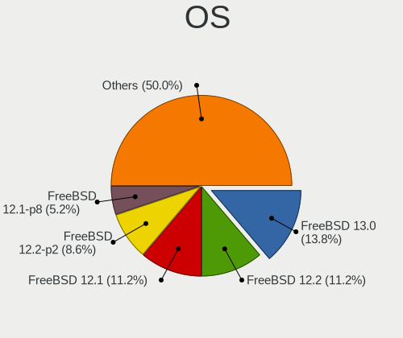

| Name                 | Computers | Percent |
|----------------------|-----------|---------|
| FreeBSD 13.0         | 17        | 14.53%  |
| FreeBSD 12.2         | 13        | 11.11%  |
| FreeBSD 12.1         | 13        | 11.11%  |
| FreeBSD 12.2-p2      | 10        | 8.55%   |
| FreeBSD 12.1-p8      | 6         | 5.13%   |
| FreeBSD 12.1-p10     | 6         | 5.13%   |
| FreeBSD 13.0-p4      | 4         | 3.42%   |
| FreeBSD 13.0-p3      | 4         | 3.42%   |
| FreeBSD 12.1-p7      | 4         | 3.42%   |
| FreeBSD 12.1-p5      | 4         | 3.42%   |
| FreeBSD 13.0-STABLE  | 3         | 2.56%   |
| FreeBSD 13.0-p7      | 3         | 2.56%   |
| FreeBSD 13.0-p5      | 3         | 2.56%   |
| FreeBSD 14.0-CURRENT | 2         | 1.71%   |
| FreeBSD 12.2-p3      | 2         | 1.71%   |
| FreeBSD 12.1-p4      | 2         | 1.71%   |
| FreeBSD 13.0-RC5     | 1         | 0.85%   |
| FreeBSD 13.0-RC3     | 1         | 0.85%   |
| FreeBSD 13.0-p8      | 1         | 0.85%   |
| FreeBSD 13.0-CURRENT | 1         | 0.85%   |
| FreeBSD 13.0-BETA3   | 1         | 0.85%   |
| FreeBSD 13.0-ALPHA3  | 1         | 0.85%   |
| FreeBSD 12.3-p1      | 1         | 0.85%   |
| FreeBSD 12.3         | 1         | 0.85%   |
| FreeBSD 12.2-STABLE  | 1         | 0.85%   |
| FreeBSD 12.2-p5      | 1         | 0.85%   |
| FreeBSD 12.2-p10     | 1         | 0.85%   |
| FreeBSD 12.1-STABLE  | 1         | 0.85%   |
| FreeBSD 12.1-p2      | 1         | 0.85%   |
| FreeBSD 12.1-p13     | 1         | 0.85%   |
| FreeBSD 12.0-p13     | 1         | 0.85%   |
| FreeBSD 12.0         | 1         | 0.85%   |
| FreeBSD 11.4-p6      | 1         | 0.85%   |
| FreeBSD 11.4-p4      | 1         | 0.85%   |
| FreeBSD 11.4-p2      | 1         | 0.85%   |
| FreeBSD 11.3         | 1         | 0.85%   |
| FreeBSD 11.2-p9      | 1         | 0.85%   |

OS Family
---------

OS without a version

| Name    | Computers | Percent |
|---------|-----------|---------|
| FreeBSD | 115       | 100%    |

Arch
----

OS architecture (x86_64, i586, etc.)

| Name  | Computers | Percent |
|-------|-----------|---------|
| amd64 | 108       | 93.91%  |
| i386  | 4         | 3.48%   |
| arm64 | 2         | 1.74%   |
| riscv | 1         | 0.87%   |

DE
--

Desktop Environment

| Name      | Computers | Percent |
|-----------|-----------|---------|
| Console   | 69        | 59.48%  |
| KDE5      | 9         | 7.76%   |
| Openbox   | 8         | 6.9%    |
| TWM       | 7         | 6.03%   |
| XFCE      | 6         | 5.17%   |
| MATE      | 5         | 4.31%   |
| LXQt      | 4         | 3.45%   |
| i3        | 2         | 1.72%   |
| LXDE      | 1         | 0.86%   |
| Lumina    | 1         | 0.86%   |
| GNOME     | 1         | 0.86%   |
| Fluxbox   | 1         | 0.86%   |
| Cinnamon  | 1         | 0.86%   |
| AwesomeWM | 1         | 0.86%   |

Display Server
--------------

X11 or Wayland

| Name    | Computers | Percent |
|---------|-----------|---------|
| Console | 72        | 62.61%  |
| X11     | 42        | 36.52%  |
| Wayland | 1         | 0.87%   |

Display Manager
---------------

SDDM, LightDM, etc.

| Name    | Computers | Percent |
|---------|-----------|---------|
| Console | 87        | 75.65%  |
| SLiM    | 13        | 11.3%   |
| SDDM    | 10        | 8.7%    |
| XDM     | 2         | 1.74%   |
| Ly      | 1         | 0.87%   |
| LightDM | 1         | 0.87%   |
| GDM     | 1         | 0.87%   |

OS Lang
-------

Language

| Lang    | Computers | Percent |
|---------|-----------|---------|
| Unknown | 54        | 46.55%  |
| C       | 39        | 33.62%  |
| en_US   | 20        | 17.24%  |
| ru_RU   | 1         | 0.86%   |
| ja_JP   | 1         | 0.86%   |
| en_GB   | 1         | 0.86%   |

Boot Mode
---------

EFI or BIOS

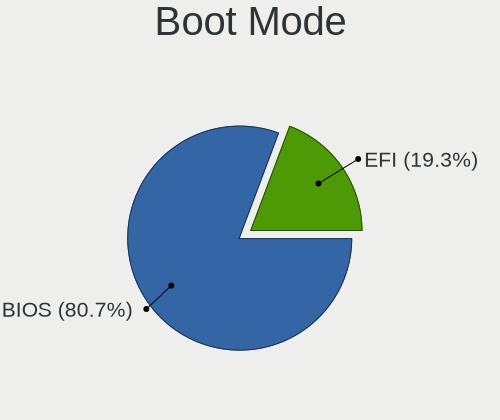

| Mode | Computers | Percent |
|------|-----------|---------|
| BIOS | 91        | 79.13%  |
| EFI  | 24        | 20.87%  |

Filesystem
----------

Type of filesystem

| Type | Computers | Percent |
|------|-----------|---------|
| Zfs  | 60        | 52.17%  |
| Ufs  | 55        | 47.83%  |

Part. scheme
------------

Scheme of partitioning

| Type | Computers | Percent |
|------|-----------|---------|
| GPT  | 91        | 79.13%  |
| MBR  | 20        | 17.39%  |
| BSD  | 4         | 3.48%   |

Board
-----

Vendor
------

Motherboard manufacturer

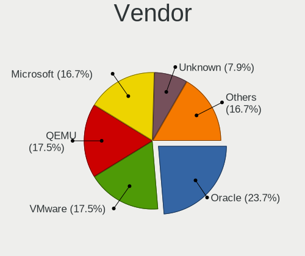

| Name         | Computers | Percent |
|--------------|-----------|---------|
| Oracle       | 26        | 22.61%  |
| QEMU         | 20        | 17.39%  |
| Intel        | 20        | 17.39%  |
| Microsoft    | 19        | 16.52%  |
| Unknown      | 11        | 9.57%   |
| Xen          | 3         | 2.61%   |
| Red Hat      | 3         | 2.61%   |
| Hetzner      | 3         | 2.61%   |
| FreeBSD      | 3         | 2.61%   |
| netcup       | 2         | 1.74%   |
| Vultr        | 1         | 0.87%   |
| Scaleway     | 1         | 0.87%   |
| DigitalOcean | 1         | 0.87%   |
| Amazon EC2   | 1         | 0.87%   |
| ACCURATENODE | 1         | 0.87%   |

Model
-----

Motherboard model

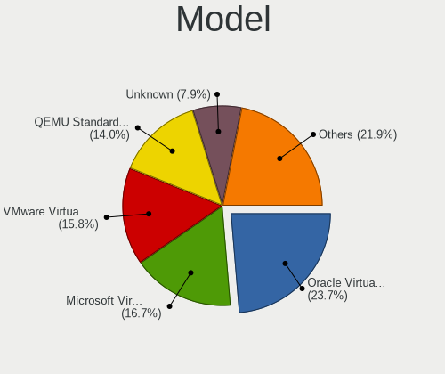

| Name                                       | Computers | Percent |
|--------------------------------------------|-----------|---------|
| Oracle VirtualBox                          | 26        | 22.61%  |
| Microsoft Virtual Machine                  | 19        | 16.52%  |
| Intel Virtual Platform                     | 18        | 15.65%  |
| QEMU Standard PC (i440FX + PIIX, 1996)     | 16        | 13.91%  |
| Unknown                                    | 11        | 9.57%   |
| QEMU Standard PC (Q35 + ICH9, 2009)        | 4         | 3.48%   |
| Xen HVM domU                               | 3         | 2.61%   |
| Red Hat KVM                                | 3         | 2.61%   |
| Hetzner vServer                            | 3         | 2.61%   |
| FreeBSD BHYVE                              | 3         | 2.61%   |
| netcup KVM Server                          | 2         | 1.74%   |
| Intel VMware7,1                            | 2         | 1.74%   |
| Vultr HFC                                  | 1         | 0.87%   |
| Scaleway Standard PC (i440FX + PIIX, 1996) | 1         | 0.87%   |
| DigitalOcean Droplet                       | 1         | 0.87%   |
| Amazon EC2 t3a.large                       | 1         | 0.87%   |
| ACCURATENODE VPS                           | 1         | 0.87%   |

Model Family
------------

Motherboard model prefix

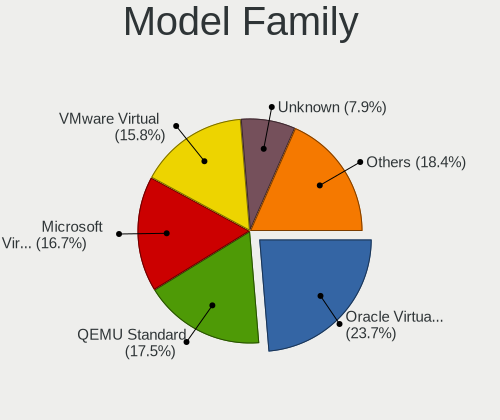

| Name                 | Computers | Percent |
|----------------------|-----------|---------|
| Oracle VirtualBox    | 26        | 22.61%  |
| QEMU Standard        | 20        | 17.39%  |
| Microsoft Virtual    | 19        | 16.52%  |
| Intel Virtual        | 18        | 15.65%  |
| Unknown              | 11        | 9.57%   |
| Xen HVM              | 3         | 2.61%   |
| Red Hat KVM          | 3         | 2.61%   |
| Hetzner vServer      | 3         | 2.61%   |
| FreeBSD BHYVE        | 3         | 2.61%   |
| netcup KVM           | 2         | 1.74%   |
| Intel VMware7        | 2         | 1.74%   |
| Vultr HFC            | 1         | 0.87%   |
| Scaleway Standard    | 1         | 0.87%   |
| DigitalOcean Droplet | 1         | 0.87%   |
| Amazon EC2 t3a.large | 1         | 0.87%   |
| ACCURATENODE VPS     | 1         | 0.87%   |

MFG Year
--------

Motherboard manufacture year

| Year    | Computers | Percent |
|---------|-----------|---------|
| 2014    | 28        | 24.35%  |
| 2006    | 27        | 23.48%  |
| 2018    | 18        | 15.65%  |
| 2020    | 12        | 10.43%  |
| 2019    | 10        | 8.7%    |
| 2015    | 6         | 5.22%   |
| 2017    | 5         | 4.35%   |
| Unknown | 5         | 4.35%   |
| 2016    | 3         | 2.61%   |
| 2011    | 1         | 0.87%   |

Form Factor
-----------

Physical design of the computer

| Name            | Computers | Percent |
|-----------------|-----------|---------|
| Virtual machine | 115       | 100%    |

Coreboot
--------

Have coreboot on board

| Used | Computers | Percent |
|------|-----------|---------|
| No   | 115       | 100%    |

RAM Size
--------

Total RAM memory

| Size in GB  | Computers | Percent |
|-------------|-----------|---------|
| 4.01-8.0    | 38        | 32.2%   |
| 2.01-3.0    | 23        | 19.49%  |
| 8.01-16.0   | 23        | 19.49%  |
| 0.51-1.0    | 18        | 15.25%  |
| 16.01-24.0  | 5         | 4.24%   |
| 3.01-4.0    | 4         | 3.39%   |
| 32.01-64.0  | 2         | 1.69%   |
| 1.01-2.0    | 2         | 1.69%   |
| 0.01-0.5    | 2         | 1.69%   |
| 64.01-256.0 | 1         | 0.85%   |

RAM Used
--------

Used RAM memory

| Used GB    | Computers | Percent |
|------------|-----------|---------|
| 0.01-0.5   | 84        | 71.79%  |
| 0.51-1.0   | 20        | 17.09%  |
| 1.01-2.0   | 4         | 3.42%   |
| 8.01-16.0  | 4         | 3.42%   |
| 4.01-8.0   | 2         | 1.71%   |
| 3.01-4.0   | 2         | 1.71%   |
| 16.01-24.0 | 1         | 0.85%   |

Total Drives
------------

Number of drives on board

| Drives | Computers | Percent |
|--------|-----------|---------|
| 1      | 66        | 56.9%   |
| 0      | 40        | 34.48%  |
| 3      | 3         | 2.59%   |
| 7      | 2         | 1.72%   |
| 2      | 2         | 1.72%   |
| 20     | 1         | 0.86%   |
| 5      | 1         | 0.86%   |
| 4      | 1         | 0.86%   |

Has CD-ROM
----------

Has CD-ROM on board

| Presented | Computers | Percent |
|-----------|-----------|---------|
| Yes       | 87        | 75.65%  |
| No        | 28        | 24.35%  |

Has Ethernet
------------

Has Ethernet on board

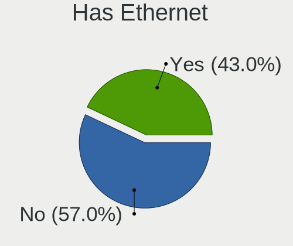

| Presented | Computers | Percent |
|-----------|-----------|---------|
| No        | 65        | 56.52%  |
| Yes       | 50        | 43.48%  |

Has WiFi
--------

Has WiFi module

| Presented | Computers | Percent |
|-----------|-----------|---------|
| No        | 115       | 100%    |

Has Bluetooth
-------------

Has Bluetooth module

| Presented | Computers | Percent |
|-----------|-----------|---------|
| No        | 114       | 99.13%  |
| Yes       | 1         | 0.87%   |

Location
--------

Country
-------

Geographic location (country)

| Country            | Computers | Percent |
|--------------------|-----------|---------|
| USA                | 22        | 19.13%  |
| Germany            | 11        | 9.57%   |
| Russia             | 10        | 8.7%    |
| UK                 | 9         | 7.83%   |
| Netherlands        | 6         | 5.22%   |
| Japan              | 6         | 5.22%   |
| Canada             | 5         | 4.35%   |
| Spain              | 4         | 3.48%   |
| Norway             | 3         | 2.61%   |
| Italy              | 3         | 2.61%   |
| India              | 3         | 2.61%   |
| China              | 3         | 2.61%   |
| Australia          | 3         | 2.61%   |
| Switzerland        | 2         | 1.74%   |
| Sweden             | 2         | 1.74%   |
| Singapore          | 2         | 1.74%   |
| Czechia            | 2         | 1.74%   |
| Bulgaria           | 2         | 1.74%   |
| Brazil             | 2         | 1.74%   |
| Ukraine            | 1         | 0.87%   |
| Turkey             | 1         | 0.87%   |
| Thailand           | 1         | 0.87%   |
| Slovenia           | 1         | 0.87%   |
| Poland             | 1         | 0.87%   |
| Israel             | 1         | 0.87%   |
| Isle of Man        | 1         | 0.87%   |
| Hong Kong          | 1         | 0.87%   |
| France             | 1         | 0.87%   |
| Finland            | 1         | 0.87%   |
| Estonia            | 1         | 0.87%   |
| Dominican Republic | 1         | 0.87%   |
| Bolivia            | 1         | 0.87%   |
| Belarus            | 1         | 0.87%   |
| Austria            | 1         | 0.87%   |

City
----

Geographic location (city)

| City               | Computers | Percent |
|--------------------|-----------|---------|
| Moscow             | 7         | 6.09%   |
| Amsterdam          | 4         | 3.48%   |
| Seattle            | 3         | 2.61%   |
| Munich             | 3         | 2.61%   |
| Sofia              | 2         | 1.74%   |
| Singapore          | 2         | 1.74%   |
| Los Angeles        | 2         | 1.74%   |
| Falkenstein        | 2         | 1.74%   |
| Coimbatore         | 2         | 1.74%   |
| Brighton           | 2         | 1.74%   |
| Berlin             | 2         | 1.74%   |
| Zurich             | 1         | 0.87%   |
| Yokohama           | 1         | 0.87%   |
| Yekaterinburg      | 1         | 0.87%   |
| Yecla              | 1         | 0.87%   |
| Wolfsburg          | 1         | 0.87%   |
| Wassenaar          | 1         | 0.87%   |
| Warsaw             | 1         | 0.87%   |
| Uxbridge           | 1         | 0.87%   |
| Toronto            | 1         | 0.87%   |
| Tallinn            | 1         | 0.87%   |
| Tai Wan            | 1         | 0.87%   |
| Swansea            | 1         | 0.87%   |
| Surrey             | 1         | 0.87%   |
| Sterling           | 1         | 0.87%   |
| Stamford           | 1         | 0.87%   |
| St Petersburg      | 1         | 0.87%   |
| Shizuoka           | 1         | 0.87%   |
| Shibuya            | 1         | 0.87%   |
| Shanghai           | 1         | 0.87%   |
| Santo Domingo Este | 1         | 0.87%   |
| Rome               | 1         | 0.87%   |
| Prague             | 1         | 0.87%   |
| Piscataway         | 1         | 0.87%   |
| Paris              | 1         | 0.87%   |
| Paisley            | 1         | 0.87%   |
| Orenburg           | 1         | 0.87%   |
| Oetwil am See      | 1         | 0.87%   |
| Nuremberg          | 1         | 0.87%   |
| Norristown         | 1         | 0.87%   |
| Newark             | 1         | 0.87%   |
| Nanchang           | 1         | 0.87%   |
| Mukwonago          | 1         | 0.87%   |
| Montreal           | 1         | 0.87%   |
| Molde              | 1         | 0.87%   |
| Mogilev            | 1         | 0.87%   |
| Makiivka           | 1         | 0.87%   |
| Madrid             | 1         | 0.87%   |
| Louisville         | 1         | 0.87%   |
| London             | 1         | 0.87%   |
| Liverpool          | 1         | 0.87%   |
| Linköping       | 1         | 0.87%   |
| Leiden             | 1         | 0.87%   |
| La Paz             | 1         | 0.87%   |
| Kumagaya           | 1         | 0.87%   |
| Koto               | 1         | 0.87%   |
| Kirkland           | 1         | 0.87%   |
| Karlsruhe          | 1         | 0.87%   |
| Istanbul           | 1         | 0.87%   |
| Hyderabad          | 1         | 0.87%   |

Drives
------

Drive Vendor
------------

Hard drive vendors

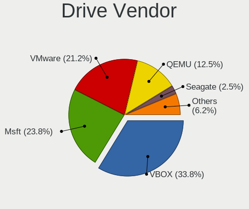

| Vendor              | Computers | Drives | Percent |
|---------------------|-----------|--------|---------|
| VBOX                | 26        | 30     | 32.5%   |
| Msft                | 19        | 22     | 23.75%  |
| VMware              | 18        | 33     | 22.5%   |
| QEMU                | 10        | 10     | 12.5%   |
| Seagate             | 2         | 20     | 2.5%    |
| WDC                 | 1         | 6      | 1.25%   |
| Toshiba             | 1         | 12     | 1.25%   |
| Samsung Electronics | 1         | 8      | 1.25%   |
| ORACLE              | 1         | 1      | 1.25%   |
| Crucial             | 1         | 1      | 1.25%   |

Drive Model
-----------

Hard drive models

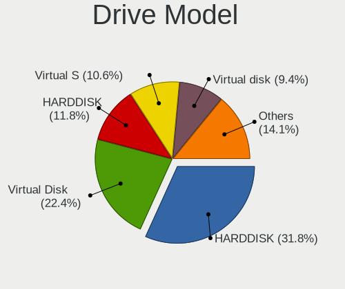

| Model                           | Computers | Percent |
|---------------------------------|-----------|---------|
| VBOX HARDDISK                   | 26        | 30.59%  |
| Msft Virtual Disk               | 19        | 22.35%  |
| QEMU HARDDISK                   | 10        | 11.76%  |
| VMware Virtual S                | 9         | 10.59%  |
| VMware Virtual disk             | 9         | 10.59%  |
| WDC WD40NMZW-59GX6S1 4TB        | 1         | 1.18%   |
| WDC WD40EFRX-68N32N0 4TB        | 1         | 1.18%   |
| Toshiba DT01ACA300 3TB          | 1         | 1.18%   |
| Seagate ST8000AS0002-1NA17Z 8TB | 1         | 1.18%   |
| Seagate ST6000DM001-1XY17Z 6TB  | 1         | 1.18%   |
| Seagate ST5000DM000-1FK178 5TB  | 1         | 1.18%   |
| Seagate ST1000NM 0011 1TB       | 1         | 1.18%   |
| Samsung SSD 860 EVO 500GB       | 1         | 1.18%   |
| Samsung SSD 850 EVO 250GB       | 1         | 1.18%   |
| Samsung SSD 840 EVO 500GB       | 1         | 1.18%   |
| ORACLE BlockVolume              | 1         | 1.18%   |
| Crucial CT1000MX500SSD1 1TB     | 1         | 1.18%   |

HDD Vendor
----------

Hard disk drive vendors

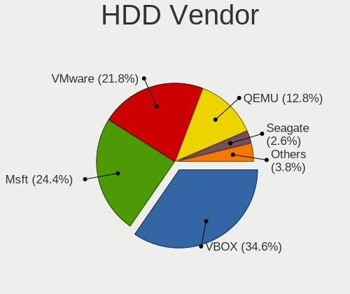

| Vendor  | Computers | Drives | Percent |
|---------|-----------|--------|---------|
| VBOX    | 26        | 30     | 33.33%  |
| Msft    | 19        | 22     | 24.36%  |
| VMware  | 18        | 33     | 23.08%  |
| QEMU    | 10        | 10     | 12.82%  |
| Seagate | 2         | 20     | 2.56%   |
| WDC     | 1         | 6      | 1.28%   |
| Toshiba | 1         | 12     | 1.28%   |
| ORACLE  | 1         | 1      | 1.28%   |

SSD Vendor
----------

Solid state drive vendors

| Vendor              | Computers | Drives | Percent |
|---------------------|-----------|--------|---------|
| Samsung Electronics | 1         | 8      | 50%     |
| Crucial             | 1         | 1      | 50%     |

Drive Kind
----------

HDD or SSD

| Kind | Computers | Drives | Percent |
|------|-----------|--------|---------|
| HDD  | 75        | 134    | 97.4%   |
| SSD  | 2         | 9      | 2.6%    |

Drive Connector
---------------

SATA, SAS, NVMe, etc.

| Type | Computers | Drives | Percent |
|------|-----------|--------|---------|
| SATA | 75        | 143    | 100%    |

Drive Size
----------

Size of hard drive

| Size in TB | Computers | Drives | Percent |
|------------|-----------|--------|---------|
| 0.01-0.5   | 74        | 104    | 93.67%  |
| 0.51-1.0   | 2         | 3      | 2.53%   |
| 3.01-4.0   | 1         | 6      | 1.27%   |
| 2.01-3.0   | 1         | 12     | 1.27%   |
| 4.01-10.0  | 1         | 18     | 1.27%   |

Space Total
-----------

Amount of disk space available on the file system

| Size in GB | Computers | Percent |
|------------|-----------|---------|
| 1-20       | 40        | 34.78%  |
| 21-50      | 38        | 33.04%  |
| 101-250    | 16        | 13.91%  |
| 51-100     | 15        | 13.04%  |
| 251-500    | 4         | 3.48%   |
| 501-1000   | 1         | 0.87%   |
| Unknown    | 1         | 0.87%   |

Space Used
----------

Amount of used disk space

| Used GB  | Computers | Percent |
|----------|-----------|---------|
| 1-20     | 105       | 91.3%   |
| 21-50    | 5         | 4.35%   |
| 101-250  | 2         | 1.74%   |
| 501-1000 | 1         | 0.87%   |
| 51-100   | 1         | 0.87%   |
| Unknown  | 1         | 0.87%   |

Malfunc. Drives
---------------

Drive models with a malfunction

Zero info for selected period =(

Malfunc. Drive Vendor
---------------------

Vendors of faulty drives

Zero info for selected period =(

Malfunc. HDD Vendor
-------------------

Vendors of faulty HDD drives

Zero info for selected period =(

Malfunc. Drive Kind
-------------------

Kinds of faulty drives

Zero info for selected period =(

Failed Drives
-------------

Failed drive models

Zero info for selected period =(

Failed Drive Vendor
-------------------

Failed drive vendors

Zero info for selected period =(

Drive Status
------------

Number of failed and malfunc. drives

| Status   | Computers | Drives | Percent |
|----------|-----------|--------|---------|
| Detected | 74        | 98     | 97.37%  |
| Works    | 2         | 45     | 2.63%   |

Storage controller
------------------

Storage Vendor
--------------

Storage controller vendors

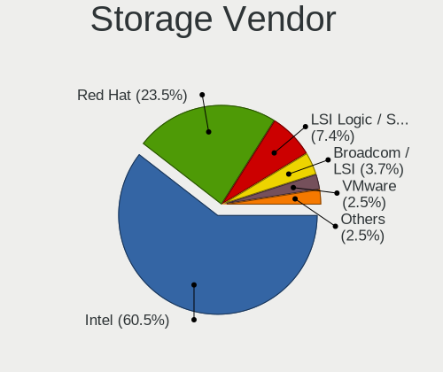

| Vendor                    | Computers | Percent |
|---------------------------|-----------|---------|
| Intel                     | 97        | 59.51%  |
| Red Hat                   | 38        | 23.31%  |
| LSI Logic / Symbios Logic | 12        | 7.36%   |
| VMware                    | 6         | 3.68%   |
| Broadcom / LSI            | 6         | 3.68%   |
| XenSource                 | 3         | 1.84%   |
| Amazon.com                | 1         | 0.61%   |

Storage Model
-------------

Storage controller models

| Model                                                                          | Computers | Percent |
|--------------------------------------------------------------------------------|-----------|---------|
| Intel 82371AB/EB/MB PIIX4 IDE                                                  | 58        | 33.53%  |
| Intel 82371SB PIIX3 IDE [Natoma/Triton II]                                     | 32        | 18.5%   |
| Red Hat Virtio block device                                                    | 27        | 15.61%  |
| Red Hat Virtio SCSI                                                            | 13        | 7.51%   |
| LSI Logic / Symbios Logic 53c1030 PCI-X Fusion-MPT Dual Ultra320 SCSI          | 12        | 6.94%   |
| Broadcom / LSI SAS1068 PCI-X Fusion-MPT SAS                                    | 5         | 2.89%   |
| VMware SATA AHCI controller                                                    | 4         | 2.31%   |
| Intel 82801HM/HEM (ICH8M/ICH8M-E) SATA Controller [AHCI mode]                  | 4         | 2.31%   |
| XenSource Xen Platform Device                                                  | 3         | 1.73%   |
| VMware NVMe SSD Controller                                                     | 3         | 1.73%   |
| Intel 82801IR/IO/IH (ICH9R/DO/DH) 6 port SATA Controller [AHCI mode]           | 3         | 1.73%   |
| Intel 82801HR/HO/HH (ICH8R/DO/DH) 6 port SATA Controller [AHCI mode]           | 3         | 1.73%   |
| VMware PVSCSI SCSI Controller                                                  | 1         | 0.58%   |
| Intel 8 Series/C220 Series Chipset Family 6-port SATA Controller 1 [AHCI mode] | 1         | 0.58%   |
| Broadcom / LSI SAS2308 PCI-Express Fusion-MPT SAS-2                            | 1         | 0.58%   |
| Broadcom / LSI SAS2116 PCI-Express Fusion-MPT SAS-2 [Meteor]                   | 1         | 0.58%   |
| Broadcom / LSI SAS2008 PCI-Express Fusion-MPT SAS-2 [Falcon]                   | 1         | 0.58%   |
| Amazon.com NVMe EBS Controller                                                 | 1         | 0.58%   |

Storage Kind
------------

Kind of storage controller (IDE, SATA, NVMe, SAS, ...)

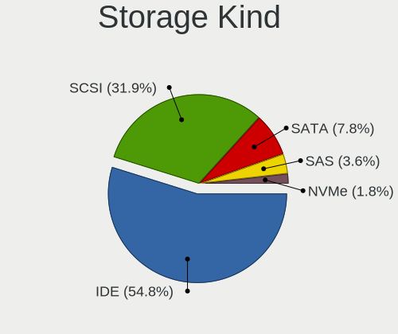

| Kind | Computers | Percent |
|------|-----------|---------|
| IDE  | 90        | 53.25%  |
| SCSI | 53        | 31.36%  |
| SATA | 15        | 8.88%   |
| SAS  | 7         | 4.14%   |
| NVMe | 4         | 2.37%   |

Processor
---------

CPU Vendor
----------

Processor vendors

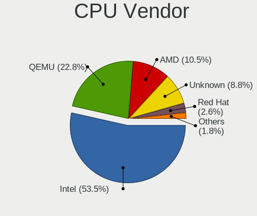

| Vendor  | Computers | Percent |
|---------|-----------|---------|
| Intel   | 60        | 52.17%  |
| QEMU    | 26        | 22.61%  |
| AMD     | 12        | 10.43%  |
| Unknown | 11        | 9.57%   |
| Red Hat | 3         | 2.61%   |
| Bochs   | 2         | 1.74%   |
| ARM     | 1         | 0.87%   |

CPU Model
---------

Processor models

| Model                                           | Computers | Percent |
|-------------------------------------------------|-----------|---------|
|                                                 | 11        | 9.57%   |
| QEMU pc-i440fx-4.1                              | 4         | 3.48%   |
| Intel Core i7-3630QM CPU @ 2.40GHz              | 4         | 3.48%   |
| Red Hat RHEL 7.6.0 PC (i440FX + PIIX, 1996)     | 3         | 2.61%   |
| QEMU pc-i440fx-4.2                              | 3         | 2.61%   |
| QEMU Other                                      | 3         | 2.61%   |
| Intel Other                                     | 3         | 2.61%   |
| QEMU pc-i440fx-6.0                              | 2         | 1.74%   |
| QEMU pc-i440fx-5.2                              | 2         | 1.74%   |
| Intel Xeon CPU E5-2620 0 @ 2.00GHz              | 2         | 1.74%   |
| Intel Xeon CPU D-1518 @ 2.20GHz                 | 2         | 1.74%   |
| Intel Pentium CPU N3700 @ 1.60GHz               | 2         | 1.74%   |
| Intel Core i7-7700HQ CPU @ 2.80GHz              | 2         | 1.74%   |
| Intel Core i7-4600U CPU @ 2.10GHz               | 2         | 1.74%   |
| Intel Core i7-3520M CPU @ 2.90GHz               | 2         | 1.74%   |
| Intel Core i5-8250U CPU @ 1.60GHz               | 2         | 1.74%   |
| Intel Core i5-6600 CPU @ 3.30GHz                | 2         | 1.74%   |
| Intel Core i3-8100 CPU @ 3.60GHz                | 2         | 1.74%   |
| Bochs Other                                     | 2         | 1.74%   |
| AMD A10-8700P Radeon R6, 10 Compute Cores 4C+6G | 2         | 1.74%   |
| QEMU pc-q35-5.2                                 | 1         | 0.87%   |
| QEMU pc-q35-4.2                                 | 1         | 0.87%   |
| QEMU pc-q35-3.1                                 | 1         | 0.87%   |
| QEMU pc-i440fx-focal                            | 1         | 0.87%   |
| QEMU pc-i440fx-bionic                           | 1         | 0.87%   |
| QEMU pc-i440fx-6.2                              | 1         | 0.87%   |
| QEMU pc-i440fx-5.1                              | 1         | 0.87%   |
| QEMU pc-i440fx-5.0                              | 1         | 0.87%   |
| QEMU pc-i440fx-2.8                              | 1         | 0.87%   |
| QEMU pc-i440fx-2.5                              | 1         | 0.87%   |
| QEMU pc-i440fx-2.12                             | 1         | 0.87%   |
| QEMU pc-i440fx-2.11                             | 1         | 0.87%   |
| Intel Xeon Gold 6240 CPU @ 2.60GHz              | 1         | 0.87%   |
| Intel Xeon CPU X5660                            | 1         | 0.87%   |
| Intel Xeon CPU X5460 @ 3.16GHz                  | 1         | 0.87%   |
| Intel Xeon CPU E5530 @ 2.40GHz                  | 1         | 0.87%   |
| Intel Xeon CPU E5-2680 v3 @ 2.50GHz             | 1         | 0.87%   |
| Intel Xeon CPU E5-2673 v4 @ 2.30GHz             | 1         | 0.87%   |
| Intel Xeon CPU E5-2667 v2 @ 3.30GHz             | 1         | 0.87%   |
| Intel Xeon CPU E5-2660 0 @ 2.20GHz              | 1         | 0.87%   |
| Intel Xeon CPU E5-2640 v4 @ 2.40GHz             | 1         | 0.87%   |
| Intel Xeon CPU E5-2640 v3 @ 2.60GHz             | 1         | 0.87%   |
| Intel Xeon CPU E3-1240 v5 @ 3.50GHz             | 1         | 0.87%   |
| Intel Xeon CPU E3-1240 V2 @ 3.40GHz             | 1         | 0.87%   |
| Intel Xeon CPU D-1540 @ 2.00GHz                 | 1         | 0.87%   |
| Intel Xeon                                      | 1         | 0.87%   |
| Intel Core i9-10980HK CPU @ 2.40GHz             | 1         | 0.87%   |
| Intel Core i7-8700B CPU @ 3.20GHz               | 1         | 0.87%   |
| Intel Core i7-8550U CPU @ 1.80GHz               | 1         | 0.87%   |
| Intel Core i7-6700HQ CPU @ 2.60GHz              | 1         | 0.87%   |
| Intel Core i7-6700 CPU @ 3.40GHz                | 1         | 0.87%   |
| Intel Core i7-4790K CPU @ 4.00GHz               | 1         | 0.87%   |
| Intel Core i7-4771 CPU @ 3.50GHz                | 1         | 0.87%   |
| Intel Core i7-4770K CPU @ 3.50GHz               | 1         | 0.87%   |
| Intel Core i7-3770 CPU @ 3.40GHz                | 1         | 0.87%   |
| Intel Core i7-2600K CPU @ 3.40GHz               | 1         | 0.87%   |
| Intel Core i7-2600 CPU @ 3.40GHz                | 1         | 0.87%   |
| Intel Core i7-10750H CPU @ 2.60GHz              | 1         | 0.87%   |
| Intel Core i7-10700K CPU @ 3.80GHz              | 1         | 0.87%   |
| Intel Core i7-1065G7 CPU @ 1.30GHz              | 1         | 0.87%   |

CPU Model Family
----------------

Processor model prefix

| Model            | Computers | Percent |
|------------------|-----------|---------|
| Other            | 45        | 39.13%  |
| Intel Core i7    | 23        | 20%     |
| Intel Xeon       | 17        | 14.78%  |
| Intel Core i5    | 9         | 7.83%   |
| AMD Ryzen 7      | 5         | 4.35%   |
| Intel Core i3    | 3         | 2.61%   |
| AMD A10          | 3         | 2.61%   |
| Intel Pentium    | 2         | 1.74%   |
| Intel Xeon Gold  | 1         | 0.87%   |
| Intel Core i9    | 1         | 0.87%   |
| Intel Core 2 Duo | 1         | 0.87%   |
| ARM Cortex       | 1         | 0.87%   |
| AMD Ryzen 5 PRO  | 1         | 0.87%   |
| AMD Ryzen 5      | 1         | 0.87%   |
| AMD Phenom II X4 | 1         | 0.87%   |
| AMD EPYC         | 1         | 0.87%   |

CPU Cores
---------

Number of processor cores

| Number  | Computers | Percent |
|---------|-----------|---------|
| 2       | 38        | 32.48%  |
| 4       | 28        | 23.93%  |
| 1       | 27        | 23.08%  |
| Unknown | 10        | 8.55%   |
| 8       | 5         | 4.27%   |
| 6       | 3         | 2.56%   |
| 3       | 2         | 1.71%   |
| 32      | 1         | 0.85%   |
| 16      | 1         | 0.85%   |
| 12      | 1         | 0.85%   |
| 7       | 1         | 0.85%   |

CPU Sockets
-----------

Number of sockets

| Number  | Computers | Percent |
|---------|-----------|---------|
| 1       | 72        | 62.61%  |
| 2       | 23        | 20%     |
| 4       | 9         | 7.83%   |
| Unknown | 5         | 4.35%   |
| 8       | 2         | 1.74%   |
| 64      | 1         | 0.87%   |
| 7       | 1         | 0.87%   |
| 6       | 1         | 0.87%   |
| 3       | 1         | 0.87%   |

CPU Threads
-----------

Threads per core (Hyper-Threading)

| Number  | Computers | Percent |
|---------|-----------|---------|
| 1       | 99        | 85.34%  |
| Unknown | 11        | 9.48%   |
| 2       | 6         | 5.17%   |

CPU Microarch
-------------

Microarchitecture

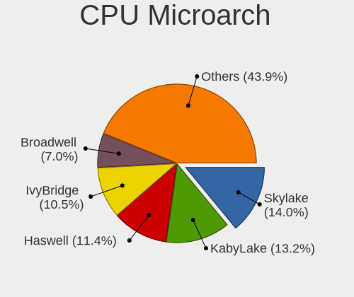

| Name        | Computers | Percent |
|-------------|-----------|---------|
| Skylake     | 15        | 13.04%  |
| KabyLake    | 15        | 13.04%  |
| Haswell     | 13        | 11.3%   |
| IvyBridge   | 12        | 10.43%  |
| Broadwell   | 8         | 6.96%   |
| Zen 2       | 7         | 6.09%   |
| Zen         | 6         | 5.22%   |
| Westmere    | 5         | 4.35%   |
| SandyBridge | 5         | 4.35%   |
| Unknown     | 5         | 4.35%   |
| CometLake   | 4         | 3.48%   |
| Zen+        | 2         | 1.74%   |
| Silvermont  | 2         | 1.74%   |
| Penryn      | 2         | 1.74%   |
| P6          | 2         | 1.74%   |
| NetBurst    | 2         | 1.74%   |
| Nehalem     | 2         | 1.74%   |
| Excavator   | 2         | 1.74%   |
| Zen 3       | 1         | 0.87%   |
| Steamroller | 1         | 0.87%   |
| K8 Hammer   | 1         | 0.87%   |
| K10         | 1         | 0.87%   |
| IceLake     | 1         | 0.87%   |
| Goldmont    | 1         | 0.87%   |

Graphics
--------

GPU Vendor
----------

Vendors of graphics cards

| Vendor                 | Computers | Percent |
|------------------------|-----------|---------|
| VMware                 | 32        | 32.32%  |
| InnoTek Systemberatung | 16        | 16.16%  |
| Microsoft              | 14        | 14.14%  |
| Cirrus Logic           | 12        | 12.12%  |
| Bochs                  | 12        | 12.12%  |
| Red Hat                | 9         | 9.09%   |
| Unknown                | 3         | 3.03%   |
| Amazon.com             | 1         | 1.01%   |

GPU Model
---------

Graphics card models

| Model                                              | Computers | Percent |
|----------------------------------------------------|-----------|---------|
| VMware SVGA II Adapter                             | 30        | 30.3%   |
| InnoTek Systemberatung VirtualBox Graphics Adapter | 16        | 16.16%  |
| Microsoft Hyper-V virtual VGA                      | 14        | 14.14%  |
| Cirrus Logic GD 5446                               | 12        | 12.12%  |
| Bochs VGA                                          | 12        | 12.12%  |
| Red Hat QXL paravirtual graphic card               | 8         | 8.08%   |
| Unknown                                            | 6         | 6.06%   |
| Red Hat Virtio GPU                                 | 1         | 1.01%   |

GPU Combo
---------

Combinations of graphics cards

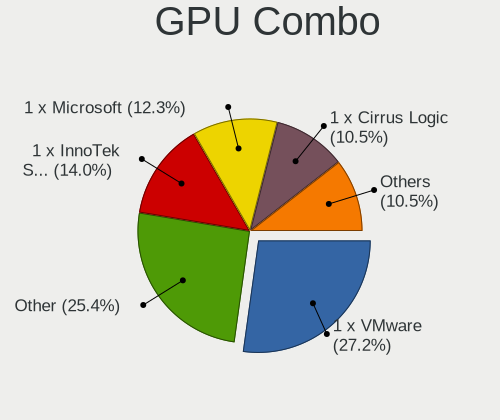

| Name                       | Computers | Percent |
|----------------------------|-----------|---------|
| 1 x VMware                 | 32        | 27.83%  |
| Other                      | 31        | 26.96%  |
| 1 x InnoTek Systemberatung | 16        | 13.91%  |
| 1 x Microsoft              | 14        | 12.17%  |
| 1 x Cirrus Logic           | 12        | 10.43%  |
| 1 x Red Hat                | 9         | 7.83%   |
| 1 x Amazon.com             | 1         | 0.87%   |

GPU Driver
----------

Free vs proprietary

| Driver  | Computers | Percent |
|---------|-----------|---------|
| Free    | 93        | 80.87%  |
| Unknown | 22        | 19.13%  |

GPU Memory
----------

Total video memory

| Size in GB | Computers | Percent |
|------------|-----------|---------|
| Unknown    | 115       | 100%    |

Monitor
-------

Monitor Vendor
--------------

Monitor vendors

| Vendor | Computers | Percent |
|--------|-----------|---------|
| RYI    | 10        | 100%    |

Monitor Model
-------------

Monitor models

| Model                                            | Computers | Percent |
|--------------------------------------------------|-----------|---------|
| RYI 109-B5 RYI0001 1920x1440 360x270mm 17.7-inch | 10        | 100%    |

Monitor Resolution
------------------

Monitor screen resolution

| Resolution | Computers | Percent |
|------------|-----------|---------|
| 1920x1440  | 10        | 100%    |

Monitor Diagonal
----------------

Diagonal size in inches

| Inches | Computers | Percent |
|--------|-----------|---------|
| 17     | 10        | 100%    |

Monitor Width
-------------

Physical width

| Width in mm | Computers | Percent |
|-------------|-----------|---------|
| 351-400     | 10        | 100%    |

Aspect Ratio
------------

Proportional relationship between the width and the height

| Ratio | Computers | Percent |
|-------|-----------|---------|
| 4/3   | 10        | 100%    |

Monitor Area
------------

Area in inch²

| Area in inch² | Computers | Percent |
|----------------|-----------|---------|
| 151-200        | 10        | 100%    |

Pixel Density
-------------

Pixels per inch

| Density | Computers | Percent |
|---------|-----------|---------|
| 121-160 | 10        | 100%    |

Multiple Monitors
-----------------

Total monitors connected

| Total | Computers | Percent |
|-------|-----------|---------|
| 0     | 95        | 82.61%  |
| 1     | 20        | 17.39%  |

Network
-------

Net Controller Vendor
---------------------

Controller vendors

| Vendor                | Computers | Percent |
|-----------------------|-----------|---------|
| Red Hat               | 41        | 44.09%  |
| Intel                 | 37        | 39.78%  |
| VMware                | 10        | 10.75%  |
| Qumranet              | 2         | 2.15%   |
| Realtek Semiconductor | 1         | 1.08%   |
| AMD                   | 1         | 1.08%   |
| Amazon.com            | 1         | 1.08%   |

Net Controller Model
--------------------

Controller models

| Model                                                 | Computers | Percent |
|-------------------------------------------------------|-----------|---------|
| Red Hat Virtio network device                         | 41        | 44.09%  |
| Intel 82540EM Gigabit Ethernet Controller             | 26        | 27.96%  |
| VMware VMXNET3 Ethernet Controller                    | 10        | 10.75%  |
| Intel 82545EM Gigabit Ethernet Controller (Copper)    | 9         | 9.68%   |
| Qumranet Virtio network device                        | 2         | 2.15%   |
| Intel 82574L Gigabit Network Connection               | 2         | 2.15%   |
| Realtek RTL-8100/8101L/8139 PCI Fast Ethernet Adapter | 1         | 1.08%   |
| AMD 79c970 [PCnet32 LANCE]                            | 1         | 1.08%   |
| Amazon.com Elastic Network Adapter (ENA)              | 1         | 1.08%   |

Wireless Vendor
---------------

Wireless vendors

Zero info for selected period =(

Wireless Model
--------------

Wireless models

Zero info for selected period =(

Ethernet Vendor
---------------

Ethernet vendors

| Vendor                | Computers | Percent |
|-----------------------|-----------|---------|
| Intel                 | 37        | 74%     |
| VMware                | 10        | 20%     |
| Realtek Semiconductor | 1         | 2%      |
| AMD                   | 1         | 2%      |
| Amazon.com            | 1         | 2%      |

Ethernet Model
--------------

Ethernet models

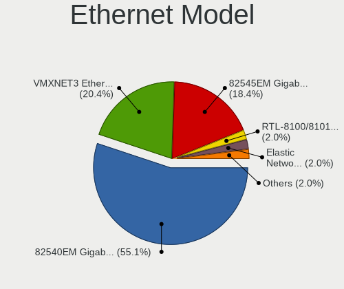

| Model                                                 | Computers | Percent |
|-------------------------------------------------------|-----------|---------|
| Intel 82540EM Gigabit Ethernet Controller             | 26        | 52%     |
| VMware VMXNET3 Ethernet Controller                    | 10        | 20%     |
| Intel 82545EM Gigabit Ethernet Controller (Copper)    | 9         | 18%     |
| Intel 82574L Gigabit Network Connection               | 2         | 4%      |
| Realtek RTL-8100/8101L/8139 PCI Fast Ethernet Adapter | 1         | 2%      |
| AMD 79c970 [PCnet32 LANCE]                            | 1         | 2%      |
| Amazon.com Elastic Network Adapter (ENA)              | 1         | 2%      |

Net Controller Kind
-------------------

Ethernet, WiFi or modem

| Kind     | Computers | Percent |
|----------|-----------|---------|
| Ethernet | 50        | 53.76%  |
| Unknown  | 43        | 46.24%  |

Used Controller
---------------

Currently used network controller

| Kind     | Computers | Percent |
|----------|-----------|---------|
| Ethernet | 50        | 56.82%  |
| Unknown  | 38        | 43.18%  |

NICs
----

Total network controllers on board

| Total | Computers | Percent |
|-------|-----------|---------|
| 1     | 86        | 74.78%  |
| 0     | 23        | 20%     |
| 2     | 6         | 5.22%   |

IPv6
----

IPv6 vs IPv4

| Used | Computers | Percent |
|------|-----------|---------|
| No   | 111       | 95.69%  |
| Yes  | 5         | 4.31%   |

Bluetooth
---------

Bluetooth Vendor
----------------

Controller vendors

| Vendor | Computers | Percent |
|--------|-----------|---------|
| Intel  | 1         | 100%    |

Bluetooth Model
---------------

Controller models

| Model                              | Computers | Percent |
|------------------------------------|-----------|---------|
| Intel Bluetooth wireless interface | 1         | 100%    |

Sound
-----

Sound Vendor
------------

Sound card vendors

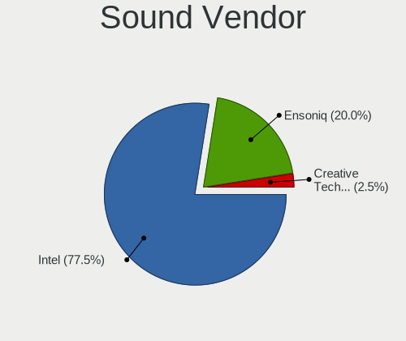

| Vendor              | Computers | Percent |
|---------------------|-----------|---------|
| Intel               | 30        | 75%     |
| Ensoniq             | 8         | 20%     |
| VMware              | 1         | 2.5%    |
| Creative Technology | 1         | 2.5%    |

Sound Model
-----------

Sound card models

| Model                                                                      | Computers | Percent |
|----------------------------------------------------------------------------|-----------|---------|
| Intel 82801AA AC'97 Audio Controller                                       | 21        | 52.5%   |
| Intel 82801FB/FBM/FR/FW/FRW (ICH6 Family) High Definition Audio Controller | 9         | 22.5%   |
| Ensoniq ES1371/ES1373 / Creative Labs CT2518                               | 7         | 17.5%   |
| VMware HD Audio Controller                                                 | 1         | 2.5%    |
| Ensoniq ES1370 [AudioPCI]                                                  | 1         | 2.5%    |
| Creative Technology Sound Blaster Play! 3                                  | 1         | 2.5%    |

Memory
------

Memory Vendor
-------------

Memory module vendors

| Vendor             | Computers | Percent |
|--------------------|-----------|---------|
| Unknown            | 33        | 38.82%  |
| QEMU               | 26        | 30.59%  |
| Microsoft          | 19        | 22.35%  |
| Red Hat            | 3         | 3.53%   |
| VMware Virtual RAM | 2         | 2.35%   |
| Unknown            | 2         | 2.35%   |

Memory Model
------------

Memory module models

| Model                                           | Computers | Percent |
|-------------------------------------------------|-----------|---------|
| Unknown                                         | 33        | 33.67%  |
| Microsoft RAM Module 3968MB                     | 10        | 10.2%   |
| Microsoft RAM Module 2GB                        | 6         | 6.12%   |
| QEMU RAM Module 4GB DIMM RAM                    | 5         | 5.1%    |
| Microsoft RAM Module 128MB                      | 5         | 5.1%    |
| QEMU RAM Module 2GB DIMM RAM                    | 3         | 3.06%   |
| QEMU RAM Module 1024MB DIMM RAM                 | 3         | 3.06%   |
| QEMU RAM Module 8192MB DIMM RAM                 | 2         | 2.04%   |
| QEMU RAM Module 4000MB DIMM RAM                 | 2         | 2.04%   |
| QEMU RAM Module 1GB DIMM RAM                    | 2         | 2.04%   |
| QEMU RAM Module 16384MB DIMM RAM                | 2         | 2.04%   |
| QEMU RAM Module 12288MB DIMM RAM                | 2         | 2.04%   |
| Microsoft RAM Module 4228MB                     | 2         | 2.04%   |
| Microsoft RAM Module 1GB                        | 2         | 2.04%   |
| VMware Virtual RAM RAM VMW-8192MB 8GB DIMM DRAM | 1         | 1.02%   |
| VMware Virtual RAM RAM VMW-4096MB 4GB DIMM DRAM | 1         | 1.02%   |
| Unknown RAM Module 4GB                          | 1         | 1.02%   |
| Unknown RAM Module 4092MB DIMM RAM              | 1         | 1.02%   |
| Red Hat RAM Module 4GB DIMM RAM                 | 1         | 1.02%   |
| Red Hat RAM Module 2GB DIMM RAM                 | 1         | 1.02%   |
| Red Hat RAM Module 2048MB DIMM RAM              | 1         | 1.02%   |
| QEMU RAM Module 8GB DIMM RAM                    | 1         | 1.02%   |
| QEMU RAM Module 512MB DIMM RAM                  | 1         | 1.02%   |
| QEMU RAM Module 4096MB DIMM RAM                 | 1         | 1.02%   |
| QEMU RAM Module 3GB DIMM RAM                    | 1         | 1.02%   |
| QEMU RAM Module 2048MB DIMM RAM                 | 1         | 1.02%   |
| QEMU RAM Module 15GB DIMM RAM                   | 1         | 1.02%   |
| QEMU RAM Module 15616MB DIMM RAM                | 1         | 1.02%   |
| Microsoft RAM Module 4224MB                     | 1         | 1.02%   |
| Microsoft RAM Module 3840MB                     | 1         | 1.02%   |
| Microsoft RAM Module 12544MB                    | 1         | 1.02%   |
| Microsoft RAM Module 12416MB                    | 1         | 1.02%   |
| Microsoft RAM Module 1152MB                     | 1         | 1.02%   |

Memory Kind
-----------

Memory module kinds

| Kind    | Computers | Percent |
|---------|-----------|---------|
| RAM     | 34        | 40%     |
| Unknown | 31        | 36.47%  |
| DRAM    | 20        | 23.53%  |

Memory Form Factor
------------------

Physical design of the memory module

| Name    | Computers | Percent |
|---------|-----------|---------|
| DIMM    | 54        | 63.53%  |
| Unknown | 31        | 36.47%  |

Memory Size
-----------

Memory module size

| Size       | Computers | Percent |
|------------|-----------|---------|
| 4096       | 18        | 17.14%  |
| 2048       | 15        | 14.29%  |
| 1024       | 14        | 13.33%  |
| 8192       | 10        | 9.52%   |
| 3968       | 10        | 9.52%   |
| 1073741824 | 8         | 7.62%   |
| 16384      | 5         | 4.76%   |
| 128        | 5         | 4.76%   |
| 12288      | 2         | 1.9%    |
| 4228       | 2         | 1.9%    |
| 4000       | 2         | 1.9%    |
| 512        | 2         | 1.9%    |
| 536870912  | 1         | 0.95%   |
| 15625      | 1         | 0.95%   |
| 15616      | 1         | 0.95%   |
| 15360      | 1         | 0.95%   |
| 12544      | 1         | 0.95%   |
| 12416      | 1         | 0.95%   |
| 6144       | 1         | 0.95%   |
| 4224       | 1         | 0.95%   |
| 4092       | 1         | 0.95%   |
| 3840       | 1         | 0.95%   |
| 3072       | 1         | 0.95%   |
| 1152       | 1         | 0.95%   |

Memory Speed
------------

Memory module speed

| Speed   | Computers | Percent |
|---------|-----------|---------|
| Unknown | 85        | 100%    |

Printers & scanners
-------------------

Printer Vendor
--------------

Printer device vendors

Zero info for selected period =(

Printer Model
-------------

Printer device models

Zero info for selected period =(

Scanner Vendor
--------------

Scanner device vendors

Zero info for selected period =(

Scanner Model
-------------

Scanner device models

Zero info for selected period =(

Camera
------

Camera Vendor
-------------

Camera device vendors

| Vendor              | Computers | Percent |
|---------------------|-----------|---------|
| Chicony Electronics | 1         | 100%    |

Camera Model
------------

Camera device models

| Model                            | Computers | Percent |
|----------------------------------|-----------|---------|
| Chicony TOSHIBA Web Camera - FHD | 1         | 100%    |

Security
--------

Fingerprint Vendor
------------------

Fingerprint sensor vendors

| Vendor           | Computers | Percent |
|------------------|-----------|---------|
| Validity Sensors | 1         | 100%    |

Fingerprint Model
-----------------

Fingerprint sensor models

| Model                                   | Computers | Percent |
|-----------------------------------------|-----------|---------|
| Validity Sensors VFS Fingerprint sensor | 1         | 100%    |

Chipcard Vendor
---------------

Chipcard module vendors

Zero info for selected period =(

Chipcard Model
--------------

Chipcard module models

Zero info for selected period =(

Unsupported
-----------

Unsupported Devices
-------------------

Total unsupported devices on board

| Total | Computers | Percent |
|-------|-----------|---------|
| 0     | 113       | 98.26%  |
| 1     | 2         | 1.74%   |

Unsupported Device Types
------------------------

Types of unsupported devices

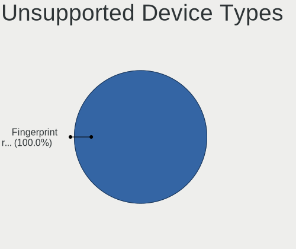

| Type               | Computers | Percent |
|--------------------|-----------|---------|
| Sound              | 1         | 50%     |
| Fingerprint reader | 1         | 50%     |

