OPNsense - Tested Virtual Hardware & Statistics
-----------------------------------------------

A project to collect tested virtual hardware configurations for OPNsense.

Anyone can contribute to this report by the [hw-probe](https://github.com/linuxhw/hw-probe/blob/master/INSTALL.BSD.md) tool:

    hw-probe -all -upload

Please contribute! Especially if your hardware is rare.

Contents
--------

* [ Test Cases ](#test-cases)

* [ System ](#system)
  - [ OS                       ](#os)
  - [ OS Family                ](#os-family)
  - [ Arch                     ](#arch)
  - [ DE                       ](#de)
  - [ Display Server           ](#display-server)
  - [ Display Manager          ](#display-manager)
  - [ OS Lang                  ](#os-lang)
  - [ Boot Mode                ](#boot-mode)
  - [ Filesystem               ](#filesystem)
  - [ Part. scheme             ](#part-scheme)

* [ Board ](#board)
  - [ Vendor                   ](#vendor)
  - [ Model                    ](#model)
  - [ Model Family             ](#model-family)
  - [ MFG Year                 ](#mfg-year)
  - [ Form Factor              ](#form-factor)
  - [ Coreboot                 ](#coreboot)
  - [ RAM Size                 ](#ram-size)
  - [ RAM Used                 ](#ram-used)
  - [ Total Drives             ](#total-drives)
  - [ Has CD-ROM               ](#has-cd-rom)
  - [ Has Ethernet             ](#has-ethernet)
  - [ Has WiFi                 ](#has-wifi)
  - [ Has Bluetooth            ](#has-bluetooth)

* [ Location ](#location)
  - [ Country                  ](#country)
  - [ City                     ](#city)

* [ Drives ](#drives)
  - [ Drive Vendor             ](#drive-vendor)
  - [ Drive Model              ](#drive-model)
  - [ HDD Vendor               ](#hdd-vendor)
  - [ SSD Vendor               ](#ssd-vendor)
  - [ Drive Kind               ](#drive-kind)
  - [ Drive Connector          ](#drive-connector)
  - [ Drive Size               ](#drive-size)
  - [ Space Total              ](#space-total)
  - [ Space Used               ](#space-used)
  - [ Malfunc. Drives          ](#malfunc-drives)
  - [ Malfunc. Drive Vendor    ](#malfunc-drive-vendor)
  - [ Malfunc. HDD Vendor      ](#malfunc-hdd-vendor)
  - [ Malfunc. Drive Kind      ](#malfunc-drive-kind)
  - [ Failed Drives            ](#failed-drives)
  - [ Failed Drive Vendor      ](#failed-drive-vendor)
  - [ Drive Status             ](#drive-status)

* [ Storage controller ](#storage-controller)
  - [ Storage Vendor           ](#storage-vendor)
  - [ Storage Model            ](#storage-model)
  - [ Storage Kind             ](#storage-kind)

* [ Processor ](#processor)
  - [ CPU Vendor               ](#cpu-vendor)
  - [ CPU Model                ](#cpu-model)
  - [ CPU Model Family         ](#cpu-model-family)
  - [ CPU Cores                ](#cpu-cores)
  - [ CPU Sockets              ](#cpu-sockets)
  - [ CPU Threads              ](#cpu-threads)
  - [ CPU Microarch            ](#cpu-microarch)

* [ Graphics ](#graphics)
  - [ GPU Vendor               ](#gpu-vendor)
  - [ GPU Model                ](#gpu-model)
  - [ GPU Combo                ](#gpu-combo)
  - [ GPU Driver               ](#gpu-driver)
  - [ GPU Memory               ](#gpu-memory)

* [ Monitor ](#monitor)
  - [ Monitor Vendor           ](#monitor-vendor)
  - [ Monitor Model            ](#monitor-model)
  - [ Monitor Resolution       ](#monitor-resolution)
  - [ Monitor Diagonal         ](#monitor-diagonal)
  - [ Monitor Width            ](#monitor-width)
  - [ Aspect Ratio             ](#aspect-ratio)
  - [ Monitor Area             ](#monitor-area)
  - [ Pixel Density            ](#pixel-density)
  - [ Multiple Monitors        ](#multiple-monitors)

* [ Network ](#network)
  - [ Net Controller Vendor    ](#net-controller-vendor)
  - [ Net Controller Model     ](#net-controller-model)
  - [ Wireless Vendor          ](#wireless-vendor)
  - [ Wireless Model           ](#wireless-model)
  - [ Ethernet Vendor          ](#ethernet-vendor)
  - [ Ethernet Model           ](#ethernet-model)
  - [ Net Controller Kind      ](#net-controller-kind)
  - [ Used Controller          ](#used-controller)
  - [ NICs                     ](#nics)
  - [ IPv6                     ](#ipv6)

* [ Bluetooth ](#bluetooth)
  - [ Bluetooth Vendor         ](#bluetooth-vendor)
  - [ Bluetooth Model          ](#bluetooth-model)

* [ Sound ](#sound)
  - [ Sound Vendor             ](#sound-vendor)
  - [ Sound Model              ](#sound-model)

* [ Memory ](#memory)
  - [ Memory Vendor            ](#memory-vendor)
  - [ Memory Model             ](#memory-model)
  - [ Memory Kind              ](#memory-kind)
  - [ Memory Form Factor       ](#memory-form-factor)
  - [ Memory Size              ](#memory-size)
  - [ Memory Speed             ](#memory-speed)

* [ Printers & scanners ](#printers--scanners)
  - [ Printer Vendor           ](#printer-vendor)
  - [ Printer Model            ](#printer-model)
  - [ Scanner Vendor           ](#scanner-vendor)
  - [ Scanner Model            ](#scanner-model)

* [ Camera ](#camera)
  - [ Camera Vendor            ](#camera-vendor)
  - [ Camera Model             ](#camera-model)

* [ Security ](#security)
  - [ Fingerprint Vendor       ](#fingerprint-vendor)
  - [ Fingerprint Model        ](#fingerprint-model)
  - [ Chipcard Vendor          ](#chipcard-vendor)
  - [ Chipcard Model           ](#chipcard-model)

* [ Unsupported ](#unsupported)
  - [ Unsupported Devices      ](#unsupported-devices)
  - [ Unsupported Device Types ](#unsupported-device-types)

Test Cases
----------

Total: 627

| Vendor        | Model                       | Form-Factor     | Probe                                                     | Date         |
|---------------|-----------------------------|-----------------|-----------------------------------------------------------|--------------|
| QEMU          | Standard PC (Q35 + ICH9,... | Virtual machine | [618df3c9bc](https://bsd-hardware.info/?probe=618df3c9bc) | Apr 07, 2022 |
| Intel         | 440BX Desktop Reference ... | Virtual machine | [271149bf57](https://bsd-hardware.info/?probe=271149bf57) | Apr 07, 2022 |
| Xen           | HVM domU                    | Virtual machine | [0d7e9bb811](https://bsd-hardware.info/?probe=0d7e9bb811) | Apr 07, 2022 |
| Xen           | HVM domU                    | Virtual machine | [5a65bca2da](https://bsd-hardware.info/?probe=5a65bca2da) | Apr 07, 2022 |
| Intel         | 440BX Desktop Reference ... | Virtual machine | [ebd2432d93](https://bsd-hardware.info/?probe=ebd2432d93) | Apr 07, 2022 |
| QEMU          | Standard PC (i440FX + PI... | Virtual machine | [60277bdb1a](https://bsd-hardware.info/?probe=60277bdb1a) | Apr 07, 2022 |
| QEMU          | Standard PC (i440FX + PI... | Virtual machine | [d2ab08de39](https://bsd-hardware.info/?probe=d2ab08de39) | Apr 06, 2022 |
| Intel         | 440BX Desktop Reference ... | Virtual machine | [1021d17783](https://bsd-hardware.info/?probe=1021d17783) | Apr 06, 2022 |
| QEMU          | Standard PC (Q35 + ICH9,... | Virtual machine | [3126923f2b](https://bsd-hardware.info/?probe=3126923f2b) | Apr 06, 2022 |
| QEMU          | Standard PC (i440FX + PI... | Virtual machine | [c6510d7e09](https://bsd-hardware.info/?probe=c6510d7e09) | Apr 06, 2022 |
| QEMU          | Standard PC (Q35 + ICH9,... | Virtual machine | [5647e3d08b](https://bsd-hardware.info/?probe=5647e3d08b) | Apr 05, 2022 |
| Intel         | 440BX Desktop Reference ... | Virtual machine | [eb78e78ecc](https://bsd-hardware.info/?probe=eb78e78ecc) | Apr 05, 2022 |
| illumos       | BHYVE                       | Virtual machine | [6ec61b0d00](https://bsd-hardware.info/?probe=6ec61b0d00) | Apr 05, 2022 |
| QEMU          | Standard PC (i440FX + PI... | Virtual machine | [d6903c0734](https://bsd-hardware.info/?probe=d6903c0734) | Apr 05, 2022 |
| QEMU          | Standard PC (i440FX + PI... | Virtual machine | [26ac3d0c43](https://bsd-hardware.info/?probe=26ac3d0c43) | Apr 05, 2022 |
| QEMU          | Standard PC (i440FX + PI... | Virtual machine | [a53a2079b5](https://bsd-hardware.info/?probe=a53a2079b5) | Apr 03, 2022 |
| QEMU          | Standard PC (i440FX + PI... | Virtual machine | [339562a942](https://bsd-hardware.info/?probe=339562a942) | Apr 03, 2022 |
| QEMU          | Standard PC (i440FX + PI... | Virtual machine | [214f771fca](https://bsd-hardware.info/?probe=214f771fca) | Apr 02, 2022 |
| Xen           | HVM domU                    | Virtual machine | [3241123171](https://bsd-hardware.info/?probe=3241123171) | Apr 01, 2022 |
| Intel         | 440BX Desktop Reference ... | Virtual machine | [2493f92689](https://bsd-hardware.info/?probe=2493f92689) | Mar 31, 2022 |
| QEMU          | Standard PC (Q35 + ICH9,... | Virtual machine | [a5c325a7f7](https://bsd-hardware.info/?probe=a5c325a7f7) | Mar 30, 2022 |
| Oracle        | VirtualBox                  | Virtual machine | [3c49e50a01](https://bsd-hardware.info/?probe=3c49e50a01) | Mar 30, 2022 |
| QEMU          | Standard PC (i440FX + PI... | Virtual machine | [07f947a837](https://bsd-hardware.info/?probe=07f947a837) | Mar 30, 2022 |
| QEMU          | Standard PC (Q35 + ICH9,... | Virtual machine | [6b9fb8dc9d](https://bsd-hardware.info/?probe=6b9fb8dc9d) | Mar 29, 2022 |
| QEMU          | Standard PC (i440FX + PI... | Virtual machine | [481e8247af](https://bsd-hardware.info/?probe=481e8247af) | Mar 28, 2022 |
| Intel         | 440BX Desktop Reference ... | Virtual machine | [f63196f9a5](https://bsd-hardware.info/?probe=f63196f9a5) | Mar 27, 2022 |
| Intel         | 440BX Desktop Reference ... | Virtual machine | [6ece515031](https://bsd-hardware.info/?probe=6ece515031) | Mar 27, 2022 |
| QEMU          | Standard PC (i440FX + PI... | Virtual machine | [fb604904c1](https://bsd-hardware.info/?probe=fb604904c1) | Mar 27, 2022 |
| Intel         | 440BX Desktop Reference ... | Virtual machine | [27be83ab6e](https://bsd-hardware.info/?probe=27be83ab6e) | Mar 26, 2022 |
| QEMU          | Standard PC (i440FX + PI... | Virtual machine | [6c9f6c0a0c](https://bsd-hardware.info/?probe=6c9f6c0a0c) | Mar 26, 2022 |
| Oracle        | VirtualBox                  | Virtual machine | [3b3ca0a339](https://bsd-hardware.info/?probe=3b3ca0a339) | Mar 22, 2022 |
| QEMU          | Standard PC (i440FX + PI... | Virtual machine | [f8b5850fde](https://bsd-hardware.info/?probe=f8b5850fde) | Mar 22, 2022 |
| Intel         | 440BX Desktop Reference ... | Virtual machine | [fd972a2d84](https://bsd-hardware.info/?probe=fd972a2d84) | Mar 22, 2022 |
| QEMU          | Standard PC (Q35 + ICH9,... | Virtual machine | [3951a0c5b3](https://bsd-hardware.info/?probe=3951a0c5b3) | Mar 21, 2022 |
| QEMU          | Standard PC (Q35 + ICH9,... | Virtual machine | [0e1de894a2](https://bsd-hardware.info/?probe=0e1de894a2) | Mar 21, 2022 |
| QEMU          | Standard PC (Q35 + ICH9,... | Virtual machine | [5a2a09a96b](https://bsd-hardware.info/?probe=5a2a09a96b) | Mar 20, 2022 |
| QEMU          | Standard PC (i440FX + PI... | Virtual machine | [e889c353cc](https://bsd-hardware.info/?probe=e889c353cc) | Mar 20, 2022 |
| QEMU          | Standard PC (i440FX + PI... | Virtual machine | [6549f90a0c](https://bsd-hardware.info/?probe=6549f90a0c) | Mar 19, 2022 |
| Oracle        | VirtualBox                  | Virtual machine | [6fc5993f63](https://bsd-hardware.info/?probe=6fc5993f63) | Mar 18, 2022 |
| Intel         | 440BX Desktop Reference ... | Virtual machine | [823be25bbd](https://bsd-hardware.info/?probe=823be25bbd) | Mar 17, 2022 |
| Intel         | 440BX Desktop Reference ... | Virtual machine | [b726632e57](https://bsd-hardware.info/?probe=b726632e57) | Mar 16, 2022 |
| Intel         | 440BX Desktop Reference ... | Virtual machine | [9a87e4468f](https://bsd-hardware.info/?probe=9a87e4468f) | Mar 15, 2022 |
| QEMU          | Standard PC (i440FX + PI... | Virtual machine | [e66e0e2e58](https://bsd-hardware.info/?probe=e66e0e2e58) | Mar 15, 2022 |
| Microsoft     | Virtual Machine             | Virtual machine | [94fd829068](https://bsd-hardware.info/?probe=94fd829068) | Mar 14, 2022 |
| Intel         | 440BX Desktop Reference ... | Virtual machine | [7d3e869b21](https://bsd-hardware.info/?probe=7d3e869b21) | Mar 14, 2022 |
| Oracle        | VirtualBox                  | Virtual machine | [4444b5cf07](https://bsd-hardware.info/?probe=4444b5cf07) | Mar 14, 2022 |
| QEMU          | Standard PC pc-i440fx-4.... | Virtual machine | [f064e9e102](https://bsd-hardware.info/?probe=f064e9e102) | Mar 11, 2022 |
| QEMU          | Standard PC (Q35 + ICH9,... | Virtual machine | [2cff4a152c](https://bsd-hardware.info/?probe=2cff4a152c) | Mar 11, 2022 |
| QEMU          | Standard PC (Q35 + ICH9,... | Virtual machine | [c2e04b9448](https://bsd-hardware.info/?probe=c2e04b9448) | Mar 11, 2022 |
| QEMU          | Standard PC (Q35 + ICH9,... | Virtual machine | [6cf3d1a191](https://bsd-hardware.info/?probe=6cf3d1a191) | Mar 11, 2022 |
| QEMU          | Standard PC (i440FX + PI... | Virtual machine | [9197c71fa8](https://bsd-hardware.info/?probe=9197c71fa8) | Mar 10, 2022 |
| Intel         | 440BX Desktop Reference ... | Virtual machine | [c1fdcfe885](https://bsd-hardware.info/?probe=c1fdcfe885) | Mar 09, 2022 |
| Intel         | 440BX Desktop Reference ... | Virtual machine | [713031779a](https://bsd-hardware.info/?probe=713031779a) | Mar 08, 2022 |
| Intel         | 440BX Desktop Reference ... | Virtual machine | [f72269d3f8](https://bsd-hardware.info/?probe=f72269d3f8) | Mar 07, 2022 |
| Intel         | 440BX Desktop Reference ... | Virtual machine | [074a65ad80](https://bsd-hardware.info/?probe=074a65ad80) | Mar 06, 2022 |
| Intel         | 440BX Desktop Reference ... | Virtual machine | [59f4e751bf](https://bsd-hardware.info/?probe=59f4e751bf) | Mar 06, 2022 |
| QEMU          | Standard PC (i440FX + PI... | Virtual machine | [6b44b82aa9](https://bsd-hardware.info/?probe=6b44b82aa9) | Mar 06, 2022 |
| QEMU          | Standard PC (i440FX + PI... | Virtual machine | [655bb74d18](https://bsd-hardware.info/?probe=655bb74d18) | Mar 04, 2022 |
| QEMU          | Standard PC (i440FX + PI... | Virtual machine | [e299650a49](https://bsd-hardware.info/?probe=e299650a49) | Mar 04, 2022 |
| Oracle        | VirtualBox                  | Virtual machine | [32a9909746](https://bsd-hardware.info/?probe=32a9909746) | Feb 24, 2022 |
| QEMU          | Standard PC (i440FX + PI... | Virtual machine | [3baf5d1636](https://bsd-hardware.info/?probe=3baf5d1636) | Feb 23, 2022 |
| QEMU          | Standard PC (i440FX + PI... | Virtual machine | [91e91941fe](https://bsd-hardware.info/?probe=91e91941fe) | Feb 22, 2022 |
| Oracle        | VirtualBox                  | Virtual machine | [d597f3c634](https://bsd-hardware.info/?probe=d597f3c634) | Feb 21, 2022 |
| Intel         | 440BX Desktop Reference ... | Virtual machine | [98b64b07b2](https://bsd-hardware.info/?probe=98b64b07b2) | Feb 21, 2022 |
| QEMU          | Standard PC (Q35 + ICH9,... | Virtual machine | [25301d436c](https://bsd-hardware.info/?probe=25301d436c) | Feb 21, 2022 |
| QEMU          | Standard PC (i440FX + PI... | Virtual machine | [f69d599f7f](https://bsd-hardware.info/?probe=f69d599f7f) | Feb 21, 2022 |
| Intel         | 440BX Desktop Reference ... | Virtual machine | [1013fc879a](https://bsd-hardware.info/?probe=1013fc879a) | Feb 21, 2022 |
| QEMU          | Standard PC (i440FX + PI... | Virtual machine | [79e5761dde](https://bsd-hardware.info/?probe=79e5761dde) | Feb 20, 2022 |
| QEMU          | Standard PC (i440FX + PI... | Virtual machine | [6ed56a55c6](https://bsd-hardware.info/?probe=6ed56a55c6) | Feb 19, 2022 |
| Intel         | 440BX Desktop Reference ... | Virtual machine | [c05e2f90b7](https://bsd-hardware.info/?probe=c05e2f90b7) | Feb 16, 2022 |
| Intel         | 440BX Desktop Reference ... | Virtual machine | [f36c738b25](https://bsd-hardware.info/?probe=f36c738b25) | Feb 15, 2022 |
| Oracle        | VirtualBox                  | Virtual machine | [44694de708](https://bsd-hardware.info/?probe=44694de708) | Feb 14, 2022 |
| Oracle        | VirtualBox                  | Virtual machine | [f83eafe6f8](https://bsd-hardware.info/?probe=f83eafe6f8) | Feb 14, 2022 |
| Intel         | 440BX Desktop Reference ... | Virtual machine | [5929c83f68](https://bsd-hardware.info/?probe=5929c83f68) | Feb 14, 2022 |
| Intel         | 440BX Desktop Reference ... | Virtual machine | [0170252f69](https://bsd-hardware.info/?probe=0170252f69) | Feb 14, 2022 |
| Intel         | 440BX Desktop Reference ... | Virtual machine | [732f9081cc](https://bsd-hardware.info/?probe=732f9081cc) | Feb 13, 2022 |
| Intel         | 440BX Desktop Reference ... | Virtual machine | [07326d4763](https://bsd-hardware.info/?probe=07326d4763) | Feb 09, 2022 |
| Intel         | 440BX Desktop Reference ... | Virtual machine | [ac6f582c4e](https://bsd-hardware.info/?probe=ac6f582c4e) | Feb 09, 2022 |
| QEMU          | Standard PC (i440FX + PI... | Virtual machine | [fbe3e4a8eb](https://bsd-hardware.info/?probe=fbe3e4a8eb) | Feb 08, 2022 |
| Parallels ... | Parallels Virtual Platfo... | Virtual machine | [30b80d797d](https://bsd-hardware.info/?probe=30b80d797d) | Feb 07, 2022 |
| QEMU          | Standard PC (i440FX + PI... | Virtual machine | [a6e0338e22](https://bsd-hardware.info/?probe=a6e0338e22) | Feb 07, 2022 |
| QEMU          | Standard PC (i440FX + PI... | Virtual machine | [bc1010f45a](https://bsd-hardware.info/?probe=bc1010f45a) | Feb 07, 2022 |
| Unknown       | BHYVE                       | Virtual machine | [48690ecaea](https://bsd-hardware.info/?probe=48690ecaea) | Feb 06, 2022 |
| FreeBSD       | BHYVE                       | Virtual machine | [1b184d9f90](https://bsd-hardware.info/?probe=1b184d9f90) | Feb 06, 2022 |
| Intel         | 440BX Desktop Reference ... | Virtual machine | [bddddbed64](https://bsd-hardware.info/?probe=bddddbed64) | Feb 06, 2022 |
| QEMU          | Standard PC (Q35 + ICH9,... | Virtual machine | [1eccc62f5b](https://bsd-hardware.info/?probe=1eccc62f5b) | Feb 06, 2022 |
| QEMU          | Standard PC (i440FX + PI... | Virtual machine | [ac008f2a8b](https://bsd-hardware.info/?probe=ac008f2a8b) | Feb 05, 2022 |
| QEMU          | Standard PC (i440FX + PI... | Virtual machine | [f15d1c7448](https://bsd-hardware.info/?probe=f15d1c7448) | Feb 03, 2022 |
| Intel         | 440BX Desktop Reference ... | Virtual machine | [aefa0555be](https://bsd-hardware.info/?probe=aefa0555be) | Feb 03, 2022 |
| QEMU          | Standard PC (i440FX + PI... | Virtual machine | [65d106688f](https://bsd-hardware.info/?probe=65d106688f) | Feb 02, 2022 |
| QEMU          | Standard PC (Q35 + ICH9,... | Virtual machine | [086114a6df](https://bsd-hardware.info/?probe=086114a6df) | Feb 01, 2022 |
| Intel         | 440BX Desktop Reference ... | Virtual machine | [53c7985582](https://bsd-hardware.info/?probe=53c7985582) | Jan 31, 2022 |
| QEMU          | Standard PC (i440FX + PI... | Virtual machine | [134e196656](https://bsd-hardware.info/?probe=134e196656) | Jan 31, 2022 |
| Intel         | 440BX Desktop Reference ... | Virtual machine | [4fa3f3593d](https://bsd-hardware.info/?probe=4fa3f3593d) | Jan 30, 2022 |
| QEMU          | Standard PC (Q35 + ICH9,... | Virtual machine | [9c16576a87](https://bsd-hardware.info/?probe=9c16576a87) | Jan 30, 2022 |
| QEMU          | Standard PC (i440FX + PI... | Virtual machine | [9f0aae105f](https://bsd-hardware.info/?probe=9f0aae105f) | Jan 30, 2022 |
| Xen           | HVM domU                    | Virtual machine | [559e8c4f8b](https://bsd-hardware.info/?probe=559e8c4f8b) | Jan 30, 2022 |
| QEMU          | Standard PC (Q35 + ICH9,... | Virtual machine | [7162be2029](https://bsd-hardware.info/?probe=7162be2029) | Jan 30, 2022 |
| Intel         | 440BX Desktop Reference ... | Virtual machine | [d48f03bd21](https://bsd-hardware.info/?probe=d48f03bd21) | Jan 30, 2022 |
| QEMU          | Standard PC (i440FX + PI... | Virtual machine | [b1f7833cf0](https://bsd-hardware.info/?probe=b1f7833cf0) | Jan 29, 2022 |
| Intel         | 440BX Desktop Reference ... | Virtual machine | [183f11233c](https://bsd-hardware.info/?probe=183f11233c) | Jan 29, 2022 |
| Intel         | 440BX Desktop Reference ... | Virtual machine | [a65a1e72a3](https://bsd-hardware.info/?probe=a65a1e72a3) | Jan 27, 2022 |
| QEMU          | Standard PC (Q35 + ICH9,... | Virtual machine | [0a66335d16](https://bsd-hardware.info/?probe=0a66335d16) | Jan 25, 2022 |
| Intel         | 440BX Desktop Reference ... | Virtual machine | [d7ae0d7127](https://bsd-hardware.info/?probe=d7ae0d7127) | Jan 25, 2022 |
| Red Hat       | KVM                         | Virtual machine | [4b36e2c92b](https://bsd-hardware.info/?probe=4b36e2c92b) | Jan 24, 2022 |
| Intel         | 440BX Desktop Reference ... | Virtual machine | [ac6dde0626](https://bsd-hardware.info/?probe=ac6dde0626) | Jan 23, 2022 |
| QEMU          | Standard PC (i440FX + PI... | Virtual machine | [d0059d49c2](https://bsd-hardware.info/?probe=d0059d49c2) | Jan 23, 2022 |
| Intel         | 440BX Desktop Reference ... | Virtual machine | [817a380f73](https://bsd-hardware.info/?probe=817a380f73) | Jan 23, 2022 |
| Intel         | 440BX Desktop Reference ... | Virtual machine | [32f12a40bb](https://bsd-hardware.info/?probe=32f12a40bb) | Jan 23, 2022 |
| QEMU          | Standard PC (i440FX + PI... | Virtual machine | [0312070780](https://bsd-hardware.info/?probe=0312070780) | Jan 22, 2022 |
| Intel         | 440BX Desktop Reference ... | Virtual machine | [6bbe33984d](https://bsd-hardware.info/?probe=6bbe33984d) | Jan 22, 2022 |
| QEMU          | Standard PC (i440FX + PI... | Virtual machine | [19d090b70a](https://bsd-hardware.info/?probe=19d090b70a) | Jan 18, 2022 |
| QEMU          | Standard PC pc-i440fx-4.... | Virtual machine | [430c620f43](https://bsd-hardware.info/?probe=430c620f43) | Jan 18, 2022 |
| QEMU          | Standard PC (i440FX + PI... | Virtual machine | [d16d662a4b](https://bsd-hardware.info/?probe=d16d662a4b) | Jan 17, 2022 |
| Intel         | 440BX Desktop Reference ... | Virtual machine | [83a5f5f813](https://bsd-hardware.info/?probe=83a5f5f813) | Jan 17, 2022 |
| QEMU          | Standard PC (i440FX + PI... | Virtual machine | [e7ca308d85](https://bsd-hardware.info/?probe=e7ca308d85) | Jan 16, 2022 |
| Microsoft     | Virtual Machine Hyper-V ... | Virtual machine | [1f4a095592](https://bsd-hardware.info/?probe=1f4a095592) | Jan 15, 2022 |
| Microsoft     | Virtual Machine             | Virtual machine | [640c5c2992](https://bsd-hardware.info/?probe=640c5c2992) | Jan 15, 2022 |
| QEMU          | Standard PC (i440FX + PI... | Virtual machine | [7ee20f5917](https://bsd-hardware.info/?probe=7ee20f5917) | Jan 15, 2022 |
| Intel         | 440BX Desktop Reference ... | Virtual machine | [82e1dce929](https://bsd-hardware.info/?probe=82e1dce929) | Jan 13, 2022 |
| QEMU          | Standard PC (i440FX + PI... | Virtual machine | [a522ad4da1](https://bsd-hardware.info/?probe=a522ad4da1) | Jan 13, 2022 |
| QEMU          | Standard PC (i440FX + PI... | Virtual machine | [4fa925752a](https://bsd-hardware.info/?probe=4fa925752a) | Jan 12, 2022 |
| QEMU          | Standard PC (i440FX + PI... | Virtual machine | [f0008c540f](https://bsd-hardware.info/?probe=f0008c540f) | Jan 11, 2022 |
| Intel         | 440BX Desktop Reference ... | Virtual machine | [e85e8fdf21](https://bsd-hardware.info/?probe=e85e8fdf21) | Jan 08, 2022 |
| Intel         | 440BX Desktop Reference ... | Virtual machine | [cc6d6e0a8c](https://bsd-hardware.info/?probe=cc6d6e0a8c) | Jan 07, 2022 |
| Intel         | 440BX Desktop Reference ... | Virtual machine | [30bff7dbd3](https://bsd-hardware.info/?probe=30bff7dbd3) | Jan 07, 2022 |
| Intel         | 440BX Desktop Reference ... | Virtual machine | [355ad22c6f](https://bsd-hardware.info/?probe=355ad22c6f) | Jan 07, 2022 |
| Intel         | 440BX Desktop Reference ... | Virtual machine | [c2b34094f9](https://bsd-hardware.info/?probe=c2b34094f9) | Jan 06, 2022 |
| QEMU          | Standard PC (Q35 + ICH9,... | Virtual machine | [ebae01fbbc](https://bsd-hardware.info/?probe=ebae01fbbc) | Jan 06, 2022 |
| Oracle        | VirtualBox                  | Virtual machine | [c8f8fbcf18](https://bsd-hardware.info/?probe=c8f8fbcf18) | Jan 03, 2022 |
| Xen           | HVM domU                    | Virtual machine | [9861cbfed9](https://bsd-hardware.info/?probe=9861cbfed9) | Jan 02, 2022 |
| QEMU          | Standard PC (i440FX + PI... | Virtual machine | [396fccec08](https://bsd-hardware.info/?probe=396fccec08) | Jan 02, 2022 |
| QEMU          | Standard PC (i440FX + PI... | Virtual machine | [79954853d8](https://bsd-hardware.info/?probe=79954853d8) | Jan 02, 2022 |
| QEMU          | Standard PC (i440FX + PI... | Virtual machine | [13c0f244c1](https://bsd-hardware.info/?probe=13c0f244c1) | Jan 01, 2022 |
| QEMU          | Standard PC (i440FX + PI... | Virtual machine | [7f7ca924c6](https://bsd-hardware.info/?probe=7f7ca924c6) | Jan 01, 2022 |
| Intel         | 440BX Desktop Reference ... | Virtual machine | [9ba03c38f7](https://bsd-hardware.info/?probe=9ba03c38f7) | Dec 31, 2021 |
| Intel         | 440BX Desktop Reference ... | Virtual machine | [0463b15fc2](https://bsd-hardware.info/?probe=0463b15fc2) | Dec 31, 2021 |
| Intel         | 440BX Desktop Reference ... | Virtual machine | [b8bb39351a](https://bsd-hardware.info/?probe=b8bb39351a) | Dec 31, 2021 |
| QEMU          | Standard PC (i440FX + PI... | Virtual machine | [a751e03b5b](https://bsd-hardware.info/?probe=a751e03b5b) | Dec 29, 2021 |
| Oracle        | VirtualBox                  | Virtual machine | [2c6e5755ab](https://bsd-hardware.info/?probe=2c6e5755ab) | Dec 27, 2021 |
| Intel         | 440BX Desktop Reference ... | Virtual machine | [3ce81129a3](https://bsd-hardware.info/?probe=3ce81129a3) | Dec 27, 2021 |
| Intel         | 440BX Desktop Reference ... | Virtual machine | [2c2c7ba5ac](https://bsd-hardware.info/?probe=2c2c7ba5ac) | Dec 27, 2021 |
| QEMU          | Standard PC (Q35 + ICH9,... | Virtual machine | [640b294862](https://bsd-hardware.info/?probe=640b294862) | Dec 26, 2021 |
| QEMU          | Standard PC (Q35 + ICH9,... | Virtual machine | [6881870948](https://bsd-hardware.info/?probe=6881870948) | Dec 26, 2021 |
| QEMU          | Standard PC (i440FX + PI... | Virtual machine | [6101a423cf](https://bsd-hardware.info/?probe=6101a423cf) | Dec 24, 2021 |
| Oracle        | VirtualBox                  | Virtual machine | [e395af9bfe](https://bsd-hardware.info/?probe=e395af9bfe) | Dec 23, 2021 |
| Oracle        | VirtualBox                  | Virtual machine | [564bdd11a9](https://bsd-hardware.info/?probe=564bdd11a9) | Dec 22, 2021 |
| Red Hat       | RHEL-AV RHEL-8.2.0 PC       | Virtual machine | [b284e44dfb](https://bsd-hardware.info/?probe=b284e44dfb) | Dec 20, 2021 |
| Red Hat       | KVM                         | Virtual machine | [56e6a61d44](https://bsd-hardware.info/?probe=56e6a61d44) | Dec 19, 2021 |
| Intel         | 440BX Desktop Reference ... | Virtual machine | [16d1926453](https://bsd-hardware.info/?probe=16d1926453) | Dec 18, 2021 |
| Intel         | 440BX Desktop Reference ... | Virtual machine | [0799271a11](https://bsd-hardware.info/?probe=0799271a11) | Dec 18, 2021 |
| QEMU          | Standard PC (i440FX + PI... | Virtual machine | [8be6fdcafe](https://bsd-hardware.info/?probe=8be6fdcafe) | Dec 17, 2021 |
| Intel         | 440BX Desktop Reference ... | Virtual machine | [259bc32957](https://bsd-hardware.info/?probe=259bc32957) | Dec 17, 2021 |
| QEMU          | Standard PC (Q35 + ICH9,... | Virtual machine | [005d03ee38](https://bsd-hardware.info/?probe=005d03ee38) | Dec 15, 2021 |
| QEMU          | Standard PC (i440FX + PI... | Virtual machine | [4f5622c8b2](https://bsd-hardware.info/?probe=4f5622c8b2) | Dec 12, 2021 |
| QEMU          | Standard PC (i440FX + PI... | Virtual machine | [89f91175c4](https://bsd-hardware.info/?probe=89f91175c4) | Dec 12, 2021 |
| QEMU          | Standard PC (i440FX + PI... | Virtual machine | [aec685b412](https://bsd-hardware.info/?probe=aec685b412) | Dec 12, 2021 |
| QEMU          | Standard PC (i440FX + PI... | Virtual machine | [6c018e536c](https://bsd-hardware.info/?probe=6c018e536c) | Dec 11, 2021 |
| QEMU          | Standard PC (i440FX + PI... | Virtual machine | [d5dff67413](https://bsd-hardware.info/?probe=d5dff67413) | Dec 11, 2021 |
| QEMU          | Standard PC (i440FX + PI... | Virtual machine | [87da6404d9](https://bsd-hardware.info/?probe=87da6404d9) | Dec 09, 2021 |
| Intel         | 440BX Desktop Reference ... | Virtual machine | [c9602a85a3](https://bsd-hardware.info/?probe=c9602a85a3) | Dec 06, 2021 |
| QEMU          | Standard PC (i440FX + PI... | Virtual machine | [68e16f38e9](https://bsd-hardware.info/?probe=68e16f38e9) | Dec 05, 2021 |
| QEMU          | Standard PC (i440FX + PI... | Virtual machine | [4cdde83fd4](https://bsd-hardware.info/?probe=4cdde83fd4) | Dec 04, 2021 |
| QEMU          | Standard PC (i440FX + PI... | Virtual machine | [24e2c4b862](https://bsd-hardware.info/?probe=24e2c4b862) | Dec 04, 2021 |
| QEMU          | Standard PC (Q35 + ICH9,... | Virtual machine | [26ecac9357](https://bsd-hardware.info/?probe=26ecac9357) | Dec 03, 2021 |
| Microsoft     | Virtual Machine Hyper-V ... | Virtual machine | [7945389010](https://bsd-hardware.info/?probe=7945389010) | Dec 03, 2021 |
| Intel         | 440BX Desktop Reference ... | Virtual machine | [55db9c787a](https://bsd-hardware.info/?probe=55db9c787a) | Dec 02, 2021 |
| QEMU          | Standard PC (i440FX + PI... | Virtual machine | [d844464fde](https://bsd-hardware.info/?probe=d844464fde) | Nov 30, 2021 |
| QEMU          | Standard PC (i440FX + PI... | Virtual machine | [be2acf3f6d](https://bsd-hardware.info/?probe=be2acf3f6d) | Nov 30, 2021 |
| QEMU          | Standard PC (Q35 + ICH9,... | Virtual machine | [88fc7df0e9](https://bsd-hardware.info/?probe=88fc7df0e9) | Nov 29, 2021 |
| Intel         | 440BX Desktop Reference ... | Virtual machine | [2924e02cae](https://bsd-hardware.info/?probe=2924e02cae) | Nov 28, 2021 |
| QEMU          | Standard PC (i440FX + PI... | Virtual machine | [17559301a5](https://bsd-hardware.info/?probe=17559301a5) | Nov 27, 2021 |
| QEMU          | Standard PC (i440FX + PI... | Virtual machine | [f8bf343d0e](https://bsd-hardware.info/?probe=f8bf343d0e) | Nov 27, 2021 |
| Intel         | 440BX Desktop Reference ... | Virtual machine | [60fcded5c1](https://bsd-hardware.info/?probe=60fcded5c1) | Nov 26, 2021 |
| QEMU          | Standard PC (i440FX + PI... | Virtual machine | [69ab58d0d7](https://bsd-hardware.info/?probe=69ab58d0d7) | Nov 26, 2021 |
| Xen           | HVM domU                    | Virtual machine | [a446e79dd7](https://bsd-hardware.info/?probe=a446e79dd7) | Nov 21, 2021 |
| Hetzner       | vServer                     | Virtual machine | [c917d5c318](https://bsd-hardware.info/?probe=c917d5c318) | Nov 21, 2021 |
| Intel         | 440BX Desktop Reference ... | Virtual machine | [8925c4add5](https://bsd-hardware.info/?probe=8925c4add5) | Nov 21, 2021 |
| QEMU          | Standard PC (i440FX + PI... | Virtual machine | [ccc2805ed7](https://bsd-hardware.info/?probe=ccc2805ed7) | Nov 21, 2021 |
| Microsoft     | Virtual Machine Hyper-V ... | Virtual machine | [3889663ced](https://bsd-hardware.info/?probe=3889663ced) | Nov 21, 2021 |
| Intel         | 440BX Desktop Reference ... | Virtual machine | [de14ad3298](https://bsd-hardware.info/?probe=de14ad3298) | Nov 20, 2021 |
| Oracle        | VirtualBox                  | Virtual machine | [3a69fbe94f](https://bsd-hardware.info/?probe=3a69fbe94f) | Nov 16, 2021 |
| Intel         | 440BX Desktop Reference ... | Virtual machine | [35551eacd4](https://bsd-hardware.info/?probe=35551eacd4) | Nov 16, 2021 |
| Hetzner       | vServer                     | Virtual machine | [9f83bb85f2](https://bsd-hardware.info/?probe=9f83bb85f2) | Nov 15, 2021 |
| Oracle        | VirtualBox                  | Virtual machine | [0713d3695b](https://bsd-hardware.info/?probe=0713d3695b) | Nov 15, 2021 |
| QEMU          | Standard PC (i440FX + PI... | Virtual machine | [ca5d7187eb](https://bsd-hardware.info/?probe=ca5d7187eb) | Nov 13, 2021 |
| QEMU          | Standard PC (i440FX + PI... | Virtual machine | [e108ef1470](https://bsd-hardware.info/?probe=e108ef1470) | Nov 12, 2021 |
| Microsoft     | Virtual Machine             | Virtual machine | [79338882d9](https://bsd-hardware.info/?probe=79338882d9) | Nov 12, 2021 |
| QEMU          | Standard PC (Q35 + ICH9,... | Virtual machine | [024786d709](https://bsd-hardware.info/?probe=024786d709) | Nov 11, 2021 |
| Intel         | 440BX Desktop Reference ... | Virtual machine | [131c3f9d83](https://bsd-hardware.info/?probe=131c3f9d83) | Nov 10, 2021 |
| Intel         | 440BX Desktop Reference ... | Virtual machine | [e4cc38365c](https://bsd-hardware.info/?probe=e4cc38365c) | Nov 10, 2021 |
| Intel         | 440BX Desktop Reference ... | Virtual machine | [9bf5fa5256](https://bsd-hardware.info/?probe=9bf5fa5256) | Nov 09, 2021 |
| Intel         | 440BX Desktop Reference ... | Virtual machine | [357d372596](https://bsd-hardware.info/?probe=357d372596) | Nov 09, 2021 |
| QEMU          | Standard PC (i440FX + PI... | Virtual machine | [c635eb4e20](https://bsd-hardware.info/?probe=c635eb4e20) | Nov 08, 2021 |
| QEMU          | Standard PC (i440FX + PI... | Virtual machine | [fe6a27a72e](https://bsd-hardware.info/?probe=fe6a27a72e) | Nov 06, 2021 |
| Oracle        | VirtualBox                  | Virtual machine | [034e375a3a](https://bsd-hardware.info/?probe=034e375a3a) | Nov 03, 2021 |
| Microsoft     | Virtual Machine             | Virtual machine | [6a2884e81f](https://bsd-hardware.info/?probe=6a2884e81f) | Nov 02, 2021 |
| Microsoft     | Virtual Machine             | Virtual machine | [2e82e5eb38](https://bsd-hardware.info/?probe=2e82e5eb38) | Nov 02, 2021 |
| QEMU          | Standard PC (i440FX + PI... | Virtual machine | [f463a518bb](https://bsd-hardware.info/?probe=f463a518bb) | Nov 02, 2021 |
| QEMU          | Standard PC (Q35 + ICH9,... | Virtual machine | [d84e477d4e](https://bsd-hardware.info/?probe=d84e477d4e) | Nov 01, 2021 |
| Oracle        | VirtualBox                  | Virtual machine | [f18af377cd](https://bsd-hardware.info/?probe=f18af377cd) | Nov 01, 2021 |
| Intel         | 440BX Desktop Reference ... | Virtual machine | [d466c1e3c6](https://bsd-hardware.info/?probe=d466c1e3c6) | Oct 31, 2021 |
| QEMU          | Standard PC (i440FX + PI... | Virtual machine | [56d3ff4f19](https://bsd-hardware.info/?probe=56d3ff4f19) | Oct 31, 2021 |
| QEMU          | Standard PC (i440FX + PI... | Virtual machine | [ba5a2a48a5](https://bsd-hardware.info/?probe=ba5a2a48a5) | Oct 31, 2021 |
| QEMU          | Standard PC (i440FX + PI... | Virtual machine | [fdb3d88e0c](https://bsd-hardware.info/?probe=fdb3d88e0c) | Oct 30, 2021 |
| QEMU          | Standard PC (i440FX + PI... | Virtual machine | [7cf083d241](https://bsd-hardware.info/?probe=7cf083d241) | Oct 29, 2021 |
| Intel         | 440BX Desktop Reference ... | Virtual machine | [72929cdd13](https://bsd-hardware.info/?probe=72929cdd13) | Oct 29, 2021 |
| Red Hat       | KVM                         | Virtual machine | [b8d7fa1816](https://bsd-hardware.info/?probe=b8d7fa1816) | Oct 26, 2021 |
| QEMU          | Standard PC (i440FX + PI... | Virtual machine | [c7affd7644](https://bsd-hardware.info/?probe=c7affd7644) | Oct 26, 2021 |
| QEMU          | Standard PC (i440FX + PI... | Virtual machine | [86bf406561](https://bsd-hardware.info/?probe=86bf406561) | Oct 26, 2021 |
| Red Hat       | KVM                         | Virtual machine | [e7a9b681ab](https://bsd-hardware.info/?probe=e7a9b681ab) | Oct 24, 2021 |
| Intel         | 440BX Desktop Reference ... | Virtual machine | [fe71c4e93e](https://bsd-hardware.info/?probe=fe71c4e93e) | Oct 24, 2021 |
| QEMU          | Standard PC (Q35 + ICH9,... | Virtual machine | [a38c525553](https://bsd-hardware.info/?probe=a38c525553) | Oct 23, 2021 |
| QEMU          | Standard PC (i440FX + PI... | Virtual machine | [30aba48cd9](https://bsd-hardware.info/?probe=30aba48cd9) | Oct 23, 2021 |
| QEMU          | Standard PC (i440FX + PI... | Virtual machine | [c6110bc59d](https://bsd-hardware.info/?probe=c6110bc59d) | Oct 23, 2021 |
| Intel         | 440BX Desktop Reference ... | Virtual machine | [72f79dd5d8](https://bsd-hardware.info/?probe=72f79dd5d8) | Oct 22, 2021 |
| QEMU          | Standard PC (i440FX + PI... | Virtual machine | [d9dffe0c04](https://bsd-hardware.info/?probe=d9dffe0c04) | Oct 19, 2021 |
| Red Hat       | KVM                         | Virtual machine | [3e5ffd6a7e](https://bsd-hardware.info/?probe=3e5ffd6a7e) | Oct 17, 2021 |
| Microsoft     | Virtual Machine Hyper-V ... | Virtual machine | [2534f7fbda](https://bsd-hardware.info/?probe=2534f7fbda) | Oct 17, 2021 |
| QEMU          | Standard PC (Q35 + ICH9,... | Virtual machine | [3a231dc3d7](https://bsd-hardware.info/?probe=3a231dc3d7) | Oct 15, 2021 |
| Intel         | 440BX Desktop Reference ... | Virtual machine | [a473272fa3](https://bsd-hardware.info/?probe=a473272fa3) | Oct 14, 2021 |
| QEMU          | Standard PC (i440FX + PI... | Virtual machine | [6cee38c51b](https://bsd-hardware.info/?probe=6cee38c51b) | Oct 13, 2021 |
| QEMU          | Standard PC (i440FX + PI... | Virtual machine | [3d3d7e52d2](https://bsd-hardware.info/?probe=3d3d7e52d2) | Oct 13, 2021 |
| QEMU          | Standard PC (i440FX + PI... | Virtual machine | [9d4350aa6c](https://bsd-hardware.info/?probe=9d4350aa6c) | Oct 11, 2021 |
| Intel         | 440BX Desktop Reference ... | Virtual machine | [f129df53cd](https://bsd-hardware.info/?probe=f129df53cd) | Oct 10, 2021 |
| Oracle        | VirtualBox                  | Virtual machine | [6074f9fb96](https://bsd-hardware.info/?probe=6074f9fb96) | Oct 07, 2021 |
| QEMU          | Standard PC (i440FX + PI... | Virtual machine | [284e13483c](https://bsd-hardware.info/?probe=284e13483c) | Oct 05, 2021 |
| QEMU          | Standard PC (i440FX + PI... | Virtual machine | [47cb884e4a](https://bsd-hardware.info/?probe=47cb884e4a) | Oct 05, 2021 |
| QEMU          | Standard PC (i440FX + PI... | Virtual machine | [02f1ec0088](https://bsd-hardware.info/?probe=02f1ec0088) | Oct 05, 2021 |
| QEMU          | Standard PC (i440FX + PI... | Virtual machine | [474bdce029](https://bsd-hardware.info/?probe=474bdce029) | Oct 05, 2021 |
| Oracle        | VirtualBox                  | Virtual machine | [1ba99d1cc2](https://bsd-hardware.info/?probe=1ba99d1cc2) | Oct 05, 2021 |
| Intel         | 440BX Desktop Reference ... | Virtual machine | [02a5ad6616](https://bsd-hardware.info/?probe=02a5ad6616) | Oct 02, 2021 |
| Intel         | 440BX Desktop Reference ... | Virtual machine | [0fc3a9ab6a](https://bsd-hardware.info/?probe=0fc3a9ab6a) | Oct 02, 2021 |
| QEMU          | Standard PC (i440FX + PI... | Virtual machine | [8122275d11](https://bsd-hardware.info/?probe=8122275d11) | Oct 02, 2021 |
| QEMU          | Standard PC (i440FX + PI... | Virtual machine | [b78f1e5f25](https://bsd-hardware.info/?probe=b78f1e5f25) | Oct 01, 2021 |
| QEMU          | Standard PC (Q35 + ICH9,... | Virtual machine | [232d714ec4](https://bsd-hardware.info/?probe=232d714ec4) | Oct 01, 2021 |
| Microsoft     | Virtual Machine             | Virtual machine | [4755c270a5](https://bsd-hardware.info/?probe=4755c270a5) | Oct 01, 2021 |
| Intel         | 440BX Desktop Reference ... | Virtual machine | [5baf23387c](https://bsd-hardware.info/?probe=5baf23387c) | Sep 30, 2021 |
| QEMU          | Standard PC (i440FX + PI... | Virtual machine | [633906d8a5](https://bsd-hardware.info/?probe=633906d8a5) | Sep 30, 2021 |
| Intel         | 440BX Desktop Reference ... | Virtual machine | [359c5d8fa0](https://bsd-hardware.info/?probe=359c5d8fa0) | Sep 30, 2021 |
| QEMU          | Standard PC (Q35 + ICH9,... | Virtual machine | [4eeff66278](https://bsd-hardware.info/?probe=4eeff66278) | Sep 30, 2021 |
| QEMU          | Standard PC (i440FX + PI... | Virtual machine | [ccd2953f4d](https://bsd-hardware.info/?probe=ccd2953f4d) | Sep 30, 2021 |
| QEMU          | Standard PC (i440FX + PI... | Virtual machine | [d4121eb6d0](https://bsd-hardware.info/?probe=d4121eb6d0) | Sep 29, 2021 |
| Intel         | 440BX Desktop Reference ... | Virtual machine | [d644467002](https://bsd-hardware.info/?probe=d644467002) | Sep 29, 2021 |
| QEMU          | Standard PC (Q35 + ICH9,... | Virtual machine | [ce377bbe79](https://bsd-hardware.info/?probe=ce377bbe79) | Sep 29, 2021 |
| Intel         | 440BX Desktop Reference ... | Virtual machine | [92f904c84b](https://bsd-hardware.info/?probe=92f904c84b) | Sep 29, 2021 |
| QEMU          | Standard PC (i440FX + PI... | Virtual machine | [2e76e1960c](https://bsd-hardware.info/?probe=2e76e1960c) | Sep 28, 2021 |
| QEMU          | Standard PC (i440FX + PI... | Virtual machine | [89ac54adfd](https://bsd-hardware.info/?probe=89ac54adfd) | Sep 28, 2021 |
| Intel         | 440BX Desktop Reference ... | Virtual machine | [7b2b4a859a](https://bsd-hardware.info/?probe=7b2b4a859a) | Sep 27, 2021 |
| Microsoft     | Virtual Machine             | Virtual machine | [053b27eb29](https://bsd-hardware.info/?probe=053b27eb29) | Sep 27, 2021 |
| Intel         | 440BX Desktop Reference ... | Virtual machine | [0188bd5a10](https://bsd-hardware.info/?probe=0188bd5a10) | Sep 26, 2021 |
| QEMU          | Standard PC (Q35 + ICH9,... | Virtual machine | [52c7f48efb](https://bsd-hardware.info/?probe=52c7f48efb) | Sep 26, 2021 |
| Oracle        | VirtualBox                  | Virtual machine | [0d422ccb4b](https://bsd-hardware.info/?probe=0d422ccb4b) | Sep 26, 2021 |
| QEMU          | Standard PC (i440FX + PI... | Virtual machine | [2a139e0808](https://bsd-hardware.info/?probe=2a139e0808) | Sep 26, 2021 |
| Red Hat       | KVM                         | Virtual machine | [0ba325c9fd](https://bsd-hardware.info/?probe=0ba325c9fd) | Sep 25, 2021 |
| Intel         | 440BX Desktop Reference ... | Virtual machine | [f8ded34037](https://bsd-hardware.info/?probe=f8ded34037) | Sep 24, 2021 |
| Intel         | 440BX Desktop Reference ... | Virtual machine | [ec71f10b87](https://bsd-hardware.info/?probe=ec71f10b87) | Sep 24, 2021 |
| Oracle        | VirtualBox                  | Virtual machine | [c67041c671](https://bsd-hardware.info/?probe=c67041c671) | Sep 23, 2021 |
| QEMU          | Standard PC (i440FX + PI... | Virtual machine | [3c63557f06](https://bsd-hardware.info/?probe=3c63557f06) | Sep 22, 2021 |
| QEMU          | Standard PC (Q35 + ICH9,... | Virtual machine | [b009ea5332](https://bsd-hardware.info/?probe=b009ea5332) | Sep 21, 2021 |
| Oracle        | VirtualBox                  | Virtual machine | [4fa65eb5b7](https://bsd-hardware.info/?probe=4fa65eb5b7) | Sep 20, 2021 |
| Oracle        | VirtualBox                  | Virtual machine | [1d777e9fdc](https://bsd-hardware.info/?probe=1d777e9fdc) | Sep 17, 2021 |
| Oracle        | VirtualBox                  | Virtual machine | [de46d33ac2](https://bsd-hardware.info/?probe=de46d33ac2) | Sep 16, 2021 |
| QEMU          | Standard PC (i440FX + PI... | Virtual machine | [38d44271c2](https://bsd-hardware.info/?probe=38d44271c2) | Sep 16, 2021 |
| QEMU          | Standard PC (i440FX + PI... | Virtual machine | [cbed3ae75f](https://bsd-hardware.info/?probe=cbed3ae75f) | Sep 16, 2021 |
| QEMU          | Standard PC (i440FX + PI... | Virtual machine | [46009fd6a4](https://bsd-hardware.info/?probe=46009fd6a4) | Sep 12, 2021 |
| Intel         | 440BX Desktop Reference ... | Virtual machine | [6c0f9fd11a](https://bsd-hardware.info/?probe=6c0f9fd11a) | Sep 12, 2021 |
| Intel         | 440BX Desktop Reference ... | Virtual machine | [cb6decd0b8](https://bsd-hardware.info/?probe=cb6decd0b8) | Sep 10, 2021 |
| QEMU          | Standard PC (Q35 + ICH9,... | Virtual machine | [57478837fd](https://bsd-hardware.info/?probe=57478837fd) | Sep 10, 2021 |
| Intel         | 440BX Desktop Reference ... | Virtual machine | [29b100f163](https://bsd-hardware.info/?probe=29b100f163) | Sep 08, 2021 |
| Intel         | 440BX Desktop Reference ... | Virtual machine | [0eab91664c](https://bsd-hardware.info/?probe=0eab91664c) | Sep 06, 2021 |
| Oracle        | VirtualBox                  | Virtual machine | [e623b28d5b](https://bsd-hardware.info/?probe=e623b28d5b) | Sep 05, 2021 |
| Oracle        | VirtualBox                  | Virtual machine | [4390d15c7e](https://bsd-hardware.info/?probe=4390d15c7e) | Sep 05, 2021 |
| Oracle        | VirtualBox                  | Virtual machine | [592d16bf22](https://bsd-hardware.info/?probe=592d16bf22) | Sep 05, 2021 |
| QEMU          | Standard PC (i440FX + PI... | Virtual machine | [c6dd3a98cb](https://bsd-hardware.info/?probe=c6dd3a98cb) | Sep 04, 2021 |
| QEMU          | Standard PC (i440FX + PI... | Virtual machine | [22adfe980c](https://bsd-hardware.info/?probe=22adfe980c) | Sep 04, 2021 |
| QEMU          | Standard PC (i440FX + PI... | Virtual machine | [8ff1fae985](https://bsd-hardware.info/?probe=8ff1fae985) | Sep 02, 2021 |
| QEMU          | Standard PC (Q35 + ICH9,... | Virtual machine | [71186874bf](https://bsd-hardware.info/?probe=71186874bf) | Sep 01, 2021 |
| Intel         | 440BX Desktop Reference ... | Virtual machine | [48617bf5cc](https://bsd-hardware.info/?probe=48617bf5cc) | Sep 01, 2021 |
| Intel         | 440BX Desktop Reference ... | Virtual machine | [0c7cafb74b](https://bsd-hardware.info/?probe=0c7cafb74b) | Aug 30, 2021 |
| Microsoft     | Virtual Machine Hyper-V ... | Virtual machine | [f425a2caa2](https://bsd-hardware.info/?probe=f425a2caa2) | Aug 29, 2021 |
| Intel         | 440BX Desktop Reference ... | Virtual machine | [f614f7f729](https://bsd-hardware.info/?probe=f614f7f729) | Aug 28, 2021 |
| QEMU          | Standard PC (i440FX + PI... | Virtual machine | [28bdebccd5](https://bsd-hardware.info/?probe=28bdebccd5) | Aug 27, 2021 |
| QEMU          | Standard PC (i440FX + PI... | Virtual machine | [7f94442de1](https://bsd-hardware.info/?probe=7f94442de1) | Aug 26, 2021 |
| Oracle        | VirtualBox                  | Virtual machine | [40b33f2198](https://bsd-hardware.info/?probe=40b33f2198) | Aug 26, 2021 |
| Intel         | 440BX Desktop Reference ... | Virtual machine | [7869084d4b](https://bsd-hardware.info/?probe=7869084d4b) | Aug 24, 2021 |
| Intel         | 440BX Desktop Reference ... | Virtual machine | [63f17a0037](https://bsd-hardware.info/?probe=63f17a0037) | Aug 24, 2021 |
| Oracle        | VirtualBox                  | Virtual machine | [dba59eb320](https://bsd-hardware.info/?probe=dba59eb320) | Aug 21, 2021 |
| Intel         | 440BX Desktop Reference ... | Virtual machine | [83a81f4dd6](https://bsd-hardware.info/?probe=83a81f4dd6) | Aug 20, 2021 |
| Intel         | 440BX Desktop Reference ... | Virtual machine | [21b52f439c](https://bsd-hardware.info/?probe=21b52f439c) | Aug 20, 2021 |
| Intel         | 440BX Desktop Reference ... | Virtual machine | [0cbc2531d4](https://bsd-hardware.info/?probe=0cbc2531d4) | Aug 18, 2021 |
| QEMU          | Standard PC (i440FX + PI... | Virtual machine | [791f28b709](https://bsd-hardware.info/?probe=791f28b709) | Aug 18, 2021 |
| QEMU          | Standard PC (i440FX + PI... | Virtual machine | [e6964796e9](https://bsd-hardware.info/?probe=e6964796e9) | Aug 17, 2021 |
| Microsoft     | Virtual Machine             | Virtual machine | [b286144dbc](https://bsd-hardware.info/?probe=b286144dbc) | Aug 16, 2021 |
| Intel         | 440BX Desktop Reference ... | Virtual machine | [443f4366dd](https://bsd-hardware.info/?probe=443f4366dd) | Aug 15, 2021 |
| Intel         | 440BX Desktop Reference ... | Virtual machine | [e4713a32ea](https://bsd-hardware.info/?probe=e4713a32ea) | Aug 14, 2021 |
| QEMU          | Standard PC (i440FX + PI... | Virtual machine | [e3f6199714](https://bsd-hardware.info/?probe=e3f6199714) | Aug 13, 2021 |
| Intel         | 440BX Desktop Reference ... | Virtual machine | [8c7604cd85](https://bsd-hardware.info/?probe=8c7604cd85) | Aug 12, 2021 |
| QEMU          | Standard PC (i440FX + PI... | Virtual machine | [c78f42b78d](https://bsd-hardware.info/?probe=c78f42b78d) | Aug 11, 2021 |
| QEMU          | Standard PC (i440FX + PI... | Virtual machine | [165f577ed3](https://bsd-hardware.info/?probe=165f577ed3) | Aug 10, 2021 |
| Intel         | 440BX Desktop Reference ... | Virtual machine | [ebe36dfee1](https://bsd-hardware.info/?probe=ebe36dfee1) | Aug 09, 2021 |
| QEMU          | Standard PC (Q35 + ICH9,... | Virtual machine | [72301ff9cf](https://bsd-hardware.info/?probe=72301ff9cf) | Aug 08, 2021 |
| FreeBSD       | BHYVE                       | Virtual machine | [ed95395708](https://bsd-hardware.info/?probe=ed95395708) | Aug 08, 2021 |
| Oracle        | VirtualBox                  | Virtual machine | [26b5e0299f](https://bsd-hardware.info/?probe=26b5e0299f) | Aug 07, 2021 |
| Intel         | 440BX Desktop Reference ... | Virtual machine | [2cf9f997d2](https://bsd-hardware.info/?probe=2cf9f997d2) | Aug 07, 2021 |
| Oracle        | VirtualBox                  | Virtual machine | [f2950ba405](https://bsd-hardware.info/?probe=f2950ba405) | Aug 06, 2021 |
| Unknown       | BHYVE                       | Virtual machine | [1b6ad23b88](https://bsd-hardware.info/?probe=1b6ad23b88) | Aug 05, 2021 |
| QEMU          | Standard PC (i440FX + PI... | Virtual machine | [75c3ed618d](https://bsd-hardware.info/?probe=75c3ed618d) | Aug 04, 2021 |
| QEMU          | Standard PC (i440FX + PI... | Virtual machine | [9b28dceaed](https://bsd-hardware.info/?probe=9b28dceaed) | Aug 04, 2021 |
| Unknown       | BHYVE                       | Virtual machine | [dfd72d58c1](https://bsd-hardware.info/?probe=dfd72d58c1) | Aug 03, 2021 |
| Intel         | 440BX Desktop Reference ... | Virtual machine | [0baf3fe03d](https://bsd-hardware.info/?probe=0baf3fe03d) | Aug 03, 2021 |
| QEMU          | Standard PC (i440FX + PI... | Virtual machine | [6bc5f81184](https://bsd-hardware.info/?probe=6bc5f81184) | Aug 02, 2021 |
| Intel         | 440BX Desktop Reference ... | Virtual machine | [fd115c92cf](https://bsd-hardware.info/?probe=fd115c92cf) | Aug 02, 2021 |
| Intel         | 440BX Desktop Reference ... | Virtual machine | [8e8b98f66c](https://bsd-hardware.info/?probe=8e8b98f66c) | Aug 02, 2021 |
| QEMU          | Standard PC (i440FX + PI... | Virtual machine | [aff489687e](https://bsd-hardware.info/?probe=aff489687e) | Aug 01, 2021 |
| Oracle        | VirtualBox                  | Virtual machine | [28761170a1](https://bsd-hardware.info/?probe=28761170a1) | Jul 31, 2021 |
| Oracle        | VirtualBox                  | Virtual machine | [57d66df21e](https://bsd-hardware.info/?probe=57d66df21e) | Jul 31, 2021 |
| Red Hat       | KVM                         | Virtual machine | [172fb01b89](https://bsd-hardware.info/?probe=172fb01b89) | Jul 31, 2021 |
| Microsoft     | Virtual Machine             | Virtual machine | [84bf1b2ee7](https://bsd-hardware.info/?probe=84bf1b2ee7) | Jul 29, 2021 |
| QEMU          | Standard PC (i440FX + PI... | Virtual machine | [3ae4c54cdf](https://bsd-hardware.info/?probe=3ae4c54cdf) | Jul 29, 2021 |
| QEMU          | Standard PC (i440FX + PI... | Virtual machine | [e3044c3ab5](https://bsd-hardware.info/?probe=e3044c3ab5) | Jul 27, 2021 |
| Microsoft     | Virtual Machine             | Virtual machine | [cb2a3d9ed2](https://bsd-hardware.info/?probe=cb2a3d9ed2) | Jul 27, 2021 |
| Microsoft     | Virtual Machine             | Virtual machine | [21650c3db8](https://bsd-hardware.info/?probe=21650c3db8) | Jul 27, 2021 |
| QEMU          | Standard PC (i440FX + PI... | Virtual machine | [8da2f427c6](https://bsd-hardware.info/?probe=8da2f427c6) | Jul 27, 2021 |
| QEMU          | Standard PC (i440FX + PI... | Virtual machine | [5ba8d23b17](https://bsd-hardware.info/?probe=5ba8d23b17) | Jul 26, 2021 |
| Oracle        | VirtualBox                  | Virtual machine | [02d4d294f2](https://bsd-hardware.info/?probe=02d4d294f2) | Jul 25, 2021 |
| QEMU          | Standard PC (i440FX + PI... | Virtual machine | [8181cae8e3](https://bsd-hardware.info/?probe=8181cae8e3) | Jul 24, 2021 |
| QEMU          | Standard PC (i440FX + PI... | Virtual machine | [e855e715b7](https://bsd-hardware.info/?probe=e855e715b7) | Jul 23, 2021 |
| QEMU          | Standard PC (i440FX + PI... | Virtual machine | [8c85c8d7ac](https://bsd-hardware.info/?probe=8c85c8d7ac) | Jul 23, 2021 |
| Intel         | 440BX Desktop Reference ... | Virtual machine | [4dd46d0e35](https://bsd-hardware.info/?probe=4dd46d0e35) | Jul 23, 2021 |
| QEMU          | Standard PC (i440FX + PI... | Virtual machine | [1f559e664b](https://bsd-hardware.info/?probe=1f559e664b) | Jul 22, 2021 |
| Intel         | 440BX Desktop Reference ... | Virtual machine | [a86e9164d5](https://bsd-hardware.info/?probe=a86e9164d5) | Jul 21, 2021 |
| QEMU          | Standard PC (i440FX + PI... | Virtual machine | [13eb6bd99e](https://bsd-hardware.info/?probe=13eb6bd99e) | Jul 16, 2021 |
| QEMU          | Standard PC (i440FX + PI... | Virtual machine | [a9ee27deb3](https://bsd-hardware.info/?probe=a9ee27deb3) | Jul 16, 2021 |
| QEMU          | Standard PC (i440FX + PI... | Virtual machine | [bb27b457d4](https://bsd-hardware.info/?probe=bb27b457d4) | Jul 16, 2021 |
| Intel         | 440BX Desktop Reference ... | Virtual machine | [7aa0319590](https://bsd-hardware.info/?probe=7aa0319590) | Jul 15, 2021 |
| Intel         | 440BX Desktop Reference ... | Virtual machine | [a2cb2ac99b](https://bsd-hardware.info/?probe=a2cb2ac99b) | Jul 15, 2021 |
| QEMU          | Standard PC (i440FX + PI... | Virtual machine | [875f39be1e](https://bsd-hardware.info/?probe=875f39be1e) | Jul 14, 2021 |
| Intel         | 440BX Desktop Reference ... | Virtual machine | [8c4ed2f50b](https://bsd-hardware.info/?probe=8c4ed2f50b) | Jul 13, 2021 |
| Intel         | 440BX Desktop Reference ... | Virtual machine | [082b6fb538](https://bsd-hardware.info/?probe=082b6fb538) | Jul 13, 2021 |
| QEMU          | Standard PC (i440FX + PI... | Virtual machine | [f77dbf1d22](https://bsd-hardware.info/?probe=f77dbf1d22) | Jul 13, 2021 |
| Intel         | 440BX Desktop Reference ... | Virtual machine | [21aad07a26](https://bsd-hardware.info/?probe=21aad07a26) | Jul 12, 2021 |
| Oracle        | VirtualBox                  | Virtual machine | [49fd8e7d46](https://bsd-hardware.info/?probe=49fd8e7d46) | Jul 12, 2021 |
| Intel         | 440BX Desktop Reference ... | Virtual machine | [5ca1b58729](https://bsd-hardware.info/?probe=5ca1b58729) | Jul 11, 2021 |
| Intel         | 440BX Desktop Reference ... | Virtual machine | [b7d4f7c874](https://bsd-hardware.info/?probe=b7d4f7c874) | Jul 11, 2021 |
| Intel         | 440BX Desktop Reference ... | Virtual machine | [69c8381c8c](https://bsd-hardware.info/?probe=69c8381c8c) | Jul 11, 2021 |
| QEMU          | Standard PC (Q35 + ICH9,... | Virtual machine | [2408998d69](https://bsd-hardware.info/?probe=2408998d69) | Jul 11, 2021 |
| QEMU          | Standard PC (i440FX + PI... | Virtual machine | [a7a0c2332c](https://bsd-hardware.info/?probe=a7a0c2332c) | Jul 09, 2021 |
| Intel         | 440BX Desktop Reference ... | Virtual machine | [82e43ea88a](https://bsd-hardware.info/?probe=82e43ea88a) | Jul 06, 2021 |
| QEMU          | Standard PC (i440FX + PI... | Virtual machine | [d9c79fa8ae](https://bsd-hardware.info/?probe=d9c79fa8ae) | Jul 05, 2021 |
| QEMU          | Standard PC (i440FX + PI... | Virtual machine | [6417ea0729](https://bsd-hardware.info/?probe=6417ea0729) | Jul 04, 2021 |
| QEMU          | Standard PC (i440FX + PI... | Virtual machine | [3c736eb0d0](https://bsd-hardware.info/?probe=3c736eb0d0) | Jul 04, 2021 |
| Microsoft     | Virtual Machine Hyper-V ... | Virtual machine | [91f6b502df](https://bsd-hardware.info/?probe=91f6b502df) | Jul 03, 2021 |
| QEMU          | Standard PC (i440FX + PI... | Virtual machine | [e2abb788c3](https://bsd-hardware.info/?probe=e2abb788c3) | Jul 02, 2021 |
| Intel         | 440BX Desktop Reference ... | Virtual machine | [ca63a7fdeb](https://bsd-hardware.info/?probe=ca63a7fdeb) | Jul 01, 2021 |
| QEMU          | Standard PC (i440FX + PI... | Virtual machine | [9c4e04c630](https://bsd-hardware.info/?probe=9c4e04c630) | Jul 01, 2021 |
| QEMU          | Standard PC (i440FX + PI... | Virtual machine | [fac3dd6a05](https://bsd-hardware.info/?probe=fac3dd6a05) | Jul 01, 2021 |
| Intel         | 440BX Desktop Reference ... | Virtual machine | [26a816bb4d](https://bsd-hardware.info/?probe=26a816bb4d) | Jun 29, 2021 |
| Intel         | 440BX Desktop Reference ... | Virtual machine | [0810dcdf4e](https://bsd-hardware.info/?probe=0810dcdf4e) | Jun 29, 2021 |
| QEMU          | Standard PC (Q35 + ICH9,... | Virtual machine | [eb441caf5e](https://bsd-hardware.info/?probe=eb441caf5e) | Jun 29, 2021 |
| Microsoft     | Virtual Machine Hyper-V ... | Virtual machine | [6b2b9f6dc9](https://bsd-hardware.info/?probe=6b2b9f6dc9) | Jun 29, 2021 |
| Microsoft     | Virtual Machine             | Virtual machine | [6ac4e3528a](https://bsd-hardware.info/?probe=6ac4e3528a) | Jun 29, 2021 |
| Intel         | 440BX Desktop Reference ... | Virtual machine | [615feaffb1](https://bsd-hardware.info/?probe=615feaffb1) | Jun 28, 2021 |
| Intel         | 440BX Desktop Reference ... | Virtual machine | [98eb8c5dc1](https://bsd-hardware.info/?probe=98eb8c5dc1) | Jun 28, 2021 |
| Intel         | 440BX Desktop Reference ... | Virtual machine | [89ecce29b2](https://bsd-hardware.info/?probe=89ecce29b2) | Jun 27, 2021 |
| QEMU          | Standard PC (Q35 + ICH9,... | Virtual machine | [2f77ae4f2d](https://bsd-hardware.info/?probe=2f77ae4f2d) | Jun 25, 2021 |
| Oracle        | VirtualBox                  | Virtual machine | [23e5f12708](https://bsd-hardware.info/?probe=23e5f12708) | Jun 25, 2021 |
| Oracle        | VirtualBox                  | Virtual machine | [42cba218b4](https://bsd-hardware.info/?probe=42cba218b4) | Jun 25, 2021 |
| QEMU          | Standard PC (i440FX + PI... | Virtual machine | [c7937fa788](https://bsd-hardware.info/?probe=c7937fa788) | Jun 22, 2021 |
| QEMU          | Standard PC (i440FX + PI... | Virtual machine | [6c587425d6](https://bsd-hardware.info/?probe=6c587425d6) | Jun 21, 2021 |
| QEMU          | Standard PC (i440FX + PI... | Virtual machine | [ad9959cf6e](https://bsd-hardware.info/?probe=ad9959cf6e) | Jun 21, 2021 |
| QEMU          | Standard PC (i440FX + PI... | Virtual machine | [991c44067e](https://bsd-hardware.info/?probe=991c44067e) | Jun 20, 2021 |
| Intel         | 440BX Desktop Reference ... | Virtual machine | [2b10218ceb](https://bsd-hardware.info/?probe=2b10218ceb) | Jun 20, 2021 |
| Intel         | 440BX Desktop Reference ... | Virtual machine | [d2ed207375](https://bsd-hardware.info/?probe=d2ed207375) | Jun 20, 2021 |
| Intel         | 440BX Desktop Reference ... | Virtual machine | [2765274346](https://bsd-hardware.info/?probe=2765274346) | Jun 19, 2021 |
| QEMU          | Standard PC (i440FX + PI... | Virtual machine | [6497178bd0](https://bsd-hardware.info/?probe=6497178bd0) | Jun 18, 2021 |
| QEMU          | Standard PC (i440FX + PI... | Virtual machine | [e1ecd73a6f](https://bsd-hardware.info/?probe=e1ecd73a6f) | Jun 18, 2021 |
| QEMU          | Standard PC (i440FX + PI... | Virtual machine | [f98caa8a67](https://bsd-hardware.info/?probe=f98caa8a67) | Jun 18, 2021 |
| Xen           | HVM domU                    | Virtual machine | [166f7e4a42](https://bsd-hardware.info/?probe=166f7e4a42) | Jun 17, 2021 |
| Microsoft     | Virtual Machine Hyper-V ... | Virtual machine | [713e1a3d57](https://bsd-hardware.info/?probe=713e1a3d57) | Jun 17, 2021 |
| Intel         | 440BX Desktop Reference ... | Virtual machine | [4b541c2e64](https://bsd-hardware.info/?probe=4b541c2e64) | Jun 17, 2021 |
| Microsoft     | Virtual Machine Hyper-V ... | Virtual machine | [39ae2450b7](https://bsd-hardware.info/?probe=39ae2450b7) | Jun 15, 2021 |
| QEMU          | Standard PC (i440FX + PI... | Virtual machine | [70a13d29ff](https://bsd-hardware.info/?probe=70a13d29ff) | Jun 14, 2021 |
| Intel         | 440BX Desktop Reference ... | Virtual machine | [ff3b08450c](https://bsd-hardware.info/?probe=ff3b08450c) | Jun 12, 2021 |
| QEMU          | Standard PC (i440FX + PI... | Virtual machine | [77d72774d3](https://bsd-hardware.info/?probe=77d72774d3) | Jun 10, 2021 |
| QEMU          | Standard PC (i440FX + PI... | Virtual machine | [c32abbfb2f](https://bsd-hardware.info/?probe=c32abbfb2f) | Jun 10, 2021 |
| QEMU          | Standard PC (i440FX + PI... | Virtual machine | [e091b0c8d0](https://bsd-hardware.info/?probe=e091b0c8d0) | Jun 10, 2021 |
| Intel         | 440BX Desktop Reference ... | Virtual machine | [e5acc1e6ba](https://bsd-hardware.info/?probe=e5acc1e6ba) | Jun 09, 2021 |
| Amazon EC2    | t3.micro                    | Virtual machine | [ab139467d3](https://bsd-hardware.info/?probe=ab139467d3) | Jun 09, 2021 |
| Microsoft     | Virtual Machine Hyper-V ... | Virtual machine | [8de2b3a7a3](https://bsd-hardware.info/?probe=8de2b3a7a3) | Jun 09, 2021 |
| Oracle        | VirtualBox                  | Virtual machine | [b6e08ffe51](https://bsd-hardware.info/?probe=b6e08ffe51) | Jun 08, 2021 |
| Intel         | 440BX Desktop Reference ... | Virtual machine | [253085c995](https://bsd-hardware.info/?probe=253085c995) | Jun 08, 2021 |
| QEMU          | Standard PC (i440FX + PI... | Virtual machine | [af77300750](https://bsd-hardware.info/?probe=af77300750) | Jun 07, 2021 |
| Intel         | 440BX Desktop Reference ... | Virtual machine | [ff7e738f79](https://bsd-hardware.info/?probe=ff7e738f79) | Jun 06, 2021 |
| QEMU          | Standard PC (i440FX + PI... | Virtual machine | [f8f8376897](https://bsd-hardware.info/?probe=f8f8376897) | Jun 04, 2021 |
| Intel         | 440BX Desktop Reference ... | Virtual machine | [b9c20125fb](https://bsd-hardware.info/?probe=b9c20125fb) | Jun 03, 2021 |
| Oracle        | VirtualBox                  | Virtual machine | [ac30a8b16a](https://bsd-hardware.info/?probe=ac30a8b16a) | May 31, 2021 |
| Intel         | 440BX Desktop Reference ... | Virtual machine | [4e72d1bc8e](https://bsd-hardware.info/?probe=4e72d1bc8e) | May 30, 2021 |
| QEMU          | Standard PC (i440FX + PI... | Virtual machine | [0f47e82ed6](https://bsd-hardware.info/?probe=0f47e82ed6) | May 29, 2021 |
| QEMU          | Standard PC (Q35 + ICH9,... | Virtual machine | [eb085d7ddd](https://bsd-hardware.info/?probe=eb085d7ddd) | May 28, 2021 |
| QEMU          | Standard PC (i440FX + PI... | Virtual machine | [b2d0f745c2](https://bsd-hardware.info/?probe=b2d0f745c2) | May 27, 2021 |
| Intel         | 440BX Desktop Reference ... | Virtual machine | [c798ba4c8d](https://bsd-hardware.info/?probe=c798ba4c8d) | May 26, 2021 |
| QEMU          | Standard PC (i440FX + PI... | Virtual machine | [394ad5d8b6](https://bsd-hardware.info/?probe=394ad5d8b6) | May 25, 2021 |
| Intel         | 440BX Desktop Reference ... | Virtual machine | [fcbabf6a67](https://bsd-hardware.info/?probe=fcbabf6a67) | May 21, 2021 |
| Unknown       | BHYVE                       | Virtual machine | [5427266e35](https://bsd-hardware.info/?probe=5427266e35) | May 21, 2021 |
| Intel         | 440BX Desktop Reference ... | Virtual machine | [9babae31c1](https://bsd-hardware.info/?probe=9babae31c1) | May 18, 2021 |
| Microsoft     | Virtual Machine             | Virtual machine | [6ddb26f9af](https://bsd-hardware.info/?probe=6ddb26f9af) | May 17, 2021 |
| QEMU          | Standard PC (Q35 + ICH9,... | Virtual machine | [4181663949](https://bsd-hardware.info/?probe=4181663949) | May 15, 2021 |
| Intel         | 440BX Desktop Reference ... | Virtual machine | [a04755bf0b](https://bsd-hardware.info/?probe=a04755bf0b) | May 14, 2021 |
| QEMU          | Standard PC (Q35 + ICH9,... | Virtual machine | [f1cfa07f6f](https://bsd-hardware.info/?probe=f1cfa07f6f) | May 14, 2021 |
| QEMU          | Standard PC (i440FX + PI... | Virtual machine | [7ae6e56f3f](https://bsd-hardware.info/?probe=7ae6e56f3f) | May 13, 2021 |
| QEMU          | Standard PC (i440FX + PI... | Virtual machine | [51865a61a2](https://bsd-hardware.info/?probe=51865a61a2) | May 12, 2021 |
| Xen           | HVM domU                    | Virtual machine | [74d61f0e2c](https://bsd-hardware.info/?probe=74d61f0e2c) | May 10, 2021 |
| QEMU          | Standard PC (i440FX + PI... | Virtual machine | [f4e6e5c97f](https://bsd-hardware.info/?probe=f4e6e5c97f) | May 10, 2021 |
| Intel         | 440BX Desktop Reference ... | Virtual machine | [0a74267bc9](https://bsd-hardware.info/?probe=0a74267bc9) | May 09, 2021 |
| Unknown       | BHYVE                       | Virtual machine | [5824f877d7](https://bsd-hardware.info/?probe=5824f877d7) | May 08, 2021 |
| Intel         | 440BX Desktop Reference ... | Virtual machine | [103001b535](https://bsd-hardware.info/?probe=103001b535) | May 05, 2021 |
| QEMU          | Standard PC (i440FX + PI... | Virtual machine | [0b9e504c75](https://bsd-hardware.info/?probe=0b9e504c75) | May 04, 2021 |
| QEMU          | Standard PC (i440FX + PI... | Virtual machine | [fa38db3822](https://bsd-hardware.info/?probe=fa38db3822) | May 01, 2021 |
| Intel         | 440BX Desktop Reference ... | Virtual machine | [3dfc54cf84](https://bsd-hardware.info/?probe=3dfc54cf84) | May 01, 2021 |
| Intel         | 440BX Desktop Reference ... | Virtual machine | [2fc0d3ad18](https://bsd-hardware.info/?probe=2fc0d3ad18) | Apr 30, 2021 |
| Intel         | 440BX Desktop Reference ... | Virtual machine | [d5c537789f](https://bsd-hardware.info/?probe=d5c537789f) | Apr 30, 2021 |
| Intel         | 440BX Desktop Reference ... | Virtual machine | [b9e704a974](https://bsd-hardware.info/?probe=b9e704a974) | Apr 30, 2021 |
| Intel         | 440BX Desktop Reference ... | Virtual machine | [fc24a08bf3](https://bsd-hardware.info/?probe=fc24a08bf3) | Apr 30, 2021 |
| QEMU          | Standard PC (i440FX + PI... | Virtual machine | [70c3ea6295](https://bsd-hardware.info/?probe=70c3ea6295) | Apr 28, 2021 |
| Intel         | 440BX Desktop Reference ... | Virtual machine | [555052edea](https://bsd-hardware.info/?probe=555052edea) | Apr 26, 2021 |
| Oracle        | VirtualBox                  | Virtual machine | [48dc335c16](https://bsd-hardware.info/?probe=48dc335c16) | Apr 25, 2021 |
| QEMU          | Standard PC (i440FX + PI... | Virtual machine | [40badd13f8](https://bsd-hardware.info/?probe=40badd13f8) | Apr 24, 2021 |
| QEMU          | Standard PC (i440FX + PI... | Virtual machine | [44c4f803e6](https://bsd-hardware.info/?probe=44c4f803e6) | Apr 24, 2021 |
| Intel         | 440BX Desktop Reference ... | Virtual machine | [b8b61f99e6](https://bsd-hardware.info/?probe=b8b61f99e6) | Apr 22, 2021 |
| Intel         | 440BX Desktop Reference ... | Virtual machine | [1cf2434411](https://bsd-hardware.info/?probe=1cf2434411) | Apr 22, 2021 |
| QEMU          | Standard PC (i440FX + PI... | Virtual machine | [4872f7c935](https://bsd-hardware.info/?probe=4872f7c935) | Apr 22, 2021 |
| Intel         | 440BX Desktop Reference ... | Virtual machine | [5cb098c872](https://bsd-hardware.info/?probe=5cb098c872) | Apr 21, 2021 |
| QEMU          | Standard PC (Q35 + ICH9,... | Virtual machine | [123b0c4c3f](https://bsd-hardware.info/?probe=123b0c4c3f) | Apr 21, 2021 |
| QEMU          | Standard PC (i440FX + PI... | Virtual machine | [c086019132](https://bsd-hardware.info/?probe=c086019132) | Apr 19, 2021 |
| Intel         | 440BX Desktop Reference ... | Virtual machine | [b35dc1f9a4](https://bsd-hardware.info/?probe=b35dc1f9a4) | Apr 19, 2021 |
| Intel         | 440BX Desktop Reference ... | Virtual machine | [1cc5e4ce62](https://bsd-hardware.info/?probe=1cc5e4ce62) | Apr 17, 2021 |
| QEMU          | Standard PC (i440FX + PI... | Virtual machine | [b4b6bd5588](https://bsd-hardware.info/?probe=b4b6bd5588) | Apr 15, 2021 |
| Xen           | HVM domU                    | Virtual machine | [fa0106448c](https://bsd-hardware.info/?probe=fa0106448c) | Apr 14, 2021 |
| QEMU          | Standard PC (i440FX + PI... | Virtual machine | [0095daf2df](https://bsd-hardware.info/?probe=0095daf2df) | Apr 14, 2021 |
| QEMU          | Standard PC (i440FX + PI... | Virtual machine | [d84f69a14e](https://bsd-hardware.info/?probe=d84f69a14e) | Apr 12, 2021 |
| Intel         | 440BX Desktop Reference ... | Virtual machine | [2eae276065](https://bsd-hardware.info/?probe=2eae276065) | Apr 11, 2021 |
| QEMU          | Standard PC (i440FX + PI... | Virtual machine | [dc16c46199](https://bsd-hardware.info/?probe=dc16c46199) | Apr 11, 2021 |
| Oracle        | VirtualBox                  | Virtual machine | [565a9ce83b](https://bsd-hardware.info/?probe=565a9ce83b) | Apr 10, 2021 |
| Hetzner       | vServer                     | Virtual machine | [baa4318093](https://bsd-hardware.info/?probe=baa4318093) | Apr 09, 2021 |
| Intel         | 440BX Desktop Reference ... | Virtual machine | [7ca900e841](https://bsd-hardware.info/?probe=7ca900e841) | Apr 08, 2021 |
| QEMU          | Standard PC (i440FX + PI... | Virtual machine | [57a07abf3f](https://bsd-hardware.info/?probe=57a07abf3f) | Apr 08, 2021 |
| QEMU          | Standard PC (i440FX + PI... | Virtual machine | [454bb099f3](https://bsd-hardware.info/?probe=454bb099f3) | Apr 06, 2021 |
| Intel         | 440BX Desktop Reference ... | Virtual machine | [7e7b0cd7ab](https://bsd-hardware.info/?probe=7e7b0cd7ab) | Apr 05, 2021 |
| Intel         | 440BX Desktop Reference ... | Virtual machine | [afae4586eb](https://bsd-hardware.info/?probe=afae4586eb) | Apr 05, 2021 |
| Microsoft     | Virtual Machine Hyper-V ... | Virtual machine | [9022c9c724](https://bsd-hardware.info/?probe=9022c9c724) | Apr 04, 2021 |
| Intel         | 440BX Desktop Reference ... | Virtual machine | [5e1a74d95e](https://bsd-hardware.info/?probe=5e1a74d95e) | Apr 04, 2021 |
| Oracle        | VirtualBox                  | Virtual machine | [19bcab1e17](https://bsd-hardware.info/?probe=19bcab1e17) | Apr 03, 2021 |
| QEMU          | Standard PC (Q35 + ICH9,... | Virtual machine | [6dd9f5fdf5](https://bsd-hardware.info/?probe=6dd9f5fdf5) | Apr 03, 2021 |
| Oracle        | VirtualBox                  | Virtual machine | [086e298cfc](https://bsd-hardware.info/?probe=086e298cfc) | Apr 02, 2021 |
| Intel         | 440BX Desktop Reference ... | Virtual machine | [a38a451f27](https://bsd-hardware.info/?probe=a38a451f27) | Mar 30, 2021 |
| Intel         | 440BX Desktop Reference ... | Virtual machine | [b0d834643a](https://bsd-hardware.info/?probe=b0d834643a) | Mar 28, 2021 |
| QEMU          | Standard PC (i440FX + PI... | Virtual machine | [b7ef1bc694](https://bsd-hardware.info/?probe=b7ef1bc694) | Mar 27, 2021 |
| Xen           | HVM domU                    | Virtual machine | [e06d888642](https://bsd-hardware.info/?probe=e06d888642) | Mar 27, 2021 |
| QEMU          | Standard PC (i440FX + PI... | Virtual machine | [4f70cb3268](https://bsd-hardware.info/?probe=4f70cb3268) | Mar 27, 2021 |
| Intel         | 440BX Desktop Reference ... | Virtual machine | [b34a92e41a](https://bsd-hardware.info/?probe=b34a92e41a) | Mar 26, 2021 |
| Oracle        | VirtualBox                  | Virtual machine | [1346e50d7f](https://bsd-hardware.info/?probe=1346e50d7f) | Mar 26, 2021 |
| Hetzner       | vServer                     | Virtual machine | [fd371036cc](https://bsd-hardware.info/?probe=fd371036cc) | Mar 25, 2021 |
| QEMU          | Standard PC (Q35 + ICH9,... | Virtual machine | [20669d3b5d](https://bsd-hardware.info/?probe=20669d3b5d) | Mar 25, 2021 |
| Joyent        | SmartDC HVM                 | Virtual machine | [a146ae30c1](https://bsd-hardware.info/?probe=a146ae30c1) | Mar 24, 2021 |
| Intel         | 440BX Desktop Reference ... | Virtual machine | [d500b5f00d](https://bsd-hardware.info/?probe=d500b5f00d) | Mar 24, 2021 |
| Oracle        | VirtualBox                  | Virtual machine | [8ed58974ac](https://bsd-hardware.info/?probe=8ed58974ac) | Mar 23, 2021 |
| QEMU          | Standard PC (i440FX + PI... | Virtual machine | [0c75ffa4c9](https://bsd-hardware.info/?probe=0c75ffa4c9) | Mar 23, 2021 |
| QEMU          | Standard PC (i440FX + PI... | Virtual machine | [9286899720](https://bsd-hardware.info/?probe=9286899720) | Mar 22, 2021 |
| Apache Sof... | CloudStack KVM Hyperviso... | Virtual machine | [ecd4784a7b](https://bsd-hardware.info/?probe=ecd4784a7b) | Mar 21, 2021 |
| QEMU          | Standard PC (i440FX + PI... | Virtual machine | [2a46ac9898](https://bsd-hardware.info/?probe=2a46ac9898) | Mar 20, 2021 |
| Xen           | HVM domU                    | Virtual machine | [30b81e7a98](https://bsd-hardware.info/?probe=30b81e7a98) | Mar 20, 2021 |
| Oracle        | VirtualBox                  | Virtual machine | [135fdc6d46](https://bsd-hardware.info/?probe=135fdc6d46) | Mar 20, 2021 |
| Intel         | 440BX Desktop Reference ... | Virtual machine | [ab17277f88](https://bsd-hardware.info/?probe=ab17277f88) | Mar 20, 2021 |
| Intel         | 440BX Desktop Reference ... | Virtual machine | [5fc3e9852b](https://bsd-hardware.info/?probe=5fc3e9852b) | Mar 18, 2021 |
| QEMU          | Standard PC (i440FX + PI... | Virtual machine | [bae3cc2291](https://bsd-hardware.info/?probe=bae3cc2291) | Mar 18, 2021 |
| QEMU          | Standard PC (i440FX + PI... | Virtual machine | [2c257a2ab7](https://bsd-hardware.info/?probe=2c257a2ab7) | Mar 18, 2021 |
| Intel         | 440BX Desktop Reference ... | Virtual machine | [9c3d9a7b2f](https://bsd-hardware.info/?probe=9c3d9a7b2f) | Mar 18, 2021 |
| Apache Sof... | CloudStack KVM Hyperviso... | Virtual machine | [51b5ad15bf](https://bsd-hardware.info/?probe=51b5ad15bf) | Mar 16, 2021 |
| Intel         | 440BX Desktop Reference ... | Virtual machine | [bdbac70193](https://bsd-hardware.info/?probe=bdbac70193) | Mar 13, 2021 |
| QEMU          | Standard PC (i440FX + PI... | Virtual machine | [3ea94ed5fc](https://bsd-hardware.info/?probe=3ea94ed5fc) | Mar 13, 2021 |
| QEMU          | Standard PC (i440FX + PI... | Virtual machine | [356db69184](https://bsd-hardware.info/?probe=356db69184) | Mar 13, 2021 |
| Oracle        | VirtualBox                  | Virtual machine | [ca051268f2](https://bsd-hardware.info/?probe=ca051268f2) | Mar 12, 2021 |
| Oracle        | VirtualBox                  | Virtual machine | [8f21653e33](https://bsd-hardware.info/?probe=8f21653e33) | Mar 12, 2021 |
| Intel         | 440BX Desktop Reference ... | Virtual machine | [60e3dd059b](https://bsd-hardware.info/?probe=60e3dd059b) | Mar 12, 2021 |
| Intel         | 440BX Desktop Reference ... | Virtual machine | [a7a50f04c7](https://bsd-hardware.info/?probe=a7a50f04c7) | Mar 12, 2021 |
| QEMU          | Standard PC (i440FX + PI... | Virtual machine | [e318861b8e](https://bsd-hardware.info/?probe=e318861b8e) | Mar 11, 2021 |
| Intel         | 440BX Desktop Reference ... | Virtual machine | [3ae2d1615d](https://bsd-hardware.info/?probe=3ae2d1615d) | Mar 11, 2021 |
| QEMU          | Standard PC (i440FX + PI... | Virtual machine | [f47b1cb831](https://bsd-hardware.info/?probe=f47b1cb831) | Mar 11, 2021 |
| Intel         | 440BX Desktop Reference ... | Virtual machine | [f5058ae49f](https://bsd-hardware.info/?probe=f5058ae49f) | Mar 11, 2021 |
| Oracle        | VirtualBox                  | Virtual machine | [9df27ec150](https://bsd-hardware.info/?probe=9df27ec150) | Mar 11, 2021 |
| Oracle        | VirtualBox                  | Virtual machine | [babf297aa6](https://bsd-hardware.info/?probe=babf297aa6) | Mar 10, 2021 |
| Google        | Compute Engine              | Virtual machine | [c00aab60f8](https://bsd-hardware.info/?probe=c00aab60f8) | Mar 10, 2021 |
| Intel         | 440BX Desktop Reference ... | Virtual machine | [20ce71d809](https://bsd-hardware.info/?probe=20ce71d809) | Mar 08, 2021 |
| QEMU          | Standard PC (i440FX + PI... | Virtual machine | [7cf70960ad](https://bsd-hardware.info/?probe=7cf70960ad) | Mar 08, 2021 |
| Intel         | 440BX Desktop Reference ... | Virtual machine | [f566403ed6](https://bsd-hardware.info/?probe=f566403ed6) | Mar 08, 2021 |
| Intel         | 440BX Desktop Reference ... | Virtual machine | [d4dc8b6420](https://bsd-hardware.info/?probe=d4dc8b6420) | Mar 07, 2021 |
| QEMU          | Standard PC (Q35 + ICH9,... | Virtual machine | [ce22c2ff80](https://bsd-hardware.info/?probe=ce22c2ff80) | Mar 07, 2021 |
| QEMU          | Standard PC (i440FX + PI... | Virtual machine | [0a859423e3](https://bsd-hardware.info/?probe=0a859423e3) | Mar 05, 2021 |
| Oracle        | VirtualBox                  | Virtual machine | [809854cf70](https://bsd-hardware.info/?probe=809854cf70) | Mar 05, 2021 |
| QEMU          | Standard PC (i440FX + PI... | Virtual machine | [4bccdddadf](https://bsd-hardware.info/?probe=4bccdddadf) | Mar 04, 2021 |
| QEMU          | Standard PC (Q35 + ICH9,... | Virtual machine | [efc2bab248](https://bsd-hardware.info/?probe=efc2bab248) | Mar 04, 2021 |
| Intel         | 440BX Desktop Reference ... | Virtual machine | [2ff52d2649](https://bsd-hardware.info/?probe=2ff52d2649) | Mar 04, 2021 |
| QEMU          | Standard PC (Q35 + ICH9,... | Virtual machine | [1fc7b8492c](https://bsd-hardware.info/?probe=1fc7b8492c) | Mar 03, 2021 |
| Oracle        | VirtualBox                  | Virtual machine | [6a20eca3a6](https://bsd-hardware.info/?probe=6a20eca3a6) | Mar 02, 2021 |
| Intel         | 440BX Desktop Reference ... | Virtual machine | [b34c989f58](https://bsd-hardware.info/?probe=b34c989f58) | Mar 02, 2021 |
| QEMU          | Standard PC (i440FX + PI... | Virtual machine | [7e4e4784fc](https://bsd-hardware.info/?probe=7e4e4784fc) | Mar 01, 2021 |
| QEMU          | Standard PC (i440FX + PI... | Virtual machine | [9a8b487bd0](https://bsd-hardware.info/?probe=9a8b487bd0) | Mar 01, 2021 |
| QEMU          | Standard PC (i440FX + PI... | Virtual machine | [07e1675ed6](https://bsd-hardware.info/?probe=07e1675ed6) | Mar 01, 2021 |
| QEMU          | Standard PC (i440FX + PI... | Virtual machine | [3fa24d77e2](https://bsd-hardware.info/?probe=3fa24d77e2) | Feb 28, 2021 |
| Intel         | 440BX Desktop Reference ... | Virtual machine | [8c71879467](https://bsd-hardware.info/?probe=8c71879467) | Feb 27, 2021 |
| QEMU          | Standard PC (i440FX + PI... | Virtual machine | [0071afb872](https://bsd-hardware.info/?probe=0071afb872) | Feb 27, 2021 |
| Microsoft     | Virtual Machine             | Virtual machine | [a9d275db11](https://bsd-hardware.info/?probe=a9d275db11) | Feb 26, 2021 |
| Intel         | 440BX Desktop Reference ... | Virtual machine | [1362c9ce1c](https://bsd-hardware.info/?probe=1362c9ce1c) | Feb 25, 2021 |
| Oracle        | VirtualBox                  | Virtual machine | [ddf6765bef](https://bsd-hardware.info/?probe=ddf6765bef) | Feb 25, 2021 |
| Intel         | 440BX Desktop Reference ... | Virtual machine | [bb7b123c6c](https://bsd-hardware.info/?probe=bb7b123c6c) | Feb 24, 2021 |
| Intel         | 440BX Desktop Reference ... | Virtual machine | [3d66f5a8e6](https://bsd-hardware.info/?probe=3d66f5a8e6) | Feb 23, 2021 |
| Intel         | 440BX Desktop Reference ... | Virtual machine | [c452bf8970](https://bsd-hardware.info/?probe=c452bf8970) | Feb 21, 2021 |
| Oracle        | VirtualBox                  | Virtual machine | [3eee82b0d5](https://bsd-hardware.info/?probe=3eee82b0d5) | Feb 20, 2021 |
| Intel         | 440BX Desktop Reference ... | Virtual machine | [fe2c69bb79](https://bsd-hardware.info/?probe=fe2c69bb79) | Feb 19, 2021 |
| Microsoft     | Virtual Machine Hyper-V ... | Virtual machine | [27a64c23ad](https://bsd-hardware.info/?probe=27a64c23ad) | Feb 19, 2021 |
| QEMU          | Standard PC (i440FX + PI... | Virtual machine | [510acc0849](https://bsd-hardware.info/?probe=510acc0849) | Feb 18, 2021 |
| Oracle        | VirtualBox                  | Virtual machine | [9c25241f92](https://bsd-hardware.info/?probe=9c25241f92) | Feb 18, 2021 |
| Google        | Compute Engine              | Virtual machine | [4fba11e1b8](https://bsd-hardware.info/?probe=4fba11e1b8) | Feb 18, 2021 |
| Xen           | HVM domU                    | Virtual machine | [a575cd8841](https://bsd-hardware.info/?probe=a575cd8841) | Feb 17, 2021 |
| Intel         | 440BX Desktop Reference ... | Virtual machine | [b8eebccccc](https://bsd-hardware.info/?probe=b8eebccccc) | Feb 16, 2021 |
| Intel         | 440BX Desktop Reference ... | Virtual machine | [1c9cc438ab](https://bsd-hardware.info/?probe=1c9cc438ab) | Feb 16, 2021 |
| Intel         | 440BX Desktop Reference ... | Virtual machine | [aea4dc7a3b](https://bsd-hardware.info/?probe=aea4dc7a3b) | Feb 16, 2021 |
| QEMU          | Standard PC (i440FX + PI... | Virtual machine | [2e278422f2](https://bsd-hardware.info/?probe=2e278422f2) | Feb 15, 2021 |
| QEMU          | Standard PC (i440FX + PI... | Virtual machine | [b48fdb8b73](https://bsd-hardware.info/?probe=b48fdb8b73) | Feb 15, 2021 |
| Intel         | 440BX Desktop Reference ... | Virtual machine | [6df4e5042e](https://bsd-hardware.info/?probe=6df4e5042e) | Feb 14, 2021 |
| Intel         | 440BX Desktop Reference ... | Virtual machine | [147152da2a](https://bsd-hardware.info/?probe=147152da2a) | Feb 14, 2021 |
| Intel         | 440BX Desktop Reference ... | Virtual machine | [7ebd3a20fb](https://bsd-hardware.info/?probe=7ebd3a20fb) | Feb 14, 2021 |
| Intel         | 440BX Desktop Reference ... | Virtual machine | [92020d4e26](https://bsd-hardware.info/?probe=92020d4e26) | Feb 13, 2021 |
| Intel         | 440BX Desktop Reference ... | Virtual machine | [5ddb2233c6](https://bsd-hardware.info/?probe=5ddb2233c6) | Feb 13, 2021 |
| QEMU          | Standard PC (i440FX + PI... | Virtual machine | [ef366bf08d](https://bsd-hardware.info/?probe=ef366bf08d) | Feb 13, 2021 |
| QEMU          | Standard PC (i440FX + PI... | Virtual machine | [2cbd5b065e](https://bsd-hardware.info/?probe=2cbd5b065e) | Feb 11, 2021 |
| QEMU          | Standard PC (i440FX + PI... | Virtual machine | [7a3150eba4](https://bsd-hardware.info/?probe=7a3150eba4) | Feb 11, 2021 |
| QEMU          | Standard PC (i440FX + PI... | Virtual machine | [ed0d37541b](https://bsd-hardware.info/?probe=ed0d37541b) | Feb 10, 2021 |
| Microsoft     | Virtual Machine Hyper-V ... | Virtual machine | [ebbce86299](https://bsd-hardware.info/?probe=ebbce86299) | Feb 10, 2021 |
| QEMU          | Standard PC (i440FX + PI... | Virtual machine | [5fcbf9d9c6](https://bsd-hardware.info/?probe=5fcbf9d9c6) | Feb 10, 2021 |
| QEMU          | Standard PC (i440FX + PI... | Virtual machine | [525403d161](https://bsd-hardware.info/?probe=525403d161) | Feb 09, 2021 |
| QEMU          | Standard PC (i440FX + PI... | Virtual machine | [7d0b2a8827](https://bsd-hardware.info/?probe=7d0b2a8827) | Feb 08, 2021 |
| Intel         | 440BX Desktop Reference ... | Virtual machine | [84660f6166](https://bsd-hardware.info/?probe=84660f6166) | Feb 08, 2021 |
| QEMU          | Standard PC (Q35 + ICH9,... | Virtual machine | [ce3dc4b913](https://bsd-hardware.info/?probe=ce3dc4b913) | Feb 08, 2021 |
| Microsoft     | Virtual Machine Hyper-V ... | Virtual machine | [604790e74f](https://bsd-hardware.info/?probe=604790e74f) | Feb 07, 2021 |
| QEMU          | Standard PC (i440FX + PI... | Virtual machine | [e6f408463e](https://bsd-hardware.info/?probe=e6f408463e) | Feb 07, 2021 |
| QEMU          | Standard PC (i440FX + PI... | Virtual machine | [b4e0ac9ec4](https://bsd-hardware.info/?probe=b4e0ac9ec4) | Feb 07, 2021 |
| QEMU          | Standard PC (i440FX + PI... | Virtual machine | [cb66e9b1d3](https://bsd-hardware.info/?probe=cb66e9b1d3) | Feb 06, 2021 |
| Intel         | 440BX Desktop Reference ... | Virtual machine | [9d63c58813](https://bsd-hardware.info/?probe=9d63c58813) | Feb 06, 2021 |
| Intel         | 440BX Desktop Reference ... | Virtual machine | [edd7637ba5](https://bsd-hardware.info/?probe=edd7637ba5) | Feb 05, 2021 |
| Intel         | 440BX Desktop Reference ... | Virtual machine | [d79691350e](https://bsd-hardware.info/?probe=d79691350e) | Feb 05, 2021 |
| Intel         | 440BX Desktop Reference ... | Virtual machine | [b0f9b066e6](https://bsd-hardware.info/?probe=b0f9b066e6) | Feb 05, 2021 |
| QEMU          | Standard PC (i440FX + PI... | Virtual machine | [2a8f47fcf8](https://bsd-hardware.info/?probe=2a8f47fcf8) | Feb 05, 2021 |
| QEMU          | Standard PC (i440FX + PI... | Virtual machine | [da23543129](https://bsd-hardware.info/?probe=da23543129) | Feb 05, 2021 |
| Intel         | 440BX Desktop Reference ... | Virtual machine | [081af4f5ac](https://bsd-hardware.info/?probe=081af4f5ac) | Feb 05, 2021 |
| Intel         | 440BX Desktop Reference ... | Virtual machine | [a79f2b622c](https://bsd-hardware.info/?probe=a79f2b622c) | Feb 04, 2021 |
| Oracle        | VirtualBox                  | Virtual machine | [d94d175caa](https://bsd-hardware.info/?probe=d94d175caa) | Feb 04, 2021 |
| QEMU          | Standard PC (i440FX + PI... | Virtual machine | [d32cad25c9](https://bsd-hardware.info/?probe=d32cad25c9) | Feb 04, 2021 |
| QEMU          | Standard PC (i440FX + PI... | Virtual machine | [561a4f126e](https://bsd-hardware.info/?probe=561a4f126e) | Feb 03, 2021 |
| QEMU          | Standard PC (i440FX + PI... | Virtual machine | [a43c1632a3](https://bsd-hardware.info/?probe=a43c1632a3) | Feb 03, 2021 |
| Microsoft     | Virtual Machine Hyper-V ... | Virtual machine | [50f1c943c5](https://bsd-hardware.info/?probe=50f1c943c5) | Feb 03, 2021 |
| Xen           | HVM domU                    | Virtual machine | [3fa50acb92](https://bsd-hardware.info/?probe=3fa50acb92) | Feb 03, 2021 |
| Microsoft     | Virtual Machine Hyper-V ... | Virtual machine | [10cc2b42e9](https://bsd-hardware.info/?probe=10cc2b42e9) | Feb 02, 2021 |
| Microsoft     | Virtual Machine Hyper-V ... | Virtual machine | [dcc020816a](https://bsd-hardware.info/?probe=dcc020816a) | Feb 02, 2021 |
| Intel         | 440BX Desktop Reference ... | Virtual machine | [8d26770232](https://bsd-hardware.info/?probe=8d26770232) | Feb 01, 2021 |
| QEMU          | Standard PC (i440FX + PI... | Virtual machine | [df6ad58a2c](https://bsd-hardware.info/?probe=df6ad58a2c) | Jan 31, 2021 |
| QEMU          | Standard PC (i440FX + PI... | Virtual machine | [206dc9680e](https://bsd-hardware.info/?probe=206dc9680e) | Jan 30, 2021 |
| QEMU          | Standard PC (i440FX + PI... | Virtual machine | [3f6e14091a](https://bsd-hardware.info/?probe=3f6e14091a) | Jan 30, 2021 |
| Microsoft     | Virtual Machine Hyper-V ... | Virtual machine | [3766555dc0](https://bsd-hardware.info/?probe=3766555dc0) | Jan 30, 2021 |
| QEMU          | Standard PC (i440FX + PI... | Virtual machine | [c62b299b83](https://bsd-hardware.info/?probe=c62b299b83) | Jan 30, 2021 |
| Microsoft     | Virtual Machine             | Virtual machine | [9ef0e9b5ec](https://bsd-hardware.info/?probe=9ef0e9b5ec) | Jan 29, 2021 |
| QEMU          | Standard PC (i440FX + PI... | Virtual machine | [afd02ba5c8](https://bsd-hardware.info/?probe=afd02ba5c8) | Jan 29, 2021 |
| QEMU          | Standard PC (i440FX + PI... | Virtual machine | [0e0e1a8755](https://bsd-hardware.info/?probe=0e0e1a8755) | Jan 29, 2021 |
| QEMU          | Standard PC (i440FX + PI... | Virtual machine | [245dc823e9](https://bsd-hardware.info/?probe=245dc823e9) | Jan 29, 2021 |
| Microsoft     | Virtual Machine             | Virtual machine | [809821c77d](https://bsd-hardware.info/?probe=809821c77d) | Jan 28, 2021 |
| Intel         | 440BX Desktop Reference ... | Virtual machine | [5897e8b8b7](https://bsd-hardware.info/?probe=5897e8b8b7) | Jan 27, 2021 |
| Intel         | 440BX Desktop Reference ... | Virtual machine | [6f29d4a9e0](https://bsd-hardware.info/?probe=6f29d4a9e0) | Jan 27, 2021 |
| QEMU          | Standard PC (Q35 + ICH9,... | Virtual machine | [41ec1fb5e4](https://bsd-hardware.info/?probe=41ec1fb5e4) | Jan 26, 2021 |
| Hetzner       | vServer                     | Virtual machine | [420db04ab3](https://bsd-hardware.info/?probe=420db04ab3) | Jan 26, 2021 |
| Intel         | 440BX Desktop Reference ... | Virtual machine | [82a1ea78e7](https://bsd-hardware.info/?probe=82a1ea78e7) | Jan 26, 2021 |
| Intel         | 440BX Desktop Reference ... | Virtual machine | [4fe0f1aa15](https://bsd-hardware.info/?probe=4fe0f1aa15) | Jan 25, 2021 |
| QEMU          | Standard PC (i440FX + PI... | Virtual machine | [74321103a7](https://bsd-hardware.info/?probe=74321103a7) | Jan 25, 2021 |
| Microsoft     | Virtual Machine             | Virtual machine | [ac6261deb8](https://bsd-hardware.info/?probe=ac6261deb8) | Jan 25, 2021 |
| QEMU          | Standard PC (i440FX + PI... | Virtual machine | [ae999f325e](https://bsd-hardware.info/?probe=ae999f325e) | Jan 25, 2021 |
| Intel         | 440BX Desktop Reference ... | Virtual machine | [ec8ad63615](https://bsd-hardware.info/?probe=ec8ad63615) | Jan 24, 2021 |
| Intel         | 440BX Desktop Reference ... | Virtual machine | [c484a78473](https://bsd-hardware.info/?probe=c484a78473) | Jan 24, 2021 |
| QEMU          | Standard PC (i440FX + PI... | Virtual machine | [6f4bfc8f3b](https://bsd-hardware.info/?probe=6f4bfc8f3b) | Jan 24, 2021 |
| QEMU          | Standard PC (i440FX + PI... | Virtual machine | [3e877b67f4](https://bsd-hardware.info/?probe=3e877b67f4) | Jan 24, 2021 |
| Intel         | 440BX Desktop Reference ... | Virtual machine | [d748d3e6e3](https://bsd-hardware.info/?probe=d748d3e6e3) | Jan 24, 2021 |
| QEMU          | Standard PC (i440FX + PI... | Virtual machine | [1afc4b15b9](https://bsd-hardware.info/?probe=1afc4b15b9) | Jan 24, 2021 |
| QEMU          | Standard PC (i440FX + PI... | Virtual machine | [56820ed0f0](https://bsd-hardware.info/?probe=56820ed0f0) | Jan 24, 2021 |
| Intel         | 440BX Desktop Reference ... | Virtual machine | [bc5f35fb6a](https://bsd-hardware.info/?probe=bc5f35fb6a) | Jan 24, 2021 |
| Intel         | 440BX Desktop Reference ... | Virtual machine | [ad1ac94907](https://bsd-hardware.info/?probe=ad1ac94907) | Jan 23, 2021 |
| QEMU          | Standard PC (Q35 + ICH9,... | Virtual machine | [23e6f2ef76](https://bsd-hardware.info/?probe=23e6f2ef76) | Jan 23, 2021 |
| Intel         | 440BX Desktop Reference ... | Virtual machine | [1ba26a6b99](https://bsd-hardware.info/?probe=1ba26a6b99) | Jan 23, 2021 |
| QEMU          | Standard PC (Q35 + ICH9,... | Virtual machine | [22f7d1eedf](https://bsd-hardware.info/?probe=22f7d1eedf) | Jan 23, 2021 |
| Microsoft     | Virtual Machine Hyper-V ... | Virtual machine | [e0f81b1c75](https://bsd-hardware.info/?probe=e0f81b1c75) | Jan 23, 2021 |
| QEMU          | Standard PC (i440FX + PI... | Virtual machine | [c863ea6579](https://bsd-hardware.info/?probe=c863ea6579) | Jan 22, 2021 |
| QEMU          | Standard PC (i440FX + PI... | Virtual machine | [73befdb9de](https://bsd-hardware.info/?probe=73befdb9de) | Jan 22, 2021 |
| QEMU          | Standard PC (i440FX + PI... | Virtual machine | [4d167d22fa](https://bsd-hardware.info/?probe=4d167d22fa) | Jan 22, 2021 |
| Intel         | 440BX Desktop Reference ... | Virtual machine | [ed2d9c8b5c](https://bsd-hardware.info/?probe=ed2d9c8b5c) | Jan 22, 2021 |
| Intel         | 440BX Desktop Reference ... | Virtual machine | [6b2468d9c6](https://bsd-hardware.info/?probe=6b2468d9c6) | Jan 21, 2021 |
| Intel         | 440BX Desktop Reference ... | Virtual machine | [8a54882daf](https://bsd-hardware.info/?probe=8a54882daf) | Jan 21, 2021 |
| Microsoft     | Virtual Machine Hyper-V ... | Virtual machine | [9a01f507f8](https://bsd-hardware.info/?probe=9a01f507f8) | Jan 21, 2021 |
| Intel         | 440BX Desktop Reference ... | Virtual machine | [5894847de9](https://bsd-hardware.info/?probe=5894847de9) | Jan 21, 2021 |
| QEMU          | Standard PC (Q35 + ICH9,... | Virtual machine | [6a8cecf296](https://bsd-hardware.info/?probe=6a8cecf296) | Jan 21, 2021 |
| QEMU          | Standard PC (i440FX + PI... | Virtual machine | [4ef5d4dfd3](https://bsd-hardware.info/?probe=4ef5d4dfd3) | Jan 21, 2021 |
| Microsoft     | Virtual Machine Hyper-V ... | Virtual machine | [0a7e981993](https://bsd-hardware.info/?probe=0a7e981993) | Jan 21, 2021 |
| QEMU          | Standard PC (i440FX + PI... | Virtual machine | [eaa11e041f](https://bsd-hardware.info/?probe=eaa11e041f) | Jan 21, 2021 |
| QEMU          | Standard PC (i440FX + PI... | Virtual machine | [47f8e70967](https://bsd-hardware.info/?probe=47f8e70967) | Jan 21, 2021 |
| Intel         | 440BX Desktop Reference ... | Virtual machine | [292e94132f](https://bsd-hardware.info/?probe=292e94132f) | Jan 21, 2021 |
| QEMU          | Standard PC (i440FX + PI... | Virtual machine | [8818df761c](https://bsd-hardware.info/?probe=8818df761c) | Jan 21, 2021 |
| Intel         | 440BX Desktop Reference ... | Virtual machine | [14319d4bcd](https://bsd-hardware.info/?probe=14319d4bcd) | Jan 20, 2021 |
| Intel         | 440BX Desktop Reference ... | Virtual machine | [18698adb74](https://bsd-hardware.info/?probe=18698adb74) | Jan 20, 2021 |
| QEMU          | Standard PC (i440FX + PI... | Virtual machine | [ad002bd11b](https://bsd-hardware.info/?probe=ad002bd11b) | Jan 20, 2021 |
| QEMU          | Standard PC (i440FX + PI... | Virtual machine | [26a75f9e6a](https://bsd-hardware.info/?probe=26a75f9e6a) | Jan 20, 2021 |
| QEMU          | Standard PC (i440FX + PI... | Virtual machine | [adb415d3e9](https://bsd-hardware.info/?probe=adb415d3e9) | Jan 20, 2021 |
| Intel         | 440BX Desktop Reference ... | Virtual machine | [fc4bfd2297](https://bsd-hardware.info/?probe=fc4bfd2297) | Jan 20, 2021 |
| Intel         | 440BX Desktop Reference ... | Virtual machine | [28405f904b](https://bsd-hardware.info/?probe=28405f904b) | Jan 07, 2021 |
| Intel         | 440BX Desktop Reference ... | Virtual machine | [4d5cc1bf93](https://bsd-hardware.info/?probe=4d5cc1bf93) | Jan 05, 2021 |
| Intel         | 440BX Desktop Reference ... | Virtual machine | [22c177021a](https://bsd-hardware.info/?probe=22c177021a) | Jan 05, 2021 |
| Oracle        | VirtualBox                  | Virtual machine | [8145974a5c](https://bsd-hardware.info/?probe=8145974a5c) | Dec 02, 2020 |
| QEMU          | Standard PC (i440FX + PI... | Virtual machine | [da1f30ca20](https://bsd-hardware.info/?probe=da1f30ca20) | Oct 29, 2020 |
| Oracle        | VirtualBox                  | Virtual machine | [8ca038f114](https://bsd-hardware.info/?probe=8ca038f114) | Oct 21, 2020 |
| Oracle        | VirtualBox                  | Virtual machine | [350c005f00](https://bsd-hardware.info/?probe=350c005f00) | Jul 08, 2020 |
| QEMU          | Standard PC (i440FX + PI... | Virtual machine | [4153eda931](https://bsd-hardware.info/?probe=4153eda931) | Jun 22, 2020 |

System
------

OS
--

Installed operating systems

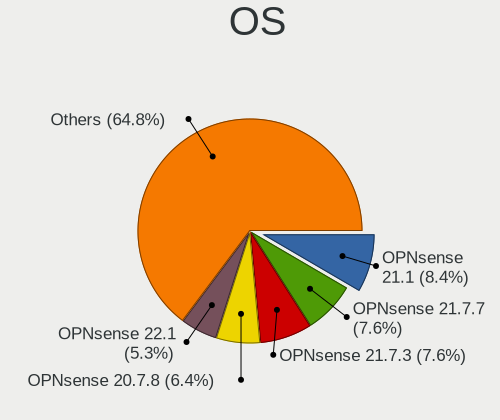

| Name            | Computers | Percent |
|-----------------|-----------|---------|
| OPNsense 21.1   | 49        | 8.66%   |
| OPNsense 21.7.7 | 44        | 7.77%   |
| OPNsense 21.7.3 | 44        | 7.77%   |
| OPNsense 20.7.8 | 37        | 6.54%   |
| OPNsense 22.1   | 32        | 5.65%   |
| OPNsense 21.7.1 | 30        | 5.3%    |
| OPNsense 21.1.3 | 28        | 4.95%   |
| OPNsense 22.1.4 | 26        | 4.59%   |
| OPNsense 21.1.5 | 26        | 4.59%   |
| OPNsense 21.1.7 | 25        | 4.42%   |
| OPNsense 21.1.1 | 24        | 4.24%   |
| OPNsense 21.7.6 | 21        | 3.71%   |
| OPNsense 21.7   | 20        | 3.53%   |
| OPNsense 21.1.4 | 19        | 3.36%   |
| OPNsense 21.1.8 | 17        | 3%      |
| OPNsense 21.1.6 | 17        | 3%      |
| OPNsense 21.1.2 | 17        | 3%      |
| OPNsense 21.7.4 | 16        | 2.83%   |
| OPNsense 22.1.2 | 15        | 2.65%   |
| OPNsense 21.7.2 | 11        | 1.94%   |
| OPNsense 22.1.3 | 10        | 1.77%   |
| OPNsense 21.7.5 | 10        | 1.77%   |
| OPNsense 22.1.1 | 9         | 1.59%   |
| OPNsense 21.1.9 | 5         | 0.88%   |
| OPNsense 20.7.7 | 4         | 0.71%   |
| OPNsense 21.7.8 | 3         | 0.53%   |
| OPNsense 22.7   | 2         | 0.35%   |
| OPNsense 20.7.6 | 1         | 0.18%   |
| OPNsense 20.7.4 | 1         | 0.18%   |
| OPNsense 20.7   | 1         | 0.18%   |
| OPNsense 20.1.8 | 1         | 0.18%   |
| OPNsense 20.1.7 | 1         | 0.18%   |

OS Family
---------

OS without a version

| Name     | Computers | Percent |
|----------|-----------|---------|
| OPNsense | 535       | 100%    |

Arch
----

OS architecture (x86_64, i586, etc.)

| Name  | Computers | Percent |
|-------|-----------|---------|
| amd64 | 535       | 100%    |

DE
--

Desktop Environment

| Name    | Computers | Percent |
|---------|-----------|---------|
| Console | 535       | 100%    |

Display Server
--------------

X11 or Wayland

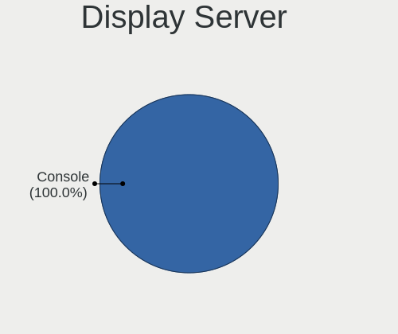

| Name    | Computers | Percent |
|---------|-----------|---------|
| Console | 535       | 100%    |

Display Manager
---------------

SDDM, LightDM, etc.

| Name    | Computers | Percent |
|---------|-----------|---------|
| Console | 535       | 100%    |

OS Lang
-------

Language

| Lang    | Computers | Percent |
|---------|-----------|---------|
| Unknown | 528       | 98.69%  |
| C       | 7         | 1.31%   |

Boot Mode
---------

EFI or BIOS

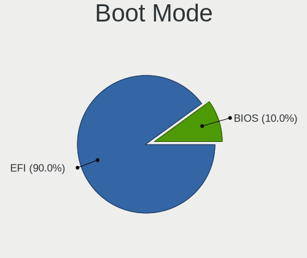

| Mode | Computers | Percent |
|------|-----------|---------|
| EFI  | 481       | 89.74%  |
| BIOS | 55        | 10.26%  |

Filesystem
----------

Type of filesystem

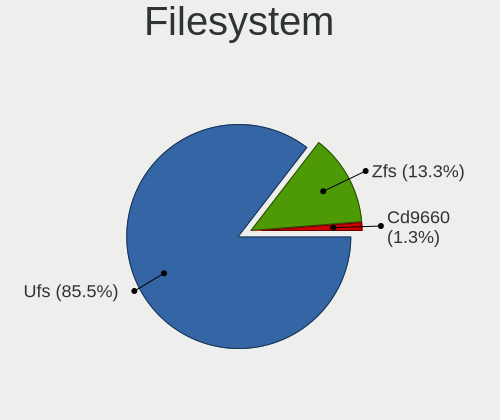

| Type   | Computers | Percent |
|--------|-----------|---------|
| Ufs    | 462       | 86.19%  |
| Zfs    | 67        | 12.5%   |
| Cd9660 | 7         | 1.31%   |

Part. scheme
------------

Scheme of partitioning

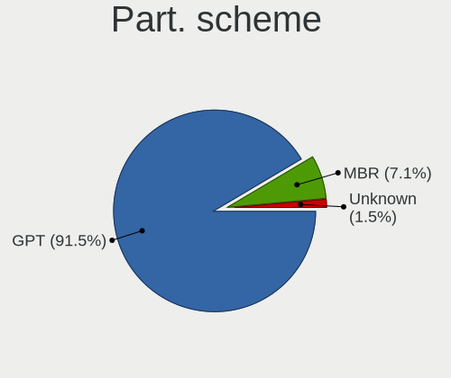

| Type    | Computers | Percent |
|---------|-----------|---------|
| GPT     | 490       | 91.25%  |
| MBR     | 39        | 7.26%   |
| Unknown | 8         | 1.49%   |

Board
-----

Vendor
------

Motherboard manufacturer

| Name                             | Computers | Percent |
|----------------------------------|-----------|---------|
| QEMU                             | 242       | 45.23%  |
| Intel                            | 174       | 32.52%  |
| Oracle                           | 50        | 9.35%   |
| Microsoft                        | 35        | 6.54%   |
| Xen                              | 11        | 2.06%   |
| Red Hat                          | 6         | 1.12%   |
| Unknown                          | 5         | 0.93%   |
| Hetzner                          | 4         | 0.75%   |
| Apache Software Foundation       | 2         | 0.37%   |
| Parallels Software International | 1         | 0.19%   |
| Joyent                           | 1         | 0.19%   |
| illumos                          | 1         | 0.19%   |
| Google                           | 1         | 0.19%   |
| FreeBSD                          | 1         | 0.19%   |
| Amazon EC2                       | 1         | 0.19%   |

Model
-----

Motherboard model

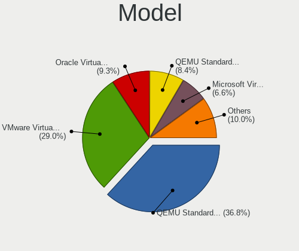

| Name                                                        | Computers | Percent |
|-------------------------------------------------------------|-----------|---------|
| QEMU Standard PC (i440FX + PIIX, 1996)                      | 198       | 37.01%  |
| Intel Virtual Platform                                      | 155       | 28.97%  |
| Oracle VirtualBox                                           | 50        | 9.35%   |
| QEMU Standard PC (Q35 + ICH9, 2009)                         | 44        | 8.22%   |
| Microsoft Virtual Machine                                   | 35        | 6.54%   |
| Intel VMware7,1                                             | 19        | 3.55%   |
| Xen HVM domU                                                | 11        | 2.06%   |
| Red Hat KVM                                                 | 6         | 1.12%   |
| Unknown                                                     | 5         | 0.93%   |
| Hetzner vServer                                             | 4         | 0.75%   |
| Apache Software Foundation CloudStack KVM Hypervisor        | 2         | 0.37%   |
| Parallels Software International Parallels Virtual Platform | 1         | 0.19%   |
| Joyent SmartDC HVM                                          | 1         | 0.19%   |
| illumos SmartDC HVM                                         | 1         | 0.19%   |
| Google Compute Engine                                       | 1         | 0.19%   |
| FreeBSD BHYVE                                               | 1         | 0.19%   |
| Amazon EC2 t3.micro                                         | 1         | 0.19%   |

Model Family
------------

Motherboard model prefix

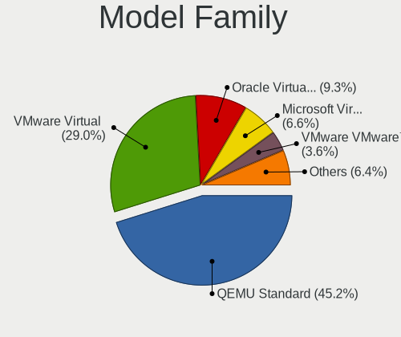

| Name                                       | Computers | Percent |
|--------------------------------------------|-----------|---------|
| QEMU Standard                              | 242       | 45.23%  |
| Intel Virtual                              | 155       | 28.97%  |
| Oracle VirtualBox                          | 50        | 9.35%   |
| Microsoft Virtual                          | 35        | 6.54%   |
| Intel VMware7                              | 19        | 3.55%   |
| Xen HVM                                    | 11        | 2.06%   |
| Red Hat KVM                                | 6         | 1.12%   |
| Unknown                                    | 5         | 0.93%   |
| Hetzner vServer                            | 4         | 0.75%   |
| Apache Software Foundation CloudStack      | 2         | 0.37%   |
| Parallels Software International Parallels | 1         | 0.19%   |
| Joyent SmartDC                             | 1         | 0.19%   |
| illumos SmartDC                            | 1         | 0.19%   |
| Google Compute                             | 1         | 0.19%   |
| FreeBSD BHYVE                              | 1         | 0.19%   |
| Amazon EC2 t3.micro                        | 1         | 0.19%   |

MFG Year
--------

Motherboard manufacture year

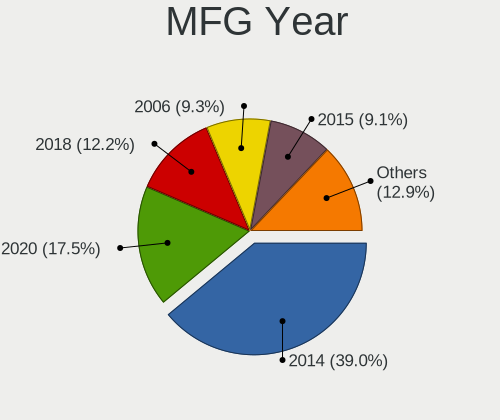

| Year    | Computers | Percent |
|---------|-----------|---------|
| 2014    | 209       | 39.07%  |
| 2020    | 92        | 17.2%   |
| 2018    | 67        | 12.52%  |
| 2006    | 50        | 9.35%   |
| 2015    | 49        | 9.16%   |
| 2019    | 33        | 6.17%   |
| 2017    | 10        | 1.87%   |
| 2021    | 7         | 1.31%   |
| 2016    | 4         | 0.75%   |
| 2012    | 4         | 0.75%   |
| 2022    | 3         | 0.56%   |
| 2011    | 3         | 0.56%   |
| 2013    | 2         | 0.37%   |
| Unknown | 2         | 0.37%   |

Form Factor
-----------

Physical design of the computer

| Name            | Computers | Percent |
|-----------------|-----------|---------|
| Virtual machine | 535       | 100%    |

Coreboot
--------

Have coreboot on board

| Used | Computers | Percent |
|------|-----------|---------|
| No   | 535       | 100%    |

RAM Size
--------

Total RAM memory

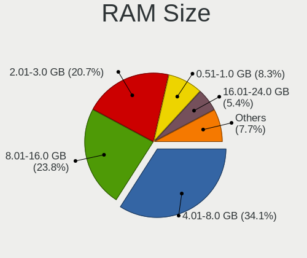

| Size in GB  | Computers | Percent |
|-------------|-----------|---------|
| 4.01-8.0    | 182       | 33.64%  |
| 8.01-16.0   | 130       | 24.03%  |
| 2.01-3.0    | 112       | 20.7%   |
| 0.51-1.0    | 44        | 8.13%   |
| 16.01-24.0  | 30        | 5.55%   |
| 3.01-4.0    | 15        | 2.77%   |
| 1.01-2.0    | 10        | 1.85%   |
| 32.01-64.0  | 7         | 1.29%   |
| 0.01-0.5    | 7         | 1.29%   |
| 64.01-256.0 | 4         | 0.74%   |

RAM Used
--------

Used RAM memory

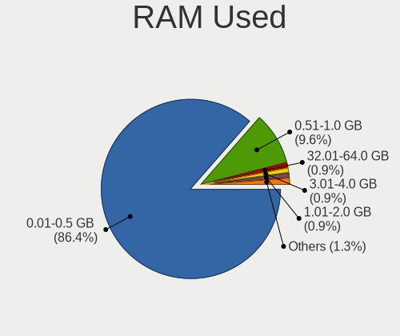

| Used GB    | Computers | Percent |
|------------|-----------|---------|
| 0.01-0.5   | 465       | 86.27%  |
| 0.51-1.0   | 52        | 9.65%   |
| 32.01-64.0 | 5         | 0.93%   |
| 3.01-4.0   | 5         | 0.93%   |
| 1.01-2.0   | 5         | 0.93%   |
| 4.01-8.0   | 4         | 0.74%   |
| 8.01-16.0  | 2         | 0.37%   |
| 2.01-3.0   | 1         | 0.19%   |

Total Drives
------------

Number of drives on board

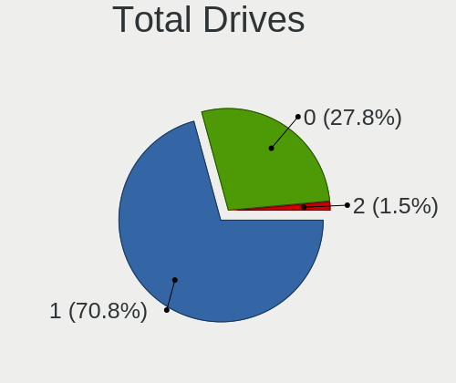

| Drives | Computers | Percent |
|--------|-----------|---------|
| 1      | 381       | 70.95%  |
| 0      | 148       | 27.56%  |
| 2      | 8         | 1.49%   |

Has CD-ROM
----------

Has CD-ROM on board

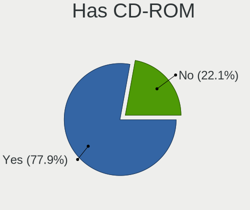

| Presented | Computers | Percent |
|-----------|-----------|---------|
| Yes       | 417       | 77.65%  |
| No        | 120       | 22.35%  |

Has Ethernet
------------

Has Ethernet on board

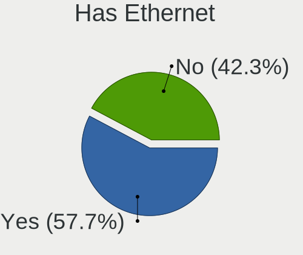

| Presented | Computers | Percent |
|-----------|-----------|---------|
| Yes       | 311       | 58.13%  |
| No        | 224       | 41.87%  |

Has WiFi
--------

Has WiFi module

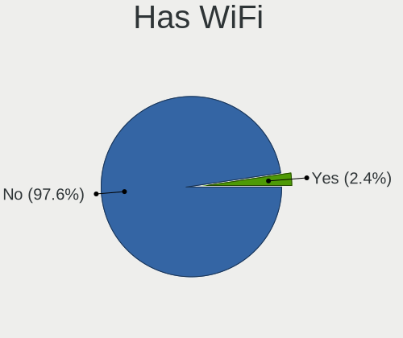

| Presented | Computers | Percent |
|-----------|-----------|---------|
| No        | 524       | 97.58%  |
| Yes       | 13        | 2.42%   |

Has Bluetooth
-------------

Has Bluetooth module

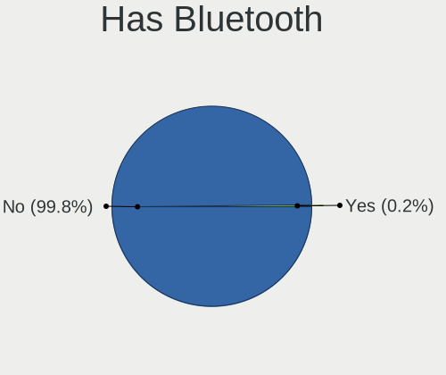

| Presented | Computers | Percent |
|-----------|-----------|---------|
| No        | 534       | 99.81%  |
| Yes       | 1         | 0.19%   |

Location
--------

Country
-------

Geographic location (country)

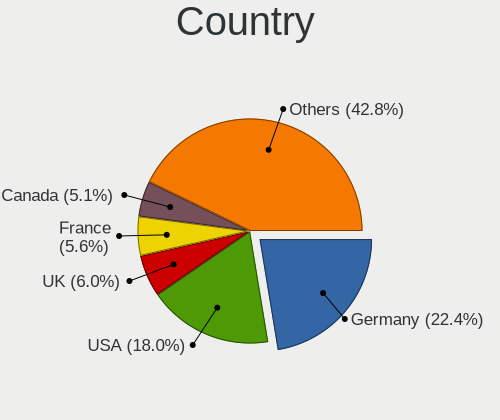

| Country            | Computers | Percent |
|--------------------|-----------|---------|
| Germany            | 121       | 22.62%  |
| USA                | 96        | 17.94%  |
| UK                 | 33        | 6.17%   |
| France             | 31        | 5.79%   |
| Canada             | 28        | 5.23%   |
| China              | 27        | 5.05%   |
| Netherlands        | 13        | 2.43%   |
| Brazil             | 12        | 2.24%   |
| Russia             | 11        | 2.06%   |
| Romania            | 10        | 1.87%   |
| Poland             | 10        | 1.87%   |
| Italy              | 10        | 1.87%   |
| Czechia            | 10        | 1.87%   |
| Austria            | 10        | 1.87%   |
| Australia          | 10        | 1.87%   |
| Sweden             | 8         | 1.5%    |
| Belgium            | 7         | 1.31%   |
| India              | 6         | 1.12%   |
| Denmark            | 6         | 1.12%   |
| Belarus            | 6         | 1.12%   |
| Spain              | 5         | 0.93%   |
| Ukraine            | 4         | 0.75%   |
| Switzerland        | 4         | 0.75%   |
| Hong Kong          | 4         | 0.75%   |
| Norway             | 3         | 0.56%   |
| Ghana              | 3         | 0.56%   |
| Finland            | 3         | 0.56%   |
| UAE                | 2         | 0.37%   |
| Taiwan             | 2         | 0.37%   |
| South Korea        | 2         | 0.37%   |
| Slovakia           | 2         | 0.37%   |
| New Zealand        | 2         | 0.37%   |
| Malaysia           | 2         | 0.37%   |
| Macao              | 2         | 0.37%   |
| Lithuania          | 2         | 0.37%   |
| Latvia             | 2         | 0.37%   |
| Iran               | 2         | 0.37%   |
| Greece             | 2         | 0.37%   |
| Chile              | 2         | 0.37%   |
| Bulgaria           | 2         | 0.37%   |
| Turkey             | 1         | 0.19%   |
| South Africa       | 1         | 0.19%   |
| Serbia             | 1         | 0.19%   |
| Portugal           | 1         | 0.19%   |
| Philippines        | 1         | 0.19%   |
| Peru               | 1         | 0.19%   |
| Pakistan           | 1         | 0.19%   |
| Mexico             | 1         | 0.19%   |
| Japan              | 1         | 0.19%   |
| Israel             | 1         | 0.19%   |
| Ireland            | 1         | 0.19%   |
| Hungary            | 1         | 0.19%   |
| Egypt              | 1         | 0.19%   |
| Dominican Republic | 1         | 0.19%   |
| Costa Rica         | 1         | 0.19%   |
| Bahamas            | 1         | 0.19%   |
| Armenia            | 1         | 0.19%   |
| Argentina          | 1         | 0.19%   |

City
----

Geographic location (city)

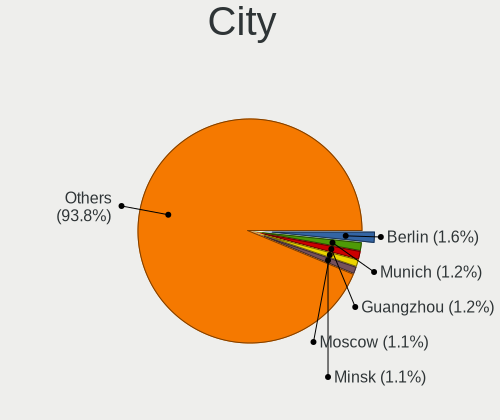

| City               | Computers | Percent |
|--------------------|-----------|---------|
| Berlin             | 10        | 1.83%   |
| Munich             | 7         | 1.28%   |
| Minsk              | 6         | 1.1%    |
| Guangzhou          | 6         | 1.1%    |
| Bucharest          | 6         | 1.1%    |
| Warsaw             | 5         | 0.92%   |
| Prague             | 5         | 0.92%   |
| Paris              | 5         | 0.92%   |
| Nuremberg          | 5         | 0.92%   |
| London             | 5         | 0.92%   |
| Falkenstein        | 5         | 0.92%   |
| Vienna             | 4         | 0.73%   |
| Victoria           | 4         | 0.73%   |
| Moscow             | 4         | 0.73%   |
| Hamburg            | 4         | 0.73%   |
| Cologne            | 4         | 0.73%   |
| City of London     | 4         | 0.73%   |
| Sydney             | 3         | 0.55%   |
| Seattle            | 3         | 0.55%   |
| Mountain View      | 3         | 0.55%   |
| Mnchengladbach | 3         | 0.55%   |
| Essen              | 3         | 0.55%   |
| Curitiba           | 3         | 0.55%   |
| Constana      | 3         | 0.55%   |
| Changsha           | 3         | 0.55%   |
| Brookline          | 3         | 0.55%   |
| Blairsville        | 3         | 0.55%   |
| Zaporizhzhia       | 2         | 0.37%   |
| Walla Walla        | 2         | 0.37%   |
| Tehran             | 2         | 0.37%   |
| Taoyuan District   | 2         | 0.37%   |
| Springdale         | 2         | 0.37%   |
| Solna              | 2         | 0.37%   |
| Sofia              | 2         | 0.37%   |
| Sao Paulo          | 2         | 0.37%   |
| Rucphen            | 2         | 0.37%   |
| Riga               | 2         | 0.37%   |
| Richmond           | 2         | 0.37%   |
| Peine              | 2         | 0.37%   |
| Oslo               | 2         | 0.37%   |
| Navodari           | 2         | 0.37%   |
| Madrid             | 2         | 0.37%   |
| Macao              | 2         | 0.37%   |
| Louisville         | 2         | 0.37%   |
| Los Angeles        | 2         | 0.37%   |
| Lbeck          | 2         | 0.37%   |
| Las Vegas          | 2         | 0.37%   |
| Kuala Lumpur       | 2         | 0.37%   |
| Helsinki           | 2         | 0.37%   |
| Hastings           | 2         | 0.37%   |
| Hangzhou           | 2         | 0.37%   |
| Gravelines         | 2         | 0.37%   |
| Frankfurt am Main  | 2         | 0.37%   |
| Framersheim        | 2         | 0.37%   |
| Dubai              | 2         | 0.37%   |
| Dormagen           | 2         | 0.37%   |
| Coquitlam          | 2         | 0.37%   |
| Copenhagen         | 2         | 0.37%   |
| Bristol            | 2         | 0.37%   |
| Brisbane           | 2         | 0.37%   |

Drives
------

Drive Vendor
------------

Hard drive vendors

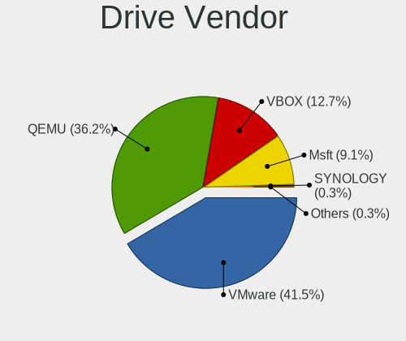

| Vendor   | Computers | Drives | Percent |
|----------|-----------|--------|---------|
| VMware   | 160       | 172    | 41.45%  |
| QEMU     | 140       | 156    | 36.27%  |
| VBOX     | 49        | 54     | 12.69%  |
| Msft     | 35        | 36     | 9.07%   |
| SYNOLOGY | 1         | 1      | 0.26%   |
| Google   | 1         | 2      | 0.26%   |

Drive Model
-----------

Hard drive models

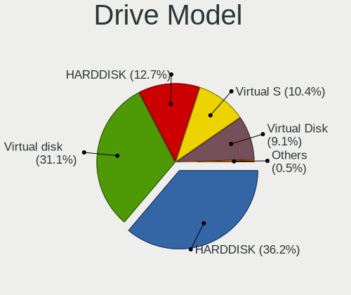

| Model                 | Computers | Percent |
|-----------------------|-----------|---------|
| QEMU HARDDISK         | 140       | 36.27%  |
| VMware Virtual disk   | 121       | 31.35%  |
| VBOX HARDDISK         | 49        | 12.69%  |
| VMware Virtual S      | 39        | 10.1%   |
| Msft Virtual Disk     | 35        | 9.07%   |
| SYNOLOGY Storage      | 1         | 0.26%   |
| Google PersistentDisk | 1         | 0.26%   |

HDD Vendor
----------

Hard disk drive vendors

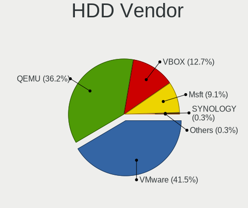

| Vendor   | Computers | Drives | Percent |
|----------|-----------|--------|---------|
| VMware   | 160       | 172    | 41.45%  |
| QEMU     | 140       | 156    | 36.27%  |
| VBOX     | 49        | 54     | 12.69%  |
| Msft     | 35        | 36     | 9.07%   |
| SYNOLOGY | 1         | 1      | 0.26%   |
| Google   | 1         | 2      | 0.26%   |

SSD Vendor
----------

Solid state drive vendors

Zero info for selected period =(

Drive Kind
----------

HDD or SSD

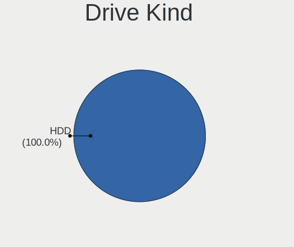

| Kind | Computers | Drives | Percent |
|------|-----------|--------|---------|
| HDD  | 386       | 421    | 100%    |

Drive Connector
---------------

SATA, SAS, NVMe, etc.

| Type | Computers | Drives | Percent |
|------|-----------|--------|---------|
| SATA | 386       | 421    | 100%    |

Drive Size
----------

Size of hard drive

| Size in TB | Computers | Drives | Percent |
|------------|-----------|--------|---------|
| 0.01-0.5   | 386       | 421    | 100%    |

Space Total
-----------

Amount of disk space available on the file system

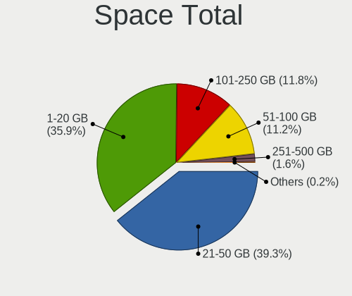

| Size in GB | Computers | Percent |
|------------|-----------|---------|
| 21-50      | 208       | 38.66%  |
| 1-20       | 193       | 35.87%  |
| 101-250    | 65        | 12.08%  |
| 51-100     | 62        | 11.52%  |
| 251-500    | 9         | 1.67%   |
| 1001-2000  | 1         | 0.19%   |

Space Used
----------

Amount of used disk space

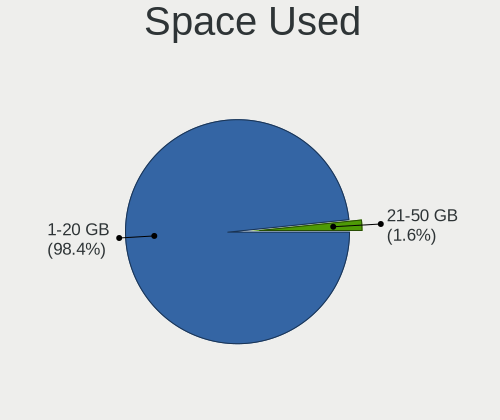

| Used GB | Computers | Percent |
|---------|-----------|---------|
| 1-20    | 527       | 98.32%  |
| 21-50   | 9         | 1.68%   |

Malfunc. Drives
---------------

Drive models with a malfunction

Zero info for selected period =(

Malfunc. Drive Vendor
---------------------

Vendors of faulty drives

Zero info for selected period =(

Malfunc. HDD Vendor
-------------------

Vendors of faulty HDD drives

Zero info for selected period =(

Malfunc. Drive Kind
-------------------

Kinds of faulty drives

Zero info for selected period =(

Failed Drives
-------------

Failed drive models

Zero info for selected period =(

Failed Drive Vendor
-------------------

Failed drive vendors

Zero info for selected period =(

Drive Status
------------

Number of failed and malfunc. drives

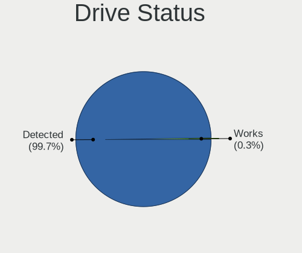

| Status   | Computers | Drives | Percent |
|----------|-----------|--------|---------|
| Detected | 385       | 420    | 99.74%  |
| Works    | 1         | 1      | 0.26%   |

Storage controller
------------------

Storage Vendor
--------------

Storage controller vendors

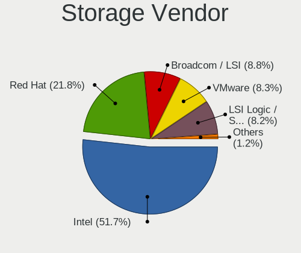

| Vendor                    | Computers | Percent |
|---------------------------|-----------|---------|
| Intel                     | 510       | 51.78%  |
| Red Hat                   | 213       | 21.62%  |
| Broadcom / LSI            | 87        | 8.83%   |
| VMware                    | 82        | 8.32%   |
| LSI Logic / Symbios Logic | 81        | 8.22%   |
| XenSource                 | 11        | 1.12%   |
| Amazon.com                | 1         | 0.1%    |

Storage Model
-------------

Storage controller models

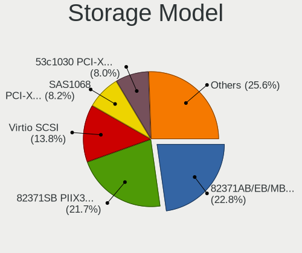

| Model                                                                 | Computers | Percent |
|-----------------------------------------------------------------------|-----------|---------|
| Intel 82371AB/EB/MB PIIX4 IDE                                         | 231       | 22.78%  |
| Intel 82371SB PIIX3 IDE [Natoma/Triton II]                            | 221       | 21.79%  |
| Red Hat Virtio SCSI                                                   | 140       | 13.81%  |
| Broadcom / LSI SAS1068 PCI-X Fusion-MPT SAS                           | 83        | 8.19%   |
| LSI Logic / Symbios Logic 53c1030 PCI-X Fusion-MPT Dual Ultra320 SCSI | 81        | 7.99%   |
| VMware SATA AHCI controller                                           | 75        | 7.4%    |
| Red Hat Virtio block device                                           | 75        | 7.4%    |
| Intel 82801IR/IO/IH (ICH9R/DO/DH) 6 port SATA Controller [AHCI mode]  | 65        | 6.41%   |
| XenSource Xen Platform Device                                         | 11        | 1.08%   |
| Intel 82801HM/HEM (ICH8M/ICH8M-E) SATA Controller [AHCI mode]         | 11        | 1.08%   |
| Intel 82801HR/HO/HH (ICH8R/DO/DH) 6 port SATA Controller [AHCI mode]  | 6         | 0.59%   |
| VMware PVSCSI SCSI Controller                                         | 5         | 0.49%   |
| VMware NVMe SSD Controller                                            | 4         | 0.39%   |
| Broadcom / LSI 53c895a                                                | 4         | 0.39%   |
| Intel 82801BA IDE U100 Controller                                     | 1         | 0.1%    |
| Amazon.com NVMe EBS Controller                                        | 1         | 0.1%    |

Storage Kind
------------

Kind of storage controller (IDE, SATA, NVMe, SAS, ...)

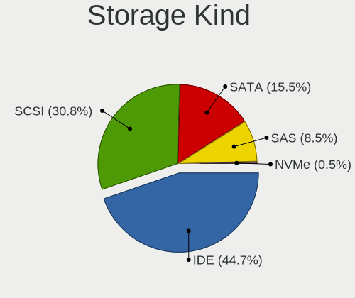

| Kind | Computers | Percent |
|------|-----------|---------|
| IDE  | 453       | 44.81%  |
| SCSI | 310       | 30.66%  |
| SATA | 157       | 15.53%  |
| SAS  | 86        | 8.51%   |
| NVMe | 5         | 0.49%   |

Processor
---------

CPU Vendor
----------

Processor vendors

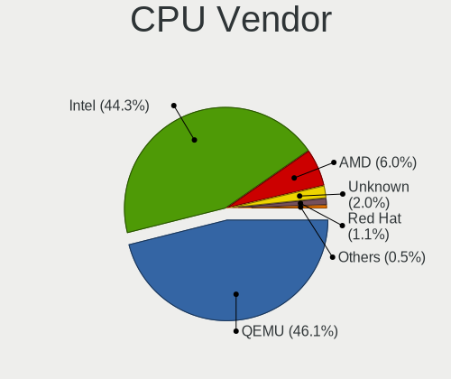

| Vendor  | Computers | Percent |
|---------|-----------|---------|
| QEMU    | 246       | 45.98%  |
| Intel   | 236       | 44.11%  |
| AMD     | 33        | 6.17%   |
| Unknown | 11        | 2.06%   |
| Red Hat | 6         | 1.12%   |
| Bochs   | 2         | 0.37%   |
| Google  | 1         | 0.19%   |

CPU Model
---------

Processor models

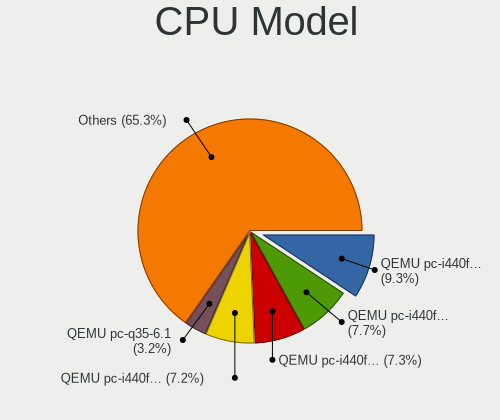

| Model                                       | Computers | Percent |
|---------------------------------------------|-----------|---------|
| QEMU pc-i440fx-5.2                          | 52        | 9.54%   |
| QEMU pc-i440fx-6.0                          | 43        | 7.89%   |
| QEMU pc-i440fx-5.1                          | 41        | 7.52%   |
| QEMU pc-i440fx-6.1                          | 36        | 6.61%   |
| QEMU pc-q35-6.1                             | 17        | 3.12%   |
|                                             | 11        | 2.02%   |
| QEMU pc-q35-5.2                             | 10        | 1.83%   |
| QEMU pc-q35-6.0                             | 8         | 1.47%   |
| QEMU pc-q35-5.1                             | 8         | 1.47%   |
| Intel Other                                 | 8         | 1.47%   |
| QEMU pc-i440fx-focal                        | 6         | 1.1%    |
| Intel Core i5-6500 CPU @ 3.20GHz            | 6         | 1.1%    |
| QEMU pc-i440fx-5.0                          | 5         | 0.92%   |
| Intel Xeon CPU E5-2620 v4 @ 2.10GHz         | 5         | 0.92%   |
| Intel Core i5-8400 CPU @ 2.80GHz            | 5         | 0.92%   |
| Red Hat RHEL 7.6.0 PC (i440FX + PIIX, 1996) | 4         | 0.73%   |
| QEMU pc-i440fx-4.2                          | 4         | 0.73%   |
| QEMU pc-i440fx-3.1                          | 4         | 0.73%   |
| QEMU Other                                  | 4         | 0.73%   |
| Intel Xeon Silver 4110 CPU @ 2.10GHz        | 4         | 0.73%   |
| Intel Xeon CPU E5-2630 0 @ 2.30GHz          | 4         | 0.73%   |
| Intel Core i9-9900K CPU @ 3.60GHz           | 4         | 0.73%   |
| Intel Core i7-8750H CPU @ 2.20GHz           | 4         | 0.73%   |
| Intel Core i7-6700 CPU @ 3.40GHz            | 4         | 0.73%   |
| QEMU pc-i440fx-impish                       | 3         | 0.55%   |
| QEMU pc-i440fx-4.1                          | 3         | 0.55%   |
| Intel Xeon CPU X5650 @ 2.67GHz              | 3         | 0.55%   |
| Intel Xeon CPU E5-2660 v2 @ 2.20GHz         | 3         | 0.55%   |
| Intel Pentium CPU 5405U @ 2.30GHz           | 3         | 0.55%   |
| Intel Core i5-5200U CPU @ 2.20GHz           | 3         | 0.55%   |
| AMD Ryzen 9 3900X 12-Core Processor         | 3         | 0.55%   |
| AMD Ryzen 5 3600 6-Core Processor           | 3         | 0.55%   |
| AMD Other                                   | 3         | 0.55%   |
| QEMU pc-q35-6.2                             | 2         | 0.37%   |
| QEMU pc-i440fx-groovy                       | 2         | 0.37%   |
| QEMU pc-i440fx-2.2                          | 2         | 0.37%   |
| Intel Xeon E-2146G CPU @ 3.50GHz            | 2         | 0.37%   |
| Intel Xeon CPU X5675 @ 3.07GHz              | 2         | 0.37%   |
| Intel Xeon CPU X5670 @ 2.93GHz              | 2         | 0.37%   |
| Intel Xeon CPU X3430 @ 2.40GHz              | 2         | 0.37%   |
| Intel Xeon CPU E5620 @ 2.40GHz              | 2         | 0.37%   |
| Intel Xeon CPU E5540 @ 2.53GHz              | 2         | 0.37%   |
| Intel Xeon CPU E5-2660 0 @ 2.20GHz          | 2         | 0.37%   |
| Intel Xeon CPU E5-2630 v3 @ 2.40GHz         | 2         | 0.37%   |
| Intel Xeon CPU E5-2603 v4 @ 1.70GHz         | 2         | 0.37%   |
| Intel Xeon CPU E3-1231 v3 @ 3.40GHz         | 2         | 0.37%   |
| Intel Xeon CPU E3-1230 v6 @ 3.50GHz         | 2         | 0.37%   |
| Intel Xeon                                  | 2         | 0.37%   |
| Intel Genuine CPU 0000 @ 2.50GHz            | 2         | 0.37%   |
| Intel Core i7-7700K CPU @ 4.20GHz           | 2         | 0.37%   |
| Intel Core i7-4770 CPU @ 3.40GHz            | 2         | 0.37%   |
| Intel Core i7-3615QM CPU @ 2.30GHz          | 2         | 0.37%   |
| Intel Core i5-8279U CPU @ 2.40GHz           | 2         | 0.37%   |
| Intel Core i5-7200U CPU @ 2.50GHz           | 2         | 0.37%   |
| Intel Core i5-4570 CPU @ 3.20GHz            | 2         | 0.37%   |
| Intel Core i5-10400 CPU @ 2.90GHz           | 2         | 0.37%   |
| Intel Core i3-6100U CPU @ 2.30GHz           | 2         | 0.37%   |
| Intel Core i3-6100 CPU @ 3.70GHz            | 2         | 0.37%   |
| Intel Celeron J4125 CPU @ 2.00GHz           | 2         | 0.37%   |
| Bochs Other                                 | 2         | 0.37%   |

CPU Model Family
----------------

Processor model prefix

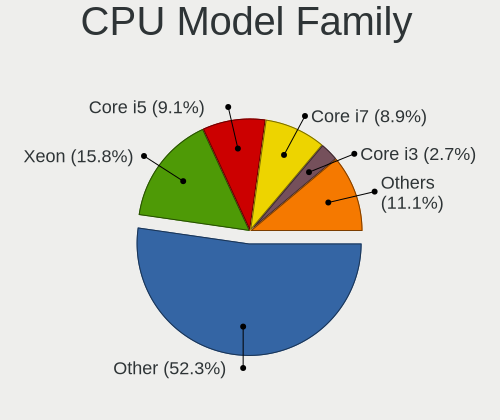

| Model                | Computers | Percent |
|----------------------|-----------|---------|
| Other                | 280       | 52.34%  |
| Intel Xeon           | 84        | 15.7%   |
| Intel Core i5        | 49        | 9.16%   |
| Intel Core i7        | 46        | 8.6%    |
| Intel Core i3        | 15        | 2.8%    |
| AMD Ryzen 9          | 8         | 1.5%    |
| Intel Core i9        | 7         | 1.31%   |
| Intel Xeon Silver    | 6         | 1.12%   |
| Intel Celeron        | 6         | 1.12%   |
| AMD Ryzen 5          | 6         | 1.12%   |
| Intel Pentium        | 4         | 0.75%   |
| AMD Ryzen 7          | 4         | 0.75%   |
| AMD Ryzen 7 PRO      | 3         | 0.56%   |
| Intel Xeon Gold      | 2         | 0.37%   |
| Intel Genuine        | 2         | 0.37%   |
| AMD Phenom II X4     | 2         | 0.37%   |
| Intel Xeon Platinum  | 1         | 0.19%   |
| Intel Pentium Gold   | 1         | 0.19%   |
| Intel Core 2 Quad    | 1         | 0.19%   |
| Intel Atom           | 1         | 0.19%   |
| AMD Z                | 1         | 0.19%   |
| AMD Six-Core Opteron | 1         | 0.19%   |
| AMD Ryzen 3          | 1         | 0.19%   |
| AMD Phenom II X6     | 1         | 0.19%   |
| AMD Opteron          | 1         | 0.19%   |
| AMD FX               | 1         | 0.19%   |
| AMD EPYC             | 1         | 0.19%   |

CPU Cores
---------

Number of processor cores

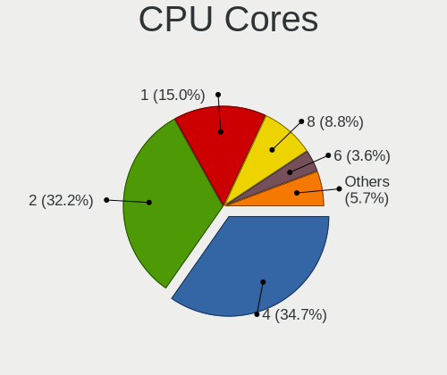

| Number  | Computers | Percent |
|---------|-----------|---------|
| 4       | 191       | 35.05%  |
| 2       | 172       | 31.56%  |
| 1       | 83        | 15.23%  |
| 8       | 49        | 8.99%   |
| 6       | 19        | 3.49%   |
| Unknown | 13        | 2.39%   |
| 3       | 7         | 1.28%   |
| 12      | 5         | 0.92%   |
| 16      | 3         | 0.55%   |
| 36      | 1         | 0.18%   |
| 24      | 1         | 0.18%   |
| 15      | 1         | 0.18%   |

CPU Sockets
-----------

Number of sockets

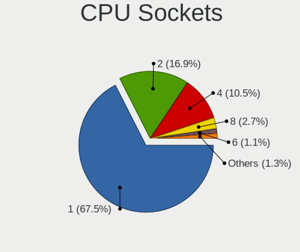

| Number | Computers | Percent |
|--------|-----------|---------|
| 1      | 363       | 67.6%   |
| 2      | 89        | 16.57%  |
| 4      | 57        | 10.61%  |
| 8      | 15        | 2.79%   |
| 6      | 6         | 1.12%   |
| 64     | 2         | 0.37%   |
| 3      | 2         | 0.37%   |
| 128    | 1         | 0.19%   |
| 15     | 1         | 0.19%   |
| 12     | 1         | 0.19%   |

CPU Threads
-----------

Threads per core (Hyper-Threading)

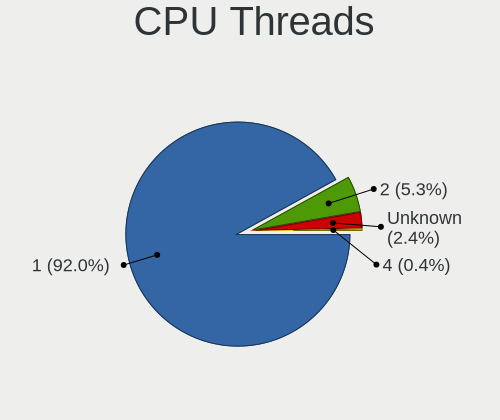

| Number  | Computers | Percent |
|---------|-----------|---------|
| 1       | 492       | 91.96%  |
| 2       | 28        | 5.23%   |
| Unknown | 13        | 2.43%   |
| 4       | 2         | 0.37%   |

CPU Microarch
-------------

Microarchitecture

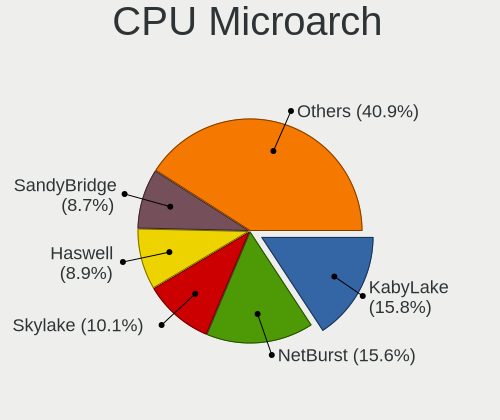

| Name          | Computers | Percent |
|---------------|-----------|---------|
| KabyLake      | 86        | 15.99%  |
| NetBurst      | 83        | 15.43%  |
| Skylake       | 56        | 10.41%  |
| Haswell       | 48        | 8.92%   |
| SandyBridge   | 43        | 7.99%   |
| IvyBridge     | 35        | 6.51%   |
| Zen 2         | 30        | 5.58%   |
| Westmere      | 28        | 5.2%    |
| Broadwell     | 24        | 4.46%   |
| K8 Hammer     | 20        | 3.72%   |
| CometLake     | 15        | 2.79%   |
| Nehalem       | 9         | 1.67%   |
| Zen+          | 8         | 1.49%   |
| Zen           | 7         | 1.3%    |
| Goldmont plus | 7         | 1.3%    |
| Unknown       | 7         | 1.3%    |
| Zen 3         | 6         | 1.12%   |
| K10           | 6         | 1.12%   |
| Silvermont    | 4         | 0.74%   |
| Goldmont      | 4         | 0.74%   |
| Piledriver    | 3         | 0.56%   |
| Bulldozer     | 2         | 0.37%   |
| TigerLake     | 1         | 0.19%   |
| Steamroller   | 1         | 0.19%   |
| Penryn        | 1         | 0.19%   |
| P6            | 1         | 0.19%   |
| K6            | 1         | 0.19%   |
| IceLake       | 1         | 0.19%   |
| Core          | 1         | 0.19%   |

Graphics
--------

GPU Vendor
----------

Vendors of graphics cards

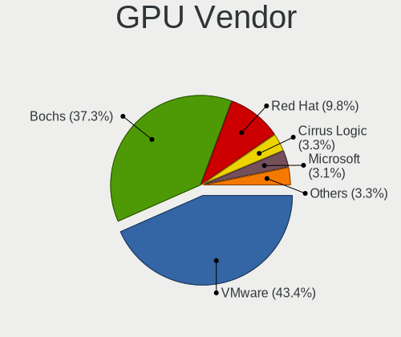

| Vendor                 | Computers | Percent |
|------------------------|-----------|---------|
| VMware                 | 222       | 43.53%  |
| Bochs                  | 189       | 37.06%  |
| Red Hat                | 50        | 9.8%    |
| Cirrus Logic           | 17        | 3.33%   |
| Microsoft              | 16        | 3.14%   |
| Unknown                | 6         | 1.18%   |
| InnoTek Systemberatung | 5         | 0.98%   |
| Technical              | 3         | 0.59%   |
| Parallels              | 1         | 0.2%    |
| Amazon.com             | 1         | 0.2%    |

GPU Model
---------

Graphics card models

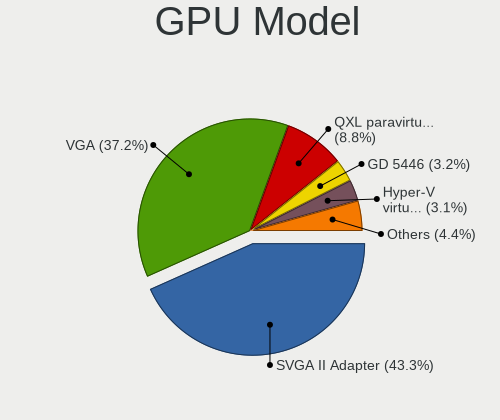

| Model                                              | Computers | Percent |
|----------------------------------------------------|-----------|---------|
| VMware SVGA II Adapter                             | 222       | 43.44%  |
| Bochs VGA                                          | 189       | 36.99%  |
| Red Hat QXL paravirtual graphic card               | 45        | 8.81%   |
| Cirrus Logic GD 5446                               | 17        | 3.33%   |
| Microsoft Hyper-V virtual VGA                      | 16        | 3.13%   |
| Unknown                                            | 10        | 1.96%   |
| Red Hat Virtio GPU                                 | 6         | 1.17%   |
| InnoTek Systemberatung VirtualBox Graphics Adapter | 5         | 0.98%   |
| Parallels Accelerated Virtual Video Adapter        | 1         | 0.2%    |

GPU Combo
---------

Combinations of graphics cards

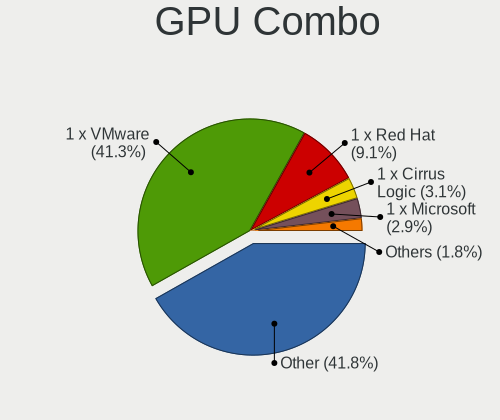

| Name                       | Computers | Percent |
|----------------------------|-----------|---------|
| Other                      | 223       | 41.68%  |
| 1 x VMware                 | 222       | 41.5%   |
| 1 x Red Hat                | 49        | 9.16%   |
| 1 x Cirrus Logic           | 17        | 3.18%   |
| 1 x Microsoft              | 16        | 2.99%   |
| 1 x InnoTek Systemberatung | 5         | 0.93%   |
| 2 x Red Hat                | 1         | 0.19%   |
| 1 x Parallels              | 1         | 0.19%   |
| 1 x Amazon.com             | 1         | 0.19%   |

GPU Driver
----------

Free vs proprietary

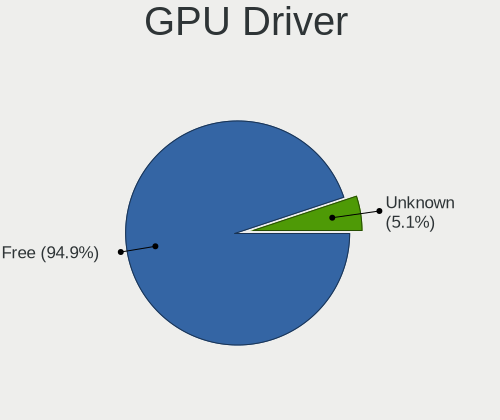

| Driver  | Computers | Percent |
|---------|-----------|---------|
| Free    | 508       | 94.95%  |
| Unknown | 27        | 5.05%   |

GPU Memory
----------

Total video memory

| Size in GB | Computers | Percent |
|------------|-----------|---------|
| Unknown    | 535       | 100%    |

Monitor
-------

Monitor Vendor
--------------

Monitor vendors

Zero info for selected period =(

Monitor Model
-------------

Monitor models

Zero info for selected period =(

Monitor Resolution
------------------

Monitor screen resolution

Zero info for selected period =(

Monitor Diagonal
----------------

Diagonal size in inches

Zero info for selected period =(

Monitor Width
-------------

Physical width

Zero info for selected period =(

Aspect Ratio
------------

Proportional relationship between the width and the height

Zero info for selected period =(

Monitor Area
------------

Area in inch

Zero info for selected period =(

Pixel Density
-------------

Pixels per inch

Zero info for selected period =(

Multiple Monitors
-----------------

Total monitors connected

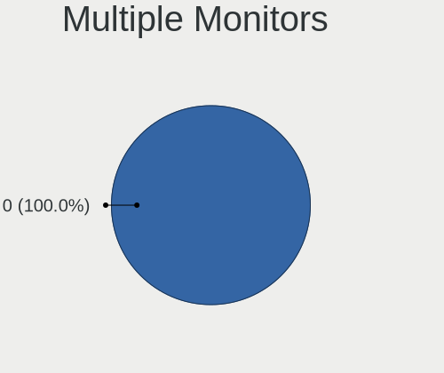

| Total | Computers | Percent |
|-------|-----------|---------|
| 0     | 535       | 100%    |

Network
-------

Net Controller Vendor
---------------------

Controller vendors

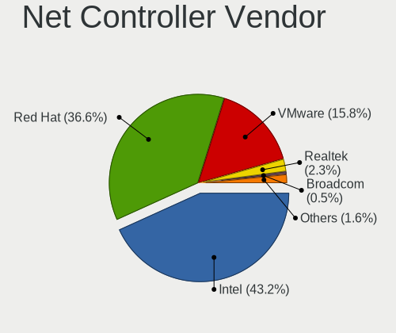

| Vendor                | Computers | Percent |
|-----------------------|-----------|---------|
| Intel                 | 244       | 43.88%  |
| Red Hat               | 201       | 36.15%  |
| VMware                | 87        | 15.65%  |
| Realtek Semiconductor | 13        | 2.34%   |
| Broadcom              | 3         | 0.54%   |
| TP-Link               | 2         | 0.36%   |
| Qumranet              | 2         | 0.36%   |
| Mellanox Technologies | 2         | 0.36%   |
| Qualcomm Atheros      | 1         | 0.18%   |
| Amazon.com            | 1         | 0.18%   |

Net Controller Model
--------------------

Controller models

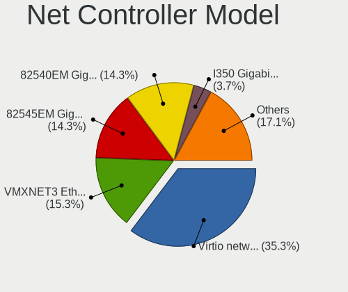

| Model                                                                         | Computers | Percent |
|-------------------------------------------------------------------------------|-----------|---------|
| Red Hat Virtio network device                                                 | 201       | 34.9%   |
| VMware VMXNET3 Ethernet Controller                                            | 87        | 15.1%   |
| Intel 82540EM Gigabit Ethernet Controller                                     | 84        | 14.58%  |
| Intel 82545EM Gigabit Ethernet Controller (Copper)                            | 82        | 14.24%  |
| Intel I350 Gigabit Network Connection                                         | 22        | 3.82%   |
| Intel 82574L Gigabit Network Connection                                       | 16        | 2.78%   |
| Intel I210 Gigabit Network Connection                                         | 11        | 1.91%   |
| Intel I211 Gigabit Network Connection                                         | 7         | 1.22%   |
| Intel 82580 Gigabit Network Connection                                        | 5         | 0.87%   |
| Realtek RTL-8100/8101L/8139 PCI Fast Ethernet Adapter                         | 4         | 0.69%   |
| Intel 82576 Gigabit Network Connection                                        | 4         | 0.69%   |
| Intel 82571EB/82571GB Gigabit Ethernet Controller D0/D1 (copper applications) | 4         | 0.69%   |
| Realtek RTL8111/8168/8411 PCI Express Gigabit Ethernet Controller             | 3         | 0.52%   |
| Realtek RTL8125 2.5GbE Controller                                             | 2         | 0.35%   |
| Qumranet Virtio network device                                                | 2         | 0.35%   |
| Intel Ethernet Controller X710 for 10GbE SFP+                                 | 2         | 0.35%   |
| Intel Ethernet Controller 10-Gigabit X540-AT2                                 | 2         | 0.35%   |
| Intel Ethernet Connection X722 for 10GBASE-T                                  | 2         | 0.35%   |
| Intel Ethernet Connection (2) I219-LM                                         | 2         | 0.35%   |
| Intel 82599ES 10-Gigabit SFI/SFP+ Network Connection                          | 2         | 0.35%   |
| Intel 82599 Ethernet Controller Virtual Function                              | 2         | 0.35%   |
| Intel 82579LM Gigabit Network Connection (Lewisville)                         | 2         | 0.35%   |
| Broadcom NetXtreme BCM5719 Gigabit Ethernet PCIe                              | 2         | 0.35%   |
| TP-Link Archer T3U [Realtek RTL8812BU]                                        | 1         | 0.17%   |
| TP-Link Archer T2U PLUS [RTL8821AU]                                           | 1         | 0.17%   |
| Realtek RTL88x2bu [AC1200 Techkey]                                            | 1         | 0.17%   |
| Realtek RTL8821AE 802.11ac PCIe Wireless Network Adapter                      | 1         | 0.17%   |
| Realtek RTL8812AU 802.11a/b/g/n/ac 2T2R DB WLAN Adapter                       | 1         | 0.17%   |
| Realtek RTL8188EUS 802.11n Wireless Network Adapter                           | 1         | 0.17%   |
| Qualcomm Atheros AR9285 Wireless Network Adapter (PCI-Express)                | 1         | 0.17%   |
| Mellanox MT27520 Family [ConnectX-3 Pro]                                      | 1         | 0.17%   |
| Mellanox MT27500 Family [ConnectX-3]                                          | 1         | 0.17%   |
| Intel X540 Ethernet Controller Virtual Function                               | 1         | 0.17%   |
| Intel Wireless 8260                                                           | 1         | 0.17%   |
| Intel Wireless 7260                                                           | 1         | 0.17%   |
| Intel Wireless 3165                                                           | 1         | 0.17%   |
| Intel Wi-Fi 6 AX200                                                           | 1         | 0.17%   |
| Intel I350 Ethernet Controller Virtual Function                               | 1         | 0.17%   |
| Intel Ethernet Controller X710 for 10GBASE-T                                  | 1         | 0.17%   |
| Intel Ethernet Controller I225-LM                                             | 1         | 0.17%   |
| Intel Ethernet Controller 10G X550T                                           | 1         | 0.17%   |
| Intel Dual Band Wireless-AC 3168NGW [Stone Peak]                              | 1         | 0.17%   |
| Intel Comet Lake PCH CNVi WiFi                                                | 1         | 0.17%   |
| Intel Centrino Wireless-N 1000 [Condor Peak]                                  | 1         | 0.17%   |
| Intel Centrino Advanced-N 6235                                                | 1         | 0.17%   |
| Intel 82599 10 Gigabit TN Network Connection                                  | 1         | 0.17%   |
| Intel 82571EB/82571GB Gigabit Ethernet Controller (Copper)                    | 1         | 0.17%   |
| Broadcom NetXtreme BCM5720 Gigabit Ethernet PCIe                              | 1         | 0.17%   |
| Amazon.com Elastic Network Adapter (ENA)                                      | 1         | 0.17%   |

Wireless Vendor
---------------

Wireless vendors

| Vendor                | Computers | Percent |
|-----------------------|-----------|---------|
| Intel                 | 8         | 53.33%  |
| Realtek Semiconductor | 4         | 26.67%  |
| TP-Link               | 2         | 13.33%  |
| Qualcomm Atheros      | 1         | 6.67%   |

Wireless Model
--------------

Wireless models

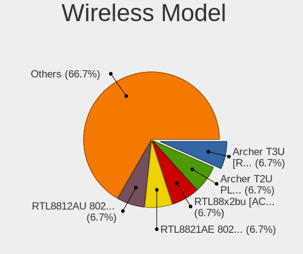

| Model                                                          | Computers | Percent |
|----------------------------------------------------------------|-----------|---------|
| TP-Link Archer T3U [Realtek RTL8812BU]                         | 1         | 6.67%   |
| TP-Link Archer T2U PLUS [RTL8821AU]                            | 1         | 6.67%   |
| Realtek RTL88x2bu [AC1200 Techkey]                             | 1         | 6.67%   |
| Realtek RTL8821AE 802.11ac PCIe Wireless Network Adapter       | 1         | 6.67%   |
| Realtek RTL8812AU 802.11a/b/g/n/ac 2T2R DB WLAN Adapter        | 1         | 6.67%   |
| Realtek RTL8188EUS 802.11n Wireless Network Adapter            | 1         | 6.67%   |
| Qualcomm Atheros AR9285 Wireless Network Adapter (PCI-Express) | 1         | 6.67%   |
| Intel Wireless 8260                                            | 1         | 6.67%   |
| Intel Wireless 7260                                            | 1         | 6.67%   |
| Intel Wireless 3165                                            | 1         | 6.67%   |
| Intel Wi-Fi 6 AX200                                            | 1         | 6.67%   |
| Intel Dual Band Wireless-AC 3168NGW [Stone Peak]               | 1         | 6.67%   |
| Intel Comet Lake PCH CNVi WiFi                                 | 1         | 6.67%   |
| Intel Centrino Wireless-N 1000 [Condor Peak]                   | 1         | 6.67%   |
| Intel Centrino Advanced-N 6235                                 | 1         | 6.67%   |

Ethernet Vendor
---------------

Ethernet vendors

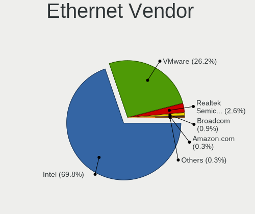

| Vendor                | Computers | Percent |
|-----------------------|-----------|---------|
| Intel                 | 238       | 70.41%  |
| VMware                | 87        | 25.74%  |
| Realtek Semiconductor | 9         | 2.66%   |
| Broadcom              | 3         | 0.89%   |
| Amazon.com            | 1         | 0.3%    |

Ethernet Model
--------------

Ethernet models

| Model                                                                         | Computers | Percent |
|-------------------------------------------------------------------------------|-----------|---------|
| VMware VMXNET3 Ethernet Controller                                            | 87        | 24.44%  |
| Intel 82540EM Gigabit Ethernet Controller                                     | 84        | 23.6%   |
| Intel 82545EM Gigabit Ethernet Controller (Copper)                            | 82        | 23.03%  |
| Intel I350 Gigabit Network Connection                                         | 22        | 6.18%   |
| Intel 82574L Gigabit Network Connection                                       | 16        | 4.49%   |
| Intel I210 Gigabit Network Connection                                         | 11        | 3.09%   |
| Intel I211 Gigabit Network Connection                                         | 7         | 1.97%   |
| Intel 82580 Gigabit Network Connection                                        | 5         | 1.4%    |
| Realtek RTL-8100/8101L/8139 PCI Fast Ethernet Adapter                         | 4         | 1.12%   |
| Intel 82576 Gigabit Network Connection                                        | 4         | 1.12%   |
| Intel 82571EB/82571GB Gigabit Ethernet Controller D0/D1 (copper applications) | 4         | 1.12%   |
| Realtek RTL8111/8168/8411 PCI Express Gigabit Ethernet Controller             | 3         | 0.84%   |
| Realtek RTL8125 2.5GbE Controller                                             | 2         | 0.56%   |
| Intel Ethernet Controller X710 for 10GbE SFP+                                 | 2         | 0.56%   |
| Intel Ethernet Controller 10-Gigabit X540-AT2                                 | 2         | 0.56%   |
| Intel Ethernet Connection X722 for 10GBASE-T                                  | 2         | 0.56%   |
| Intel Ethernet Connection (2) I219-LM                                         | 2         | 0.56%   |
| Intel 82599ES 10-Gigabit SFI/SFP+ Network Connection                          | 2         | 0.56%   |
| Intel 82599 Ethernet Controller Virtual Function                              | 2         | 0.56%   |
| Intel 82579LM Gigabit Network Connection (Lewisville)                         | 2         | 0.56%   |
| Broadcom NetXtreme BCM5719 Gigabit Ethernet PCIe                              | 2         | 0.56%   |
| Intel X540 Ethernet Controller Virtual Function                               | 1         | 0.28%   |
| Intel I350 Ethernet Controller Virtual Function                               | 1         | 0.28%   |
| Intel Ethernet Controller X710 for 10GBASE-T                                  | 1         | 0.28%   |
| Intel Ethernet Controller I225-LM                                             | 1         | 0.28%   |
| Intel Ethernet Controller 10G X550T                                           | 1         | 0.28%   |
| Intel 82599 10 Gigabit TN Network Connection                                  | 1         | 0.28%   |
| Intel 82571EB/82571GB Gigabit Ethernet Controller (Copper)                    | 1         | 0.28%   |
| Broadcom NetXtreme BCM5720 Gigabit Ethernet PCIe                              | 1         | 0.28%   |
| Amazon.com Elastic Network Adapter (ENA)                                      | 1         | 0.28%   |

Net Controller Kind
-------------------

Ethernet, WiFi or modem

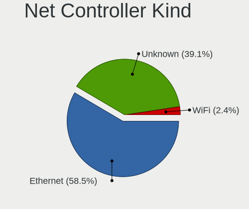

| Kind     | Computers | Percent |
|----------|-----------|---------|
| Ethernet | 311       | 58.79%  |
| Unknown  | 205       | 38.75%  |
| WiFi     | 13        | 2.46%   |

Used Controller
---------------

Currently used network controller

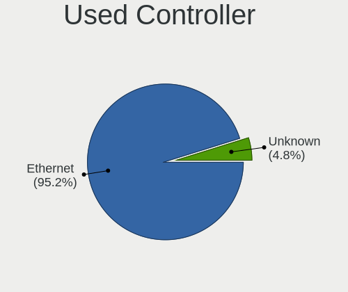

| Kind     | Computers | Percent |
|----------|-----------|---------|
| Ethernet | 310       | 95.68%  |
| Unknown  | 14        | 4.32%   |

NICs
----

Total network controllers on board

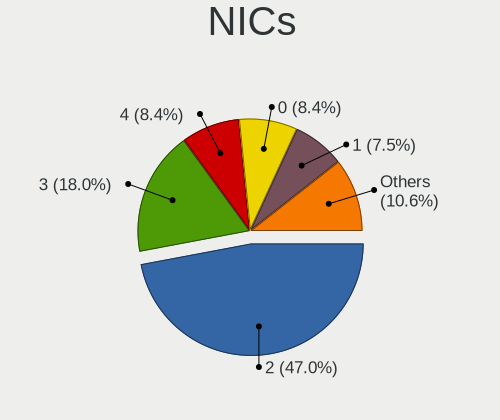

| Total | Computers | Percent |
|-------|-----------|---------|
| 2     | 253       | 46.68%  |
| 3     | 100       | 18.45%  |
| 0     | 46        | 8.49%   |
| 4     | 45        | 8.3%    |
| 1     | 39        | 7.2%    |
| 5     | 30        | 5.54%   |
| 6     | 17        | 3.14%   |
| 9     | 3         | 0.55%   |
| 8     | 2         | 0.37%   |
| 7     | 2         | 0.37%   |
| 25    | 1         | 0.18%   |
| 17    | 1         | 0.18%   |
| 14    | 1         | 0.18%   |
| 11    | 1         | 0.18%   |
| 10    | 1         | 0.18%   |

IPv6
----

IPv6 vs IPv4

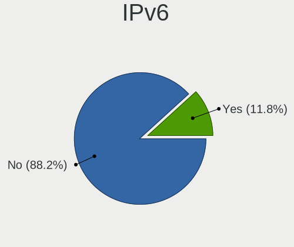

| Used | Computers | Percent |
|------|-----------|---------|
| No   | 476       | 88.31%  |
| Yes  | 63        | 11.69%  |

Bluetooth
---------

Bluetooth Vendor
----------------

Controller vendors

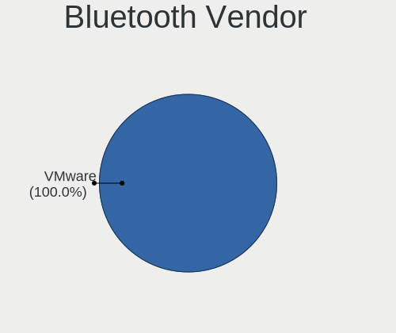

| Vendor | Computers | Percent |
|--------|-----------|---------|
| VMware | 1         | 100%    |

Bluetooth Model
---------------

Controller models

| Model                            | Computers | Percent |
|----------------------------------|-----------|---------|
| VMware Virtual Bluetooth Adapter | 1         | 100%    |

Sound
-----

Sound Vendor
------------

Sound card vendors

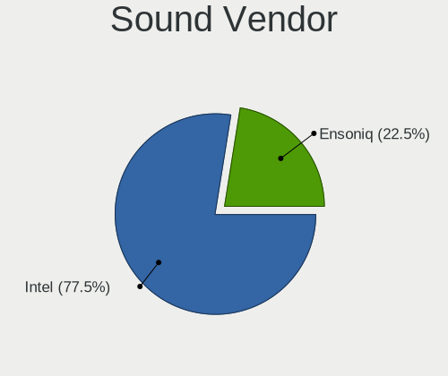

| Vendor  | Computers | Percent |
|---------|-----------|---------|
| Intel   | 97        | 77.6%   |
| Ensoniq | 28        | 22.4%   |

Sound Model
-----------

Sound card models

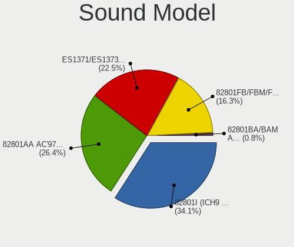

| Model                                                                      | Computers | Percent |
|----------------------------------------------------------------------------|-----------|---------|
| Intel 82801I (ICH9 Family) HD Audio Controller                             | 42        | 33.6%   |
| Intel 82801AA AC'97 Audio Controller                                       | 33        | 26.4%   |
| Ensoniq ES1371/ES1373 / Creative Labs CT2518                               | 28        | 22.4%   |
| Intel 82801FB/FBM/FR/FW/FRW (ICH6 Family) High Definition Audio Controller | 21        | 16.8%   |
| Intel 82801BA/BAM AC'97 Audio Controller                                   | 1         | 0.8%    |

Memory
------

Memory Vendor
-------------

Memory module vendors

| Vendor             | Computers | Percent |
|--------------------|-----------|---------|
| QEMU               | 246       | 50.31%  |
| Unknown            | 175       | 35.79%  |
| Microsoft          | 35        | 7.16%   |
| VMware Virtual RAM | 20        | 4.09%   |
| Unknown            | 7         | 1.43%   |
| Red Hat            | 6         | 1.23%   |

Memory Model
------------

Memory module models

| Model                                             | Computers | Percent |
|---------------------------------------------------|-----------|---------|
| Unknown                                           | 175       | 33.14%  |
| QEMU RAM Module 4GB DIMM RAM                      | 67        | 12.69%  |
| QEMU RAM Module 2GB DIMM RAM                      | 52        | 9.85%   |
| QEMU RAM Module 8GB DIMM RAM                      | 43        | 8.14%   |
| Microsoft RAM Module 3968MB                       | 21        | 3.98%   |
| QEMU RAM Module 16GB DIMM RAM                     | 17        | 3.22%   |
| Microsoft RAM Module 128MB                        | 17        | 3.22%   |
| QEMU RAM Module 1GB DIMM RAM                      | 12        | 2.27%   |
| VMware Virtual RAM RAM VMW-8192MB 8GB DIMM DRAM   | 9         | 1.7%    |
| QEMU RAM Module 6GB DIMM RAM                      | 8         | 1.52%   |
| VMware Virtual RAM RAM VMW-4096MB 4GB DIMM DRAM   | 7         | 1.33%   |
| QEMU RAM Module 8096MB DIMM RAM                   | 7         | 1.33%   |
| QEMU RAM Module 3GB DIMM RAM                      | 6         | 1.14%   |
| Microsoft RAM Module 2GB                          | 5         | 0.95%   |
| Unknown RAM Module 128MB DIMM DRAM                | 4         | 0.76%   |
| QEMU RAM Module 5GB DIMM RAM                      | 4         | 0.76%   |
| QEMU RAM Module 2000MB DIMM RAM                   | 4         | 0.76%   |
| QEMU RAM Module 10GB DIMM RAM                     | 4         | 0.76%   |
| VMware Virtual RAM RAM VMW-2048MB 2GB DIMM DRAM   | 3         | 0.57%   |
| QEMU RAM Module 512MB DIMM RAM                    | 3         | 0.57%   |
| QEMU RAM Module 12GB DIMM RAM                     | 3         | 0.57%   |
| Microsoft RAM Module 1GB                          | 3         | 0.57%   |
| VMware Virtual RAM RAM VMW-1024MB 1GB DIMM DRAM   | 2         | 0.38%   |
| Unknown RAM Module 4092MB DIMM RAM                | 2         | 0.38%   |
| Unknown RAM Module 32MB DIMM DRAM                 | 2         | 0.38%   |
| Red Hat RAM Module 8GB DIMM RAM                   | 2         | 0.38%   |
| Red Hat RAM Module 2GB DIMM RAM                   | 2         | 0.38%   |
| Red Hat RAM Module 1GB DIMM RAM                   | 2         | 0.38%   |
| QEMU RAM Module 8196MB DIMM RAM                   | 2         | 0.38%   |
| QEMU RAM Module 1536MB DIMM RAM                   | 2         | 0.38%   |
| Microsoft RAM Module 4224MB                       | 2         | 0.38%   |
| Microsoft RAM Module 3GB                          | 2         | 0.38%   |
| VMware Virtual RAM RAM VMW-16384MB 16GB DIMM DRAM | 1         | 0.19%   |
| Unknown RAM Module 64MB DIMM DRAM                 | 1         | 0.19%   |
| Unknown RAM Module 4GB                            | 1         | 0.19%   |
| QEMU RAM Module 954MB DIMM RAM                    | 1         | 0.19%   |
| QEMU RAM Module 848MB DIMM RAM                    | 1         | 0.19%   |
| QEMU RAM Module 8264MB DIMM RAM                   | 1         | 0.19%   |
| QEMU RAM Module 8128MB DIMM RAM                   | 1         | 0.19%   |
| QEMU RAM Module 8000MB DIMM RAM                   | 1         | 0.19%   |
| QEMU RAM Module 6500MB DIMM RAM                   | 1         | 0.19%   |
| QEMU RAM Module 6148MB DIMM RAM                   | 1         | 0.19%   |
| QEMU RAM Module 6048MB DIMM RAM                   | 1         | 0.19%   |
| QEMU RAM Module 600MB DIMM RAM                    | 1         | 0.19%   |
| QEMU RAM Module 5048MB DIMM RAM                   | 1         | 0.19%   |
| QEMU RAM Module 4192MB DIMM RAM                   | 1         | 0.19%   |
| QEMU RAM Module 4064MB DIMM RAM                   | 1         | 0.19%   |
| QEMU RAM Module 4048MB DIMM RAM                   | 1         | 0.19%   |
| QEMU RAM Module 4000MB DIMM RAM                   | 1         | 0.19%   |
| QEMU RAM Module 3616MB DIMM RAM                   | 1         | 0.19%   |
| QEMU RAM Module 3000MB DIMM RAM                   | 1         | 0.19%   |
| QEMU RAM Module 16383MB DIMM RAM                  | 1         | 0.19%   |
| QEMU RAM Module 16192MB DIMM RAM                  | 1         | 0.19%   |
| QEMU RAM Module 16128MB DIMM RAM                  | 1         | 0.19%   |
| QEMU RAM Module 16000MB DIMM RAM                  | 1         | 0.19%   |
| QEMU RAM Module 1500MB DIMM RAM                   | 1         | 0.19%   |
| QEMU RAM Module 14GB DIMM RAM                     | 1         | 0.19%   |
| QEMU RAM Module 1024MB DIMM RAM                   | 1         | 0.19%   |
| QEMU RAM Module 1000MB DIMM RAM                   | 1         | 0.19%   |
| Microsoft RAM Module 3596MB                       | 1         | 0.19%   |

Memory Kind
-----------

Memory module kinds

| Kind    | Computers | Percent |
|---------|-----------|---------|
| RAM     | 266       | 54.96%  |
| DRAM    | 175       | 36.16%  |
| Unknown | 43        | 8.88%   |

Memory Form Factor
------------------

Physical design of the memory module

| Name    | Computers | Percent |
|---------|-----------|---------|
| DIMM    | 441       | 91.12%  |
| Unknown | 43        | 8.88%   |

Memory Size
-----------

Memory module size

| Size       | Computers | Percent |
|------------|-----------|---------|
| 4096       | 129       | 22.83%  |
| 2048       | 109       | 19.29%  |
| 8192       | 100       | 17.7%   |
| 1024       | 42        | 7.43%   |
| 16384      | 32        | 5.66%   |
| 3968       | 21        | 3.72%   |
| 128        | 21        | 3.72%   |
| 512        | 10        | 1.77%   |
| 6144       | 8         | 1.42%   |
| 3072       | 8         | 1.42%   |
| 8096       | 7         | 1.24%   |
| 256        | 5         | 0.88%   |
| 1073741824 | 4         | 0.71%   |
| 10240      | 4         | 0.71%   |
| 5120       | 4         | 0.71%   |
| 2000       | 4         | 0.71%   |
| 12288      | 3         | 0.53%   |
| 8196       | 2         | 0.35%   |
| 8188       | 2         | 0.35%   |
| 4224       | 2         | 0.35%   |
| 4092       | 2         | 0.35%   |
| 1536       | 2         | 0.35%   |
| 1532       | 2         | 0.35%   |
| 32         | 2         | 0.35%   |
| 16         | 2         | 0.35%   |
| 536870912  | 1         | 0.18%   |
| 16383      | 1         | 0.18%   |
| 16192      | 1         | 0.18%   |
| 16128      | 1         | 0.18%   |
| 16000      | 1         | 0.18%   |
| 14336      | 1         | 0.18%   |
| 8264       | 1         | 0.18%   |
| 8128       | 1         | 0.18%   |
| 8125       | 1         | 0.18%   |
| 8000       | 1         | 0.18%   |
| 6500       | 1         | 0.18%   |
| 6148       | 1         | 0.18%   |
| 6048       | 1         | 0.18%   |
| 5048       | 1         | 0.18%   |
| 4192       | 1         | 0.18%   |
| 4088       | 1         | 0.18%   |
| 4064       | 1         | 0.18%   |
| 4048       | 1         | 0.18%   |
| 4000       | 1         | 0.18%   |
| 3996       | 1         | 0.18%   |
| 3616       | 1         | 0.18%   |
| 3596       | 1         | 0.18%   |
| 3472       | 1         | 0.18%   |
| 3032       | 1         | 0.18%   |
| 3000       | 1         | 0.18%   |
| 2560       | 1         | 0.18%   |
| 2454       | 1         | 0.18%   |
| 2176       | 1         | 0.18%   |
| 2096       | 1         | 0.18%   |
| 2044       | 1         | 0.18%   |
| 1500       | 1         | 0.18%   |
| 1152       | 1         | 0.18%   |
| 1000       | 1         | 0.18%   |
| 954        | 1         | 0.18%   |
| 848        | 1         | 0.18%   |

Memory Speed
------------

Memory module speed

| Speed   | Computers | Percent |
|---------|-----------|---------|
| Unknown | 483       | 99.79%  |
| 667     | 1         | 0.21%   |

Printers & scanners
-------------------

Printer Vendor
--------------

Printer device vendors

| Vendor    | Computers | Percent |
|-----------|-----------|---------|
| PARALLELS | 1         | 100%    |

Printer Model
-------------

Printer device models

| Model                                                                           | Computers | Percent |
|---------------------------------------------------------------------------------|-----------|---------|
| PARALLELS Virtual Printer (/Users/m/Parallels/HelloSystem 0.8.pvm/parallel.txt) | 1         | 100%    |

Scanner Vendor
--------------

Scanner device vendors

Zero info for selected period =(

Scanner Model
-------------

Scanner device models

Zero info for selected period =(

Camera
------

Camera Vendor
-------------

Camera device vendors

Zero info for selected period =(

Camera Model
------------

Camera device models

Zero info for selected period =(

Security
--------

Fingerprint Vendor
------------------

Fingerprint sensor vendors

Zero info for selected period =(

Fingerprint Model
-----------------

Fingerprint sensor models

Zero info for selected period =(

Chipcard Vendor
---------------

Chipcard module vendors

Zero info for selected period =(

Chipcard Model
--------------

Chipcard module models

Zero info for selected period =(

Unsupported
-----------

Unsupported Devices
-------------------

Total unsupported devices on board

| Total | Computers | Percent |
|-------|-----------|---------|
| 0     | 525       | 97.95%  |
| 1     | 11        | 2.05%   |

Unsupported Device Types
------------------------

Types of unsupported devices

| Type         | Computers | Percent |
|--------------|-----------|---------|
| Net/wireless | 7         | 63.64%  |
| Net/ethernet | 4         | 36.36%  |

