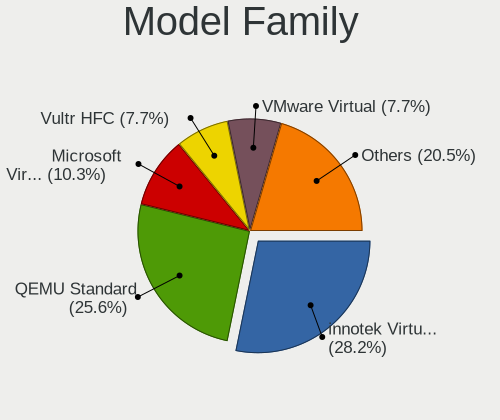
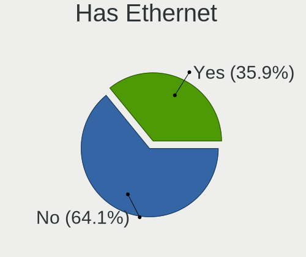
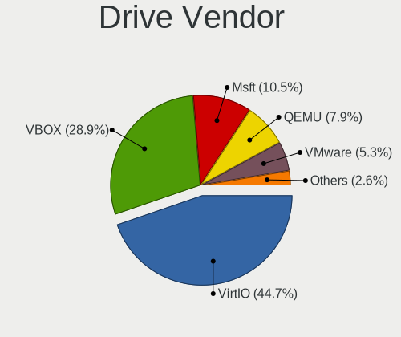
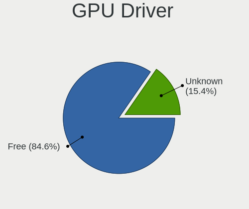
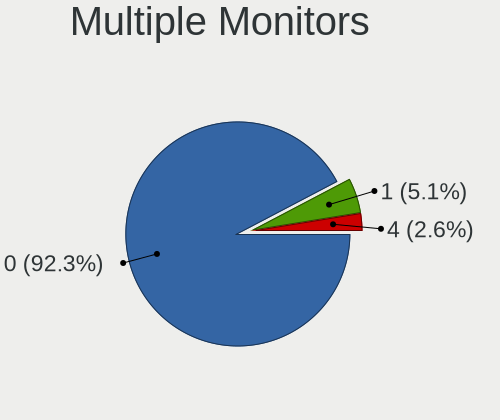

OpenBSD - Tested Virtual Hardware & Statistics
----------------------------------------------

A project to collect tested virtual hardware configurations for OpenBSD.

Anyone can contribute to this report by the [hw-probe](https://github.com/linuxhw/hw-probe/blob/master/INSTALL.BSD.md) tool:

    hw-probe -all -upload

Please contribute! Especially if your hardware is rare.

Contents
--------

* [ Test Cases ](#test-cases)

* [ System ](#system)
  - [ OS                       ](#os)
  - [ OS Family                ](#os-family)
  - [ Arch                     ](#arch)
  - [ DE                       ](#de)
  - [ Display Server           ](#display-server)
  - [ Display Manager          ](#display-manager)
  - [ OS Lang                  ](#os-lang)
  - [ Boot Mode                ](#boot-mode)
  - [ Filesystem               ](#filesystem)
  - [ Part. scheme             ](#part-scheme)

* [ Board ](#board)
  - [ Vendor                   ](#vendor)
  - [ Model                    ](#model)
  - [ Model Family             ](#model-family)
  - [ MFG Year                 ](#mfg-year)
  - [ Form Factor              ](#form-factor)
  - [ Coreboot                 ](#coreboot)
  - [ RAM Size                 ](#ram-size)
  - [ RAM Used                 ](#ram-used)
  - [ Total Drives             ](#total-drives)
  - [ Has CD-ROM               ](#has-cd-rom)
  - [ Has Ethernet             ](#has-ethernet)
  - [ Has WiFi                 ](#has-wifi)
  - [ Has Bluetooth            ](#has-bluetooth)

* [ Location ](#location)
  - [ Country                  ](#country)
  - [ City                     ](#city)

* [ Drives ](#drives)
  - [ Drive Vendor             ](#drive-vendor)
  - [ Drive Model              ](#drive-model)
  - [ HDD Vendor               ](#hdd-vendor)
  - [ SSD Vendor               ](#ssd-vendor)
  - [ Drive Kind               ](#drive-kind)
  - [ Drive Connector          ](#drive-connector)
  - [ Drive Size               ](#drive-size)
  - [ Space Total              ](#space-total)
  - [ Space Used               ](#space-used)
  - [ Malfunc. Drives          ](#malfunc-drives)
  - [ Malfunc. Drive Vendor    ](#malfunc-drive-vendor)
  - [ Malfunc. HDD Vendor      ](#malfunc-hdd-vendor)
  - [ Malfunc. Drive Kind      ](#malfunc-drive-kind)
  - [ Failed Drives            ](#failed-drives)
  - [ Failed Drive Vendor      ](#failed-drive-vendor)
  - [ Drive Status             ](#drive-status)

* [ Storage controller ](#storage-controller)
  - [ Storage Vendor           ](#storage-vendor)
  - [ Storage Model            ](#storage-model)
  - [ Storage Kind             ](#storage-kind)

* [ Processor ](#processor)
  - [ CPU Vendor               ](#cpu-vendor)
  - [ CPU Model                ](#cpu-model)
  - [ CPU Model Family         ](#cpu-model-family)
  - [ CPU Cores                ](#cpu-cores)
  - [ CPU Sockets              ](#cpu-sockets)
  - [ CPU Threads              ](#cpu-threads)
  - [ CPU Microarch            ](#cpu-microarch)

* [ Graphics ](#graphics)
  - [ GPU Vendor               ](#gpu-vendor)
  - [ GPU Model                ](#gpu-model)
  - [ GPU Combo                ](#gpu-combo)
  - [ GPU Driver               ](#gpu-driver)
  - [ GPU Memory               ](#gpu-memory)

* [ Monitor ](#monitor)
  - [ Monitor Vendor           ](#monitor-vendor)
  - [ Monitor Model            ](#monitor-model)
  - [ Monitor Resolution       ](#monitor-resolution)
  - [ Monitor Diagonal         ](#monitor-diagonal)
  - [ Monitor Width            ](#monitor-width)
  - [ Aspect Ratio             ](#aspect-ratio)
  - [ Monitor Area             ](#monitor-area)
  - [ Pixel Density            ](#pixel-density)
  - [ Multiple Monitors        ](#multiple-monitors)

* [ Network ](#network)
  - [ Net Controller Vendor    ](#net-controller-vendor)
  - [ Net Controller Model     ](#net-controller-model)
  - [ Wireless Vendor          ](#wireless-vendor)
  - [ Wireless Model           ](#wireless-model)
  - [ Ethernet Vendor          ](#ethernet-vendor)
  - [ Ethernet Model           ](#ethernet-model)
  - [ Net Controller Kind      ](#net-controller-kind)
  - [ Used Controller          ](#used-controller)
  - [ NICs                     ](#nics)
  - [ IPv6                     ](#ipv6)

* [ Bluetooth ](#bluetooth)
  - [ Bluetooth Vendor         ](#bluetooth-vendor)
  - [ Bluetooth Model          ](#bluetooth-model)

* [ Sound ](#sound)
  - [ Sound Vendor             ](#sound-vendor)
  - [ Sound Model              ](#sound-model)

* [ Memory ](#memory)
  - [ Memory Vendor            ](#memory-vendor)
  - [ Memory Model             ](#memory-model)
  - [ Memory Kind              ](#memory-kind)
  - [ Memory Form Factor       ](#memory-form-factor)
  - [ Memory Size              ](#memory-size)
  - [ Memory Speed             ](#memory-speed)

* [ Printers & scanners ](#printers--scanners)
  - [ Printer Vendor           ](#printer-vendor)
  - [ Printer Model            ](#printer-model)
  - [ Scanner Vendor           ](#scanner-vendor)
  - [ Scanner Model            ](#scanner-model)

* [ Camera ](#camera)
  - [ Camera Vendor            ](#camera-vendor)
  - [ Camera Model             ](#camera-model)

* [ Security ](#security)
  - [ Fingerprint Vendor       ](#fingerprint-vendor)
  - [ Fingerprint Model        ](#fingerprint-model)
  - [ Chipcard Vendor          ](#chipcard-vendor)
  - [ Chipcard Model           ](#chipcard-model)

* [ Unsupported ](#unsupported)
  - [ Unsupported Devices      ](#unsupported-devices)
  - [ Unsupported Device Types ](#unsupported-device-types)

Test Cases
----------

Total: 44

| Vendor    | Model                       | Form-Factor     | Probe                                                     | Date         |
|-----------|-----------------------------|-----------------|-----------------------------------------------------------|--------------|
| Intel     | 440BX Desktop Reference ... | Virtual machine | [a201d00e21](https://bsd-hardware.info/?probe=a201d00e21) | Jan 11, 2022 |
| QEMU      | Standard PC (Q35 + ICH9,... | Virtual machine | [2398313755](https://bsd-hardware.info/?probe=2398313755) | Jan 08, 2022 |
| QEMU      | Standard PC (Q35 + ICH9,... | Virtual machine | [e94ada3336](https://bsd-hardware.info/?probe=e94ada3336) | Oct 15, 2021 |
| QEMU      | KVM Virtual Machine         | Virtual machine | [e9403b5e21](https://bsd-hardware.info/?probe=e9403b5e21) | Oct 10, 2021 |
| bhyve     | BHYVE                       | Virtual machine | [da0c45eed6](https://bsd-hardware.info/?probe=da0c45eed6) | Sep 26, 2021 |
| innotek   | VirtualBox                  | Virtual machine | [f08787e165](https://bsd-hardware.info/?probe=f08787e165) | Aug 29, 2021 |
| innotek   | VirtualBox                  | Virtual machine | [b09b99f1de](https://bsd-hardware.info/?probe=b09b99f1de) | Aug 26, 2021 |
| innotek   | VirtualBox                  | Virtual machine | [c45cd4c548](https://bsd-hardware.info/?probe=c45cd4c548) | Jun 16, 2021 |
| Microsoft | Virtual Machine             | Virtual machine | [cc4f119418](https://bsd-hardware.info/?probe=cc4f119418) | May 11, 2021 |
| Vultr     | HFC                         | Virtual machine | [e89aea612f](https://bsd-hardware.info/?probe=e89aea612f) | Apr 15, 2021 |
| QEMU      | Standard PC (i440FX + PI... | Virtual machine | [aacfe8b361](https://bsd-hardware.info/?probe=aacfe8b361) | Apr 10, 2021 |
| Vultr     | HFC                         | Virtual machine | [be7d30136f](https://bsd-hardware.info/?probe=be7d30136f) | Apr 10, 2021 |
| Vultr     | HFC                         | Virtual machine | [7df2542fb4](https://bsd-hardware.info/?probe=7df2542fb4) | Apr 10, 2021 |
| QEMU      | Standard PC (i440FX + PI... | Virtual machine | [37b43f2d4b](https://bsd-hardware.info/?probe=37b43f2d4b) | Apr 10, 2021 |
| Red Hat   | KVM                         | Virtual machine | [28e3760674](https://bsd-hardware.info/?probe=28e3760674) | Jan 21, 2021 |
| Vultr     | HFC                         | Virtual machine | [bb383eab1c](https://bsd-hardware.info/?probe=bb383eab1c) | Jan 19, 2021 |
| Intel     | 440BX Desktop Reference ... | Virtual machine | [1431f70d16](https://bsd-hardware.info/?probe=1431f70d16) | Dec 15, 2020 |
| innotek   | VirtualBox                  | Virtual machine | [156451666f](https://bsd-hardware.info/?probe=156451666f) | Nov 27, 2020 |
| QEMU      | Standard PC (i440FX + PI... | Virtual machine | [3740a0037c](https://bsd-hardware.info/?probe=3740a0037c) | Nov 25, 2020 |
| QEMU      | Standard PC (i440FX + PI... | Virtual machine | [0f64b80425](https://bsd-hardware.info/?probe=0f64b80425) | Nov 22, 2020 |
| innotek   | VirtualBox                  | Virtual machine | [bc1051162d](https://bsd-hardware.info/?probe=bc1051162d) | Nov 02, 2020 |
| Hetzner   | vServer                     | Virtual machine | [7b8e7f0002](https://bsd-hardware.info/?probe=7b8e7f0002) | Oct 31, 2020 |
| QEMU      | Standard PC (i440FX + PI... | Virtual machine | [52e164a84c](https://bsd-hardware.info/?probe=52e164a84c) | Oct 30, 2020 |
| innotek   | VirtualBox                  | Virtual machine | [15fcceb43a](https://bsd-hardware.info/?probe=15fcceb43a) | Oct 27, 2020 |
| VMware    | Virtual Platform            | Virtual machine | [96c622543b](https://bsd-hardware.info/?probe=96c622543b) | Oct 26, 2020 |
| Vultr     | HFC                         | Virtual machine | [ed8797bbc5](https://bsd-hardware.info/?probe=ed8797bbc5) | Oct 22, 2020 |
| innotek   | VirtualBox                  | Virtual machine | [c85a8b3c28](https://bsd-hardware.info/?probe=c85a8b3c28) | Oct 20, 2020 |
| QEMU      | Standard PC (i440FX + PI... | Virtual machine | [5bd4446a6b](https://bsd-hardware.info/?probe=5bd4446a6b) | Oct 20, 2020 |
| Microsoft | Virtual Machine             | Virtual machine | [f36b054a30](https://bsd-hardware.info/?probe=f36b054a30) | Oct 20, 2020 |
| innotek   | VirtualBox                  | Virtual machine | [7cfaabffe8](https://bsd-hardware.info/?probe=7cfaabffe8) | Oct 20, 2020 |
| QEMU      | Standard PC (i440FX + PI... | Virtual machine | [f7c1545d99](https://bsd-hardware.info/?probe=f7c1545d99) | Oct 19, 2020 |
| QEMU      | Standard PC (i440FX + PI... | Virtual machine | [5154e63322](https://bsd-hardware.info/?probe=5154e63322) | Oct 19, 2020 |
| innotek   | VirtualBox                  | Virtual machine | [e933b32e98](https://bsd-hardware.info/?probe=e933b32e98) | Oct 19, 2020 |
| QEMU      | Standard PC (i440FX + PI... | Virtual machine | [a0b891bf44](https://bsd-hardware.info/?probe=a0b891bf44) | Oct 19, 2020 |
| Microsoft | Virtual Machine             | Virtual machine | [6fac072dc8](https://bsd-hardware.info/?probe=6fac072dc8) | Oct 19, 2020 |
| innotek   | VirtualBox                  | Virtual machine | [9974892c51](https://bsd-hardware.info/?probe=9974892c51) | Oct 19, 2020 |
| QEMU      | Standard PC (i440FX + PI... | Virtual machine | [970605f2a2](https://bsd-hardware.info/?probe=970605f2a2) | Oct 19, 2020 |
| OpenBSD   | VMM                         | Virtual machine | [55af71a7a6](https://bsd-hardware.info/?probe=55af71a7a6) | Oct 19, 2020 |
| innotek   | VirtualBox                  | Virtual machine | [b2f189c848](https://bsd-hardware.info/?probe=b2f189c848) | Oct 19, 2020 |
| Xen       | HVM domU                    | Virtual machine | [c3b70660a5](https://bsd-hardware.info/?probe=c3b70660a5) | Aug 21, 2020 |
| OpenBSD   | VMM                         | Virtual machine | [c8767289fe](https://bsd-hardware.info/?probe=c8767289fe) | Aug 05, 2020 |
| OpenBSD   | VMM                         | Virtual machine | [43d2279d63](https://bsd-hardware.info/?probe=43d2279d63) | Aug 03, 2020 |
| Microsoft | Virtual Machine             | Virtual machine | [ee58cc741d](https://bsd-hardware.info/?probe=ee58cc741d) | May 26, 2020 |
| innotek   | VirtualBox                  | Virtual machine | [214a23c3e9](https://bsd-hardware.info/?probe=214a23c3e9) | May 02, 2020 |

System
------

OS
--

Installed operating systems

| Name        | Computers | Percent |
|-------------|-----------|---------|
| OpenBSD 6.8 | 27        | 67.5%   |
| OpenBSD 6.9 | 5         | 12.5%   |
| OpenBSD 7.0 | 3         | 7.5%    |
| OpenBSD 6.7 | 3         | 7.5%    |
| OpenBSD 6.6 | 1         | 2.5%    |
| OpenBSD 6.5 | 1         | 2.5%    |

OS Family
---------

OS without a version

| Name    | Computers | Percent |
|---------|-----------|---------|
| OpenBSD | 39        | 100%    |

Arch
----

OS architecture (x86_64, i586, etc.)

| Name  | Computers | Percent |
|-------|-----------|---------|
| amd64 | 36        | 92.31%  |
| i386  | 2         | 5.13%   |
| arm64 | 1         | 2.56%   |

DE
--

Desktop Environment

| Name    | Computers | Percent |
|---------|-----------|---------|
| Console | 26        | 65%     |
| fvwm    | 9         | 22.5%   |
| XFCE    | 2         | 5%      |
| MATE    | 1         | 2.5%    |
| GNOME   | 1         | 2.5%    |
| Fluxbox | 1         | 2.5%    |

Display Server
--------------

X11 or Wayland

| Name    | Computers | Percent |
|---------|-----------|---------|
| Console | 28        | 70%     |
| X11     | 12        | 30%     |

Display Manager
---------------

SDDM, LightDM, etc.

| Name    | Computers | Percent |
|---------|-----------|---------|
| Console | 36        | 90%     |
| SLiM    | 2         | 5%      |
| GDM     | 2         | 5%      |

OS Lang
-------

Language

| Lang         | Computers | Percent |
|--------------|-----------|---------|
| Unknown      | 35        | 87.5%   |
| ru_RU.KOI8-R | 1         | 2.5%    |
| ru_RU        | 1         | 2.5%    |
| en_US        | 1         | 2.5%    |
| de_DE        | 1         | 2.5%    |
| C            | 1         | 2.5%    |

Boot Mode
---------

EFI or BIOS

| Mode | Computers | Percent |
|------|-----------|---------|
| BIOS | 37        | 94.87%  |
| EFI  | 2         | 5.13%   |

Filesystem
----------

Type of filesystem

| Type | Computers | Percent |
|------|-----------|---------|
| Ffs  | 39        | 100%    |

Part. scheme
------------

Scheme of partitioning

| Type    | Computers | Percent |
|---------|-----------|---------|
| MBR     | 36        | 92.31%  |
| GPT     | 2         | 5.13%   |
| Unknown | 1         | 2.56%   |

Board
-----

Vendor
------

Motherboard manufacturer

| Name      | Computers | Percent |
|-----------|-----------|---------|
| QEMU      | 11        | 28.21%  |
| innotek   | 11        | 28.21%  |
| Microsoft | 4         | 10.26%  |
| Vultr     | 3         | 7.69%   |
| OpenBSD   | 3         | 7.69%   |
| Intel     | 2         | 5.13%   |
| Xen       | 1         | 2.56%   |
| VMware    | 1         | 2.56%   |
| Red Hat   | 1         | 2.56%   |
| Hetzner   | 1         | 2.56%   |
| bhyve     | 1         | 2.56%   |

Model
-----

Motherboard model

| Name                                   | Computers | Percent |
|----------------------------------------|-----------|---------|
| innotek VirtualBox                     | 11        | 28.21%  |
| QEMU Standard PC (i440FX + PIIX, 1996) | 9         | 23.08%  |
| Microsoft Virtual Machine              | 4         | 10.26%  |
| Vultr HFC                              | 3         | 7.69%   |
| OpenBSD VMM                            | 3         | 7.69%   |
| Intel Virtual Platform                 | 2         | 5.13%   |
| Xen HVM domU                           | 1         | 2.56%   |
| VMware Virtual Platform                | 1         | 2.56%   |
| Red Hat KVM                            | 1         | 2.56%   |
| QEMU Standard PC (Q35 + ICH9, 2009)    | 1         | 2.56%   |
| QEMU KVM Virtual Machine               | 1         | 2.56%   |
| Hetzner vServer                        | 1         | 2.56%   |
| bhyve BHYVE                            | 1         | 2.56%   |

Model Family
------------

Motherboard model prefix

| Name               | Computers | Percent |
|--------------------|-----------|---------|
| innotek VirtualBox | 11        | 28.21%  |
| QEMU Standard      | 10        | 25.64%  |
| Microsoft Virtual  | 4         | 10.26%  |
| Vultr HFC          | 3         | 7.69%   |
| OpenBSD VMM        | 3         | 7.69%   |
| Intel Virtual      | 2         | 5.13%   |
| Xen HVM            | 1         | 2.56%   |
| VMware Virtual     | 1         | 2.56%   |
| Red Hat KVM        | 1         | 2.56%   |
| QEMU KVM           | 1         | 2.56%   |
| Hetzner vServer    | 1         | 2.56%   |
| bhyve BHYVE        | 1         | 2.56%   |

MFG Year
--------

Motherboard manufacture year

| Year    | Computers | Percent |
|---------|-----------|---------|
| 2014    | 11        | 28.21%  |
| 2006    | 11        | 28.21%  |
| 2018    | 5         | 12.82%  |
| Unknown | 5         | 12.82%  |
| 2020    | 3         | 7.69%   |
| 2011    | 3         | 7.69%   |
| 2017    | 1         | 2.56%   |

Form Factor
-----------

Physical design of the computer

| Name            | Computers | Percent |
|-----------------|-----------|---------|
| Virtual machine | 39        | 100%    |

Coreboot
--------

Have coreboot on board

| Used | Computers | Percent |
|------|-----------|---------|
| No   | 39        | 100%    |

RAM Size
--------

Total RAM memory

| Size in GB | Computers | Percent |
|------------|-----------|---------|
| 4.01-8.0   | 10        | 25%     |
| 0.51-1.0   | 10        | 25%     |
| 0.01-0.5   | 7         | 17.5%   |
| 2.01-3.0   | 6         | 15%     |
| 1.01-2.0   | 3         | 7.5%    |
| 3.01-4.0   | 2         | 5%      |
| 8.01-16.0  | 2         | 5%      |

RAM Used
--------

Used RAM memory

| Used GB  | Computers | Percent |
|----------|-----------|---------|
| 0.01-0.5 | 21        | 53.85%  |
| 0        | 18        | 46.15%  |

Total Drives
------------

Number of drives on board

| Drives | Computers | Percent |
|--------|-----------|---------|
| 1      | 34        | 85%     |
| 3      | 2         | 5%      |
| 2      | 2         | 5%      |
| 0      | 2         | 5%      |

Has CD-ROM
----------

Has CD-ROM on board

| Presented | Computers | Percent |
|-----------|-----------|---------|
| No        | 39        | 100%    |

Has Ethernet
------------

Has Ethernet on board

| Presented | Computers | Percent |
|-----------|-----------|---------|
| No        | 25        | 64.1%   |
| Yes       | 14        | 35.9%   |

Has WiFi
--------

Has WiFi module

| Presented | Computers | Percent |
|-----------|-----------|---------|
| No        | 39        | 100%    |

Has Bluetooth
-------------

Has Bluetooth module

| Presented | Computers | Percent |
|-----------|-----------|---------|
| No        | 39        | 100%    |

Location
--------

Country
-------

Geographic location (country)

| Country     | Computers | Percent |
|-------------|-----------|---------|
| USA         | 7         | 17.95%  |
| Russia      | 6         | 15.38%  |
| Netherlands | 5         | 12.82%  |
| Germany     | 5         | 12.82%  |
| France      | 4         | 10.26%  |
| Ukraine     | 2         | 5.13%   |
| Canada      | 2         | 5.13%   |
| UK          | 1         | 2.56%   |
| Switzerland | 1         | 2.56%   |
| Norway      | 1         | 2.56%   |
| Mexico      | 1         | 2.56%   |
| Finland     | 1         | 2.56%   |
| Czechia     | 1         | 2.56%   |
| Brazil      | 1         | 2.56%   |
| Belgium     | 1         | 2.56%   |

City
----

Geographic location (city)

| City              | Computers | Percent |
|-------------------|-----------|---------|
| Paris             | 4         | 10.26%  |
| Moscow            | 3         | 7.69%   |
| Amsterdam         | 3         | 7.69%   |
| Toronto           | 1         | 2.56%   |
| Tlalpan           | 1         | 2.56%   |
| Saratov           | 1         | 2.56%   |
| Sao Paulo         | 1         | 2.56%   |
| Retova            | 1         | 2.56%   |
| Port Byron        | 1         | 2.56%   |
| Piscataway        | 1         | 2.56%   |
| Omsk              | 1         | 2.56%   |
| Omaha             | 1         | 2.56%   |
| Niederbipp        | 1         | 2.56%   |
| New York          | 1         | 2.56%   |
| Lutsk             | 1         | 2.56%   |
| Laval             | 1         | 2.56%   |
| Kyiv              | 1         | 2.56%   |
| Kurland           | 1         | 2.56%   |
| Khimki            | 1         | 2.56%   |
| Helsinki          | 1         | 2.56%   |
| Helmond           | 1         | 2.56%   |
| Gaimersheim       | 1         | 2.56%   |
| Elk Grove Village | 1         | 2.56%   |
| Donaueschingen    | 1         | 2.56%   |
| Deventer          | 1         | 2.56%   |
| Düsseldorf     | 1         | 2.56%   |
| Darmstadt         | 1         | 2.56%   |
| Chicago           | 1         | 2.56%   |
| Brussels          | 1         | 2.56%   |
| Berlin            | 1         | 2.56%   |
| Barnard Castle    | 1         | 2.56%   |
| Atlanta           | 1         | 2.56%   |

Drives
------

Drive Vendor
------------

Hard drive vendors

| Vendor | Computers | Drives | Percent |
|--------|-----------|--------|---------|
| VirtIO | 17        | 23     | 44.74%  |
| VBOX   | 11        | 12     | 28.95%  |
| Msft   | 4         | 4      | 10.53%  |
| QEMU   | 3         | 3      | 7.89%   |
| VMware | 2         | 2      | 5.26%   |
| Xen    | 1         | 1      | 2.63%   |

Drive Model
-----------

Hard drive models

| Model               | Computers | Percent |
|---------------------|-----------|---------|
| VirtIO Block Device | 17        | 44.74%  |
| VBOX HARDDISK       | 11        | 28.95%  |
| Msft Virtual Disk   | 4         | 10.53%  |
| QEMU HARDDISK       | 3         | 7.89%   |
| Xen phy hda 768     | 1         | 2.63%   |
| VMware Virtual S    | 1         | 2.63%   |
| VMware Virtual disk | 1         | 2.63%   |

HDD Vendor
----------

Hard disk drive vendors

| Vendor | Computers | Drives | Percent |
|--------|-----------|--------|---------|
| VirtIO | 17        | 23     | 44.74%  |
| VBOX   | 11        | 12     | 28.95%  |
| Msft   | 4         | 4      | 10.53%  |
| QEMU   | 3         | 3      | 7.89%   |
| VMware | 2         | 2      | 5.26%   |
| Xen    | 1         | 1      | 2.63%   |

SSD Vendor
----------

Solid state drive vendors

Zero info for selected period =(

Drive Kind
----------

HDD or SSD

| Kind | Computers | Drives | Percent |
|------|-----------|--------|---------|
| HDD  | 37        | 45     | 100%    |

Drive Connector
---------------

SATA, SAS, NVMe, etc.

| Type | Computers | Drives | Percent |
|------|-----------|--------|---------|
| SATA | 37        | 45     | 100%    |

Drive Size
----------

Size of hard drive

| Size in TB | Computers | Drives | Percent |
|------------|-----------|--------|---------|
| 0.01-0.5   | 37        | 45     | 100%    |

Space Total
-----------

Amount of disk space available on the file system

| Size in GB | Computers | Percent |
|------------|-----------|---------|
| 21-50      | 17        | 43.59%  |
| 1-20       | 15        | 38.46%  |
| 101-250    | 4         | 10.26%  |
| 51-100     | 2         | 5.13%   |
| 251-500    | 1         | 2.56%   |

Space Used
----------

Amount of used disk space

| Used GB | Computers | Percent |
|---------|-----------|---------|
| 1-20    | 37        | 94.87%  |
| 21-50   | 2         | 5.13%   |

Malfunc. Drives
---------------

Drive models with a malfunction

Zero info for selected period =(

Malfunc. Drive Vendor
---------------------

Vendors of faulty drives

Zero info for selected period =(

Malfunc. HDD Vendor
-------------------

Vendors of faulty HDD drives

Zero info for selected period =(

Malfunc. Drive Kind
-------------------

Kinds of faulty drives

Zero info for selected period =(

Failed Drives
-------------

Failed drive models

Zero info for selected period =(

Failed Drive Vendor
-------------------

Failed drive vendors

Zero info for selected period =(

Drive Status
------------

Number of failed and malfunc. drives

| Status   | Computers | Drives | Percent |
|----------|-----------|--------|---------|
| Detected | 37        | 45     | 100%    |

Storage controller
------------------

Storage Vendor
--------------

Storage controller vendors

| Vendor                    | Computers | Percent |
|---------------------------|-----------|---------|
| Intel                     | 34        | 58.62%  |
| Red Hat                   | 16        | 27.59%  |
| Qumranet                  | 4         | 6.9%    |
| XenSource                 | 1         | 1.72%   |
| VMware                    | 1         | 1.72%   |
| LSI Logic / Symbios Logic | 1         | 1.72%   |
| Broadcom / LSI            | 1         | 1.72%   |

Storage Model
-------------

Storage controller models

| Model                                                                 | Computers | Percent |
|-----------------------------------------------------------------------|-----------|---------|
| Intel 82371AB/EB/MB PIIX4 IDE                                         | 18        | 30.51%  |
| Intel 82371SB PIIX3 IDE [Natoma/Triton II]                            | 15        | 25.42%  |
| Red Hat Virtio block device                                           | 14        | 23.73%  |
| Red Hat Virtio SCSI                                                   | 3         | 5.08%   |
| Qumranet Virtio block device                                          | 3         | 5.08%   |
| XenSource Xen Platform Device                                         | 1         | 1.69%   |
| VMware SATA AHCI controller                                           | 1         | 1.69%   |
| Qumranet Virtio SCSI                                                  | 1         | 1.69%   |
| LSI Logic / Symbios Logic 53c1030 PCI-X Fusion-MPT Dual Ultra320 SCSI | 1         | 1.69%   |
| Intel 82801IR/IO/IH (ICH9R/DO/DH) 6 port SATA Controller [AHCI mode]  | 1         | 1.69%   |
| Broadcom / LSI SAS1068 PCI-X Fusion-MPT SAS                           | 1         | 1.69%   |

Storage Kind
------------

Kind of storage controller (IDE, SATA, NVMe, SAS, ...)

| Kind | Computers | Percent |
|------|-----------|---------|
| IDE  | 33        | 57.89%  |
| SCSI | 21        | 36.84%  |
| SATA | 2         | 3.51%   |
| SAS  | 1         | 1.75%   |

Processor
---------

CPU Vendor
----------

Processor vendors

| Vendor | Computers | Percent |
|--------|-----------|---------|
| Intel  | 33        | 84.62%  |
| AMD    | 5         | 12.82%  |
| ARM    | 1         | 2.56%   |

CPU Model
---------

Processor models

| Model                                                       | Computers | Percent |
|-------------------------------------------------------------|-----------|---------|
| Intel Core Processor (Skylake, IBRS)                        | 3         | 7.69%   |
| Intel Xeon Gold 5118 CPU @ 2.30GHz                          | 2         | 5.13%   |
| Intel Core i7-3630QM CPU @ 2.40GHz                          | 2         | 5.13%   |
| Intel Xeon Silver 4210 CPU @ 2.20GHz                        | 1         | 2.56%   |
| Intel Xeon Processor (Skylake, IBRS)                        | 1         | 2.56%   |
| Intel Xeon E312xx (Sandy Bridge)                            | 1         | 2.56%   |
| Intel Xeon CPU X5675 @ 3.07GHz                              | 1         | 2.56%   |
| Intel Xeon CPU E5-2690 0 @ 2.90GHz                          | 1         | 2.56%   |
| Intel Xeon CPU E5-2670 0 @ 2.60GHz                          | 1         | 2.56%   |
| Intel Xeon CPU E5-2630 0 @ 2.30GHz                          | 1         | 2.56%   |
| Intel Xeon CPU E5-2609 v2 @ 2.50GHz                         | 1         | 2.56%   |
| Intel Xeon CPU E3-1220L V2 @ 2.30GHz                        | 1         | 2.56%   |
| Intel Xeon CPU 3065 @ 2.33GHz ("GenuineIntel" 686-class)    | 1         | 2.56%   |
| Intel Virtual CPU 82d9ed4018dd                              | 1         | 2.56%   |
| Intel Virtual CPU 714389bda930                              | 1         | 2.56%   |
| Intel QEMU Virtual CPU version 2.5+                         | 1         | 2.56%   |
| Intel Core Processor (Haswell, no TSX, IBRS)                | 1         | 2.56%   |
| Intel Core Processor (Broadwell, IBRS)                      | 1         | 2.56%   |
| Intel Core i7-9850H CPU @ 2.60GHz                           | 1         | 2.56%   |
| Intel Core i7-9700K CPU @ 3.60GHz                           | 1         | 2.56%   |
| Intel Core i7-8850H CPU @ 2.60GHz                           | 1         | 2.56%   |
| Intel Core i7-8750H CPU @ 2.20GHz                           | 1         | 2.56%   |
| Intel Core i7-3930K CPU @ 3.20GHz                           | 1         | 2.56%   |
| Intel Core i7-2700K CPU @ 3.50GHz                           | 1         | 2.56%   |
| Intel Core i7-10510U CPU @ 1.80GHz                          | 1         | 2.56%   |
| Intel Core i5-7500 CPU @ 3.40GHz ("GenuineIntel" 686-class) | 1         | 2.56%   |
| Intel Core i5-3570 CPU @ 3.40GHz                            | 1         | 2.56%   |
| Intel Core i3-8100 CPU @ 3.60GHz                            | 1         | 2.56%   |
| Intel Common KVM processor                                  | 1         | 2.56%   |
| ARM Cortex-A73 r0p2                                         | 1         | 2.56%   |
| AMD Ryzen 7 3700X 8-Core Processor                          | 1         | 2.56%   |
| AMD Ryzen 7 2700X Eight-Core Processor                      | 1         | 2.56%   |
| AMD Ryzen 7 1700 Eight-Core Processor                       | 1         | 2.56%   |
| AMD GX-412TC SOC                                            | 1         | 2.56%   |
| AMD EPYC 7542 32-Core Processor                             | 1         | 2.56%   |

CPU Model Family
----------------

Processor model prefix

| Model             | Computers | Percent |
|-------------------|-----------|---------|
| Intel Xeon        | 9         | 23.08%  |
| Intel Core i7     | 9         | 23.08%  |
| Intel Core        | 5         | 12.82%  |
| Other             | 4         | 10.26%  |
| AMD Ryzen 7       | 3         | 7.69%   |
| Intel Xeon Gold   | 2         | 5.13%   |
| Intel Core i5     | 2         | 5.13%   |
| Intel Xeon Silver | 1         | 2.56%   |
| Intel Core i3     | 1         | 2.56%   |
| ARM Cortex        | 1         | 2.56%   |
| AMD GX            | 1         | 2.56%   |
| AMD EPYC          | 1         | 2.56%   |

CPU Cores
---------

Number of processor cores

| Number  | Computers | Percent |
|---------|-----------|---------|
| 1       | 26        | 66.67%  |
| 2       | 4         | 10.26%  |
| 8       | 2         | 5.13%   |
| 4       | 2         | 5.13%   |
| 128     | 1         | 2.56%   |
| 6       | 1         | 2.56%   |
| 5       | 1         | 2.56%   |
| 3       | 1         | 2.56%   |
| Unknown | 1         | 2.56%   |

CPU Sockets
-----------

Number of sockets

| Number  | Computers | Percent |
|---------|-----------|---------|
| 1       | 30        | 76.92%  |
| Unknown | 5         | 12.82%  |
| 2       | 3         | 7.69%   |
| 3       | 1         | 2.56%   |

CPU Threads
-----------

Threads per core (Hyper-Threading)

| Number  | Computers | Percent |
|---------|-----------|---------|
| 1       | 31        | 79.49%  |
| Unknown | 5         | 12.82%  |
| 2       | 3         | 7.69%   |

CPU Microarch
-------------

Microarchitecture

| Name        | Computers | Percent |
|-------------|-----------|---------|
| Skylake     | 8         | 20.51%  |
| KabyLake    | 7         | 17.95%  |
| SandyBridge | 6         | 15.38%  |
| IvyBridge   | 5         | 12.82%  |
| Zen 2       | 2         | 5.13%   |
| Haswell     | 2         | 5.13%   |
| Zen+        | 1         | 2.56%   |
| Zen         | 1         | 2.56%   |
| Westmere    | 1         | 2.56%   |
| Puma        | 1         | 2.56%   |
| P6          | 1         | 2.56%   |
| NetBurst    | 1         | 2.56%   |
| Core        | 1         | 2.56%   |
| Broadwell   | 1         | 2.56%   |
| Unknown     | 1         | 2.56%   |

Graphics
--------

GPU Vendor
----------

Vendors of graphics cards

| Vendor                 | Computers | Percent |
|------------------------|-----------|---------|
| VMware                 | 11        | 30.56%  |
| Cirrus Logic           | 9         | 25%     |
| Bochs                  | 6         | 16.67%  |
| Microsoft              | 4         | 11.11%  |
| InnoTek Systemberatung | 3         | 8.33%   |
| Red Hat                | 2         | 5.56%   |
| AMD                    | 1         | 2.78%   |

GPU Model
---------

Graphics card models

| Model                                                   | Computers | Percent |
|---------------------------------------------------------|-----------|---------|
| VMware SVGA II Adapter                                  | 11        | 30.56%  |
| Cirrus Logic GD 5446                                    | 9         | 25%     |
| Bochs VGA                                               | 6         | 16.67%  |
| Microsoft Hyper-V virtual VGA                           | 4         | 11.11%  |
| InnoTek Systemberatung VirtualBox Graphics Adapter      | 3         | 8.33%   |
| Red Hat Virtio GPU                                      | 2         | 5.56%   |
| AMD Ellesmere [Radeon RX 470/480/570/570X/580/580X/590] | 1         | 2.78%   |

GPU Combo
---------

Combinations of graphics cards

| Name           | Computers | Percent |
|----------------|-----------|---------|
| 1 x VMware     | 11        | 27.5%   |
| 1 x Cirrus     | 9         | 22.5%   |
| 1 x Bochs      | 6         | 15%     |
| Other          | 4         | 10%     |
| 1 x Microsoft  | 4         | 10%     |
| 1 x InnoTek    | 3         | 7.5%    |
| 1 x Qumranet   | 1         | 2.5%    |
| AMD + Qumranet | 1         | 2.5%    |
| 1 x AMD        | 1         | 2.5%    |

GPU Driver
----------

Free vs proprietary

| Driver  | Computers | Percent |
|---------|-----------|---------|
| Free    | 33        | 84.62%  |
| Unknown | 6         | 15.38%  |

GPU Memory
----------

Total video memory

| Size in GB | Computers | Percent |
|------------|-----------|---------|
| Unknown    | 39        | 100%    |

Monitor
-------

Monitor Vendor
--------------

Monitor vendors

| Vendor               | Computers | Percent |
|----------------------|-----------|---------|
| Samsung Electronics  | 1         | 16.67%  |
| RYI                  | 1         | 16.67%  |
| RHT                  | 1         | 16.67%  |
| Lenovo               | 1         | 16.67%  |
| Dell                 | 1         | 16.67%  |
| Ancor Communications | 1         | 16.67%  |

Monitor Model
-------------

Monitor models

| Model                                                             | Computers | Percent |
|-------------------------------------------------------------------|-----------|---------|
| Samsung Electronics U32R59x SAM0F96 3840x2160 700x390mm 31.5-inch | 1         | 16.67%  |
| RYI 109-B5 RYI0001 1920x1440 360x270mm 17.7-inch                  | 1         | 16.67%  |
| RHT QEMU Monitor RHT1234 2048x1152 260x190mm 12.7-inch            | 1         | 16.67%  |
| Lenovo LEN L28u-30 LEN65FA 3840x2160 620x340mm 27.8-inch          | 1         | 16.67%  |
| Dell D2421H DEL2011 1920x1080 530x300mm 24.0-inch                 | 1         | 16.67%  |
| Ancor Communications VG248 ACI24A5 1920x1080 530x300mm 24.0-inch  | 1         | 16.67%  |

Monitor Resolution
------------------

Monitor screen resolution

| Resolution      | Computers | Percent |
|-----------------|-----------|---------|
| 3840x2160 (4K)  | 1         | 25%     |
| 2048x1152       | 1         | 25%     |
| 1920x1440       | 1         | 25%     |
| 1920x1080 (FHD) | 1         | 25%     |

Monitor Diagonal
----------------

Diagonal size in inches

| Inches | Computers | Percent |
|--------|-----------|---------|
| 31     | 1         | 20%     |
| 27     | 1         | 20%     |
| 24     | 1         | 20%     |
| 17     | 1         | 20%     |
| 12     | 1         | 20%     |

Monitor Width
-------------

Physical width

| Width in mm | Computers | Percent |
|-------------|-----------|---------|
| 601-700     | 1         | 25%     |
| 501-600     | 1         | 25%     |
| 351-400     | 1         | 25%     |
| 201-300     | 1         | 25%     |

Aspect Ratio
------------

Proportional relationship between the width and the height

| Ratio | Computers | Percent |
|-------|-----------|---------|
| 4/3   | 2         | 66.67%  |
| 16/9  | 1         | 33.33%  |

Monitor Area
------------

Area in inch²

| Area in inch² | Computers | Percent |
|----------------|-----------|---------|
| 71-80          | 1         | 20%     |
| 351-500        | 1         | 20%     |
| 301-350        | 1         | 20%     |
| 201-250        | 1         | 20%     |
| 151-200        | 1         | 20%     |

Pixel Density
-------------

Pixels per inch

| Density | Computers | Percent |
|---------|-----------|---------|
| 121-160 | 2         | 50%     |
| 161-240 | 1         | 25%     |
| 51-100  | 1         | 25%     |

Multiple Monitors
-----------------

Total monitors connected

| Total | Computers | Percent |
|-------|-----------|---------|
| 0     | 36        | 92.31%  |
| 1     | 2         | 5.13%   |
| 4     | 1         | 2.56%   |

Network
-------

Net Controller Vendor
---------------------

Controller vendors

| Vendor   | Computers | Percent |
|----------|-----------|---------|
| Red Hat  | 15        | 48.39%  |
| Intel    | 14        | 45.16%  |
| Qumranet | 2         | 6.45%   |

Net Controller Model
--------------------

Controller models

| Model                                              | Computers | Percent |
|----------------------------------------------------|-----------|---------|
| Red Hat Virtio network device                      | 15        | 48.39%  |
| Intel 82540EM Gigabit Ethernet Controller          | 11        | 35.48%  |
| Intel 82545EM Gigabit Ethernet Controller (Copper) | 3         | 9.68%   |
| Qumranet Virtio network device                     | 2         | 6.45%   |

Wireless Vendor
---------------

Wireless vendors

Zero info for selected period =(

Wireless Model
--------------

Wireless models

Zero info for selected period =(

Ethernet Vendor
---------------

Ethernet vendors

| Vendor | Computers | Percent |
|--------|-----------|---------|
| Intel  | 14        | 100%    |

Ethernet Model
--------------

Ethernet models

| Model                                              | Computers | Percent |
|----------------------------------------------------|-----------|---------|
| Intel 82540EM Gigabit Ethernet Controller          | 11        | 78.57%  |
| Intel 82545EM Gigabit Ethernet Controller (Copper) | 3         | 21.43%  |

Net Controller Kind
-------------------

Ethernet, WiFi or modem

| Kind     | Computers | Percent |
|----------|-----------|---------|
| Unknown  | 17        | 54.84%  |
| Ethernet | 14        | 45.16%  |

Used Controller
---------------

Currently used network controller

| Kind     | Computers | Percent |
|----------|-----------|---------|
| Ethernet | 14        | 100%    |

NICs
----

Total network controllers on board

| Total | Computers | Percent |
|-------|-----------|---------|
| 1     | 27        | 69.23%  |
| 0     | 8         | 20.51%  |
| 2     | 4         | 10.26%  |

IPv6
----

IPv6 vs IPv4

| Used | Computers | Percent |
|------|-----------|---------|
| No   | 39        | 100%    |

Bluetooth
---------

Bluetooth Vendor
----------------

Controller vendors

Zero info for selected period =(

Bluetooth Model
---------------

Controller models

Zero info for selected period =(

Sound
-----

Sound Vendor
------------

Sound card vendors

| Vendor  | Computers | Percent |
|---------|-----------|---------|
| Intel   | 11        | 78.57%  |
| Ensoniq | 2         | 14.29%  |
| AMD     | 1         | 7.14%   |

Sound Model
-----------

Sound card models

| Model                                                      | Computers | Percent |
|------------------------------------------------------------|-----------|---------|
| Intel 82801AA AC'97 Audio Controller                       | 11        | 73.33%  |
| Ensoniq ES1371/ES1373 / Creative Labs CT2518               | 2         | 13.33%  |
| AMD Family 17h (Models 00h-0fh) HD Audio Controller        | 1         | 6.67%   |
| AMD Ellesmere HDMI Audio [Radeon RX 470/480 / 570/580/590] | 1         | 6.67%   |

Memory
------

Memory Vendor
-------------

Memory module vendors

| Vendor  | Computers | Percent |
|---------|-----------|---------|
| Unknown | 2         | 100%    |

Memory Model
------------

Memory module models

| Model   | Computers | Percent |
|---------|-----------|---------|
| Unknown | 2         | 100%    |

Memory Kind
-----------

Memory module kinds

| Kind | Computers | Percent |
|------|-----------|---------|
| DRAM | 2         | 100%    |

Memory Form Factor
------------------

Physical design of the memory module

| Name | Computers | Percent |
|------|-----------|---------|
| DIMM | 2         | 100%    |

Memory Size
-----------

Memory module size

| Size | Computers | Percent |
|------|-----------|---------|
| 4096 | 1         | 50%     |
| 2048 | 1         | 50%     |

Memory Speed
------------

Memory module speed

| Speed   | Computers | Percent |
|---------|-----------|---------|
| Unknown | 2         | 100%    |

Printers & scanners
-------------------

Printer Vendor
--------------

Printer device vendors

Zero info for selected period =(

Printer Model
-------------

Printer device models

Zero info for selected period =(

Scanner Vendor
--------------

Scanner device vendors

Zero info for selected period =(

Scanner Model
-------------

Scanner device models

Zero info for selected period =(

Camera
------

Camera Vendor
-------------

Camera device vendors

Zero info for selected period =(

Camera Model
------------

Camera device models

Zero info for selected period =(

Security
--------

Fingerprint Vendor
------------------

Fingerprint sensor vendors

Zero info for selected period =(

Fingerprint Model
-----------------

Fingerprint sensor models

Zero info for selected period =(

Chipcard Vendor
---------------

Chipcard module vendors

Zero info for selected period =(

Chipcard Model
--------------

Chipcard module models

Zero info for selected period =(

Unsupported
-----------

Unsupported Devices
-------------------

Total unsupported devices on board

| Total | Computers | Percent |
|-------|-----------|---------|
| 0     | 38        | 97.44%  |
| 1     | 1         | 2.56%   |

Unsupported Device Types
------------------------

Types of unsupported devices

| Type          | Computers | Percent |
|---------------|-----------|---------|
| Graphics card | 1         | 100%    |

