helloSystem - Tested Virtual Hardware & Statistics
--------------------------------------------------

A project to collect tested virtual hardware configurations for helloSystem.

Anyone can contribute to this report by the [hw-probe](https://github.com/linuxhw/hw-probe/blob/master/INSTALL.BSD.md) tool:

    hw-probe -all -upload

Please contribute! Especially if your hardware is rare.

Contents
--------

* [ Test Cases ](#test-cases)

* [ System ](#system)
  - [ OS                       ](#os)
  - [ OS Family                ](#os-family)
  - [ Arch                     ](#arch)
  - [ DE                       ](#de)
  - [ Display Server           ](#display-server)
  - [ Display Manager          ](#display-manager)
  - [ OS Lang                  ](#os-lang)
  - [ Boot Mode                ](#boot-mode)
  - [ Filesystem               ](#filesystem)
  - [ Part. scheme             ](#part-scheme)

* [ Board ](#board)
  - [ Vendor                   ](#vendor)
  - [ Model                    ](#model)
  - [ Model Family             ](#model-family)
  - [ MFG Year                 ](#mfg-year)
  - [ Form Factor              ](#form-factor)
  - [ Coreboot                 ](#coreboot)
  - [ RAM Size                 ](#ram-size)
  - [ RAM Used                 ](#ram-used)
  - [ Total Drives             ](#total-drives)
  - [ Has CD-ROM               ](#has-cd-rom)
  - [ Has Ethernet             ](#has-ethernet)
  - [ Has WiFi                 ](#has-wifi)
  - [ Has Bluetooth            ](#has-bluetooth)

* [ Location ](#location)
  - [ Country                  ](#country)
  - [ City                     ](#city)

* [ Drives ](#drives)
  - [ Drive Vendor             ](#drive-vendor)
  - [ Drive Model              ](#drive-model)
  - [ HDD Vendor               ](#hdd-vendor)
  - [ SSD Vendor               ](#ssd-vendor)
  - [ Drive Kind               ](#drive-kind)
  - [ Drive Connector          ](#drive-connector)
  - [ Drive Size               ](#drive-size)
  - [ Space Total              ](#space-total)
  - [ Space Used               ](#space-used)
  - [ Malfunc. Drives          ](#malfunc-drives)
  - [ Malfunc. Drive Vendor    ](#malfunc-drive-vendor)
  - [ Malfunc. HDD Vendor      ](#malfunc-hdd-vendor)
  - [ Malfunc. Drive Kind      ](#malfunc-drive-kind)
  - [ Failed Drives            ](#failed-drives)
  - [ Failed Drive Vendor      ](#failed-drive-vendor)
  - [ Drive Status             ](#drive-status)

* [ Storage controller ](#storage-controller)
  - [ Storage Vendor           ](#storage-vendor)
  - [ Storage Model            ](#storage-model)
  - [ Storage Kind             ](#storage-kind)

* [ Processor ](#processor)
  - [ CPU Vendor               ](#cpu-vendor)
  - [ CPU Model                ](#cpu-model)
  - [ CPU Model Family         ](#cpu-model-family)
  - [ CPU Cores                ](#cpu-cores)
  - [ CPU Sockets              ](#cpu-sockets)
  - [ CPU Threads              ](#cpu-threads)
  - [ CPU Microarch            ](#cpu-microarch)

* [ Graphics ](#graphics)
  - [ GPU Vendor               ](#gpu-vendor)
  - [ GPU Model                ](#gpu-model)
  - [ GPU Combo                ](#gpu-combo)
  - [ GPU Driver               ](#gpu-driver)
  - [ GPU Memory               ](#gpu-memory)

* [ Monitor ](#monitor)
  - [ Monitor Vendor           ](#monitor-vendor)
  - [ Monitor Model            ](#monitor-model)
  - [ Monitor Resolution       ](#monitor-resolution)
  - [ Monitor Diagonal         ](#monitor-diagonal)
  - [ Monitor Width            ](#monitor-width)
  - [ Aspect Ratio             ](#aspect-ratio)
  - [ Monitor Area             ](#monitor-area)
  - [ Pixel Density            ](#pixel-density)
  - [ Multiple Monitors        ](#multiple-monitors)

* [ Network ](#network)
  - [ Net Controller Vendor    ](#net-controller-vendor)
  - [ Net Controller Model     ](#net-controller-model)
  - [ Wireless Vendor          ](#wireless-vendor)
  - [ Wireless Model           ](#wireless-model)
  - [ Ethernet Vendor          ](#ethernet-vendor)
  - [ Ethernet Model           ](#ethernet-model)
  - [ Net Controller Kind      ](#net-controller-kind)
  - [ Used Controller          ](#used-controller)
  - [ NICs                     ](#nics)
  - [ IPv6                     ](#ipv6)

* [ Bluetooth ](#bluetooth)
  - [ Bluetooth Vendor         ](#bluetooth-vendor)
  - [ Bluetooth Model          ](#bluetooth-model)

* [ Sound ](#sound)
  - [ Sound Vendor             ](#sound-vendor)
  - [ Sound Model              ](#sound-model)

* [ Memory ](#memory)
  - [ Memory Vendor            ](#memory-vendor)
  - [ Memory Model             ](#memory-model)
  - [ Memory Kind              ](#memory-kind)
  - [ Memory Form Factor       ](#memory-form-factor)
  - [ Memory Size              ](#memory-size)
  - [ Memory Speed             ](#memory-speed)

* [ Printers & scanners ](#printers--scanners)
  - [ Printer Vendor           ](#printer-vendor)
  - [ Printer Model            ](#printer-model)
  - [ Scanner Vendor           ](#scanner-vendor)
  - [ Scanner Model            ](#scanner-model)

* [ Camera ](#camera)
  - [ Camera Vendor            ](#camera-vendor)
  - [ Camera Model             ](#camera-model)

* [ Security ](#security)
  - [ Fingerprint Vendor       ](#fingerprint-vendor)
  - [ Fingerprint Model        ](#fingerprint-model)
  - [ Chipcard Vendor          ](#chipcard-vendor)
  - [ Chipcard Model           ](#chipcard-model)

* [ Unsupported ](#unsupported)
  - [ Unsupported Devices      ](#unsupported-devices)
  - [ Unsupported Device Types ](#unsupported-device-types)

Test Cases
----------

Total: 724

| Vendor        | Model                       | Form-Factor     | Probe                                                     | Date         |
|---------------|-----------------------------|-----------------|-----------------------------------------------------------|--------------|
| VMware        | Virtual Platform            | Virtual machine | [af4cb4ad07](https://bsd-hardware.info/?probe=af4cb4ad07) | Apr 16, 2022 |
| VMware        | Virtual Platform            | Virtual machine | [0b11e0ec70](https://bsd-hardware.info/?probe=0b11e0ec70) | Apr 16, 2022 |
| Oracle        | VirtualBox                  | Virtual machine | [df7d0950f2](https://bsd-hardware.info/?probe=df7d0950f2) | Apr 13, 2022 |
| Oracle        | VirtualBox                  | Virtual machine | [ccb1855cbf](https://bsd-hardware.info/?probe=ccb1855cbf) | Apr 12, 2022 |
| Microsoft     | Virtual Machine             | Virtual machine | [41bfb06ff1](https://bsd-hardware.info/?probe=41bfb06ff1) | Apr 12, 2022 |
| QEMU          | Standard PC (i440FX + PI... | Virtual machine | [7a90e0c775](https://bsd-hardware.info/?probe=7a90e0c775) | Apr 10, 2022 |
| QEMU          | Standard PC (i440FX + PI... | Virtual machine | [3df4bfa581](https://bsd-hardware.info/?probe=3df4bfa581) | Apr 10, 2022 |
| Oracle        | VirtualBox                  | Virtual machine | [d49d6f4927](https://bsd-hardware.info/?probe=d49d6f4927) | Apr 10, 2022 |
| Oracle        | VirtualBox                  | Virtual machine | [49db3c0de4](https://bsd-hardware.info/?probe=49db3c0de4) | Apr 10, 2022 |
| VMware        | Virtual Platform            | Virtual machine | [367262c999](https://bsd-hardware.info/?probe=367262c999) | Apr 09, 2022 |
| Oracle        | VirtualBox                  | Virtual machine | [118429c57f](https://bsd-hardware.info/?probe=118429c57f) | Apr 09, 2022 |
| Oracle        | VirtualBox                  | Virtual machine | [d412e3e881](https://bsd-hardware.info/?probe=d412e3e881) | Apr 06, 2022 |
| Oracle        | VirtualBox                  | Virtual machine | [85f80326bf](https://bsd-hardware.info/?probe=85f80326bf) | Apr 05, 2022 |
| Oracle        | VirtualBox                  | Virtual machine | [ee370f5146](https://bsd-hardware.info/?probe=ee370f5146) | Apr 04, 2022 |
| Oracle        | VirtualBox                  | Virtual machine | [ad49fb1a53](https://bsd-hardware.info/?probe=ad49fb1a53) | Apr 03, 2022 |
| VMware        | Virtual Platform            | Virtual machine | [6826ea9501](https://bsd-hardware.info/?probe=6826ea9501) | Mar 30, 2022 |
| Oracle        | VirtualBox                  | Virtual machine | [dfdf9b75b3](https://bsd-hardware.info/?probe=dfdf9b75b3) | Mar 29, 2022 |
| Oracle        | VirtualBox                  | Virtual machine | [9edc2f45c2](https://bsd-hardware.info/?probe=9edc2f45c2) | Mar 29, 2022 |
| VMware        | VMware7,1                   | Virtual machine | [428b879e2e](https://bsd-hardware.info/?probe=428b879e2e) | Mar 27, 2022 |
| Oracle        | VirtualBox                  | Virtual machine | [d2f2d386fc](https://bsd-hardware.info/?probe=d2f2d386fc) | Mar 23, 2022 |
| QEMU          | Standard PC (i440FX + PI... | Virtual machine | [1a01f5b8ae](https://bsd-hardware.info/?probe=1a01f5b8ae) | Mar 22, 2022 |
| Microsoft     | Virtual Machine             | Virtual machine | [d890f432ff](https://bsd-hardware.info/?probe=d890f432ff) | Mar 21, 2022 |
| QEMU          | Standard PC (i440FX + PI... | Virtual machine | [1cce114d95](https://bsd-hardware.info/?probe=1cce114d95) | Mar 21, 2022 |
| QEMU          | Standard PC (i440FX + PI... | Virtual machine | [6102e9d412](https://bsd-hardware.info/?probe=6102e9d412) | Mar 21, 2022 |
| QEMU          | Standard PC (Q35 + ICH9,... | Virtual machine | [5caff18074](https://bsd-hardware.info/?probe=5caff18074) | Mar 20, 2022 |
| Oracle        | VirtualBox                  | Virtual machine | [4d1479f81e](https://bsd-hardware.info/?probe=4d1479f81e) | Mar 19, 2022 |
| Oracle        | VirtualBox                  | Virtual machine | [3882cd466c](https://bsd-hardware.info/?probe=3882cd466c) | Mar 19, 2022 |
| Microsoft     | Virtual Machine             | Virtual machine | [39e69aec6a](https://bsd-hardware.info/?probe=39e69aec6a) | Mar 19, 2022 |
| Oracle        | VirtualBox                  | Virtual machine | [cff9030538](https://bsd-hardware.info/?probe=cff9030538) | Mar 19, 2022 |
| Oracle        | VirtualBox                  | Virtual machine | [4d9622e0d8](https://bsd-hardware.info/?probe=4d9622e0d8) | Mar 19, 2022 |
| VMware        | Virtual Platform            | Virtual machine | [4e48649550](https://bsd-hardware.info/?probe=4e48649550) | Mar 19, 2022 |
| Oracle        | VirtualBox                  | Virtual machine | [cdce90695b](https://bsd-hardware.info/?probe=cdce90695b) | Mar 18, 2022 |
| Oracle        | VirtualBox                  | Virtual machine | [6bf2f5e1df](https://bsd-hardware.info/?probe=6bf2f5e1df) | Mar 18, 2022 |
| QEMU          | Standard PC (i440FX + PI... | Virtual machine | [23c4c2b8f3](https://bsd-hardware.info/?probe=23c4c2b8f3) | Mar 16, 2022 |
| Oracle        | VirtualBox                  | Virtual machine | [134c9de158](https://bsd-hardware.info/?probe=134c9de158) | Mar 15, 2022 |
| QEMU          | Standard PC (i440FX + PI... | Virtual machine | [084d219031](https://bsd-hardware.info/?probe=084d219031) | Mar 15, 2022 |
| Parallels ... | Parallels Virtual Platfo... | Virtual machine | [96667f713a](https://bsd-hardware.info/?probe=96667f713a) | Mar 15, 2022 |
| Oracle        | VirtualBox                  | Virtual machine | [989d85149c](https://bsd-hardware.info/?probe=989d85149c) | Mar 14, 2022 |
| Oracle        | VirtualBox                  | Virtual machine | [d320328261](https://bsd-hardware.info/?probe=d320328261) | Mar 13, 2022 |
| VMware        | Virtual Platform            | Virtual machine | [b597dc5d23](https://bsd-hardware.info/?probe=b597dc5d23) | Mar 12, 2022 |
| Oracle        | VirtualBox                  | Virtual machine | [314de8f62d](https://bsd-hardware.info/?probe=314de8f62d) | Mar 10, 2022 |
| Oracle        | VirtualBox                  | Virtual machine | [d149fc9860](https://bsd-hardware.info/?probe=d149fc9860) | Mar 10, 2022 |
| Oracle        | VirtualBox                  | Virtual machine | [deb91b3593](https://bsd-hardware.info/?probe=deb91b3593) | Mar 10, 2022 |
| VMware        | VMware7,1                   | Virtual machine | [c3c8b6a1c3](https://bsd-hardware.info/?probe=c3c8b6a1c3) | Mar 08, 2022 |
| Microsoft     | Virtual Machine             | Virtual machine | [a20f128c47](https://bsd-hardware.info/?probe=a20f128c47) | Mar 07, 2022 |
| VMware        | Virtual Platform            | Virtual machine | [301108c2aa](https://bsd-hardware.info/?probe=301108c2aa) | Mar 06, 2022 |
| QEMU          | Standard PC (i440FX + PI... | Virtual machine | [e21a46e8a1](https://bsd-hardware.info/?probe=e21a46e8a1) | Mar 06, 2022 |
| QEMU          | Standard PC (i440FX + PI... | Virtual machine | [2ee94c5af5](https://bsd-hardware.info/?probe=2ee94c5af5) | Mar 06, 2022 |
| QEMU          | Standard PC (i440FX + PI... | Virtual machine | [d29cab453b](https://bsd-hardware.info/?probe=d29cab453b) | Mar 05, 2022 |
| Oracle        | VirtualBox                  | Virtual machine | [d610b42195](https://bsd-hardware.info/?probe=d610b42195) | Mar 03, 2022 |
| VMware        | Virtual Platform            | Virtual machine | [e0a722203e](https://bsd-hardware.info/?probe=e0a722203e) | Mar 03, 2022 |
| VMware        | Virtual Platform            | Virtual machine | [2ba4fd4d87](https://bsd-hardware.info/?probe=2ba4fd4d87) | Mar 03, 2022 |
| Oracle        | VirtualBox                  | Virtual machine | [e5db85f426](https://bsd-hardware.info/?probe=e5db85f426) | Mar 02, 2022 |
| Oracle        | VirtualBox                  | Virtual machine | [3e6f077bf3](https://bsd-hardware.info/?probe=3e6f077bf3) | Mar 01, 2022 |
| QEMU          | Standard PC (Q35 + ICH9,... | Virtual machine | [c093cad68f](https://bsd-hardware.info/?probe=c093cad68f) | Feb 27, 2022 |
| QEMU          | Standard PC (i440FX + PI... | Virtual machine | [5aa3bf8b98](https://bsd-hardware.info/?probe=5aa3bf8b98) | Feb 26, 2022 |
| Oracle        | VirtualBox                  | Virtual machine | [9418f0f9a8](https://bsd-hardware.info/?probe=9418f0f9a8) | Feb 26, 2022 |
| Oracle        | VirtualBox                  | Virtual machine | [de76a48a2c](https://bsd-hardware.info/?probe=de76a48a2c) | Feb 25, 2022 |
| VMware        | VMware7,1                   | Virtual machine | [e9a676ea02](https://bsd-hardware.info/?probe=e9a676ea02) | Feb 24, 2022 |
| VMware        | Virtual Platform            | Virtual machine | [d4915d1b7b](https://bsd-hardware.info/?probe=d4915d1b7b) | Feb 24, 2022 |
| Oracle        | VirtualBox                  | Virtual machine | [053dc80315](https://bsd-hardware.info/?probe=053dc80315) | Feb 24, 2022 |
| VMware        | Virtual Platform            | Virtual machine | [85f1bf7cd2](https://bsd-hardware.info/?probe=85f1bf7cd2) | Feb 23, 2022 |
| Oracle        | VirtualBox                  | Virtual machine | [9a40673104](https://bsd-hardware.info/?probe=9a40673104) | Feb 23, 2022 |
| VMware        | Virtual Platform            | Virtual machine | [13b3a17303](https://bsd-hardware.info/?probe=13b3a17303) | Feb 22, 2022 |
| QEMU          | Standard PC (i440FX + PI... | Virtual machine | [c7264d750b](https://bsd-hardware.info/?probe=c7264d750b) | Feb 22, 2022 |
| VMware        | VMware7,1                   | Virtual machine | [13232256cf](https://bsd-hardware.info/?probe=13232256cf) | Feb 20, 2022 |
| VMware        | Virtual Platform            | Virtual machine | [992b446910](https://bsd-hardware.info/?probe=992b446910) | Feb 19, 2022 |
| Oracle        | VirtualBox                  | Virtual machine | [8a355877e0](https://bsd-hardware.info/?probe=8a355877e0) | Feb 19, 2022 |
| VMware        | Virtual Platform            | Virtual machine | [1fbfd7d21d](https://bsd-hardware.info/?probe=1fbfd7d21d) | Feb 19, 2022 |
| QEMU          | Standard PC (i440FX + PI... | Virtual machine | [7457d4dc34](https://bsd-hardware.info/?probe=7457d4dc34) | Feb 18, 2022 |
| Oracle        | VirtualBox                  | Virtual machine | [946e6e8df8](https://bsd-hardware.info/?probe=946e6e8df8) | Feb 16, 2022 |
| VMware        | Virtual Platform            | Virtual machine | [41f294ee86](https://bsd-hardware.info/?probe=41f294ee86) | Feb 14, 2022 |
| Oracle        | VirtualBox                  | Virtual machine | [2b746d2b14](https://bsd-hardware.info/?probe=2b746d2b14) | Feb 12, 2022 |
| QEMU          | Standard PC (i440FX + PI... | Virtual machine | [3728572633](https://bsd-hardware.info/?probe=3728572633) | Feb 12, 2022 |
| QEMU          | Standard PC (i440FX + PI... | Virtual machine | [59e73c16b3](https://bsd-hardware.info/?probe=59e73c16b3) | Feb 11, 2022 |
| QEMU          | Standard PC (i440FX + PI... | Virtual machine | [49ff25d187](https://bsd-hardware.info/?probe=49ff25d187) | Feb 10, 2022 |
| Oracle        | VirtualBox                  | Virtual machine | [4d3c9a6511](https://bsd-hardware.info/?probe=4d3c9a6511) | Feb 09, 2022 |
| VMware        | Virtual Platform            | Virtual machine | [189f80edc8](https://bsd-hardware.info/?probe=189f80edc8) | Feb 09, 2022 |
| VMware        | Virtual Platform            | Virtual machine | [930a4f3e51](https://bsd-hardware.info/?probe=930a4f3e51) | Feb 09, 2022 |
| Oracle        | VirtualBox                  | Virtual machine | [865703ad58](https://bsd-hardware.info/?probe=865703ad58) | Feb 06, 2022 |
| QEMU          | Standard PC (i440FX + PI... | Virtual machine | [e6429395b8](https://bsd-hardware.info/?probe=e6429395b8) | Feb 06, 2022 |
| Oracle        | VirtualBox                  | Virtual machine | [c5a5f0cddb](https://bsd-hardware.info/?probe=c5a5f0cddb) | Feb 05, 2022 |
| Oracle        | VirtualBox                  | Virtual machine | [e460729008](https://bsd-hardware.info/?probe=e460729008) | Feb 04, 2022 |
| VMware        | VMware7,1                   | Virtual machine | [37b9a4892e](https://bsd-hardware.info/?probe=37b9a4892e) | Feb 04, 2022 |
| Oracle        | VirtualBox                  | Virtual machine | [c060908535](https://bsd-hardware.info/?probe=c060908535) | Feb 04, 2022 |
| VMware        | Virtual Platform            | Virtual machine | [ae949691df](https://bsd-hardware.info/?probe=ae949691df) | Feb 04, 2022 |
| Oracle        | VirtualBox                  | Virtual machine | [6b59c67982](https://bsd-hardware.info/?probe=6b59c67982) | Feb 03, 2022 |
| Oracle        | VirtualBox                  | Virtual machine | [70c6468200](https://bsd-hardware.info/?probe=70c6468200) | Feb 02, 2022 |
| VMware        | Virtual Platform            | Virtual machine | [78a96390d0](https://bsd-hardware.info/?probe=78a96390d0) | Feb 02, 2022 |
| Oracle        | VirtualBox                  | Virtual machine | [09426e4998](https://bsd-hardware.info/?probe=09426e4998) | Feb 01, 2022 |
| Parallels ... | Parallels Virtual Platfo... | Virtual machine | [c148107992](https://bsd-hardware.info/?probe=c148107992) | Jan 31, 2022 |
| QEMU          | Standard PC (Q35 + ICH9,... | Virtual machine | [79c8ada356](https://bsd-hardware.info/?probe=79c8ada356) | Jan 31, 2022 |
| Oracle        | VirtualBox                  | Virtual machine | [c6dbc4de55](https://bsd-hardware.info/?probe=c6dbc4de55) | Jan 31, 2022 |
| Oracle        | VirtualBox                  | Virtual machine | [001692b492](https://bsd-hardware.info/?probe=001692b492) | Jan 31, 2022 |
| Oracle        | VirtualBox                  | Virtual machine | [1ec85b0d86](https://bsd-hardware.info/?probe=1ec85b0d86) | Jan 30, 2022 |
| Oracle        | VirtualBox                  | Virtual machine | [e5c459a11b](https://bsd-hardware.info/?probe=e5c459a11b) | Jan 30, 2022 |
| Oracle        | VirtualBox                  | Virtual machine | [210be2bf7b](https://bsd-hardware.info/?probe=210be2bf7b) | Jan 30, 2022 |
| Oracle        | VirtualBox                  | Virtual machine | [1395b9056f](https://bsd-hardware.info/?probe=1395b9056f) | Jan 30, 2022 |
| VMware        | VMware7,1                   | Virtual machine | [9ff935ffc8](https://bsd-hardware.info/?probe=9ff935ffc8) | Jan 28, 2022 |
| VMware        | Virtual Platform            | Virtual machine | [dba1d0737b](https://bsd-hardware.info/?probe=dba1d0737b) | Jan 28, 2022 |
| Oracle        | VirtualBox                  | Virtual machine | [6194c1f322](https://bsd-hardware.info/?probe=6194c1f322) | Jan 27, 2022 |
| VMware        | Virtual Platform            | Virtual machine | [0d328a0ea2](https://bsd-hardware.info/?probe=0d328a0ea2) | Jan 27, 2022 |
| QEMU          | Standard PC (i440FX + PI... | Virtual machine | [5141229406](https://bsd-hardware.info/?probe=5141229406) | Jan 26, 2022 |
| Oracle        | VirtualBox                  | Virtual machine | [d86c1f1109](https://bsd-hardware.info/?probe=d86c1f1109) | Jan 26, 2022 |
| QEMU          | Standard PC (i440FX + PI... | Virtual machine | [4e0bab02be](https://bsd-hardware.info/?probe=4e0bab02be) | Jan 26, 2022 |
| Oracle        | VirtualBox                  | Virtual machine | [dfc64b718d](https://bsd-hardware.info/?probe=dfc64b718d) | Jan 26, 2022 |
| Oracle        | VirtualBox                  | Virtual machine | [5df3d55346](https://bsd-hardware.info/?probe=5df3d55346) | Jan 26, 2022 |
| QEMU          | Standard PC (i440FX + PI... | Virtual machine | [b21e50c75e](https://bsd-hardware.info/?probe=b21e50c75e) | Jan 25, 2022 |
| Oracle        | VirtualBox                  | Virtual machine | [53ff9ae9f3](https://bsd-hardware.info/?probe=53ff9ae9f3) | Jan 25, 2022 |
| Oracle        | VirtualBox                  | Virtual machine | [c7eb3445d8](https://bsd-hardware.info/?probe=c7eb3445d8) | Jan 25, 2022 |
| Oracle        | VirtualBox                  | Virtual machine | [9a7efec577](https://bsd-hardware.info/?probe=9a7efec577) | Jan 25, 2022 |
| QEMU          | Standard PC (i440FX + PI... | Virtual machine | [f177f42094](https://bsd-hardware.info/?probe=f177f42094) | Jan 25, 2022 |
| Oracle        | VirtualBox                  | Virtual machine | [d15431d854](https://bsd-hardware.info/?probe=d15431d854) | Jan 25, 2022 |
| Oracle        | VirtualBox                  | Virtual machine | [8b9e7efa66](https://bsd-hardware.info/?probe=8b9e7efa66) | Jan 24, 2022 |
| VMware        | Virtual Platform            | Virtual machine | [d38928bc99](https://bsd-hardware.info/?probe=d38928bc99) | Jan 24, 2022 |
| Oracle        | VirtualBox                  | Virtual machine | [344544a1d5](https://bsd-hardware.info/?probe=344544a1d5) | Jan 24, 2022 |
| QEMU          | Standard PC (i440FX + PI... | Virtual machine | [636e3eddd0](https://bsd-hardware.info/?probe=636e3eddd0) | Jan 24, 2022 |
| VMware        | Virtual Platform            | Virtual machine | [39d25089cd](https://bsd-hardware.info/?probe=39d25089cd) | Jan 24, 2022 |
| Oracle        | VirtualBox                  | Virtual machine | [b1159dc9d1](https://bsd-hardware.info/?probe=b1159dc9d1) | Jan 24, 2022 |
| QEMU          | Standard PC (i440FX + PI... | Virtual machine | [28a2ce316a](https://bsd-hardware.info/?probe=28a2ce316a) | Jan 23, 2022 |
| VMware        | VMware7,1                   | Virtual machine | [ac4b6d6572](https://bsd-hardware.info/?probe=ac4b6d6572) | Jan 21, 2022 |
| QEMU          | Standard PC (Q35 + ICH9,... | Virtual machine | [8de84fafda](https://bsd-hardware.info/?probe=8de84fafda) | Jan 20, 2022 |
| Oracle        | VirtualBox                  | Virtual machine | [8681d7bd72](https://bsd-hardware.info/?probe=8681d7bd72) | Jan 20, 2022 |
| Oracle        | VirtualBox                  | Virtual machine | [eaeb625397](https://bsd-hardware.info/?probe=eaeb625397) | Jan 20, 2022 |
| Oracle        | VirtualBox                  | Virtual machine | [b98bbcf154](https://bsd-hardware.info/?probe=b98bbcf154) | Jan 19, 2022 |
| VMware        | Virtual Platform            | Virtual machine | [f167b6d8c7](https://bsd-hardware.info/?probe=f167b6d8c7) | Jan 19, 2022 |
| Oracle        | VirtualBox                  | Virtual machine | [7cc33fc57d](https://bsd-hardware.info/?probe=7cc33fc57d) | Jan 19, 2022 |
| QEMU          | Standard PC (i440FX + PI... | Virtual machine | [f24f8914d5](https://bsd-hardware.info/?probe=f24f8914d5) | Jan 18, 2022 |
| Oracle        | VirtualBox                  | Virtual machine | [63cfb5f8f9](https://bsd-hardware.info/?probe=63cfb5f8f9) | Jan 16, 2022 |
| QEMU          | Standard PC (i440FX + PI... | Virtual machine | [0d6660486f](https://bsd-hardware.info/?probe=0d6660486f) | Jan 16, 2022 |
| Oracle        | VirtualBox                  | Virtual machine | [e71397b7ea](https://bsd-hardware.info/?probe=e71397b7ea) | Jan 16, 2022 |
| VMware        | Virtual Platform            | Virtual machine | [9ef355c206](https://bsd-hardware.info/?probe=9ef355c206) | Jan 16, 2022 |
| VMware        | Virtual Platform            | Virtual machine | [beaee415ab](https://bsd-hardware.info/?probe=beaee415ab) | Jan 16, 2022 |
| VMware        | Virtual Platform            | Virtual machine | [2337eb5c9d](https://bsd-hardware.info/?probe=2337eb5c9d) | Jan 13, 2022 |
| Oracle        | VirtualBox                  | Virtual machine | [042c892c05](https://bsd-hardware.info/?probe=042c892c05) | Jan 13, 2022 |
| QEMU          | Standard PC (i440FX + PI... | Virtual machine | [c8a9c0927d](https://bsd-hardware.info/?probe=c8a9c0927d) | Jan 13, 2022 |
| VMware        | VMware7,1                   | Virtual machine | [46eabcfbe2](https://bsd-hardware.info/?probe=46eabcfbe2) | Jan 13, 2022 |
| QEMU          | Standard PC (i440FX + PI... | Virtual machine | [909a7a57ce](https://bsd-hardware.info/?probe=909a7a57ce) | Jan 13, 2022 |
| Oracle        | VirtualBox                  | Virtual machine | [1e9f559644](https://bsd-hardware.info/?probe=1e9f559644) | Jan 12, 2022 |
| QEMU          | Standard PC (i440FX + PI... | Virtual machine | [edf3de1e7c](https://bsd-hardware.info/?probe=edf3de1e7c) | Jan 11, 2022 |
| Oracle        | VirtualBox                  | Virtual machine | [09a71c3051](https://bsd-hardware.info/?probe=09a71c3051) | Jan 09, 2022 |
| Microsoft     | Virtual Machine             | Virtual machine | [321823d380](https://bsd-hardware.info/?probe=321823d380) | Jan 08, 2022 |
| QEMU          | Standard PC (i440FX + PI... | Virtual machine | [107012ab67](https://bsd-hardware.info/?probe=107012ab67) | Jan 08, 2022 |
| VMware        | Virtual Platform            | Virtual machine | [f863b5982a](https://bsd-hardware.info/?probe=f863b5982a) | Jan 07, 2022 |
| QEMU          | Standard PC (Q35 + ICH9,... | Virtual machine | [71f3abac16](https://bsd-hardware.info/?probe=71f3abac16) | Jan 06, 2022 |
| QEMU          | Standard PC (i440FX + PI... | Virtual machine | [a2be0c49d8](https://bsd-hardware.info/?probe=a2be0c49d8) | Jan 06, 2022 |
| Oracle        | VirtualBox                  | Virtual machine | [432d35c1cd](https://bsd-hardware.info/?probe=432d35c1cd) | Jan 05, 2022 |
| VMware        | VMware7,1                   | Virtual machine | [1554df4833](https://bsd-hardware.info/?probe=1554df4833) | Jan 04, 2022 |
| Oracle        | VirtualBox                  | Virtual machine | [bf18b8ae0d](https://bsd-hardware.info/?probe=bf18b8ae0d) | Jan 04, 2022 |
| Oracle        | VirtualBox                  | Virtual machine | [ffd5adbd25](https://bsd-hardware.info/?probe=ffd5adbd25) | Jan 03, 2022 |
| VMware        | Virtual Platform            | Virtual machine | [288ce05850](https://bsd-hardware.info/?probe=288ce05850) | Jan 03, 2022 |
| Oracle        | VirtualBox                  | Virtual machine | [d9143e993c](https://bsd-hardware.info/?probe=d9143e993c) | Jan 02, 2022 |
| Oracle        | VirtualBox                  | Virtual machine | [b151a96924](https://bsd-hardware.info/?probe=b151a96924) | Jan 01, 2022 |
| VMware        | Virtual Platform            | Virtual machine | [c3e17967d0](https://bsd-hardware.info/?probe=c3e17967d0) | Jan 01, 2022 |
| Oracle        | VirtualBox                  | Virtual machine | [bb723f12f4](https://bsd-hardware.info/?probe=bb723f12f4) | Jan 01, 2022 |
| QEMU          | Standard PC (i440FX + PI... | Virtual machine | [bbfb9de72f](https://bsd-hardware.info/?probe=bbfb9de72f) | Dec 31, 2021 |
| VMware        | Virtual Platform            | Virtual machine | [6131dadae1](https://bsd-hardware.info/?probe=6131dadae1) | Dec 30, 2021 |
| Oracle        | VirtualBox                  | Virtual machine | [76990b8119](https://bsd-hardware.info/?probe=76990b8119) | Dec 28, 2021 |
| Oracle        | VirtualBox                  | Virtual machine | [3ede3148e8](https://bsd-hardware.info/?probe=3ede3148e8) | Dec 28, 2021 |
| VMware        | VMware7,1                   | Virtual machine | [ec4b2325ef](https://bsd-hardware.info/?probe=ec4b2325ef) | Dec 28, 2021 |
| VMware        | Virtual Platform            | Virtual machine | [e2ff69ef9c](https://bsd-hardware.info/?probe=e2ff69ef9c) | Dec 28, 2021 |
| Oracle        | VirtualBox                  | Virtual machine | [0386845faf](https://bsd-hardware.info/?probe=0386845faf) | Dec 28, 2021 |
| Oracle        | VirtualBox                  | Virtual machine | [b4f015ec5f](https://bsd-hardware.info/?probe=b4f015ec5f) | Dec 27, 2021 |
| QEMU          | Standard PC (i440FX + PI... | Virtual machine | [f406b632d9](https://bsd-hardware.info/?probe=f406b632d9) | Dec 27, 2021 |
| VMware        | Virtual Platform            | Virtual machine | [77e12c588e](https://bsd-hardware.info/?probe=77e12c588e) | Dec 26, 2021 |
| Oracle        | VirtualBox                  | Virtual machine | [f2b7652b9c](https://bsd-hardware.info/?probe=f2b7652b9c) | Dec 26, 2021 |
| QEMU          | Standard PC (i440FX + PI... | Virtual machine | [c86d1807e4](https://bsd-hardware.info/?probe=c86d1807e4) | Dec 26, 2021 |
| Oracle        | VirtualBox                  | Virtual machine | [435a568ac4](https://bsd-hardware.info/?probe=435a568ac4) | Dec 26, 2021 |
| Oracle        | VirtualBox                  | Virtual machine | [f66e7d36c9](https://bsd-hardware.info/?probe=f66e7d36c9) | Dec 25, 2021 |
| VMware        | Virtual Platform            | Virtual machine | [19add72b93](https://bsd-hardware.info/?probe=19add72b93) | Dec 24, 2021 |
| Oracle        | VirtualBox                  | Virtual machine | [e3ea3e2e4a](https://bsd-hardware.info/?probe=e3ea3e2e4a) | Dec 24, 2021 |
| Oracle        | VirtualBox                  | Virtual machine | [542ab8316d](https://bsd-hardware.info/?probe=542ab8316d) | Dec 24, 2021 |
| Oracle        | VirtualBox                  | Virtual machine | [1137f84b1e](https://bsd-hardware.info/?probe=1137f84b1e) | Dec 23, 2021 |
| Oracle        | VirtualBox                  | Virtual machine | [4b979c92b3](https://bsd-hardware.info/?probe=4b979c92b3) | Dec 23, 2021 |
| QEMU          | Standard PC (i440FX + PI... | Virtual machine | [c31128ff2a](https://bsd-hardware.info/?probe=c31128ff2a) | Dec 23, 2021 |
| QEMU          | Standard PC (i440FX + PI... | Virtual machine | [2f0569156c](https://bsd-hardware.info/?probe=2f0569156c) | Dec 22, 2021 |
| VMware        | VMware7,1                   | Virtual machine | [1012bcd76d](https://bsd-hardware.info/?probe=1012bcd76d) | Dec 22, 2021 |
| QEMU          | Standard PC (i440FX + PI... | Virtual machine | [879bc046ed](https://bsd-hardware.info/?probe=879bc046ed) | Dec 22, 2021 |
| Oracle        | VirtualBox                  | Virtual machine | [2a8113c558](https://bsd-hardware.info/?probe=2a8113c558) | Dec 22, 2021 |
| VMware        | Virtual Platform            | Virtual machine | [76317e9224](https://bsd-hardware.info/?probe=76317e9224) | Dec 22, 2021 |
| Oracle        | VirtualBox                  | Virtual machine | [7f8fbd0b7a](https://bsd-hardware.info/?probe=7f8fbd0b7a) | Dec 22, 2021 |
| Microsoft     | Virtual Machine             | Virtual machine | [91ccb08165](https://bsd-hardware.info/?probe=91ccb08165) | Dec 22, 2021 |
| Microsoft     | Virtual Machine             | Virtual machine | [f94b855e20](https://bsd-hardware.info/?probe=f94b855e20) | Dec 22, 2021 |
| VMware        | VMware7,1                   | Virtual machine | [c9666280ed](https://bsd-hardware.info/?probe=c9666280ed) | Dec 21, 2021 |
| Oracle        | VirtualBox                  | Virtual machine | [243cd0f577](https://bsd-hardware.info/?probe=243cd0f577) | Dec 21, 2021 |
| QEMU          | Standard PC (i440FX + PI... | Virtual machine | [b3e3b85cda](https://bsd-hardware.info/?probe=b3e3b85cda) | Dec 21, 2021 |
| VMware        | VMware7,1                   | Virtual machine | [27b0c74db1](https://bsd-hardware.info/?probe=27b0c74db1) | Dec 21, 2021 |
| VMware        | VMware7,1                   | Virtual machine | [e6a215845f](https://bsd-hardware.info/?probe=e6a215845f) | Dec 21, 2021 |
| QEMU          | Standard PC (i440FX + PI... | Virtual machine | [8b9e3bb782](https://bsd-hardware.info/?probe=8b9e3bb782) | Dec 21, 2021 |
| QEMU          | Standard PC (i440FX + PI... | Virtual machine | [41f264dc09](https://bsd-hardware.info/?probe=41f264dc09) | Dec 21, 2021 |
| Oracle        | VirtualBox                  | Virtual machine | [8cc4e9cc62](https://bsd-hardware.info/?probe=8cc4e9cc62) | Dec 21, 2021 |
| QEMU          | Standard PC (Q35 + ICH9,... | Virtual machine | [90a3f019bc](https://bsd-hardware.info/?probe=90a3f019bc) | Dec 20, 2021 |
| Oracle        | VirtualBox                  | Virtual machine | [45dec4d7a7](https://bsd-hardware.info/?probe=45dec4d7a7) | Dec 20, 2021 |
| Oracle        | VirtualBox                  | Virtual machine | [b77a68d5dd](https://bsd-hardware.info/?probe=b77a68d5dd) | Dec 20, 2021 |
| Oracle        | VirtualBox                  | Virtual machine | [03e3f91da4](https://bsd-hardware.info/?probe=03e3f91da4) | Dec 20, 2021 |
| QEMU          | Standard PC (i440FX + PI... | Virtual machine | [c15c30dc7f](https://bsd-hardware.info/?probe=c15c30dc7f) | Dec 20, 2021 |
| Microsoft     | Virtual Machine             | Virtual machine | [b9d78c6b9d](https://bsd-hardware.info/?probe=b9d78c6b9d) | Dec 20, 2021 |
| VMware        | Virtual Platform            | Virtual machine | [ff7b7ed2c4](https://bsd-hardware.info/?probe=ff7b7ed2c4) | Dec 20, 2021 |
| VMware        | Virtual Platform            | Virtual machine | [feb6d48adc](https://bsd-hardware.info/?probe=feb6d48adc) | Dec 18, 2021 |
| Oracle        | VirtualBox                  | Virtual machine | [557fd5ae9c](https://bsd-hardware.info/?probe=557fd5ae9c) | Dec 17, 2021 |
| Oracle        | VirtualBox                  | Virtual machine | [caea1228d7](https://bsd-hardware.info/?probe=caea1228d7) | Dec 16, 2021 |
| VMware        | Virtual Platform            | Virtual machine | [69c3a707c3](https://bsd-hardware.info/?probe=69c3a707c3) | Dec 15, 2021 |
| QEMU          | Standard PC (i440FX + PI... | Virtual machine | [32c2ed2044](https://bsd-hardware.info/?probe=32c2ed2044) | Dec 13, 2021 |
| Oracle        | VirtualBox                  | Virtual machine | [e22afa2c5d](https://bsd-hardware.info/?probe=e22afa2c5d) | Dec 12, 2021 |
| Oracle        | VirtualBox                  | Virtual machine | [88414ed0d6](https://bsd-hardware.info/?probe=88414ed0d6) | Dec 11, 2021 |
| Oracle        | VirtualBox                  | Virtual machine | [71c916ece8](https://bsd-hardware.info/?probe=71c916ece8) | Dec 10, 2021 |
| QEMU          | Standard PC (i440FX + PI... | Virtual machine | [5c0fc2815e](https://bsd-hardware.info/?probe=5c0fc2815e) | Dec 06, 2021 |
| VMware        | Virtual Platform            | Virtual machine | [016991b8b9](https://bsd-hardware.info/?probe=016991b8b9) | Dec 05, 2021 |
| QEMU          | Standard PC (i440FX + PI... | Virtual machine | [02690698aa](https://bsd-hardware.info/?probe=02690698aa) | Dec 05, 2021 |
| QEMU          | Standard PC (i440FX + PI... | Virtual machine | [40c4c5a723](https://bsd-hardware.info/?probe=40c4c5a723) | Dec 04, 2021 |
| VMware        | VMware7,1                   | Virtual machine | [fd26f4599a](https://bsd-hardware.info/?probe=fd26f4599a) | Dec 01, 2021 |
| QEMU          | Standard PC (i440FX + PI... | Virtual machine | [3b982076bd](https://bsd-hardware.info/?probe=3b982076bd) | Nov 28, 2021 |
| Oracle        | VirtualBox                  | Virtual machine | [dd361e7eba](https://bsd-hardware.info/?probe=dd361e7eba) | Nov 28, 2021 |
| QEMU          | Standard PC (i440FX + PI... | Virtual machine | [928f6e4260](https://bsd-hardware.info/?probe=928f6e4260) | Nov 28, 2021 |
| Oracle        | VirtualBox                  | Virtual machine | [4beaa67711](https://bsd-hardware.info/?probe=4beaa67711) | Nov 28, 2021 |
| Oracle        | VirtualBox                  | Virtual machine | [007bcaae1e](https://bsd-hardware.info/?probe=007bcaae1e) | Nov 27, 2021 |
| Oracle        | VirtualBox                  | Virtual machine | [c81a58682e](https://bsd-hardware.info/?probe=c81a58682e) | Nov 24, 2021 |
| QEMU          | Standard PC (i440FX + PI... | Virtual machine | [ebf8a509e4](https://bsd-hardware.info/?probe=ebf8a509e4) | Nov 22, 2021 |
| Oracle        | VirtualBox                  | Virtual machine | [3c42205f9c](https://bsd-hardware.info/?probe=3c42205f9c) | Nov 21, 2021 |
| Parallels ... | Parallels Virtual Platfo... | Virtual machine | [f5ad60de1b](https://bsd-hardware.info/?probe=f5ad60de1b) | Nov 17, 2021 |
| QEMU          | Standard PC (Q35 + ICH9,... | Virtual machine | [fdb26aa575](https://bsd-hardware.info/?probe=fdb26aa575) | Nov 16, 2021 |
| Oracle        | VirtualBox                  | Virtual machine | [91cd1bcf63](https://bsd-hardware.info/?probe=91cd1bcf63) | Nov 08, 2021 |
| Oracle        | VirtualBox                  | Virtual machine | [910605a95b](https://bsd-hardware.info/?probe=910605a95b) | Nov 07, 2021 |
| QEMU          | Standard PC (i440FX + PI... | Virtual machine | [7c4e9dc70d](https://bsd-hardware.info/?probe=7c4e9dc70d) | Nov 06, 2021 |
| Parallels ... | Parallels Virtual Platfo... | Virtual machine | [d4200bb585](https://bsd-hardware.info/?probe=d4200bb585) | Nov 06, 2021 |
| Oracle        | VirtualBox                  | Virtual machine | [225607febc](https://bsd-hardware.info/?probe=225607febc) | Nov 05, 2021 |
| Parallels ... | Parallels Virtual Platfo... | Virtual machine | [591e7d63f4](https://bsd-hardware.info/?probe=591e7d63f4) | Nov 03, 2021 |
| QEMU          | Standard PC (i440FX + PI... | Virtual machine | [9f4057766a](https://bsd-hardware.info/?probe=9f4057766a) | Nov 02, 2021 |
| Oracle        | VirtualBox                  | Virtual machine | [651e3036a4](https://bsd-hardware.info/?probe=651e3036a4) | Oct 31, 2021 |
| Oracle        | VirtualBox                  | Virtual machine | [c5f56ea6a3](https://bsd-hardware.info/?probe=c5f56ea6a3) | Oct 31, 2021 |
| VMware        | Virtual Platform            | Virtual machine | [5bfbbe79b3](https://bsd-hardware.info/?probe=5bfbbe79b3) | Oct 29, 2021 |
| Oracle        | VirtualBox                  | Virtual machine | [b0e0986930](https://bsd-hardware.info/?probe=b0e0986930) | Oct 27, 2021 |
| Oracle        | VirtualBox                  | Virtual machine | [25e6790eb9](https://bsd-hardware.info/?probe=25e6790eb9) | Oct 26, 2021 |
| Oracle        | VirtualBox                  | Virtual machine | [4440b86f82](https://bsd-hardware.info/?probe=4440b86f82) | Oct 24, 2021 |
| QEMU          | Standard PC (i440FX + PI... | Virtual machine | [45adc62b9b](https://bsd-hardware.info/?probe=45adc62b9b) | Oct 20, 2021 |
| Oracle        | VirtualBox                  | Virtual machine | [b463e74c18](https://bsd-hardware.info/?probe=b463e74c18) | Oct 20, 2021 |
| QEMU          | Standard PC (i440FX + PI... | Virtual machine | [9dd01af1e3](https://bsd-hardware.info/?probe=9dd01af1e3) | Oct 19, 2021 |
| Microsoft     | Virtual Machine             | Virtual machine | [573ac339ef](https://bsd-hardware.info/?probe=573ac339ef) | Oct 19, 2021 |
| Microsoft     | Virtual Machine             | Virtual machine | [d8999deb35](https://bsd-hardware.info/?probe=d8999deb35) | Oct 19, 2021 |
| Oracle        | VirtualBox                  | Virtual machine | [d1094c3cdb](https://bsd-hardware.info/?probe=d1094c3cdb) | Oct 18, 2021 |
| QEMU          | Standard PC (i440FX + PI... | Virtual machine | [c56f574d1d](https://bsd-hardware.info/?probe=c56f574d1d) | Oct 18, 2021 |
| Microsoft     | Virtual Machine             | Virtual machine | [31b895cd77](https://bsd-hardware.info/?probe=31b895cd77) | Oct 18, 2021 |
| Oracle        | VirtualBox                  | Virtual machine | [c233ecb213](https://bsd-hardware.info/?probe=c233ecb213) | Oct 17, 2021 |
| QEMU          | Standard PC (i440FX + PI... | Virtual machine | [792bda36ba](https://bsd-hardware.info/?probe=792bda36ba) | Oct 17, 2021 |
| Oracle        | VirtualBox                  | Virtual machine | [f1af395296](https://bsd-hardware.info/?probe=f1af395296) | Oct 17, 2021 |
| Oracle        | VirtualBox                  | Virtual machine | [cac2178a22](https://bsd-hardware.info/?probe=cac2178a22) | Oct 14, 2021 |
| Oracle        | VirtualBox                  | Virtual machine | [cfa54afe5f](https://bsd-hardware.info/?probe=cfa54afe5f) | Oct 13, 2021 |
| Oracle        | VirtualBox                  | Virtual machine | [e584ca09c3](https://bsd-hardware.info/?probe=e584ca09c3) | Oct 13, 2021 |
| Oracle        | VirtualBox                  | Virtual machine | [6ca1935923](https://bsd-hardware.info/?probe=6ca1935923) | Oct 11, 2021 |
| Oracle        | VirtualBox                  | Virtual machine | [c749669dfa](https://bsd-hardware.info/?probe=c749669dfa) | Oct 10, 2021 |
| QEMU          | Standard PC (i440FX + PI... | Virtual machine | [e515e94a08](https://bsd-hardware.info/?probe=e515e94a08) | Oct 10, 2021 |
| QEMU          | Standard PC (i440FX + PI... | Virtual machine | [9d42ce0c42](https://bsd-hardware.info/?probe=9d42ce0c42) | Oct 10, 2021 |
| QEMU          | Standard PC (i440FX + PI... | Virtual machine | [bd23109423](https://bsd-hardware.info/?probe=bd23109423) | Oct 09, 2021 |
| QEMU          | Standard PC (i440FX + PI... | Virtual machine | [c3332ef07d](https://bsd-hardware.info/?probe=c3332ef07d) | Oct 08, 2021 |
| Microsoft     | Virtual Machine             | Virtual machine | [41578316b9](https://bsd-hardware.info/?probe=41578316b9) | Oct 06, 2021 |
| Oracle        | VirtualBox                  | Virtual machine | [7dbe9c5f22](https://bsd-hardware.info/?probe=7dbe9c5f22) | Oct 06, 2021 |
| Oracle        | VirtualBox                  | Virtual machine | [f794cbd979](https://bsd-hardware.info/?probe=f794cbd979) | Oct 04, 2021 |
| Oracle        | VirtualBox                  | Virtual machine | [f20852a93b](https://bsd-hardware.info/?probe=f20852a93b) | Oct 04, 2021 |
| QEMU          | Standard PC (i440FX + PI... | Virtual machine | [6b1a46d8cf](https://bsd-hardware.info/?probe=6b1a46d8cf) | Oct 04, 2021 |
| QEMU          | Standard PC (i440FX + PI... | Virtual machine | [7b149ecca7](https://bsd-hardware.info/?probe=7b149ecca7) | Oct 04, 2021 |
| Oracle        | VirtualBox                  | Virtual machine | [534258251d](https://bsd-hardware.info/?probe=534258251d) | Oct 03, 2021 |
| Oracle        | VirtualBox                  | Virtual machine | [604d76f3af](https://bsd-hardware.info/?probe=604d76f3af) | Oct 03, 2021 |
| QEMU          | Standard PC (i440FX + PI... | Virtual machine | [c99e9e61fa](https://bsd-hardware.info/?probe=c99e9e61fa) | Oct 03, 2021 |
| Oracle        | VirtualBox                  | Virtual machine | [a7644a75e3](https://bsd-hardware.info/?probe=a7644a75e3) | Oct 03, 2021 |
| QEMU          | Standard PC (Q35 + ICH9,... | Virtual machine | [93c7453f4d](https://bsd-hardware.info/?probe=93c7453f4d) | Oct 03, 2021 |
| Oracle        | VirtualBox                  | Virtual machine | [41a9acfbe9](https://bsd-hardware.info/?probe=41a9acfbe9) | Sep 30, 2021 |
| VMware        | Virtual Platform            | Virtual machine | [fb57c8f63a](https://bsd-hardware.info/?probe=fb57c8f63a) | Sep 29, 2021 |
| Oracle        | VirtualBox                  | Virtual machine | [7266ff0a2c](https://bsd-hardware.info/?probe=7266ff0a2c) | Sep 29, 2021 |
| QEMU          | Standard PC (i440FX + PI... | Virtual machine | [45e79f5db6](https://bsd-hardware.info/?probe=45e79f5db6) | Sep 28, 2021 |
| QEMU          | Standard PC (Q35 + ICH9,... | Virtual machine | [63917cba23](https://bsd-hardware.info/?probe=63917cba23) | Sep 27, 2021 |
| Oracle        | VirtualBox                  | Virtual machine | [f799bc4e5a](https://bsd-hardware.info/?probe=f799bc4e5a) | Sep 27, 2021 |
| Oracle        | VirtualBox                  | Virtual machine | [b3c540ac37](https://bsd-hardware.info/?probe=b3c540ac37) | Sep 26, 2021 |
| Oracle        | VirtualBox                  | Virtual machine | [da430e67e6](https://bsd-hardware.info/?probe=da430e67e6) | Sep 23, 2021 |
| Parallels ... | Parallels Virtual Platfo... | Virtual machine | [18f79507a0](https://bsd-hardware.info/?probe=18f79507a0) | Sep 20, 2021 |
| Oracle        | VirtualBox                  | Virtual machine | [2855ca6b99](https://bsd-hardware.info/?probe=2855ca6b99) | Sep 17, 2021 |
| Oracle        | VirtualBox                  | Virtual machine | [36aade44ca](https://bsd-hardware.info/?probe=36aade44ca) | Sep 16, 2021 |
| QEMU          | Standard PC (i440FX + PI... | Virtual machine | [956fe8e5f9](https://bsd-hardware.info/?probe=956fe8e5f9) | Sep 13, 2021 |
| Oracle        | VirtualBox                  | Virtual machine | [b9dd35c90d](https://bsd-hardware.info/?probe=b9dd35c90d) | Sep 11, 2021 |
| Oracle        | VirtualBox                  | Virtual machine | [e64173b590](https://bsd-hardware.info/?probe=e64173b590) | Sep 09, 2021 |
| Microsoft     | Virtual Machine             | Virtual machine | [e763b9b494](https://bsd-hardware.info/?probe=e763b9b494) | Sep 02, 2021 |
| VMware        | Virtual Platform            | Virtual machine | [f9ab945370](https://bsd-hardware.info/?probe=f9ab945370) | Sep 01, 2021 |
| VMware        | Virtual Platform            | Virtual machine | [9c72f89748](https://bsd-hardware.info/?probe=9c72f89748) | Aug 28, 2021 |
| VMware        | Virtual Platform            | Virtual machine | [d7d6260219](https://bsd-hardware.info/?probe=d7d6260219) | Aug 28, 2021 |
| QEMU          | Standard PC (i440FX + PI... | Virtual machine | [c57e6649e3](https://bsd-hardware.info/?probe=c57e6649e3) | Aug 26, 2021 |
| Oracle        | VirtualBox                  | Virtual machine | [2c68c4ae7c](https://bsd-hardware.info/?probe=2c68c4ae7c) | Aug 25, 2021 |
| VMware        | VMware7,1                   | Virtual machine | [abe9293a2c](https://bsd-hardware.info/?probe=abe9293a2c) | Aug 24, 2021 |
| Oracle        | VirtualBox                  | Virtual machine | [040f301340](https://bsd-hardware.info/?probe=040f301340) | Aug 22, 2021 |
| VMware        | Virtual Platform            | Virtual machine | [7bbff90fd4](https://bsd-hardware.info/?probe=7bbff90fd4) | Aug 21, 2021 |
| Parallels ... | Parallels Virtual Platfo... | Virtual machine | [fd7fe8941e](https://bsd-hardware.info/?probe=fd7fe8941e) | Aug 20, 2021 |
| Oracle        | VirtualBox                  | Virtual machine | [6c7c0ad3d1](https://bsd-hardware.info/?probe=6c7c0ad3d1) | Aug 17, 2021 |
| QEMU          | Standard PC (i440FX + PI... | Virtual machine | [6b7e44deb5](https://bsd-hardware.info/?probe=6b7e44deb5) | Aug 16, 2021 |
| QEMU          | Standard PC (Q35 + ICH9,... | Virtual machine | [fa92d3bd3a](https://bsd-hardware.info/?probe=fa92d3bd3a) | Aug 15, 2021 |
| VMware        | Virtual Platform            | Virtual machine | [1c01cc4299](https://bsd-hardware.info/?probe=1c01cc4299) | Aug 14, 2021 |
| Microsoft     | Virtual Machine             | Virtual machine | [251d6f0078](https://bsd-hardware.info/?probe=251d6f0078) | Aug 14, 2021 |
| Oracle        | VirtualBox                  | Virtual machine | [bfcbd7c08e](https://bsd-hardware.info/?probe=bfcbd7c08e) | Aug 12, 2021 |
| QEMU          | Standard PC (i440FX + PI... | Virtual machine | [4bdf806189](https://bsd-hardware.info/?probe=4bdf806189) | Aug 12, 2021 |
| Oracle        | VirtualBox                  | Virtual machine | [be7f8cef27](https://bsd-hardware.info/?probe=be7f8cef27) | Aug 11, 2021 |
| Oracle        | VirtualBox                  | Virtual machine | [1620a790dd](https://bsd-hardware.info/?probe=1620a790dd) | Aug 08, 2021 |
| Oracle        | VirtualBox                  | Virtual machine | [f3f40ad586](https://bsd-hardware.info/?probe=f3f40ad586) | Aug 08, 2021 |
| Oracle        | VirtualBox                  | Virtual machine | [b1d1b6e454](https://bsd-hardware.info/?probe=b1d1b6e454) | Aug 07, 2021 |
| Oracle        | VirtualBox                  | Virtual machine | [ba1ad9ac28](https://bsd-hardware.info/?probe=ba1ad9ac28) | Aug 07, 2021 |
| QEMU          | Standard PC (i440FX + PI... | Virtual machine | [79c4c5e2b9](https://bsd-hardware.info/?probe=79c4c5e2b9) | Aug 06, 2021 |
| Oracle        | VirtualBox                  | Virtual machine | [aca76357c6](https://bsd-hardware.info/?probe=aca76357c6) | Aug 06, 2021 |
| QEMU          | Standard PC (i440FX + PI... | Virtual machine | [628133afe0](https://bsd-hardware.info/?probe=628133afe0) | Aug 06, 2021 |
| Oracle        | VirtualBox                  | Virtual machine | [7f58d68e35](https://bsd-hardware.info/?probe=7f58d68e35) | Aug 05, 2021 |
| Oracle        | VirtualBox                  | Virtual machine | [4b5b0ba2fc](https://bsd-hardware.info/?probe=4b5b0ba2fc) | Aug 04, 2021 |
| QEMU          | Standard PC (i440FX + PI... | Virtual machine | [d3eeb4effa](https://bsd-hardware.info/?probe=d3eeb4effa) | Aug 04, 2021 |
| QEMU          | Standard PC (i440FX + PI... | Virtual machine | [50bd5f25d6](https://bsd-hardware.info/?probe=50bd5f25d6) | Aug 02, 2021 |
| Oracle        | VirtualBox                  | Virtual machine | [ca422878de](https://bsd-hardware.info/?probe=ca422878de) | Jul 31, 2021 |
| Microsoft     | Virtual Machine             | Virtual machine | [ef65b6ee1c](https://bsd-hardware.info/?probe=ef65b6ee1c) | Jul 29, 2021 |
| Oracle        | VirtualBox                  | Virtual machine | [4ee4da82d4](https://bsd-hardware.info/?probe=4ee4da82d4) | Jul 28, 2021 |
| QEMU          | Standard PC (i440FX + PI... | Virtual machine | [7ee0a7d922](https://bsd-hardware.info/?probe=7ee0a7d922) | Jul 26, 2021 |
| Oracle        | VirtualBox                  | Virtual machine | [986f23585c](https://bsd-hardware.info/?probe=986f23585c) | Jul 25, 2021 |
| QEMU          | Standard PC (i440FX + PI... | Virtual machine | [eaa2346d57](https://bsd-hardware.info/?probe=eaa2346d57) | Jul 24, 2021 |
| Oracle        | VirtualBox                  | Virtual machine | [b6d4763849](https://bsd-hardware.info/?probe=b6d4763849) | Jul 24, 2021 |
| Oracle        | VirtualBox                  | Virtual machine | [79ae6fc6ae](https://bsd-hardware.info/?probe=79ae6fc6ae) | Jul 24, 2021 |
| Oracle        | VirtualBox                  | Virtual machine | [517740e641](https://bsd-hardware.info/?probe=517740e641) | Jul 20, 2021 |
| Oracle        | VirtualBox                  | Virtual machine | [769a79f010](https://bsd-hardware.info/?probe=769a79f010) | Jul 17, 2021 |
| Oracle        | VirtualBox                  | Virtual machine | [cdb5dfa1a6](https://bsd-hardware.info/?probe=cdb5dfa1a6) | Jul 16, 2021 |
| QEMU          | Standard PC (i440FX + PI... | Virtual machine | [4c46226379](https://bsd-hardware.info/?probe=4c46226379) | Jul 15, 2021 |
| Oracle        | VirtualBox                  | Virtual machine | [3b2fb782ff](https://bsd-hardware.info/?probe=3b2fb782ff) | Jul 13, 2021 |
| Oracle        | VirtualBox                  | Virtual machine | [a6c4625f4a](https://bsd-hardware.info/?probe=a6c4625f4a) | Jul 12, 2021 |
| QEMU          | Standard PC (i440FX + PI... | Virtual machine | [5823900ced](https://bsd-hardware.info/?probe=5823900ced) | Jul 12, 2021 |
| Oracle        | VirtualBox                  | Virtual machine | [c927934188](https://bsd-hardware.info/?probe=c927934188) | Jul 11, 2021 |
| VMware        | Virtual Platform            | Virtual machine | [c0535f28e5](https://bsd-hardware.info/?probe=c0535f28e5) | Jul 11, 2021 |
| Oracle        | VirtualBox                  | Virtual machine | [cfb7d99586](https://bsd-hardware.info/?probe=cfb7d99586) | Jul 10, 2021 |
| VMware        | Virtual Platform            | Virtual machine | [150aa42060](https://bsd-hardware.info/?probe=150aa42060) | Jul 10, 2021 |
| Oracle        | VirtualBox                  | Virtual machine | [a10dbdcc5f](https://bsd-hardware.info/?probe=a10dbdcc5f) | Jul 09, 2021 |
| Microsoft     | Virtual Machine             | Virtual machine | [95ddba481a](https://bsd-hardware.info/?probe=95ddba481a) | Jul 09, 2021 |
| Oracle        | VirtualBox                  | Virtual machine | [9780cf0688](https://bsd-hardware.info/?probe=9780cf0688) | Jul 09, 2021 |
| VMware        | Virtual Platform            | Virtual machine | [df446067ad](https://bsd-hardware.info/?probe=df446067ad) | Jul 09, 2021 |
| Oracle        | VirtualBox                  | Virtual machine | [bee05960d0](https://bsd-hardware.info/?probe=bee05960d0) | Jul 07, 2021 |
| QEMU          | Standard PC (i440FX + PI... | Virtual machine | [6f788082c1](https://bsd-hardware.info/?probe=6f788082c1) | Jul 05, 2021 |
| Red Hat       | KVM                         | Virtual machine | [9d2ef2cb46](https://bsd-hardware.info/?probe=9d2ef2cb46) | Jul 04, 2021 |
| Oracle        | VirtualBox                  | Virtual machine | [125dd8b250](https://bsd-hardware.info/?probe=125dd8b250) | Jul 03, 2021 |
| QEMU          | Standard PC (i440FX + PI... | Virtual machine | [ee6d1f269d](https://bsd-hardware.info/?probe=ee6d1f269d) | Jul 02, 2021 |
| Oracle        | VirtualBox                  | Virtual machine | [d891b0a93e](https://bsd-hardware.info/?probe=d891b0a93e) | Jul 01, 2021 |
| Oracle        | VirtualBox                  | Virtual machine | [bc4b58bb2e](https://bsd-hardware.info/?probe=bc4b58bb2e) | Jun 29, 2021 |
| Oracle        | VirtualBox                  | Virtual machine | [20bc24a358](https://bsd-hardware.info/?probe=20bc24a358) | Jun 29, 2021 |
| Oracle        | VirtualBox                  | Virtual machine | [7ca7ccd226](https://bsd-hardware.info/?probe=7ca7ccd226) | Jun 29, 2021 |
| QEMU          | Standard PC (i440FX + PI... | Virtual machine | [a2e451880d](https://bsd-hardware.info/?probe=a2e451880d) | Jun 29, 2021 |
| QEMU          | Standard PC (Q35 + ICH9,... | Virtual machine | [3aef39f817](https://bsd-hardware.info/?probe=3aef39f817) | Jun 29, 2021 |
| Oracle        | VirtualBox                  | Virtual machine | [1491ed879a](https://bsd-hardware.info/?probe=1491ed879a) | Jun 29, 2021 |
| QEMU          | Standard PC (i440FX + PI... | Virtual machine | [aafdf9d428](https://bsd-hardware.info/?probe=aafdf9d428) | Jun 27, 2021 |
| Oracle        | VirtualBox                  | Virtual machine | [241728f35e](https://bsd-hardware.info/?probe=241728f35e) | Jun 27, 2021 |
| Oracle        | VirtualBox                  | Virtual machine | [8c08af963d](https://bsd-hardware.info/?probe=8c08af963d) | Jun 25, 2021 |
| Oracle        | VirtualBox                  | Virtual machine | [44150b5444](https://bsd-hardware.info/?probe=44150b5444) | Jun 25, 2021 |
| QEMU          | Standard PC (i440FX + PI... | Virtual machine | [415d7d4164](https://bsd-hardware.info/?probe=415d7d4164) | Jun 24, 2021 |
| QEMU          | Standard PC (i440FX + PI... | Virtual machine | [ab3ed00978](https://bsd-hardware.info/?probe=ab3ed00978) | Jun 22, 2021 |
| Oracle        | VirtualBox                  | Virtual machine | [68fd90675c](https://bsd-hardware.info/?probe=68fd90675c) | Jun 22, 2021 |
| Oracle        | VirtualBox                  | Virtual machine | [22f63a0438](https://bsd-hardware.info/?probe=22f63a0438) | Jun 22, 2021 |
| QEMU          | Standard PC (i440FX + PI... | Virtual machine | [cf21b90b0a](https://bsd-hardware.info/?probe=cf21b90b0a) | Jun 22, 2021 |
| QEMU          | Standard PC (i440FX + PI... | Virtual machine | [99ce397781](https://bsd-hardware.info/?probe=99ce397781) | Jun 22, 2021 |
| QEMU          | Standard PC (i440FX + PI... | Virtual machine | [0903b9405f](https://bsd-hardware.info/?probe=0903b9405f) | Jun 21, 2021 |
| Parallels ... | Parallels Virtual Platfo... | Virtual machine | [0d28ebea91](https://bsd-hardware.info/?probe=0d28ebea91) | Jun 21, 2021 |
| QEMU          | Standard PC (i440FX + PI... | Virtual machine | [c554232323](https://bsd-hardware.info/?probe=c554232323) | Jun 20, 2021 |
| Microsoft     | Virtual Machine             | Virtual machine | [d459dff240](https://bsd-hardware.info/?probe=d459dff240) | Jun 20, 2021 |
| Oracle        | VirtualBox                  | Virtual machine | [a06136d6e0](https://bsd-hardware.info/?probe=a06136d6e0) | Jun 20, 2021 |
| QEMU          | Standard PC (i440FX + PI... | Virtual machine | [64291c6fa3](https://bsd-hardware.info/?probe=64291c6fa3) | Jun 20, 2021 |
| QEMU          | Standard PC (i440FX + PI... | Virtual machine | [72d9073762](https://bsd-hardware.info/?probe=72d9073762) | Jun 20, 2021 |
| QEMU          | Standard PC (Q35 + ICH9,... | Virtual machine | [b766fc1569](https://bsd-hardware.info/?probe=b766fc1569) | Jun 20, 2021 |
| Oracle        | VirtualBox                  | Virtual machine | [aafb560696](https://bsd-hardware.info/?probe=aafb560696) | Jun 20, 2021 |
| QEMU          | Standard PC (i440FX + PI... | Virtual machine | [2925c2b93a](https://bsd-hardware.info/?probe=2925c2b93a) | Jun 19, 2021 |
| Oracle        | VirtualBox                  | Virtual machine | [8fbb73a195](https://bsd-hardware.info/?probe=8fbb73a195) | Jun 19, 2021 |
| QEMU          | Standard PC (i440FX + PI... | Virtual machine | [cfa80dd1a6](https://bsd-hardware.info/?probe=cfa80dd1a6) | Jun 19, 2021 |
| Oracle        | VirtualBox                  | Virtual machine | [89de2a9a68](https://bsd-hardware.info/?probe=89de2a9a68) | Jun 19, 2021 |
| QEMU          | Standard PC (i440FX + PI... | Virtual machine | [0e297b2627](https://bsd-hardware.info/?probe=0e297b2627) | Jun 18, 2021 |
| Microsoft     | Virtual Machine             | Virtual machine | [7ba9d0222f](https://bsd-hardware.info/?probe=7ba9d0222f) | Jun 18, 2021 |
| QEMU          | Standard PC (Q35 + ICH9,... | Virtual machine | [004d29a6e3](https://bsd-hardware.info/?probe=004d29a6e3) | Jun 18, 2021 |
| Oracle        | VirtualBox                  | Virtual machine | [24764f049c](https://bsd-hardware.info/?probe=24764f049c) | Jun 18, 2021 |
| QEMU          | Standard PC (i440FX + PI... | Virtual machine | [d05bd2fdcb](https://bsd-hardware.info/?probe=d05bd2fdcb) | Jun 18, 2021 |
| QEMU          | Standard PC (i440FX + PI... | Virtual machine | [38e198913c](https://bsd-hardware.info/?probe=38e198913c) | Jun 18, 2021 |
| Oracle        | VirtualBox                  | Virtual machine | [2398a9dba5](https://bsd-hardware.info/?probe=2398a9dba5) | Jun 18, 2021 |
| QEMU          | Standard PC (i440FX + PI... | Virtual machine | [d7845c7b73](https://bsd-hardware.info/?probe=d7845c7b73) | Jun 17, 2021 |
| QEMU          | Standard PC (i440FX + PI... | Virtual machine | [f165fc6f11](https://bsd-hardware.info/?probe=f165fc6f11) | Jun 17, 2021 |
| Oracle        | VirtualBox                  | Virtual machine | [c0b067e2fa](https://bsd-hardware.info/?probe=c0b067e2fa) | Jun 17, 2021 |
| QEMU          | Standard PC (i440FX + PI... | Virtual machine | [44d1a72478](https://bsd-hardware.info/?probe=44d1a72478) | Jun 17, 2021 |
| Oracle        | VirtualBox                  | Virtual machine | [5ccc86682c](https://bsd-hardware.info/?probe=5ccc86682c) | Jun 17, 2021 |
| QEMU          | Standard PC (i440FX + PI... | Virtual machine | [7c2c5810fe](https://bsd-hardware.info/?probe=7c2c5810fe) | Jun 17, 2021 |
| Parallels ... | Parallels Virtual Platfo... | Virtual machine | [57be2907ec](https://bsd-hardware.info/?probe=57be2907ec) | Jun 17, 2021 |
| QEMU          | Standard PC (i440FX + PI... | Virtual machine | [36e20fb1c0](https://bsd-hardware.info/?probe=36e20fb1c0) | Jun 16, 2021 |
| QEMU          | Standard PC (i440FX + PI... | Virtual machine | [b58dc092c0](https://bsd-hardware.info/?probe=b58dc092c0) | Jun 16, 2021 |
| Oracle        | VirtualBox                  | Virtual machine | [b1d5b41117](https://bsd-hardware.info/?probe=b1d5b41117) | Jun 16, 2021 |
| Oracle        | VirtualBox                  | Virtual machine | [ef27071eb0](https://bsd-hardware.info/?probe=ef27071eb0) | Jun 15, 2021 |
| Microsoft     | Virtual Machine             | Virtual machine | [b31e437723](https://bsd-hardware.info/?probe=b31e437723) | Jun 15, 2021 |
| Oracle        | VirtualBox                  | Virtual machine | [a50de3fccd](https://bsd-hardware.info/?probe=a50de3fccd) | Jun 15, 2021 |
| QEMU          | Standard PC (i440FX + PI... | Virtual machine | [f18b931d2d](https://bsd-hardware.info/?probe=f18b931d2d) | Jun 15, 2021 |
| Oracle        | VirtualBox                  | Virtual machine | [a85bc3cbf7](https://bsd-hardware.info/?probe=a85bc3cbf7) | Jun 14, 2021 |
| QEMU          | Standard PC (i440FX + PI... | Virtual machine | [5f90790b41](https://bsd-hardware.info/?probe=5f90790b41) | Jun 14, 2021 |
| QEMU          | Standard PC (i440FX + PI... | Virtual machine | [231f131957](https://bsd-hardware.info/?probe=231f131957) | Jun 13, 2021 |
| Oracle        | VirtualBox                  | Virtual machine | [e2ad8a65f4](https://bsd-hardware.info/?probe=e2ad8a65f4) | Jun 13, 2021 |
| Microsoft     | Virtual Machine             | Virtual machine | [30672577c1](https://bsd-hardware.info/?probe=30672577c1) | Jun 13, 2021 |
| QEMU          | Standard PC (i440FX + PI... | Virtual machine | [a1424dafb0](https://bsd-hardware.info/?probe=a1424dafb0) | Jun 13, 2021 |
| Oracle        | VirtualBox                  | Virtual machine | [8393392254](https://bsd-hardware.info/?probe=8393392254) | Jun 12, 2021 |
| QEMU          | Standard PC (i440FX + PI... | Virtual machine | [4688b5aef2](https://bsd-hardware.info/?probe=4688b5aef2) | Jun 12, 2021 |
| QEMU          | Standard PC (i440FX + PI... | Virtual machine | [2856831e31](https://bsd-hardware.info/?probe=2856831e31) | Jun 12, 2021 |
| Oracle        | VirtualBox                  | Virtual machine | [a9804bf8da](https://bsd-hardware.info/?probe=a9804bf8da) | Jun 07, 2021 |
| Oracle        | VirtualBox                  | Virtual machine | [9f004c9a71](https://bsd-hardware.info/?probe=9f004c9a71) | Jun 06, 2021 |
| VMware        | Virtual Platform            | Virtual machine | [70f0e9f7ae](https://bsd-hardware.info/?probe=70f0e9f7ae) | Jun 06, 2021 |
| Microsoft     | Virtual Machine             | Virtual machine | [af2daf1eaf](https://bsd-hardware.info/?probe=af2daf1eaf) | May 28, 2021 |
| QEMU          | Standard PC (i440FX + PI... | Virtual machine | [889db404dd](https://bsd-hardware.info/?probe=889db404dd) | May 18, 2021 |
| Microsoft     | Virtual Machine             | Virtual machine | [fbe11be1ff](https://bsd-hardware.info/?probe=fbe11be1ff) | May 16, 2021 |
| Oracle        | VirtualBox                  | Virtual machine | [769f9aabc3](https://bsd-hardware.info/?probe=769f9aabc3) | May 15, 2021 |
| VMware        | Virtual Platform            | Virtual machine | [49652706f8](https://bsd-hardware.info/?probe=49652706f8) | May 09, 2021 |
| Oracle        | VirtualBox                  | Virtual machine | [dc59f9f0d4](https://bsd-hardware.info/?probe=dc59f9f0d4) | May 07, 2021 |
| VMware        | VMware7,1                   | Virtual machine | [249e71c315](https://bsd-hardware.info/?probe=249e71c315) | May 03, 2021 |
| Oracle        | VirtualBox                  | Virtual machine | [8e7c4a7e8a](https://bsd-hardware.info/?probe=8e7c4a7e8a) | Apr 25, 2021 |
| VMware        | Virtual Platform            | Virtual machine | [2cb337c931](https://bsd-hardware.info/?probe=2cb337c931) | Apr 24, 2021 |
| VMware        | VMware7,1                   | Virtual machine | [9bff47b788](https://bsd-hardware.info/?probe=9bff47b788) | Apr 24, 2021 |
| QEMU          | Standard PC (i440FX + PI... | Virtual machine | [2b062911ba](https://bsd-hardware.info/?probe=2b062911ba) | Apr 21, 2021 |
| Oracle        | VirtualBox                  | Virtual machine | [dc2b5bf8d0](https://bsd-hardware.info/?probe=dc2b5bf8d0) | Apr 20, 2021 |
| Oracle        | VirtualBox                  | Virtual machine | [7d9931f843](https://bsd-hardware.info/?probe=7d9931f843) | Apr 19, 2021 |
| Oracle        | VirtualBox                  | Virtual machine | [ccba79b426](https://bsd-hardware.info/?probe=ccba79b426) | Apr 17, 2021 |
| Oracle        | VirtualBox                  | Virtual machine | [aac8e6ef2c](https://bsd-hardware.info/?probe=aac8e6ef2c) | Apr 13, 2021 |
| VMware        | Virtual Platform            | Virtual machine | [a7af751db3](https://bsd-hardware.info/?probe=a7af751db3) | Apr 02, 2021 |
| Oracle        | VirtualBox                  | Virtual machine | [593c4c3cf3](https://bsd-hardware.info/?probe=593c4c3cf3) | Mar 31, 2021 |
| QEMU          | Standard PC (i440FX + PI... | Virtual machine | [00b867f96e](https://bsd-hardware.info/?probe=00b867f96e) | Mar 30, 2021 |
| QEMU          | Standard PC (i440FX + PI... | Virtual machine | [28a0c2c7d6](https://bsd-hardware.info/?probe=28a0c2c7d6) | Mar 29, 2021 |
| QEMU          | Standard PC (i440FX + PI... | Virtual machine | [2b81199dec](https://bsd-hardware.info/?probe=2b81199dec) | Mar 27, 2021 |
| QEMU          | Standard PC (i440FX + PI... | Virtual machine | [5c5570278d](https://bsd-hardware.info/?probe=5c5570278d) | Mar 27, 2021 |
| VMware        | Virtual Platform            | Virtual machine | [523a4b43db](https://bsd-hardware.info/?probe=523a4b43db) | Mar 27, 2021 |
| VMware        | VMware7,1                   | Virtual machine | [3c04d29992](https://bsd-hardware.info/?probe=3c04d29992) | Mar 25, 2021 |
| Oracle        | VirtualBox                  | Virtual machine | [835a2cfcbd](https://bsd-hardware.info/?probe=835a2cfcbd) | Mar 25, 2021 |
| Oracle        | VirtualBox                  | Virtual machine | [e406fe040c](https://bsd-hardware.info/?probe=e406fe040c) | Mar 24, 2021 |
| Oracle        | VirtualBox                  | Virtual machine | [154eab2746](https://bsd-hardware.info/?probe=154eab2746) | Mar 24, 2021 |
| Oracle        | VirtualBox                  | Virtual machine | [60ae2b167e](https://bsd-hardware.info/?probe=60ae2b167e) | Mar 24, 2021 |
| Oracle        | VirtualBox                  | Virtual machine | [52ca604720](https://bsd-hardware.info/?probe=52ca604720) | Mar 22, 2021 |
| VMware        | Virtual Platform            | Virtual machine | [7074b90739](https://bsd-hardware.info/?probe=7074b90739) | Mar 22, 2021 |
| Oracle        | VirtualBox                  | Virtual machine | [630dd049e5](https://bsd-hardware.info/?probe=630dd049e5) | Mar 22, 2021 |
| Oracle        | VirtualBox                  | Virtual machine | [2c9c62fec2](https://bsd-hardware.info/?probe=2c9c62fec2) | Mar 21, 2021 |
| Parallels ... | Parallels Virtual Platfo... | Virtual machine | [073f7fcfd8](https://bsd-hardware.info/?probe=073f7fcfd8) | Mar 21, 2021 |
| Oracle        | VirtualBox                  | Virtual machine | [0ccf738711](https://bsd-hardware.info/?probe=0ccf738711) | Mar 20, 2021 |
| VMware        | Virtual Platform            | Virtual machine | [9d5094b351](https://bsd-hardware.info/?probe=9d5094b351) | Mar 17, 2021 |
| Oracle        | VirtualBox                  | Virtual machine | [d4d5c9d961](https://bsd-hardware.info/?probe=d4d5c9d961) | Mar 16, 2021 |
| Oracle        | VirtualBox                  | Virtual machine | [4554358195](https://bsd-hardware.info/?probe=4554358195) | Mar 15, 2021 |
| Oracle        | VirtualBox                  | Virtual machine | [501fa898fa](https://bsd-hardware.info/?probe=501fa898fa) | Mar 14, 2021 |
| Oracle        | VirtualBox                  | Virtual machine | [c554bd3a9b](https://bsd-hardware.info/?probe=c554bd3a9b) | Mar 14, 2021 |
| Oracle        | VirtualBox                  | Virtual machine | [1126eeda91](https://bsd-hardware.info/?probe=1126eeda91) | Mar 13, 2021 |
| Oracle        | VirtualBox                  | Virtual machine | [3208f04d8e](https://bsd-hardware.info/?probe=3208f04d8e) | Mar 13, 2021 |
| QEMU          | Standard PC (i440FX + PI... | Virtual machine | [851996aa50](https://bsd-hardware.info/?probe=851996aa50) | Mar 13, 2021 |
| Oracle        | VirtualBox                  | Virtual machine | [8d90108855](https://bsd-hardware.info/?probe=8d90108855) | Mar 12, 2021 |
| QEMU          | Standard PC (i440FX + PI... | Virtual machine | [08c14d917c](https://bsd-hardware.info/?probe=08c14d917c) | Mar 12, 2021 |
| Oracle        | VirtualBox                  | Virtual machine | [6c2e8b6c4a](https://bsd-hardware.info/?probe=6c2e8b6c4a) | Mar 12, 2021 |
| VMware        | Virtual Platform            | Virtual machine | [4df690b773](https://bsd-hardware.info/?probe=4df690b773) | Mar 12, 2021 |
| VMware        | Virtual Platform            | Virtual machine | [9df00fa092](https://bsd-hardware.info/?probe=9df00fa092) | Mar 11, 2021 |
| Oracle        | VirtualBox                  | Virtual machine | [53ab8c4294](https://bsd-hardware.info/?probe=53ab8c4294) | Mar 11, 2021 |
| Oracle        | VirtualBox                  | Virtual machine | [225110f3f6](https://bsd-hardware.info/?probe=225110f3f6) | Mar 10, 2021 |
| QEMU          | Standard PC (i440FX + PI... | Virtual machine | [155a9a1023](https://bsd-hardware.info/?probe=155a9a1023) | Mar 10, 2021 |
| Oracle        | VirtualBox                  | Virtual machine | [535eba4fb7](https://bsd-hardware.info/?probe=535eba4fb7) | Mar 10, 2021 |
| Parallels ... | Parallels Virtual Platfo... | Virtual machine | [e6490de780](https://bsd-hardware.info/?probe=e6490de780) | Mar 10, 2021 |
| Oracle        | VirtualBox                  | Virtual machine | [63a71fe3b8](https://bsd-hardware.info/?probe=63a71fe3b8) | Mar 10, 2021 |
| VMware        | Virtual Platform            | Virtual machine | [7c6d574853](https://bsd-hardware.info/?probe=7c6d574853) | Mar 10, 2021 |
| Oracle        | VirtualBox                  | Virtual machine | [c4e482256c](https://bsd-hardware.info/?probe=c4e482256c) | Mar 09, 2021 |
| VMware        | Virtual Platform            | Virtual machine | [3f4f00871d](https://bsd-hardware.info/?probe=3f4f00871d) | Mar 09, 2021 |
| Oracle        | VirtualBox                  | Virtual machine | [9af7cd6e91](https://bsd-hardware.info/?probe=9af7cd6e91) | Mar 08, 2021 |
| Oracle        | VirtualBox                  | Virtual machine | [fd392ac5d9](https://bsd-hardware.info/?probe=fd392ac5d9) | Mar 07, 2021 |
| QEMU          | Standard PC (i440FX + PI... | Virtual machine | [a18c338080](https://bsd-hardware.info/?probe=a18c338080) | Mar 06, 2021 |
| VMware        | Virtual Platform            | Virtual machine | [b338070ff3](https://bsd-hardware.info/?probe=b338070ff3) | Mar 05, 2021 |
| QEMU          | Standard PC (i440FX + PI... | Virtual machine | [3ee76545b0](https://bsd-hardware.info/?probe=3ee76545b0) | Mar 05, 2021 |
| QEMU          | Standard PC (i440FX + PI... | Virtual machine | [74cc314e97](https://bsd-hardware.info/?probe=74cc314e97) | Mar 05, 2021 |
| VMware        | Virtual Platform            | Virtual machine | [b3b02e39d9](https://bsd-hardware.info/?probe=b3b02e39d9) | Mar 05, 2021 |
| Oracle        | VirtualBox                  | Virtual machine | [aa9c4b4a97](https://bsd-hardware.info/?probe=aa9c4b4a97) | Mar 04, 2021 |
| Oracle        | VirtualBox                  | Virtual machine | [175fc3e08b](https://bsd-hardware.info/?probe=175fc3e08b) | Mar 04, 2021 |
| Oracle        | VirtualBox                  | Virtual machine | [41f47128da](https://bsd-hardware.info/?probe=41f47128da) | Mar 04, 2021 |
| Oracle        | VirtualBox                  | Virtual machine | [1e239ff95b](https://bsd-hardware.info/?probe=1e239ff95b) | Mar 04, 2021 |
| VMware        | Virtual Platform            | Virtual machine | [126d50cbd0](https://bsd-hardware.info/?probe=126d50cbd0) | Mar 03, 2021 |
| Oracle        | VirtualBox                  | Virtual machine | [235192e314](https://bsd-hardware.info/?probe=235192e314) | Mar 03, 2021 |
| Oracle        | VirtualBox                  | Virtual machine | [176d08a45a](https://bsd-hardware.info/?probe=176d08a45a) | Mar 02, 2021 |
| QEMU          | Standard PC (Q35 + ICH9,... | Virtual machine | [f8ddddc3d1](https://bsd-hardware.info/?probe=f8ddddc3d1) | Mar 02, 2021 |
| VMware        | Virtual Platform            | Virtual machine | [bad6c370aa](https://bsd-hardware.info/?probe=bad6c370aa) | Mar 01, 2021 |
| Oracle        | VirtualBox                  | Virtual machine | [2a2826a5d3](https://bsd-hardware.info/?probe=2a2826a5d3) | Feb 28, 2021 |
| QEMU          | Standard PC (Q35 + ICH9,... | Virtual machine | [626fd5ecad](https://bsd-hardware.info/?probe=626fd5ecad) | Feb 28, 2021 |
| QEMU          | Standard PC (i440FX + PI... | Virtual machine | [2693b70caf](https://bsd-hardware.info/?probe=2693b70caf) | Feb 27, 2021 |
| Oracle        | VirtualBox                  | Virtual machine | [78da389c24](https://bsd-hardware.info/?probe=78da389c24) | Feb 26, 2021 |
| Oracle        | VirtualBox                  | Virtual machine | [481eb41d5e](https://bsd-hardware.info/?probe=481eb41d5e) | Feb 25, 2021 |
| Oracle        | VirtualBox                  | Virtual machine | [c22ec37146](https://bsd-hardware.info/?probe=c22ec37146) | Feb 25, 2021 |
| Oracle        | VirtualBox                  | Virtual machine | [bb4d8f9091](https://bsd-hardware.info/?probe=bb4d8f9091) | Feb 25, 2021 |
| VMware        | Virtual Platform            | Virtual machine | [2ae282aa52](https://bsd-hardware.info/?probe=2ae282aa52) | Feb 25, 2021 |
| VMware        | Virtual Platform            | Virtual machine | [2231a2ef0c](https://bsd-hardware.info/?probe=2231a2ef0c) | Feb 25, 2021 |
| QEMU          | Standard PC (i440FX + PI... | Virtual machine | [ed129539c6](https://bsd-hardware.info/?probe=ed129539c6) | Feb 25, 2021 |
| VMware        | VMware7,1                   | Virtual machine | [1d7e6e46b7](https://bsd-hardware.info/?probe=1d7e6e46b7) | Feb 25, 2021 |
| Oracle        | VirtualBox                  | Virtual machine | [88971b5c6b](https://bsd-hardware.info/?probe=88971b5c6b) | Feb 25, 2021 |
| VMware        | Virtual Platform            | Virtual machine | [9a55c8e699](https://bsd-hardware.info/?probe=9a55c8e699) | Feb 25, 2021 |
| Oracle        | VirtualBox                  | Virtual machine | [87bba26a40](https://bsd-hardware.info/?probe=87bba26a40) | Feb 25, 2021 |
| Oracle        | VirtualBox                  | Virtual machine | [5379ce5489](https://bsd-hardware.info/?probe=5379ce5489) | Feb 24, 2021 |
| QEMU          | Standard PC (i440FX + PI... | Virtual machine | [7e27e7a008](https://bsd-hardware.info/?probe=7e27e7a008) | Feb 24, 2021 |
| Oracle        | VirtualBox                  | Virtual machine | [902e491428](https://bsd-hardware.info/?probe=902e491428) | Feb 24, 2021 |
| Oracle        | VirtualBox                  | Virtual machine | [61d9827c69](https://bsd-hardware.info/?probe=61d9827c69) | Feb 24, 2021 |
| QEMU          | Standard PC (i440FX + PI... | Virtual machine | [fb75532922](https://bsd-hardware.info/?probe=fb75532922) | Feb 22, 2021 |
| QEMU          | Standard PC (i440FX + PI... | Virtual machine | [a218d167a0](https://bsd-hardware.info/?probe=a218d167a0) | Feb 22, 2021 |
| QEMU          | Standard PC (i440FX + PI... | Virtual machine | [ca4d9821db](https://bsd-hardware.info/?probe=ca4d9821db) | Feb 22, 2021 |
| VMware        | Virtual Platform            | Virtual machine | [bd681e0dfe](https://bsd-hardware.info/?probe=bd681e0dfe) | Feb 21, 2021 |
| Oracle        | VirtualBox                  | Virtual machine | [66e4fb24dc](https://bsd-hardware.info/?probe=66e4fb24dc) | Feb 21, 2021 |
| VMware        | Virtual Platform            | Virtual machine | [df2cd489fe](https://bsd-hardware.info/?probe=df2cd489fe) | Feb 21, 2021 |
| VMware        | Virtual Platform            | Virtual machine | [00dec640b9](https://bsd-hardware.info/?probe=00dec640b9) | Feb 21, 2021 |
| Oracle        | VirtualBox                  | Virtual machine | [657a472266](https://bsd-hardware.info/?probe=657a472266) | Feb 21, 2021 |
| Parallels ... | Parallels Virtual Platfo... | Virtual machine | [808d1db284](https://bsd-hardware.info/?probe=808d1db284) | Feb 21, 2021 |
| VMware        | Virtual Platform            | Virtual machine | [e3749f169e](https://bsd-hardware.info/?probe=e3749f169e) | Feb 21, 2021 |
| Oracle        | VirtualBox                  | Virtual machine | [3f37e424d7](https://bsd-hardware.info/?probe=3f37e424d7) | Feb 21, 2021 |
| Oracle        | VirtualBox                  | Virtual machine | [fd564b2b70](https://bsd-hardware.info/?probe=fd564b2b70) | Feb 21, 2021 |
| Oracle        | VirtualBox                  | Virtual machine | [e90b23d5f0](https://bsd-hardware.info/?probe=e90b23d5f0) | Feb 21, 2021 |
| Oracle        | VirtualBox                  | Virtual machine | [59af4951f6](https://bsd-hardware.info/?probe=59af4951f6) | Feb 20, 2021 |
| Oracle        | VirtualBox                  | Virtual machine | [8dfc8070a5](https://bsd-hardware.info/?probe=8dfc8070a5) | Feb 20, 2021 |
| QEMU          | Standard PC (i440FX + PI... | Virtual machine | [1ef550cb0e](https://bsd-hardware.info/?probe=1ef550cb0e) | Feb 20, 2021 |
| VMware        | Virtual Platform            | Virtual machine | [0dc9f7e63f](https://bsd-hardware.info/?probe=0dc9f7e63f) | Feb 20, 2021 |
| Oracle        | VirtualBox                  | Virtual machine | [1ebf35090b](https://bsd-hardware.info/?probe=1ebf35090b) | Feb 20, 2021 |
| Oracle        | VirtualBox                  | Virtual machine | [dc5c22e2ef](https://bsd-hardware.info/?probe=dc5c22e2ef) | Feb 20, 2021 |
| VMware        | Virtual Platform            | Virtual machine | [e417fa1e1d](https://bsd-hardware.info/?probe=e417fa1e1d) | Feb 20, 2021 |
| QEMU          | Standard PC (i440FX + PI... | Virtual machine | [72616ae032](https://bsd-hardware.info/?probe=72616ae032) | Feb 20, 2021 |
| Oracle        | VirtualBox                  | Virtual machine | [1ec316915b](https://bsd-hardware.info/?probe=1ec316915b) | Feb 20, 2021 |
| Oracle        | VirtualBox                  | Virtual machine | [980dd8ead8](https://bsd-hardware.info/?probe=980dd8ead8) | Feb 20, 2021 |
| VMware        | VMware7,1                   | Virtual machine | [288063a15a](https://bsd-hardware.info/?probe=288063a15a) | Feb 20, 2021 |
| Oracle        | VirtualBox                  | Virtual machine | [66dabb5798](https://bsd-hardware.info/?probe=66dabb5798) | Feb 19, 2021 |
| VMware        | Virtual Platform            | Virtual machine | [bbb68d5f1f](https://bsd-hardware.info/?probe=bbb68d5f1f) | Feb 19, 2021 |
| Oracle        | VirtualBox                  | Virtual machine | [ce236f5080](https://bsd-hardware.info/?probe=ce236f5080) | Feb 19, 2021 |
| VMware        | Virtual Platform            | Virtual machine | [ec90df2b6b](https://bsd-hardware.info/?probe=ec90df2b6b) | Feb 19, 2021 |
| QEMU          | Standard PC (i440FX + PI... | Virtual machine | [8ef298a674](https://bsd-hardware.info/?probe=8ef298a674) | Feb 19, 2021 |
| Oracle        | VirtualBox                  | Virtual machine | [3565294b73](https://bsd-hardware.info/?probe=3565294b73) | Feb 19, 2021 |
| VMware        | VMware7,1                   | Virtual machine | [2d5301f00e](https://bsd-hardware.info/?probe=2d5301f00e) | Feb 19, 2021 |
| VMware        | Virtual Platform            | Virtual machine | [af6b4355fe](https://bsd-hardware.info/?probe=af6b4355fe) | Feb 18, 2021 |
| Oracle        | VirtualBox                  | Virtual machine | [ad8e95f3c0](https://bsd-hardware.info/?probe=ad8e95f3c0) | Feb 18, 2021 |
| VMware        | Virtual Platform            | Virtual machine | [a39223c021](https://bsd-hardware.info/?probe=a39223c021) | Feb 18, 2021 |
| VMware        | Virtual Platform            | Virtual machine | [cadbe21319](https://bsd-hardware.info/?probe=cadbe21319) | Feb 18, 2021 |
| QEMU          | Standard PC (i440FX + PI... | Virtual machine | [19f164fed0](https://bsd-hardware.info/?probe=19f164fed0) | Feb 18, 2021 |
| Oracle        | VirtualBox                  | Virtual machine | [88545e169d](https://bsd-hardware.info/?probe=88545e169d) | Feb 18, 2021 |
| VMware        | Virtual Platform            | Virtual machine | [9e9ed4032a](https://bsd-hardware.info/?probe=9e9ed4032a) | Feb 18, 2021 |
| Oracle        | VirtualBox                  | Virtual machine | [02e32d29f8](https://bsd-hardware.info/?probe=02e32d29f8) | Feb 18, 2021 |
| Oracle        | VirtualBox                  | Virtual machine | [bf8bc9b70e](https://bsd-hardware.info/?probe=bf8bc9b70e) | Feb 18, 2021 |
| VMware        | Virtual Platform            | Virtual machine | [c4183da76c](https://bsd-hardware.info/?probe=c4183da76c) | Feb 18, 2021 |
| QEMU          | Standard PC (i440FX + PI... | Virtual machine | [0986aa6b55](https://bsd-hardware.info/?probe=0986aa6b55) | Feb 18, 2021 |
| Oracle        | VirtualBox                  | Virtual machine | [ac304ba831](https://bsd-hardware.info/?probe=ac304ba831) | Feb 17, 2021 |
| VMware        | Virtual Platform            | Virtual machine | [532cec00eb](https://bsd-hardware.info/?probe=532cec00eb) | Feb 17, 2021 |
| Oracle        | VirtualBox                  | Virtual machine | [f04bae444a](https://bsd-hardware.info/?probe=f04bae444a) | Feb 17, 2021 |
| Oracle        | VirtualBox                  | Virtual machine | [2007d13ef1](https://bsd-hardware.info/?probe=2007d13ef1) | Feb 17, 2021 |
| Oracle        | VirtualBox                  | Virtual machine | [11c6b16eab](https://bsd-hardware.info/?probe=11c6b16eab) | Feb 17, 2021 |
| VMware        | Virtual Platform            | Virtual machine | [b31fb0d63d](https://bsd-hardware.info/?probe=b31fb0d63d) | Feb 17, 2021 |
| Oracle        | VirtualBox                  | Virtual machine | [fda2167081](https://bsd-hardware.info/?probe=fda2167081) | Feb 17, 2021 |
| QEMU          | Standard PC (i440FX + PI... | Virtual machine | [9bdf92d30e](https://bsd-hardware.info/?probe=9bdf92d30e) | Feb 17, 2021 |
| VMware        | Virtual Platform            | Virtual machine | [68ab32da6c](https://bsd-hardware.info/?probe=68ab32da6c) | Feb 17, 2021 |
| Oracle        | VirtualBox                  | Virtual machine | [ffcab2bd22](https://bsd-hardware.info/?probe=ffcab2bd22) | Feb 17, 2021 |
| VMware        | Virtual Platform            | Virtual machine | [5f040c4462](https://bsd-hardware.info/?probe=5f040c4462) | Feb 17, 2021 |
| VMware        | Virtual Platform            | Virtual machine | [01e524e4e7](https://bsd-hardware.info/?probe=01e524e4e7) | Feb 17, 2021 |
| QEMU          | Standard PC (i440FX + PI... | Virtual machine | [bfd1572527](https://bsd-hardware.info/?probe=bfd1572527) | Feb 17, 2021 |
| Oracle        | VirtualBox                  | Virtual machine | [a40655216e](https://bsd-hardware.info/?probe=a40655216e) | Feb 17, 2021 |
| VMware        | Virtual Platform            | Virtual machine | [3a65662127](https://bsd-hardware.info/?probe=3a65662127) | Feb 17, 2021 |
| QEMU          | Standard PC (i440FX + PI... | Virtual machine | [a19f674856](https://bsd-hardware.info/?probe=a19f674856) | Feb 17, 2021 |
| Oracle        | VirtualBox                  | Virtual machine | [92ef64a921](https://bsd-hardware.info/?probe=92ef64a921) | Feb 17, 2021 |
| Oracle        | VirtualBox                  | Virtual machine | [b2d5d59ac8](https://bsd-hardware.info/?probe=b2d5d59ac8) | Feb 16, 2021 |
| Oracle        | VirtualBox                  | Virtual machine | [d426b47064](https://bsd-hardware.info/?probe=d426b47064) | Feb 16, 2021 |
| Oracle        | VirtualBox                  | Virtual machine | [f0872233bf](https://bsd-hardware.info/?probe=f0872233bf) | Feb 16, 2021 |
| Oracle        | VirtualBox                  | Virtual machine | [3858475b81](https://bsd-hardware.info/?probe=3858475b81) | Feb 16, 2021 |
| Oracle        | VirtualBox                  | Virtual machine | [4257c55337](https://bsd-hardware.info/?probe=4257c55337) | Feb 16, 2021 |
| Oracle        | VirtualBox                  | Virtual machine | [dbd6bcf356](https://bsd-hardware.info/?probe=dbd6bcf356) | Feb 16, 2021 |
| Oracle        | VirtualBox                  | Virtual machine | [f005e53b59](https://bsd-hardware.info/?probe=f005e53b59) | Feb 16, 2021 |
| VMware        | Virtual Platform            | Virtual machine | [d22a5c646f](https://bsd-hardware.info/?probe=d22a5c646f) | Feb 16, 2021 |
| VMware        | VMware7,1                   | Virtual machine | [b6c07c9619](https://bsd-hardware.info/?probe=b6c07c9619) | Feb 16, 2021 |
| Oracle        | VirtualBox                  | Virtual machine | [2d1a7218d0](https://bsd-hardware.info/?probe=2d1a7218d0) | Feb 16, 2021 |
| QEMU          | Standard PC (Q35 + ICH9,... | Virtual machine | [6b13bea86b](https://bsd-hardware.info/?probe=6b13bea86b) | Feb 16, 2021 |
| Oracle        | VirtualBox                  | Virtual machine | [ff799c6ab2](https://bsd-hardware.info/?probe=ff799c6ab2) | Feb 16, 2021 |
| QEMU          | Standard PC (i440FX + PI... | Virtual machine | [f8b0fb4206](https://bsd-hardware.info/?probe=f8b0fb4206) | Feb 16, 2021 |
| Oracle        | VirtualBox                  | Virtual machine | [bd2fe8c283](https://bsd-hardware.info/?probe=bd2fe8c283) | Feb 16, 2021 |
| Oracle        | VirtualBox                  | Virtual machine | [352319a3ae](https://bsd-hardware.info/?probe=352319a3ae) | Feb 16, 2021 |
| Oracle        | VirtualBox                  | Virtual machine | [4c572f6556](https://bsd-hardware.info/?probe=4c572f6556) | Feb 16, 2021 |
| Oracle        | VirtualBox                  | Virtual machine | [ad2ee680cb](https://bsd-hardware.info/?probe=ad2ee680cb) | Feb 16, 2021 |
| Oracle        | VirtualBox                  | Virtual machine | [996a0ad74d](https://bsd-hardware.info/?probe=996a0ad74d) | Feb 16, 2021 |
| Oracle        | VirtualBox                  | Virtual machine | [8acedff5ba](https://bsd-hardware.info/?probe=8acedff5ba) | Feb 15, 2021 |
| Oracle        | VirtualBox                  | Virtual machine | [9dfe9555f4](https://bsd-hardware.info/?probe=9dfe9555f4) | Feb 15, 2021 |
| Oracle        | VirtualBox                  | Virtual machine | [f68de6b2ec](https://bsd-hardware.info/?probe=f68de6b2ec) | Feb 15, 2021 |
| VMware        | Virtual Platform            | Virtual machine | [cce59c2b5d](https://bsd-hardware.info/?probe=cce59c2b5d) | Feb 15, 2021 |
| VMware        | Virtual Platform            | Virtual machine | [50de4966d4](https://bsd-hardware.info/?probe=50de4966d4) | Feb 15, 2021 |
| Oracle        | VirtualBox                  | Virtual machine | [1c71b59af9](https://bsd-hardware.info/?probe=1c71b59af9) | Feb 15, 2021 |
| QEMU          | Standard PC (i440FX + PI... | Virtual machine | [e4f2609188](https://bsd-hardware.info/?probe=e4f2609188) | Feb 15, 2021 |
| Oracle        | VirtualBox                  | Virtual machine | [81816a49b6](https://bsd-hardware.info/?probe=81816a49b6) | Feb 15, 2021 |
| VMware        | Virtual Platform            | Virtual machine | [a43def3bf0](https://bsd-hardware.info/?probe=a43def3bf0) | Feb 15, 2021 |
| Oracle        | VirtualBox                  | Virtual machine | [5554f33fcc](https://bsd-hardware.info/?probe=5554f33fcc) | Feb 15, 2021 |
| Oracle        | VirtualBox                  | Virtual machine | [d40021813f](https://bsd-hardware.info/?probe=d40021813f) | Feb 15, 2021 |
| Oracle        | VirtualBox                  | Virtual machine | [bfbb130ca2](https://bsd-hardware.info/?probe=bfbb130ca2) | Feb 15, 2021 |
| Oracle        | VirtualBox                  | Virtual machine | [6c964caff8](https://bsd-hardware.info/?probe=6c964caff8) | Feb 15, 2021 |
| Oracle        | VirtualBox                  | Virtual machine | [1dd20fcb84](https://bsd-hardware.info/?probe=1dd20fcb84) | Feb 15, 2021 |
| QEMU          | Standard PC (i440FX + PI... | Virtual machine | [f21bd34e9c](https://bsd-hardware.info/?probe=f21bd34e9c) | Feb 15, 2021 |
| Microsoft     | Virtual Machine             | Virtual machine | [a6a99c6739](https://bsd-hardware.info/?probe=a6a99c6739) | Feb 15, 2021 |
| Oracle        | VirtualBox                  | Virtual machine | [3575c4e20d](https://bsd-hardware.info/?probe=3575c4e20d) | Feb 15, 2021 |
| QEMU          | Standard PC (i440FX + PI... | Virtual machine | [915aec3962](https://bsd-hardware.info/?probe=915aec3962) | Feb 15, 2021 |
| VMware        | VMware7,1                   | Virtual machine | [0954160457](https://bsd-hardware.info/?probe=0954160457) | Feb 15, 2021 |
| Oracle        | VirtualBox                  | Virtual machine | [f31618263e](https://bsd-hardware.info/?probe=f31618263e) | Feb 15, 2021 |
| Oracle        | VirtualBox                  | Virtual machine | [09ca2b9cc8](https://bsd-hardware.info/?probe=09ca2b9cc8) | Feb 15, 2021 |
| Oracle        | VirtualBox                  | Virtual machine | [a46e454d76](https://bsd-hardware.info/?probe=a46e454d76) | Feb 15, 2021 |
| Microsoft     | Virtual Machine             | Virtual machine | [6c59ba1740](https://bsd-hardware.info/?probe=6c59ba1740) | Feb 15, 2021 |
| VMware        | Virtual Platform            | Virtual machine | [54e5cd956f](https://bsd-hardware.info/?probe=54e5cd956f) | Feb 14, 2021 |
| QEMU          | Standard PC (i440FX + PI... | Virtual machine | [8624edb6ee](https://bsd-hardware.info/?probe=8624edb6ee) | Feb 14, 2021 |
| Oracle        | VirtualBox                  | Virtual machine | [10ac507ace](https://bsd-hardware.info/?probe=10ac507ace) | Feb 14, 2021 |
| VMware        | Virtual Platform            | Virtual machine | [598229afc7](https://bsd-hardware.info/?probe=598229afc7) | Feb 14, 2021 |
| Oracle        | VirtualBox                  | Virtual machine | [1d8a3b9bf7](https://bsd-hardware.info/?probe=1d8a3b9bf7) | Feb 14, 2021 |
| VMware        | Virtual Platform            | Virtual machine | [e20b56c699](https://bsd-hardware.info/?probe=e20b56c699) | Feb 14, 2021 |
| Oracle        | VirtualBox                  | Virtual machine | [dec468154b](https://bsd-hardware.info/?probe=dec468154b) | Feb 14, 2021 |
| VMware        | Virtual Platform            | Virtual machine | [502f15fe16](https://bsd-hardware.info/?probe=502f15fe16) | Feb 14, 2021 |
| QEMU          | Standard PC (i440FX + PI... | Virtual machine | [31ee7998fd](https://bsd-hardware.info/?probe=31ee7998fd) | Feb 14, 2021 |
| Oracle        | VirtualBox                  | Virtual machine | [135541792a](https://bsd-hardware.info/?probe=135541792a) | Feb 14, 2021 |
| Oracle        | VirtualBox                  | Virtual machine | [778ac43233](https://bsd-hardware.info/?probe=778ac43233) | Feb 14, 2021 |
| Oracle        | VirtualBox                  | Virtual machine | [9317addd0a](https://bsd-hardware.info/?probe=9317addd0a) | Feb 14, 2021 |
| Oracle        | VirtualBox                  | Virtual machine | [0181bd9017](https://bsd-hardware.info/?probe=0181bd9017) | Feb 14, 2021 |
| QEMU          | Standard PC (i440FX + PI... | Virtual machine | [8c72555ccd](https://bsd-hardware.info/?probe=8c72555ccd) | Feb 14, 2021 |
| Oracle        | VirtualBox                  | Virtual machine | [828c7e1c98](https://bsd-hardware.info/?probe=828c7e1c98) | Feb 14, 2021 |
| QEMU          | Standard PC (i440FX + PI... | Virtual machine | [8d3bfc1736](https://bsd-hardware.info/?probe=8d3bfc1736) | Feb 14, 2021 |
| Oracle        | VirtualBox                  | Virtual machine | [93a47fd9e2](https://bsd-hardware.info/?probe=93a47fd9e2) | Feb 14, 2021 |
| Oracle        | VirtualBox                  | Virtual machine | [4fc15ad373](https://bsd-hardware.info/?probe=4fc15ad373) | Feb 14, 2021 |
| Oracle        | VirtualBox                  | Virtual machine | [32dacd5159](https://bsd-hardware.info/?probe=32dacd5159) | Feb 14, 2021 |
| QEMU          | Standard PC (i440FX + PI... | Virtual machine | [211d292809](https://bsd-hardware.info/?probe=211d292809) | Feb 13, 2021 |
| Oracle        | VirtualBox                  | Virtual machine | [5843a67336](https://bsd-hardware.info/?probe=5843a67336) | Feb 13, 2021 |
| VMware        | VMware7,1                   | Virtual machine | [5171003c7e](https://bsd-hardware.info/?probe=5171003c7e) | Feb 13, 2021 |
| Microsoft     | Virtual Machine Hyper-V ... | Virtual machine | [36de883762](https://bsd-hardware.info/?probe=36de883762) | Feb 13, 2021 |
| Oracle        | VirtualBox                  | Virtual machine | [7b6370ac59](https://bsd-hardware.info/?probe=7b6370ac59) | Feb 13, 2021 |
| VMware        | Virtual Platform            | Virtual machine | [44b14bccb4](https://bsd-hardware.info/?probe=44b14bccb4) | Feb 13, 2021 |
| Oracle        | VirtualBox                  | Virtual machine | [c20ca1ae3a](https://bsd-hardware.info/?probe=c20ca1ae3a) | Feb 13, 2021 |
| Oracle        | VirtualBox                  | Virtual machine | [5880e7e849](https://bsd-hardware.info/?probe=5880e7e849) | Feb 13, 2021 |
| QEMU          | Standard PC (i440FX + PI... | Virtual machine | [e6e6db089b](https://bsd-hardware.info/?probe=e6e6db089b) | Feb 13, 2021 |
| QEMU          | Standard PC (i440FX + PI... | Virtual machine | [4708477a6f](https://bsd-hardware.info/?probe=4708477a6f) | Feb 13, 2021 |
| Oracle        | VirtualBox                  | Virtual machine | [6fab0a56ec](https://bsd-hardware.info/?probe=6fab0a56ec) | Feb 13, 2021 |
| VMware        | Virtual Platform            | Virtual machine | [cb9bde664a](https://bsd-hardware.info/?probe=cb9bde664a) | Feb 13, 2021 |
| QEMU          | Standard PC (i440FX + PI... | Virtual machine | [666169c995](https://bsd-hardware.info/?probe=666169c995) | Feb 13, 2021 |
| Oracle        | VirtualBox                  | Virtual machine | [e95fe12928](https://bsd-hardware.info/?probe=e95fe12928) | Feb 13, 2021 |
| VMware        | Virtual Platform            | Virtual machine | [51c37a2c7f](https://bsd-hardware.info/?probe=51c37a2c7f) | Feb 12, 2021 |
| VMware        | VMware7,1                   | Virtual machine | [1e81100d09](https://bsd-hardware.info/?probe=1e81100d09) | Feb 12, 2021 |
| VMware        | Virtual Platform            | Virtual machine | [63fe513694](https://bsd-hardware.info/?probe=63fe513694) | Feb 12, 2021 |
| Oracle        | VirtualBox                  | Virtual machine | [3dd4d702b3](https://bsd-hardware.info/?probe=3dd4d702b3) | Feb 12, 2021 |
| Oracle        | VirtualBox                  | Virtual machine | [aec31e306f](https://bsd-hardware.info/?probe=aec31e306f) | Feb 12, 2021 |
| Oracle        | VirtualBox                  | Virtual machine | [8e07b4f374](https://bsd-hardware.info/?probe=8e07b4f374) | Feb 12, 2021 |
| Oracle        | VirtualBox                  | Virtual machine | [a303bff69f](https://bsd-hardware.info/?probe=a303bff69f) | Feb 12, 2021 |
| Oracle        | VirtualBox                  | Virtual machine | [be7aac9b82](https://bsd-hardware.info/?probe=be7aac9b82) | Feb 12, 2021 |
| Oracle        | VirtualBox                  | Virtual machine | [1a06cdaa92](https://bsd-hardware.info/?probe=1a06cdaa92) | Feb 12, 2021 |
| Oracle        | VirtualBox                  | Virtual machine | [e45561d7ea](https://bsd-hardware.info/?probe=e45561d7ea) | Feb 12, 2021 |
| Oracle        | VirtualBox                  | Virtual machine | [470bc0b26d](https://bsd-hardware.info/?probe=470bc0b26d) | Feb 12, 2021 |
| Oracle        | VirtualBox                  | Virtual machine | [7221256e49](https://bsd-hardware.info/?probe=7221256e49) | Feb 12, 2021 |
| Oracle        | VirtualBox                  | Virtual machine | [1db17cb036](https://bsd-hardware.info/?probe=1db17cb036) | Feb 12, 2021 |
| Oracle        | VirtualBox                  | Virtual machine | [9e1ed7c252](https://bsd-hardware.info/?probe=9e1ed7c252) | Feb 12, 2021 |
| Oracle        | VirtualBox                  | Virtual machine | [aaec090614](https://bsd-hardware.info/?probe=aaec090614) | Feb 12, 2021 |
| VMware        | Virtual Platform            | Virtual machine | [cc67b4f113](https://bsd-hardware.info/?probe=cc67b4f113) | Feb 12, 2021 |
| QEMU          | Standard PC (i440FX + PI... | Virtual machine | [247b174e53](https://bsd-hardware.info/?probe=247b174e53) | Feb 12, 2021 |
| Oracle        | VirtualBox                  | Virtual machine | [88d02676b0](https://bsd-hardware.info/?probe=88d02676b0) | Feb 12, 2021 |
| Oracle        | VirtualBox                  | Virtual machine | [c5eb7f003b](https://bsd-hardware.info/?probe=c5eb7f003b) | Feb 12, 2021 |
| Oracle        | VirtualBox                  | Virtual machine | [197c82ee58](https://bsd-hardware.info/?probe=197c82ee58) | Feb 12, 2021 |
| Oracle        | VirtualBox                  | Virtual machine | [2648aaa4aa](https://bsd-hardware.info/?probe=2648aaa4aa) | Feb 12, 2021 |
| Oracle        | VirtualBox                  | Virtual machine | [19448236d8](https://bsd-hardware.info/?probe=19448236d8) | Feb 12, 2021 |
| Oracle        | VirtualBox                  | Virtual machine | [c907f4da47](https://bsd-hardware.info/?probe=c907f4da47) | Feb 11, 2021 |
| VMware        | Virtual Platform            | Virtual machine | [68923d5100](https://bsd-hardware.info/?probe=68923d5100) | Feb 11, 2021 |
| Oracle        | VirtualBox                  | Virtual machine | [08db67526c](https://bsd-hardware.info/?probe=08db67526c) | Feb 11, 2021 |
| QEMU          | Standard PC (i440FX + PI... | Virtual machine | [9ba62e9cc1](https://bsd-hardware.info/?probe=9ba62e9cc1) | Feb 11, 2021 |
| Oracle        | VirtualBox                  | Virtual machine | [7e11ca4a9b](https://bsd-hardware.info/?probe=7e11ca4a9b) | Feb 11, 2021 |
| Oracle        | VirtualBox                  | Virtual machine | [05d500c753](https://bsd-hardware.info/?probe=05d500c753) | Feb 11, 2021 |
| Oracle        | VirtualBox                  | Virtual machine | [5c8381a647](https://bsd-hardware.info/?probe=5c8381a647) | Feb 11, 2021 |
| Oracle        | VirtualBox                  | Virtual machine | [a6ac08392c](https://bsd-hardware.info/?probe=a6ac08392c) | Feb 11, 2021 |
| Oracle        | VirtualBox                  | Virtual machine | [ec21942d60](https://bsd-hardware.info/?probe=ec21942d60) | Feb 11, 2021 |
| Oracle        | VirtualBox                  | Virtual machine | [d0365a0356](https://bsd-hardware.info/?probe=d0365a0356) | Feb 11, 2021 |
| Oracle        | VirtualBox                  | Virtual machine | [42401a6409](https://bsd-hardware.info/?probe=42401a6409) | Feb 11, 2021 |
| Oracle        | VirtualBox                  | Virtual machine | [6a48bf4d26](https://bsd-hardware.info/?probe=6a48bf4d26) | Feb 11, 2021 |
| Oracle        | VirtualBox                  | Virtual machine | [361490c89f](https://bsd-hardware.info/?probe=361490c89f) | Feb 11, 2021 |
| Oracle        | VirtualBox                  | Virtual machine | [c5c645a968](https://bsd-hardware.info/?probe=c5c645a968) | Feb 11, 2021 |
| VMware        | Virtual Platform            | Virtual machine | [4816f7c0be](https://bsd-hardware.info/?probe=4816f7c0be) | Feb 11, 2021 |
| VMware        | Virtual Platform            | Virtual machine | [95a16b437a](https://bsd-hardware.info/?probe=95a16b437a) | Feb 11, 2021 |
| QEMU          | Standard PC (i440FX + PI... | Virtual machine | [791c79469e](https://bsd-hardware.info/?probe=791c79469e) | Feb 11, 2021 |
| Oracle        | VirtualBox                  | Virtual machine | [d19f9d754a](https://bsd-hardware.info/?probe=d19f9d754a) | Feb 11, 2021 |
| QEMU          | Standard PC (i440FX + PI... | Virtual machine | [38839b3af8](https://bsd-hardware.info/?probe=38839b3af8) | Feb 11, 2021 |
| VMware        | Virtual Platform            | Virtual machine | [fc17a80c69](https://bsd-hardware.info/?probe=fc17a80c69) | Feb 11, 2021 |
| Oracle        | VirtualBox                  | Virtual machine | [1cd811e1ac](https://bsd-hardware.info/?probe=1cd811e1ac) | Feb 11, 2021 |
| Oracle        | VirtualBox                  | Virtual machine | [ac8b96e4ec](https://bsd-hardware.info/?probe=ac8b96e4ec) | Feb 11, 2021 |
| Oracle        | VirtualBox                  | Virtual machine | [604690eba6](https://bsd-hardware.info/?probe=604690eba6) | Feb 11, 2021 |
| Oracle        | VirtualBox                  | Virtual machine | [100c814a63](https://bsd-hardware.info/?probe=100c814a63) | Feb 11, 2021 |
| VMware        | Virtual Platform            | Virtual machine | [65f5871607](https://bsd-hardware.info/?probe=65f5871607) | Feb 11, 2021 |
| VMware        | Virtual Platform            | Virtual machine | [676ec13a04](https://bsd-hardware.info/?probe=676ec13a04) | Feb 11, 2021 |
| Oracle        | VirtualBox                  | Virtual machine | [66d565c8a8](https://bsd-hardware.info/?probe=66d565c8a8) | Feb 11, 2021 |
| Oracle        | VirtualBox                  | Virtual machine | [cf0ad3d9c4](https://bsd-hardware.info/?probe=cf0ad3d9c4) | Feb 11, 2021 |
| QEMU          | Standard PC (i440FX + PI... | Virtual machine | [bd24d275ec](https://bsd-hardware.info/?probe=bd24d275ec) | Feb 11, 2021 |
| Oracle        | VirtualBox                  | Virtual machine | [567cfb4703](https://bsd-hardware.info/?probe=567cfb4703) | Feb 10, 2021 |
| VMware        | Virtual Platform            | Virtual machine | [8acbd07e45](https://bsd-hardware.info/?probe=8acbd07e45) | Feb 10, 2021 |
| Oracle        | VirtualBox                  | Virtual machine | [c2675fbb48](https://bsd-hardware.info/?probe=c2675fbb48) | Feb 10, 2021 |
| QEMU          | Standard PC (i440FX + PI... | Virtual machine | [8deba83527](https://bsd-hardware.info/?probe=8deba83527) | Feb 10, 2021 |
| VMware        | Virtual Platform            | Virtual machine | [b7da983b16](https://bsd-hardware.info/?probe=b7da983b16) | Feb 10, 2021 |
| Oracle        | VirtualBox                  | Virtual machine | [f9294aca8a](https://bsd-hardware.info/?probe=f9294aca8a) | Feb 10, 2021 |
| QEMU          | Standard PC (i440FX + PI... | Virtual machine | [1ad5d7d362](https://bsd-hardware.info/?probe=1ad5d7d362) | Feb 10, 2021 |
| VMware        | VMware7,1                   | Virtual machine | [e39450511b](https://bsd-hardware.info/?probe=e39450511b) | Feb 10, 2021 |
| Oracle        | VirtualBox                  | Virtual machine | [b0aae46f0f](https://bsd-hardware.info/?probe=b0aae46f0f) | Feb 10, 2021 |
| VMware        | Virtual Platform            | Virtual machine | [5a89754692](https://bsd-hardware.info/?probe=5a89754692) | Feb 10, 2021 |
| VMware        | Virtual Platform            | Virtual machine | [865b628aaf](https://bsd-hardware.info/?probe=865b628aaf) | Feb 10, 2021 |
| Oracle        | VirtualBox                  | Virtual machine | [4bb585cb2f](https://bsd-hardware.info/?probe=4bb585cb2f) | Feb 10, 2021 |
| Oracle        | VirtualBox                  | Virtual machine | [fa46574f91](https://bsd-hardware.info/?probe=fa46574f91) | Feb 10, 2021 |
| Oracle        | VirtualBox                  | Virtual machine | [0fb9c7104e](https://bsd-hardware.info/?probe=0fb9c7104e) | Feb 10, 2021 |
| Oracle        | VirtualBox                  | Virtual machine | [ee84c9a5ba](https://bsd-hardware.info/?probe=ee84c9a5ba) | Feb 10, 2021 |
| VMware        | Virtual Platform            | Virtual machine | [80329e638e](https://bsd-hardware.info/?probe=80329e638e) | Feb 10, 2021 |
| Oracle        | VirtualBox                  | Virtual machine | [2807554d07](https://bsd-hardware.info/?probe=2807554d07) | Feb 10, 2021 |
| VMware        | VMware7,1                   | Virtual machine | [0dddf48829](https://bsd-hardware.info/?probe=0dddf48829) | Feb 10, 2021 |
| QEMU          | Standard PC (i440FX + PI... | Virtual machine | [892897daa7](https://bsd-hardware.info/?probe=892897daa7) | Feb 10, 2021 |
| QEMU          | Standard PC (i440FX + PI... | Virtual machine | [e2b7bafa09](https://bsd-hardware.info/?probe=e2b7bafa09) | Feb 10, 2021 |
| Oracle        | VirtualBox                  | Virtual machine | [766865cb1d](https://bsd-hardware.info/?probe=766865cb1d) | Feb 10, 2021 |
| Microsoft     | Virtual Machine             | Virtual machine | [7ebba6b1da](https://bsd-hardware.info/?probe=7ebba6b1da) | Feb 10, 2021 |
| Oracle        | VirtualBox                  | Virtual machine | [6016e91056](https://bsd-hardware.info/?probe=6016e91056) | Feb 10, 2021 |
| Oracle        | VirtualBox                  | Virtual machine | [8d55e146c8](https://bsd-hardware.info/?probe=8d55e146c8) | Feb 10, 2021 |
| Oracle        | VirtualBox                  | Virtual machine | [b27832df04](https://bsd-hardware.info/?probe=b27832df04) | Feb 10, 2021 |
| Oracle        | VirtualBox                  | Virtual machine | [413ebafe96](https://bsd-hardware.info/?probe=413ebafe96) | Feb 10, 2021 |
| VMware        | VMware7,1                   | Virtual machine | [134f1f787e](https://bsd-hardware.info/?probe=134f1f787e) | Feb 10, 2021 |
| Oracle        | VirtualBox                  | Virtual machine | [70184a9d8f](https://bsd-hardware.info/?probe=70184a9d8f) | Feb 10, 2021 |
| Oracle        | VirtualBox                  | Virtual machine | [74c5da1e60](https://bsd-hardware.info/?probe=74c5da1e60) | Feb 10, 2021 |
| Oracle        | VirtualBox                  | Virtual machine | [ae3e6cd8bd](https://bsd-hardware.info/?probe=ae3e6cd8bd) | Feb 09, 2021 |
| QEMU          | Standard PC (i440FX + PI... | Virtual machine | [82a3568ed0](https://bsd-hardware.info/?probe=82a3568ed0) | Feb 09, 2021 |
| VMware        | VMware7,1                   | Virtual machine | [984f622ca5](https://bsd-hardware.info/?probe=984f622ca5) | Feb 08, 2021 |
| QEMU          | Standard PC (i440FX + PI... | Virtual machine | [81e36955db](https://bsd-hardware.info/?probe=81e36955db) | Feb 08, 2021 |
| Oracle        | VirtualBox                  | Virtual machine | [393bf21c2b](https://bsd-hardware.info/?probe=393bf21c2b) | Feb 07, 2021 |
| VMware        | VMware7,1                   | Virtual machine | [9cff781d58](https://bsd-hardware.info/?probe=9cff781d58) | Feb 05, 2021 |
| Oracle        | VirtualBox                  | Virtual machine | [c9a53e6d73](https://bsd-hardware.info/?probe=c9a53e6d73) | Jan 31, 2021 |
| Oracle        | VirtualBox                  | Virtual machine | [610d648f62](https://bsd-hardware.info/?probe=610d648f62) | Jan 27, 2021 |
| Oracle        | VirtualBox                  | Virtual machine | [fe224f2ff2](https://bsd-hardware.info/?probe=fe224f2ff2) | Jan 26, 2021 |
| QEMU          | Standard PC (i440FX + PI... | Virtual machine | [1896ea556c](https://bsd-hardware.info/?probe=1896ea556c) | Jan 24, 2021 |
| Oracle        | VirtualBox                  | Virtual machine | [43d2693b67](https://bsd-hardware.info/?probe=43d2693b67) | Jan 24, 2021 |
| VMware        | VMware7,1                   | Virtual machine | [f93bf45093](https://bsd-hardware.info/?probe=f93bf45093) | Jan 23, 2021 |
| Oracle        | VirtualBox                  | Virtual machine | [c39542bccb](https://bsd-hardware.info/?probe=c39542bccb) | Jan 20, 2021 |
| VMware        | Virtual Platform            | Virtual machine | [76d8dd49a9](https://bsd-hardware.info/?probe=76d8dd49a9) | Jan 20, 2021 |
| Oracle        | VirtualBox                  | Virtual machine | [53f8c574d7](https://bsd-hardware.info/?probe=53f8c574d7) | Jan 19, 2021 |
| QEMU          | Standard PC (i440FX + PI... | Virtual machine | [6a96c1e60c](https://bsd-hardware.info/?probe=6a96c1e60c) | Jan 15, 2021 |
| Oracle        | VirtualBox                  | Virtual machine | [5c135a2b81](https://bsd-hardware.info/?probe=5c135a2b81) | Jan 13, 2021 |
| Oracle        | VirtualBox                  | Virtual machine | [19c1b4a2a1](https://bsd-hardware.info/?probe=19c1b4a2a1) | Jan 10, 2021 |
| VMware        | Virtual Platform            | Virtual machine | [645847da5b](https://bsd-hardware.info/?probe=645847da5b) | Jan 07, 2021 |
| Oracle        | VirtualBox                  | Virtual machine | [d8fe30788b](https://bsd-hardware.info/?probe=d8fe30788b) | Jan 05, 2021 |
| QEMU          | Standard PC (i440FX + PI... | Virtual machine | [52546bddad](https://bsd-hardware.info/?probe=52546bddad) | Jan 03, 2021 |
| Oracle        | VirtualBox                  | Virtual machine | [db06d0f55c](https://bsd-hardware.info/?probe=db06d0f55c) | Jan 03, 2021 |
| Oracle        | VirtualBox                  | Virtual machine | [cc415b7969](https://bsd-hardware.info/?probe=cc415b7969) | Jan 03, 2021 |

System
------

OS
--

Installed operating systems

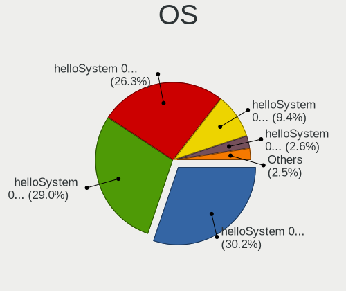

| Name              | Computers | Percent |
|-------------------|-----------|---------|
| helloSystem 0.5.0 | 209       | 30.2%   |
| helloSystem 0.4.0 | 201       | 29.05%  |
| helloSystem 0.7.0 | 182       | 26.3%   |
| helloSystem 0.6.0 | 65        | 9.39%   |
| helloSystem 0.8.0 | 18        | 2.6%    |
| helloSystem 0.3.0 | 17        | 2.46%   |

OS Family
---------

OS without a version

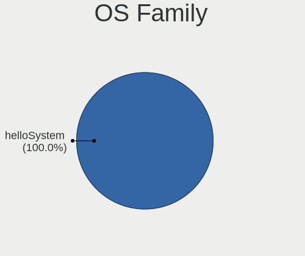

| Name        | Computers | Percent |
|-------------|-----------|---------|
| helloSystem | 688       | 100%    |

Arch
----

OS architecture (x86_64, i586, etc.)

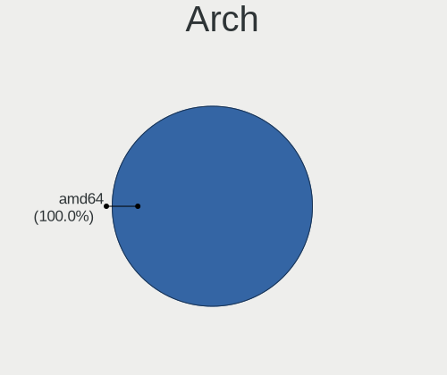

| Name  | Computers | Percent |
|-------|-----------|---------|
| amd64 | 688       | 100%    |

DE
--

Desktop Environment

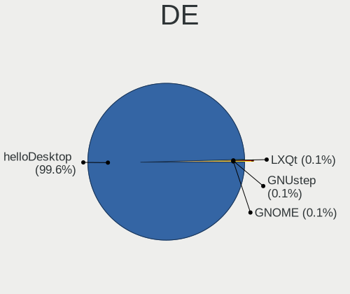

| Name         | Computers | Percent |
|--------------|-----------|---------|
| helloDesktop | 685       | 99.56%  |
| LXQt         | 1         | 0.15%   |
| GNUstep      | 1         | 0.15%   |
| GNOME        | 1         | 0.15%   |

Display Server
--------------

X11 or Wayland

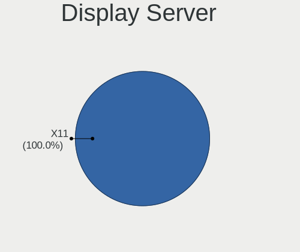

| Name | Computers | Percent |
|------|-----------|---------|
| X11  | 688       | 100%    |

Display Manager
---------------

SDDM, LightDM, etc.

| Name | Computers | Percent |
|------|-----------|---------|
| SLiM | 687       | 99.85%  |
| XDM  | 1         | 0.15%   |

OS Lang
-------

Language

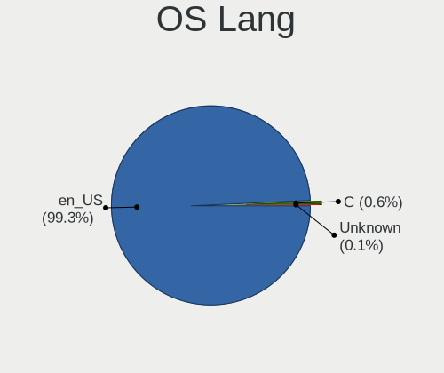

| Lang    | Computers | Percent |
|---------|-----------|---------|
| en_US   | 684       | 99.27%  |
| C       | 4         | 0.58%   |
| Unknown | 1         | 0.15%   |

Boot Mode
---------

EFI or BIOS

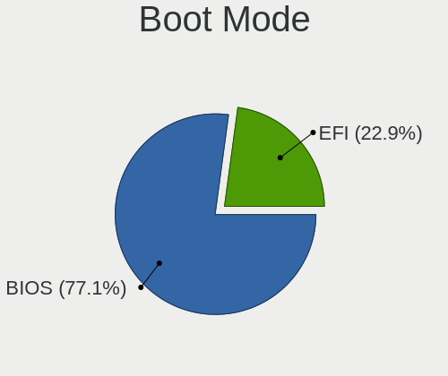

| Mode | Computers | Percent |
|------|-----------|---------|
| BIOS | 533       | 77.13%  |
| EFI  | 158       | 22.87%  |

Filesystem
----------

Type of filesystem

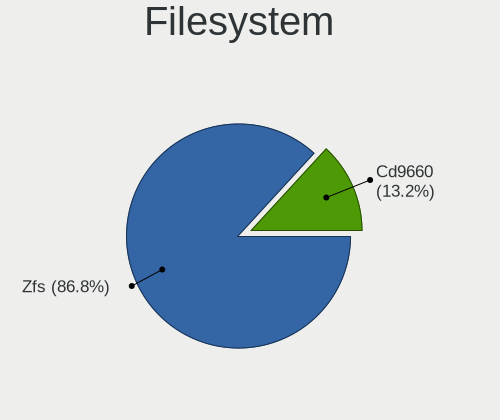

| Type   | Computers | Percent |
|--------|-----------|---------|
| Zfs    | 600       | 86.83%  |
| Cd9660 | 91        | 13.17%  |

Part. scheme
------------

Scheme of partitioning

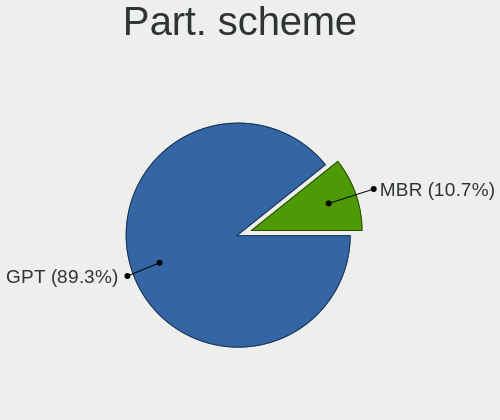

| Type | Computers | Percent |
|------|-----------|---------|
| GPT  | 615       | 89.26%  |
| MBR  | 74        | 10.74%  |

Board
-----

Vendor
------

Motherboard manufacturer

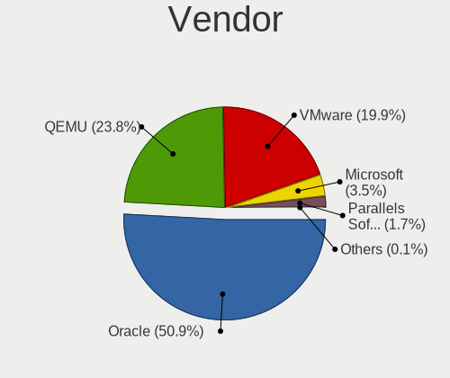

| Name                             | Computers | Percent |
|----------------------------------|-----------|---------|
| Oracle                           | 350       | 50.87%  |
| QEMU                             | 164       | 23.84%  |
| VMware                           | 137       | 19.91%  |
| Microsoft                        | 24        | 3.49%   |
| Parallels Software International | 12        | 1.74%   |
| Red Hat                          | 1         | 0.15%   |

Model
-----

Motherboard model

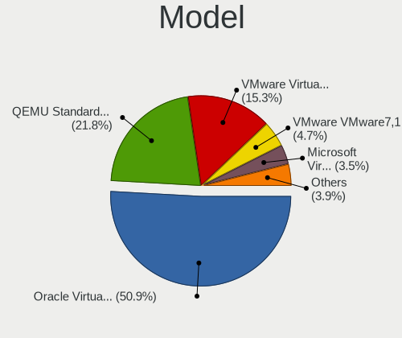

| Name                                                        | Computers | Percent |
|-------------------------------------------------------------|-----------|---------|
| Oracle VirtualBox                                           | 350       | 50.87%  |
| QEMU Standard PC (i440FX + PIIX, 1996)                      | 150       | 21.8%   |
| VMware Virtual Platform                                     | 105       | 15.26%  |
| VMware VMware7,1                                            | 32        | 4.65%   |
| Microsoft Virtual Machine                                   | 24        | 3.49%   |
| QEMU Standard PC (Q35 + ICH9, 2009)                         | 14        | 2.03%   |
| Parallels Software International Parallels Virtual Platform | 12        | 1.74%   |
| Red Hat KVM                                                 | 1         | 0.15%   |

Model Family
------------

Motherboard model prefix

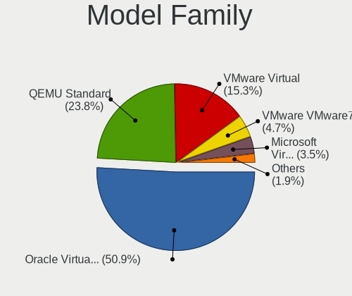

| Name                                       | Computers | Percent |
|--------------------------------------------|-----------|---------|
| Oracle VirtualBox                          | 350       | 50.87%  |
| QEMU Standard                              | 164       | 23.84%  |
| VMware Virtual                             | 105       | 15.26%  |
| VMware VMware7                             | 32        | 4.65%   |
| Microsoft Virtual                          | 24        | 3.49%   |
| Parallels Software International Parallels | 12        | 1.74%   |
| Red Hat KVM                                | 1         | 0.15%   |

MFG Year
--------

Motherboard manufacture year

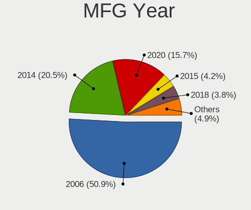

| Year | Computers | Percent |
|------|-----------|---------|
| 2006 | 350       | 50.87%  |
| 2014 | 141       | 20.49%  |
| 2020 | 108       | 15.7%   |
| 2015 | 29        | 4.22%   |
| 2018 | 26        | 3.78%   |
| 2021 | 21        | 3.05%   |
| 2019 | 9         | 1.31%   |
| 2017 | 3         | 0.44%   |
| 2013 | 1         | 0.15%   |

Form Factor
-----------

Physical design of the computer

| Name            | Computers | Percent |
|-----------------|-----------|---------|
| Virtual machine | 688       | 100%    |

Coreboot
--------

Have coreboot on board

| Used | Computers | Percent |
|------|-----------|---------|
| No   | 688       | 100%    |

RAM Size
--------

Total RAM memory

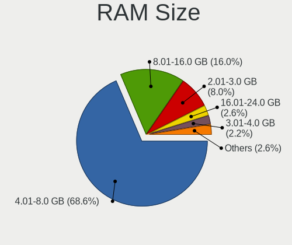

| Size in GB | Computers | Percent |
|------------|-----------|---------|
| 4.01-8.0   | 472       | 68.6%   |
| 8.01-16.0  | 110       | 15.99%  |
| 2.01-3.0   | 55        | 7.99%   |
| 16.01-24.0 | 18        | 2.62%   |
| 3.01-4.0   | 15        | 2.18%   |
| 0.51-1.0   | 8         | 1.16%   |
| 1.01-2.0   | 7         | 1.02%   |
| 32.01-64.0 | 3         | 0.44%   |

RAM Used
--------

Used RAM memory

| Used GB  | Computers | Percent |
|----------|-----------|---------|
| 0.01-0.5 | 376       | 54.65%  |
| 0.51-1.0 | 306       | 44.48%  |
| 1.01-2.0 | 5         | 0.73%   |
| 2.01-3.0 | 1         | 0.15%   |

Total Drives
------------

Number of drives on board

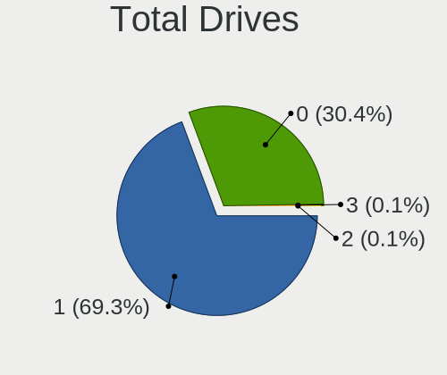

| Drives | Computers | Percent |
|--------|-----------|---------|
| 1      | 477       | 69.33%  |
| 0      | 209       | 30.38%  |
| 3      | 1         | 0.15%   |
| 2      | 1         | 0.15%   |

Has CD-ROM
----------

Has CD-ROM on board

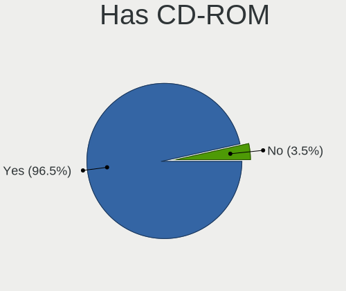

| Presented | Computers | Percent |
|-----------|-----------|---------|
| Yes       | 664       | 96.51%  |
| No        | 24        | 3.49%   |

Has Ethernet
------------

Has Ethernet on board

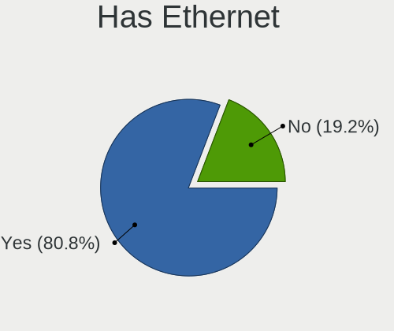

| Presented | Computers | Percent |
|-----------|-----------|---------|
| Yes       | 556       | 80.81%  |
| No        | 132       | 19.19%  |

Has WiFi
--------

Has WiFi module

| Presented | Computers | Percent |
|-----------|-----------|---------|
| No        | 688       | 100%    |

Has Bluetooth
-------------

Has Bluetooth module

| Presented | Computers | Percent |
|-----------|-----------|---------|
| No        | 680       | 98.84%  |
| Yes       | 8         | 1.16%   |

Location
--------

Country
-------

Geographic location (country)

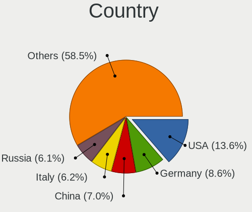

| Country             | Computers | Percent |
|---------------------|-----------|---------|
| USA                 | 94        | 13.64%  |
| Germany             | 59        | 8.56%   |
| China               | 48        | 6.97%   |
| Italy               | 43        | 6.24%   |
| Russia              | 42        | 6.1%    |
| UK                  | 40        | 5.81%   |
| Brazil              | 39        | 5.66%   |
| France              | 25        | 3.63%   |
| Ukraine             | 24        | 3.48%   |
| Spain               | 18        | 2.61%   |
| Poland              | 18        | 2.61%   |
| Canada              | 18        | 2.61%   |
| Netherlands         | 13        | 1.89%   |
| Australia           | 12        | 1.74%   |
| Turkey              | 10        | 1.45%   |
| Argentina           | 10        | 1.45%   |
| Hungary             | 9         | 1.31%   |
| Indonesia           | 8         | 1.16%   |
| Sweden              | 7         | 1.02%   |
| Romania             | 7         | 1.02%   |
| Mexico              | 7         | 1.02%   |
| Japan               | 7         | 1.02%   |
| Hong Kong           | 7         | 1.02%   |
| Greece              | 7         | 1.02%   |
| Czechia             | 7         | 1.02%   |
| Austria             | 7         | 1.02%   |
| Taiwan              | 6         | 0.87%   |
| South Africa        | 6         | 0.87%   |
| India               | 6         | 0.87%   |
| Chile               | 6         | 0.87%   |
| Belgium             | 6         | 0.87%   |
| South Korea         | 4         | 0.58%   |
| Portugal            | 4         | 0.58%   |
| Peru                | 4         | 0.58%   |
| Israel              | 4         | 0.58%   |
| Finland             | 4         | 0.58%   |
| Croatia             | 4         | 0.58%   |
| Norway              | 3         | 0.44%   |
| Bulgaria            | 3         | 0.44%   |
| Slovakia            | 2         | 0.29%   |
| Serbia              | 2         | 0.29%   |
| Pakistan            | 2         | 0.29%   |
| New Zealand         | 2         | 0.29%   |
| Nepal               | 2         | 0.29%   |
| Malaysia            | 2         | 0.29%   |
| Kazakhstan          | 2         | 0.29%   |
| Iran                | 2         | 0.29%   |
| Estonia             | 2         | 0.29%   |
| Denmark             | 2         | 0.29%   |
| Colombia            | 2         | 0.29%   |
| Belarus             | 2         | 0.29%   |
| Venezuela           | 1         | 0.15%   |
| Uzbekistan          | 1         | 0.15%   |
| Trinidad and Tobago | 1         | 0.15%   |
| Switzerland         | 1         | 0.15%   |
| Runion          | 1         | 0.15%   |
| Paraguay            | 1         | 0.15%   |
| Panama              | 1         | 0.15%   |
| North Macedonia     | 1         | 0.15%   |
| Lithuania           | 1         | 0.15%   |

City
----

Geographic location (city)

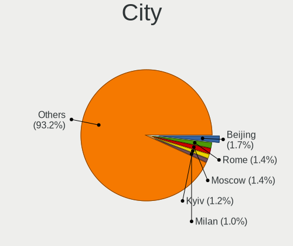

| City                 | Computers | Percent |
|----------------------|-----------|---------|
| Beijing              | 12        | 1.73%   |
| Rome                 | 10        | 1.45%   |
| Moscow               | 10        | 1.45%   |
| Kyiv                 | 8         | 1.16%   |
| Milan                | 7         | 1.01%   |
| Berlin               | 7         | 1.01%   |
| The Bronx            | 6         | 0.87%   |
| Vienna               | 5         | 0.72%   |
| Mexico City          | 5         | 0.72%   |
| Istanbul             | 5         | 0.72%   |
| Hamburg              | 5         | 0.72%   |
| Guangzhou            | 5         | 0.72%   |
| Zagreb               | 4         | 0.58%   |
| Sydney               | 4         | 0.58%   |
| St Petersburg        | 4         | 0.58%   |
| Rio de Janeiro       | 4         | 0.58%   |
| Montreal             | 4         | 0.58%   |
| Jakarta              | 4         | 0.58%   |
| Central              | 4         | 0.58%   |
| Budapest             | 4         | 0.58%   |
| Bucharest            | 4         | 0.58%   |
| Brighton             | 4         | 0.58%   |
| Athens               | 4         | 0.58%   |
| Amsterdam            | 4         | 0.58%   |
| Sofia                | 3         | 0.43%   |
| Saitama              | 3         | 0.43%   |
| Paris                | 3         | 0.43%   |
| Odessa               | 3         | 0.43%   |
| Madrid               | 3         | 0.43%   |
| London               | 3         | 0.43%   |
| Krasnodar            | 3         | 0.43%   |
| Johannesburg         | 3         | 0.43%   |
| Izhevsk              | 3         | 0.43%   |
| Hampton              | 3         | 0.43%   |
| Frankfurt am Main    | 3         | 0.43%   |
| Everett              | 3         | 0.43%   |
| Zhuhai               | 2         | 0.29%   |
| Yunlin               | 2         | 0.29%   |
| Wroclaw              | 2         | 0.29%   |
| Verona               | 2         | 0.29%   |
| Venice               | 2         | 0.29%   |
| Ufa                  | 2         | 0.29%   |
| Thessaloniki         | 2         | 0.29%   |
| Tallinn              | 2         | 0.29%   |
| Talavera de la Reina | 2         | 0.29%   |
| Stockholm            | 2         | 0.29%   |
| South Jordan         | 2         | 0.29%   |
| Sao Paulo            | 2         | 0.29%   |
| Prague               | 2         | 0.29%   |
| Poznan               | 2         | 0.29%   |
| Porto Alegre         | 2         | 0.29%   |
| Portage              | 2         | 0.29%   |
| Nizhniy Novgorod     | 2         | 0.29%   |
| Netanya              | 2         | 0.29%   |
| Melbourne            | 2         | 0.29%   |
| Maring           | 2         | 0.29%   |
| Mannheim             | 2         | 0.29%   |
| Loveland             | 2         | 0.29%   |
| Leipzig              | 2         | 0.29%   |
| Le Pradet            | 2         | 0.29%   |

Drives
------

Drive Vendor
------------

Hard drive vendors

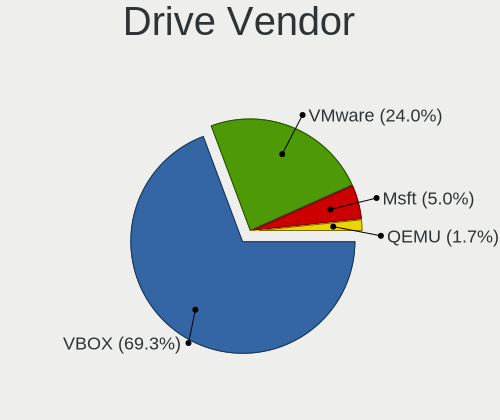

| Vendor | Computers | Drives | Percent |
|--------|-----------|--------|---------|
| VBOX   | 332       | 345    | 69.31%  |
| VMware | 115       | 117    | 24.01%  |
| Msft   | 24        | 25     | 5.01%   |
| QEMU   | 8         | 9      | 1.67%   |

Drive Model
-----------

Hard drive models

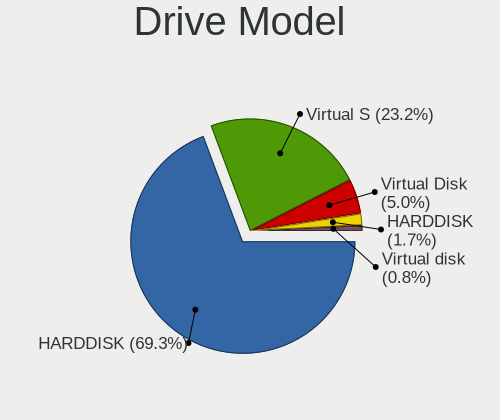

| Model               | Computers | Percent |
|---------------------|-----------|---------|
| VBOX HARDDISK       | 332       | 69.31%  |
| VMware Virtual S    | 111       | 23.17%  |
| Msft Virtual Disk   | 24        | 5.01%   |
| QEMU HARDDISK       | 8         | 1.67%   |
| VMware Virtual disk | 4         | 0.84%   |

HDD Vendor
----------

Hard disk drive vendors

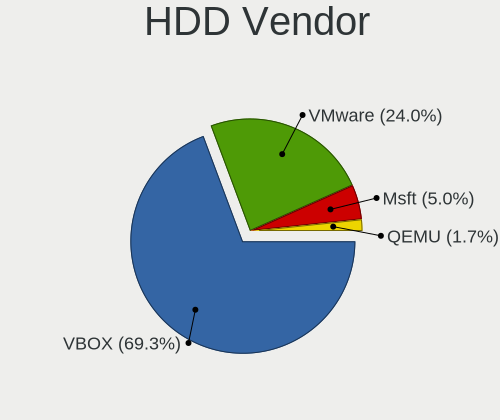

| Vendor | Computers | Drives | Percent |
|--------|-----------|--------|---------|
| VBOX   | 332       | 345    | 69.31%  |
| VMware | 115       | 117    | 24.01%  |
| Msft   | 24        | 25     | 5.01%   |
| QEMU   | 8         | 9      | 1.67%   |

SSD Vendor
----------

Solid state drive vendors

Zero info for selected period =(

Drive Kind
----------

HDD or SSD

| Kind | Computers | Drives | Percent |
|------|-----------|--------|---------|
| HDD  | 479       | 496    | 100%    |

Drive Connector
---------------

SATA, SAS, NVMe, etc.

| Type | Computers | Drives | Percent |
|------|-----------|--------|---------|
| SATA | 479       | 496    | 100%    |

Drive Size
----------

Size of hard drive

| Size in TB | Computers | Drives | Percent |
|------------|-----------|--------|---------|
| 0.01-0.5   | 479       | 496    | 100%    |

Space Total
-----------

Amount of disk space available on the file system

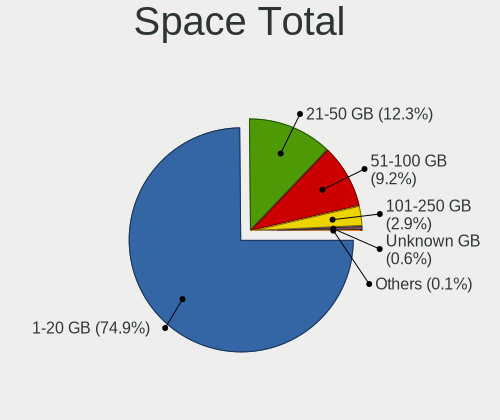

| Size in GB | Computers | Percent |
|------------|-----------|---------|
| 1-20       | 518       | 74.86%  |
| 21-50      | 85        | 12.28%  |
| 51-100     | 64        | 9.25%   |
| 101-250    | 20        | 2.89%   |
| Unknown    | 4         | 0.58%   |
| 1001-2000  | 1         | 0.14%   |

Space Used
----------

Amount of used disk space

| Used GB | Computers | Percent |
|---------|-----------|---------|
| 1-20    | 686       | 99.42%  |
| Unknown | 4         | 0.58%   |

Malfunc. Drives
---------------

Drive models with a malfunction

Zero info for selected period =(

Malfunc. Drive Vendor
---------------------

Vendors of faulty drives

Zero info for selected period =(

Malfunc. HDD Vendor
-------------------

Vendors of faulty HDD drives

Zero info for selected period =(

Malfunc. Drive Kind
-------------------

Kinds of faulty drives

Zero info for selected period =(

Failed Drives
-------------

Failed drive models

Zero info for selected period =(

Failed Drive Vendor
-------------------

Failed drive vendors

Zero info for selected period =(

Drive Status
------------

Number of failed and malfunc. drives

| Status   | Computers | Drives | Percent |
|----------|-----------|--------|---------|
| Detected | 479       | 496    | 100%    |

Storage controller
------------------

Storage Vendor
--------------

Storage controller vendors

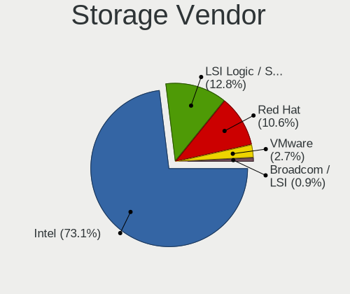

| Vendor                    | Computers | Percent |
|---------------------------|-----------|---------|
| Intel                     | 686       | 73.06%  |
| LSI Logic / Symbios Logic | 120       | 12.78%  |
| Red Hat                   | 100       | 10.65%  |
| VMware                    | 25        | 2.66%   |
| Broadcom / LSI            | 8         | 0.85%   |

Storage Model
-------------

Storage controller models

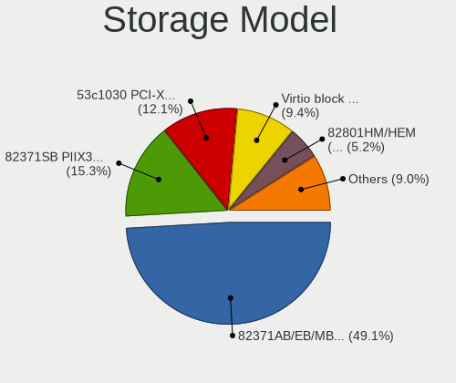

| Model                                                                 | Computers | Percent |
|-----------------------------------------------------------------------|-----------|---------|
| Intel 82371AB/EB/MB PIIX4 IDE                                         | 486       | 49.09%  |
| Intel 82371SB PIIX3 IDE [Natoma/Triton II]                            | 151       | 15.25%  |
| LSI Logic / Symbios Logic 53c1030 PCI-X Fusion-MPT Dual Ultra320 SCSI | 120       | 12.12%  |
| Red Hat Virtio block device                                           | 93        | 9.39%   |
| Intel 82801HM/HEM (ICH8M/ICH8M-E) SATA Controller [AHCI mode]         | 51        | 5.15%   |
| Intel 82801IR/IO/IH (ICH9R/DO/DH) 6 port SATA Controller [AHCI mode]  | 27        | 2.73%   |
| VMware SATA AHCI controller                                           | 18        | 1.82%   |
| Intel 82801BA IDE U100 Controller                                     | 12        | 1.21%   |
| VMware NVMe SSD Controller                                            | 8         | 0.81%   |
| Intel 82801HR/HO/HH (ICH8R/DO/DH) 6 port SATA Controller [AHCI mode]  | 8         | 0.81%   |
| Red Hat Virtio SCSI                                                   | 7         | 0.71%   |
| Broadcom / LSI SAS1068 PCI-X Fusion-MPT SAS                           | 5         | 0.51%   |
| Broadcom / LSI 53c895a                                                | 3         | 0.3%    |
| VMware PVSCSI SCSI Controller                                         | 1         | 0.1%    |

Storage Kind
------------

Kind of storage controller (IDE, SATA, NVMe, SAS, ...)

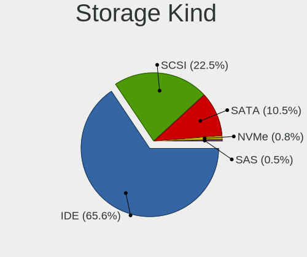

| Kind | Computers | Percent |
|------|-----------|---------|
| IDE  | 649       | 65.62%  |
| SCSI | 223       | 22.55%  |
| SATA | 104       | 10.52%  |
| NVMe | 8         | 0.81%   |
| SAS  | 5         | 0.51%   |

Processor
---------

CPU Vendor
----------

Processor vendors

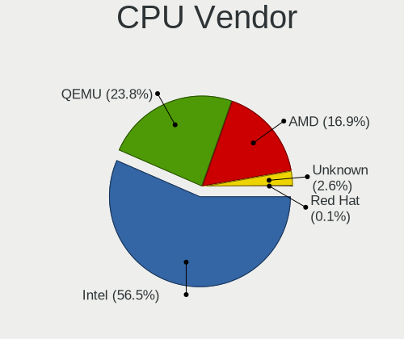

| Vendor  | Computers | Percent |
|---------|-----------|---------|
| Intel   | 389       | 56.54%  |
| QEMU    | 164       | 23.84%  |
| AMD     | 116       | 16.86%  |
| Unknown | 18        | 2.62%   |
| Red Hat | 1         | 0.15%   |

CPU Model
---------

Processor models

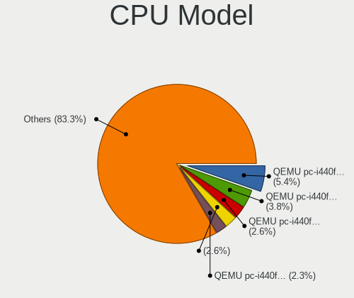

| Model                                          | Computers | Percent |
|------------------------------------------------|-----------|---------|
| QEMU pc-i440fx-5.2                             | 37        | 5.37%   |
| QEMU pc-i440fx-6.1                             | 26        | 3.77%   |
| QEMU pc-i440fx-5.1                             | 18        | 2.61%   |
|                                                | 18        | 2.61%   |
| QEMU pc-i440fx-focal                           | 16        | 2.32%   |
| QEMU pc-i440fx-6.0                             | 12        | 1.74%   |
| QEMU pc-i440fx-6.2                             | 11        | 1.6%    |
| Intel Core i7-8550U CPU @ 1.80GHz              | 10        | 1.45%   |
| QEMU pc-i440fx-hirsute                         | 7         | 1.02%   |
| Intel Core i7-6700HQ CPU @ 2.60GHz             | 7         | 1.02%   |
| Intel Core i7-3770 CPU @ 3.40GHz               | 7         | 1.02%   |
| AMD Ryzen 7 3700X 8-Core Processor             | 7         | 1.02%   |
| Intel Unknown                                  | 6         | 0.87%   |
| Intel Core i7-9750H CPU @ 2.60GHz              | 6         | 0.87%   |
| Intel Core i7-10750H CPU @ 2.60GHz             | 6         | 0.87%   |
| Intel Core i5-7200U CPU @ 2.50GHz              | 6         | 0.87%   |
| Intel Core i5-4570 CPU @ 3.20GHz               | 6         | 0.87%   |
| AMD Ryzen 9 3900X 12-Core Processor            | 6         | 0.87%   |
| QEMU pc-q35-5.2                                | 5         | 0.73%   |
| QEMU pc-i440fx-impish                          | 5         | 0.73%   |
| QEMU pc-i440fx-4.2                             | 5         | 0.73%   |
| Intel Core i7-8750H CPU @ 2.20GHz              | 5         | 0.73%   |
| Intel Core i7-7820HQ CPU @ 2.90GHz             | 5         | 0.73%   |
| Intel Core i5-6200U CPU @ 2.30GHz              | 5         | 0.73%   |
| Intel Core i5-5250U CPU @ 1.60GHz              | 5         | 0.73%   |
| AMD Ryzen 5 2600 Six-Core Processor            | 5         | 0.73%   |
| AMD FX-8350 Eight-Core Processor               | 5         | 0.73%   |
| QEMU pc-q35-6.1                                | 4         | 0.58%   |
| QEMU pc-i440fx-groovy                          | 4         | 0.58%   |
| Intel Xeon CPU E3-1230 V2 @ 3.30GHz            | 4         | 0.58%   |
| Intel Core i7-8700K CPU @ 3.70GHz              | 4         | 0.58%   |
| Intel Core i7-7700K CPU @ 4.20GHz              | 4         | 0.58%   |
| Intel Core i7-7700HQ CPU @ 2.80GHz             | 4         | 0.58%   |
| Intel Core i7-6920HQ CPU @ 2.90GHz             | 4         | 0.58%   |
| Intel Core i7-4790K CPU @ 4.00GHz              | 4         | 0.58%   |
| Intel Core i7-3630QM CPU @ 2.40GHz             | 4         | 0.58%   |
| Intel Core i7-3520M CPU @ 2.90GHz              | 4         | 0.58%   |
| Intel Core i5-3210M CPU @ 2.50GHz              | 4         | 0.58%   |
| AMD Ryzen 5 3500U with Radeon Vega Mobile Gfx  | 4         | 0.58%   |
| AMD A6-6400K APU with Radeon HD Graphics       | 4         | 0.58%   |
| QEMU pc-i440fx-bionic                          | 3         | 0.44%   |
| QEMU pc-i440fx-5.0                             | 3         | 0.44%   |
| Intel Core i9-9900KF CPU @ 3.60GHz             | 3         | 0.44%   |
| Intel Core i9-9900K CPU @ 3.60GHz              | 3         | 0.44%   |
| Intel Core i7-9850H CPU @ 2.60GHz              | 3         | 0.44%   |
| Intel Core i7-8565U CPU @ 1.80GHz              | 3         | 0.44%   |
| Intel Core i7-4980HQ CPU @ 2.80GHz             | 3         | 0.44%   |
| Intel Core i7-4810MQ CPU @ 2.80GHz             | 3         | 0.44%   |
| Intel Core i7-4790 CPU @ 3.60GHz               | 3         | 0.44%   |
| Intel Core i7-4771 CPU @ 3.50GHz               | 3         | 0.44%   |
| Intel Core i7-4770K CPU @ 3.50GHz              | 3         | 0.44%   |
| Intel Core i7-4720HQ CPU @ 2.60GHz             | 3         | 0.44%   |
| Intel Core i7-4610M CPU @ 3.00GHz              | 3         | 0.44%   |
| Intel Core i7-3615QM CPU @ 2.30GHz             | 3         | 0.44%   |
| Intel Core i7                                  | 3         | 0.44%   |
| Intel Core i5-9400F CPU @ 2.90GHz              | 3         | 0.44%   |
| Intel Core i5-6500 CPU @ 3.20GHz               | 3         | 0.44%   |
| Intel Core i5-5200U CPU @ 2.20GHz              | 3         | 0.44%   |
| Intel Core i5-4278U CPU @ 2.60GHz              | 3         | 0.44%   |
| Intel Core i5-3570 CPU @ 3.40GHz               | 3         | 0.44%   |

CPU Model Family
----------------

Processor model prefix

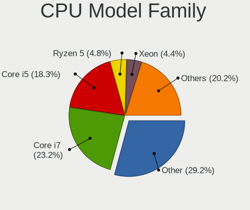

| Model                  | Computers | Percent |
|------------------------|-----------|---------|
| Other                  | 201       | 29.17%  |
| Intel Core i7          | 160       | 23.22%  |
| Intel Core i5          | 126       | 18.29%  |
| AMD Ryzen 5            | 33        | 4.79%   |
| Intel Xeon             | 30        | 4.35%   |
| Intel Core i3          | 27        | 3.92%   |
| AMD Ryzen 7            | 26        | 3.77%   |
| Intel Core i9          | 14        | 2.03%   |
| AMD Ryzen 9            | 10        | 1.45%   |
| AMD FX                 | 10        | 1.45%   |
| AMD Ryzen 3            | 9         | 1.31%   |
| Intel Pentium          | 6         | 0.87%   |
| AMD A6                 | 6         | 0.87%   |
| AMD Phenom II X4       | 4         | 0.58%   |
| AMD A8                 | 3         | 0.44%   |
| Intel Genuine          | 2         | 0.29%   |
| Intel Core 2 Quad      | 2         | 0.29%   |
| Intel Core 2 Duo       | 2         | 0.29%   |
| Intel Celeron          | 2         | 0.29%   |
| AMD Ryzen 7 PRO        | 2         | 0.29%   |
| AMD Athlon             | 2         | 0.29%   |
| AMD A10                | 2         | 0.29%   |
| Intel Pentium Gold     | 1         | 0.15%   |
| Intel Pentium 4        | 1         | 0.15%   |
| Intel Core m3          | 1         | 0.15%   |
| AMD Ryzen Threadripper | 1         | 0.15%   |
| AMD Ryzen 5 PRO        | 1         | 0.15%   |
| AMD PRO A10            | 1         | 0.15%   |
| AMD Phenom II X6       | 1         | 0.15%   |
| AMD Opteron            | 1         | 0.15%   |
| AMD E2                 | 1         | 0.15%   |
| AMD Athlon X4          | 1         | 0.15%   |

CPU Cores
---------

Number of processor cores

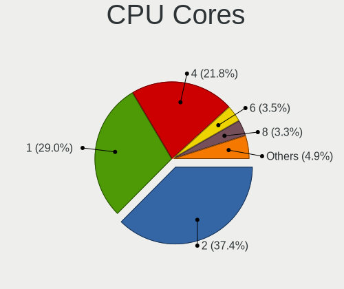

| Number  | Computers | Percent |
|---------|-----------|---------|
| 2       | 258       | 37.45%  |
| 1       | 200       | 29.03%  |
| 4       | 150       | 21.77%  |
| 6       | 24        | 3.48%   |
| 8       | 23        | 3.34%   |
| 3       | 20        | 2.9%    |
| 12      | 7         | 1.02%   |
| 24      | 2         | 0.29%   |
| 16      | 2         | 0.29%   |
| Unknown | 2         | 0.29%   |
| 10      | 1         | 0.15%   |

CPU Sockets
-----------

Number of sockets

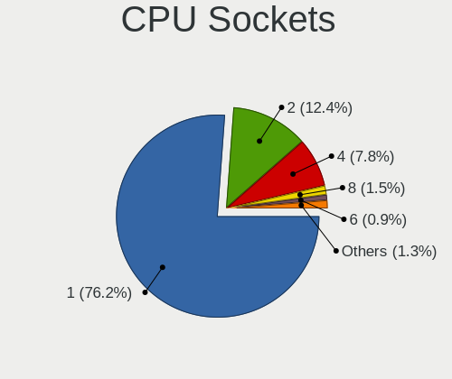

| Number  | Computers | Percent |
|---------|-----------|---------|
| 1       | 524       | 76.16%  |
| 2       | 85        | 12.35%  |
| 4       | 54        | 7.85%   |
| 8       | 10        | 1.45%   |
| 6       | 6         | 0.87%   |
| 3       | 5         | 0.73%   |
| Unknown | 4         | 0.58%   |

CPU Threads
-----------

Threads per core (Hyper-Threading)

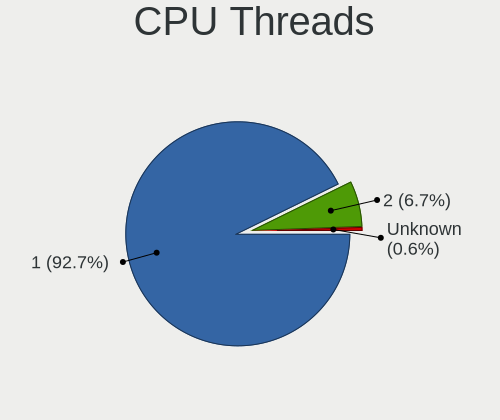

| Number  | Computers | Percent |
|---------|-----------|---------|
| 1       | 638       | 92.73%  |
| 2       | 46        | 6.69%   |
| Unknown | 4         | 0.58%   |

CPU Microarch
-------------

Microarchitecture

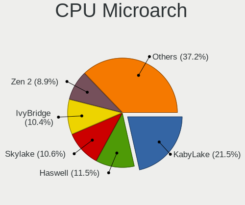

| Name          | Computers | Percent |
|---------------|-----------|---------|
| KabyLake      | 148       | 21.48%  |
| Haswell       | 79        | 11.47%  |
| Skylake       | 73        | 10.6%   |
| IvyBridge     | 72        | 10.45%  |
| Zen 2         | 61        | 8.85%   |
| SandyBridge   | 39        | 5.66%   |
| Zen           | 31        | 4.5%    |
| Zen+          | 27        | 3.92%   |
| CometLake     | 21        | 3.05%   |
| Piledriver    | 18        | 2.61%   |
| Broadwell     | 18        | 2.61%   |
| Westmere      | 13        | 1.89%   |
| NetBurst      | 12        | 1.74%   |
| Nehalem       | 9         | 1.31%   |
| IceLake       | 9         | 1.31%   |
| Zen 3         | 8         | 1.16%   |
| Unknown       | 8         | 1.16%   |
| Penryn        | 7         | 1.02%   |
| K10           | 7         | 1.02%   |
| K8 Hammer     | 6         | 0.87%   |
| Excavator     | 6         | 0.87%   |
| TigerLake     | 5         | 0.73%   |
| Steamroller   | 2         | 0.29%   |
| Puma          | 2         | 0.29%   |
| Bulldozer     | 2         | 0.29%   |
| Silvermont    | 1         | 0.15%   |
| K6            | 1         | 0.15%   |
| K10 Llano     | 1         | 0.15%   |
| Jaguar        | 1         | 0.15%   |
| Goldmont plus | 1         | 0.15%   |
| Core          | 1         | 0.15%   |

Graphics
--------

GPU Vendor
----------

Vendors of graphics cards

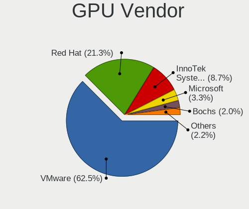

| Vendor                 | Computers | Percent |
|------------------------|-----------|---------|
| VMware                 | 432       | 62.52%  |
| Red Hat                | 147       | 21.27%  |
| InnoTek Systemberatung | 60        | 8.68%   |
| Microsoft              | 23        | 3.33%   |
| Bochs                  | 14        | 2.03%   |
| Parallels              | 12        | 1.74%   |
| Nvidia                 | 2         | 0.29%   |
| AMD                    | 1         | 0.14%   |

GPU Model
---------

Graphics card models

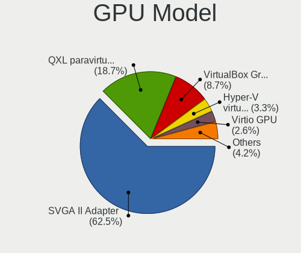

| Model                                              | Computers | Percent |
|----------------------------------------------------|-----------|---------|
| VMware SVGA II Adapter                             | 432       | 62.52%  |
| Red Hat QXL paravirtual graphic card               | 129       | 18.67%  |
| InnoTek Systemberatung VirtualBox Graphics Adapter | 60        | 8.68%   |
| Microsoft Hyper-V virtual VGA                      | 23        | 3.33%   |
| Red Hat Virtio GPU                                 | 18        | 2.6%    |
| Bochs VGA                                          | 14        | 2.03%   |
| Parallels Accelerated Virtual Video Adapter        | 12        | 1.74%   |
| Nvidia GP107 [GeForce GTX 1050 Ti]                 | 2         | 0.29%   |
| AMD Redwood PRO GL [FirePro V3800]                 | 1         | 0.14%   |

GPU Combo
---------

Combinations of graphics cards

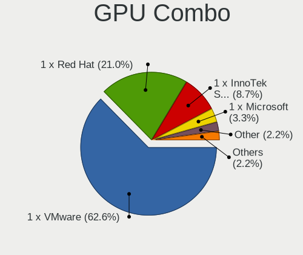

| Name                       | Computers | Percent |
|----------------------------|-----------|---------|
| 1 x VMware                 | 432       | 62.61%  |
| 1 x Red Hat                | 145       | 21.01%  |
| 1 x InnoTek Systemberatung | 60        | 8.7%    |
| 1 x Microsoft              | 23        | 3.33%   |
| Other                      | 15        | 2.17%   |
| 1 x Parallels              | 12        | 1.74%   |
| Nvidia + Red Hat           | 2         | 0.29%   |
| 1 x AMD                    | 1         | 0.14%   |

GPU Driver
----------

Free vs proprietary

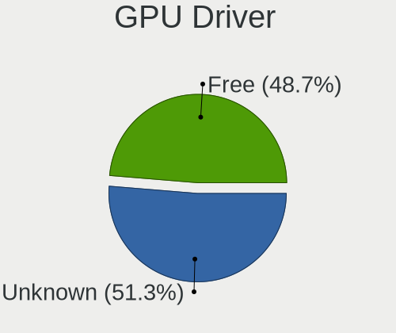

| Driver  | Computers | Percent |
|---------|-----------|---------|
| Unknown | 354       | 51.3%   |
| Free    | 336       | 48.7%   |

GPU Memory
----------

Total video memory

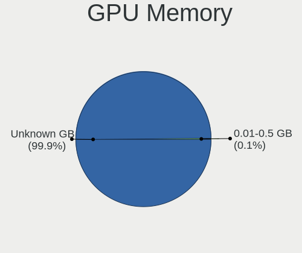

| Size in GB | Computers | Percent |
|------------|-----------|---------|
| Unknown    | 687       | 99.85%  |
| 0.01-0.5   | 1         | 0.15%   |

Monitor
-------

Monitor Vendor
--------------

Monitor vendors

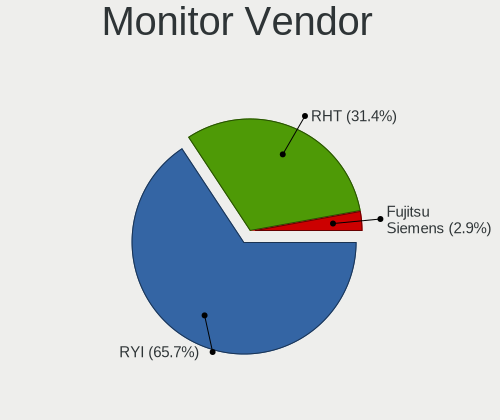

| Vendor          | Computers | Percent |
|-----------------|-----------|---------|
| RYI             | 23        | 65.71%  |
| RHT             | 11        | 31.43%  |
| Fujitsu Siemens | 1         | 2.86%   |

Monitor Model
-------------

Monitor models

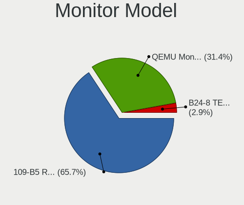

| Model                                                              | Computers | Percent |
|--------------------------------------------------------------------|-----------|---------|
| RYI 109-B5 RYI0001 1920x1440 360x270mm 17.7-inch                   | 23        | 65.71%  |
| RHT QEMU Monitor RHT1234 2048x1152 260x190mm 12.7-inch             | 11        | 31.43%  |
| Fujitsu Siemens B24-8 TE Pro FUS087C 1920x1080 530x300mm 24.0-inch | 1         | 2.86%   |

Monitor Resolution
------------------

Monitor screen resolution

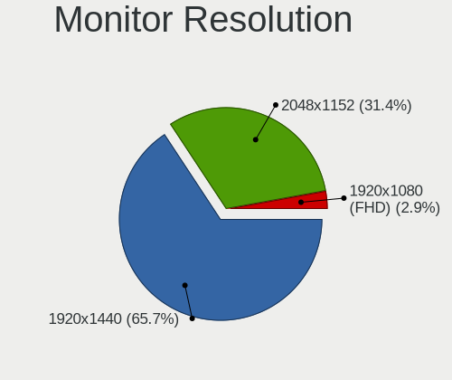

| Resolution      | Computers | Percent |
|-----------------|-----------|---------|
| 1920x1440       | 23        | 65.71%  |
| 2048x1152       | 11        | 31.43%  |
| 1920x1080 (FHD) | 1         | 2.86%   |

Monitor Diagonal
----------------

Diagonal size in inches

| Inches | Computers | Percent |
|--------|-----------|---------|
| 17     | 23        | 65.71%  |
| 12     | 11        | 31.43%  |
| 24     | 1         | 2.86%   |

Monitor Width
-------------

Physical width

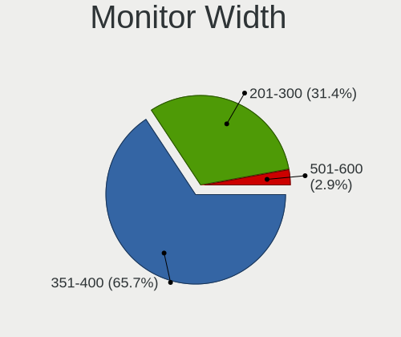

| Width in mm | Computers | Percent |
|-------------|-----------|---------|
| 351-400     | 23        | 65.71%  |
| 201-300     | 11        | 31.43%  |
| 501-600     | 1         | 2.86%   |

Aspect Ratio
------------

Proportional relationship between the width and the height

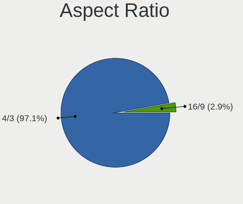

| Ratio | Computers | Percent |
|-------|-----------|---------|
| 4/3   | 34        | 97.14%  |
| 16/9  | 1         | 2.86%   |

Monitor Area
------------

Area in inch

| Area in inch | Computers | Percent |
|----------------|-----------|---------|
| 151-200        | 23        | 65.71%  |
| 71-80          | 11        | 31.43%  |
| 201-250        | 1         | 2.86%   |

Pixel Density
-------------

Pixels per inch

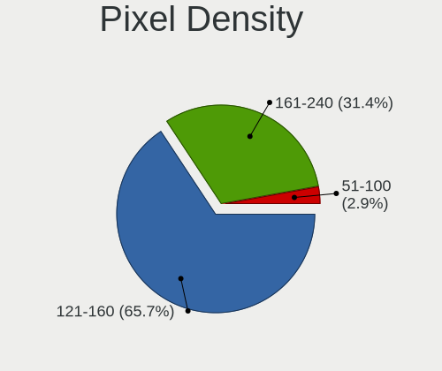

| Density | Computers | Percent |
|---------|-----------|---------|
| 121-160 | 23        | 65.71%  |
| 161-240 | 11        | 31.43%  |
| 51-100  | 1         | 2.86%   |

Multiple Monitors
-----------------

Total monitors connected

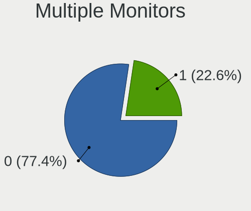

| Total | Computers | Percent |
|-------|-----------|---------|
| 0     | 533       | 77.36%  |
| 1     | 156       | 22.64%  |

Network
-------

Net Controller Vendor
---------------------

Controller vendors

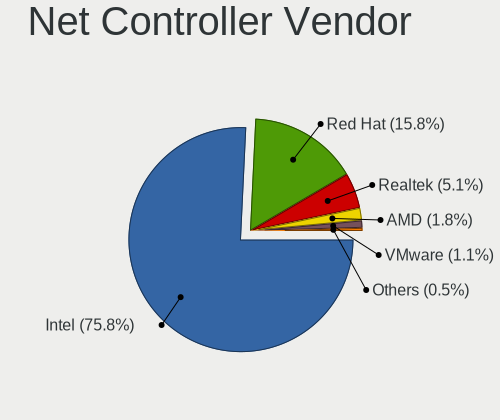

| Vendor                | Computers | Percent |
|-----------------------|-----------|---------|
| Intel                 | 503       | 75.75%  |
| Red Hat               | 105       | 15.81%  |
| Realtek Semiconductor | 34        | 5.12%   |
| AMD                   | 12        | 1.81%   |
| VMware                | 7         | 1.05%   |
| Qumranet              | 3         | 0.45%   |

Net Controller Model
--------------------

Controller models

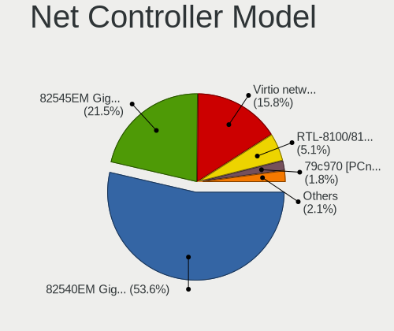

| Model                                                 | Computers | Percent |
|-------------------------------------------------------|-----------|---------|
| Intel 82540EM Gigabit Ethernet Controller             | 356       | 53.61%  |
| Intel 82545EM Gigabit Ethernet Controller (Copper)    | 143       | 21.54%  |
| Red Hat Virtio network device                         | 105       | 15.81%  |
| Realtek RTL-8100/8101L/8139 PCI Fast Ethernet Adapter | 34        | 5.12%   |
| AMD 79c970 [PCnet32 LANCE]                            | 12        | 1.81%   |
| VMware VMXNET3 Ethernet Controller                    | 7         | 1.05%   |
| Intel 82574L Gigabit Network Connection               | 4         | 0.6%    |
| Qumranet Virtio network device                        | 3         | 0.45%   |

Wireless Vendor
---------------

Wireless vendors

Zero info for selected period =(

Wireless Model
--------------

Wireless models

Zero info for selected period =(

Ethernet Vendor
---------------

Ethernet vendors

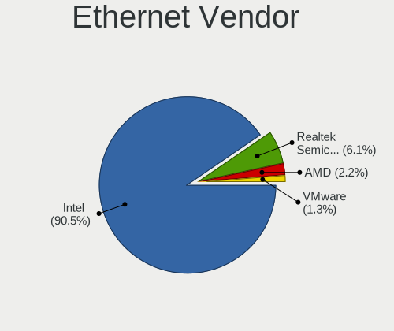

| Vendor                | Computers | Percent |
|-----------------------|-----------|---------|
| Intel                 | 503       | 90.47%  |
| Realtek Semiconductor | 34        | 6.12%   |
| AMD                   | 12        | 2.16%   |
| VMware                | 7         | 1.26%   |

Ethernet Model
--------------

Ethernet models

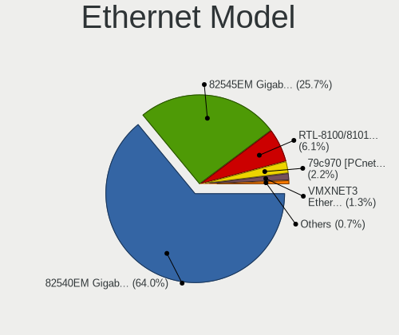

| Model                                                 | Computers | Percent |
|-------------------------------------------------------|-----------|---------|
| Intel 82540EM Gigabit Ethernet Controller             | 356       | 64.03%  |
| Intel 82545EM Gigabit Ethernet Controller (Copper)    | 143       | 25.72%  |
| Realtek RTL-8100/8101L/8139 PCI Fast Ethernet Adapter | 34        | 6.12%   |
| AMD 79c970 [PCnet32 LANCE]                            | 12        | 2.16%   |
| VMware VMXNET3 Ethernet Controller                    | 7         | 1.26%   |
| Intel 82574L Gigabit Network Connection               | 4         | 0.72%   |

Net Controller Kind
-------------------

Ethernet, WiFi or modem

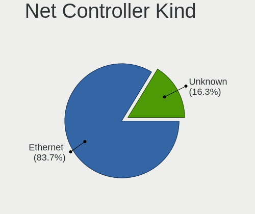

| Kind     | Computers | Percent |
|----------|-----------|---------|
| Ethernet | 556       | 83.73%  |
| Unknown  | 108       | 16.27%  |

Used Controller
---------------

Currently used network controller

| Kind     | Computers | Percent |
|----------|-----------|---------|
| Ethernet | 556       | 83.73%  |
| Unknown  | 108       | 16.27%  |

NICs
----

Total network controllers on board

| Total | Computers | Percent |
|-------|-----------|---------|
| 1     | 661       | 96.08%  |
| 0     | 24        | 3.49%   |
| 2     | 3         | 0.44%   |

IPv6
----

IPv6 vs IPv4

| Used | Computers | Percent |
|------|-----------|---------|
| No   | 685       | 99.56%  |
| Yes  | 3         | 0.44%   |

Bluetooth
---------

Bluetooth Vendor
----------------

Controller vendors

| Vendor | Computers | Percent |
|--------|-----------|---------|
| VMware | 7         | 87.5%   |
| Intel  | 1         | 12.5%   |

Bluetooth Model
---------------

Controller models

| Model                                    | Computers | Percent |
|------------------------------------------|-----------|---------|
| VMware Virtual Bluetooth Adapter         | 7         | 87.5%   |
| Intel Wireless-AC 9260 Bluetooth Adapter | 1         | 12.5%   |

Sound
-----

Sound Vendor
------------

Sound card vendors

| Vendor              | Computers | Percent |
|---------------------|-----------|---------|
| Intel               | 509       | 79.53%  |
| Ensoniq             | 127       | 19.84%  |
| Nvidia              | 2         | 0.31%   |
| C-Media Electronics | 1         | 0.16%   |
| AMD                 | 1         | 0.16%   |

Sound Model
-----------

Sound card models

| Model                                                                      | Computers | Percent |
|----------------------------------------------------------------------------|-----------|---------|
| Intel 82801AA AC'97 Audio Controller                                       | 335       | 52.26%  |
| Intel 82801FB/FBM/FR/FW/FRW (ICH6 Family) High Definition Audio Controller | 150       | 23.4%   |
| Ensoniq ES1371/ES1373 / Creative Labs CT2518                               | 127       | 19.81%  |
| Intel 82801I (ICH9 Family) HD Audio Controller                             | 12        | 1.87%   |
| Intel 82801BA/BAM AC'97 Audio Controller                                   | 12        | 1.87%   |
| Nvidia GP107GL High Definition Audio Controller                            | 2         | 0.31%   |
| Intel Sunrise Point-LP HD Audio                                            | 1         | 0.16%   |
| C-Media Electronics Audio Adapter (Unitek Y-247A)                          | 1         | 0.16%   |
| AMD Redwood HDMI Audio [Radeon HD 5000 Series]                             | 1         | 0.16%   |

Memory
------

Memory Vendor
-------------

Memory module vendors

| Vendor             | Computers | Percent |
|--------------------|-----------|---------|
| QEMU               | 164       | 46.46%  |
| Unknown            | 117       | 33.14%  |
| VMware Virtual RAM | 32        | 9.07%   |
| Microsoft          | 24        | 6.8%    |
| Unknown            | 14        | 3.97%   |
| Red Hat            | 1         | 0.28%   |
| innotek            | 1         | 0.28%   |

Memory Model
------------

Memory module models

| Model                                             | Computers | Percent |
|---------------------------------------------------|-----------|---------|
| Unknown                                           | 117       | 28.4%   |
| QEMU RAM Module 4GB DIMM RAM                      | 41        | 9.95%   |
| Microsoft RAM Module 3968MB                       | 22        | 5.34%   |
| QEMU RAM Module 4096MB DIMM RAM                   | 18        | 4.37%   |
| Microsoft RAM Module 128MB                        | 15        | 3.64%   |
| VMware Virtual RAM RAM VMW-4096MB 4GB DIMM DRAM   | 14        | 3.4%    |
| VMware Virtual RAM RAM VMW-2048MB 2GB DIMM DRAM   | 11        | 2.67%   |
| QEMU RAM Module 2GB DIMM RAM                      | 11        | 2.67%   |
| QEMU RAM Module 8GB DIMM RAM                      | 10        | 2.43%   |
| Unknown RAM Module 64MB DIMM DRAM                 | 8         | 1.94%   |
| VMware Virtual RAM RAM VMW-8192MB 8GB DIMM DRAM   | 7         | 1.7%    |
| Unknown RAM Module 32MB DIMM DRAM                 | 7         | 1.7%    |
| Unknown RAM Module 128MB DIMM DRAM                | 7         | 1.7%    |
| QEMU RAM Module 16GB DIMM RAM                     | 6         | 1.46%   |
| VMware Virtual RAM RAM VMW-512MB 512MB DIMM DRAM  | 5         | 1.21%   |
| VMware Virtual RAM RAM VMW-32MB 32MB DIMM DRAM    | 4         | 0.97%   |
| VMware Virtual RAM RAM VMW-256MB 256MB DIMM DRAM  | 4         | 0.97%   |
| VMware Virtual RAM RAM VMW-128MB 128MB DIMM DRAM  | 4         | 0.97%   |
| VMware Virtual RAM RAM VMW-1024MB 1GB DIMM DRAM   | 4         | 0.97%   |
| QEMU RAM Module 6GB DIMM RAM                      | 3         | 0.73%   |
| QEMU RAM Module 4064MB DIMM RAM                   | 3         | 0.73%   |
| QEMU RAM Module 4024MB DIMM RAM                   | 3         | 0.73%   |
| VMware Virtual RAM RAM VMW-8MB 8MB DIMM DRAM      | 2         | 0.49%   |
| VMware Virtual RAM RAM VMW-64MB 64MB DIMM DRAM    | 2         | 0.49%   |
| QEMU RAM Module 8182MB DIMM RAM                   | 2         | 0.49%   |
| QEMU RAM Module 5000MB DIMM RAM                   | 2         | 0.49%   |
| QEMU RAM Module 4204MB DIMM RAM                   | 2         | 0.49%   |
| QEMU RAM Module 4048MB DIMM RAM                   | 2         | 0.49%   |
| QEMU RAM Module 16024MB DIMM RAM                  | 2         | 0.49%   |
| Microsoft RAM Module 2GB                          | 2         | 0.49%   |
| VMware Virtual RAM RAM VMW-4MB 4MB DIMM DRAM      | 1         | 0.24%   |
| VMware Virtual RAM RAM VMW-16MB 16MB DIMM DRAM    | 1         | 0.24%   |
| VMware Virtual RAM RAM VMW-16384MB 16GB DIMM DRAM | 1         | 0.24%   |
| Red Hat RAM Module 4GB DIMM RAM                   | 1         | 0.24%   |
| QEMU RAM Module 8620MB DIMM RAM                   | 1         | 0.24%   |
| QEMU RAM Module 8211MB DIMM RAM                   | 1         | 0.24%   |
| QEMU RAM Module 8196MB DIMM RAM                   | 1         | 0.24%   |
| QEMU RAM Module 8194MB DIMM RAM                   | 1         | 0.24%   |
| QEMU RAM Module 8192MB DIMM RAM                   | 1         | 0.24%   |
| QEMU RAM Module 8180MB DIMM RAM                   | 1         | 0.24%   |
| QEMU RAM Module 8164MB DIMM RAM                   | 1         | 0.24%   |
| QEMU RAM Module 8148MB DIMM RAM                   | 1         | 0.24%   |
| QEMU RAM Module 6704MB DIMM RAM                   | 1         | 0.24%   |
| QEMU RAM Module 6096MB DIMM RAM                   | 1         | 0.24%   |
| QEMU RAM Module 6000MB DIMM RAM                   | 1         | 0.24%   |
| QEMU RAM Module 5GB DIMM RAM                      | 1         | 0.24%   |
| QEMU RAM Module 5345MB DIMM RAM                   | 1         | 0.24%   |
| QEMU RAM Module 5231MB DIMM RAM                   | 1         | 0.24%   |
| QEMU RAM Module 5156MB DIMM RAM                   | 1         | 0.24%   |
| QEMU RAM Module 5145MB DIMM RAM                   | 1         | 0.24%   |
| QEMU RAM Module 5120MB DIMM RAM                   | 1         | 0.24%   |
| QEMU RAM Module 5115MB DIMM RAM                   | 1         | 0.24%   |
| QEMU RAM Module 4778MB DIMM RAM                   | 1         | 0.24%   |
| QEMU RAM Module 4682MB DIMM RAM                   | 1         | 0.24%   |
| QEMU RAM Module 4631MB DIMM RAM                   | 1         | 0.24%   |
| QEMU RAM Module 4480MB DIMM RAM                   | 1         | 0.24%   |
| QEMU RAM Module 4326MB DIMM RAM                   | 1         | 0.24%   |
| QEMU RAM Module 4323MB DIMM RAM                   | 1         | 0.24%   |
| QEMU RAM Module 4191MB DIMM RAM                   | 1         | 0.24%   |
| QEMU RAM Module 4189MB DIMM RAM                   | 1         | 0.24%   |

Memory Kind
-----------

Memory module kinds

| Kind    | Computers | Percent |
|---------|-----------|---------|
| RAM     | 165       | 48.67%  |
| DRAM    | 150       | 44.25%  |
| Unknown | 24        | 7.08%   |

Memory Form Factor
------------------

Physical design of the memory module

| Name    | Computers | Percent |
|---------|-----------|---------|
| DIMM    | 311       | 91.74%  |
| Unknown | 24        | 7.08%   |
| SODIMM  | 4         | 1.18%   |

Memory Size
-----------

Memory module size

| Size  | Computers | Percent |
|-------|-----------|---------|
| 4096  | 154       | 33.55%  |
| 2048  | 42        | 9.15%   |
| 8192  | 35        | 7.63%   |
| 128   | 27        | 5.88%   |
| 3968  | 22        | 4.79%   |
| 256   | 17        | 3.7%    |
| 1024  | 15        | 3.27%   |
| 16384 | 13        | 2.83%   |
| 512   | 12        | 2.61%   |
| 32    | 12        | 2.61%   |
| 64    | 10        | 2.18%   |
| 8     | 9         | 1.96%   |
| 16    | 5         | 1.09%   |
| 6144  | 4         | 0.87%   |
| 4064  | 3         | 0.65%   |
| 4024  | 3         | 0.65%   |
| 4     | 3         | 0.65%   |
| 16024 | 2         | 0.44%   |
| 8182  | 2         | 0.44%   |
| 5120  | 2         | 0.44%   |
| 5000  | 2         | 0.44%   |
| 4204  | 2         | 0.44%   |
| 4128  | 2         | 0.44%   |
| 4048  | 2         | 0.44%   |
| 16377 | 1         | 0.22%   |
| 15616 | 1         | 0.22%   |
| 15483 | 1         | 0.22%   |
| 10289 | 1         | 0.22%   |
| 8620  | 1         | 0.22%   |
| 8211  | 1         | 0.22%   |
| 8196  | 1         | 0.22%   |
| 8194  | 1         | 0.22%   |
| 8180  | 1         | 0.22%   |
| 8164  | 1         | 0.22%   |
| 8148  | 1         | 0.22%   |
| 6704  | 1         | 0.22%   |
| 6096  | 1         | 0.22%   |
| 6000  | 1         | 0.22%   |
| 5345  | 1         | 0.22%   |
| 5231  | 1         | 0.22%   |
| 5156  | 1         | 0.22%   |
| 5145  | 1         | 0.22%   |
| 5115  | 1         | 0.22%   |
| 4778  | 1         | 0.22%   |
| 4682  | 1         | 0.22%   |
| 4631  | 1         | 0.22%   |
| 4480  | 1         | 0.22%   |
| 4326  | 1         | 0.22%   |
| 4323  | 1         | 0.22%   |
| 4228  | 1         | 0.22%   |
| 4191  | 1         | 0.22%   |
| 4189  | 1         | 0.22%   |
| 4185  | 1         | 0.22%   |
| 4177  | 1         | 0.22%   |
| 4141  | 1         | 0.22%   |
| 4125  | 1         | 0.22%   |
| 4124  | 1         | 0.22%   |
| 4122  | 1         | 0.22%   |
| 4121  | 1         | 0.22%   |
| 4119  | 1         | 0.22%   |

Memory Speed
------------

Memory module speed

| Speed   | Computers | Percent |
|---------|-----------|---------|
| Unknown | 326       | 96.17%  |
| 667     | 12        | 3.54%   |
| 1600    | 1         | 0.29%   |

Printers & scanners
-------------------

Printer Vendor
--------------

Printer device vendors

| Vendor    | Computers | Percent |
|-----------|-----------|---------|
| PARALLELS | 7         | 100%    |

Printer Model
-------------

Printer device models

| Model                                                                           | Computers | Percent |
|---------------------------------------------------------------------------------|-----------|---------|
| PARALLELS Virtual Printer (/Users/m/Parallels/HelloSystem 0.8.pvm/parallel.txt) | 7         | 100%    |

Scanner Vendor
--------------

Scanner device vendors

Zero info for selected period =(

Scanner Model
-------------

Scanner device models

Zero info for selected period =(

Camera
------

Camera Vendor
-------------

Camera device vendors

| Vendor              | Computers | Percent |
|---------------------|-----------|---------|
| PARALLELS           | 6         | 85.71%  |
| Chicony Electronics | 1         | 14.29%  |

Camera Model
------------

Camera device models

| Model                        | Computers | Percent |
|------------------------------|-----------|---------|
| PARALLELS FaceTime HD Camera | 6         | 85.71%  |
| Chicony USB2.0 HD UVC WebCam | 1         | 14.29%  |

Security
--------

Fingerprint Vendor
------------------

Fingerprint sensor vendors

Zero info for selected period =(

Fingerprint Model
-----------------

Fingerprint sensor models

Zero info for selected period =(

Chipcard Vendor
---------------

Chipcard module vendors

Zero info for selected period =(

Chipcard Model
--------------

Chipcard module models

Zero info for selected period =(

Unsupported
-----------

Unsupported Devices
-------------------

Total unsupported devices on board

| Total | Computers | Percent |
|-------|-----------|---------|
| 0     | 685       | 99.56%  |
| 1     | 3         | 0.44%   |

Unsupported Device Types
------------------------

Types of unsupported devices

| Type                     | Computers | Percent |
|--------------------------|-----------|---------|
| Communication controller | 3         | 100%    |

